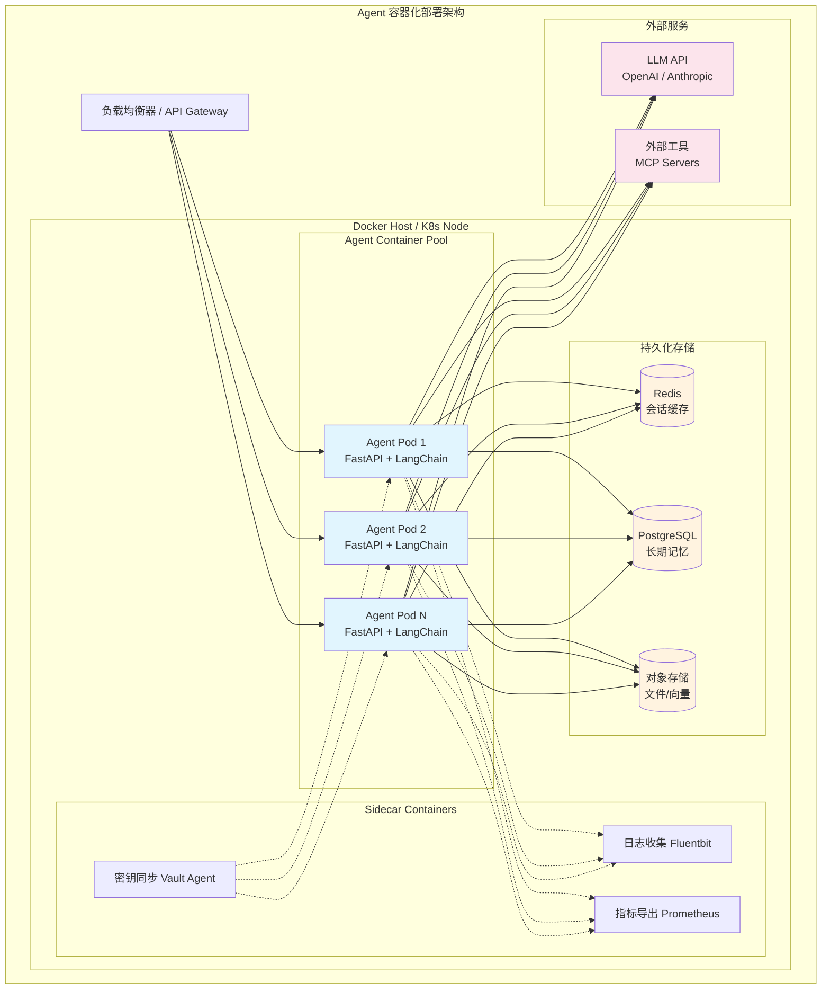
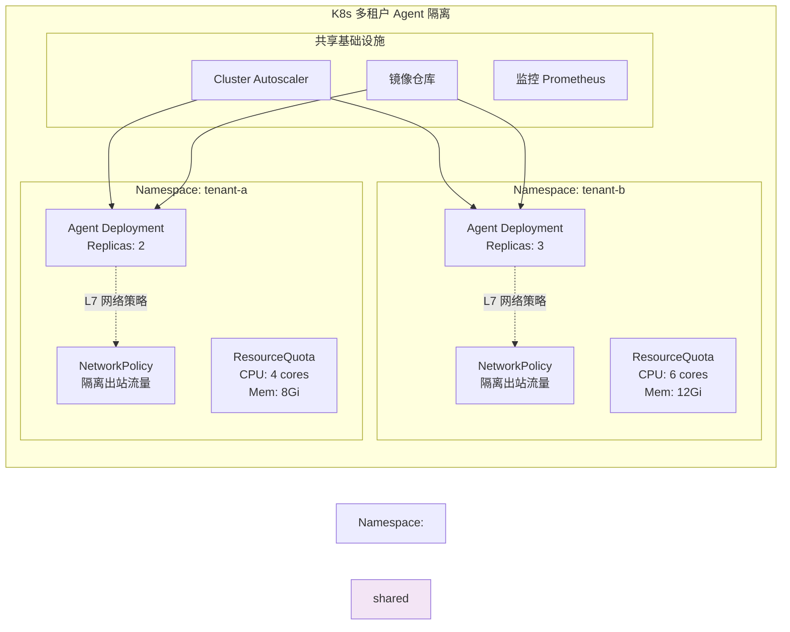
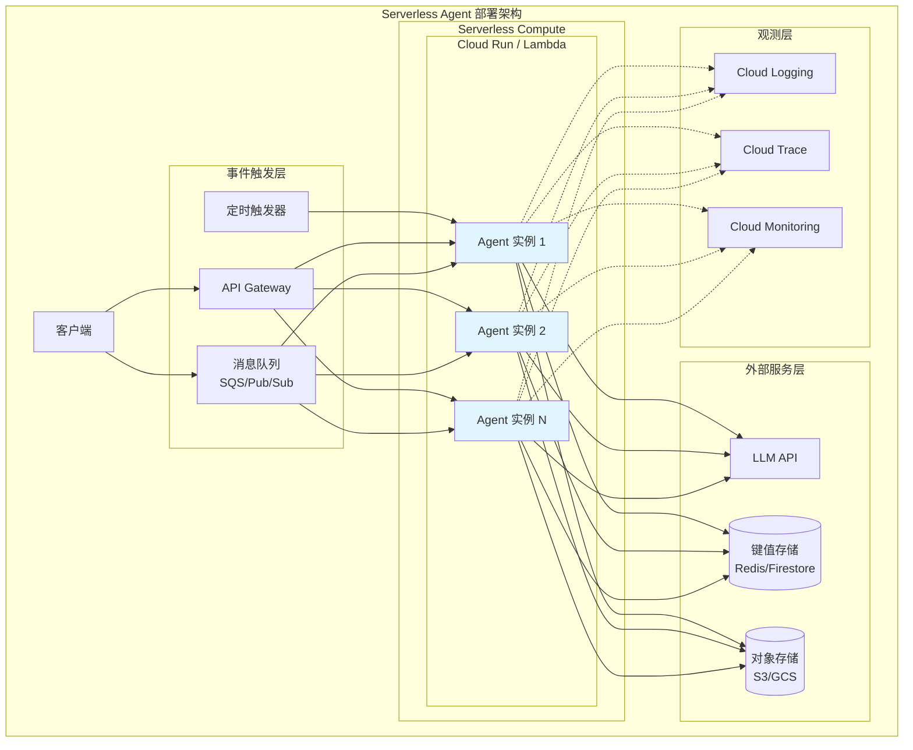
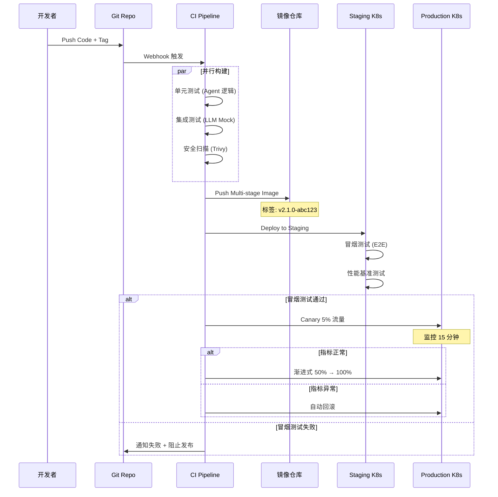

# Agent 容器化与编排：Docker、K8s、Serverless 生产部署指南

## Executive Summary

AI Agent 从原型走向生产，容器化与编排是不可逾越的工程化步骤。本报告系统梳理了 2024-2026 年间将 AI Agent 系统部署到生产环境的主流技术栈与最佳实践，覆盖 Docker 容器化、Kubernetes 编排、Serverless 部署三大路径，以及配置管理、部署流水线等关键基础设施。

核心发现：
- **容器化是 Agent 生产部署的事实标准**：Docker 多阶段构建可将 Agent 镜像压缩至 200MB 以下，遵循 Twelve-Factor App 原则是基础保障[1][2]。
- **K8s 编排需区分有状态/无状态**：无状态 Agent 用 Deployment + HPA 实现弹性扩缩；有状态 Agent（含记忆、会话上下文）需 StatefulSet + PVC 保证身份稳定和数据持久[3][4]。
- **Serverless 适用场景有限但成本优势明显**：Google Cloud Run 可缩至零且支持自定义容器，是轻量 Agent 的首选；AWS Lambda 受执行时长限制（15min），不适合长对话 Agent[5][6][7]。
- **LLM API 的超时与重试是容器化 Agent 的核心工程挑战**：需在应用层实现指数退避 + 断路器模式，而非依赖容器编排层[8]。
- **多租户隔离需组合使用 Namespace、ResourceQuota 和 NetworkPolicy**：单纯靠容器隔离无法满足安全需求[4]。

---

## 1. Docker 容器化 Agent 的最佳实践

### 1.1 镜像优化策略

Agent 系统通常依赖 Python + LLM SDK（如 OpenAI、LangChain），镜像膨胀是首要挑战。Docker 官方推荐的最佳实践包括[1]：

**多阶段构建（Multi-stage Build）**：将构建环境与运行环境分离，最终镜像只包含运行时依赖。

```dockerfile
# 阶段1：构建依赖
FROM python:3.12-slim AS builder
WORKDIR /app
COPY requirements.txt .
RUN pip install --no-cache-dir --prefix=/install -r requirements.txt

# 阶段2：运行时镜像
FROM python:3.12-slim
WORKDIR /app
COPY --from=builder /install /usr/local
COPY . .
USER 1000:1000
EXPOSE 8000
CMD ["python", "-m", "uvicorn", "main:app", "--host", "0.0.0.0"]
```

**基础镜像选择原则**：
- 优先使用 Distroless 或 Alpine（减少攻击面）
- 固定版本标签（`python:3.12.8-slim`），禁止使用 `latest`
- 使用 `.dockerignore` 排除 `.git`、`__pycache__`、`.env` 等无关文件

**镜像分层优化**：将变化频率低的层（依赖安装）放在前面，变化频繁的层（代码复制）放在后面，最大化利用 Docker 缓存[1]。

### 1.2 环境变量管理

Agent 系统的配置高度依赖环境变量——API 密钥、模型端点、温度参数等。遵循 Twelve-Factor App 原则[2]：

```yaml
# docker-compose.yml 示例
services:
  agent:
    build: .
    environment:
      - OPENAI_API_KEY=${OPENAI_API_KEY}
      - AGENT_MODEL=gpt-4o
      - AGENT_TEMPERATURE=0.7
      - LOG_LEVEL=INFO
    env_file:
      - .env.production
    volumes:
      - ./agent-memory:/data/memory  # 有状态数据持久化
```

**最佳实践**：
- 敏感信息通过 Secret 注入，不在镜像中硬编码
- 区分配置（Config）与密钥（Secret）的管理策略
- 运行时配置与构建时配置分离

### 1.3 Agent 容器化架构



---

## 2. Kubernetes 编排 Agent 集群

### 2.1 Deployment vs StatefulSet：有状态 vs 无状态 Agent

Agent 系统的部署模式选择取决于其**状态持有方式**[3][4]：

| 维度 | 无状态 Agent（Deployment） | 有状态 Agent（StatefulSet） |
|------|--------------------------|--------------------------|
| **会话存储** | 外部化（Redis/DB） | 本地 + 外部 |
| **身份标识** | 临时 Pod 名 | 稳定 DNS（agent-0, agent-1） |
| **扩缩速度** | 快（秒级） | 慢（有序创建） |
| **存储绑定** | 无需 PVC | 需要 PVC（VolumeClaimTemplates） |
| **适用场景** | REST API Agent、推理无状态 | 长期对话 Agent、记忆持久化 Agent |
| **滚动更新** | 并行替换 | 有序替换（默认从 N-1 到 0） |

**无状态 Agent Deployment 示例**：

```yaml
apiVersion: apps/v1
kind: Deployment
metadata:
  name: agent-api
spec:
  replicas: 3
  strategy:
    type: RollingUpdate
    rollingUpdate:
      maxSurge: 1
      maxUnavailable: 0
  selector:
    matchLabels:
      app: agent-api
  template:
    metadata:
      labels:
        app: agent-api
    spec:
      containers:
      - name: agent
        image: registry.example.com/agent:v2.1.0
        ports:
        - containerPort: 8000
        resources:
          requests:
            cpu: "500m"
            memory: "1Gi"
          limits:
            cpu: "2000m"
            memory: "2Gi"
        livenessProbe:
          httpGet:
            path: /health
            port: 8000
          initialDelaySeconds: 15
          periodSeconds: 10
        readinessProbe:
          httpGet:
            path: /ready
            port: 8000
          initialDelaySeconds: 5
          periodSeconds: 5
        envFrom:
        - configMapRef:
            name: agent-config
        - secretRef:
            name: agent-secrets
```

**有状态 Agent StatefulSet 示例**：

```yaml
apiVersion: apps/v1
kind: StatefulSet
metadata:
  name: agent-session
spec:
  serviceName: "agent-session"
  replicas: 3
  selector:
    matchLabels:
      app: agent-session
  template:
    metadata:
      labels:
        app: agent-session
    spec:
      containers:
      - name: agent
        image: registry.example.com/agent-stateful:v2.1.0
        resources:
          requests:
            cpu: "1000m"
            memory: "2Gi"
          limits:
            cpu: "4000m"
            memory: "4Gi"
        volumeMounts:
        - name: agent-memory
          mountPath: /data/memory
  volumeClaimTemplates:
  - metadata:
      name: agent-memory
    spec:
      accessModes: ["ReadWriteOnce"]
      storageClassName: fast-ssd
      resources:
        requests:
          storage: 10Gi
```

### 2.2 HPA 自动扩缩

Kubernetes HPA（Horizontal Pod Autoscaler）通过控制循环（默认 15 秒间隔）监控指标并调整副本数[4]。对于 Agent 工作负载，推荐配置：

```yaml
apiVersion: autoscaling/v2
kind: HorizontalPodAutoscaler
metadata:
  name: agent-hpa
spec:
  scaleTargetRef:
    apiVersion: apps/v1
    kind: Deployment
    name: agent-api
  minReplicas: 2
  maxReplicas: 20
  metrics:
  - type: Resource
    resource:
      name: cpu
      target:
        type: Utilization
        averageUtilization: 70
  - type: Resource
    resource:
      name: memory
      target:
        type: Utilization
        averageUtilization: 80
  behavior:
    scaleUp:
      stabilizationWindowSeconds: 60
      policies:
      - type: Pods
        value: 2
        periodSeconds: 60
    scaleDown:
      stabilizationWindowSeconds: 300
      policies:
      - type: Pods
        value: 1
        periodSeconds: 120
```

**Agent HPA 的特殊考量**：
- **冷启动延迟**：Agent 初始化（加载模型、连接向量库）可能需 10-30 秒，HPA 缩容窗口应设长（300s+）
- **自定义指标**：可用 Prometheus Adapter 将"并发请求数"或"Token 消耗率"作为扩缩指标
- **扩缩速率限制**：Agent 扩容过快可能导致 LLM API 限流，需设 rate limiting

### 2.3 服务发现与网络

Agent 集群内部服务发现推荐模式：

| 场景 | K8s 资源 | 说明 |
|------|---------|------|
| Agent API 对外暴露 | Ingress + Service (ClusterIP) | 标准 HTTP/gRPC 入口 |
| Agent 间通信 | Service (ClusterIP) | 同 namespace 内 DNS 直接可达 |
| 跨 namespace Agent | Service + NetworkPolicy | 需显式放行流量 |
| 外部 LLM 调用 | ExternalName Service 或直接 HTTPS | 对 LLM API 做 DNS 级别抽象 |

### 2.4 多租户资源隔离



多租户 Agent 的隔离层次[4]：

| 隔离层级 | K8s 机制 | 保护内容 |
|---------|---------|---------|
| 计算资源 | ResourceQuota + LimitRange | CPU/内存上限，避免互相挤占 |
| 网络 | NetworkPolicy + Namespace | 限制 Agent 间通信，防止跨租户数据泄露 |
| 存储 | PV 绑定特定 StorageClass | 每个租户独立存储卷 |
| 访问控制 | RBAC + ServiceAccount | 细粒度 API 权限 |
| LLM API 限流 | 应用层实现 | 每租户独立 API Key + 配额 |

---

## 3. Serverless 部署方案对比

### 3.1 三大 Serverless 平台

| 维度 | AWS Lambda | Google Cloud Run | Azure Functions |
|------|-----------|-----------------|-----------------|
| **执行时长上限** | 15 分钟 | 60 分钟（可配置） | 无限制（Premium）/ 10 分钟（Consumption） |
| **最大内存** | 10 GB | 32 GB | 14 GB |
| **冷启动** | 较慢（Java/Python 3-10s） | 快（Java 用 GraalVM） | 中等 |
| **容器支持** | 有限（镜像部署） | 原生支持（核心功能） | Container Apps 方案 |
| **缩至零** | ✅ | ✅ | ✅ |
| **GPU 支持** | ❌（仅推理优化实例） | ✅（2025+ 支持） | ❌ |
| **Agent 适用性** | 轻量推理、事件触发 | **最适合**（容器原生 + 长执行） | 工作流编排（Durable Functions） |
| **定价模型** | 按调用次数 + 执行时长 | 按 CPU/内存秒数 | 按执行次数 + 资源消耗 |

**关键结论**：Google Cloud Run 因其**原生容器支持、长执行时间、GPU 可用性和快速冷启动**，是 Serverless 部署 Agent 的首选[5]。Azure Functions 的 Durable Functions 适合需要持久编排的工作流[7]。AWS Lambda 受 15 分钟限制，仅适合短任务 Agent[6]。

### 3.2 Cloud Run 部署 Agent 示例

```yaml
# service.yaml - Cloud Run 服务配置
apiVersion: serving.knative.dev/v1
kind: Service
metadata:
  name: ai-agent
  annotations:
    run.googleapis.com/launch-stage: GA
spec:
  template:
    metadata:
      annotations:
        autoscaling.knative.dev/minScale: "0"
        autoscaling.knative.dev/maxScale: "100"
        run.googleapis.com/cpu-throttling: "false"
    spec:
      containerConcurrency: 80
      timeoutSeconds: 300
      containers:
      - image: gcr.io/my-project/agent:latest
        ports:
        - containerPort: 8000
        resources:
          limits:
            cpu: "4"
            memory: "8Gi"
        env:
        - name: OPENAI_API_KEY
          value: "secret://projects/my-project/secrets/openai-key/versions/latest"
  traffic:
  - percent: 100
    latestRevision: true
```

### 3.3 Serverless Agent 架构



---

## 4. 生产环境配置管理

### 4.1 配置热更新

Agent 系统需要动态调整参数（模型切换、温度调节、Prompt 更新），不重启容器[4]：

| 方案 | 工具 | 更新延迟 | 复杂度 |
|------|------|---------|--------|
| ConfigMap 挂载 | K8s 原生 | 秒级（依赖 kubelet 同步） | 低 |
| Watch + Reload | 应用内实现 | 秒级 | 中 |
| 外部配置中心 | Consul / etcd / Nacos | 毫秒级 | 高 |
| 版本化配置 | GitOps (ArgoCD/Flux) | 分钟级 | 中 |

**推荐方案**：ConfigMap 挂载 + 应用内文件 Watch。Agent 进程监听配置文件变化，收到 SIGHUP 或 inotify 事件后重新加载配置，无需重启。

### 4.2 密钥管理

```yaml
# K8s Secret + 外部密钥管理器集成
apiVersion: v1
kind: Secret
metadata:
  name: agent-secrets
  annotations:
    # 使用 External Secrets Operator 从 AWS SM / HashiCorp Vault 同步
    reflector.v1.elpis.tv/autocreate: "true"
type: Opaque
stringData:
  OPENAI_API_KEY: "sk-xxx"
  DB_PASSWORD: "xxx"
  JWT_SECRET: "xxx"
```

K8s Secrets 默认明文存储在 etcd 中，生产环境建议[4][10]：
- 启用 etcd 加密（EncryptionConfiguration）
- 使用 External Secrets Operator 对接 Vault / AWS Secrets Manager
- RBAC 限制 Secret 读取权限到具体 ServiceAccount
- 定期轮换密钥

### 4.3 资源限制

Agent 工作负载的资源规划关键点[4]：

| 资源 | 建议 | 说明 |
|------|------|------|
| **CPU Request** | 0.5-2 核 | Agent 空闲时较低，处理请求时峰值较高 |
| **CPU Limit** | Request × 2-4 | 允许突发，但防止失控 |
| **Memory Request** | 1-4 GiB | 包含 Python runtime + SDK + 轻量缓存 |
| **Memory Limit** | Request × 1.5 | Agent 内存使用较稳定，OOM Kill 应避免 |
| **Ephemeral Storage** | 5-20 GiB | 日志、临时文件、模型缓存 |
| **超时** | 30-300 秒 | 取决于 Agent 任务复杂度 |

---

## 5. 部署流水线

### 5.1 CI/CD for Agent

Agent 系统的部署流水线与传统微服务类似，但有特殊考量[9]：



### 5.2 蓝绿部署 vs 滚动更新

| 策略 | 原理 | Agent 适用性 | 资源开销 |
|------|------|------------|---------|
| **滚动更新** | K8s 默认策略，逐步替换 Pod | ✅ 最常用 | 低（最多额外 1 个 Pod） |
| **蓝绿部署** | 维护两套环境，切换流量 | ✅ 适合大版本升级 | 高（2× 资源） |
| **Canary** | 新版本先接收小比例流量 | ✅ Agent 风险控制首选 | 中（额外 1-2 Pod） |
| **A/B 测试** | 按用户/请求特征分流 | ⚠️ 需要 Agent 网关支持 | 中 |

**Agent 特殊考量**：Agent 版本升级可能改变行为模式（Prompt 优化、工具调用逻辑），推荐 Canary 部署 + 业务指标监控（响应质量、用户满意度）+ 自动回滚[9]。

### 5.3 生产检查清单

Agent 部署到生产前的必查项：

- [ ] 镜像已扫描（Trivy/Snyk），无高危漏洞
- [ ] 资源 Request/Limit 已设置，且经过压测验证
- [ ] 健康检查端点（liveness/readiness）已实现
- [ ] LLM API 超时和重试已配置（推荐：30s 超时 + 3 次重试 + 指数退避）
- [ ] 日志输出为结构化 JSON（便于 ELK/Loki 解析）
- [ ] 监控告警已配置（CPU、内存、错误率、LLM API 延迟）
- [ ] 密钥通过 Secret 注入，无硬编码
- [ ] 配置热更新机制已验证
- [ ] 回滚脚本已准备且可一键执行
- [ ] 多租户隔离策略已定义（Namespace/NetworkPolicy）

---

## 6. 关键问题解答

### 6.1 Agent 有状态 vs 无状态部署

**核心区别在于"记忆"存储位置**：

| 有状态 Agent | 无状态 Agent |
|-------------|-------------|
| 会话上下文存储在容器本地 | 会话上下文存储在外部（Redis/DB） |
| 需要 StatefulSet + PVC | 可用 Deployment |
| Pod 重启 = 数据丢失风险 | Pod 重启 = 无影响 |
| 横向扩缩受限（状态分散） | 自由扩缩 |
| 适用：长期对话、个人化 Agent | 适用：REST API、批处理 Agent |

**建议**：生产环境优先设计为无状态，将记忆外部化到 Redis（短期）+ PostgreSQL/向量数据库（长期），保留可选的本地缓存作为性能优化[3]。

### 6.2 LLM API 超时与重试

容器环境下的 LLM 调用必须在**应用层**而非基础设施层处理[8]：

```python
# 推荐实现：指数退避 + 断路器
import httpx
from tenacity import retry, stop_after_attempt, wait_exponential

class LLMClient:
    def __init__(self):
        self.timeout = httpx.Timeout(30.0, connect=5.0)
        self.circuit_breaker = CircuitBreaker(
            failure_threshold=5,
            recovery_timeout=60
        )

    @retry(
        stop=stop_after_attempt(3),
        wait=wait_exponential(multiplier=1, min=2, max=30),
        retry=retry_if_exception_type((httpx.TimeoutException, httpx.HTTPStatusError))
    )
    async def call_llm(self, prompt: str) -> str:
        async with httpx.AsyncClient(timeout=self.timeout) as client:
            response = await client.post(
                "https://api.openai.com/v1/chat/completions",
                headers={"Authorization": f"Bearer {self.api_key}"},
                json={"model": "gpt-4o", "messages": [{"role": "user", "content": prompt}]}
            )
            response.raise_for_status()
            return response.json()["choices"][0]["message"]["content"]
```

**为什么不放在 K8s 层面**：
- LLM API 返回 429（限流）时应等待后重试，K8s 会直接视为失败
- LLM 调用可能耗时 30-120 秒，超过 K8s 默认超时
- 断路器需要应用级状态，K8s 无法感知

### 6.3 多租户 Agent 资源隔离

分层隔离策略[4]：

1. **基础设施层**：Namespace 隔离 + ResourceQuota 限制 + LimitRange 设默认值
2. **网络层**：NetworkPolicy 限制跨租户通信 + 服务网格（Istio）做 L7 流量管理
3. **数据层**：每个租户独立数据库/Schema + Redis Key 前缀隔离
4. **LLM API 层**：每个租户独立 API Key + 应用层 Rate Limiting
5. **审计层**：每个租户独立日志流 + 调用记录追踪

---

## 7. 技术选型决策树

| 决策点 | 推荐路径 |
|--------|---------|
| Agent 是否需要 GPU 推理？ | 是 → K8s（节点池选 GPU 实例）/ 否 → 继续判断 |
| 是否有长时间运行的 Agent？ | 是 → K8s Deployment/StatefulSet / 否 → 继续判断 |
| 是否有突发流量、低频调用？ | 是 → Cloud Run（缩至零）/ 否 → 继续判断 |
| 是否需要精细的多租户隔离？ | 是 → K8s（Namespace + NetworkPolicy）/ 否 → 继续判断 |
| 团队是否有 K8s 运维能力？ | 是 → K8s / 否 → Cloud Run 或 Lambda |

---

<!-- REFERENCE START -->

## 参考文献

1. Docker. "Building best practices" (2026). https://docs.docker.com/build/building/best-practices/ — 访问时间: 2026-03-31
2. The Twelve-Factor App. "Config, Processes, Disposability" (2012, still authoritative). https://12factor.net/ — 访问时间: 2026-03-31
3. Kubernetes. "Deployments" (2026). https://kubernetes.io/docs/concepts/workloads/controllers/deployment/ — 访问时间: 2026-03-31
4. Kubernetes. "StatefulSets", "Horizontal Pod Autoscaling", "Secrets" (2026). https://kubernetes.io/docs/concepts/workloads/controllers/statefulset/ — 访问时间: 2026-03-31
5. Google Cloud. "What is Cloud Run" (2026). https://docs.cloud.google.com/run/docs/overview/what-is-cloud-run — 访问时间: 2026-03-31
6. AWS. "Serverless Computing - AWS Lambda" (2026). https://aws.amazon.com/lambda/ — 访问时间: 2026-03-31
7. Microsoft. "Azure Functions overview" (2025-03). https://learn.microsoft.com/en-us/azure/azure-functions/functions-overview — 访问时间: 2026-03-31
8. Kubernetes. "Horizontal Pod Autoscaling" (2026). https://kubernetes.io/docs/concepts/workloads/autoscaling/horizontal-pod-autoscale/ — 访问时间: 2026-03-31
9. Docker. "Multi-stage builds" (2026). https://docs.docker.com/build/building/multi-stage/ — 访问时间: 2026-03-31
10. Kubernetes. "Good practices for Kubernetes Secrets" (2026). https://kubernetes.io/docs/concepts/security/secrets-good-practices/ — 访问时间: 2026-03-31
