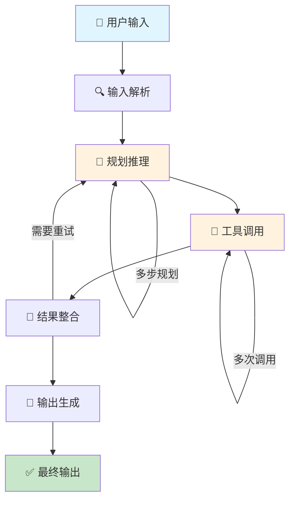
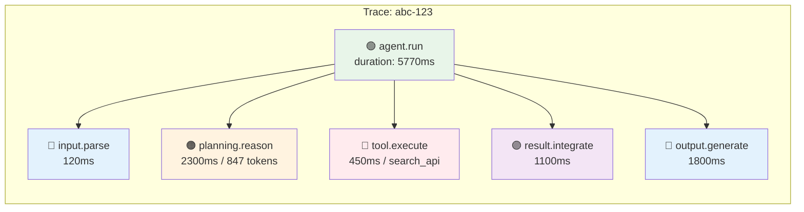
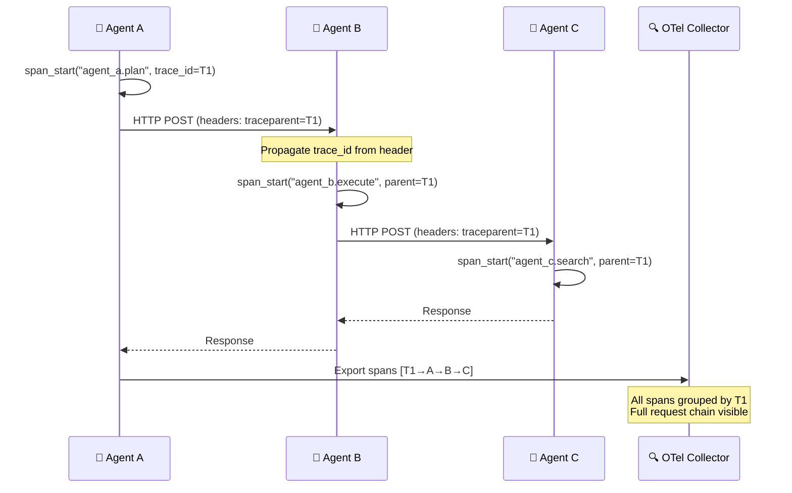

# Agent 决策链路追踪：从输入到输出的全链路 Debug

## Executive Summary

当 Agent 行为异常时，开发者面临的核心挑战是：**从用户输入到最终输出之间，经过了输入解析、规划推理、工具调用、结果整合、输出生成等多个环节，任何一个环节的失败都可能导致不可预测的结果**。传统的日志打印和断点调试已经无法满足非确定性 AI 系统的需求——我们需要专门的链路追踪（Tracing）技术。

本报告系统梳理了 Agent 请求的完整链路，分析每个环节的典型故障模式，并对比三大主流调试工具（LangSmith、Langfuse、OpenTelemetry）的追踪能力。核心结论：**基于 Trace + Span 的分布式追踪是调试 Agent 系统的基础设施**，开发者应在设计阶段就嵌入追踪能力，而非事后补加。

---

## 1. Agent 请求的完整链路

### 1.1 链路全景

一个典型的 Agent 请求从用户输入到最终输出，经历五个核心环节。每个环节都有独立的输入、处理逻辑和输出，同时也都是潜在的故障点。



### 1.2 各环节职责与故障模式

**环节 1：输入解析（Input Parsing）**

输入解析负责将用户原始输入转化为 Agent 可处理的结构化数据。包括意图识别、实体提取、上下文补全等。

| 故障类型 | 表现 | 根因 |
|---------|------|------|
| 意图误识别 | Agent 执行了用户未请求的操作 | Prompt 模糊、训练数据偏差 |
| 实体提取失败 | 缺少关键参数 | NER 模型局限、边界情况 |
| 上下文丢失 | 多轮对话中遗忘前文 | 窗口截断策略不当 |

**环节 2：规划推理（Planning & Reasoning）**

规划环节决定 Agent 如何分解任务、选择策略。这是 Agent 与传统 Chatbot 的核心差异点[1][2]。

| 故障类型 | 表现 | 根因 |
|---------|------|------|
| 幻觉规划 | 制定不存在的步骤 | LLM 幻觉 |
| 循环规划 | 反复制定相同计划 | 缺少进度追踪 |
| 死胡同规划 | 规划无法执行的路径 | 工具发现不完整 |

**环节 3：工具调用（Tool Invocation）**

工具调用是 Agent 与外部世界交互的桥梁，也是故障率最高的环节[3]。

| 故障类型 | 表现 | 根因 |
|---------|------|------|
| 参数错误 | API 调用返回 400/422 | 参数类型不匹配 |
| 超时 | 长时间无响应 | 网络延迟、API 限流 |
| 幻觉工具 | 调用不存在的工具 | Prompt 注入、模型幻觉 |

**环节 4：结果整合（Result Integration）**

将工具返回的原始数据转化为下一步可用的上下文。

| 故障类型 | 表现 | 根因 |
|---------|------|------|
| 格式解析失败 | JSON/XML 解析错误 | 工具返回非预期格式 |
| 信息丢失 | 关键数据被过滤 | 上下文窗口限制 |
| 冲突整合 | 多个工具返回矛盾数据 | 缺少冲突解决策略 |

**环节 5：输出生成（Output Generation）**

将整合后的结果转化为最终用户输出。

| 故障类型 | 表现 | 根因 |
|---------|------|------|
| 格式不符 | 输出不符合用户期望 | Prompt 格式约束不足 |
| 幻觉内容 | 捏造工具未返回的数据 | LLM 填充模式 |
| 安全泄露 | 输出包含系统 prompt | Prompt 注入攻击 |

### 1.3 链路追踪时序图

链路追踪的核心在于捕获每个环节的输入输出、耗时和状态。以下是带有 Trace/Span 的完整请求时序：

```mermaid
sequenceDiagram
    participant U as 👤 User
    agent P as 📋 Planner
    participant T as 🔧 Tool
    participant L as 🧠 LLM
    participant Tr as 🔍 Tracer

    U->>P: User Input
    Note over P: Trace ID: abc-123

    %% Span 1: Input Parsing
    P->>Tr: span_start("input.parse")
    P->>P: Intent Recognition
    P->>Tr: span_end("input.parse", latency=120ms)

    %% Span 2: Planning
    P->>Tr: span_start("planning.reason")
    P->>L: Query: "How to solve X?"
    L-->>P: Plan: [step1, step2, step3]
    P->>Tr: span_end("planning.reason", latency=2300ms, tokens=847)

    %% Span 3: Tool Call
    P->>Tr: span_start("tool.execute", tool="search_api")
    P->>T: POST /search?q=X
    T-->>P: {results: [...]}
    P->>Tr: span_end("tool.execute", latency=450ms)

    %% Span 4: Integration
    P->>Tr: span_start("result.integrate")
    P->>L: Integrate results with plan
    L-->>P: Updated context
    P->>Tr: span_end("result.integrate", latency=1100ms)

    %% Span 5: Output Generation
    P->>Tr: span_start("output.generate")
    P->>L: Generate final answer
    L-->>P: "Based on research..."
    P->>Tr: span_end("output.generate", latency=1800ms)

    P->>U: Final Response
    Note over P: Total Trace: abc-123<br/>Duration: 5770ms<br/>Spans: 5
```

### 1.4 Trace 与 Span 数据模型

每个 Trace 包含多个 Span，Span 之间通过 `parent_span_id` 形成树状结构。以下是 Agent 请求中典型的 Span 层级：



每个 Span 的关键属性包括：

| 属性 | 说明 | 示例 |
|------|------|------|
| `trace_id` | 全链路唯一标识 | `abc-123-def-456` |
| `span_id` | 当前 Span 唯一标识 | `span-001` |
| `parent_span_id` | 父 Span ID（根 Span 为空） | `span-000` |
| `name` | 操作名称 | `tool.execute` |
| `start_time` | 开始时间戳 | `2025-03-25T10:00:00Z` |
| `end_time` | 结束时间戳 | `2025-03-25T10:00:00.450Z` |
| `attributes` | 自定义属性 | `{"tool": "search_api", "query": "X"}` |
| `status` | 状态（OK/ERROR） | `OK` |
| `events` | 里程碑事件 | `[{"name": "retry", "time": "..."}]` |

---

## 2. 上下文传播与关联标识

### 2.1 上下文传播机制

在分布式 Agent 系统中（尤其是多 Agent 协作场景），Trace 信息需要在不同组件间传播。OpenTelemetry 定义了标准的上下文传播协议[4]。



### 2.2 关键关联标识

多 Agent 系统中需要以下标识来关联不同维度的数据：

| 标识 | 作用 | 示例 |
|------|------|------|
| `trace_id` | 关联整个请求链路 | 所有 Span 共享 |
| `session_id` | 关联多轮对话 | 同一用户会话 |
| `agent_id` | 标识具体 Agent | `planner-v2` |
| `run_id` | 标识单次执行 | 用于重放调试 |
| `correlation_id` | 跨系统关联 | 对接外部服务 |

---

## 3. 主流调试工具对比

### 3.1 工具概览

2025 年主流的 Agent 调试工具可按定位分为三类：框架绑定型、开源通用型和标准协议型[5][6]。

| 维度 | LangSmith | Langfuse | OpenTelemetry + 生态 |
|------|-----------|----------|---------------------|
| **定位** | LangChain 专属调试平台 | 开源 LLM 工程平台 | 厂商中立的遥测标准 |
| **开源** | SaaS 为主 | ✅ Apache 2.0 | ✅ CNCF 毕业项目 |
| **自部署** | ❌ (仅 SaaS) | ✅ Docker / K8s | ✅ 任意后端 |
| **核心能力** | Trace + Eval + Dataset | Trace + Prompt + Eval | Trace + Metrics + Logs |
| **框架绑定** | LangChain/LangGraph 深度集成 | 框架无关 + SDK | 框架无关 + Semantic Conventions |
| **Agent 可视化** | 独立 Agent Timeline | Trace 瀑布图 | 依赖后端 UI（Jaeger/Grafana） |
| **成本追踪** | ✅ Token + Cost | ✅ Token + Cost | ✅ 通过 OTel GenAI Conventions |
| **多 Agent 支持** | ✅ 子 Agent Span 层级 | ✅ 嵌套 Trace | ✅ W3C TraceContext |

### 3.2 LangSmith：深度集成 LangChain 生态

LangSmith 是 LangChain 团队推出的调试平台，与 LangChain/LangGraph 深度集成[7]。其核心功能包括：

**Trace 可视化**：LangSmith 自动捕获 LangChain 链/Agent 的每一步执行，以时间线形式展示。每个 LLM 调用、工具调用、中间步骤都被记录为独立的 Span。

**Agent 调试**：2025 年推出 Polly AI 助手，支持通过对话分析 Trace 数据。开发者可以直接问："这个 Agent 为什么在第 15 步失败？"[7]

**Dataset 驱动的 Eval**：将生产 Trace 转化为 Dataset，结合自动化评估器（Evaluator）持续验证 Agent 行为。

**适用场景**：
- 使用 LangChain/LangGraph 构建的 Agent 系统
- 需要快速上手、不想搭建基础设施的团队
- 需要 Dataset + Eval 闭环的场景

**局限**：
- SaaS 模式，数据存储在第三方
- 对非 LangChain 框架支持有限
- 免费额度有限，大规模使用成本高

### 3.3 Langfuse：开源 LLM 可观测性平台

Langfuse 是 Apache 2.0 开源的 LLM 可观测性平台，支持自部署，框架无关[8]。

**核心能力**：
- **Trace 记录**：支持任意框架的 Trace 上报，提供嵌套 Span 可视化
- **Prompt 管理**：版本化管理 Prompt，支持 A/B 测试
- **成本分析**：自动计算 Token 使用量和成本
- **评估引擎**：支持 LLM-as-Judge、人工反馈等多种评估方式

**集成方式**：
```python
# Langfuse SDK 集成示例
from langfuse.openai import openai  # 自动追踪 OpenAI 调用
from langfuse import Langfuse

langfuse = Langfuse()

# 手动创建 Trace
trace = langfuse.trace(name="agent-query", user_id="user-123")
span = trace.span(name="tool-search", input={"query": "X"})
# ... 执行工具 ...
span.end(output={"results": [...]})
```

**适用场景**：
- 需要自部署、数据不出内网的团队
- 使用多种 Agent 框架（LangGraph、CrewAI、AutoGen 等）
- 需要 Prompt 管理和版本化

**局限**：
- 社区版功能有限（50k 事件/月免费）
- 多 Agent 复杂场景的可视化不如 LangSmith 直观

### 3.4 OpenTelemetry：厂商中立的遥测标准

OpenTelemetry（OTel）是 CNCF 毕业项目，定义了分布式追踪、指标和日志的标准[4]。2025 年，OTel GenAI 特别兴趣组正在制定 AI Agent 的语义约定（Semantic Conventions）。

**AI Agent 语义约定**（2025 年草案）[4]：

| 属性 | 说明 | 示例 |
|------|------|------|
| `gen_ai.system` | 模型提供商 | `openai`, `anthropic` |
| `gen_ai.request.model` | 使用的模型 | `gpt-4o` |
| `gen_ai.usage.input_tokens` | 输入 Token 数 | `1247` |
| `gen_ai.usage.output_tokens` | 输出 Token 数 | `389` |
| `gen_ai.operation.name` | 操作类型 | `chat`, `completion` |
| `gen_ai.agent.name` | Agent 名称 | `planner` |
| `gen_ai.tool.call.name` | 工具名称 | `search` |

**插桩方式**：

```python
# 使用 OpenLLMetry 进行 OTel 插桩
from opentelemetry.sdk.trace import TracerProvider
from opentelemetry.trace import set_tracer_provider
from openinference.instrumentation.openai import OpenAIInstrumentor

set_tracer_provider(TracerProvider())
OpenAIInstrumentor().instrument()  # 自动捕获所有 OpenAI 调用
```

**适用场景**：
- 企业级部署，已有 Prometheus/Grafana/Jaeger 等基础设施[10]
- 需要跨框架、跨团队的统一可观测性
- 需要与现有 APM 系统（Datadog、New Relic 等）集成[9]

**局限**：
- 需要自行搭建后端（Jaeger/Grafana Tempo）
- AI 特定的可视化和评估功能需要额外工具
- 语义约定仍在演进中

### 3.5 工具选型决策矩阵

```mermaid
quadrantChart
    title Agent 调试工具选型
    x-axis "低集成度" --> "高集成度"
    y-axis "低灵活性" --> "高灵活性"
    quadrant-1 "灵活但需投入"
    quadrant-2 "最佳选择"
    quadrant-3 "谨慎选择"
    quadrant-4 "快速上手"
    quadrant-1 "OpenTelemetry + Grafana": [0.8, 0.9]
    quadrant-2 "Langfuse (自部署)": [0.6, 0.7]
    quadrant-4 "LangSmith (SaaS)": [0.8, 0.3]
```

---

## 4. 常见问题定位模式

### 4.1 模式一：瓶颈定位（Latency Profiling）

**场景**：Agent 响应变慢，需要定位耗时最长的环节。

**方法**：查看 Trace 瀑布图，按 Span 耗时排序。

```python
# 分析 Trace 数据定位瓶颈
traces = langfuse.get_traces(project="agent-prod")
for trace in traces:
    spans = trace.get_spans()
    sorted_spans = sorted(spans, key=lambda s: s.duration, reverse=True)
    print(f"Trace {trace.id}: 最慢环节 = {sorted_spans[i].name} ({sorted_spans[i].duration}ms)")
```

**典型发现**：
- 工具调用占总耗时 60%+ → 优化工具响应或添加缓存
- LLM 规划占大头 → 简化 Prompt 或使用更小的模型做规划
- 等待时间（非处理时间）高 → 检查网络延迟和队列积压

### 4.2 模式二：错误回溯（Error Tracing）

**场景**：Agent 输出错误结果，需要定位错误起源。

**方法**：从错误 Span 向上追溯 Parent Span，找到错误传播路径。

| 步骤 | 操作 | 工具支持 |
|------|------|---------|
| 1 | 筛选 `status=ERROR` 的 Span | LangSmith Filter / Langfuse Search |
| 2 | 查看 Span 的 Input/Output 详情 | 所有工具均支持 |
| 3 | 向上追溯 Parent 直到根 Span | Trace 瀑布图 |
| 4 | 对比成功 Trace 的同一环节 | LangSmith Compare / Dataset |

### 4.3 模式三：幻觉检测（Hallucination Detection）

**场景**：Agent 生成了不存在的事实，需要验证哪些信息是模型捏造的。

**方法**：检查 Tool Call Span 的 Output 是否被后续 LLM Span 引用。

```
Trace 结构:
├── tool.search(query="X") → Output: [A, B, C]
└── llm.generate(context=[A, B, C, D]) → Output: "D 是..."

分析: D 在 Tool Output 中不存在 → 幻觉风险！
```

### 4.4 模式四：循环检测（Loop Detection）

**场景**：Agent 进入死循环，反复执行相同操作。

**方法**：比较同一 Trace 内相似 Span 的 Input 是否重复。

```python
# 检测循环模式
spans = trace.get_spans(name="tool.execute")
tool_inputs = [hash(span.input) for span in spans]
if len(tool_inputs) != len(set(tool_inputs)):
    print(f"⚠️ 检测到循环！重复工具调用: {len(tool_inputs) - len(set(tool_inputs))} 次")
```

---

## 5. 最佳实践

### 5.1 追踪嵌入策略

| 阶段 | 策略 | 说明 |
|------|------|------|
| **设计阶段** | 定义 Span 命名规范 | 统一 `agent.run`、`tool.execute`、`llm.generate` 等命名 |
| **开发阶段** | 使用 SDK 手动插桩 | 在关键节点添加 `span_start`/`span_end` |
| **测试阶段** | 验证 Trace 完整性 | 确保每个请求都有完整的 Span 树 |
| **生产阶段** | 配置采样策略 | 100% 错误 Trace + 按比例采样成功 Trace |

### 5.2 关键指标监控

| 指标 | 说明 | 告警阈值示例 |
|------|------|-------------|
| `trace.duration` | 单次请求总耗时 | P99 > 10s |
| `trace.span_count` | Span 数量 | 异常增多可能表示无限循环 |
| `trace.error_rate` | 错误 Trace 占比 | > 5% |
| `tool.call失败率` | 工具调用失败率 | > 10% |
| `llm.hallucination_score` | 幻觉评分 | > 0.3（自定义评估器）|

### 5.3 生产环境注意事项

1. **敏感数据脱敏**：Trace 中可能包含用户输入和 API Key，部署前需脱敏处理
2. **采样策略**：全量 Trace 成本过高，建议 Tail-based Sampling（保留慢请求和错误请求）
3. **数据保留**：Trace 数据量大，建议分层保留（热数据 7 天 / 温数据 30 天 / 冷数据 90 天）
4. **多环境隔离**：开发、测试、生产环境的 Trace 数据应分离存储

---

## 6. 结论

Agent 决策链路追踪不是"锦上添花"，而是生产级 Agent 系统的**必备基础设施**。核心建议：

1. **尽早嵌入追踪**：在设计阶段定义 Span 规范，而不是事后补加
2. **选择合适工具**：LangChain 用户选 LangSmith，多框架团队选 Langfuse，企业级选 OpenTelemetry
3. **建立调试模式**：将瓶颈定位、错误回溯、幻觉检测、循环检测形成标准化流程
4. **持续监控**：将 Trace 指标纳入告警体系，主动发现问题而非被动响应

当 Agent 行为异常时，不要靠猜——**看 Trace，看 Span，看数据流**。

<!-- REFERENCE START -->
## 参考文献

1. Anthropic. Building Effective Agents (2025). https://www.anthropic.com/research/building-effective-agents — accessed 2026-03-25
2. OpenTelemetry. AI Agent Observability - Evolving Standards and Best Practices (2025). https://opentelemetry.io/blog/2025/ai-agent-observability/ — accessed 2026-03-25
3. Maxim AI. Top 5 Leading Agent Observability Tools in 2025 (2025). https://www.getmaxim.ai/articles/top-5-leading-agent-observability-tools-in-2025/ — accessed 2026-03-25
4. OpenTelemetry. GenAI Semantic Conventions (2025). https://opentelemetry.io/docs/specs/semconv/gen-ai/ — accessed 2026-03-25
5. Comet. Best LLM Observability Tools of 2025 (2025). https://www.comet.com/site/blog/llm-observability-tools/ — accessed 2026-03-25
6. Braintrust. 7 Best AI Observability Platforms for LLMs in 2025 (2025). https://www.braintrust.dev/articles/best-ai-observability-platforms-2025 — accessed 2026-03-25
7. LangChain Blog. Debugging Deep Agents with LangSmith (2025). https://blog.langchain.com/debugging-deep-agents-with-langsmith/ — accessed 2026-03-25
8. Langfuse. Comparing Open-Source AI Agent Frameworks (2025). https://langfuse.com/blog/2025-03-19-ai-agent-comparison — accessed 2026-03-25
9. Datadog. LLM Observability natively supports OpenTelemetry GenAI Semantic Conventions (2025). https://www.datadoghq.com/blog/llm-otel-semantic-convention/ — accessed 2026-03-25
10. VictoriaMetrics. AI Agents Observability with OpenTelemetry (2026). https://victoriametrics.com/blog/ai-agents-observability/ — accessed 2026-03-25
