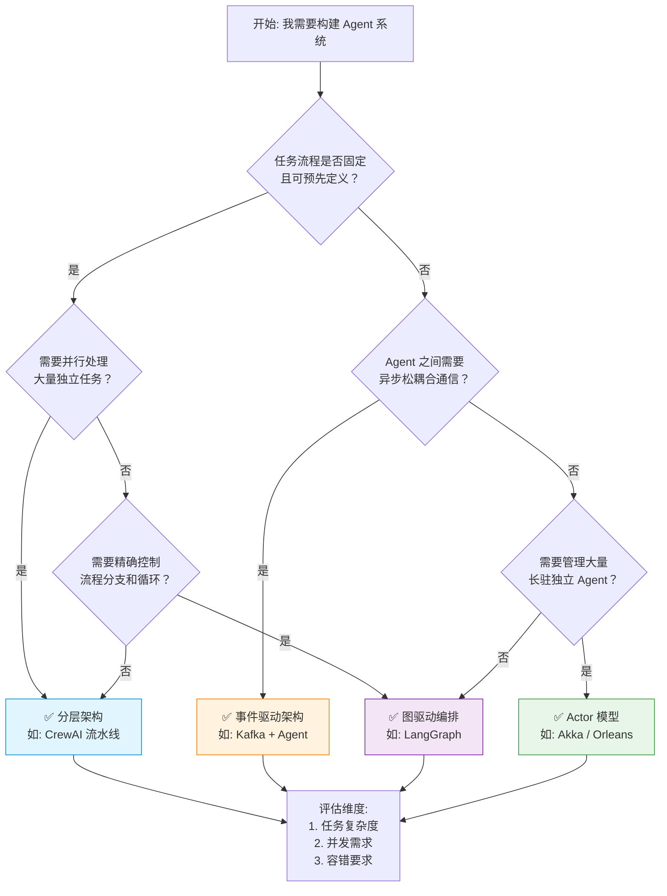
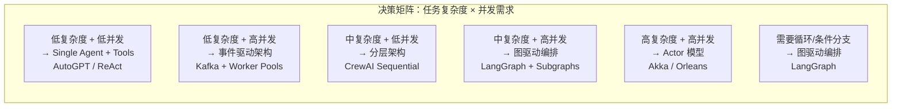

# Agent 架构模式：分层、事件驱动、Actor 模型如何选？

## Executive Summary

Agent 架构模式的选择直接决定了多 Agent 系统的可扩展性、可靠性和维护成本。2024-2026 年间，主流 Agent 框架从早期的单体循环（ReAct Loop）快速分化为四种核心架构范式：**分层架构（Hierarchical）**、**事件驱动架构（Event-Driven）**、**Actor 模型（Actor Model）** 和 **图驱动编排（Graph Orchestration）**。每种模式在控制流表达能力、并发模型、故障隔离和通信拓扑上存在本质差异。

本报告通过对比四种架构模式的原理、适用场景和局限性，并结合 OpenClaw、AutoGPT、LangGraph、CrewAI、AutoGen 等实际框架的架构分析，给出一个**三维度决策框架**（任务复杂度 × 并发需求 × 容错要求），帮助架构师在具体场景中做出合理选型。

**核心结论**：没有银弹。分层架构适合流程固定的业务场景；事件驱动适合高吞吐、松耦合的异步系统；Actor 模型适合需要强隔离和弹性扩展的长驻型 Agent；图驱动编排（如 LangGraph）则是当前 LLM Agent 领域最灵活的通用方案。

---

## 1. 四种主流 Agent 架构模式对比

### 1.1 分层架构（Hierarchical Architecture）

分层架构将系统按职责划分为多个层级（如感知层、规划层、执行层、记忆层），上层向下层传递指令，下层向上层返回结果[1][2]。

**核心特征**：
- **严格的方向性**：信息流通常从上至下（指令）和从下至上（反馈），不存在跨层直接通信
- **职责清晰**：每层只关注自己的抽象级别，降低认知复杂度
- **CrewAI 是典型代表**：其 Role-Based 设计（Manager → Agent → Task）本质上是分层的——Manager Agent 分解任务，Worker Agent 执行，结果逐层汇报[3]

**适用场景**：
- 业务流程固定的场景（如文档审批流水线、ETL 数据管道）
- 团队成员角色明确的多 Agent 协作（如「研究员 → 分析师 → 写手」流水线）
- 需要严格控制权限和访问范围的企业系统

**局限性**：
- 灵活性差：新增或调整层级需要重构
- 跨层通信开销大：中间层容易成为瓶颈
- 不适合需要动态路由或循环迭代的任务

### 1.2 事件驱动架构（Event-Driven Architecture）

事件驱动架构通过事件（Event）实现 Agent 间的松耦合通信。Agent 作为事件的生产者或消费者，通过消息中间件（如 Kafka、Redpanda）异步交互[4][5]。

**核心特征**：
- **发布-订阅模式**：Agent 不需要知道谁消费自己的事件，解耦发送方和接收方
- **异步处理**：事件生产者不等待消费者处理完成，提高吞吐量
- **可追溯性**：事件流天然形成审计日志
- Confluent 提出了四种事件驱动多 Agent 模式：黑板模式（Blackboard）、竞拍模式（Auction）、链式模式（Chain）和监督者模式（Supervisor）[4]

**适用场景**：
- IoT 和实时操作系统（事件源密集、延迟敏感）
- 企业级微服务集成（如 Confluent + Kafka 构建的 Agent 编排）
- 需要水平扩展和弹性伸缩的高吞吐系统

**局限性**：
- 调试困难：异步调用链难以追踪
- 事件排序和一致性保障复杂
- 对于需要强事务性的场景不太适合

### 1.3 Actor 模型（Actor Model）

Actor 模型将每个 Agent 封装为一个独立的 Actor，拥有私有状态和邮箱，通过异步消息传递通信，同一时刻只处理一条消息[6][7]。

**核心特征**：
- **天然隔离**：每个 Actor 拥有独立状态，不存在共享可变状态，无需锁机制
- **故障隔离 + 监督（Supervision）**：父 Actor 可以监控子 Actor，实现 "let it crash" 容错策略
- **弹性扩展**：支持位置透明性（Location Transparency），可无缝跨节点分布式部署
- 主流实现：Akka（JVM）、Orleans（.NET）、Thespian（Python）[6][7][8]

**适用场景**：
- 需要管理数千个长驻 Agent 的系统（如电信、金融交易系统）
- 要求强隔离性和高可用性的企业级部署
- Agent 之间需要频繁、异步通信的场景

**局限性**：
- 学习曲线陡峭：需要理解 Actor 生命周期、消息传递语义
- Python 生态中 Actor 框架相对薄弱（Thespian 成熟度不如 Akka）
- 对于简单任务过于复杂（"用大炮打蚊子"）

### 1.4 图驱动编排（Graph Orchestration）

图驱动编排将 Agent 工作流建模为有向图（Directed Graph），节点（Node）是计算步骤，边（Edge）是状态转移条件。LangGraph 是该模式的代表[3][9]。

**核心特征**：
- **精确控制流**：开发者可以显式定义每一步的转移逻辑，支持条件分支、循环和回退
- **持久化状态**：内置检查点（Checkpointing）机制，支持 Human-in-the-loop
- **流式输出**：支持中间结果的实时流式返回
- **可组合性**：子图可以嵌套，构建复杂的多层级工作流

**适用场景**：
- 需要精确控制流程的复杂工作流（如内容生产管线、代码审查流程）
- 需要 Human-in-the-loop 审批的企业流程
- 需要循环和条件分支的动态任务规划

**局限性**：
- 学习成本较高（需要理解图论和状态管理概念）
- 对于简单任务来说过于复杂
- 图结构越复杂，调试越困难

---

## 2. 架构对比图：Mermaid 可视化

### 图 1：四种 Agent 架构模式对比矩阵

```mermaid
graph TB
    subgraph "分层架构 Hierarchical"
        H1[管理层<br>Task Decomposition]
        H2[协调层<br>Coordination]
        H3[执行层<br>Execution]
        H4[数据层<br>Data Access]
        H1 --> H2 --> H3 --> H4
        H4 -.->|反馈| H3 -.->|汇报| H2 -.->|报告| H1
    end

    subgraph "事件驱动架构 Event-Driven"
        E1[事件生产者<br>Event Producer]
        E2[消息中间件<br>Event Bus / Kafka]
        E3[消费者 A<br>Agent Alpha]
        E4[消费者 B<br>Agent Beta]
        E5[消费者 C<br>Agent Gamma]
        E1 -->|发布事件| E2
        E2 -->|订阅| E3
        E2 -->|订阅| E4
        E2 -->|订阅| E5
        E3 -->|发布新事件| E2
    end

    subgraph "Actor 模型 Actor Model"
        A1[Supervisor Actor]
        A2[Agent Actor A<br>State + Mailbox]
        A3[Agent Actor B<br>State + Mailbox]
        A4[Agent Actor C<br>State + Mailbox]
        A1 -->|消息| A2
        A1 -->|消息| A3
        A1 -->|消息| A4
        A2 <-->|异步消息| A3
        A3 <-->|异步消息| A4
    end

    subgraph "图驱动编排 Graph Orchestration"
        G1((START))
        G2[Plan Node]
        G3{条件判断}
        G4[Research Node]
        G5[Write Node]
        G6[Review Node]
        G7((END))
        G1 --> G2 --> G3
        G3 -->|需要研究| G4 --> G5 --> G6
        G3 -->|直接写作| G5
        G6 -->|需要修改| G4
        G6 -->|通过| G7
    end
```



### 图 2：架构选型决策流程图



---

## 3. 实际案例：主流框架的架构分析

### 3.1 OpenClaw：Gateway + Event-Driven + Skills 插件

OpenClaw 采用 **网关（Gateway）架构**，核心设计是事件驱动的消息路由层[10]：

- **Gateway**：中央网关负责认证、消息路由和会话管理
- **Agent**：处理推理和工具执行，每个 Agent 拥有独立的 Workspace（内存隔离）
- **Skills**：模块化插件系统，通过 ClawHub 分发
- **Nodes**：支持跨设备远程执行，形成分布式拓扑

OpenClaw 的架构本质上是 **事件驱动 + 分层的混合体**：Gateway 接收来自多通道（Telegram/WhatsApp/Discord）的消息事件，路由到对应 Agent，Agent 内部通过 Heartbeat + Cron 实现主动行为。其子 Agent 编排采用 1:N 的主编-探针模式，符合分层架构特征[10]。

### 3.2 AutoGPT：Loop-Based 自主 Agent

AutoGPT 是最早的自主 Agent 框架之一，采用 **Think-Plan-Act 循环架构**[10]：

```
Goal → Think → Plan → Act → Observe → Think → ... → Done
```

核心特征是单一 Agent 在闭环中持续迭代直到完成目标。它本质上是 **管道式架构（Pipeline）** 的变体——每一步都是线性的，Agent 自身既是规划者也是执行者。这种架构在 bounded task（如「写一篇调研报告」）上表现良好，但在复杂多 Agent 协作上能力有限[10][11]。

### 3.3 LangGraph：Stateful Graph Orchestration

LangGraph 是 LangChain 生态中的图编排框架，采用 **有向图 + 持久化状态** 架构[9][10]：

- **节点（Nodes）**：代表计算步骤（Agent 调用、工具执行）
- **边（Edges）**：代表状态转移条件
- **检查点（Checkpointing）**：支持断点恢复和 Human-in-the-loop
- **子图嵌套**：支持模块化复用

LangGraph 适合需要 **精确控制流程** 的场景，是 2025-2026 年 LLM Agent 领域增长最快的框架。根据 2026 年开发者调查，62% 需要复杂状态管理的 Agent 工作流选择了 LangGraph[12]。

### 3.4 CrewAI：Role-Based 分层团队

CrewAI 采用 **角色驱动的分层架构**[3][10]：

- **Crew**：顶层容器，管理一组 Agent
- **Agent**：拥有角色（Role）、目标（Goal）、背景故事（Backstory）
- **Task**：分配给特定 Agent 的工作单元
- **Process**：Sequential（顺序）或 Hierarchical（分层管理）

CrewAI 的 Sequential 模式本质上是管道架构，Hierarchical 模式是分层架构。它对初学者最友好，但在需要循环和条件分支的复杂场景中能力受限[10]。

### 3.5 AutoGen：Multi-Agent Conversations

Microsoft AutoGen 采用 **对话驱动的多 Agent 协作** 架构[10]：

- Agent 之间通过结构化消息传递协作
- 支持 GroupChat（多 Agent 讨论）和 Nested Conversation（嵌套对话）
- 内置代码执行沙箱

AutoGen 在 **协商式问题求解**（如代码审查、头脑风暴）上表现出色，但在生产部署中需要大量自定义基础设施[10][12]。

---

## 4. 多 Agent 系统通信拓扑设计

多 Agent 系统的通信拓扑直接影响系统性能和扩展性。2024-2025 年的研究表明，通信拓扑的选择不是任意的，需要与任务特征匹配[13][14]。

### 4.1 四种主要通信拓扑

| 拓扑 | 描述 | 适用场景 | 代表框架 |
|------|------|---------|---------|
| **Manager → Workers** | 层级分发，Manager 分解任务，Worker 并行执行 | 文档处理、爬虫、OCR | CrewAI (Hierarchical)、MetaGPT |
| **Peer Debate / Socratic** | 对等辩论，Agent 从不同角度论证 | 代码审查、研究创新 | AutoGen GroupChat |
| **Blackboard / Shared KG** | 共享知识图谱，Agent 读写共享状态 | 企业分析、复杂 RAG | LangGraph、Graphiti |
| **Swarm / Market** | 竞价式任务分配，Agent 竞争获取任务 | 资源分配、游戏 AI | OpenAI Swarm、VillagerBench |

### 4.2 新兴研究：自适应拓扑设计

2025 年 ICML 发表的 **G-Designer** 研究提出用图神经网络（GNN）动态生成任务自适应的通信拓扑[14]。该方法将多 Agent 系统建模为网络，利用变分图自编码器（VGAE）编码 Agent 特征和任务特征，解码出最优通信拓扑。实验表明，G-Designer 在 MMLU 上达到 84.5% 准确率，同时将 Token 消耗降低 95.33%。

**关键发现**：通信拓扑应随任务难度动态调整，固定拓扑在复杂任务中要么通信不足（信息衰减），要么通信过度（Token 浪费）[14]。

---

## 5. 架构选型决策框架

基于对四种架构模式的分析和实际框架案例的考察，我们提出一个**三维度决策框架**：

### 5.1 三维度评估模型

**维度 1：任务复杂度（Task Complexity）**
- 低（单一任务，线性流程）→ Single Agent + Tools（AutoGPT 风格）
- 中（多步骤，可分解）→ 分层架构（CrewAI）或图编排（LangGraph）
- 高（动态规划，条件分支）→ 图编排（LangGraph）或事件驱动

**维度 2：并发需求（Concurrency Demand）**
- 低（串行处理可接受）→ 图编排（LangGraph）或分层（CrewAI）
- 中（部分并行）→ 事件驱动（Kafka + Agent）
- 高（数千 Agent 并发）→ Actor 模型（Akka/Orleans）

**维度 3：容错要求（Fault Tolerance）**
- 低（可重试）→ 任意模式
- 中（需优雅降级）→ 事件驱动（天然解耦）
- 高（需 Supervision Tree）→ Actor 模型（Let it crash）

### 5.2 决策矩阵



### 5.3 实际选型建议

| 你的场景 | 推荐架构 | 推荐框架 | 理由 |
|---------|---------|---------|------|
| 内容生产流水线 | 分层（Sequential） | CrewAI | 角色定义直观，上手快 |
| 复杂业务流程审批 | 图驱动 | LangGraph | 精确控制流 + Human-in-the-loop |
| IoT 实时事件处理 | 事件驱动 | Kafka + Custom Agents | 高吞吐 + 低延迟 |
| 金融交易 Agent 系统 | Actor 模型 | Akka / Orleans | 强隔离 + 高可用 |
| 个人 AI 助手 | Gateway + 事件驱动 | OpenClaw | 多通道 + 持久化 + 插件生态 |
| 自主任务执行 | 管道/循环 | AutoGPT | 简单直接，适合 bounded task |
| 代码审查/头脑风暴 | 对等对话 | AutoGen | 多视角讨论，GroupChat 模式 |

---

## 6. 2024-2026 年 Agent 架构演进趋势

### 6.1 三大演进方向

**趋势 1：协议标准化（MCP 协议的崛起）**
Model Context Protocol（MCP）在 2024-2025 年成为 Agent 工具调用的事实标准。Microsoft 在 Windows 11 中原生集成 MCP，将其比作"AI 应用的 USB-C"[15]。标准化协议降低了 Agent 与工具集成的 N×M 问题，使架构选择更聚焦于编排层而非集成层。

**趋势 2：记忆系统分层化**
2024 年起，Agent 记忆系统从单一向量存储演进为多层架构：快速向量缓存（近期会话）→ 知识图谱（因果推理和溯源）→ 潜能块（长上下文保持）。Mem0 等动态记忆管理系统通过智能合并和去重，相比朴素 RAG 实现 26% 更高的准确率和 91% 的延迟降低[15]。

**趋势 3：从固定拓扑到自适应拓扑**
传统的固定通信拓扑（如纯 Manager-Worker）正在被自适应拓扑取代。G-Designer（ICML 2025）等工作表明，根据任务难度动态调整 Agent 通信结构，可以同时提升性能和降低 Token 消耗[14]。

### 6.2 架构融合趋势

2025-2026 年的一个显著趋势是**架构模式的融合**。单一模式已无法满足复杂场景：
- LangGraph 在图编排之上支持事件流式输出（事件驱动特征）
- CrewAI 在分层架构中引入 Hierarchical Manager（管理层级）
- OpenClaw 在事件驱动网关上支持子 Agent 编排（分层特征）

**未来方向**：架构选型将从"选一种"变为"组合多种"，关键在于理解每种模式的边界和适配点。

---

## 7. 结论

Agent 架构模式没有绝对的优劣之分，只有**场景匹配度**的差异。本报告的核心贡献是建立了一个系统化的选型框架：

1. **分层架构**：适合角色明确、流程固定的场景（CrewAI），上手快但灵活性有限
2. **事件驱动**：适合高吞吐、松耦合的异步系统（Kafka + Agents），解耦能力强但调试困难
3. **Actor 模型**：适合需要强隔离和弹性扩展的长驻型 Agent（Akka/Orleans），容错性强但学习曲线陡峭
4. **图驱动编排**：适合需要精确控制流程的复杂工作流（LangGraph），灵活性最高但也最复杂

**给架构师的建议**：
- 从任务特征出发，不要从框架出发
- 先用最简单的架构验证可行性，再按需升级
- 关注 MCP 协议标准化带来的架构解耦红利
- 预留架构演进空间：2025-2026 年 Agent 架构仍在快速迭代

---

<!-- REFERENCE START -->
## 参考文献

1. Sohail Akbar. "The Ultimate Guide to AI Agent Architectures in 2025" (2025). https://dev.to/sohail-akbar/the-ultimate-guide-to-ai-agent-architectures-in-2025-2j1c
2. Nexaitech. "AI Agent Architecture Patterns in 2025: The Powerful Way Multi-Agent Systems Really Scale" (2025). https://nexaitech.com/multi-ai-agent-architecutre-patterns-for-scale/
3. Heyuan110. "OpenClaw vs AutoGPT vs CrewAI 2026: Which AI Agent Framework Is Best?" (2026). https://www.heyuan110.com/posts/ai/2026-03-05-openclaw-vs-ai-agents/
4. Confluent. "Four Design Patterns for Event-Driven, Multi-Agent Systems" (2025). https://www.confluent.io/blog/event-driven-multi-agent-systems/
5. Prathamesh Shinde. "The Rise of Agentic Microservices: Building AI-First, Event-Driven Architectures in 2025" (2025). https://medium.com/@prathameshshinde0555/the-rise-of-agentic-microservices-building-ai-first-event-driven-architectures-in-2025-e2d4f788867a
6. Kartikeya Sharma. "Building a Multi-Agent AI System with the Actor Model: A Deep Dive into Scalable, Concurrent AI" (2025). https://medium.com/@kartikeyasharma/building-a-multi-agent-ai-system-with-the-actor-model-a-deep-dive-into-scalable-concurrent-ai-2e838c9815d9
7. Pradeep L. "The Akka Actor Model: A Foundation for Concurrent AI Agents" (2025). https://pradeepl.com/blog/agentic-ai/akka-actor-model-agentic-ai/
8. Akka Documentation. "How the Actor Model Meets the Needs of Modern, Distributed Systems" (2025). https://doc.akka.io/libraries/akka-core/current/typed/guide/actors-intro.html
9. LangChain. "LangGraph: Stateful Graph Orchestration for LLM Applications" (2025). https://github.com/langchain-ai/langgraph
10. OpenClaw Documentation. "OpenClaw Architecture Overview" (2026). https://github.com/openclaw/openclaw
11. AutoGPT. "AutoGPT: Autonomous AI Agent Platform" (2024). https://github.com/Significant-Gravitas/AutoGPT
12. "Autogen vs CrewAI vs LangGraph 2026 Comparison Guide" (2026). https://python.plainenglish.io/autogen-vs-crewai-vs-langgraph-2026-comparison-guide-fd8490397977
13. Samir Anama. "Designing Cooperative Agent Architectures in 2025" (2025). https://samiranama.com/posts/Designing-Cooperative-Agent-Architectures-in-2025/
14. Kun Wang et al. "G-Designer: Architecting Multi-agent Communication Topologies via Graph Neural Networks" (ICML 2025). https://icml.cc/virtual/2025/poster/45567
15. O'Reilly. "Designing Effective Multi-Agent Architectures" (2025). https://www.oreilly.com/radar/designing-effective-multi-agent-architectures/
