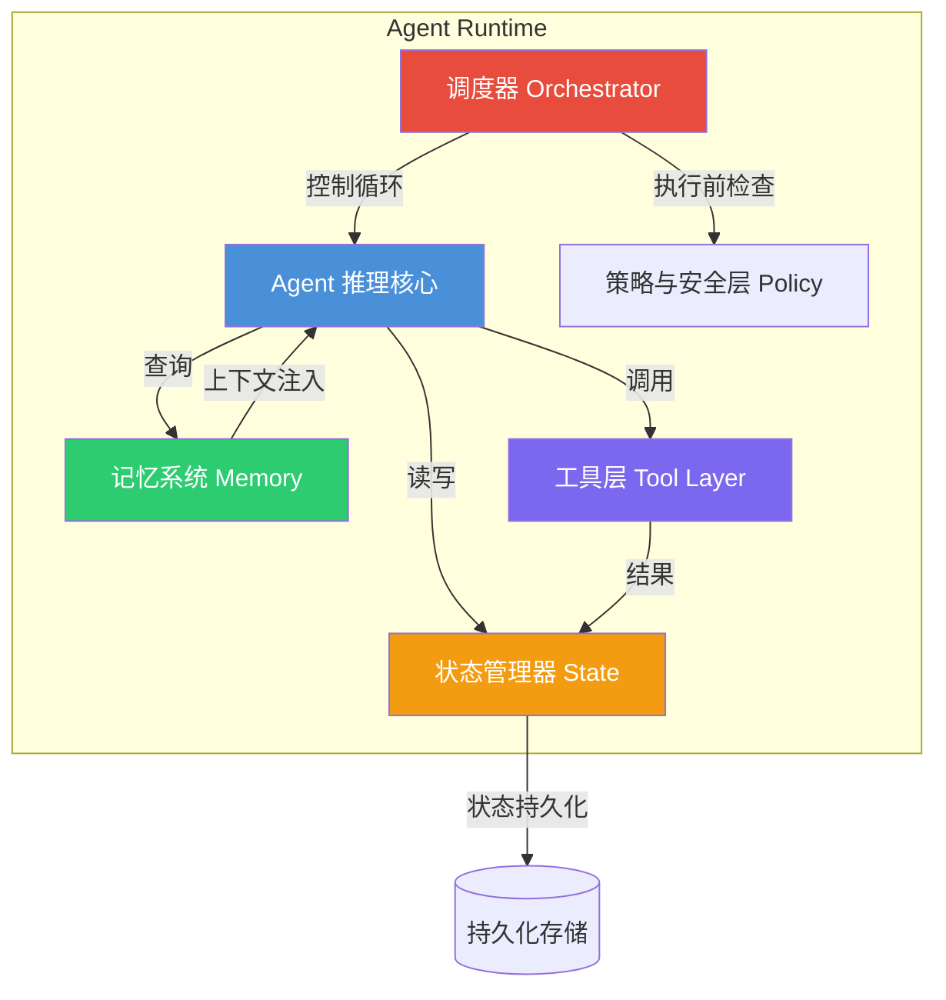
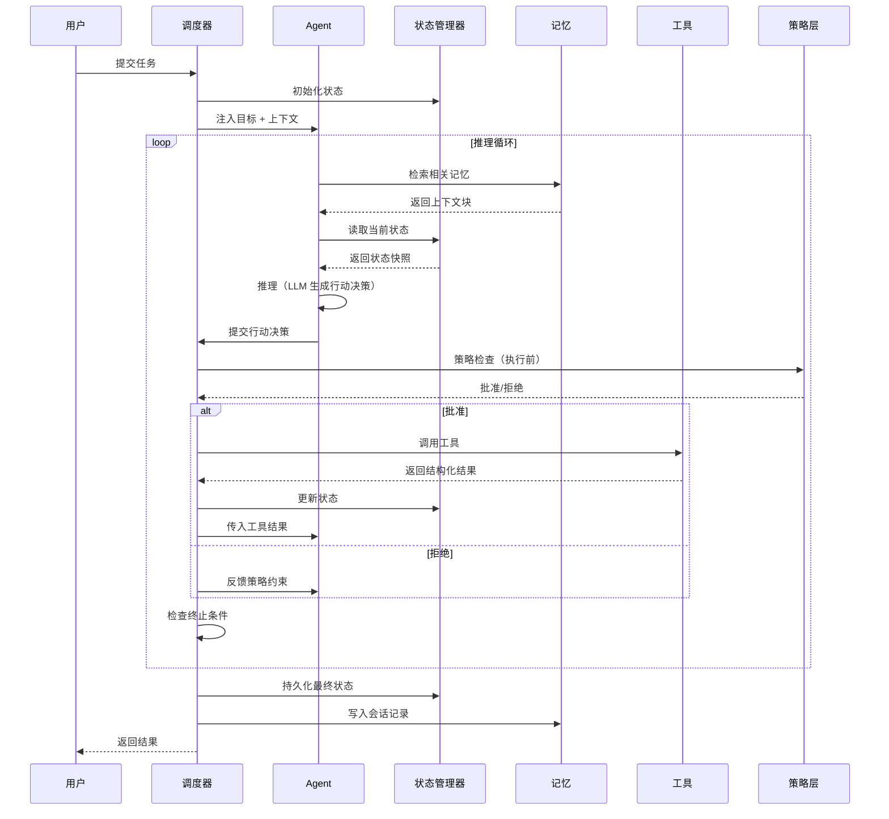
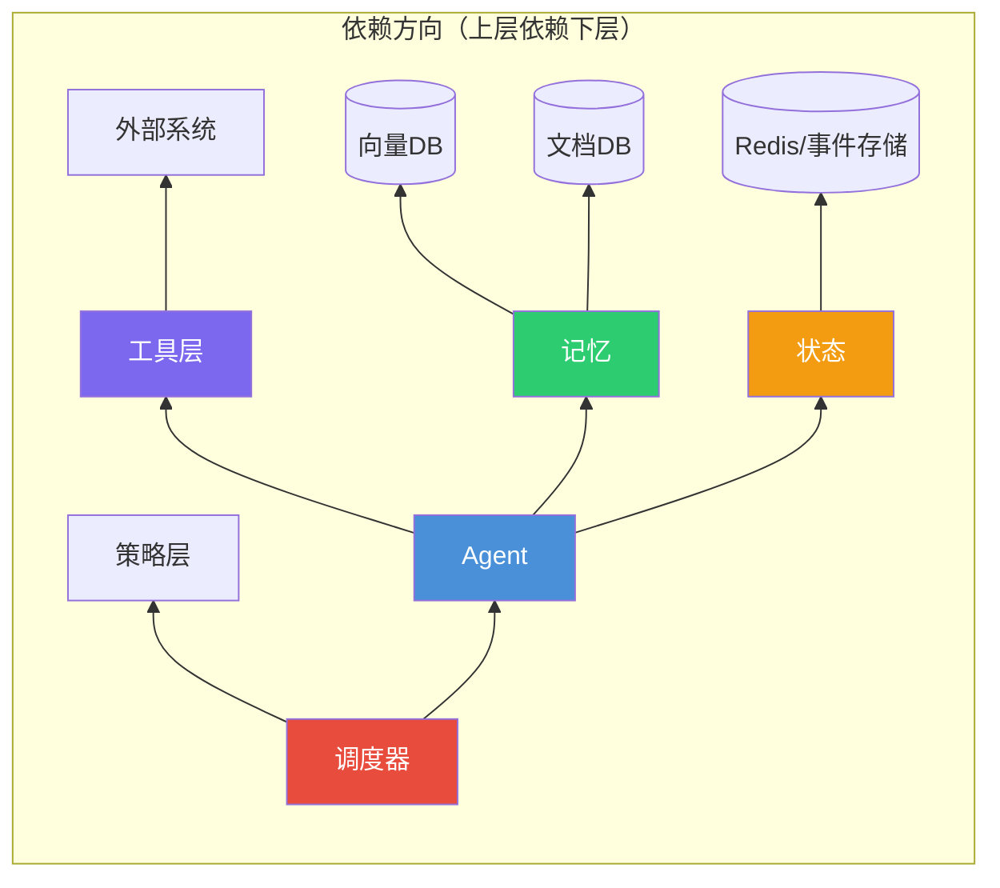

# Agent 组件设计：Agent / 工具 / 记忆 / 状态的职责边界

## Executive Summary

Agent 系统不是"加了工具的聊天机器人"——它是一个**有状态的、目标驱动的软件系统**，LLM 只是其中的推理组件，而非决策权威[1]。随着 2025-2026 年 Agent 框架的爆发式增长（LangGraph、CrewAI、OpenAI Agents SDK 等），业界逐渐形成共识：Agent 系统的核心挑战不在模型能力，而在**组件设计的职责边界**。

本报告拆解 Agent 系统的五个核心组件（Agent、工具、记忆、状态管理器、调度器），厘清它们之间的接口定义与依赖关系，并回答三个关键设计问题：记忆与状态的本质区别、工具粒度的把控原则、组件耦合度的评估方法。

---

## 1. Agent 系统核心组件拆分

### 1.1 五组件模型

一个生产级 Agent 系统可拆解为以下五个核心组件[1][2]：

| 组件 | 职责 | 核心产出 |
|------|------|---------|
| **Agent（推理核心）** | 目标分解、选项生成、工具选择、不确定性表达 | 行动决策 |
| **工具层（Tool）** | 与外部世界的交互接口（API、数据库、文件系统） | 确定性结果 |
| **记忆（Memory）** | 跨会话的知识持久化（语义、情节、程序性记忆） | 索引化的上下文 |
| **状态管理器（State）** | 当前任务的会话级工作数据管理 | 可序列化的状态快照 |
| **调度器（Orchestrator）** | 步骤执行控制、重试、终止条件、防止死循环 | 可控的执行流 |

这五组件的分层关系如下图所示：

### 1.2 各组件的职责边界与接口定义

**Agent（推理核心）**
- 输入：当前目标 + 工具输出 + 记忆检索结果 + 状态快照
- 输出：结构化行动决策（JSON schema 约束）
- 约束：不直接触发执行、不在 Prompt 中编码业务逻辑[1]
- 红线：Agent 不应成为控制循环的拥有者

**工具层（Tool）**
- 输入：强类型参数
- 输出：结构化数据（非文本）
- 设计要求：幂等性、失败感知、显式输入/输出 schema[3][7]
- 红线：工具返回数据而非自然语言，由 Agent 推理工具输出

**记忆（Memory）**
- Letta/MemGPT 模型的四层记忆[5]：
  - **消息缓冲区**：最近对话（工作记忆）
  - **核心记忆**：可编辑的上下文块（类比 RAM）
  - **回溯记忆**：完整交互历史（类比磁盘）
  - **归档记忆**：显式存储的处理后知识（向量/图数据库）
- 接口：读取（检索） + 写入（策略驱动）

**状态管理器（State）**
- 存储内容：当前目标、任务进度、中间决策、工具输出、置信度[1]
- 设计原则：显式、版本化、可序列化；状态转换尽可能确定性
- 持久化：使用 Redis/DB/事件存储，不在 Prompt 中维护隐藏状态
- LangGraph 的 StateGraph 和 Checkpointing 是典型实现[9]

**调度器（Orchestrator）**
- 职责：控制步骤执行、管理重试/降级、执行终止条件、防止死循环[1]
- 模式：Plan → Execute → Evaluate 循环、状态机执行、图工作流
- 铁律：**Agent 不控制循环，系统控制循环**

---

## 2. 组件间的依赖关系与数据流

### 2.1 组件数据流图

以下展示了一次典型任务执行中的数据流转：

### 2.2 组件依赖图

---

## 3. 关键问题一：记忆（Memory）与状态（State）的区别与联系

### 3.1 概念辨析

| 维度 | 状态（State） | 记忆（Memory） |
|------|-------------|---------------|
| **生命周期** | 会话内（session-scoped） | 跨会话（cross-session） |
| **内容** | 当前目标、中间决策、工具输出 | 历史交互、用户偏好、领域知识 |
| **存储** | 内存/Redis（高性能） | 向量DB/文档DB（持久化） |
| **更新频率** | 每步更新 | 事件驱动写入 |
| **访问模式** | 全量快照 | 按需检索 |
| **类比** | 进程的栈帧 | 文件系统 |

### 3.2 联系与交互

状态与记忆并非独立运作——它们通过以下模式交互[1][5]：

1. **状态 → 记忆**：任务完成时，关键状态信息被压缩并写入长期记忆（如"用户偏好使用 Markdown 格式"）
2. **记忆 → 状态**：新任务开始时，记忆检索结果注入初始状态上下文
3. **记忆衰减**：记忆相关性随时间衰减（TTL + 使用频率双重维度）[10]

### 3.3 常见混淆与陷阱

- **陷阱 1**：把 LLM 的上下文窗口当记忆——Anthropic 明确指出"上下文是有限资源，每个新 token 都在消耗注意力预算"[6]
- **陷阱 2**：把状态藏在 Prompt 中——应使用显式状态对象 + 持久化[1]
- **陷阱 3**：所有框架都将上下文窗口等同于记忆——Mem0 团队指出"大多数 Agentic 框架混淆了上下文窗口与持久记忆"[4]

---

## 4. 关键问题二：工具（Tool）的粒度把控

### 4.1 原子工具 vs 组合工具

| 维度 | 原子工具 | 组合工具 |
|------|---------|---------|
| **定义** | 执行单一确定性操作 | 封装多个步骤的业务流程 |
| **优势** | 灵活组合、可重用、易测试 | 降低 LLM 决策负担 |
| **劣势** | LLM 需要更多推理步骤 | 降低灵活性、增加耦合 |
| **适用场景** | 通用能力（bash、文件读写、搜索） | 领域特定流程（部署、审批） |

### 4.2 最佳实践：多层动作空间

Claude Code、Manus 等生产级 Agent 采用**多层动作空间**策略[6]：

- **第一层**：少量原子工具（~12-20 个）——bash、文件读写、搜索
- **第二层**：通过 CodeAct 编写和执行代码链式操作
- **第三层**：渐进式披露（Progressive Disclosure）——工具定义按需加载

> "Claude Code 使用约十几个工具。Manus 使用少于 20 个工具。" — Lance Martin (2026)[6]

### 4.3 工具设计五原则

1. **强类型接口**：每个工具都有显式输入/输出 schema[1]
2. **幂等性**：Agent 可能重试，工具必须处理重复调用[7]
3. **参数协调**：接受多种输入格式（"2024-01-15" / "昨天"），内部规范化[7]
4. **失败引导恢复**：错误信息应指导 Agent 如何重试，而非仅报告失败[7]
5. **返回数据而非文本**：工具返回结构化数据，由 Agent 推理结果[1]

### 4.4 反模式：工具过多的代价

MCP 规模化使用时，工具定义会过载上下文窗口。GitHub MCP Server 有 35 个工具，约 26K tokens 的工具定义[6]。过多工具还会因功能重叠而混淆模型[8]。

---

## 5. 关键问题三：组件耦合度评估

### 5.1 高内聚低耦合在 Agent 系统中的体现

| 组件 | 高内聚表现 | 低耦合表现 |
|------|-----------|-----------|
| Agent | 只负责推理决策，不包含业务规则 | 通过标准接口访问工具和记忆 |
| 工具 | 每个工具独立可测试 | 不依赖其他工具的内部实现 |
| 记忆 | 读写策略集中管理 | 不关心谁写入、谁读取 |
| 状态 | 显式 schema，版本化 | 序列化为 JSON，可任意替换存储后端 |
| 调度器 | 只控制循环和终止 | 不包含具体业务逻辑 |

### 5.2 耦合度评估框架

从四个维度评估组件间的耦合度[1][2][4]：

1. **接口耦合**：组件间通过何种接口通信？
   - ✅ 强类型 schema（低耦合）
   - ❌ 自由文本传递（高耦合）

2. **数据耦合**：共享数据的范围？
   - ✅ 最小化共享状态（低耦合）
   - ❌ 全局共享对象（高耦合）

3. **控制耦合**：一个组件是否控制另一个的内部流程？
   - ✅ 事件驱动/回调（低耦合）
   - ❌ 直接调用内部方法（高耦合）

4. **时间耦合**：组件是否依赖精确的执行顺序？
   - ✅ 异步、最终一致（低耦合）
   - ❌ 同步阻塞、严格顺序（高耦合）

### 5.3 典型反模式

| 反模式 | 表现 | 危害 | 修复方向 |
|--------|------|------|---------|
| Monolithic Mega-Prompt | 500+ 行指令塞入单个 Prompt | 注意力稀释，步骤遗漏[8] | 分解为多 Agent + 工作流层 |
| Invisible State | 依赖 LLM 记住发生了什么 | 不可预测、不可调试[8] | 显式状态对象 + 持久化 |
| Agent-as-Business-Process | 用 Agent 近似替代确定性流程 | 不可审计、不合规范[8] | 确定性工作流 + Agent 解释层 |
| All-or-Nothing Autonomy | 要么完全自由要么完全受限 | 安全或效率不可兼得[8] | 分级授权 + 人工审批阈值 |
| God Agent | 单个 Agent 承担所有职责 | 内聚度低、难以维护[8] | 按职责拆分为专业子 Agent |
| Memory = Vector DB | 把 RAG 等同于记忆系统 | 缺少记忆结构化管理[4][5] | 多层记忆架构 |

---

## 6. 三层模型：Agent / Skill / MCP

AI Agent Architecture 社区提出的三层责任分离模型值得参考[2]：

| 层 | 职责 | 负责 | 示例 |
|---|------|------|------|
| Agent | 编排、决策 | 任务流 | Claude Code, Cursor |
| Skill | 领域知识、指南 | 最佳实践 | SOLID 原则、翻译指南 |
| MCP | 外部连接 | 工具定义 | deepl-mcp, rfcxml-mcp |

决策流程：
- "应该怎么做" → Skill
- "怎么执行" → MCP
- "谁来做" → Sub-agent

这三层代表的是**责任分离**，不是部署拓扑。

---

## 7. 结论

Agent 系统的组件设计遵循一个核心原则：**LLM 提供推理能力，架构提供可靠性，Agent 从中涌现**[1]。

**三条设计铁律**：

1. **状态必须显式**——不要让 LLM 记住发生了什么，用结构化状态对象
2. **工具必须强类型**——返回数据而非文本，提供幂等性和错误恢复指导
3. **记忆必须分层**——短期/核心/回溯/归档四层架构，非单一向量 DB

**优先投资顺序**（资源有限时）[1]：
显式状态管理 → 确定性调度 → 结构化工具接口 → 记忆治理 → 可观测性 → 模型质量

模型会迭代，架构债会累积。在 2026 年的 Agent 系统设计中，组件边界的清晰度决定了系统是否可交付、可治理、可扩展。

<!-- REFERENCE START -->
## 参考文献

1. Exabeam. Agentic AI Frameworks: Key Components & Top 8 Options in 2026 (2026). https://www.exabeam.com/explainers/agentic-ai/agentic-ai-frameworks-key-components-top-8-options/
2. Bonji. The MCP, Skills, and Agent Three-Layer Model | AI Agent Architecture (2026). https://shuji-bonji.github.io/ai-agent-architecture/concepts/03-architecture
3. Orq.ai. AI Agent Architecture: Core Principles & Tools in 2025 (2025). https://orq.ai/blog/ai-agent-architecture
4. Mem0. Agentic Frameworks Guide 2025 | Build AI Agents (2025). https://mem0.ai/blog/agentic-frameworks-ai-agents
5. Letta. Agent Memory: How to Build Agents that Learn and Remember (2025). https://www.letta.com/blog/agent-memory
6. Lance Martin. Agent design patterns (2026). https://rlancemartin.github.io/2026/01/09/agent_design/
7. Arcade.dev. 54 Patterns for Building Better MCP Tools (2026). https://www.arcade.dev/blog/mcp-tool-patterns
8. Tungsten Automation. Enterprise AI Agents: Agentic Design Patterns Explained (2025). https://www.tungstenautomation.de/learn/blog/build-enterprise-grade-ai-agents-agentic-design-patterns
9. LangChain. LangChain AI Agents: Complete Implementation Guide 2025 (2025). https://www.digitalapplied.com/blog/langchain-ai-agents-guide-2025
10. LangChain Docs. Memory overview (2025). https://docs.langchain.com/oss/python/langgraph/memory
