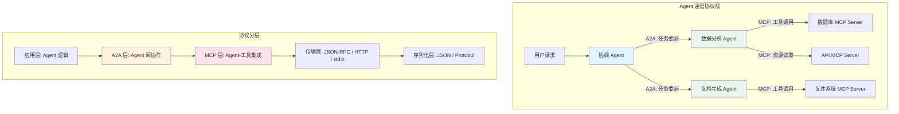
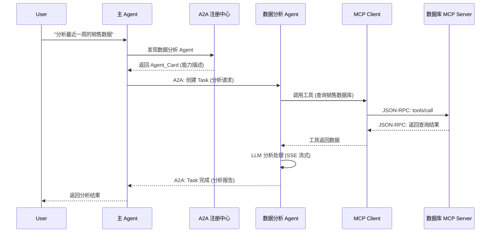

# Agent 接口与协议：API 设计、消息格式、序列化方案

## Executive Summary

AI Agent 系统的接口设计正经历从传统微服务向 AI 原生架构的范式转变。本报告围绕四个核心维度展开分析：API 设计模式（REST/gRPC/WebSocket）、消息格式标准（JSON-RPC/Protobuf）、序列化方案（JSON/MessagePack/Protobuf/Avro）、以及 Agent 间通信协议（MCP/A2A）。研究表明，Agent 系统的 API 设计与传统微服务存在三方面根本差异：**长会话状态管理**、**流式输出语义**和**动态工具发现**。2024-2025 年间，Anthropic 的 MCP 协议（2024.11 发布）和 Google 的 A2A 协议（2025.04 发布）分别定义了"Agent-工具"和"Agent-Agent"两个通信层，两者互补而非竞争，已获 100+ 企业支持并由 Linux Foundation 治理。对于通信模式选择，建议：简单查询用请求-响应（REST/gRPC）、状态变更通知用事件驱动（Pub/Sub）、LLM 推理/实时协作用流式（WebSocket/SSE）。消息版本管理推荐 Protobuf 的向后兼容机制与语义化版本号相结合的策略。

---

## 1. Agent API 设计模式对比

### 1.1 REST、gRPC 与 WebSocket 的特性对比

三种主流 API 风格在 Agent 系统中的适用场景存在显著差异。REST 以其无状态、缓存友好和广泛生态适合公开 API 与工具集成；gRPC 凭借 HTTP/2 多路复用和 Protobuf 二进制序列化在高性能微服务间通信中占优；WebSocket 提供全双工长连接，是实时流式场景的首选[1][2]。

| 维度 | REST | gRPC | WebSocket |
|------|------|------|-----------|
| 通信方向 | 单向请求-响应 | 单/双向流式 | 全双工双向 |
| 传输协议 | HTTP/1.1 或 HTTP/2 | HTTP/2 | TCP（HTTP 升级） |
| 消息格式 | JSON/XML（文本） | Protobuf（二进制） | 文本或二进制帧 |
| 延迟 | 中等 | 极低 | 极低 |
| 流式支持 | 无（需 SSE 补充） | 原生双向流 | 原生双向流 |
| 浏览器兼容 | 原生支持 | 需 gRPC-Web 代理 | 原生支持 |
| Agent 场景 | 工具调用、资源获取 | 服务间高性能通信 | 实时推理流输出 |

**关键洞察：Agent 系统需要混合架构。** 典型的 Agent 平台同时暴露 REST API（供外部调用）、gRPC 内部通信（微服务间）和 WebSocket/SSE（流式推理输出）。OpenAI 的 API 演化就是一个典型案例：从纯 REST 的 Chat Completions 到支持 SSE 流式输出，再到 Realtime API 使用 WebSocket 实现语音对话[3]。

### 1.2 Agent 系统与传统微服务 API 的核心差异

Agent 系统的 API 设计与传统微服务存在三个根本性不同：

**差异一：长会话状态管理。** 传统微服务遵循 REST 的无状态原则，每个请求独立处理。而 Agent 系统需要维护多轮对话上下文（Conversation Context），包括对话历史、工具调用记录、中间推理步骤。这意味着 Agent API 必须设计会话 ID 机制、上下文窗口管理和状态持久化接口[4]。

**差异二：流式输出语义。** 传统微服务返回完整响应，而 Agent 需要流式输出 LLM 的 token 生成过程（如 Server-Sent Events）。这不仅是性能优化，更是用户体验的核心需求——用户需要实时看到 Agent 的"思考过程"[5]。

**差异三：动态工具发现。** 传统 API 的端点在设计时固定，而 Agent 系统需要运行时动态发现可用工具。MCP 协议通过 `list_tools()` 端点实现了这一能力，使 Agent 能在运行时查询可调用的工具列表和参数 schema[6]。

### 1.3 通信模式选择指南

请求-响应、事件驱动和流式三种模式在 Agent 系统中各有定位[7][8]：

**请求-响应（REST/gRPC）适用场景：**
- Agent 调用外部工具获取数据（如查询数据库、调用 API）
- 结构化任务的输入输出（如翻译、摘要）
- 需要缓存和重试的场景

**事件驱动（Pub/Sub/Webhook）适用场景：**
- Agent 状态变更通知（如任务完成、错误告警）
- 多 Agent 系统中的任务分发与协作
- 解耦的异步工作流

**流式（WebSocket/SSE）适用场景：**
- LLM 推理过程的实时输出
- 多轮对话交互
- Agent 间实时协作（如共享工作空间）

---

## 2. 消息格式标准

### 2.1 JSON-RPC 在 Agent 系统中的应用

JSON-RPC 是一种轻量级的远程过程调用协议，使用 JSON 作为数据格式。其核心特点是请求和响应使用统一的 JSON 结构：

```json
{
  "jsonrpc": "2.0",
  "method": "tools/call",
  "params": {"name": "get_weather", "arguments": {"city": "Beijing"}},
  "id": 1
}
```

**MCP 协议选择 JSON-RPC 作为底层通信协议。** 根据 MCP 官方文档，其架构由 Host、Client 和 Server 三者组成，Client 与 Server 之间通过 JSON-RPC 2.0 进行通信，支持 `tools/list`、`tools/call`、`resources/read` 等标准化方法[6]。

JSON-RPC 的优势在于：
- 协议开销极小，适合 LLM 场景的高频小消息
- 与 HTTP 和 stdio 传输层均兼容
- 支持批处理（Batch Request）和通知（Notification）

### 2.2 Protobuf 在高性能 Agent 通信中的角色

Protocol Buffers（Protobuf）是 Google 开发的二进制序列化格式，是 gRPC 的默认序列化方案。相比 JSON，Protobuf 的编码体积小 2-5 倍，序列化/反序列化速度快 5-10 倍[9]。

在 Agent 系统中，Protobuf 主要用于：
- **内部服务间通信**：Agent 编排层与执行层之间
- **高频数据传输**：如实时传感器数据处理 Agent
- **强类型接口定义**：`.proto` 文件提供明确的接口契约

```protobuf
syntax = "proto3";

message AgentTask {
  string task_id = 1;
  string agent_id = 2;
  string input = 3;
  TaskStatus status = 4;
  repeated ToolCall tools = 5;
}

enum TaskStatus {
  PENDING = 0;
  RUNNING = 1;
  COMPLETED = 2;
  FAILED = 3;
}
```

### 2.3 消息格式选择决策框架

| 因素 | JSON-RPC | Protobuf | 自定义格式 |
|------|----------|----------|-----------|
| 可读性 | 高（文本） | 低（二进制） | 取决于设计 |
| 性能 | 中 | 高 | 取决于实现 |
| Schema 约束 | 弱 | 强 | 取决于设计 |
| 生态兼容 | 广泛 | 需要代码生成 | 灵活但碎片化 |
| Agent 适用 | 工具集成层 | 内部通信层 | 特殊场景 |

**实践建议：** 采用分层策略——对外接口用 JSON-RPC（如 MCP），内部高性能通信用 Protobuf（如 Agent 编排），避免自定义格式以降低集成成本。

---

## 3. 序列化方案对比

### 3.1 四种主流序列化方案

序列化方案的选择直接影响 Agent 系统的性能、可维护性和跨语言兼容性[9][10][11]：

**JSON** — 文本格式，人类可读，无 Schema 约束。Agent 系统中用于 LLM 输入输出、配置文件和 API 通信。缺点是体积大、解析慢、缺乏类型安全。

**MessagePack** — 二进制格式，保持 JSON 的灵活性但体积更小（通常减少 30-50%）。适合需要比 JSON 更高效但不想引入 Schema 管理的场景，如 Agent 的内部缓存和临时数据交换。

**Protobuf** — 强 Schema 约束的二进制格式。体积最小、速度最快，但需要 `.proto` 定义和代码生成。适合 Agent 系统中稳定的内部接口。

**Apache Avro** — Schema 与数据一起存储的二进制格式。支持 Schema 演化，适合数据湖和流处理场景。在 Agent 系统中可用于日志收集和监控数据。

### 3.2 性能与特性对比

| 特性 | JSON | MessagePack | Protobuf | Avro |
|------|------|-------------|----------|------|
| 编码体积（基准） | 100% | ~50-70% | ~20-40% | ~30-50% |
| 序列化速度 | 慢 | 中 | 快 | 中 |
| 人类可读 | ✅ | ❌ | ❌ | ❌ |
| Schema 必需 | ❌ | ❌ | ✅ | ✅ |
| Schema 演化 | 无 | 无 | 有限 | 强 |
| 跨语言支持 | 广泛 | 广泛 | 广泛 | 广泛 |
| Agent 典型用途 | API 通信 | 内部缓存 | 微服务间 | 数据管道 |

### 3.3 序列化方案选型建议

对于 Agent 系统的序列化方案选择，推荐以下策略：

- **LLM 交互层**：JSON（兼容性优先，与 LLM API 一致）
- **工具集成层**：JSON-RPC over JSON（MCP 协议要求）
- **内部服务间**：Protobuf（性能优先，强类型约束）
- **数据管道**：Avro（Schema 演化友好，适合日志和事件流）
- **轻量缓存**：MessagePack（比 JSON 小但不需要 Schema）

---

## 4. Agent 间通信协议

### 4.1 MCP：Agent-工具集成层

Model Context Protocol（MCP）由 Anthropic 于 2024 年 11 月发布，定位为 AI 应用与外部工具/数据源之间的标准化连接层，被称为"AI 的 USB 接口"[6][12]。

**核心架构：**
- **Host**：AI 应用（如 Claude Desktop、IDE 插件）
- **Client**：Host 内的协议处理器，与每个 MCP Server 保持 1:1 连接
- **Server**：暴露工具（Tools）、资源（Resources）和提示模板（Prompts）

**三大原语（Primitives）：**
- Tools：可执行函数，由模型控制（如发送邮件、查询数据库）
- Resources：数据源，由应用控制（如文件内容、API 响应）
- Prompts：可复用模板，由用户控制（如代码审查模板）

**传输层：** 支持 stdio（本地进程通信）和 HTTP+SSE（远程通信），通信协议使用 JSON-RPC 2.0。

### 4.2 A2A：Agent-Agent 协作层

Agent-to-Agent Protocol（A2A）由 Google 于 2025 年 4 月发布，专注于多 Agent 系统中的任务委托、协作和协调[13][14]。

**核心概念：**
- **Agent Card**：JSON 元数据文件，描述 Agent 的能力、技能和认证方式，支持自动发现
- **Task**：A2A 的核心工作单元，有明确的生命周期（创建→进行中→完成/失败）
- **Message**：包含 Part（文本、文件、结构化数据）的通信单元
- **Artifact**：Task 产生的输出

**与 MCP 的互补关系：** A2A 是"协议间的协议"——它不替代 MCP，而是在更高层级协作。典型场景中，一个协调 Agent 使用 A2A 发现和委派任务给专业 Agent，而每个专业 Agent 内部使用 MCP 调用具体工具[12][13]。

### 4.3 协议对比总览



### 4.4 协议选型决策

| 需求 | 推荐协议 | 理由 |
|------|---------|------|
| 单个 Agent 调用外部工具 | MCP | 标准化工具发现与调用 |
| 多 Agent 协作完成任务 | A2A | 原生任务委托与状态管理 |
| Agent 能力描述与发现 | A2A Agent Card | 标准化的能力描述格式 |
| 混合架构（Agent+工具） | MCP + A2A | 互补分层，业界共识 |
| 简单工具集成（无 Agent） | REST API | 传统方式，无需协议开销 |

---

## 5. 消息版本管理与向后兼容

### 5.1 版本管理策略

Agent 系统的消息版本管理面临独特挑战：LLM 输出格式变化频繁、工具 Schema 动态更新、多版本 Agent 共存[15]。推荐以下策略：

**策略一：Protobuf 字段编号机制。** Protobuf 通过字段编号（field number）实现天然的向后兼容——新增字段不影响旧版本解析，废弃字段标记 `reserved`。这是 gRPC Agent 服务的首选方案。

**策略二：语义化版本号（SemVer）。** 在消息体中嵌入 `api_version` 字段（如 `2025.01.1`），Major 版本变更表示不兼容变更，Minor 表示向后兼容的新功能。

**策略三：内容协商（Content Negotiation）。** 在 HTTP 头中使用 `Accept-Version` 或自定义头，允许客户端声明支持的版本范围。

### 5.2 向后兼容实践

**JSON 消息的向后兼容规则：**
- ✅ 可新增可选字段（旧版本忽略未知字段）
- ✅ 可添加新的枚举值（旧版本忽略未知值）
- ❌ 不可删除字段（用 `deprecated: true` 标记替代）
- ❌ 不可修改字段类型
- ❌ 不可修改字段语义（即使字段名不变）

**MCP 协议的版本管理：** MCP 使用 JSON-RPC 2.0 作为基础协议，其 `initialize` 请求包含 `protocolVersion` 字段（如 `2025-03-26`），客户端和服务器通过协商确定使用的协议版本[6]。

**A2A 协议的版本管理：** A2A 的 Agent Card 中包含 `protocolVersion` 字段，支持能力协商。新增技能或能力通过 `skills` 数组扩展，不影响现有调用方[13]。

---

## 6. 消息流图



---

## 7. 结论

Agent 系统的接口与协议设计正处于快速标准化的进程中。三个核心结论如下：

**第一，混合架构是必然选择。** 没有单一协议能覆盖 Agent 系统的全部需求。MCP 解决工具集成问题，A2A 解决 Agent 协作问题，两者互补形成完整的 Agent 通信栈。实际部署中应采用分层策略：对外 REST/JSON-RPC、内部 gRPC/Protobuf、实时流 WebSocket/SSE。

**第二，流式通信是 Agent 的核心需求。** 与传统微服务不同，Agent 系统的"响应"往往是一个持续生成的过程而非一次性结果。SSE 和 WebSocket 不是可选项，而是 Agent API 的基础设施。OpenAI Realtime API（WebSocket）和 Claude 的 SSE 流式输出已成为行业基线。

**第三，版本管理需要 Protocol-First 思维。** Agent 系统的消息格式变化频繁，必须在设计之初就嵌入版本协商机制。推荐 Protobuf 字段编号 + SemVer + `protocolVersion` 协商的组合策略，确保多版本 Agent 能够平滑共存。

未来趋势方面，Linux Foundation 已接管 MCP（AAIF）和 A2A 的治理，行业收敛正在发生。关注 Anthropic、Google 和开源社区的协议更新，将是保持 Agent 系统接口先进性的关键。

<!-- REFERENCE START -->
## 参考文献

1. PASK Software. "7 API Integration Patterns: REST, gRPC, SSE, WS & Queues" (2025). https://pasksoftware.com/api-integration-patterns/
2. Nordic APIs. "The Top 8 API Specifications to Know in 2025" (2025). https://nordicapis.com/the-top-8-api-specifications-to-know-in-2025/
3. CodeLucky. "Top 5 API Technologies in 2025: REST, GraphQL, gRPC, WebSockets, SSE" (2025). https://www.youtube.com/watch?v=3UBSb5HJghI
4. Guptadeepak. "MCP, RAG, and ACP: A Comparative Analysis" (2025). https://guptadeepak.com/mcp-rag-and-acp-a-comparative-analysis-in-artificial-intelligence/
5. StreamNative. "The Event-Driven Agent Era: Why Streams Matter Now" (2025). https://streamnative.io/blog/the-event-driven-agent-era-why-streams-matter-now
6. Anthropic. "Model Context Protocol Documentation" (2024-2026). https://modelcontextprotocol.io/docs/learn/architecture
7. API7.ai. "Event-Driven APIs: Designing for Real-Time" (2025). https://api7.ai/learning-center/api-101/event-driven-api-design-real-time
8. Confluent. "Do Microservices Need Event-Driven Architectures?" (2024). https://www.confluent.io/blog/do-microservices-need-event-driven-architectures/
9. Tatum. "gRPC vs. RPC: Protobufs, JSON, Avro, and Thrift Guide" (2025). https://tatum.io/blog/grpc-vs-rpc-json-avro
10. Dev.to. "JSON vs MessagePack vs Protobuf in Go — Real Benchmarks" (2025). https://dev.to/devflex-pro/json-vs-messagepack-vs-protobuf-in-go-my-real-benchmarks-and-what-they-mean-in-production-48fh
11. CelerData. "Understanding Data Serialization: A Format Comparison Guide" (2025). https://celerdata.com/glossary/understanding-data-serialization-a-format-comparison-guide
12. JitendraZaa. "MCP vs A2A vs ACP vs ANP: Complete AI Agent Protocol Guide" (2026). https://www.jitendrazaa.com/blog/ai/mcp-vs-a2a-vs-acp-vs-anp-complete-ai-agent-protocol-guide/
13. Google. "Agent-to-Agent (A2A) Protocol Specification" (2025). https://github.com/google/A2A
14. Auth0. "MCP vs A2A: A Guide to AI Agent Communication Protocols" (2025). https://auth0.com/blog/mcp-vs-a2a/
15. Optiblack. "API Versioning Best Practices 2024" (2024). https://optiblack.com/insights/api-versioning-best-practices-2024
