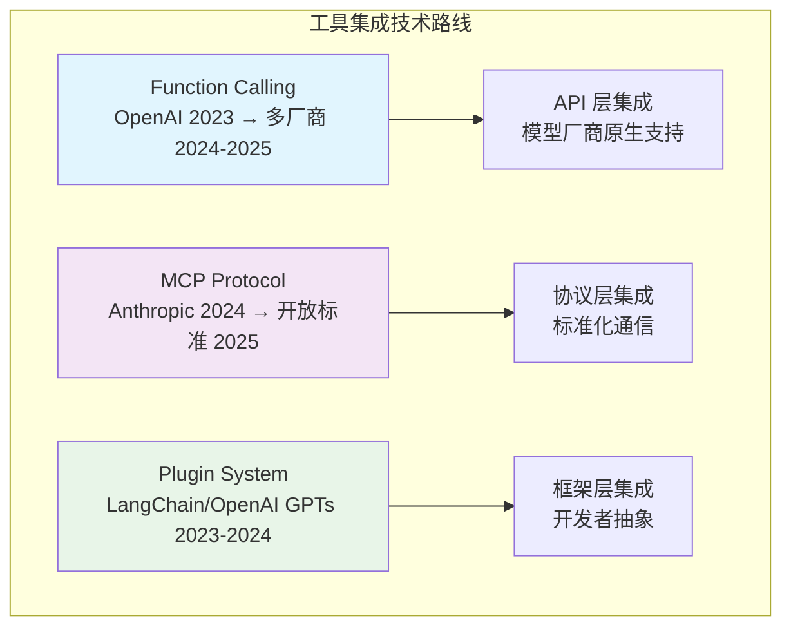
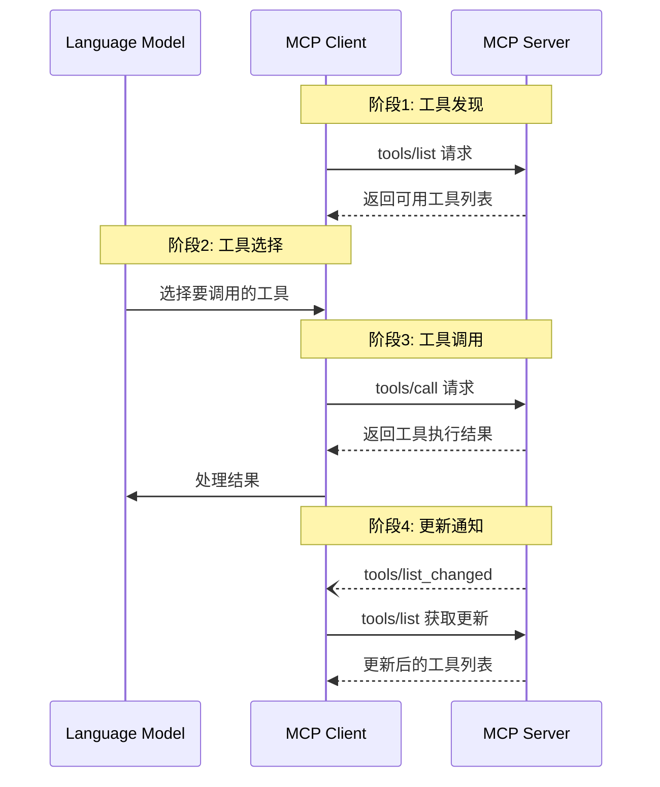
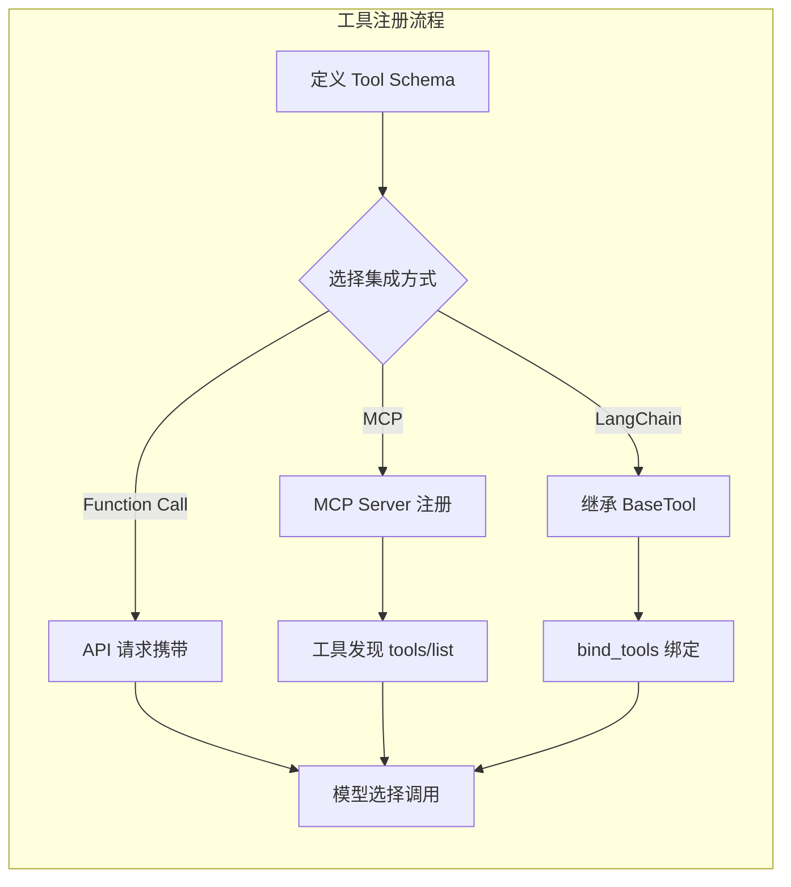

# Agent 工具集成：MCP、Function Calling 与插件系统

## Executive Summary

工具集成是 Agent 从"对话机器人"进化为"行动主体"的关键一步。本报告深入分析三大主流工具集成方案：Anthropic 的 **Model Context Protocol (MCP)**、OpenAI 的 **Function Calling**、以及 **LangChain 插件系统**，并从安全性、扩展性、生态成熟度三个维度进行对比。核心发现：MCP 正在成为事实上的开放标准，Function Calling 在多模型支持上持续演进，而 LangChain 则提供了最灵活的抽象层。报告还提供了工具权限控制与安全边界的最佳实践。

---

## 1. 工具集成技术概览

### 1.1 为什么 Agent 需要工具

LLM 本身是封闭系统——无法访问实时数据、无法执行代码、无法调用外部 API。工具（Tools）是 Agent 与外部世界交互的桥梁。没有工具的 Agent 只能"说"，有工具的 Agent 才能"做"[1][2]。

工具集成解决三个核心问题：
- **能力边界突破**：让 LLM 访问数据库、调用 API、执行代码
- **实时信息获取**：弥补训练数据的时效性不足
- **行动能力**：从"回答问题"到"完成任务"

### 1.2 三大技术路线



---

## 2. MCP 协议深度解析

### 2.1 MCP 架构

MCP（Model Context Protocol）是 Anthropic 于 2024 年 11 月开源的协议标准，被比喻为 AI 的"USB-C 接口"——提供标准化的连接方式[1]。

MCP 采用 **Client-Server 架构**，包含三个核心角色[3]：

| 角色 | 职责 | 示例 |
|------|------|------|
| **MCP Host** | AI 应用程序，协调管理多个 Client | Claude Desktop, VS Code |
| **MCP Client** | 维护与 Server 的连接，获取上下文 | Host 内部的连接组件 |
| **MCP Server** | 向 Client 提供上下文数据和工具 | Filesystem, Database, Sentry |



### 2.2 MCP 数据层协议

MCP 基于 **JSON-RPC 2.0** 协议[6]，定义了三种消息类型：

**请求（Request）**：双向发送，必须包含唯一 ID
```json
{
  "jsonrpc": "2.0",
  "id": 1,
  "method": "tools/list",
  "params": {}
}
```

**响应（Response）**：包含 result 或 error（不可同时）
```json
{
  "jsonrpc": "2.0",
  "id": 1,
  "result": {
    "tools": [...]
  }
}
```

**通知（Notification）**：单向消息，无 ID
```json
{
  "jsonrpc": "2.0",
  "method": "notifications/tools/list_changed"
}
```

### 2.3 工具定义与调用

MCP 工具定义包含以下字段[2]：

| 字段 | 类型 | 必需 | 描述 |
|------|------|------|------|
| `name` | string | ✅ | 工具唯一标识符 |
| `title` | string | ❌ | 人类可读的显示名称 |
| `description` | string | ✅ | 功能描述 |
| `inputSchema` | JSON Schema | ✅ | 输入参数定义 |
| `outputSchema` | JSON Schema | ❌ | 输出结构定义 |
| `annotations` | object | ❌ | 行为元数据（不可信） |

工具调用支持多种返回类型[2]：
- **Text**：纯文本结果
- **Image**：Base64 编码图片
- **Audio**：Base64 编码音频
- **Resource Link**：指向资源的 URI
- **Embedded Resource**：内嵌资源数据

### 2.4 传输层设计

MCP 支持两种传输机制[3]：

| 传输方式 | 场景 | 特点 |
|---------|------|------|
| **STDIO** | 本地 Server | 进程间通信，零网络开销，单 Client |
| **Streamable HTTP** | 远程 Server | 支持 SSE 流式传输，多 Client，OAuth 认证 |

---

## 3. Function Calling 演进

### 3.1 发展历程

Function Calling 由 OpenAI 于 2023 年 6 月首次提出，经历了快速演进[4]：

| 时间 | 里程碑 |
|------|--------|
| 2023-06 | OpenAI GPT-3.5-turbo 首次支持 Function Calling |
| 2024-03 | GPT-4 支持并行调用、Structured Outputs |
| 2024-11 | Anthropic Claude 加入支持，参数名改为 `input_schema` |
| 2025 | 多厂商（Google、Mistral、Cohere）跟进，形成事实标准 |
| 2026 | OpenAI 正式发布 Tool Search 和 Namespace 分组（gpt-5.4+）[4][8] |

### 3.2 Function Calling 流程

OpenAI 的 Function Calling 是一个 **5 步流程**[4]：

1. **定义工具**：用 JSON Schema 描述函数签名
2. **发送请求**：将工具定义和用户消息一起发送给模型
3. **接收调用**：模型返回 tool_call（包含函数名和参数）
4. **执行函数**：应用端执行函数逻辑
5. **返回结果**：将执行结果发送给模型生成最终回复

```python
# OpenAI Function Calling 示例 [4]
tools = [{
    "type": "function",
    "name": "get_weather",
    "description": "Retrieves current weather for the given location.",
    "parameters": {
        "type": "object",
        "properties": {
            "location": {"type": "string", "description": "City and country"},
            "units": {"type": "string", "enum": ["celsius", "fahrenheit"]}
        },
        "required": ["location", "units"]
    },
    "strict": true
}]
```

### 3.3 OpenAI vs Anthropic 工具定义对比

| 特性 | OpenAI | Anthropic Claude |
|------|--------|-----------------|
| 字段名 | `parameters` | `input_schema` |
| Strict 模式 | `strict: true` | `strict: true` |
| Namespace 分组 | 支持 `type: "namespace"`（gpt-5.4+）[4] | ❌ 不支持 |
| Tool Search 延迟加载 | 支持（gpt-5.4+）[4][8] | ❌ 不支持 |
| 并行调用 | ✅ | ✅ |

> 注：Namespace 和 Tool Search 需要 gpt-5.4 及以上模型支持[8]。

### 3.4 Tool Search：延迟加载新范式

OpenAI 在 Function Calling API 中引入了 **Tool Search** 机制，仅 gpt-5.4 及以上模型支持[4][8]。该机制解决了工具数量膨胀导致的上下文压力问题。

**核心机制**[8]：

- **问题**：当工具数量超过 100+，全量加载会导致上下文膨胀，消耗大量 token
- **方案**：工具定义声明 `defer_loading: true`，模型按需搜索和加载工具
- **Namespace 配合**：将延迟加载的工具组织到 `type: "namespace"` 分组中，模型只需看到 namespace 名称和描述，无需加载内部工具细节[4]
- **效果**：支持大规模工具生态系统，显著减少 token 消耗

**两种 Tool Search 模式**[8]：

| 模式 | 说明 | 适用场景 |
|------|------|---------|
| **Hosted** | OpenAI 服务端自动搜索延迟工具 | 候选工具在请求时已知 |
| **Client-executed** | 模型发出搜索调用，应用端执行查找 | 工具发现依赖项目/租户状态 |

**代码示例**（Namespace + defer_loading）[4]：

```json
{
  "type": "namespace",
  "name": "crm",
  "description": "CRM tools for customer lookup and order management.",
  "tools": [
    {
      "type": "function",
      "name": "list_open_orders",
      "description": "List open orders for a customer ID.",
      "defer_loading": true,
      "parameters": {
        "type": "object",
        "properties": { "customer_id": { "type": "string" } },
        "required": ["customer_id"]
      }
    }
  ]
}
```

---

## 4. 插件系统设计模式

### 4.1 LangChain Tools 架构

LangChain 提供了最成熟的工具抽象层，支持 1000+ 集成[7]：

**核心概念**：
- **Tool**：被模型调用的工具，输入由模型生成，输出返回模型
- **Toolkit**：一组相关工具的集合
- **ToolNode**：在 LangGraph 中执行工具调用的节点

**工具分类**（按功能）[7]：

| 类别 | 示例 | 说明 |
|------|------|------|
| 搜索工具 | Brave Search, Google Search | 信息检索 |
| 代码解释器 | E2B, Azure Sessions | 安全执行代码 |
| 数据库 | SQL Database Toolkit | 数据查询 |
| API 集成 | Requests, Twilio | 外部服务调用 |
| 文件处理 | Wikipedia, Arxiv | 文档读取 |

### 4.2 工具注册模式



### 4.3 工具发现、注册、调用生命周期

完整的工具生命周期包含以下阶段：

1. **定义阶段**：用 JSON Schema 或类继承定义工具签名
2. **注册阶段**：将工具注册到 Server/框架/API
3. **发现阶段**：Client 或模型获取可用工具列表
4. **选择阶段**：模型根据上下文选择合适的工具
5. **调用阶段**：执行工具并获取结果
6. **反馈阶段**：将结果返回给模型处理

---

## 5. 工具权限控制与安全边界

### 5.1 安全威胁模型

工具集成引入了新的安全风险[2][5]：

| 威胁类型 | 描述 | 缓解措施 |
|---------|------|---------|
| **Prompt Injection** | 恶意输入诱导模型调用危险工具 | 输入验证、工具白名单 |
| **权限提升** | 工具获取不应有的权限 | 最小权限原则、沙箱隔离 |
| **数据泄露** | 工具输出包含敏感信息 | 输出过滤、脱敏处理 |
| **工具中毒** | 恶意 Server 提供虚假工具 | Server 认证、工具签名 |

### 5.2 MCP 安全机制

MCP 规范在安全设计上强调**人类审批（Human-in-the-loop）**[2]：

- **必须提供 UI 指示**：清晰展示工具被暴露给 AI
- **必须有视觉反馈**：工具调用时提供明确的视觉指示
- **必须有确认提示**：对敏感操作要求用户确认

```
⚠️ MCP 安全最佳实践 [2]:
- Server 应声明 tool annotations 行为元数据
- Client 应将 annotations 视为不可信数据（除非来自可信 Server）
- 始终保持人类在循环中
```

### 5.3 权限控制模型

| 控制级别 | 实现方式 | 适用场景 |
|---------|---------|---------|
| **工具级** | 白名单/黑名单 | 允许/禁止特定工具 |
| **参数级** | JSON Schema 验证 | 限制参数范围和类型 |
| **结果级** | 输出过滤 | 防止敏感信息泄露 |
| **会话级** | 令牌/作用域限制 | 限制工具访问范围 |

---

## 6. 对比分析与技术选型

### 6.1 三大方案对比

| 维度 | MCP | Function Calling | LangChain Tools |
|------|-----|-----------------|-----------------|
| **开放性** | ✅ 开源标准 | ❌ 厂商锁定 | ✅ 开源框架 |
| **模型支持** | 多模型（协议层） | 多模型（需适配） | 多模型（框架适配） |
| **工具发现** | 动态 listChanged | 静态定义 | 静态绑定 |
| **安全机制** | Human-in-the-loop | 依赖实现 | 依赖实现 |
| **生态成熟度** | 快速增长中 | 最成熟 | 最丰富 |
| **传输方式** | STDIO/HTTP | API 直连 | 任意 |
| **延迟加载** | ❌ | ✅ Tool Search | ❌ |

### 6.2 技术选型建议

| 场景 | 推荐方案 | 原因 |
|------|---------|------|
| **独立 Agent 应用** | MCP + Function Calling | 标准化 + 原生性能 |
| **多模型兼容** | MCP | 协议层抽象，不绑定特定厂商 |
| **快速原型** | LangChain Tools | 丰富的预置工具，开发速度快 |
| **企业级部署** | MCP + 自定义权限层 | 开放标准 + 安全可控 |
| **大规模工具库** | OpenAI Tool Search | 延迟加载，减少上下文压力 |

---

## 7. 结论

Agent 工具集成已从"各厂商各自为战"走向"标准化协议主导"的阶段。MCP 作为 Anthropic 主导的开源标准，凭借其架构清晰、安全设计完善、多模型支持的优势，正在成为事实上的行业标准。Function Calling 在 OpenAI 生态内持续演进，Tool Search 等创新为大规模工具管理提供了新思路。LangChain 则在框架层提供了最灵活的抽象。

**核心建议**：
1. **新项目优先采用 MCP**，获得最大的生态兼容性
2. **保留 Function Calling 支持**，覆盖 OpenAI 生态用户
3. **安全设计前置**，始终假设工具可能被滥用
4. **建立工具治理机制**，包括注册、审计、监控

工具集成的下一波浪潮将是**工具市场的标准化**和**跨 Agent 的工具复用**——MCP 已经为此铺好了路。

<!-- REFERENCE START -->
## 参考文献

1. Anthropic. Model Context Protocol Introduction (2025). https://modelcontextprotocol.io/introduction
2. Anthropic. MCP Tools Specification (2025-06-18). https://modelcontextprotocol.io/specification/2025-06-18/server/tools.md
3. Anthropic. MCP Architecture Overview (2025). https://modelcontextprotocol.io/docs/learn/architecture
4. OpenAI. Function Calling Guide (2026). https://developers.openai.com/api/docs/guides/function-calling
5. Anthropic. Tool Use with Claude (2025). https://platform.claude.com/docs/en/agents-and-tools/tool-use/overview
6. Anthropic. MCP Basic Protocol Specification (2025-06-18). https://modelcontextprotocol.io/specification/2025-06-18/basic
7. LangChain. Tool Integrations (2025). https://docs.langchain.com/oss/python/integrations/tools/
8. OpenAI. Tool Search Guide (2026). https://developers.openai.com/api/docs/guides/tools-tool-search
