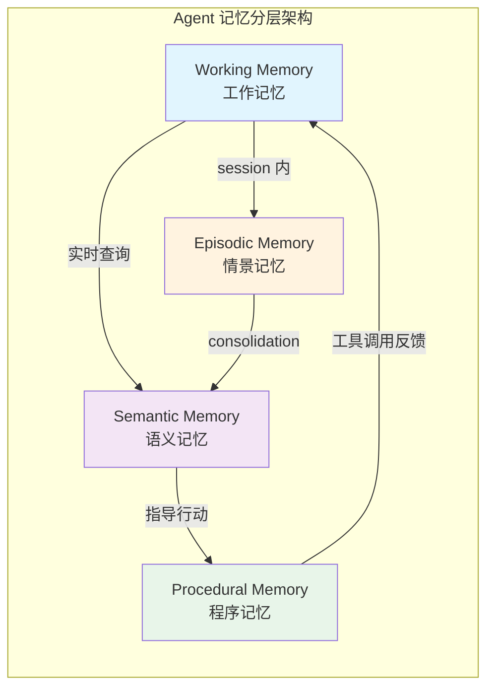
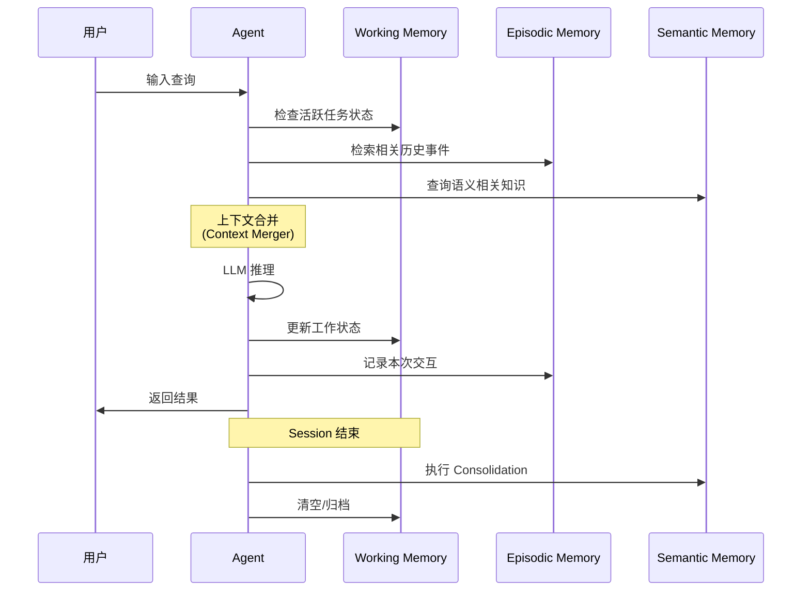
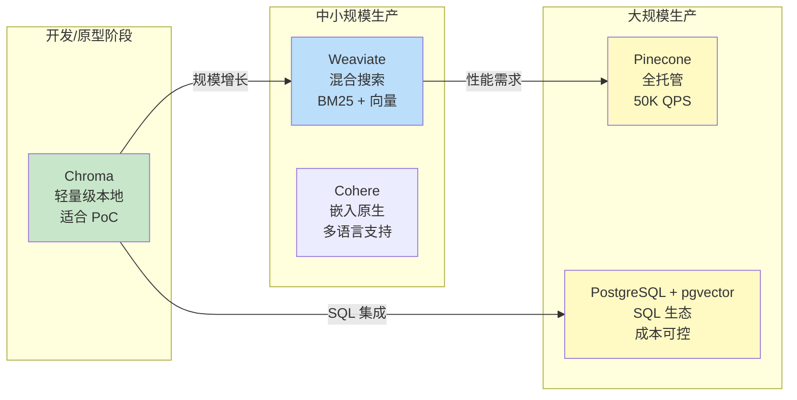
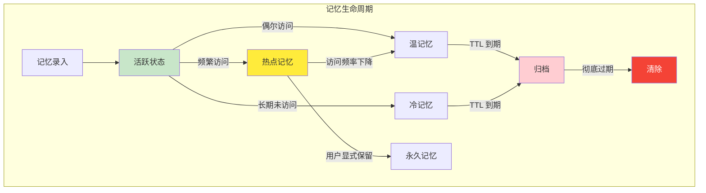

# Agent 状态与记忆：短期/长期/工作记忆的实现

## Executive Summary

记忆是 Agent 区别于普通 LLM 调用的核心能力。本报告系统分析了 Agent 记忆的分层架构（Working/Episodic/Semantic/Procedural）、实现机制（向量存储/知识图谱/关系数据库）、检索策略（TTL + 使用频率衰减）以及持久化方案。报告以 Letta（MemGPT）、LangGraph、OpenClaw 等主流框架为案例，提供从开发到生产的完整技术选型指南。

**核心结论**：单一记忆类型无法满足复杂 Agent 需求，混合架构（Episodic + Semantic + Working Memory）已成为 2025 年事实标准。向量存储选型应按规模分层：开发阶段用 Chroma，生产环境用 PostgreSQL + pgvector 或托管服务（Pinecone/Weaviate）。

---

## 1. 记忆分层架构

### 1.1 四层记忆模型

Agent 记忆受人类认知科学启发，形成四层分层架构[1][8]：



**Working Memory（工作记忆）**：相当于 Agent 的 "RAM"，存储当前 session 的活跃上下文。实现方式通常为滑动窗口或 KV Cache，容量受限于 LLM 上下文窗口[8]。

**Episodic Memory（情景记忆）**：存储具体的事件和对话历史，按时间序列组织。例如用户说过 "我偏好深色模式" 这类原始记录[2]。OpenClaw 将其保存为 `memory/YYYY-MM-DD.md` 格式的 markdown 文件[2]。

**Semantic Memory（语义记忆）**：存储结构化知识和事实，如用户偏好、领域知识。通常通过向量索引实现语义检索[1][5]。

**Procedural Memory（程序记忆）**：存储 "如何做" 的知识，包括工具使用模式、决策流程。表现为 Agent 的行为策略和工具调用序列[8]。

### 1.2 Letta 的三层记忆实现

Letta（原 MemGPT）提出了 LLM-as-OS 范式，将记忆分为三层[6]：

| 记忆层 | 用途 | 可见性 | 存储方式 |
|--------|------|--------|---------|
| Core Memory | 关键用户信息 | 始终注入上下文 | Memory Blocks |
| Recall Memory | 对话历史 | 按需检索 | 数据库持久化 |
| Archival Memory | 长期归档 | 语义搜索 | 向量存储 |

核心创新在于 **Self-Editing Memory** —— Agent 通过工具调用自主管理记忆块，实现记忆的读写更新[6]。

---

## 2. 短期记忆实现

### 2.1 对话上下文管理

短期记忆的核心是维护对话状态，主流框架采用两种模式：

**模式一：Checkpointer（检查点）**
LangGraph 使用 Checkpointer 保存对话线程状态[4][5]：

```python
# LangGraph Checkpointer 示例
from langgraph.checkpoint.postgres import PostgresSaver

checkpointer = PostgresSaver(conn=pool)
checkpointer.setup()  # 自动创建 checkpoints 表

# 每个 thread_id 对应一个独立对话
config = {"configurable": {"thread_id": "t456"}}
```

**模式二：滑动窗口 + 压缩**
保留最近 N 轮对话，对更早的历史进行摘要压缩。优点是成本可控，缺点是可能丢失细节[2]。

### 2.2 工作记忆（Working Memory）

工作记忆是当前活跃任务的临时存储，类似于开发者的剪贴板或笔记本[8]：



工作记忆的关键设计参数[1]：

| 参数 | 说明 | 推荐值 |
|------|------|--------|
| window_size | 滑动窗口大小 | 5-10 事件 |
| token_budget | 上下文令牌限制 | 1000-3000 |
| priority | 优先级排序 | episodic_recent > semantic_policy |
| dedupe | 去重策略 | source + hash |

---

## 3. 长期记忆实现

### 3.1 三种存储方案对比

| 方案 | 适用场景 | 优势 | 劣势 | 代表工具 |
|------|---------|------|------|---------|
| 向量存储 | 语义检索、模糊匹配 | 相似度搜索快 | 精确查询弱 | Pinecone, Chroma, Weaviate |
| 知识图谱 | 关系推理、实体关联 | 关系查询强 | 构建成本高 | Neo4j, Amazon Neptune |
| 关系数据库 | 结构化查询、事务 | ACID 保证、成熟 | 语义能力弱 | PostgreSQL, MySQL |

### 3.2 向量存储选型

2025 年主流向量数据库对比[10]：



**推荐方案**：PostgreSQL + pgvector 是 2025 年的性价比之选[12]：

```python
# PostgresStore 配置（LangGraph）
from langgraph.store.postgres import PostgresStore

store = PostgresStore(
    conn=pool,
    index={
        "dims": 1536,  # embedding 维度
        "embed": "openai:text-embedding-3-small",
        "fields": ["text"]  # 需要向量化的字段
    }
)
store.setup()  # 自动创建表 + 启用 pgvector 扩展
```

### 3.3 MongoDB 方案

MongoDB 官方提供了 LangGraph 集成，适合已有 MongoDB 基础设施的团队[5]：

```python
# MongoDB Store 特性
- 跨线程记忆存储（cross-thread memory）
- 灵活过滤（flexible filtering）
- 语义搜索（semantic search）
- 与 MongoDB Atlas 深度集成
```

---

## 4. 记忆检索与衰减

### 4.1 混合检索策略

2025 年的最佳实践是 **Episodic + Semantic 混合检索**[1]：

1. **Episodic 路径**：按时间窗口取最近 N 个事件（recency）
2. **Semantic 路径**：向量相似度搜索 Top-K 相关知识（relevance）
3. **Merge 层**：去重、优先级排序、Token 预算控制

配置示例[1]：

```json
{
  "episodic_window": {
    "mode": "last_n_events",
    "n": 5,
    "filters": {"session_id": "sess_7"}
  },
  "semantic_retrieval": {
    "top_k": 5,
    "filters": {"tags": ["policy"], "pii": false},
    "reranker": {"enabled": true, "model": "cross_encoder_mini"}
  },
  "merge_policy": {
    "dedupe": "source+hash",
    "priority": ["episodic_recent", "semantic_policy"],
    "token_budget": 3000
  }
}
```

### 4.2 相关性衰减机制

记忆衰减结合 TTL 和使用频率两个维度[9]：



衰减因子计算：

```
relevance_score = base_score × recency_weight × access_weight × explicit_boost

其中：
- recency_weight = exp(-age_days / ttl_days)
- access_weight = log(access_count + 1) / log(max_access + 1)
- explicit_boost = 1.5 if 用户标记重要，否则 1.0
```

**TTL 推荐值**[1][9]：

| 记忆类型 | TTL 建议 | 说明 |
|---------|---------|------|
| Session 临时 | 0（仅当前 session） | 工作记忆 |
| 对话历史 | 30 天 | Episodic，可 consolidation |
| 用户偏好 | 永久（需显式标记） | Semantic，Core Memory |
| 临时上下文 | 24 小时 | 任务相关缓存 |

---

## 5. 持久化与恢复

### 5.1 持久化策略

**Checkpoint 模式**（对话状态快照）[4][5]：

```python
# Checkpointer 自动保存每个 super-step 的状态
from langgraph.checkpoint.postgres import PostgresSaver

checkpointer = PostgresSaver(conn=pool)
checkpointer.setup()

# 恢复时指定 thread_id
config = {"configurable": {"thread_id": "t456", "checkpoint_id": "abc123"}}
state = graph.get_state(config)  # 获取历史状态
```

**Store 模式**（跨线程长期记忆）[5][11]：

```python
# Store 提供跨 session 的持久化
store.put(
    namespace=("email_assistant", "triage_preferences"),
    key="user_rule_1",
    value={"rule": "always ask before deleting", "importance": 0.9}
)

# 语义检索
results = store.search(
    namespace=("email_assistant",),
    query="用户偏好设置",
    limit=5
)
```

### 5.2 恢复策略

| 场景 | 恢复方式 | 实现 |
|------|---------|------|
| 对话续接 | Checkpoint 恢复 | `graph.invoke(input, config)` |
| 跨 session 记忆 | Store 检索 | `store.search(namespace, query)` |
| 灾难恢复 | 数据库备份 | pg_dump / mongodump |
| 迁移 | Schema 导出导入 | Export/Import API |

### 5.3 OpenClaw 的 File-First 方案

OpenClaw 采用文件系统作为记忆存储，具有零依赖、Git 友好的优势[2]：

```
~/.openclaw/workspace/
├── MEMORY.md          # Semantic Memory（长期知识）
├── SOUL.md            # Procedural Memory（行为规范）
└── memory/
    ├── 2026-03-24.md  # Episodic Memory（当日记录）
    └── 2026-03-23.md
```

**优点**：版本控制、人类可读、无需额外基础设施
**局限**：大规模语义检索效率低，建议搭配向量索引

---

## 6. 与设计阶段的衔接

本报告与 [设计·02] Agent 组件设计 中的记忆部分形成呼应，补充了实现层面的具体方案：

| 设计阶段定义 | 开发阶段实现 | 本报告覆盖 |
|-------------|-------------|-----------|
| 记忆组件接口 | Store / Checkpointer API | 第 5 章 |
| 短期记忆策略 | 滑动窗口 / Checkpoint | 第 2 章 |
| 长期记忆存储 | 向量 DB / 图 DB / RDBMS 选型 | 第 3 章 |
| 记忆生命周期 | TTL + 频率衰减 + Consolidation | 第 4 章 |
| 记忆分层定义 | Working/Episodic/Semantic/Procedural | 第 1 章 |

---

## 7. 结论

Agent 记忆实现的关键要点：

1. **分层是必须的**：Working/Episodic/Semantic/Procedural 四层模型已成为共识，单一记忆类型无法满足复杂场景[1][8]

2. **混合检索是标配**：Episodic（时间序列）+ Semantic（向量搜索）+ Reranker（精排）三阶段检索是 2025 年最佳实践[1]

3. **PostgreSQL + pgvector 是性价比之王**：同时支持 Checkpointer（短期）和 Store（长期），SQL 生态成熟，成本可控[12]

4. **TTL + 频率 = 智能衰减**：纯 TTL 过于机械，需结合访问频率实现自适应记忆管理[9]

5. **Memory Consolidation 是关键一步**：定期将 Episodic 压缩为 Semantic，防止记忆爆炸[2][6]

6. **Letta 的 Self-Editing Memory 代表前沿方向**：Agent 自主管理上下文窗口，实现动态记忆分配[6][7]

---

<!-- REFERENCE START -->
## 参考文献

1. Principia Agentica. Memory in Agents: Episodic vs. Semantic, and the Hybrid That Works (2025). https://principia-agentica.io/blog/2025/09/19/memory-in-agents-episodic-vs-semantic-and-the-hybrid-that-works/
2. Damian Galarza. How AI Agents Remember Things (2026). https://damiangalarza.com/posts/2026-02-17-how-ai-agents-remember-things/
3. Sai Kumar Yava. Building AI Agents That Actually Remember: A Deep Dive Into Memory Architectures (2025). https://pub.towardsai.net/building-ai-agents-that-actually-remember-a-deep-dive-into-memory-architectures-db79a15dba70
4. Sparkco. Mastering LangGraph State Management in 2025. https://sparkco.ai/blog/mastering-langgraph-state-management-in-2025
5. MongoDB. Powering Long-Term Memory For Agents With LangGraph and MongoDB (2025). https://www.mongodb.com/company/blog/product-release-announcements/powering-long-term-memory-for-agents-langgraph
6. Piyush Jhamb. Stateful AI Agents: A Deep Dive into Letta (MemGPT) Memory Models (2025). https://medium.com/@piyush.jhamb4u/stateful-ai-agents-a-deep-dive-into-letta-memgpt-memory-models-a2ffc01a7ea1
7. Letta. Lessons from ReAct, MemGPT, & Claude Code (2025). https://www.letta.com/blog/letta-v1-agent
8. arXiv. Memory in the Age of AI Agents: A Survey (2025). https://arxiv.org/abs/2512.13564
9. ChanAI. Build Your Own AI Agent Memory System (2025). https://www.chanl.ai/es/blog/build-your-own-ai-agent-memory-system
10. Propelius. Vector Databases Compared: Pinecone vs Weaviate vs Chroma (2025). https://propelius.ai/blogs/vector-databases-compared-pinecone-weaviate-chroma/
11. FareedKhan. Implementing Long Term Memory in Agentic AI (GitHub, 2025). https://github.com/FareedKhan-dev/langgraph-long-memory
12. Alon Jaman. Building Infinite Memory Agents: A Master Guide to LangGraph, LangMem and Postgres (2025). https://medium.com/@alonjamanjeetsinh77/building-infinite-memory-agents-a-master-guide-to-langgraph-langmem-and-postgres-05b3cabd689b
