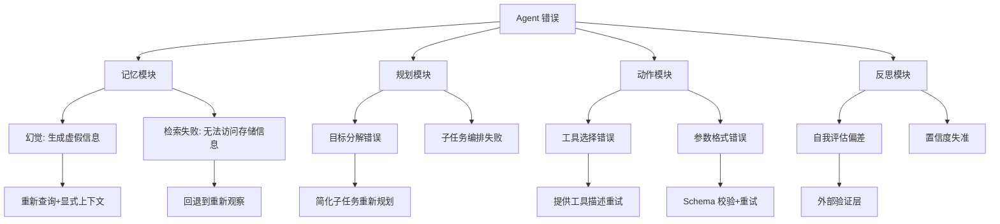
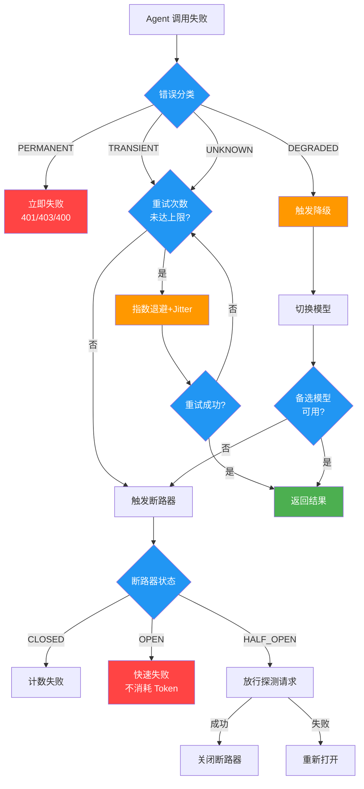
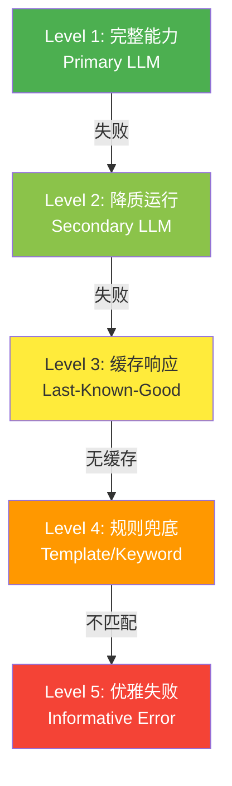

# Agent 错误处理与容错：重试、降级、断路器

## Executive Summary

AI Agent 在生产环境中面临着与传统软件截然不同的错误模型。LLM 幻觉、上下文溢出、非确定性输出、工具调用失败等错误不是"边缘情况"，而是日常运营现实[1]。研究表明，合理的错误处理策略可以将 LLM API 失败率降低 90%[6]，而像 VIGIL 这样的自修复框架可以将任务成功率提升 24% 以上，平均延迟从 97 秒降至 8 秒[3]。

本报告系统梳理了 Agent 系统特有的错误类型，构建了**错误分类 → 重试 → 降级 → 断路器 → 恢复**的分层防御体系，提供了可直接落地的代码实现和架构决策树。核心洞察：**错误传播是 Agent 鲁棒性的核心瓶颈**——单个失败会通过规划、记忆、动作模块级联放大[3][7]。生产级 Agent 必须将错误处理视为一等公民架构关注点，而非事后补救。

---

## 1. Agent 特有的错误类型

### 1.1 与传统软件的本质区别

传统 API 失败是确定性的：数据库挂了返回连接错误，Token 过期返回 401。LLM 驱动的 Agent 引入了全新的失败模型[1]：

| 错误类型 | 特征 | Agent 影响 |
|---------|------|-----------|
| **LLM 幻觉** | 生成不存在的 API 调用、错误的文件路径、编造数据 | 错误状态级联传播，难以回溯 |
| **上下文溢出** | 随对话历史和工具结果累积而静默发生 | 整个 Pipeline 崩溃，难以提前检测 |
| **非确定性输出** | 即使 temperature=0，GPU 浮点舍入也产生不同 token 序列[7] | Checkpoint 恢复后生成不同请求，导致重复执行 |
| **内容策略拒绝** | 不同供应商、不同时间触发，输入不可预测 | 需要跨供应商降级 |
| **工具调用失败** | 参数校验、权限、资源耗尽 | 计划中断，需要重试或替代方案 |
| **响应格式漂移** | 供应商更新模型后输出微妙变化 | 下游解析无声失败 |

### 1.2 模块级错误分类

根据 Agent 架构，错误可按模块分类[3]：



> **图 1: Agent 模块级错误分类与恢复策略**

### 1.3 多 Agent 系统的失败模式

MAST (Multi-Agent System Taxonomy) 将多 Agent 系统失败归为三类[3]：

- **系统设计问题 (40%)**: 角色定义不清、缺少协调协议、错误边界不足
- **Agent 间对齐失败 (35%)**: 信息在传递中丢失、目标冲突、上下文传播不完整
- **任务验证失败 (25%)**: 无中间输出验证、缺少成功标准、过早声明完成

---

## 2. 错误分类与决策树

### 2.1 错误分类法

在实现任何容错逻辑之前，**先分类，再处理**[4][1]。重试认证失败是浪费时间；不重试限速错误则白白丢失请求。

| 错误类型 | HTTP 状态码 | 可重试？ | 策略 |
|---------|------------|---------|------|
| **限速** | 429 | ✅ 是 | 按 Retry-After 头退避 |
| **服务端错误** | 500, 502, 503, 504 | ✅ 是 | 指数退避 |
| **模型过载** | 529 (Anthropic) | ✅ 是 | 更长退避 (120s+) |
| **超时** | - | ⚠️ 有限 | 缩短超时，限制重试次数 |
| **客户端错误** | 400, 401, 403 | ❌ 否 | 修复请求，不重试 |
| **上下文长度** | 400 (特定) | ❌ 否 | 缩减输入，切换模型 |

### 2.2 错误处理决策树



> **图 2: Agent 错误处理决策树** — 从错误分类出发，经过重试、降级、断路器三层防御

---

## 3. 重试策略

### 3.1 指数退避 + Jitter

这是 LLM 应用的黄金标准[4][1][6]。核心公式：

```
delay = min(base_delay × 2^attempt, max_delay) + random(0, jitter)
```

**为什么需要 Jitter？** 没有 Jitter 时，100 个客户端同时触发限速，会在相同时间点重试，产生新一轮峰值——这就是"惊群效应"(Thundering Herd)。加入随机抖动后，重试被分散到时间窗口内，惊群减少 60-80%[3]。

Jitter 算法对比[3]：

| 算法 | 客户端负载 | 完成时间 | 适用场景 |
|------|----------|---------|---------|
| No Jitter | 高 | 最长 | ❌ 从不使用 |
| Full Jitter | 低 | 快 | ✅ 大多数场景 |
| Equal Jitter | 低 | 快 | 避免极短等待 |
| Decorrelated Jitter | 中 | 中 | 变动负载 |

### 3.2 推荐配置

```python
RETRY_CONFIG = {
    "max_retries": 3,        # 通常 3-5 次
    "initial_delay": 1.0,    # 初始等待 1 秒
    "max_delay": 60.0,       # 上限 60 秒
    "exponential_base": 2,   # 翻倍增长
    "jitter": True           # 必须开启
}
```

### 3.3 三种重试模式

**模式 1: 指数退避 + Jitter** — 基线方案，适用于大多数场景[4]。

**模式 2: Deadline 驱动重试** — 当用户在等待时，绝对时间比尝试次数更重要。随着截止时间逼近，自动缩短退避间隔[4]。

**模式 3: 幂等性感知重试** — 某些操作（发送邮件、支付）不应盲目重试。需要先检查是否已执行，避免产生重复[4][6]。

### 3.4 重试预算

无限制重试会演变为自造的 DoS 攻击[6]：

- **单请求预算**: 最多 3-5 次尝试
- **时间预算**: 最多 30 秒用于重试
- **系统级预算**: 当重试率超过 10% 时，停止重试（表示是系统性问题）

---

## 4. 降级策略

### 4.1 降级层次结构

当主要能力失败时，按以下层级逐级降级[3][5]：



> **图 3: 降级层次结构** — 从完整能力到优雅失败的五级降级

### 4.2 模型降级链

关键设计原则：按质量优先 → 不同供应商 → 成本优化排列[1]：

```python
FALLBACK_CHAIN = [
    {"provider": "anthropic", "model": "claude-opus-4",  "tier": "primary"},
    {"provider": "openai",    "model": "gpt-4o",         "tier": "secondary"},
    {"provider": "anthropic", "model": "claude-sonnet-4", "tier": "fallback"},
    {"provider": "local",     "model": "llama-3-70b",    "tier": "emergency"},
]
```

降级时必须传递完整对话历史——备选模型需要继承计算上下文以实现无缝接续[3]。

### 4.3 语义降级

当 LLM 输出在语法上有效但语义错误时[8]：

- **多 Prompt 变体**: 为同一任务维护不同语气、指令顺序的 Prompt 模板
- **验证优先执行**: 输出未通过 Schema 或语义检查时，触发替代 Prompt 路径
- **响应后处理器**: 将格式不良的响应强制修正为有效格式
- **Pydantic 校验**: 输出不合规时路由到 Sanitization Agent 或重新生成

---

## 5. 断路器模式

### 5.1 核心概念

重试和降级处理的是单个请求失败。断路器解决的是**当服务持续宕机 10 分钟时，每个请求都花 30 秒重试后才失败**的问题[1]。

断路器监控失败率，超过阈值后立即拒绝请求（快速失败），而不是等待必然的超时。这同时保护了你的系统和正在挣扎的下游服务[6]。

### 5.2 三态模型

```
CLOSED (正常) ──── 失败次数 > 阈值 ────► OPEN (快速失败)
   ▲                                        │
   │                                    冷却期过期
   │                                        ▼
   └──────── 成功 <──────────────── HALF_OPEN (探测)
```

### 5.3 推荐配置

| 参数 | 推荐值 | 说明 |
|------|-------|------|
| 失败阈值 | 5 次 / 60 秒 | 太敏感→误报；太迟钝→漏检 |
| 冷却时间 | 30-60 秒 | 给服务恢复时间 |
| 半开探测 | 1-3 个请求 | 足以评估恢复情况 |
| 成功阈值 | 2 次连续成功 | 确认恢复后关闭 |

### 5.4 断路器作用范围

| 范围 | 优势 | 代价 |
|------|------|------|
| **Per-Provider** | 一家宕机不影响其他 | 粒度较粗 |
| **Per-Model** | 模型级别隔离 | 配置更多 |
| **Per-Endpoint** | Chat/Embedding/FineTuning 互不影响 | 管理复杂 |

Salesforce Agentforce 的实践[6]：当 60 秒窗口内 OpenAI 流量失败率超过 40% 时，绕过重试，直接将所有流量切换到 Azure OpenAI 上的等价模型。

---

## 6. 错误恢复：检查点与回滚

### 6.1 Durable Execution 模式

对于长时间运行的 Agent 任务，检查点（Checkpoint）机制是关键[3]：

```python
class DurableAgent:
    async def execute_task(self, task_id, steps):
        # 从上次检查点恢复
        checkpoint = self.checkpoint_store.get(task_id)
        start_step = checkpoint.last_completed + 1 if checkpoint else 0

        for i, step in enumerate(steps[start_step:], start=start_step):
            try:
                result = await self.execute_step(step)
                self.checkpoint_store.save(task_id, step=i, result=result)
            except Exception as e:
                raise RetryableError(f"Failed at step {i}", resume_from=i)
```

优势：
- 失败不必从头开始
- 节省长任务的 API 成本
- 支持可恢复的工作流

### 6.2 Checkpoint 的安全风险：语义回滚攻击

**重要发现** (ACRFence, 2026)[7]：Agent 框架的 Checkpoint-Restore 机制存在严重安全隐患。

由于 LLM 的非确定性，恢复后的 Agent 会重新生成"微妙不同"的请求。服务器将这些视为新请求，导致：
- **Action Replay**: 重复付款（实验中 100% 复现）
- **Authority Resurrection**: 已消耗的单次令牌在回滚后"复活"

受影响框架包括 LangGraph、Cursor、Claude Code、Google ADK、CrewAI、AutoGen 等[7]。

**缓解方案**: ACRFence 记录不可逆的工具调用效果，在恢复时强制执行 Replay-or-Fork 语义。

### 6.3 状态验证与自愈

关键操作后运行断言验证实际效果[8]：

```python
if not os.path.exists("/tmp/config.yaml"):
    trigger_replan("config_file_missing")  # 触发重新规划
```

维护"预期 vs 实际"状态映射，在验证失败时触发回滚或重新规划。

---

## 7. 实施建议

### 7.1 简单 Agent 检查清单

- [x] 所有 API 调用实现指数退避 + Jitter
- [x] 错误分类为 Transient vs Permanent
- [x] 设置最大重试次数 (3-5)
- [x] 所有失败附带上下文日志
- [x] 设置超时（不无限等待）

### 7.2 生产 Agent 检查清单

- [x] 每个外部依赖配置断路器
- [x] 实现多供应商降级链
- [x] 缓存成功响应用于降级场景
- [x] 配置所有依赖的健康检查
- [x] 监控失败率，异常时告警
- [x] 在 Staging 测试故障场景

### 7.3 关键监控指标

| 指标 | 目标值 | 告警阈值 |
|------|-------|---------|
| 成功率 | > 99% | < 95% |
| 重试率 | < 5% | > 15% |
| 断路器触发 | < 1/小时 | > 5/小时 |
| 降级使用率 | < 2% | > 10% |
| 平均恢复时间 | < 5s | > 30s |

### 7.4 工具与框架推荐

| 工具 | 用途 | 关键特性 |
|------|------|---------|
| **Tenacity** (Python) | 重试库 | 灵活的重试策略配置 |
| **Portkey** | AI Gateway | 内置降级、断路器、缓存 |
| **LiteLLM** | 多供应商代理 | 统一 API、自动降级 |
| **Resilience4j** (Java) | 断路器 | 完整容错模式 |
| **Prefect + Pydantic AI** | 持久执行 | 失败恢复 |
| **LangGraph** | Agent 编排 | 状态管理、错误处理 |
| **wrapt + tenacity** | 工具调用重试 | Proxy 模式包装 MCP 工具 [2] |

---

## 结论

Agent 系统的错误处理不是可选的"锦上添花"，而是生产部署的**前提条件**。核心原则：

1. **分类优先**: 不是所有错误都值得重试，分类是正确响应的前提
2. **分层防御**: 重试 → 降级 → 断路器 → 恢复，逐层兜底
3. **幂等性意识**: Checkpoint 恢复后重放可能产生语义级副作用
4. **快速失败**: 断路器既保护自己，也保护挣扎中的下游服务
5. **可观测性**: 监控重试率、降级率、恢复时间，异常即告警

构建生产级 Agent 不是在 LLM 调用外面包一层 try-catch——它需要系统性的架构设计，将容错作为第一公民融入 Agent 的每一个交互层。

<!-- REFERENCE START -->
## 参考文献

1. NebulaGG. AI Agent Error Handling: 4 Resilience Patterns in Python (2026). https://dev.to/nebulagg/ai-agent-error-handling-4-resilience-patterns-in-python-12of
2. Matthew Casperson. Resilient AI agents with MCP: Timeout and retry strategies (2025). https://octopus.com/blog/mcp-timeout-retry
3. Zylos AI Research. AI Agent Error Handling & Recovery: Building Resilient Autonomous Systems (2026). https://zylos.ai/research/2026-01-12-ai-agent-error-handling-recovery
4. Aethenic Blog. AI Agent Retry Strategies: Exponential Backoff and Graceful Degradation (2025). https://getathenic.com/blog/ai-agent-retry-strategies-exponential-backoff
5. Portkey. How to Design a Reliable Fallback System for LLM Apps Using an AI Gateway (2025). https://portkey.ai/blog/how-to-design-a-reliable-fallback-system-for-llm-apps-using-an-ai-gateway/
6. Enrico Piovano. Error Handling & Resilience for LLM Applications: Production Patterns (2025). https://enricopiovano.com/blog/llm-error-handling-resilience-production/
7. Zheng Y, Yang Y, Zhang W, Quinn A. ACRFence: Preventing Semantic Rollback Attacks in Agent Checkpoint-Restore (2026). https://arxiv.org/html/2603.20625v1
8. GoCodeo. Error Recovery and Fallback Strategies in AI Agent Development (2025). https://www.gocodeo.com/post/error-recovery-and-fallback-strategies-in-ai-agent-development
