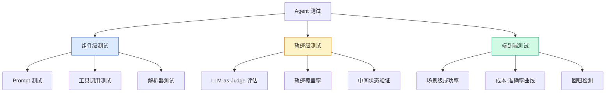
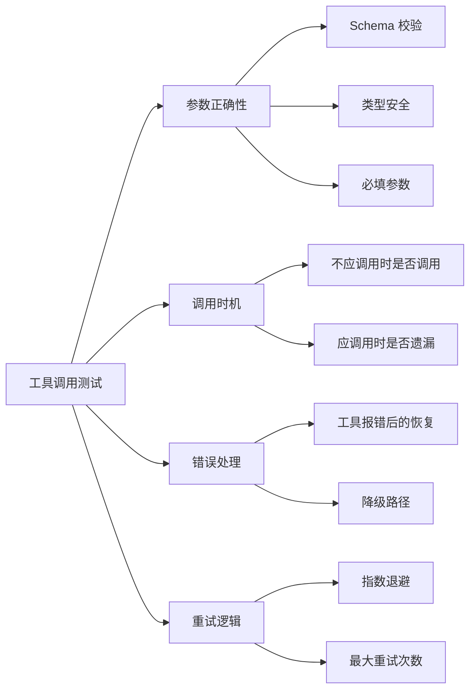
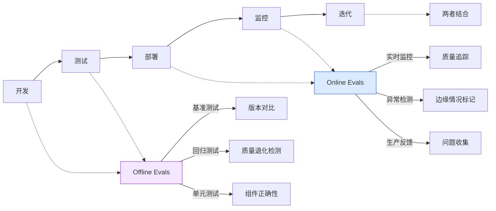
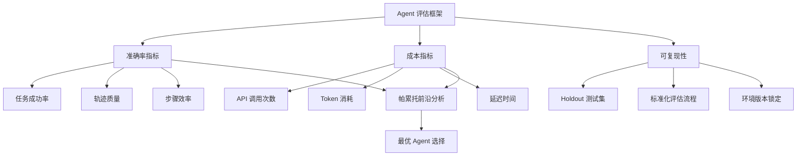

# Agent 单元与集成测试：从 Mock 到端到端验证

## Executive Summary

传统软件测试的"排列-操作-断言"模式在 AI Agent 领域几乎失效——LLM 输出的非确定性让断言（assert）无从下手，工具调用的副作用让 mock 无意义，多 Agent 协作的涌现行为让覆盖率成为幻觉[1][4]。这不是测试方法的改良问题，而是测试范式的根本重构。

本报告系统梳理了 Agent 测试的三大核心挑战：**非确定性评估、工具调用验证、多 Agent 协作测试**，构建了从单元测试到端到端验证的分层测试体系。关键发现：**LLM-as-Judge 已成为 Agent 评估的事实标准**，但其 bias 和 prompt sensitivity 问题需要系统性应对[2]；**LangSmith、LangFuse、Phoenix 三大平台在功能定位上形成差异化竞争**，而非简单的替代关系[1][5][6]；多 Agent 测试的正确率评估必须引入**成本-准确率联合优化**，否则 SOTA 结论可能是误导[4]。

---

## 1. Agent 测试的特殊性

### 1.1 为什么传统测试不够？

传统单元测试的黄金法则——"给定输入，期望确定输出"——在 Agent 场景下彻底失效。核心差异[1][4]：

| 维度 | 传统软件测试 | Agent 测试 |
|------|------------|-----------|
| **输出确定性** | 相同输入 → 相同输出 | 相同 prompt → 不同输出 |
| **断言方式** | assertEqual(expected, actual) | 语义级评估（相关性、完整性） |
| **工具 Mock** | Mock 返回固定值 | Mock 需要上下文感知的响应 |
| **测试粒度** | 函数级别 | Agent trajectory（轨迹）级别 |
| **失败定义** | 异常抛出 / 值不匹配 | 部分正确 / 路径偏离 / 幻觉 |
| **回归检测** | 值变更 = 回归 | 输出变更 ≠ 回归（可能更好） |

### 1.2 Agent 测试的三层范式



> **图 1: Agent 测试的三层范式** — 从组件到轨迹到端到端，测试粒度逐层递增

### 1.3 LLM-as-Judge：非确定性输出的解法

当断言不能用 `assertEqual` 时，**让另一个 LLM 来评判**成为事实标准[2][5]。LLM-as-Judge 的三种评估模式[2]：

| 评估模式 | 适用场景 | 优势 | 局限 |
|---------|---------|------|------|
| **Pointwise** | 单个输出打分 | 适合质量评估 | 缺乏比较基准 |
| **Pairwise** | 两个输出对比 | 更可靠的一致性 | 只能比较，不能绝对评分 |
| **Listwise** | 多输出排序 | 适合搜索/推荐 | 成本高，上下文长 |

**LLM-as-Judge 的已知问题**[2][3]：
- **Position Bias**: 靠前的答案倾向获得更高分
- **Verbosity Bias**: 更长的回答倾向获得更高分
- **Self-Bias**: 同模型评估自己时倾向给自己高分
- **Domain Expertise**: 专业领域（医疗、法律）评估不可靠

**缓解策略**：混合评估（LLM + 人工）、多模型投票、标准化 Prompt 设计[2]。

---

## 2. 工具调用的 Mock 与 Stub

### 2.1 为什么工具 Mock 在 Agent 场景更难？

Agent 的工具调用不是简单的 HTTP 请求，而是**上下文依赖的序列**[1][7]：

```python
# 传统 Mock（不够）
mock_api_call.return_value = {"status": "success"}

# Agent 需要的 Mock（上下文感知）
def mock_tool_call(tool_name, params, conversation_history):
    if tool_name == "search":
        # 基于搜索词返回不同结果
        return mock_search_results(params["query"])
    elif tool_name == "file_write":
        # 记录写入，供后续验证
        written_files[params["path"]] = params["content"]
        return {"status": "success"}
```

### 2.2 推荐的 Mock 策略

| 策略 | 实现方式 | 适用场景 |
|------|---------|---------|
| **固定 Mock** | `return_value = X` | 工具输出确定的场景（如版本号查询） |
| **参数化 Mock** | 基于输入参数返回不同输出 | 工具行为与输入相关的场景 |
| **录制-回放** | 录制真实工具调用，测试时回放 | 需要真实工具行为但不想依赖外部服务 |
| **状态 Mock** | 维护虚拟状态（文件系统、数据库） | 需要多步操作的场景 |
| **语义 Mock** | 使用 LLM 生成模拟响应 | 工具输出复杂、非结构化的场景 |

### 2.3 工具调用测试的关键维度



> **图 2: 工具调用测试的四个关键维度** — 不仅测试"能不能调对"，还测试"该不该调、错了怎么办"

---

## 3. 端到端测试框架

### 3.1 三大平台对比

Agent 测试框架的"三巨头"在功能定位上有明显差异化[1][5][6]：

| 维度 | LangSmith | LangFuse | Phoenix |
|------|-----------|----------|---------|
| **定位** | 商业化评估平台 | 开源 LLM 可观测性 | 开源 AI 可观测性 |
| **核心优势** | 与 LangChain 深度集成 | 轻量、自托管友好 | 多框架兼容、实验管理 |
| **评估方式** | Dataset + Evaluator | LLM-as-Judge + 自定义 | LLM-as-Judge + Spans |
| **Online 评估** | ✅ 生产监控 | ✅ 实时评估 | ✅ 生产追踪 |
| **Agent 支持** | ✅ trajectory 评估 | ✅ trace 评估 | ✅ OpenTelemetry tracing |
| **成本** | 付费（有免费额度） | 开源免费 | 开源免费 |

### 3.2 LangSmith：全生命周期评估

LangSmith 的评估分 **Offline（预部署）** 和 **Online（生产监控）** 两条线[1]：



> **图 3: LangSmith 评估生命周期** — Offline 用于预部署验证，Online 用于生产监控

**Agent 评估的关键实践**[1]：
- 构建 **Dataset**（5-10 个示例定义"好"的标准）
- 使用 **Evaluator** 评分（LLM-as-Judge 或规则判定）
- 评估 **Trajectory**（Agent 的工具调用序列是否合理）
- 设置 **Online Monitor**（生产流量的持续质量追踪）

### 3.3 LangFuse：轻量级评估

LangFuse 的核心理念是**用数据替代猜测**[5]：

```python
# LangFuse 评估示例
from langfuse import Langfuse
from langfuse.openai import wrap_openai

langfuse = Langfuse()
client = wrap_openai(openai.Client())

# 创建数据集
dataset = langfuse.get_or_create_dataset(name="agent-test-set")

# 运行实验
experiment = dataset.run_experiment(
    name="agent-v2-test",
    item_evaluator=my_evaluator,  # LLM-as-Judge 或自定义
    func=lambda item: agent.run(item["input"])
)
```

### 3.4 Phoenix：可观测性驱动

Phoenix 的独特优势在于**实验管理和 Prompt 版本控制**[6]：
- **Datasets**: 版本化测试数据集
- **Experiments**: 追踪 prompt/模型/参数变更的效果
- **Playground**: 在线调试和优化 prompt
- **Prompt Management**: 版本控制 + tag 管理 prompt 变更

---

## 4. 多 Agent 协作测试

### 4.1 多 Agent 测试的独特挑战

多 Agent 系统的测试不是"每个 Agent 单独测，再加一个集成测试"这么简单[4]：

| 挑战 | 描述 | 难度 |
|------|------|------|
| **涌现行为** | 整体行为不等于部分之和 | ⭐⭐⭐⭐⭐ |
| **竞态条件** | Agent 间时序依赖难以复现 | ⭐⭐⭐⭐ |
| **信息衰减** | 消息在 Agent 间传递时丢失 | ⭐⭐⭐ |
| **目标冲突** | 多 Agent 目标不一致时的行为 | ⭐⭐⭐⭐ |
| **成本失控** | Agent 间反复通信消耗大量 Token | ⭐⭐⭐ |

### 4.2 AgentBoard：细粒度评估

AgentBoard 提出了**进度率指标（Progress Rate）**来替代简单的成功率[7]：

```
Progress Rate = 最终进度 / 理想步数
```

这解决了传统评估的盲点——一个 Agent 可能最终失败，但在过程中完成了 80% 的有效步骤，这比完全失败的 Agent 更有价值。

### 4.3 成本-准确率联合优化

Kapoor et al. 在 "AI Agents That Matter" 中指出了当前 Agent 评估的核心缺陷[4]：

> **"只关注准确率会导致 SOTA Agent 过度复杂和昂贵，社区对准确率提升来源的结论是错误的。"**

正确做法是构建**帕累托前沿（Pareto Frontier）**，在成本和准确率之间寻找最优解：



> **图 4: 成本-准确率联合评估框架** — 避免只看准确率的评估陷阱

---

## 5. 实施建议

### 5.1 单元测试检查清单

- [ ] Prompt 变体测试（同一任务不同 Prompt 对比）
- [ ] 工具参数 Schema 校验
- [ ] 解析器鲁棒性测试（畸形输入）
- [ ] 错误处理路径覆盖
- [ ] LLM-as-Judge 置信度阈值设定

### 5.2 集成测试检查清单

- [ ] Agent trajectory 录制与回放
- [ ] 多步任务端到端成功率
- [ ] 工具调用序列验证
- [ ] 成本监控（Token 预算）
- [ ] 回归检测（新版本不退化）

### 5.3 多 Agent 测试检查清单

- [ ] 单 Agent 隔离测试通过
- [ ] 两两 Agent 交互测试
- [ ] 信息传递完整性验证
- [ ] 冲突解决机制测试
- [ ] 成本-准确率帕累托分析

### 5.4 工具与框架推荐

| 工具 | 用途 | 关键特性 |
|------|------|---------|
| **LangSmith** | 全生命周期评估 | Dataset、Evaluator、Online Monitor |
| **LangFuse** | 轻量评估平台 | 开源、LLM-as-Judge、Trace |
| **Phoenix** | 可观测性平台 | Experiments、Prompt Management |
| **AgentBoard** | Agent Benchmark | 进度率、多维分析 |
| **Prometheus** | 开源 Evaluator LLM | 自定义 Rubric、Pearson 0.897 |
| **Pytest + Mock** | 单元测试基础 | 灵活的 Mock 和 Assert |

---

## 结论

Agent 测试不是传统软件测试的延伸，而是**测试范式的重构**：

1. **非确定性评估**: LLM-as-Judge 是解法，但需要警惕 bias；多模型投票 + 人工抽检是当前最佳实践
2. **工具 Mock 上下文化**: 固定返回值不够，需要参数化和状态感知的 Mock
3. **评估框架三分天下**: LangSmith（商业化集成）、LangFuse（轻量开源）、Phoenix（可观测性驱动），按需选择
4. **成本-准确率联合优化**: 只看准确率会得出误导性结论，必须同时看成本
5. **多 Agent 测试需要分层**: 从单 Agent 隔离到两两交互再到全系统，逐层验证

Agent 测试的终极目标不是追求 100% 覆盖率（那不可能），而是**建立对 Agent 行为的信心**——知道它在什么条件下可靠，什么条件下会失败，失败时如何优雅降级。

<!-- REFERENCE START -->
## 参考文献

1. LangChain. LangSmith Evaluation Concepts (2025-2026). https://docs.langchain.com/langsmith/evaluation-concepts (accessed 2026-03-30)
2. Arize AI. LLMs as Judges: A Comprehensive Survey on LLM-Based Evaluation Methods (2024). https://arxiv.org/abs/2412.05579 (accessed 2026-03-30)
3. Kim S, Shin J, Cho Y et al. Prometheus: Inducing Fine-grained Evaluation Capability in Language Models (2024). https://arxiv.org/abs/2310.08491 (accessed 2026-03-30)
4. Kapoor S et al. AI Agents That Matter (2024). https://arxiv.org/abs/2407.01502 (accessed 2026-03-30)
5. LangFuse. Evaluation Overview (2025-2026). https://langfuse.com/docs/evaluation/overview (accessed 2026-03-30)
6. Arize AI. Phoenix: AI Observability & Evaluation (2025-2026). https://github.com/Arize-ai/phoenix (accessed 2026-03-30)
7. AgentBoard. An Analytical Evaluation Board of Multi-turn LLM Agents (2024). https://arxiv.org/abs/2401.13178 (accessed 2026-03-30)
