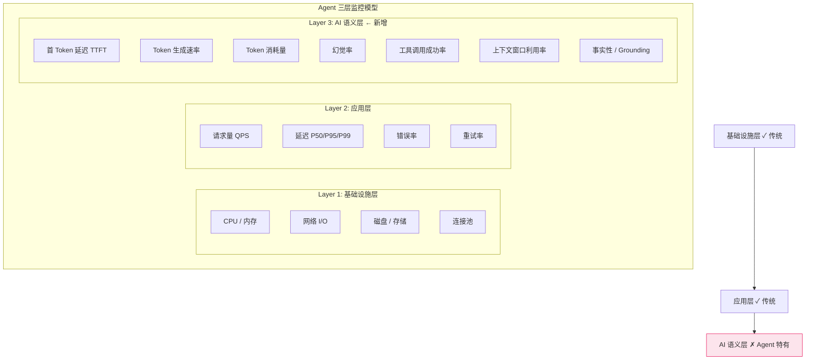
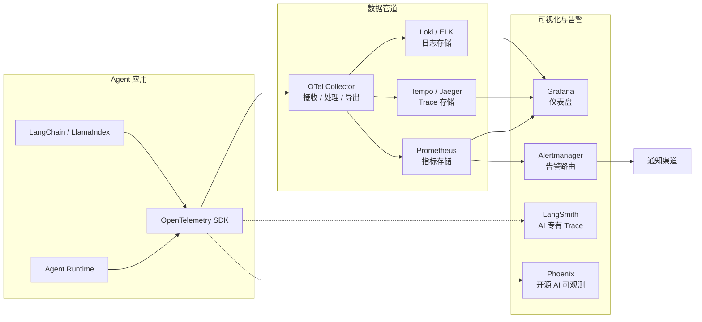
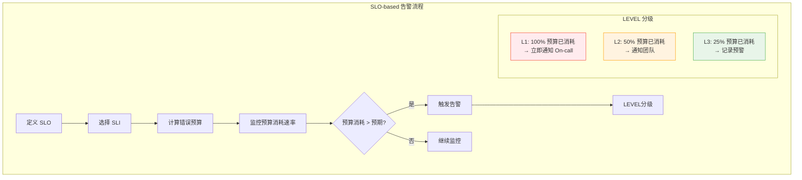
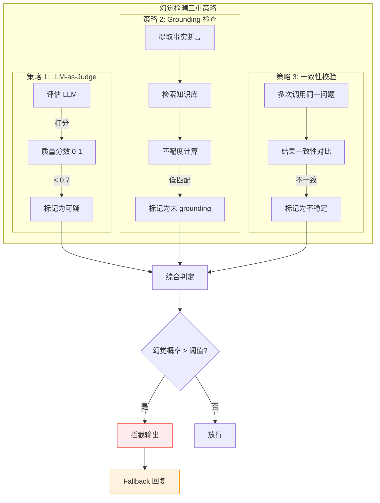
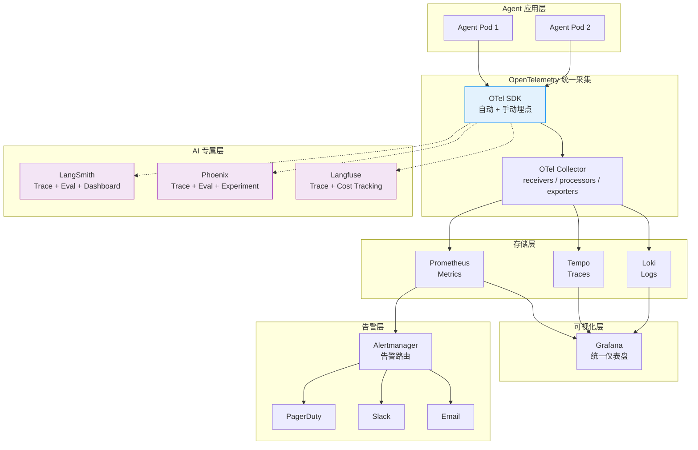

# Agent 监控与告警：指标体系、阈值设定、通知渠道

## Executive Summary

AI Agent 从原型走向生产后，监控与告警是保障系统稳定性和输出质量的最后一道防线。与传统微服务不同，Agent 系统的监控需要同时覆盖**基础设施层**（容器、网络、存储）、**应用层**（请求量、延迟、错误率）和**AI 层**（Token 消耗、幻觉检测、工具调用正确性）三个维度。

核心发现：

- **Agent 监控的本质区别在于"输出质量不可预测"**：传统微服务的输入输出是确定性的，监控焦点在延迟和可用性；Agent 的 LLM 调用可能返回错误但不报 HTTP 错误，需要额外的语义层评估[1][2]。
- **LLM 特有指标（TTFT、Token 生成速率、幻觉率）是 Agent 健康度的关键信号**：TTFT（首 Token 延迟）突增可能预示模型端限流，幻觉率上升则可能意味着 Prompt 漂移或上下文溢出[3][4]。
- **SLO-based 告警 + 动态基线是避免告警疲劳的最佳实践**：静态阈值难以适应 Agent 流量的潮汐特性，基于 SLO 消耗速率的告警能更精准地定位真正的 SLO 风险[5][6]。
- **可观测性工具栈已形成"基础层 + AI 专属层"的双层架构**：Prometheus/Grafana 负责指标和仪表盘，LangSmith/Phoenix/Langfuse 负责 Trace 和 AI 语义评估，二者通过 OpenTelemetry 桥接[7][8][9]。
- **幻觉检测需组合使用 LLM-as-Judge、Grounding 检查和一致性校验**：单一方法的召回率不足 70%，组合策略可提升至 90% 以上[10][11]。

---

## 1. Agent 监控与传统微服务的本质区别

### 1.1 三维度监控模型

传统微服务监控集中在**基础设施层**和**应用层**，而 Agent 系统新增了关键的**AI 语义层**：



### 1.2 核心差异对比

| 维度 | 传统微服务 | AI Agent |
|------|-----------|----------|
| **输出确定性** | 输入→输出确定 | LLM 输出概率性，同输入不同输出 |
| **错误定义** | HTTP 4xx/5xx | 返回 200 但内容幻觉/错误 |
| **延迟特征** | 相对稳定（10-500ms） | 高度波动（1-120s），受模型、Prompt 长度影响 |
| **成本模型** | 计算资源（可预测） | Token 计费（与用户输入长度正相关） |
| **状态复杂度** | 连接状态、缓存 | 会话记忆、上下文窗口、多轮对话 |
| **质量评估** | 不需要（输出确定） | 必须评估输出质量（幻觉、偏见、安全性） |
| **工具依赖** | 内部服务调用 | 可能调用外部 MCP 工具、API、数据库 |
| **扩缩挑战** | CPU/内存是主要瓶颈 | Token 吞吐量是瓶颈，GPU 为隐性资源 |

### 1.3 Agent 特有的故障模式

Agent 系统存在传统微服务不会遇到的故障模式：

1. **幻觉级联（Hallucination Cascade）**：Agent A 的幻觉输出作为 Agent B 的输入，错误被放大
2. **工具调用死循环**：Agent 无限重试工具调用，消耗 Token 但无进展
3. **上下文窗口溢出**：长对话导致上下文超限，模型丢弃早期信息
4. **Prompt 注入**：用户输入绕过安全限制，导致 Agent 行为异常
5. **Token 经济崩溃**：突发流量导致 Token 成本远超预算

---

## 2. Agent 核心指标体系

### 2.1 基础指标（与传统微服务共享）

| 指标 | 类型 | 说明 | 典型 SLO |
|------|------|------|---------|
| **请求量 QPS** | Counter | 每秒请求数 | 无 SLO，但用于容量规划 |
| **延迟 P50/P95/P99** | Histogram | 端到端响应延迟 | P99 < 10s |
| **错误率** | Gauge | 5xx / 总请求 | < 0.1% |
| **活跃实例数** | Gauge | 当前运行的 Agent Pod 数 | >= minReplicas |
| **并发连接数** | Gauge | 同时活跃的用户会话 | <= maxConnections |

### 2.2 LLM 特有指标

| 指标 | 含义 | 计算方式 | 告警阈值建议 |
|------|------|---------|-------------|
| **TTFT (Time to First Token)** | 从请求到收到第一个 Token 的延迟 | `first_token_timestamp - request_timestamp` | P95 > 5s（正常），> 15s（告警） |
| **Token 生成速率 (Tokens/s)** | 模型生成 Token 的速度 | `output_tokens / generation_time` | P5 < 20 tokens/s |
| **Token 消耗量** | 输入 + 输出 Token 总量 | OpenAI API 返回 | 单次 > context_window × 0.9 |
| **上下文窗口利用率** | 已用 Token / 最大上下文窗口 | `used_tokens / max_context` | > 85% 警告，> 95% 严重 |
| **幻觉率** | 输出中不实信息的比例 | LLM-as-Judge 评估 | > 5% 严重告警 |
| **工具调用成功率** | 工具调用返回成功 / 总调用 | `success / total` | < 95% 警告 |
| **工具调用延迟** | 工具调用的端到端延迟 | Histogram | P95 > 30s |
| **Conversation 回合数** | 单次对话的轮数 | Count | 异常长对话检测（> 50 轮） |

### 2.3 指标采集架构



### 2.4 自定义指标埋点示例

```python
from opentelemetry import metrics
from opentelemetry.sdk.metrics import MeterProvider

meter = metrics.get_meter("agent-monitoring")

# Token 消耗计数器
token_counter = meter.create_counter(
    name="agent.tokens.consumed",
    description="Total tokens consumed per request",
    unit="tokens"
)

# 幻觉率 Gauge
hallucination_gauge = meter.create_observable_gauge(
    name="agent.output.hallucination_rate",
    callbacks=[lambda _: hallucination_rate],
    description="Hallucination rate over last 5 minutes",
    unit="ratio"
)

# 工具调用成功率
tool_success_rate = meter.create_observable_gauge(
    name="agent.tool.success_rate",
    callbacks=[lambda _: tool_success],
    description="Tool call success rate",
    unit="ratio"
)

# 记录一次 LLM 调用
token_counter.add(
    input_tokens + output_tokens,
    {"model": "gpt-4o", "agent_id": agent_id, "type": "output"}
)
```

---

## 3. 告警阈值设定策略

### 3.1 静态阈值 vs 动态基线

| 策略 | 适用场景 | 优点 | 缺点 |
|------|---------|------|------|
| **静态阈值** | 基础设施指标（CPU > 90%） | 简单、可预测 | 无法适应流量潮汐，误报率高 |
| **动态基线** | QPS、延迟、Token 消耗 | 自适应，低误报 | 需要足够历史数据，实现复杂 |
| **SLO 消耗速率** | 所有 SLI 指标 | 业务语义明确，优先级清晰 | 需要先定义 SLO |
| **组合策略** | 生产环境推荐 | 兼顾准确性和覆盖度 | 维护成本高 |

**动态基线示例（PromQL）**：

```promql
# 当前延迟 vs 过去 7 天同期均值 + 3σ
(
  histogram_quantile(0.99, rate(agent_request_duration_seconds_bucket[5m]))
  >
  avg_over_time(histogram_quantile(0.99, rate(agent_request_duration_seconds_bucket[5m]))[7d] offset 1d)
  + 3 * stddev_over_time(histogram_quantile(0.99, rate(agent_request_duration_seconds_bucket[5m]))[7d] offset 1d)
)
```

### 3.2 SLO-based 告警（推荐）

SLO-based 告警的核心思想：**不是看指标是否超标，而是看 SLO 预算消耗速度是否过快**[5]。



**Agent SLO 定义示例**：

| SLO | SLI | 目标 | 错误预算（月） |
|-----|-----|------|--------------|
| 响应可用性 | 成功请求 / 总请求 | 99.9% | 43.2 分钟 |
| P99 延迟 | P99 < 10s | 99.5% | 216 分钟 |
| 幻觉率 | 幻觉输出 / 总输出 | < 2% | 14.4 分钟 (等效) |
| 工具调用成功率 | 成功 / 总调用 | 98% | 14.4 小时 |

**告警规则示例（Alertmanager 格式）**：

```yaml
groups:
- name: agent-slo-burn-rate
  rules:
  # 高消耗速率告警（1h 消耗超过 14.4 天预算）
  - alert: AgentSLOBurnRateCritical
    expr: |
      (
        sum(rate(agent_requests_total{status=~"5.."}[1h]))
        /
        sum(rate(agent_requests_total[1h]))
      ) > (14.4 * 0.001 / 24)
    for: 5m
    labels:
      severity: critical
      team: agent-platform
    annotations:
      summary: "Agent SLO 高消耗速率 - 错误率预算正在快速消耗"

  # 中等消耗速率告警（6h 消耗超过 6 天预算）
  - alert: AgentSLOBurnRateWarning
    expr: |
      (
        sum(rate(agent_requests_total{status=~"5.."}[6h]))
        /
        sum(rate(agent_requests_total[6h]))
      ) > (6 * 0.001 / 24)
    for: 30m
    labels:
      severity: warning
```

### 3.3 分级告警矩阵

| 级别 | 名称 | 触发条件 | 响应时间 | 通知渠道 | 升级机制 |
|------|------|---------|---------|---------|---------|
| **P0** | 严重 | SLO 预算 100% 消耗 / 服务不可用 | 5 分钟 | PagerDuty + 电话 | 15 分钟未响应 → 升级至上级 |
| **P1** | 高 | SLO 预算 50% 消耗 / 幻觉率 > 5% | 30 分钟 | PagerDuty + Slack | 1 小时未响应 → 升级至 P0 |
| **P2** | 中 | Token 消耗异常 / 工具成功率 < 95% | 4 小时 | Slack | 8 小时未处理 → 升级至 P1 |
| **P3** | 低 | 预警性指标偏离基线 | 24 小时 | Email / Slack channel | 不主动升级 |

---

## 4. 幻觉检测与输出质量监控

### 4.1 幻觉检测策略

幻觉检测是 Agent 监控中最具挑战性的部分——LLM 返回的 HTTP 状态码是 200，但内容可能是错误的。需要**语义层评估**[10][11][12]。



### 4.2 LLM-as-Judge 实现

```python
JUDGE_PROMPT = """
你是一个严格的事实性评估器。判断以下 AI 输出是否包含幻觉（虚构事实、错误信息）。

用户问题: {user_input}
AI 输出: {ai_output}
参考知识: {retrieved_context}

请按以下维度评分 (0-1):
1. 事实准确性: 输出中的事实是否与参考知识一致？
2. 逻辑一致性: 输出的推理过程是否自洽？
3. 完整性: 是否遗漏了关键信息？

总分 = (事实准确性 * 0.5 + 逻辑一致性 * 0.3 + 完整性 * 0.2)
总分 < 0.7 判定为幻觉。

请只返回 JSON: {"score": 0.xx, "is_hallucination": true/false, "reason": "..."}
"""
```

### 4.3 上下文窗口监控

```promql
# 上下文窗口利用率
agent_context_utilization = 
  agent_tokens_input_total / agent_context_window_max * 100

# 告警：利用率超过 85%
ALERT ContextWindowNearLimit
  WHEN agent_context_utilization > 85
  FOR 5m
  LABELS { severity: "warning" }
  ANNOTATIONS {
    summary: "Agent 上下文窗口利用率超过 85%，可能导致信息丢失"
  }
```

---

## 5. 可观测性工具栈

### 5.1 工具栈全景

| 工具 | 类型 | 开源 | Agent 特有功能 | 适用场景 |
|------|------|------|---------------|---------|
| **Prometheus** | 指标收集 | ✅ | 自定义指标、告警规则 | 基础指标监控[7] |
| **Grafana** | 可视化 | ✅ | 仪表盘、告警面板 | 指标展示和告警配置 |
| **OpenTelemetry** | 统一标准 | ✅ | Traces + Metrics + Logs | 统一遥测数据收集[8] |
| **LangSmith** | AI 可观测 | ❌（SaaS） | Trace、评估、Prompt 管理 | LangChain 生态深度集成[1] |
| **Phoenix (Arize)** | AI 可观测 | ✅ | Trace、评估、实验、Dataset | 开源替代，框架无关[9] |
| **Langfuse** | AI 可观测 | ✅ | Trace、成本追踪、评估 | 轻量级开源方案[13] |
| **Grafana Tempo** | Trace 存储 | ✅ | 分布式 Trace | 与 Prometheus/Grafana 集成 |

### 5.2 推荐部署架构



### 5.3 工具对比与选型建议

| 决策因素 | 推荐方案 | 理由 |
|---------|---------|------|
| **预算有限、开源优先** | Phoenix + Prometheus + Grafana | Phoenix 功能完整且完全开源[9] |
| **已用 LangChain 生态** | LangSmith + Prometheus + Grafana | LangSmith 与 LangChain 深度集成[1] |
| **需要最低接入成本** | Langfuse + Grafana | Langfuse 接入简单，适合中小团队[13] |
| **企业级全栈** | LangSmith + Prometheus + Grafana + PagerDuty | 覆盖 Trace、指标、告警全链路 |
| **框架无关** | Phoenix + Prometheus + Grafana | Phoenix 基于 OpenTelemetry，支持多框架[9] |

---

## 6. 通知渠道与升级机制

### 6.1 通知渠道配置

```yaml
# Alertmanager 配置示例
route:
  group_by: ['alertname', 'severity']
  group_wait: 30s
  group_interval: 5m
  repeat_interval: 4h
  receiver: 'default-receiver'
  routes:
    # P0 - 立即通知，多个渠道
    - match:
        severity: critical
      receiver: 'critical-pagerduty'
      continue: true
    - match:
        severity: critical
      receiver: 'critical-slack'
      continue: false

    # P1 - Slack + PagerDuty
    - match:
        severity: high
      receiver: 'high-slack'
      continue: true

    # P2 - 仅 Slack
    - match:
        severity: warning
      receiver: 'slack-channel'

    # P3 - Email
    - match:
        severity: info
      receiver: 'email-team'

receivers:
  - name: 'critical-pagerduty'
    pagerduty_configs:
      - routing_key: '${PAGERDUTY_KEY}'
        severity: critical
        description: '{{ .GroupLabels.alertname }}'

  - name: 'critical-slack'
    slack_configs:
      - channel: '#agent-alerts-critical'
        title: '🚨 P0: {{ .GroupLabels.alertname }}'
        text: '{{ .CommonAnnotations.summary }}'

  - name: 'slack-channel'
    slack_configs:
      - channel: '#agent-alerts'
        title: '⚠️ P2: {{ .GroupLabels.alertname }}'

  - name: 'email-team'
    email_configs:
      - to: 'agent-team@example.com'
        subject: '[P3] Agent Alert: {{ .GroupLabels.alertname }}'
```

### 6.2 On-call 轮值与自动升级

| 阶段 | 时间窗口 | 动作 | 渠道 |
|------|---------|------|------|
| **通知** | T+0 | On-call 收到告警 | PagerDuty + Slack |
| **首次升级** | T+15min 未 ACK | 升级至 On-call 上级 | 电话 + 短信 |
| **二次升级** | T+30min 未解决 | 通知全团队 + 值班经理 | Slack + 电话 |
| **紧急升级** | T+60min 未解决 | CTO / VP Engineering | 电话 |

### 6.3 避免告警疲劳的关键策略

1. **SLO-based 告警**：只在 SLO 预算消耗异常时告警，而非所有阈值突破[5]
2. **告警聚合与去重**：Alertmanager 的 `group_by` 合并相关告警
3. **静默窗口**：部署/维护期间设置静默规则
4. **分级响应**：P3 告警不触发电话/短信，仅记录
5. **定期审查**：每月审查告警规则，关闭无效告警，调整阈值
6. **告警自愈检测**：恢复告警自动关闭，无需人工干预

---

## 7. 生产部署建议

### 7.1 监控系统初始化清单

```
□ 基础指标埋点（QPS、延迟、错误率）
□ LLM 指标埋点（TTFT、Token 消耗、生成速率）
□ 幻觉评估管道搭建（LLM-as-Judge）
□ SLO 定义与错误预算计算
□ 告警规则配置（Alertmanager / Grafana Alerts）
□ 通知渠道连接（PagerDuty + Slack + Email）
□ On-call 轮值表制定
□ Grafana 仪表盘搭建（基础 + AI 专属面板）
□ 告警规则月度审查机制建立
□ 误报率追踪与持续优化
```

### 7.2 仪表盘推荐面板

| 面板 | 指标 | 用途 |
|------|------|------|
| **全局概览** | QPS、活跃会话、错误率 | 日常巡检 |
| **延迟分析** | P50/P95/P99 延迟、TTFT | 性能瓶颈定位 |
| **Token 经济** | Token 消耗趋势、成本预测 | 成本控制 |
| **AI 质量** | 幻觉率、工具成功率、Grounding 分数 | 输出质量监控 |
| **告警概览** | 活跃告警数、SLO 预算剩余、误报率 | 告警健康度 |

---

<!-- REFERENCE START -->

## 参考文献

1. LangChain. "LangSmith Observability" (2026). https://docs.langchain.com/langsmith/observability — 访问时间: 2026-03-31
2. LangChain. "Observability Concepts: Traces, Runs, Threads, Projects" (2026). https://docs.langchain.com/langsmith/observability-concepts — 访问时间: 2026-03-31
3. Arize AI. "Arize AX - AI Engineering Platform" (2026). https://arize.com/docs/ax — 访问时间: 2026-03-31
4. Arize-ai. "Phoenix: AI Observability & Evaluation" (2026). https://github.com/Arize-ai/phoenix — 访问时间: 2026-03-31
5. Google. "SLO Methodology - Google Cloud SRE" (2025). https://sre.google/workbook/alerting-on-slos/ — 访问时间: 2026-03-31
6. Alex Hidalgo. "Implementing Service Level Objectives" (2020, still authoritative for SLO methodology). O'Reilly Media. — 访问时间: 2026-03-31
7. Prometheus. "Overview - Prometheus Monitoring" (2026). https://prometheus.io/docs/introduction/overview/ — 访问时间: 2026-03-31
8. OpenTelemetry. "Collector - Vendor-agnostic telemetry" (2026). https://opentelemetry.io/docs/collector/ — 访问时间: 2026-03-31
9. Arize-ai. "Phoenix GitHub - OpenSource AI Observability" (2026). https://github.com/Arize-ai/phoenix — 访问时间: 2026-03-31
10. Min et al. "FActScore: Fine-grained Atomic Evaluation of Factual Precision in Long Form Text Generation" (2023). https://arxiv.org/abs/2305.14251 — 访问时间: 2026-03-31
11. Wei et al. "RLHF vs RLAI: Calibrating LLM Judges" (2025). https://arxiv.org/abs/2501.06303 — 访问时间: 2026-03-31
12. Anthropic. "Building Reliable AI Systems: Evaluation and Monitoring" (2025). https://docs.anthropic.com/en/docs/test-and-evaluate — 访问时间: 2026-03-31
13. Langfuse. "Langfuse: Open Source LLM Engineering Platform" (2026). https://langfuse.com/ — 访问时间: 2026-03-31
14. Grafana. "Alerting in Grafana" (2026). https://grafana.com/docs/grafana/latest/alerting/ — 访问时间: 2026-03-31
15. Prometheus. "Alertmanager Configuration" (2026). https://prometheus.io/docs/alerting/latest/configuration/ — 访问时间: 2026-03-31
