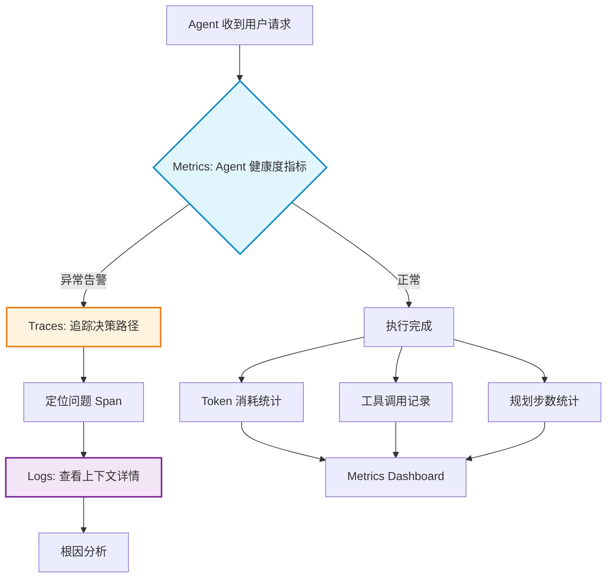
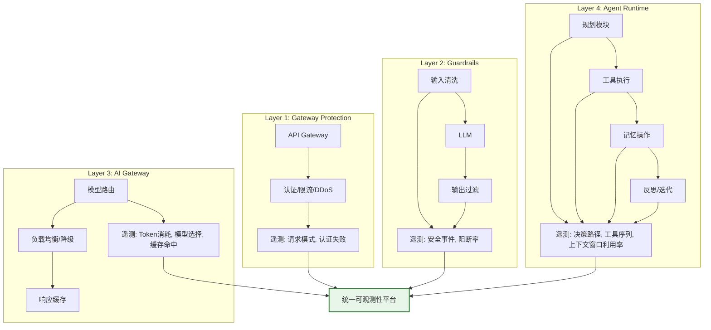
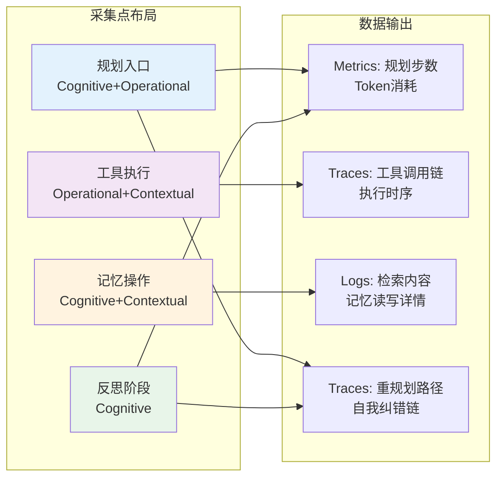
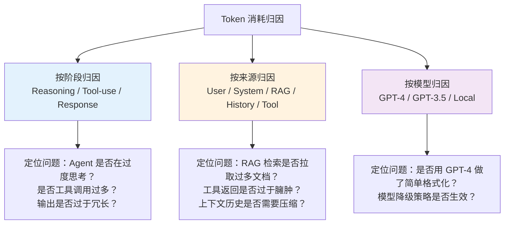

# Agent 可观测性设计：Trace/Metrics/日志的分层设计

## Executive Summary

Agent 系统的非确定性使得传统"监控已知路径"的方法失效——同一用户请求可能触发 3 步或 20 步不可预测的推理链路，Token 消耗可能因 LLM 决策不同而波动 10 倍以上[4]。本报告聚焦可观测性的**架构设计决策**（而非工具选型），系统回答三个核心问题：**采集什么数据**、**怎么组织**、**怎么关联**。

基于对 AgentTrace 三表面模型[1]、OpenTelemetry GenAI 语义约定[2][3]、四层遥测架构[4]等前沿研究的分析，本报告提出 Agent 可观测性的分层设计框架：

- **Metrics 层**：量化 Agent 健康度的仪表盘，回答"有没有问题"——包含 Agent 特有指标（Token 消耗归因、规划步数、工具成功率）
- **Traces 层**：还原决策路径的定位器，回答"问题在哪一步"——捕获 Agent 特有的树状/图状执行路径
- **Logs 层**：保留上下文细节的取证器，回答"为什么会这样"——结构化记录 LLM 输入输出、工具参数结果、决策依据

核心设计决策：**可观测性应作为一等公民嵌入 Agent 架构**，而非事后补丁。设计时需要在 Agent 生命周期的四个关键嵌入点（规划入口、工具执行、记忆操作、反思阶段）植入采集钩子，并通过统一数据模型和 Trace ID 关联策略实现三层联动。

---

## 1. Agent 可观测性的本质差异：为什么传统方案不够

### 1.1 三大颠覆性特征

Agent 系统打破了传统可观测性的三个基本假设[4]：

| 传统假设 | Agent 现实 | 可观测性影响 |
|---------|-----------|-------------|
| **确定性执行路径** | 同一输入可能触发 3 步或 20 步推理 | Trace 需支持树状/图状结构，不能假设线性链路 |
| **可控资源消耗** | Token 消耗由 LLM 决策自主决定 | 需要按决策阶段归因，不能只看总量 |
| **可复现的错误** | LLM 幻觉、非确定性输出无法稳定复现 | Logs 需捕获完整上下文，支持事后因果分析 |

这意味着可观测性设计需要从"监控已知路径"转向"理解未知行为"[1]。Agent 的执行路径不是线性的函数调用链，而是 **ReAct 循环**（思考→行动→观察→再思考）构成的动态决策树。一次用户请求可能包含多轮 LLM 调用、工具执行、规划迭代，整个链路的决策路径难以预测[4]。

### 1.2 Metrics/Traces/Logs 的职责重新定义

三者的关系不是并列的三个工具，而是**分层递进**的分析链路[1][4]：



> **图 1: Metrics → Traces → Logs 三层递进分析模型**

| 层 | 核心问题 | 数据特征 | 保留策略 |
|---|---------|---------|---------|
| **Metrics** | 有没有问题？ | 聚合数值，低基数 | 长期存储（月/年） |
| **Traces** | 问题在哪一步？ | 结构化 Span 树 | 中期存储（周/月） |
| **Logs** | 为什么会这样？ | 详细事件流，高基数 | 短期存储（天/周），按需采样 |

---

## 2. 分层架构设计：四层遥测模型

### 2.1 四层遥测架构

Agent 系统的可观测性不能只在运行时层打补丁，而应在架构层面将遥测嵌入到请求处理的完整链路中[4]。有效的 Agent 遥测架构应分为四层，每层有不同的数据保留和分析需求：



> **图 2: 四层遥测架构——从网关到运行时的完整覆盖**

**设计决策要点**：每层遥测必须汇聚到**统一平台**，通过 Trace ID 实现跨层关联。一个 Layer 3 的 Token 消耗飙升如果没有 Layer 4 的 Trace 显示"Agent 为什么连续调用工具 40 次"，就是毫无意义的数据[4]。

### 2.2 采集点选择：Agent 生命周期嵌入

Agent 可观测性的关键设计决策是在**哪些位置植入采集钩子**。基于 AgentTrace 的三表面模型[1]和 OTel 的语义约定[2][3]，建议在以下四个关键嵌入点进行采集：

| 嵌入点 | 采集层 | 数据类型 | 设计决策 |
|-------|--------|---------|---------|
| **规划入口** | Cognitive + Operational | LLM 请求/响应、推理链 | 解析 CoT/Thinking 标记，提取决策依据 |
| **工具执行** | Operational + Contextual | 工具名/参数/结果/延迟 | 自动注入 Span，捕获输入输出 |
| **记忆操作** | Cognitive + Contextual | 读写操作、检索结果 | 区分短期/长期记忆，记录检索相关性 |
| **反思阶段** | Cognitive | 自评估、置信度、重规划 | 捕获 Agent 自我纠错的轨迹 |



> **图 3: Agent 生命周期采集点布局与数据映射**

---

## 3. 数据模型设计：统一信封与三表面模型

### 3.1 AgentTrace 的三表面分类法

AgentTrace 论文（2025）[1]提出了**认知（Cognitive）、操作（Operational）、上下文（Contextual）**三表面分类法，这是 Agent 可观测性数据模型最重要的架构创新：

**认知表面（Cognitive Surface）**：捕获 Agent 的"思考过程"——LLM 原始提示、补全结果、推理链（Chain-of-Thought）、置信度估计。当 API 支持时（如 OpenAI、Anthropic），还解析 `<thinking>` 标记和结构化 JSON 字段（如 `plan`、`reflection`）[1]。

**操作表面（Operational Surface）**：捕获 Agent 的"显式行为"——方法调用、参数结构、返回值、执行时序。通过 Python 内省和函数包装自动拦截 Agent 类的所有公共方法，每个方法调用产生 start/complete 事件对[1]。

**上下文表面（Contextual Surface）**：捕获 Agent 与"外部世界"的交互——HTTP API、数据库、缓存、向量存储、文件系统。利用 OTel 的自动注入（auto-instrumentation） monkey-patch 标准库，每个交互产生带资源元数据的 Span[1]。

### 3.2 统一信封数据模型

三表面的所有日志事件遵循统一信封格式：

```
Record = {
    id: UUID,                    // 全局唯一标识
    surface: "cognitive"|"operational"|"contextual",  // 表面类型
    event: { ... },              // 事件内容（按表面类型结构化）
    context: {                   // 元数据上下文
        trace_id: string,        // 关联 Trace ID
        span_id: string,         // Span 标识
        parent_span_id?: string, // 父级 Span（用于嵌套）
        timestamp: UTC,          // 精确时间戳
        user_id?: string,        // 用户标识（归因用）
        session_id?: string,     // 会话标识
        task_id?: string         // 任务标识
    },
    metadata: { ... }            // 框架/模型特定元数据
}
```

这个数据模型满足四个关键属性[1]：
- **一致性（Consistency）**：Schema 合规的表示
- **因果性（Causality）**：时间保真度
- **保真性（Fidelity）**：忠实于 Agent 内外部行为
- **互操作性（Interoperability）**：分析就绪、框架无关

### 3.3 双路径存储策略

设计决策：**JSONL 文件 + OpenTelemetry Span** 双路径存储[1]

| 路径 | 格式 | 用途 | 特点 |
|------|------|------|------|
| 本地 | JSONL（行分隔 JSON） | 离线检查、回放、流式处理 | Append-only，Schema 写入时验证 |
| 远端 | OTel Span | 实时分布式追踪 | 与 Jaeger/Tempo 集成，支持跨服务关联 |

这种设计确保**低延迟本地调试**和**可扩展远程可观测性**兼得。当远程导出失败时优雅降级为本地日志[1]。

---

## 4. Agent 特有可观测性需求的采集策略

### 4.1 决策路径追踪

Agent 执行路径是**树状甚至图状**的——ReAct 循环产生多层嵌套的 Span。Trace 需要捕获的不只是"调了哪个工具"，而是"为什么选择这个工具、基于什么信息、上一步的结果如何影响下一步"[1][7]。

**Span 嵌套结构示例**：

```
Trace: user_request_abc123
├── Span: agent_reasoning (cognitive)      ← 决策：选择工具
│   ├── Attribute: model=gpt-4o
│   ├── Attribute: strategy=react
│   └── Event: decided_to_use=web_search
├── Span: tool_call_web_search (operational) ← 执行：调用工具
│   ├── Attribute: tool_name=web_search
│   ├── Attribute: query="..."
│   └── Status: OK
├── Span: agent_reflection (cognitive)      ← 反思：评估结果
│   ├── Attribute: confidence=0.85
│   └── Event: decision=continue_with_result
└── Span: agent_response_generation (cognitive) ← 生成：输出结果
    ├── Attribute: output_tokens=256
    └── Status: OK
```

### 4.2 Token 消耗归因

Token 是 Agent 系统的核心成本单元，但简单的总量统计毫无意义。设计决策是**三维归因模型**——按阶段（Reasoning / Tool-use / Response）、按来源（User / System / RAG / History / Tool）、按模型层级（GPT-4 / GPT-3.5 / Local）分别追踪[4]：



> **图 4: Token 消耗三维归因模型**

**实现要点**：在每个 LLM 调用的 Span 上标注 `step_type`（reasoning / tool_call / response_gen）和 `context_sources`（user_input / rag_context / conversation_history / tool_output），使 Token 消耗可以按任意维度聚合分析[4]。

### 4.3 工具调用链

工具调用是 Agent 与外部世界的接口，也是最常见的失败点。设计要点：

**采集策略**：
- 每个工具调用生成独立 Span，作为 Agent Span 的子级
- Span 属性包含：`gen_ai.tool.name`、`gen_ai.tool.definitions`（OTel 语义约定）[2]
- 记录工具输入参数（脱敏后）和完整输出
- 捕获工具调用延迟和错误信息

**关联设计**：
- 工具 Span 通过 `parent_span_id` 链接到触发它的认知 Span
- 同一 Trace 内的工具 Span 按时间顺序排列，支持时序分析
- 工具调用失败时，触发"反思 Span"记录 Agent 的重试决策

### 4.4 OTel GenAI 语义约定对齐

设计决策时必须考虑与 OpenTelemetry GenAI 语义约定[2][3]的对齐。关键属性包括：

| 属性 | 用途 | 必要性 |
|------|------|--------|
| `gen_ai.agent.name` | Agent 标识 | 条件必填 |
| `gen_ai.agent.id` | Agent 唯一标识 | 推荐 |
| `gen_ai.operation.name` | 操作类型 | 必填 |
| `gen_ai.request.model` | 模型名称 | 必填 |
| `gen_ai.usage.input_tokens` | 输入 Token | 推荐 |
| `gen_ai.usage.output_tokens` | 输出 Token | 推荐 |
| `gen_ai.tool.definitions` | 工具定义 | 选择加入 |

遵循语义约定的核心价值：**任何下游工具或自定义 Dashboard 都能立即识别数据含义**，实现跨框架互操作性[3]。

---

## 5. Metrics/Traces/Logs 的协作模式

### 5.1 Metrics 层：Agent 健康度量化

Agent 的 Metrics 设计需要覆盖四个维度，但与传统服务不同，需要**额外关注决策质量指标**：

**效率指标**：
- `agent_planning_steps`：单次请求的规划迭代次数（Histogram）
- `agent_loop_iterations`：ReAct 循环次数（Histogram）
- `agent_time_to_first_token`：首 Token 延迟（Gauge）

**成本指标**：
- `agent_token_input` / `agent_token_output`：输入/输出 Token（Counter）
- `agent_cost_by_phase`：按阶段（reasoning/tool/response）的美元成本（Counter）

**质量指标**：
- `agent_tool_call_success_rate`：工具调用成功率（Gauge，按工具分组）
- `agent_hallucination_score`：幻觉检测得分（Gauge，0-1）
- `agent_answer_relevance`：回答相关性评分（Gauge，0-1）

**可靠性指标**：
- `agent_error_rate`：错误率（Gauge）
- `agent_stuck_loops`：死循环检测计数（Counter）
- `agent_max_iterations_reached`：达到最大迭代次数计数（Counter）

这些指标构成了 Agent 健康度的完整视图，覆盖了 IBM 研究者总结的 MELT（Metrics、Events、Logs、Traces）框架在 Agent 场景下的扩展应用[11]。

### 5.2 Traces 层：决策路径还原

OTel 的 GenAI Agent Span 语义约定定义了四种核心 Span 类型[2][6]：

| Span 类型 | 语义 | 关键属性 |
|----------|------|---------|
| **LLM Span** | 模型推理调用 | model, input_tokens, output_tokens, temperature |
| **Tool Span** | 工具执行 | tool_name, input, output, duration |
| **Memory Span** | 记忆读写 | operation, storage_type, key |
| **Orchestration Span** | Agent 编排 | agent_name, task_description, subtasks |

OTel 的 GenAI 语义约定[5]为这些 Span 类型定义了标准化的属性集。**每种 Span 类型都是必需的**——缺失任何一种都会导致盲区，最终以客户投诉的形式暴露[8]。

**Trace 查询模式**：
- "按质量评分 < 0.7 筛选最近 24h 的 Trace，按失败模式分组"
- "按用户/任务维度聚合 Token 消耗，识别异常值"
- "对比同一任务不同模型的执行路径差异"

### 5.3 Logs 层：结构化事件取证

Logs 层的核心设计决策是**结构化优先**——不是自由文本日志，而是 Schema 约束的事件记录。每个日志事件必须包含：

- 表面类型标识（cognitive/operational/contextual）
- Trace ID 和 Span ID（用于向上关联）
- 结构化事件体（按表面类型有不同的 Schema）
- 时间戳（UTC，微秒精度）

**日志采样策略**：
- 成功请求：采样 10%，保留完整 Metrics 和精简 Trace
- 错误请求：100% 保留，完整 Trace + 完整 Logs
- 高 Token 消耗请求（>P99）：100% 保留，用于成本优化分析

---

## 6. 多 Agent 系统的可观测性扩展

### 6.1 跨 Agent 关联

多 Agent 系统的可观测性在单 Agent 基础上增加了**跨 Agent 关联**的挑战。OTel 正在定义的 Agent Framework 语义约定[3]提出了 Task-Action-Agent-Artifact-Memory 模型：

- **Task**：任务定义，包含 `gen_ai.task.id`、`gen_ai.task.description`
- **Action**：执行单元，由 Agent 完成，产生/消费 Artifact
- **Agent**：执行主体，可以是单个 Agent 或 Team
- **Artifact**：产出物（文件、数据、API 响应）
- **Memory**：跨会话/跨任务的状态保持

### 6.2 遥测数据治理

在生产级 Agent 系统中，可观测性不仅是"采集数据"，更是**治理机制**[9][10]：

- **数据脱敏**：用户输入、工具参数中的 PII 必须在采集时脱敏
- **成本控制**：遥测数据本身的存储成本需要预算，采用分级保留策略
- **隐私合规**：认知表面（LLM 输入输出）可能包含敏感信息，需要特别处理
- **Schema 版本管理**：数据模型会演进，需要向后兼容策略

---

## 7. 结论

Agent 可观测性的架构设计需要三个核心设计决策：

**决策一：嵌入时点** — 可观测性应作为一等公民嵌入 Agent 架构，在规划入口、工具执行、记忆操作、反思阶段四个关键点植入采集钩子，而非事后补丁。

**决策二：数据模型** — 采用三表面分类法（认知/操作/上下文）+ 统一信封格式 + 双路径存储（JSONL + OTel Span），满足一致性、因果性、保真性、互操作性四个关键属性。

**决策三：关联策略** — 通过 Trace ID 实现 Metrics → Traces → Logs 三层联动，通过三维 Token 归因（阶段/来源/模型）实现成本精细化管理，通过与 OTel GenAI 语义约定对齐实现跨框架互操作。

这些设计决策不是工具选型问题，而是架构能力问题。在设计 Agent 系统时就将可观测性嵌入架构，比事后添加监控工具的成本低一个数量级，效果好一个数量级。

<!-- REFERENCE START -->
## 参考文献

1. AlSayyad, A., Huang, K.Y., Pal, R. AgentTrace: A Structured Logging Framework for Agent System Observability (2025). https://arxiv.org/abs/2602.10133
2. OpenTelemetry. Semantic Conventions for GenAI Agent and Framework Spans (2025). https://opentelemetry.io/docs/specs/semconv/gen-ai/gen-ai-agent-spans/
3. OpenTelemetry. AI Agent Observability - Evolving Standards and Best Practices (2025). https://opentelemetry.io/blog/2025/ai-agent-observability/
4. N-IX. AI Agent Observability: The New Standard for Enterprise AI in 2026 (2026). https://www.n-ix.com/ai-agent-observability/
5. OpenTelemetry. Semantic Conventions for Generative AI Systems (2025). https://opentelemetry.io/docs/specs/semconv/gen-ai/
6. OpenTelemetry. Semantic Conventions for Generative AI Agentic Systems - Issue #2664 (2025). https://github.com/open-telemetry/semantic-conventions/issues/2664
7. Salesforce. Agent Observability: Building Transparency into AI Systems (2025). https://www.salesforce.com/agentforce/observability/agent-observability/
8. Chanl. What to Trace When Your AI Agent Hits Production (2025). https://www.chanl.ai/blog/ai-agent-observability-opentelemetry-production
9. NexAI Tech. AI Agent Architecture Patterns in 2025 (2025). https://nexaitech.com/multi-ai-agent-architecutre-patterns-for-scale/
10. GreenNode. Designing Production-Ready Architecture for AI Agents (2025). https://greennode.ai/blog/designing-production-ready-architecture-for-ai-agents
11. Paul, K. A Comprehensive Guide to Observability in AI Agents: Best Practices (2025). https://dev.to/kuldeep_paul/a-comprehensive-guide-to-observability-in-ai-agents-best-practices-4bd4
