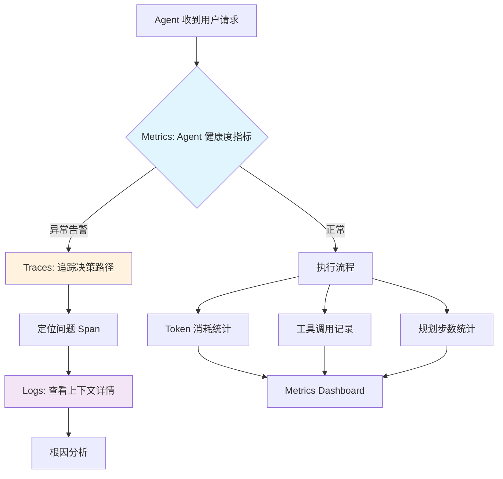
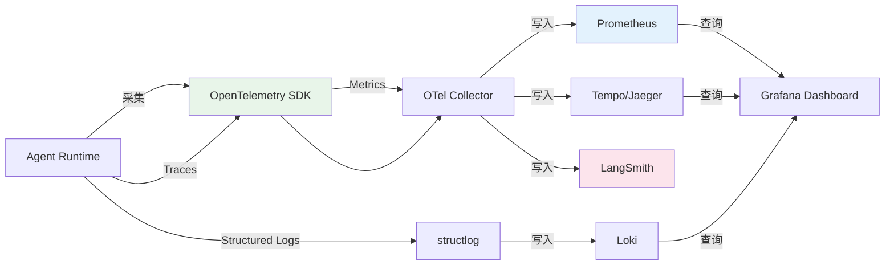
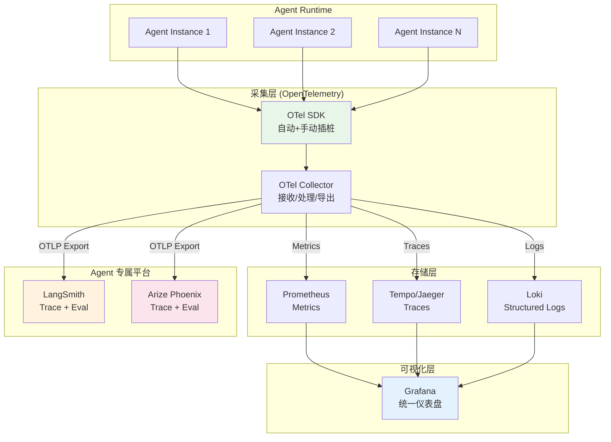

# Agent 日志与可观测性：构建 Metrics/Traces/Logs 三支柱

## Executive Summary

AI Agent 系统的不可确定性远高于传统微服务——一次用户请求可能触发多轮 LLM 调用、工具执行、规划迭代，整个链路的决策路径难以预测。传统的"打日志+看报错"模式在这种场景下失效：你无法提前知道 Agent 会在哪一步卡住、Token 消耗为何飙升、工具调用为什么失败。

本报告提出 Agent 可观测性的完整三支柱设计框架：**Metrics**（量化 Agent 健康度）、**Traces**（还原决策路径）、**Logs**（保留上下文细节）。核心观点是：Agent 可观测性不是把传统可观测性"搬过来"，而是需要针对 Agent 特有的行为模式（Token 消耗、规划步数、工具调用成功率、幻觉检测）设计专属指标和采集策略。

工具选型推荐：OpenTelemetry (v1.28+) 作为统一采集层，Prometheus (v2.53+) / Grafana (v11+) 负责 Metrics 存储和可视化，LangSmith / Arize Phoenix (v5.1+) 负责 Agent 专属 Trace 分析，结构化日志库（structlog v24.4+ / Logfire v0.41+）负责 Logs。这套组合既兼容现有运维体系，又能覆盖 Agent 特有需求。

---

## 1. 可观测性三支柱在 Agent 场景的适配

### 1.1 从传统可观测性到 Agent 可观测性

传统可观测性针对的是确定性系统：请求进来、处理、返回，路径可预测。Agent 系统打破了这个假设——同一个用户请求，Agent 可能走 3 步完成，也可能绕 20 步还没收敛。这意味着可观测性设计需要从"监控已知路径"转向"理解未知行为"[1]。

**三大支柱的角色重新定义：**

| 支柱 | 传统系统 | Agent 系统 |
|------|---------|-----------|
| **Metrics** | QPS、错误率、延迟 | Token 消耗、规划步数、工具成功率、幻觉率 |
| **Traces** | 请求经过的服务链 | Agent 决策树（规划→执行→反思→再规划） |
| **Logs** | 错误日志、访问日志 | 结构化事件日志（LLM 输入/输出、工具参数/结果、决策依据）|

三者的关系不是并列，而是分层：**Metrics 是仪表盘**（告诉你"有没有问题"），**Traces 是定位器**（告诉你"问题在哪一步"），**Logs 是取证器**（告诉你"为什么会这样"）[2]。



### 1.2 Metrics：Agent 健康度的量化指标

Agent 的 Metrics 设计需要覆盖四个维度：**效率**、**质量**、**成本**、**可靠性**。与传统服务不同，Agent 的核心价值在于"智能决策"，因此需要额外关注决策质量指标[3]。

**核心指标体系：**

**效率指标：**
- `agent_planning_steps`：单次请求的规划迭代次数（Histogram）
- `agent_loop_iterations`：ReAct 循环次数（Histogram）
- `agent_time_to_first_token`：首 Token 延迟（Gauge）
- `agent_total_duration`：端到端处理时长（Histogram）

**成本指标：**
- `agent_token_input`：输入 Token 消耗（Counter）
- `agent_token_output`：输出 Token 消耗（Counter）
- `agent_token_total`：总 Token 消耗（Counter）
- `agent_cost_usd`：按模型定价折算的美元成本（Counter）

**质量指标：**
- `agent_tool_call_success_rate`：工具调用成功率（Gauge，按工具分组）
- `agent_hallucination_score`：幻觉检测得分（Gauge，0-1）
- `agent_answer_relevance`：回答相关性评分（Gauge，0-1）
- `agent_user_feedback_positive`：用户正向反馈计数（Counter）

**可靠性指标：**
- `agent_error_rate`：错误率（Gauge）
- `agent_timeout_rate`：超时率（Gauge）
- `agent_max_iterations_reached`：达到最大迭代次数次数（Counter）
- `agent_stuck_loops`：死循环检测计数（Counter）

这些指标需要通过 OpenTelemetry SDK (v1.28+) 采集，推送到 Prometheus (v2.53+)，再由 Grafana (v11+) 展示[4]。



### 1.3 Traces：还原 Agent 的决策路径

Agent 的执行路径不是线性的，而是树状甚至图状的。一个规划型 Agent（ReAct、Plan-and-Execute）可能在一次请求中经历多次"思考→行动→观察"的循环。Trace 需要捕获的不只是"调了哪个工具"，而是"为什么选择这个工具、基于什么信息、上一步的结果如何影响下一步"。

**Agent Trace 的核心 Span 结构：**

```
Trace: user_request_abc123
├── Span: agent_thinking (reasoning)
│   ├── Attribute: model=gpt-4o
│   ├── Attribute: planning_strategy=react
│   └── Event: decided_to_use_tool=web_search
├── Span: tool_call_web_search
│   ├── Attribute: tool_name=web_search
│   ├── Attribute: query="..."
│   └── Status: OK
├── Span: agent_thinking (reasoning)
│   └── Event: decided_to_use_tool=code_execution
├── Span: tool_call_code_execution
│   ├── Attribute: tool_name=python_repl
│   └── Status: ERROR (timeout)
├── Span: agent_reflection
│   └── Event: tool_failed, retry_with_different_approach
└── Span: agent_final_response
    └── Attribute: total_tokens=4500
```

每个 Span 需要包含 Agent 特有的属性：
- `agent.thinking_duration`：推理耗时
- `agent.planning_step`：当前规划步数
- `agent.tool抉择理由`：工具选择的推理依据
- `agent.context_tokens`：上下文窗口占用

OpenTelemetry 提供了标准化的 Span 模型，但 Agent 场景需要扩展定义语义约定（Semantic Conventions）。目前 LangSmith 和 Arize Phoenix 已经定义了各自的扩展规范[5]。

### 1.4 Logs：结构化的事件取证

Agent 的日志不是传统的"ERROR: something went wrong"，而是一系列结构化事件的记录。每条日志需要包含完整的上下文：当时的 prompt、模型响应、工具输入输出、决策依据。

**结构化日志格式（JSON Lines）：**

```json
{
  "timestamp": "2026-03-25T10:30:00Z",
  "level": "INFO",
  "event_type": "agent_reasoning",
  "trace_id": "abc123",
  "span_id": "def456",
  "agent_id": "research-assistant-v2",
  "data": {
    "model": "gpt-4o",
    "input_tokens": 2400,
    "output_tokens": 150,
    "reasoning": "User asked about X, need to search for latest info",
    "tool_selected": "web_search",
    "confidence": 0.85
  }
}
```

**日志级别定义：**
- **DEBUG**：完整的 prompt/response 内容（用于调试）
- **INFO**：关键事件（工具调用、规划变更、完成）
- **WARN**：降级行为（工具超时使用默认值、Token 接近限制）
- **ERROR**：失败事件（工具调用失败、模型返回格式错误）

推荐使用 Python 的 structlog (v24.4+) 库或 Pydantic Logfire (v0.41+) 来实现结构化日志。structlog 支持链式绑定（chaining），可以在 Agent 生命周期的不同阶段附加上下文信息，而不需要手动拼接字符串[6]。

---

## 2. 工具选型与架构设计

### 2.1 可观测性架构总览

Agent 可观测性架构需要统一采集层（OpenTelemetry）、存储层（Prometheus + Tempo + Loki）和可视化层（Grafana），再叠加 Agent 专属分析平台（LangSmith 或 Arize Phoenix）[7]。



### 2.2 OpenTelemetry：统一采集标准

OpenTelemetry（OTel v1.28+）是 CNCF 的可观测性标准项目，提供了统一的 API 和 SDK 来采集 Traces、Metrics 和 Logs[8]。对于 Agent 系统，OTel 的价值在于：

1. **一次埋点，多处消费**：通过 OTLP 协议将数据发送到任意后端（LangSmith、Jaeger、Prometheus 等）
2. **自动插桩支持**：主流 LLM 框架（LangChain、LlamaIndex）已内置 OTel 集成
3. **语义约定扩展**：可以定义 Agent 专属的 Span Attributes 和 Metric Labels

**Python 示例——为 Agent 添加 OTel 手动插桩：**

```python
from opentelemetry import trace
from opentelemetry.sdk.trace import TracerProvider
from opentelemetry.sdk.trace.export import BatchSpanProcessor
from opentelemetry.exporter.otlp.proto.http.trace_exporter import OTLPSpanExporter

# 初始化 Tracer
tracer_provider = TracerProvider()
otlp_exporter = OTLPSpanExporter(endpoint=os.environ.get("OTEL_EXPORTER_OTLP_ENDPOINT"))
tracer_provider.add_span_processor(BatchSpanProcessor(otlp_exporter))
trace.set_tracer_provider(tracer_provider)

tracer = trace.get_tracer("agent-service")

# 在 Agent 执行流程中使用
def agent_step(user_input, context):
    with tracer.start_as_current_span("agent_reasoning") as span:
        span.set_attribute("agent.model", "gpt-4o")
        span.set_attribute("agent.context_tokens", len(context))
        
        # 模型调用
        response = llm.invoke(build_prompt(user_input, context))
        span.set_attribute("agent.output_tokens", response.usage.completion_tokens)
        
        # 工具选择
        tool = select_tool(response)
        span.add_event("tool_selected", {"tool_name": tool.name})
        
        return execute_tool(tool, response.tool_input)
```

LangSmith 支持通过环境变量 `LANGSMITH_OTEL_ENABLED=true` 直接接收 OTel 格式的 Trace 数据，无需修改应用代码[9]。

### 2.3 Prometheus + Grafana：Metrics 存储与可视化

Prometheus (v2.53+) 是 CNCF 毕业项目，采用拉模式（pull-based）采集时序数据，支持强大的 PromQL 查询语言[4]。Grafana (v11+) 则是事实上的开源可视化标准，支持 Prometheus、Loki、Tempo 等多种数据源的统一仪表盘[10]。

**Agent 专属 Metrics 示例：**

```yaml
# prometheus.yml 抓取配置
scrape_configs:
  - job_name: 'agent-service'
    static_configs:
      - targets: ['agent:8080']
    metrics_path: '/metrics'

# Grafana Dashboard 核心面板
# 1. Token 消耗趋势（按模型分组）
# 2. 工具调用成功率 Top/Bottom 10
# 3. 规划步数分布（Histogram）
# 4. 端到端延迟 P50/P95/P99
# 5. 幻觉率趋势
# 6. 用户反馈评分趋势
```

**关键 PromQL 查询示例：**

```promql
# Agent 每分钟平均 Token 消耗
rate(agent_token_total_sum[1m]) / rate(agent_token_total_count[1m])

# 工具调用成功率（按工具分组）
sum(rate(agent_tool_calls_total{status="success"}[5m])) by (tool_name)
/
sum(rate(agent_tool_calls_total[5m])) by (tool_name)

# 规划步数 P95
histogram_quantile(0.95, sum(rate(agent_planning_steps_bucket[5m])) by (le))
```

### 2.4 Agent 专属分析平台

传统 APM 工具无法理解 Agent 的执行语义——它们看到的是"一串 HTTP 请求"，而不是"一个规划-执行-反思的循环"。Agent 专属分析平台（LangSmith、Arize Phoenix、Datadog LLM Observability）提供了面向 LLM/Agent 的原生支持[5][11]：

| 平台 | 核心能力 | 适用场景 | 开源 |
|------|---------|---------|------|
| **LangSmith** | Trace 可视化、在线 Eval、Topic 聚类 | LangChain 生态 | 部分 |
| **Arize Phoenix** | Trace 分析、RAG 评估、Embedding 可视化 | 框架无关 | ✅ |
| **Datadog LLM Obs** | 与现有 Datadog 集成、成本追踪 | 已有 Datadog 基础设施 | ❌ |
| **Langfuse** | 开源自托管、Trace、Eval、成本分析 | 数据敏感场景 | ✅ |
| **Pydantic Logfire** | 结构化日志 + Trace，与 Pydantic 深度集成 | Pydantic 生态 | 部分 |

**选型建议：**
- 如果已使用 LangChain/LangGraph → **LangSmith**（原生集成最深）
- 如果需要框架无关 + 开源自托管 → **Arize Phoenix** 或 **Langfuse**
- 如果已有 Datadog 基础设施 → **Datadog LLM Observability**（统一平台）
- 如果重度使用 Pydantic → **Pydantic Logfire**（结构化日志最佳实践）

---

## 3. Agent 特有指标的采集策略

### 3.1 Token 消耗追踪

Token 消耗是 Agent 的"燃料消耗"，直接影响成本。但简单的计数不够——需要区分：哪个 Agent 用了多少 Token？哪类任务消耗最多？是否存在 Token 泄漏（上下文过长导致的无效消耗）？

**分层采集策略：**
1. **应用层**：在 LLM 调用回调中直接获取 `usage` 对象（OpenAI/Anthropic SDK 均返回）
2. **Agent 层**：累加单次 Agent 执行的所有 LLM 调用 Token
3. **用户层**：按 session/user 累计，用于计费和预算控制

```python
from opentelemetry import metrics

meter = metrics.get_meter("agent-service")
token_counter = meter.create_counter(
    name="agent.token.usage",
    description="Token usage by agent and model",
    unit="tokens"
)

def track_llm_call(agent_id: str, model: str, usage):
    token_counter.add(usage.prompt_tokens, {
        "agent_id": agent_id,
        "model": model,
        "type": "input"
    })
    token_counter.add(usage.completion_tokens, {
        "agent_id": agent_id,
        "model": model,
        "type": "output"
    })
```

### 3.2 工具调用可观测性

工具调用是 Agent 与外部世界的接口，也是最容易出错的环节。需要追踪：调用了什么工具、参数是什么、返回了什么、耗时多久、是否成功[3]。

**工具调用的完整可观测性覆盖：**

```python
def instrumented_tool_call(tool_name: str, params: dict, tracer, meter):
    with tracer.start_as_current_span(f"tool_call_{tool_name}") as span:
        span.set_attribute("tool.name", tool_name)
        span.set_attribute("tool.params", json.dumps(params))
        span.set_attribute("tool.timestamp", datetime.now().isoformat())
        
        start_time = time.time()
        try:
            result = execute_tool(tool_name, params)
            duration = time.time() - start_time
            
            span.set_status(StatusCode.OK)
            span.set_attribute("tool.duration_ms", duration * 1000)
            span.set_attribute("tool.result_size", len(str(result)))
            
            # 记录 Metrics
            meter.create_counter("tool_calls_total").add(1, {
                "tool": tool_name, "status": "success"
            })
            
            return result
        except Exception as e:
            duration = time.time() - start_time
            
            span.set_status(StatusCode.ERROR, str(e))
            span.record_exception(e)
            
            meter.create_counter("tool_calls_total").add(1, {
                "tool": tool_name, "status": "error"
            })
            
            raise
```

### 3.3 规划质量指标

规划（Planning）是 Agent 区别于简单 LLM 调用的核心能力。规划质量的度量包括：步数是否合理、是否走了弯路、是否成功收敛[12]。

**关键规划指标：**
- **规划步数分布**：大多数任务应在 3-7 步完成，过长可能意味着规划失败
- **工具选择准确率**：Agent 选择的工具是否是完成任务的最优工具
- **回退次数**：Agent 因工具失败而重新规划的次数
- **收敛速度**：从开始到首次得到有意义结果的步数

```python
planning_histogram = meter.create_histogram(
    name="agent.planning.steps",
    description="Number of planning steps per request",
    unit="steps"
)

# 在 Agent 完成后记录
planning_histogram.record(total_steps, {
    "agent_id": agent_id,
    "task_type": classify_task(user_input),
    "outcome": "success" if success else "failed"
})
```

---

## 4. 结构化日志实践

### 4.1 日志设计原则

Agent 日志的核心原则是**事件驱动**——每条日志记录的是一个"事件"，而非简单的消息字符串。事件需要包含：触发条件、当前状态、影响范围、关联标识（Trace ID）[6]。

**结构化日志 vs 传统日志：**

```
# 传统日志（难以查询和分析）
[2026-03-25 10:30:00] INFO: Calling tool web_search with query "AI agents"
[2026-03-25 10:30:01] INFO: Tool returned 5 results
[2026-03-25 10:30:02] ERROR: Tool code_execution failed

# 结构化日志（可查询、可聚合、可追踪）
{"ts": "2026-03-25T10:30:00Z", "lvl": "INFO", "evt": "tool_call", "tool": "web_search", "params": {"query": "AI agents"}, "trace_id": "abc123"}
{"ts": "2026-03-25T10:30:01Z", "lvl": "INFO", "evt": "tool_result", "tool": "web_search", "result_count": 5, "duration_ms": 1200, "trace_id": "abc123"}
{"ts": "2026-03-25T10:30:02Z", "lvl": "ERROR", "evt": "tool_error", "tool": "code_execution", "error": "TimeoutError", "trace_id": "abc123"}
```

### 4.2 structlog 实战

Python structlog 库支持链式绑定（bind）、线程本地上下文（threadlocal）、以及多种输出格式（JSON、Console）[6]。

```python
import structlog

structlog.configure(
    processors=[
        structlog.contextvars.merge_contextvars,
        structlog.processors.add_log_level,
        structlog.processors.TimeStamper(fmt="iso"),
        structlog.processors.JSONRenderer()
    ]
)

logger = structlog.get_logger()

# Agent 执行日志
logger.info(
    "agent_reasoning",
    agent_id="research-v2",
    model="gpt-4o",
    input_tokens=2400,
    output_tokens=150,
    decision="use_tool",
    tool="web_search",
    trace_id=span.get_span_context().trace_id
)

logger.info(
    "tool_completed",
    tool="web_search",
    query="latest AI agent papers",
    results_count=5,
    duration_ms=1200,
    trace_id=span.get_span_context().trace_id
)
```

---

## 5. 落地建议与最佳实践

### 5.1 渐进式接入策略

可观测性不是一次性工程，建议分三阶段推进[7]：

| 阶段 | 目标 | 时间 | 产出 |
|------|------|------|------|
| **Phase 1：基础可观测** | 能看到 Agent 在干什么 | 1-2 周 | 结构化日志 + 基础 Trace |
| **Phase 2：量化监控** | 能度量 Agent 的表现 | 2-4 周 | Metrics 体系 + Grafana 仪表盘 |
| **Phase 3：质量闭环** | 能自动发现和改进问题 | 1-2 月 | Eval 系统 + 自动告警 + 质量趋势 |

### 5.2 常见陷阱

1. **过度日志**：DEBUG 级别的完整 prompt/response 日志会迅速膨胀存储，建议只在采样或调试时开启
2. **忽略 Trace 采样**：100% Trace 采集在高并发场景下成本巨大，建议 Head-based sampling（10% 采样率）+ 高优先级请求全采样
3. **只关注成功路径**：Agent 的失败模式（死循环、幻觉、工具不可用）才是最需要可观测的
4. **缺少成本分摊**：Token 消耗需要能追溯到具体的用户/任务/Agent，否则无法优化成本

---

## 6. 结论

Agent 可观测性设计的核心不是"记录更多数据"，而是"理解 Agent 的行为模式"。三大支柱各有分工：

- **Metrics** 回答"Agent 健不健康"——Token 消耗、工具成功率、规划步数是 Agent 特有的核心指标
- **Traces** 回答"Agent 是怎么想的"——规划→执行→反思的决策树比线性调用链更有价值
- **Logs** 回答"Agent 当时看到了什么"——结构化的事件日志是事后取证的关键

工具选型上，**OpenTelemetry + Prometheus + Grafana** 构成了可靠的基础设施层，**LangSmith / Arize Phoenix** 补充了 Agent 专属的分析能力。落地时建议渐进式推进：先基础可观测（日志+Trace），再量化监控（Metrics），最后质量闭环（Eval+告警）。

最终目标是让 Agent 系统从"黑盒"变成"白盒"——你不仅知道它在运行，还能理解它为什么这样做、做得好不好、怎样能做得更好。

<!-- REFERENCE START -->
## 参考文献

1. OpenTelemetry. "Observability Primer" (2025). https://opentelemetry.io/docs/concepts/observability-primer/ — accessed 2026-03-25
2. CNCF. "OpenTelemetry Architecture" (2025). https://opentelemetry.io/docs/specs/otel/overview/ — accessed 2026-03-25
3. LangChain. "LangSmith Observability Platform" (2025). https://www.langchain.com/langsmith/observability — accessed 2026-03-25
4. Prometheus. "Overview - Prometheus Documentation" (2025). https://prometheus.io/docs/introduction/overview/ — accessed 2026-03-25
5. LangChain. "Trace with OpenTelemetry in LangSmith" (2025). https://docs.langchain.com/langsmith/trace-with-opentelemetry — accessed 2026-03-25
6. Pydantic. "Logfire - Structured Observability" (2025). https://pydantic.dev/logfire/ — accessed 2026-03-25
7. Arize AI. "LLM Observability 101" (2025). https://arize.com/resource/llm-observability-101-ebook/ — accessed 2026-03-25
8. OpenTelemetry. "What is OpenTelemetry" (2025). https://opentelemetry.io/docs/what-is-opentelemetry/ — accessed 2026-03-25
9. LangChain. "LangSmith OpenTelemetry Integration" (2025). https://docs.langchain.com/langsmith/trace-with-opentelemetry — accessed 2026-03-25
10. Grafana. "Grafana OSS Documentation" (2025). https://grafana.com/docs/grafana/latest/ — accessed 2026-03-25
11. Langfuse. "Open-source LLM Observability Platform" (2025). https://langfuse.com/docs — accessed 2026-03-25
12. LangChain. "LangChain Agents Overview" (2025). https://docs.langchain.com/oss/python/langchain/overview — accessed 2026-03-25
