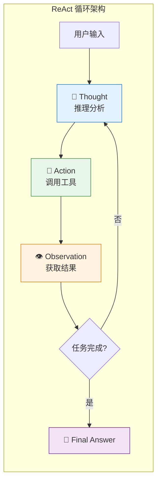
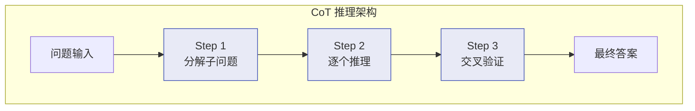
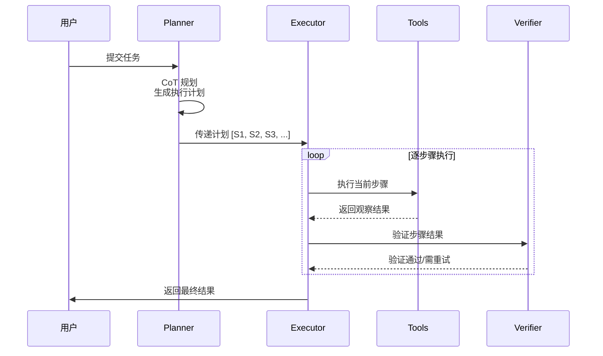
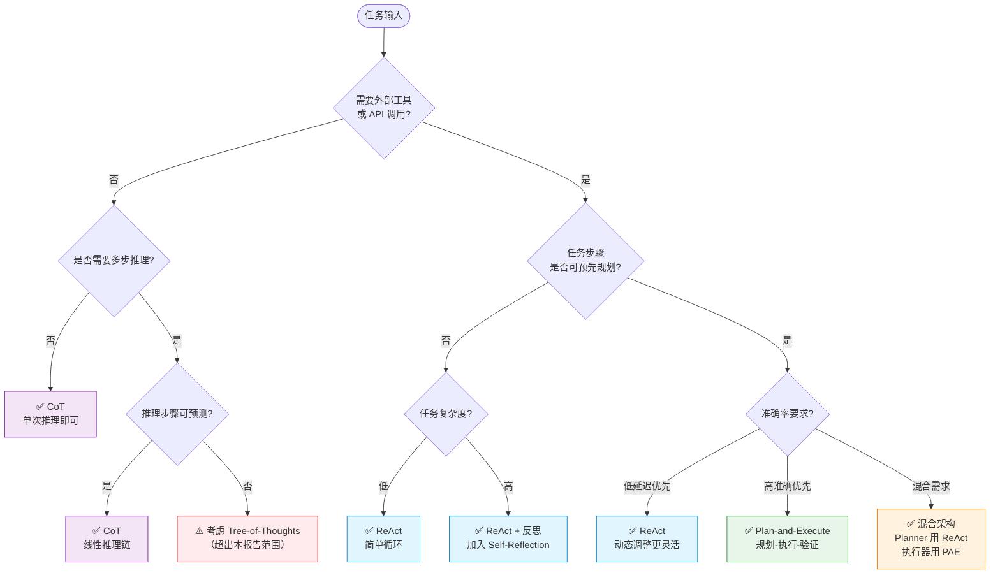
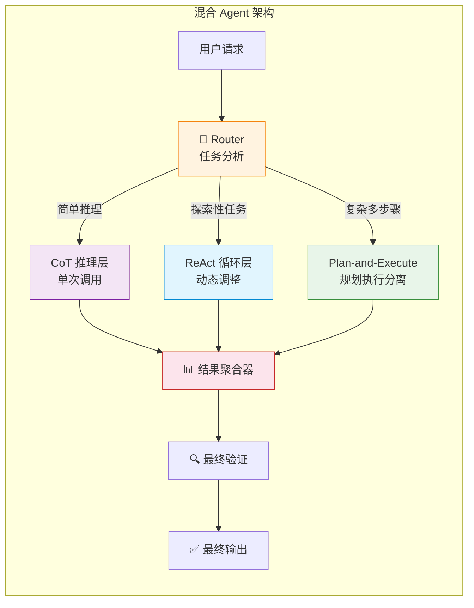

# Agent 规划与推理设计：ReAct/CoT/Plan-and-Execute 的架构决策

## Executive Summary

Agent 如何"思考"是架构设计的核心决策。不同的规划范式——ReAct（推理-行动循环）、Chain-of-Thought（思维链）、Plan-and-Execute（规划-执行分离）——直接决定了系统的延迟、成本、可靠性和开发复杂度。本报告从架构工程师视角出发，系统对比三种主流规划范式的架构特征、性能表现和适用场景，提供可落地的选型决策树。

**核心结论**：没有银弹。ReAct 适合探索性、工具密集型任务（延迟敏感但路径不确定）；CoT 适用于推理密集、无需外部交互的场景（如代码生成、数学推理）；Plan-and-Execute 在复杂多步骤任务中胜出（准确率提升 7-10%），但代价是更高的延迟和 token 消耗。2025 年的架构趋势是**混合范式**——在同一个 Agent 系统中按子任务特征动态选择规划模式，例如 LangGraph 的 Graph-based Agent 编排[1][7]。

---

## 1. 三种范式的架构解析

### 1.1 ReAct：推理-行动循环

ReAct（Reasoning and Acting）由 Yao 等人于 2022 年提出[2]，核心思想是在 LLM 推理中交替插入外部动作。其运行模式为 `Thought → Action → Observation → Thought → ...` 的无限循环，直到 Agent 判定任务完成。

**架构特征**：



> **图 1: ReAct 循环架构 — Thought/Action/Observation 三元循环**

ReAct 的关键设计参数：

| 参数 | 说明 | 典型值 |
|------|------|--------|
| max_iterations | 最大循环次数 | 10-15 次 |
| tool_selection | 工具选择策略 | LLM 自主选择 |
| context_window | 上下文管理 | 滑动窗口/截断 |
| early_stop | 提前终止条件 | 重复动作检测 |

**优势**：路径动态调整能力强，每一步可基于观察结果修正策略。适合工具密集型任务，如多源信息检索、API 调用链[2][5]。

**劣势**：无全局视野，可能陷入循环；每步都需要 LLM 推理，延迟线性增长；上下文累积导致后期推理质量下降[4]。

### 1.2 Chain-of-Thought：思维链推理

CoT（Chain-of-Thought）由 Wei 等人于 2022 年提出[8]，核心是通过 Prompt Engineering 引导 LLM 生成中间推理步骤。CoT 本身不是 Agent 架构，而是 LLM 推理增强技术，但在 Agent 系统中作为"纯推理层"广泛使用。

**架构特征**：



> **图 2: CoT 线性推理架构 — 无外部工具调用的内部思维链**

CoT 的变体及其架构含义：

| 变体 | 机制 | 适用场景 | Token 开销 |
|------|------|---------|-----------|
| **Few-Shot CoT** | 提供示例推理链 | 结构化任务 | 中（含示例） |
| **Zero-Shot CoT** | "Let's think step by step" | 通用推理 | 低 |
| **Self-Consistency** | 多次采样 + 投票 | 高可靠要求 | 高（N 倍） |
| **Auto-CoT** | 自动生成示例 | 批量任务 | 中 |

**在 Agent 系统中的角色**：CoT 通常不独立作为 Agent 架构，而是作为 ReAct 中的 `Thought` 步骤的推理增强，或 Plan-and-Execute 中 Planner 的规划能力增强[8][9]。

**优势**：无需外部工具即可提升推理准确率；在数学、代码生成等纯推理任务上效果显著；延迟可控（单次 LLM 调用）。

**劣势**：无法与外部环境交互；复杂任务中推理链可能断裂；缺乏纠错机制（一旦中间步骤出错，后续全部偏离）[8]。

### 1.3 Plan-and-Execute：规划-执行分离

Plan-and-Execute 将任务分解为两个独立阶段：先由 Planner 生成完整执行计划，再由 Executor 按步骤执行[7]。该范式的核心创新是**规划与执行的关注点分离**，允许在两个阶段使用不同策略甚至不同模型。

**架构特征**：



> **图 3: Plan-and-Execute 时序图 — Planner/Executor/Verifier 三角色协作**

**架构优势拆解**：

1. **异构模型调度**：Planner 可用强模型（GPT-4o）做精细规划，Executor 可用快模型（GPT-4o-mini）执行具体步骤，成本优化可达 40-60%[7][10]
2. **计划缓存（Plan Caching）**：相似任务可复用已有计划模板，NeurIPS 2025 的研究显示延迟可降低 30-50%[11]
3. **Re-planning 能力**：执行中发现偏差时触发局部重规划，而非全盘推翻[7]

---

## 2. 架构对比与选型决策树

### 2.1 三维对比矩阵

| 维度 | ReAct | CoT (作为 Agent 推理层) | Plan-and-Execute |
|------|-------|------------------------|------------------|
| **延迟** | 中（N 次 LLM 调用） | 低（1 次 LLM 调用） | 高（规划 + N 次执行） |
| **成本** | 中 | 低 | 中-高（取决于模型选择） |
| **准确率** | 85%（复杂任务） | 75-80%（纯推理） | 92%（复杂任务） |
| **可预测性** | 低（路径不确定） | 高（线性推理） | 中（计划可预览） |
| **工具集成** | 原生支持 | 不支持 | 原生支持 |
| **纠错能力** | 中（通过观察修正） | 低（无反馈回路） | 高（Re-planning） |
| **实现复杂度** | 低 | 低 | 中-高 |
| **适合任务** | 探索性、多工具 | 纯推理、生成 | 多步骤、高准确 |

> **表 1: 三种规划范式维度对比矩阵**（准确率数据综合自 LangChain 框架测试和 Wollen Labs 2025 年分析[1][7]）

### 2.2 场景决策树



> **图 4: 范式选型决策树 — 根据任务特征选择最优规划模式**

### 2.3 实际性能数据

基于 LangChain 框架和公开基准测试的对比数据（GPT-4 级模型）[1][7][10]：

| 指标 | ReAct | CoT-only | Plan-and-Execute |
|------|-------|----------|------------------|
| 平均 Token 消耗 | 2,000-3,000 | 800-1,500 | 3,000-4,500 |
| 平均 API 调用次数 | 3-5 | 1 | 5-8 |
| 单任务平均成本 (GPT-4) | $0.06-0.09 | $0.02-0.04 | $0.09-0.14 |
| 复杂任务完成率 | 85% | 60-70% | 92% |
| 首次响应延迟 | 2-8s | 1-3s | 5-15s |
| 适合的最大步骤数 | 10-15 | N/A | 20-30 |

> **表 2: 三种范式性能对比数据**（数据来源：LangChain 官方测试和 dev.to 实践对比[1][7]）

---

## 3. 落地架构与代码结构

### 3.1 ReAct 落地：LangGraph 实现

LangGraph 是 2025 年 ReAct Agent 的主流实现框架[1]，提供原生的循环控制和状态管理：

```python
# ReAct Agent 核心架构 (LangGraph)
from langgraph.prebuilt import create_react_agent
from langchain_core.tools import tool

@tool
def search(query: str) -> str:
    """搜索互联网获取信息"""
    return web_search(query)

@tool
def calculate(expression: str) -> str:
    """执行数学计算"""
    return str(eval(expression))

# 创建 ReAct Agent
agent = create_react_agent(
    model=ChatOpenAI(model="gpt-4o"),
    tools=[search, calculate],
    checkpointer=PostgresSaver(conn=pool),  # 状态持久化
)

# 执行
config = {"configurable": {"thread_id": "t001"}}
result = agent.invoke(
    {"messages": [HumanMessage("2024年诺贝尔物理学奖得主的国籍是什么?")]},
    config=config
)
```

**生产要点**：
- **max_iterations 限制**：防止无限循环，典型值 10-15
- **工具描述质量**：直接影响 LLM 工具选择准确率
- **Checkpointer**：支持断点恢复，避免长任务重头开始

### 3.2 CoT 落地：提示词工程

CoT 在 Agent 中通常作为 Prompt 模式嵌入：

```python
# CoT 增强的 Agent Prompt
COT_SYSTEM_PROMPT = """你是一个需要逐步推理的助手。

请严格按以下格式输出：
## 分析
[分析问题的关键要素]

## 步骤 1: [步骤名]
[推理过程]

## 步骤 2: [步骤名]
[推理过程]

## 验证
[检查是否有逻辑漏洞]

## 最终答案
[给出最终答案]
"""

# Self-Consistency: 多次采样取最优
def self_consistency_cot(query: str, n_samples: int = 5):
    results = []
    for _ in range(n_samples):
        result = llm.invoke(COT_SYSTEM_PROMPT + query)
        results.append(extract_answer(result))
    return majority_vote(results)  # 投票取最多数
```

**注意**：CoT 需要与 ReAct 区分。CoT 是纯内部推理（无外部工具），而 ReAct 的 Thought 步骤可以嵌入 CoT 推理[8][9]。

### 3.3 Plan-and-Execute 落地：三阶段架构

```python
# Plan-and-Execute 核心架构
from langchain_experimental.plan_and_execute import (
    PlanAndExecute, load_agent_executor, load_chat_planner
)

# 阶段 1: Planner（规划器）— 使用强模型
planner = load_chat_planner(
    ChatOpenAI(model="gpt-4o", temperature=0)
)

# 阶段 2: Executor（执行器）— 使用快模型
executor = load_agent_executor(
    ChatOpenAI(model="gpt-4o-mini", temperature=0),
    tools=[search_tool, calculator_tool, csv_tool],
    verbose=True
)

# 组合
agent = PlanAndExecute(
    planner=planner,
    executor=executor,
    verbose=True,
    max_iterations=20,       # 最大步骤数
    early_stopping="generate",  # 提前终止策略
)

# 执行
result = agent.run(
    "分析 sales_data.csv 中 Q4 销售趋势，"
    "计算同比增长率，并生成摘要报告"
)
```

**生产要点**：
- **Planner/Executor 模型分级**：Planner 用 GPT-4o（$0.01/1K input），Executor 用 GPT-4o-mini（$0.00015/1K input），成本降低 60 倍[10]
- **Re-planning 机制**：当某步骤失败或结果偏离预期时，触发 Planner 重新规划后续步骤
- **计划模板缓存**：对于重复性任务（如日报生成），缓存计划结构仅替换参数[11]

---

## 4. 混合架构：2025 年的最佳实践

### 4.1 分层混合策略

2025 年的主流趋势不是"选一个范式"，而是**按子任务特征动态选择**[1][7]：



> **图 5: 混合 Agent 架构 — Router 根据子任务特征动态选择规划范式**

### 4.2 范式演进路径

从简单到复杂的 Agent 架构演进路线图[4]：

| 阶段 | 架构 | 复杂度 | 适合场景 |
|------|------|--------|---------|
| **Phase 1** | 单次 CoT | ⭐ | 简单问答、分类 |
| **Phase 2** | ReAct 循环 | ⭐⭐ | 工具使用、信息检索 |
| **Phase 3** | Plan-and-Execute | ⭐⭐⭐ | 多步骤任务、报告生成 |
| **Phase 4** | 混合 + 多 Agent | ⭐⭐⭐⭐ | 企业级复杂工作流 |
| **Phase 5** | Reflexion / LATS | ⭐⭐⭐⭐⭐ | 需要自我改进的自主系统 |

### 4.3 框架选型建议

| 框架 | 原生支持范式 | 生产就绪度 | 适合场景 |
|------|------------|-----------|---------|
| **LangGraph** | ReAct, Plan-and-Execute, 自定义 | ⭐⭐⭐⭐⭐ | 企业级生产系统 |
| **CrewAI** | 多 Agent 协作 | ⭐⭐⭐⭐ | 团队协作型任务 |
| **AutoGen** | 多 Agent 对话 | ⭐⭐⭐⭐ | 研究导向型应用 |
| **Semantic Kernel** | ReAct, 自定义 | ⭐⭐⭐⭐ | 微软技术栈 |
| **LlamaIndex Agents** | ReAct, Plan-and-Execute | ⭐⭐⭐⭐ | RAG 增强型任务 |

> **表 3: 主流 Agent 框架的规划范式支持矩阵**（数据截至 2025 年底）

---

## 5. 常见陷阱与避坑指南

### 5.1 ReAct 常见陷阱

| 陷阱 | 现象 | 解决方案 |
|------|------|---------|
| **无限循环** | Agent 反复调用同一工具 | 设置 `max_iterations` + 重复动作检测 |
| **上下文污染** | 过多 Observation 导致后续推理质量下降 | 滑动窗口 + 关键信息摘要 |
| **工具幻觉** | 调用不存在的工具或参数错误 | Schema 验证 + 工具描述优化 |
| **路径发散** | Agent 偏离原始目标 | 在 Prompt 中持续注入原始问题 |

### 5.2 Plan-and-Execute 常见陷阱

| 陷阱 | 现象 | 解决方案 |
|------|------|---------|
| **规划过于细化** | 计划步骤太多（>20），执行效率低 | Planner Prompt 控制步骤粒度（5-10 步） |
| **僵化执行** | 即使发现错误也按原计划执行 | 每步结束后验证 + Re-planning 机制 |
| **规划成本高** | 强模型做 Planner 成本大 | Plan Caching 相似任务复用计划模板 |
| **步骤依赖丢失** | 后续步骤未正确使用前序结果 | 在 Executor Prompt 中注入前序结果摘要 |

### 5.3 通用避坑原则

1. **先 ReAct，后优化**：大多数项目从 ReAct 起步，只有在准确率或延迟不满足需求时才升级为 Plan-and-Execute 或混合架构
2. **监控 Token 消耗**：ReAct 循环可能导致 Token 消耗不可预测，设置硬性上限
3. **评估先于部署**：建立自动化评估管道，对比不同范式在实际任务上的表现
4. **考虑 Reasoning Model 的冲击**：2025-2026 年，o1/o3/DeepSeek-R1 等推理模型内置 CoT，可能替代显式 CoT prompt[10]

---

## 6. 架构选型 Checklist

在做架构决策时，按以下维度评估：

- [ ] **任务步骤是否可预测？** → 是：Plan-and-Execute；否：ReAct
- [ ] **是否需要外部工具？** → 否：CoT-only；是：ReAct 或 Plan-and-Execute
- [ ] **延迟预算是否紧张？** → 是：CoT 或轻量 ReAct；否：Plan-and-Execute
- [ ] **准确率要求是否高于 90%？** → 是：Plan-and-Execute + 验证层
- [ ] **任务是否重复性高？** → 是：Plan-and-Execute + 计划缓存
- [ ] **是否需要动态调整路径？** → 是：ReAct；否：Plan-and-Execute
- [ ] **预算是否有限？** → 是：混合架构（弱模型做 Executor）

---

## 7. 结论

Agent 规划范式的选型没有绝对最优解，但有清晰的决策框架：

1. **ReAct 是默认选择**：适合大多数工具使用场景，实现简单，路径灵活
2. **CoT 是推理增强器**：不是独立架构，而是 ReAct 的 Thought 步骤或 Plan-and-Execute 的 Planner 的能力增强
3. **Plan-and-Execute 是精度优先方案**：在复杂多步骤任务中准确率最高，但架构复杂度和延迟也最高
4. **混合架构是终局方向**：2025-2026 年的架构趋势是在同一系统中按子任务特征动态选择规划模式

核心建议：从 ReAct 起步，建立评估基准，根据实际性能数据决定是否需要升级为 Plan-and-Execute 或混合架构。不要过早优化——大多数 Agent 的瓶颈不在规划范式，而在工具质量、Prompt 设计和错误处理[1][2][7]。

<!-- REFERENCE START -->
## 参考文献

1. Wollen Labs. "Navigating Modern LLM Agent Architectures" (2025). https://www.wollenlabs.com/blog-posts/navigating-modern-llm-agent-architectures-multi-agents-plan-and-execute-rewoo-tree-of-thoughts-and-react — accessed 2026-03-25
2. Yao, S. et al. "ReAct: Synergizing Reasoning and Acting in Language Models" (ICLR 2023). https://arxiv.org/abs/2210.03629 — accessed 2026-03-25
3. Emergent Mind. "ReAct Architecture: Reason, Act, Reflect" (2026). https://www.emergentmind.com/topics/reason-act-reflect-react-architecture — accessed 2026-03-25
4. Coforge. "ReAct, Tree-of-Thought, and Beyond: The Reasoning Frameworks Behind Autonomous AI Agents" (2025). https://www.coforge.com/what-we-know/blog/react-tree-of-thought-and-beyond-the-reasoning-frameworks-behind-autonomous-ai-agents — accessed 2026-03-25
5. Li, H. et al. "Focused ReAct: Reiteration and Early Stop for Agentic Reasoning" (2024). https://arxiv.org/abs/2410.10779 — accessed 2026-03-25
6. LangChain Documentation. "LangGraph Prebuilt Agents" (2025). https://langchain-ai.github.io/langgraph/how-tos/create-react-agent/ — accessed 2026-03-25
7. James Li. "ReAct vs Plan-and-Execute: A Practical Comparison of LLM Agent Patterns" (2025). https://dev.to/jamesli/react-vs-plan-and-execute-a-practical-comparison-of-llm-agent-patterns-4gh9 — accessed 2026-03-25
8. Wei, J. et al. "Chain-of-Thought Prompting Elicits Reasoning in Large Language Models" (NeurIPS 2022). https://arxiv.org/abs/2201.11903 — accessed 2026-03-25
9. Prompt Engineering Guide. "Chain-of-Thought (CoT) Prompting" (2025). https://www.promptingguide.ai/techniques/cot — accessed 2026-03-25
10. DigitalApplied. "LangChain AI Agents: Complete Implementation Guide 2025" (2025). https://www.digitalapplied.com/blog/langchain-ai-agents-guide-2025 — accessed 2026-03-25
11. Zhang, Z. et al. "Cost-Efficient Serving of LLM Agents via Test-Time Plan Caching" (arXiv 2025). https://arxiv.org/abs/2506.14852 — accessed 2026-03-25
12. Yao, S. et al. ReAct GitHub Repository (2023). https://github.com/ysymyth/ReAct — accessed 2026-03-25
13. Louis Bouchard. "ReAct vs Plan-and-Execute: The Architecture Behind Modern AI Agents" (2025). https://louisbouchard.substack.com/p/react-vs-plan-and-execute-the-architecture — accessed 2026-03-25
14. Stevens Institute. "The Hidden Economics of AI Agents: Managing Token Costs and Latency" (2026). https://online.stevens.edu/blog/hidden-economics-ai-agents-token-costs-latency/ — accessed 2026-03-25
