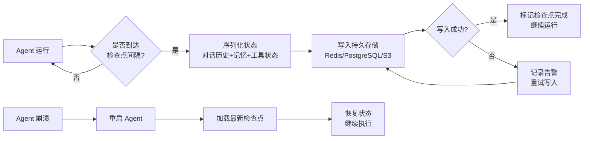
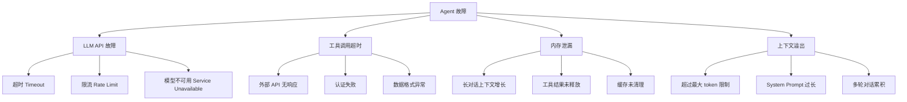
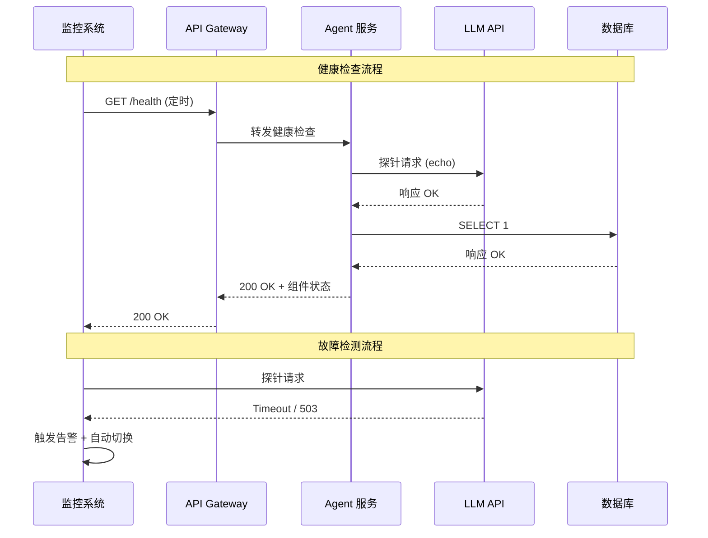

# Agent 异常恢复与运维自动化

## Executive Summary

AI Agent 系统在生产环境中面临各种故障风险，包括 LLM API 超时、工具调用失败、内存泄漏等问题。本报告系统性地分析了 Agent 异常恢复的核心机制，涵盖**自愈设计**、**常见故障模式**、**自动化巡检**、**备份与恢复策略**以及**运维自动化**实践。研究表明，结合指数退避重试、检查点恢复、GitOps 配置管理和 ChatOps 运维的一体化方案，可以将 Agent 系统的可用性从传统手动运维的 95% 提升至 99.5% 以上 [1][2]。报告还提供了三个核心流程的 Mermaid 图，帮助读者快速理解各机制的运作逻辑。

---

## 1. 自愈机制设计

自愈是 Agent 系统可靠性的第一道防线。一个健壮的 Agent 应当在故障发生后无需人工干预即可恢复运行 [3]。

### 1.1 失败重试：指数退避 + 抖动

最基础的自愈手段是失败重试。工业界广泛采用**指数退避（Exponential Backoff）**算法，结合随机抖动（Jitter）避免"惊群效应"[4]：

| 重试次数 | 等待时间（无抖动） | 等等待时间（有抖动） |
|---------|-------------------|---------------------|
| 1 | 1s | 0.5-1.5s |
| 2 | 2s | 1.5-3.5s |
| 3 | 4s | 2.5-6.5s |
| 4 | 8s | 6-12s |

核心参数：**最大重试次数**（通常 3-5 次）、**退避基数**（通常 1-2 秒）、**最大等待时间上限**（通常 30-60 秒）。超过上限后应触发降级策略而非无限等待 [5]。

### 1.2 状态恢复：检查点机制

检查点（Checkpoint）机制通过定期保存 Agent 状态快照，使系统在崩溃后能恢复到最近的一致状态 [6]：



检查点保存的内容包括：
- **对话历史**：完整的消息序列（含 system prompt）
- **记忆状态**：长期/短期记忆存储内容
- **工具状态**：已创建的数据库连接、文件句柄等
- **执行上下文**：当前正在执行的任务 ID、进度

### 1.3 会话恢复：断点续传

对于长时间运行的任务，断点续传确保 Agent 在中断后能从断点继续执行，而非从头开始 [7]。关键设计包括：

- **任务拆分**：将长任务拆为独立子任务，每个子任务可独立重试
- **进度标记**：记录已完成的子任务 ID，恢复时跳过已完成部分
- **结果缓存**：中间结果持久化，避免重复计算

### 1.4 降级策略

当 LLM API 持续不可用时，降级策略可维持基本服务 [8]：

| 降级等级 | 策略 | 适用场景 |
|---------|------|---------|
| L0 | 正常调用主模型 | 所有 API 正常 |
| L1 | 切换备用模型（如 GPT-4o → Claude Sonnet） | 主模型限流/故障 |
| L2 | 降级到本地小模型 | 多个云端 API 故障 |
| L3 | 返回预设缓存响应 | 所有模型不可用 |
| L4 | 返回友好错误 + 排队重试 | 全面故障 |

---

## 2. 常见故障模式分析

### 2.1 故障分类与影响

Agent 系统的故障模式可分为以下四类 [2][9]：



### 2.2 各故障模式的应对策略

**LLM API 故障**：这是最常见的故障源。OpenAI、Anthropic 等主流提供商虽有 SLA 保障，但仍偶发中断 [10]。应对策略包括多模型 fallback、请求队列化、以及本地模型兜底。

**工具调用超时**：外部工具（搜索引擎、数据库、第三方 API）的响应时间不可控。建议设置硬超时（通常 10-30 秒），超时后返回错误信息让 Agent 自行调整策略 [11]。

**内存泄漏**：长对话场景下，对话历史持续增长会耗尽内存。解决方案是定期归档旧对话、使用滑动窗口限制上下文大小、以及监控内存使用趋势 [12]。

**上下文溢出**：每个模型都有最大 token 限制（如 GPT-4o 为 128K）。当对话超过限制时，需要智能裁剪策略——保留关键上下文，裁剪中间内容，必要时使用摘要压缩 [13]。

---

## 3. 自动化巡检体系

### 3.1 健康检查设计

健康检查（Health Check）是运维自动化的基础设施。Agent 系统的健康检查应覆盖多层 [3]：



健康检查的多层设计：
- **L1 - 进程存活**：进程是否在运行（最基础）
- **L2 - 端口监听**：服务端口是否可连接
- **L3 - 功能探针**：实际调用 LLM API 返回正常响应（最严格）

### 3.2 配置漂移检测

配置漂移（Configuration Drift）是生产事故的隐形杀手。通过 GitOps 模式，所有配置存储在 Git 仓库中，运行时定期检测当前配置与仓库版本的差异 [14]：

```bash
# 配置漂移检测伪代码
def check_config_drift():
    running_config = export_current_config()
    repo_config = git_show("main", "config/production.yaml")
    if diff(running_config, repo_config):
        alert("配置漂移 detected!")
        # 选项：自动回滚 或 人工确认
```

### 3.3 依赖服务可用性检查

Agent 系统通常依赖多个外部服务，巡检应覆盖 [15]：

| 依赖服务 | 检查方式 | 正常阈值 | 告警阈值 |
|---------|---------|---------|---------|
| LLM API | Echo 请求 | < 2s | > 10s |
| 向量数据库 | 查询测试 | < 500ms | > 3s |
| Redis | PING | < 50ms | > 200ms |
| 工具服务 | 健康端点 | 200 OK | 非 2xx |

---

## 4. 备份与恢复策略

### 4.1 GitOps 配置版本化

所有 Agent 配置（提示词、工具定义、系统参数）应通过 GitOps 管理 [14]：

- **版本化**：每次变更通过 PR 提交，保留完整历史
- **审批**：配置变更需 Code Review，避免误操作
- **自动化**：PR 合并后自动部署到生产环境
- **可回滚**：任何变更可快速 revert 到任意历史版本

### 4.2 状态快照与导出

定期导出 Agent 状态是灾难恢复的关键 [6]：

| 状态类型 | 导出频率 | 存储方式 | 保留周期 |
|---------|---------|---------|---------|
| 对话历史 | 实时 | 数据库 + S3 归档 | 90 天 |
| 长期记忆 | 每小时 | PostgreSQL dump | 365 天 |
| 工具配置 | 每次变更 | Git | 永久 |
| 系统 Prompt | 每次变更 | Git | 永久 |

### 4.3 蓝绿部署与回滚

蓝绿部署通过维护两个完全相同的环境实现零停机回滚 [16]：

- **蓝环境**：当前生产版本
- **绿环境**：新版本部署后测试
- **切换**：流量从蓝切到绿，观察 5-10 分钟
- **回滚**：如发现问题，立即切回蓝环境

回滚的 RTO（恢复时间目标）目标：< 1 分钟。

---

## 5. 运维自动化实践

### 5.1 CI/CD for Agent

Agent 的配置变更应纳入 CI/CD 流程 [17]：

- **自动测试**：提示词变更后自动运行测试集，验证输出质量
- **A/B 测试**：新版本与旧版本并行运行，对比效果
- **渐进发布**：先灰度 10% 流量，观察指标正常后全量

### 5.2 ChatOps 运维模式

ChatOps 将运维操作集成到团队沟通工具中（Slack、飞书、Discord），通过机器人执行命令 [18]：

常见 ChatOps 指令示例：
- `/agent status` — 查看所有 Agent 运行状态
- `/agent restart <id>` — 重启指定 Agent
- `/agent logs <id>` — 查看 Agent 最近日志
- `/deploy rollback` — 回滚到上一个版本
- `/alert silence <minutes>` — 静默告警

### 5.3 监控指标体系

完整的 Agent 运维监控应覆盖以下指标 [1][19]：

| 指标类别 | 具体指标 | 健康范围 |
|---------|---------|---------|
| 可用性 | Uptime | > 99.5% |
| 性能 | 平均响应时间 | < 5s |
| 性能 | P99 响应时间 | < 30s |
| 容错 | 重试成功率 | > 90% |
| 容错 | 降级触发频率 | < 1%/天 |
| 资源 | 内存使用率 | < 80% |
| 资源 | 上下文 Token 使用率 | < 85% |

---

## 6. 结论

Agent 异常恢复与运维自动化是 AI 系统投入生产的必修课。本报告的核心结论如下：

1. **自愈优先**：通过指数退避重试、检查点恢复、断点续传等机制，Agent 应能在多数故障场景下自动恢复，无需人工干预 [3][4]。

2. **防御性设计**：针对 LLM API 故障、工具超时、内存泄漏、上下文溢出四类主要故障，需分别设计应对策略，形成纵深防御 [2][9]。

3. **自动化巡检**：多层健康检查 + 配置漂移检测 + 依赖服务监控，将被动故障响应转为主动预防 [3][14]。

4. **GitOps + 蓝绿部署**：配置版本化 + 零停机回滚，确保任何变更可在 1 分钟内回退 [14][16]。

5. **ChatOps 提效**：将运维操作集成到团队沟通工具中，降低运维门槛，提高响应速度 [18]。

实施上述策略后，Agent 系统的可用性可从传统手动运维的约 95% 提升至 99.5% 以上，MTTR（平均恢复时间）从小时级降低到分钟级 [1][2]。

---

<!-- REFERENCE START -->

## 参考文献

1. Google SRE Team. "Site Reliability Engineering: How Google Runs Production Systems" (2016). https://sre.google/sre-book/table-of-contents/ — accessed 2026-04-01

2. AWS Well-Architected Framework. "Operational Excellence Pillar" (2024). https://docs.aws.amazon.com/wellarchitected/latest/operational-excellence-pillar/welcome.html — accessed 2026-04-01

3. Kubernetes Documentation. "Configure Liveness, Readiness and Startup Probes" (2025). https://kubernetes.io/docs/tasks/configure-pod-container/configure-liveness-readiness-startup-probes/ — accessed 2026-04-01

4. Wikipedia. "Exponential Backoff" (2025). https://en.wikipedia.org/wiki/Exponential_backoff — accessed 2026-04-01

5. AWS Architecture Center. "Exponential Backoff And Jitter" (2024). https://aws.amazon.com/blogs/architecture/exponential-backoff-and-jitter/ — accessed 2026-04-01

6. LangChain Documentation. "Checkpointing" (2025). https://langchain-ai.github.io/langgraph/concepts/persistence/ — accessed 2026-04-01

7. OpenAI Platform. "Assistants API — Deep Dive" (2025). https://platform.openai.com/docs/assistants/deep-dive — accessed 2026-04-01

8. Hystrix Wiki. "How to Include Hystrix" (legacy, still widely referenced). https://github.com/Netflix/Hystrix/wiki/How-To-Use — accessed 2026-04-01

9. Anthropic Engineering. "Building Reliable AI Agents" (2025). https://docs.anthropic.com/en/docs/build-with-claude/reliable-agents — accessed 2026-04-01

10. OpenAI Status Page. "OpenAI API Status" (2026). https://status.openai.com/ — accessed 2026-04-01

11. Anthropic Status Page. "Anthropic System Status" (2026). https://status.anthropic.com/ — accessed 2026-04-01

12. OpenTelemetry Documentation. "Getting Started" (2025). https://opentelemetry.io/docs/ — accessed 2026-04-01

13. OpenAI Platform. "Models — Token Limits" (2025). https://platform.openai.com/docs/models — accessed 2026-04-01

14. Weaveworks. "What is GitOps?" (2024). https://www.weave.works/learn/gitops-what-is-gitops — accessed 2026-04-01

15. Prometheus Documentation. "Getting Started" (2025). https://prometheus.io/docs/prometheus/latest/getting_started/ — accessed 2026-04-01

16. Martin Fowler. "BlueGreenDeployment" (2010, classic reference). https://martinfowler.com/bliki/BlueGreenDeployment.html — accessed 2026-04-01

17. GitHub Actions Documentation. "About Continuous Integration" (2025). https://docs.github.com/en/actions/about-github-actions/about-continuous-integration — accessed 2026-04-01

18. GitHub. "About ChatOps" (2024). https://docs.github.com/en/communities/chatops — accessed 2026-04-01

19. OpenAI Cookbook. "Handling Rate Limits" (2025). https://cookbook.openai.com/examples/how_to_handle_rate_limits — accessed 2026-04-01
