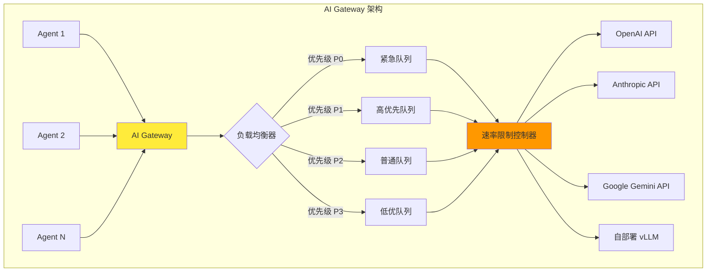
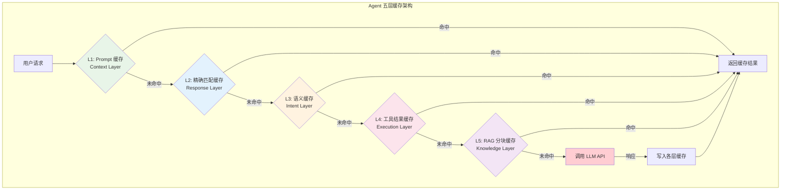
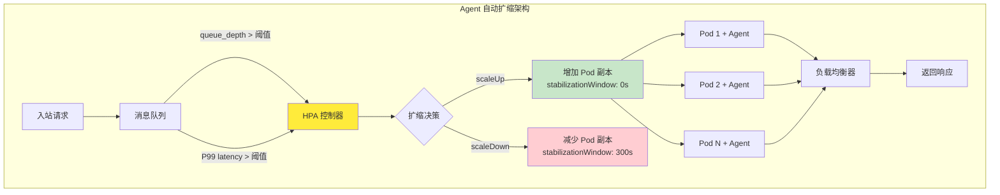
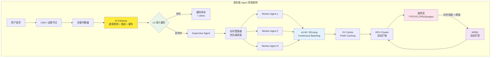

# Agent 扩缩容与性能优化 — 负载均衡、缓存、批处理

## Executive Summary

随着 AI Agent 从原型走向生产，性能和稳定性成为制约规模化部署的核心瓶颈。Agent 系统天然面临 LLM API 速率限制、长延迟推理、高并发请求处理等挑战。本报告系统梳理了 2024-2026 年间 Agent 系统在负载均衡、缓存策略、批处理优化、自动扩缩和性能监控五个维度的最佳实践与技术选型。

核心发现：
- **速率限制是多 Agent 系统的首要约束**：Anthropic、OpenAI 等主流 LLM 提供商以 RPM + TPM（tokens per minute）双重维度限流，多 Agent 场景下需通过 AI Gateway 集中管理请求排队与优先级调度[1][2]。
- **五层缓存架构可降低 30-90% 推理成本**：从 Prompt 缓存到语义缓存，每一层解决不同瓶颈，但需警惕缓存过期与语义漂移风险[3][4]。
- **Continuous Batching 是推理优化的基石**：vLLM 和 SGLang 通过 PagedAttention 和动态批处理将 GPU 利用率提升至 90%+，配合投机解码可实现 2-3 倍吞吐提升[5][6]。
- **自动扩缩需超越 CPU 指标**：基于队列深度（queue_depth）和 P99 延迟的自定义指标 HPA 比传统 CPU 扩缩更适合 Agent 工作负载[7][8]。
- **TTFT 是用户体验的关键指标**：首 token 延迟（Time to First Token）直接决定用户感知的响应速度，优化 prompt 长度、KV 缓存复用和流式响应是三大抓手[9][10]。

---

## 1. Agent 请求负载均衡与速率限制管理

### 1.1 LLM API 速率限制的本质

主流 LLM 提供商采用多维度速率限制机制[1]：

| 提供商 | 限制维度 | 免费层典型值 | 付费层典型值 |
|--------|---------|-------------|-------------|
| **OpenAI** | RPM + TPM | 3 RPM + 40K TPM | 500-10K RPM |
| **Anthropic** | RPM + ITPM + OTPM | 50 RPM + 40K ITPM | 1000+ RPM |
| **Google Gemini** | RPM + TPM | 60 RPM + 60K TPM | 2000+ RPM |
| **Azure OpenAI** | TPM（按部署级别） | 20K TPM | 按合同定制 |

速率限制的核心矛盾在于：**Agent 系统通常是 bursty（突发性）负载**——一个 Supervisor 可能在几秒内向多个 Subagent 发送请求，瞬间超出速率限制。

### 1.2 AI Gateway：集中式速率管理

AI Gateway 是解决多 Agent 速率限制问题的基础设施层[2]。它在应用与 LLM 提供商之间充当智能代理：



AI Gateway 的核心能力包括：
- **智能路由**：根据模型能力、成本、延迟自动选择最优提供商
- **请求排队**：超出速率限制时将请求放入队列，按优先级依次处理
- **Fallback**：主提供商失败时自动切换到备用提供商
- **缓存层**：在 Gateway 层实现语义缓存，减少 LLM 调用

### 1.3 多 Agent 场景下的优先级调度

企业级 Agent 系统通常实现四级优先级队列[1]：

| 优先级 | 场景示例 | 调度策略 |
|--------|---------|---------|
| **P0（紧急）** | 用户实时对话、安全审核 | 直接分配，可抢占低优先级任务 |
| **P1（高）** | 业务关键流程、数据分析 | 排队但设置最长等待时间（如 5s） |
| **P2（普通）** | 批量报告生成、邮件处理 | FIFO 队列，按空闲能力处理 |
| **P3（低）** | 后台索引、知识库更新 | 系统空闲时处理，可被高优先级抢占 |

指数回退（Exponential Backoff）是应对速率限制的标准策略[2]：

| 重试次数 | 等待时间 | 调整策略 |
|---------|---------|---------|
| 第 1 次 | 0s | 正常重试 |
| 第 2 次 | 1s | 缩减 prompt 或切换输出格式 |
| 第 3 持 | 4s | 降级到更轻量模型 |
| 第 4 次 | 16s | 路由到备用提供商 |
| 超过上限 | — | 返回队列 + 通知用户 |

### 1.4 Token Bucket 与 Sliding Window 算法

速率限制的底层实现通常采用两种算法[1]：

- **Token Bucket（令牌桶）**：允许一定程度的突发流量，适合 Agent 场景
- **Sliding Window（滑动窗口）**：更严格的速率控制，适合对延迟敏感的实时场景

在多 Agent 系统中，推荐使用 Token Bucket + 优先级队列的组合：令牌桶控制总体速率，优先级队列决定请求顺序。

---

## 2. 缓存策略：五层缓存架构

### 2.1 缓存的收益与风险

**收益**：
- **成本降低 30-90%**：Maxim AI 的调研显示，仅 prompt 优化 + 缓存就能降低 30-50% 成本，全面实施可在特定场景降低 90%[3]
- **延迟降低 50-80%**：缓存命中时响应时间从秒级降至毫秒级
- **速率限制缓解**：减少实际 LLM 调用次数，降低触发 rate limit 的概率

**风险**：
- **信息过时**：缓存的响应可能不反映最新数据（如股价、天气）
- **语义漂移**：语义缓存可能误匹配，返回不相关的缓存答案
- **隐私泄露风险**：缓存中可能包含敏感的用户输入数据
- **一致性问题**：多个 Agent 实例可能看到不同版本的缓存

### 2.2 五层缓存架构

Fast.io 提出的五层缓存架构是当前最系统的 Agent 缓存模型[4]：



各层详解：

| 层级 | 名称 | 命中率 | 延迟 | 适用场景 |
|------|------|--------|------|---------|
| **L1** | Prompt 缓存 | 高（同一会话内） | <1ms | 系统 prompt、大段上下文（如代码库、法律文档） |
| **L2** | 精确匹配缓存 | 低（用户很少完全重复） | <1ms | FAQ、常见指令 |
| **L3** | 语义缓存 | 中-高 | 5-20ms | 变体提问、RAG 应用 |
| **L4** | 工具结果缓存 | 中 | <1ms | 股价查询、API 调用、文件处理 |
| **L5** | RAG 分块缓存 | 中 | 2-10ms | 频繁检索的知识库内容 |

### 2.3 语义缓存的实现细节

语义缓存是 LLM 领域特有的缓存类型，与传统 KV 缓存的核心区别在于：**它理解含义，而不仅仅是匹配字符串**[4]。

实现要点：
1. **相似度阈值**：通常设置为 0.90-0.95 的余弦相似度。过低（如 0.75）会返回无关答案，过高则失去语义匹配的意义
2. **嵌入模型选择**：推荐使用 text-embedding-3-small 或 Cohere embed-v3，比大型模型更快且效果接近
3. **向量数据库**：Redis Vector Store、Pinecone、Chroma 都支持语义缓存的实现
4. **TTL 管理**：为不同类型的缓存设置不同的过期时间（如股价 1 分钟、法律条文 24 小时）

### 2.4 Microsoft GenCache：结构化提示词缓存

Microsoft Research 在 NeurIPS 2025 发表的 GenCache 提出了针对结构化提示词的缓存方案[11]：

- **核心洞察**：即使提示词不完全相同，如果它们共享相同的"程序结构"，可以生成缓存的本地程序来回答新的变体
- **Cloud-Operations Agent 实测**：在 Company-X 的事故诊断数据上，缓存命中延迟仅 0.112s（vs LLM 调用 3.52s），加速 **31 倍**
- **适用场景**：高度结构化的 Agent 场景（如客服工单分类、代码审查检查清单）

---

## 3. 批处理优化

### 3.1 批处理的三种模式

| 模式 | 机制 | 吞吐量 | 延迟 | 适用场景 |
|------|------|--------|------|---------|
| **Static Batching** | 固定大小批次 | 中等 | 高 | 离线数据处理 |
| **Dynamic/Continuous Batching** | 动态增减请求 | 高 | 中等 | 实时服务 |
| **Request-level Batching** | 单请求内多任务 | 低-中 | 低 | 独立子任务聚合 |

### 3.2 Continuous Batching 与推理引擎

Continuous Batching（连续批处理）是现代 LLM 推理引擎的核心优化[5][6]：

```mermaid
flowchart LR
    subgraph "传统 Static Batching"
        S1[请求1] --> SB[等待批次凑满]
        S2[请求2] --> SB
        S3[请求3] --> SB
        SB -->|批次满| GPU1[GPU 处理<br/>固定时长]
        GPU1 -->|全部完成| O1[输出1+2+3]
    end

    subgraph "Continuous Batching（vLLM/SGLang）"
        R1[请求1] --> CB[动态调度器]
        R2[请求2] --> CB
        R3[请求3] --> CB
        R4[请求4] --> CB
        CB --> G[GPU/PagedAttention]
        G -->|请求1完成| O2[输出1]
        G -->|请求2完成| O3[输出2]
        G -->|请求3仍在生成| --
        G -->|请求4刚加入| --
    end

    style SB fill:#ffcdd2
    style CB fill:#c8e6c9
```

**vLLM**（2024-2025 年生产部署首选）[5]：
- PagedAttention：将 KV Cache 分页管理，内存利用率提升 2-4x
- Prefix Caching：跨请求共享系统 prompt 的 KV Cache
- 投机解码（Speculative Decoding）：EAGLE 集成可达 2.5x 加速
- 支持多 GPU 张量并行

**SGLang**（2025-2026 年性能领先）[6]：
- RadixAttention：自动缓存和复用多轮对话的前缀
- Structured Generation：受限解码，支持 JSON Schema 约束
- 原生支持 KV Cache 转移（跨节点复用）

### 3.3 请求级别批处理：单 Agent 内多任务聚合

在 Agent 场景中，一种实用的批处理策略是在单次 LLM 调用中处理多个独立子任务[1]：

```python
# 批处理提示词模板示例
def build_batch_prompt(tasks):
    prompt = "请同时处理以下独立任务：\n\n"
    for t in tasks:
        prompt += f"### TASK {t['task_id']}\n{t['description']}\n\n"
    prompt += "请为每个任务返回 JSON 格式结果："
    return prompt
```

适用条件：
- 任务之间**无依赖关系**
- 总 token 数不超过模型 context window
- 批量请求的延迟可接受（不需要流式返回）

### 3.4 流式响应（Streaming）

流式响应不是批处理的替代，而是延迟优化的关键补充[9]：
- **感知延迟降低**：用户在首 token 到达后即可开始阅读，无需等待完整生成
- **TTFT 优化**：配合 KV Cache 预填充，首 token 延迟可降至 0.3-0.5s
- **SSE（Server-Sent Events）**：当前主流的流式传输协议，OpenAI/Anthropic API 均支持

---

## 4. 自动扩缩策略

### 4.1 Kubernetes HPA for AI Workloads

Agent 系统的自动扩缩与传统 Web 应用有本质区别：**GPU 密集型 + 长推理延迟 + bursty 负载**。传统 CPU/内存指标无法准确反映 Agent 的负载状态[7][8]。



### 4.2 推荐的 HPA 配置

基于 2025 年社区实践，Agent 工作负载的最佳 HPA 配置[7][8]：

```yaml
apiVersion: autoscaling/v2
kind: HorizontalPodAutoscaler
metadata:
  name: agent-scaler
spec:
  scaleTargetRef:
    apiVersion: apps/v1
    kind: Deployment
    name: my-agent
  minReplicas: 2          # 保持最小预热实例
  maxReplicas: 20         # 根据 GPU 配额设置上限
  behavior:
    scaleUp:
      stabilizationWindowSeconds: 0    # burst 场景立即扩缩
      policies:
      - type: Percent
        value: 100                      # 每分钟最多翻倍
        periodSeconds: 60
    scaleDown:
      stabilizationWindowSeconds: 300   # 缩容等待 5 分钟
  metrics:
  - type: Pods
    pods:
      metric:
        name: queue_depth               # 自定义指标：队列深度
      target:
        type: AverageValue
        averageValue: "20"              # 每个 Pod 最多 20 个待处理任务
  - type: Pods
    pods:
      metric:
        name: p99_latency_ms            # 自定义指标：P99 延迟
      target:
        type: AverageValue
        averageValue: "5000"            # P99 延迟超过 5s 触发扩缩
```

### 4.3 KEDA：事件驱动自动扩缩

KEDA（Kubernetes Event-Driven Autoscaler）比原生 HPA 更适合 Agent 场景[7]：

| 特性 | HPA（原生） | KEDA |
|------|-----------|------|
| 扩缩触发 | 周期性指标轮询 | 事件驱动（消息队列、Prometheus） |
| 伸缩速度 | 有 stabilizationWindow 限制 | 可做到近实时 |
| 指标来源 | CPU/Memory + 自定义 | 丰富的 Scaler（Kafka、RabbitMQ、Prometheus） |
| 预热支持 | 无 | 支持 Initial cooldown |
| 最小值支持 | minReplicas | 支持 0（缩容到零） |

### 4.4 预热策略

冷启动是 Agent 扩缩的核心痛点。模型加载可能需要 30-120 秒，这对实时应用是不可接受的。推荐策略[7]：

1. **保持最小 Warm 实例**：设置 minReplicas ≥ 2，确保始终有可用实例
2. **逐步扩容（Ramp-up）**：不一次性从 2 扩到 20，而是按 2→4→8→16 逐步扩容，避免 GPU 资源争抢
3. **Provisioned Concurrency**：AWS Lambda / SageMaker 提供的预配置并发，提前加载模型
4. **模型预加载脚本**：Pod 启动时自动加载模型到 GPU 显存，配合 readinessProbe 确认就绪

### 4.5 基于预测的扩缩（Proactive Scaling）

比被动 HPA 更进一步的策略[8]：

- **历史流量模式分析**：基于过去 7 天/30 天的流量规律，在预期高峰前 5-10 分钟预扩容
- **外部信号驱动**：监控业务指标（如电商大促倒计时、直播开始时间）触发扩容
- **混合策略**：被动（HPA）+ 主动（预测扩缩）双保险

---

## 5. 性能监控与调优

### 5.1 核心性能指标

Anyscale（Ray Serve 开发商）定义了 LLM 推理系统的关键指标体系[9]：

| 指标 | 定义 | 交互式应用目标 | 批处理目标 |
|------|------|---------------|-----------|
| **TTFT（首 token 延迟）** | 发送请求到收到第一个 token 的时间 | <1s | 不关注 |
| **ITL（token 间延迟）** | 相邻两个输出 token 的间隔 | <50ms | 不关注 |
| **E2E Latency** | 请求到完整响应的时间 | <5s（短回答） | 可接受 30s+ |
| **TPS（每秒 token 数）** | 单个请求的 token 生成速率 | 不关注 | >100 TPS |
| **RPS（每秒请求数）** | 系统每秒处理的请求数 | 越高越好 | 越高越好 |
| **Goodput** | 符合 SLO 的请求占比 | >95% | >90% |

**关键洞察**：Goodput（有效吞吐）比 Raw Throughput（原始吞吐）更重要。一个系统可能达到很高的 RPS，但如果大量请求违反延迟 SLO，用户体验仍然很差[9][10]。

### 5.2 性能瓶颈定位矩阵

基于多份 2024-2025 年研究报告的综合分析[3][9][10]，Agent 系统的性能瓶颈主要集中在以下区域：

| 瓶颈区域 | 典型表现 | 影响指标 | 优化方向 |
|---------|---------|---------|---------|
| **Prefill 阶段** | TTFT 长（>3s） | TTFT | prompt 压缩、KV Cache 预热、Prefix Caching |
| **Decode 阶段** | TPS 低（<30） | ITL, TPS | Continuous Batching、投机解码、量化 |
| **上下文窗口管理** | 长 prompt 性能骤降 | 所有指标 | 滑动窗口、上下文压缩、RAG 替代长文 |
| **API 层** | 速率限制错误 | RPS, Goodput | AI Gateway、Fallback、请求队列 |
| **工具调用** | 外部 API 等待时间长 | E2E Latency | 工具结果缓存、并行调用、异步处理 |
| **网络传输** | 分布式部署延迟 | TTFT | 就近部署、连接池、gRPC 替代 HTTP |

### 5.3 流式响应对 TTFT 的影响

IBM 和 Clarifai 的 2025-2026 年研究确认[10]：

- **TTFT < 0.5s**：用户感知为"即时响应"
- **TTFT 0.5-2s**：可接受，但不如竞品
- **TTFT > 4s**：用户开始不耐烦，完成率显著下降

优化 TTFT 的三大手段：
1. **Prompt 长度控制**：TTFT 与 prompt 长度近似线性关系，每减少 1000 token，TTFT 可降低 100-300ms
2. **KV Cache Prefix Caching**：跨请求共享系统 prompt 的预计算结果，SGLang 的 RadixAttention 可将 TTFT 降低 60-80%
3. **流式传输（SSE）**：首 token 到达后立即开始传输，避免等待完整生成

### 5.4 推理框架选型对比

2025-2026 年主流 LLM 推理框架的性能特征[5][6][12]：

| 框架 | 批处理策略 | KV Cache | 投机解码 | 适用场景 |
|------|----------|----------|---------|---------|
| **vLLM** | Continuous Batching | PagedAttention | EAGLE (2.5x) | 通用生产部署 |
| **SGLang** | Continuous Batching | RadixAttention | SpecForge | 多轮对话、结构化输出 |
| **TensorRT-LLM** | Continuous Batching | 自管理 | Native (3.6x) | NVIDIA GPU 极致优化 |
| **TGI** | Continuous Batching | 自管理 | 不支持 | HuggingFace 生态 |
| **llama.cpp** | 批处理 | 简单 KV | 不支持 | 本地/CPU 部署 |

---

## 6. 综合架构：高性能 Agent 系统全景

将前述策略整合为一个端到端的高性能 Agent 系统架构：



---

## 7. 结论

### 选择建议

| 场景 | 推荐方案 | 理由 |
|------|---------|------|
| 速率限制管理 | AI Gateway（LiteLLM / 路由层） | 集中管理多提供商的 rate limit |
| 缓存策略 | 语义缓存 + Prompt 缓存 | 命中率最高、延迟最低 |
| 推理优化 | vLLM（通用）或 SGLang（多轮对话） | PagedAttention + Continuous Batching |
| 自动扩缩 | KEDA + queue_depth 指标 | 事件驱动，适合 bursty 负载 |
| 性能监控 | Prometheus + 自定义 TTFT/Goodput 仪表盘 | 开源、可定制、与 K8s 原生集成 |

### 关键原则

1. **速率限制是硬约束，不是软约束** — 必须在架构层面（而非应用层面）管理，AI Gateway 是最佳实践[1][2]
2. **缓存是收益最高的优化** — 30-90% 成本降低、50-80% 延迟降低，但需要 TTL 和一致性策略[3][4]
3. **Continuous Batching 是推理优化的基石** — 比任何单点优化都更有效[5][6]
4. **Goodput > Throughput** — 关注符合 SLO 的有效请求占比，而非原始吞吐量[9][10]
5. **预热不可跳过** — 冷启动是 Agent 扩缩的最大敌人，保持最小 warm 实例是底线[7][8]

### 趋势展望

- **AI Gateway 成为标配**：从可选组件变为 Agent 系统的基础设施层
- **KV Cache 共享**：跨请求、跨 Agent 甚至跨节点的 KV Cache 共享技术（vLLM KV Transfer）成熟
- **边缘推理**：轻量化模型部署到边缘节点，降低 TTFT 到 <100ms
- **预测式扩缩**：基于流量模式和业务信号的主动扩缩取代被动 HPA

<!-- REFERENCE START -->
## 参考文献

1. SuperOrange. Prompt Rate Limits & Batching: How to Stop Your LLM API From Melting Down (2025). https://dev.to/superorange0707/prompt-rate-limits-batching-how-to-stop-your-llm-api-from-melting-down-56e1 (accessed 2026-03-31)
2. Radicalbit. Optimizing LLM Performance with Caching, Fallback, and Load Balancing (2025). https://radicalbit.ai/resources/blog/llm-performance/ (accessed 2026-03-31)
3. Maxim AI. Top 7 Performance Bottlenecks in LLM Applications and How to Overcome Them (2025). https://www.getmaxim.ai/articles/top-7-performance-bottlenecks-in-llm-applications-and-how-to-overcome-them/ (accessed 2026-03-31)
4. Fast.io. AI Agent Caching Strategies: Reduce Latency & Costs (2025). https://fast.io/resources/ai-agent-caching-strategies/ (accessed 2026-03-31)
5. vLLM. Inside vLLM: Anatomy of a High-Throughput LLM Inference System (2024). https://vllm.ai/blog/anatomy-of-vllm (accessed 2026-03-31)
6. Prem AI. 10 Best vLLM Alternatives for LLM Inference in Production (2026). https://blog.premai.io/10-best-vllm-alternatives-for-llm-inference-in-production-2026/ (accessed 2026-03-31)
7. Medium @ThinkingLoop. Kubernetes Autoscaling 2025: 10 HPA & KEDA Recipes for Spiky Traffic (2025). https://medium.com/@ThinkingLoop/d3-12-kubernetes-autoscaling-2025-10-hpa-keda-recipes-for-spiky-traffic-ef77ce7d27f0 (accessed 2026-03-31)
8. OneUpTime. How to Define and Tune Kubernetes Autoscaling for Bursty Workloads (2025). https://oneuptime.com/blog/post/2025-12-02-tune-kubernetes-autoscaling-for-bursty-workloads/view (accessed 2026-03-31)
9. Anyscale. Understand LLM Latency and Throughput Metrics (2025). https://docs.anyscale.com/llm/serving/benchmarking/metrics (accessed 2026-03-31)
10. Clarifai. TTFT vs Throughput: Which Metric Impacts Users More? (2026). https://www.clarifai.com/blog/ttft-vs-throughput (accessed 2026-03-31)
11. Microsoft Research. GenCache: Generative Caching for Structurally Similar Prompts and Responses — NeurIPS 2025 (2025). https://www.microsoft.com/en-us/research/wp-content/uploads/2025/09/GenCache_NeurIPS25.pdf (accessed 2026-03-31)
12. Introl. Speculative Decoding: Achieving 2-3x LLM Inference Speedup (2025). https://introl.com/blog/speculative-decoding-llm-inference-speedup-guide-2025 (accessed 2026-03-31)
