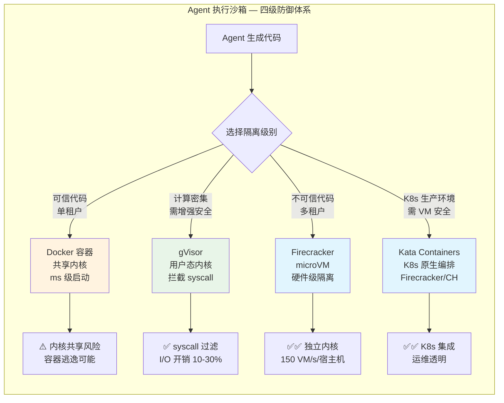
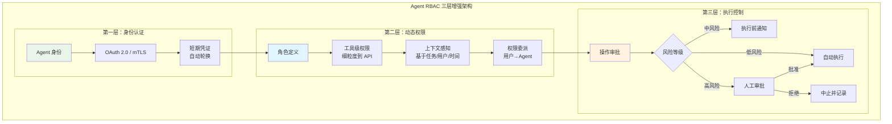
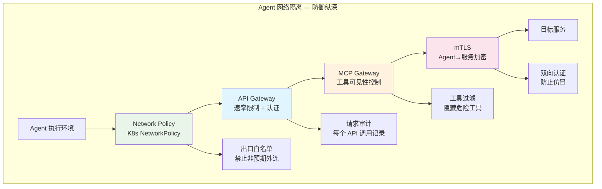

# Agent 安全沙箱与权限 — 执行隔离、工具权限、审计

## Executive Summary

AI Agent 正从"辅助工具"演进为"自主执行者"——它们动态生成代码、调用 API、访问数据库、操作生产系统。OWASP 2025 年将"过度代理"（Excessive Agency）列为 LLM 应用第六大风险，而 82% 的组织已在使用 AI Agent，但仅 44% 制定了安全策略[1][2]。这种安全差距使得 Agent 安全沙箱与权限管理成为生产部署的刚需。

核心发现：
- **沙箱技术形成四级防御体系**：从 Docker 容器（毫秒级启动，共享内核）→ gVisor（syscall 拦截，10-30% I/O 开销）→ Firecracker microVM（硬件级隔离，~125ms 启动）→ Kata Containers（K8s 原生编排 microVM），安全级别递增[3][4]。
- **Agent RBAC 尚无成熟标准**：传统 RBAC 无法直接套用，需要"动态角色分配 + 上下文感知权限 + 自主决策边界"三层增强[5][6]。
- **MCP 协议带来新攻击面**：Anthropic 2024 年开源的 MCP 正成为 Agent-Tool 交互的事实标准，但也引入了工具投毒、名称欺骗、数据外泄等七类攻击[7][8]。
- **审计日志必须记录"推理过程"而非仅"结果"**：生产环境需要三层追踪——LLM 层（token/延迟）、逻辑层（推理步骤/循环）、副作用层（工具调用/文件修改）[9][10]。
- **合规压力快速升高**：GDPR、SOC 2、EU AI Act 均对 AI Agent 的数据处理、可追溯性、人类监督提出了明确要求[11]。

---

## 1. Agent 执行沙箱技术

### 1.1 为什么标准容器不够？

AI Agent 的根本区别在于：**它们生成的代码你从未审阅过**[3]。传统容器（Docker/runc）使用 Linux namespace 和 cgroup 隔离进程，但共享宿主机内核。一个内核漏洞即可实现容器逃逸，获得宿主机访问权限[4]。

对 AI Agent 而言，这意味着：
- Agent 生成的代码可能利用内核漏洞逃逸
- 被攻破的 Agent 可以访问宿主机和其他工作负载
- 横向移动成为可能——从一个 Agent 蔓延到整个基础设施

**结论：生产环境的 AI Agent 不能仅依赖 Docker 容器隔离。**

### 1.2 四级沙箱技术对比

| 技术 | 隔离模型 | 启动速度 | 内存开销 | 安全级别 | 适用场景 |
|------|---------|---------|---------|---------|---------|
| **Docker (runc)** | Namespace + Cgroup，共享内核 | ~ms | 极低 | ⭐⭐ | 可信代码、单租户 |
| **gVisor** | 用户态内核拦截 syscall | ~100ms | 中等 | ⭐⭐⭐ | 计算密集型 Agent 工作负载 |
| **Firecracker** | 硬件虚拟化，独立内核 | ~125ms | <5 MiB/VM | ⭐⭐⭐⭐ | 多租户 Agent 执行、不可信代码 |
| **Kata Containers** | 编排 Firecracker/Cloud Hypervisor，K8s 原生 | ~200ms | 最小 | ⭐⭐⭐⭐ | 生产 K8s 工作负载需要 VM 安全 |



### 1.3 gVisor：用户态内核拦截

gVisor 由 Google 开源，在用户空间实现了一个 Linux 内核（Sentry），拦截容器的所有 syscall 并在 Sentry 中处理，只有极少数经过验证的请求才会到达宿主机内核[4]。

**核心优势**：
- 大幅减少宿主机内核攻击面（数百个 syscall 缩减为最小子集）
- 与现有 Docker/K8s 工具链兼容
- 不需要硬件虚拟化支持

**已知局限**：
- I/O 密集型工作负载有 10-30% 性能损失[3]
- 非完整 VM 级隔离，仍有共享部分主机资源

### 1.4 Firecracker microVM：硬件级隔离

Firecracker 由 AWS 开源，专为 Serverless 和多租户场景设计。每个 microVM 拥有独立的 Linux 内核，运行在 KVM 虚拟化之上[3]。

**关键指标**：
- 启动时间 ~125ms
- 每个 VM 内存开销 <5 MiB
- 单台宿主机每秒可启动 150 个 VM

**实际应用**：
- AWS Lambda 和 Fargate 的底层技术
- E2B（专为 AI Agent 设计的代码沙箱服务）底层使用 Firecracker[12]
- AWS Bedrock AgentCore（2025 年发布）面向 Agent 代码执行和浏览器操作[12]

### 1.5 Kata Containers：K8s 原生 microVM

Kata Containers 的核心价值在于**将 microVM 的安全级别带给标准 K8s 工作流**。从 Kubernetes 视角看，它是一个普通容器；底层实际运行的是完整 VM[4]。

支持多种 VMM 后端（Firecracker、Cloud Hypervisor、QEMU），允许根据安全需求灵活选择。

### 1.6 产品化沙箱服务

| 服务 | 底层技术 | 启动速度 | 特色 | 定价模式 |
|------|---------|---------|------|---------|
| **E2B** | Firecracker | ~1s | 专为 AI Agent 设计的代码解释器 | 免费额度 + 按量 |
| **Modal** | 容器 | 亚秒级 | Python SDK，一行代码定义沙箱 | 按 CPU/秒 |
| **Northflank** | Kata + gVisor | 秒级 | 生产级基础设施，BYOC | 企业定价 |
| **Together AI** | VM snapshot | 500ms 恢复 | GPU 云扩展，快照恢复 | 按 CPU/秒 |
| **Fly.io Sprites** | Firecracker | 秒级 | 有状态持久存储，长时 Agent | 按量 |

---

## 2. 工具调用权限控制

### 2.1 Agent 权限的特殊性

Agent 不同于传统应用的关键在于：**它的行为是非确定性的**。你无法预知 Agent 在下一轮推理中会调用哪个工具、执行什么操作。这使得传统的静态权限模型不够用[5][6]。

OWASP 2025 明确指出：Agent 权限控制必须遵循"**最小权限原则**"——如果任务需要不同级别的访问权限，应使用**多个 Agent**，每个配置完成任务所需的最少权限[1]。

### 2.2 Agent RBAC 三层增强

传统 RBAC（基于角色的访问控制）需要三层增强才能适配 Agent[5]：



**第一层：Agent 身份认证**
- 每个 Agent 必须有独立身份，如同微服务一样
- 使用 OAuth 2.0 客户端凭证流或 mTLS 进行认证
- 凭证短期有效、自动轮换

**第二层：动态权限**
- **工具级权限**：精确到每个 API/工具，而非粗粒度的角色
- **上下文感知**：权限根据任务类型、请求用户、时间段动态调整
- **权限委派**：用户授权 Agent 代表自己操作，权限范围由用户定义

**第三层：执行控制**
- 按风险等级分级处理：低风险自动执行、中风险通知、高风险人工审批
- 关键操作（删除数据、发送外部请求、修改权限）必须触发 Human-in-the-Loop

### 2.3 MCP 协议的安全挑战

Model Context Protocol（MCP）由 Anthropic 于 2024 年底开源，已成为 Agent 连接外部工具的事实标准[7]。但 MCP 引入了一系列新的安全挑战：

| 攻击类型 | 描述 | 影响 |
|---------|------|------|
| **工具投毒（Tool Poisoning）** | 恶意 MCP Server 注入危险工具描述 | Agent 被诱导执行恶意操作 |
| **名称欺骗（Name Spoofing）** | 仿冒合法工具名称 | Agent 调用错误工具 |
| **数据外泄** | 通过工具返回值隐式传输数据 | 敏感信息泄露 |
| **Prompt 注入** | 工具描述中嵌入恶意指令 | 劫持 Agent 行为 |
| **CSRF 攻击** | 如 CVE-2025-49596（MCP Inspector 远程代码执行） | 宿主机被攻破 |

**防御措施**：
- MCP 规范要求 Host 在调用工具前获取用户明确同意[7]
- 实施 MCP Gateway 作为中间层：隐藏敏感工具、阻止危险行为[8]
- MCP Server 实现 OAuth 2.0 认证/授权（MCP 2025-03-26 规范要求）[13]
- 定期轮换 MCP Server 注册表，扫描工具投毒

### 2.4 权限边界定义框架

**Agent 工具调用的权限边界应从五个维度定义**：

| 维度 | 定义内容 | 示例 |
|------|---------|------|
| **数据范围** | Agent 可以访问哪些数据源 | 只读客户表，不可访问薪资表 |
| **操作类型** | 允许的 CRUD 操作 | 只允许 SELECT，不允许 DROP |
| **API 范围** | 可调用的 API 列表及其限制 | /api/v1/search（无限制）+ /api/v1/delete（需审批） |
| **网络边界** | 可访问的网络端点 | 仅内网 API，禁止外网请求 |
| **资源配额** | CPU/内存/执行时间/调用次数限制 | 最大 30s 执行时间，100 次/小时 API 调用 |

### 2.5 Zero Trust Agent 安全架构

AccuKnox 等安全厂商提出"Zero Trust Agentic AI"框架，核心原则[14]：

1. **每次请求都验证身份**：Agent 的每个工具调用都需要认证
2. **从不信任，始终验证**：即使是内部 Agent 间通信也要加密和授权
3. **最小权限**：Agent 只获得完成当前任务所需的最少权限
4. **假设已被攻破**：设计时假设 Agent 可能被恶意利用，限制其爆炸半径

---

## 3. 代码执行隔离

### 3.1 Python 沙箱方案

Python 代码执行是 Agent 最常见的代码运行场景。主要隔离方案：

| 方案 | 隔离级别 | 限制能力 | 适用场景 |
|------|---------|---------|---------|
| **Python `restrictedpython`** | 解释器级 | 拦截危险 AST 节点 | 轻量级用户脚本 |
| **Pyodide (WASM)** | 浏览器/VM 级 | 在 WebAssembly 中运行 Python | 浏览器端 Agent |
| **gVisor + Python** | syscall 级 | 拦截系统调用 | 服务端代码执行 |
| **Firecracker + Python** | VM 级 | 独立内核 | 生产级多租户 |

**关键洞察**：纯解释器级的 Python 沙箱（如 `restrictedpython`、`ast.NodeTransformer`）可以被绕过。研究表明，没有任何纯 Python 沙箱是 100% 安全的——必须依赖操作系统级隔离[3][4]。

### 3.2 WebAssembly (WASM) 运行时

WASM 正在成为 Agent 代码执行的重要选项：

**优势**：
- 沙箱化设计——WASM 模块默认只能访问明确声明的宿主函数
- 跨平台——一次编译，到处运行
- 性能接近原生——比解释型 Python 快 10-100 倍

**运行时选择**：
| 运行时 | 特色 | 语言支持 |
|--------|------|---------|
| **Wasmtime** | Bytecode Alliance 标准实现 | Rust/C/C++/Python |
| **Wasmer** | 易用性优先，多语言 SDK | 40+ 语言 |
| **WASI** | WASI Preview 2 标准化系统接口 | 系统调用抽象 |
| **Pyodide** | 在 WASM 中运行完整 CPython | Python |

**局限**：WASM 原生不支持文件系统、网络等系统资源，需要通过 WASI 显式授予。这对 Agent 安全是优势（默认无权限），但也意味着复杂 Agent 任务的支持不够完整。

### 3.3 Jupyter 沙箱

Jupyter Notebook 是数据科学 Agent 的常用执行环境。安全隔离方案：

1. **JupyterHub + DockerSpawner**：每个用户/Agent 在独立 Docker 容器中运行
2. **JupyterHub + KubeSpawner**：K8s 级隔离，可结合 Kata/gVisor
3. **E2B Code Interpreter**：云端托管的 Jupyter 沙箱，底层 Firecracker，专为 AI Agent 设计[12]

**生产建议**：Jupyter 沙箱必须配置：
- 超时限制（防止无限循环）
- 内存/CPU 配额
- 网络出口控制（禁止非预期外连）
- 文件系统只读挂载（除临时工作目录）

---

## 4. 网络隔离与访问控制

### 4.1 Agent 网络策略

Agent 的网络行为与传统应用不同——它可能在推理过程中动态发现并调用新端点[15]。传统的 API 白名单不足以覆盖。

**防御纵深架构**：



**K8s NetworkPolicy**：
- Agent Pod 设置出口白名单，只允许访问已授权的 API 端点
- 默认拒绝所有网络流量（default-deny），显式允许已知通信

**API Gateway 增强**：
- 速率限制（防止 Agent 滥用 API）
- 请求验证（每个 API 调用必须携带有效凭证）
- 请求/响应审计日志

**MCP Gateway**（Palo Alto Networks 2025 年提出）[8]：
- 传统 API Gateway 管理标准流量
- MCP Gateway 专门处理 Agent 与 Tool 之间的交互
- 能"看到"Agent 选择使用哪个工具的决策过程
- 在工具被调用前隐藏敏感工具、阻止危险行为

### 4.2 mTLS（双向 TLS）

Agent 与后端服务之间的通信应使用 mTLS 加密：

- **Agent 身份**：每个 Agent 持有独立证书，证明自己的身份
- **服务身份**：后端服务也持有证书，Agent 验证服务身份
- **加密传输**：所有通信加密，防止中间人攻击
- **短期证书**：Agent 证书短生命周期（小时级），自动轮换

### 4.3 Zero Trust 出口控制

传统安全模型允许内部网络自由通信，但 Agent 可能被诱导发起非预期的外部连接。Zero Trust 模型要求[15]：

1. **默认拒绝所有出口流量**
2. **显式白名单允许的目标端点**
3. **DNS 层面阻断已知恶意域名**
4. **实时监控异常网络行为**（如 Agent 突然连接从未访问过的外部 IP）

---

## 5. 审计与合规

### 5.1 Agent 审计日志应记录什么？

Agent 审计日志需要覆盖**三层可观测性**[9][10]：

| 层级 | 记录内容 | 示例 |
|------|---------|------|
| **LLM 层** | 输入 prompt、模型输出、token 使用量、延迟 | "GPT-4o 输入 2,400 tokens，输出 580 tokens，延迟 1.2s" |
| **逻辑层** | 推理步骤、工具选择、条件分支、循环检测 | "Step 3: 选择 tool=database_query, reason='需要客户数据'" |
| **副作用层** | 工具调用参数、返回值、文件操作、网络请求 | "调用 DELETE /api/users/123, 参数 {...}, 返回 200" |

**每条审计记录必须包含的元数据**：
- Agent 标识（Agent ID + 版本）
- 时间戳（毫秒级）
- 关联的用户/会话
- 执行的沙箱环境
- 输入 prompt 摘要
- 每一步的工具调用详情
- 最终结果 / 错误信息
- Token 消耗和成本

### 5.2 可追溯性设计

**端到端追溯链**：

```
用户请求 → Agent 推理 → 工具选择 → 工具执行 → 结果返回
   ↓            ↓           ↓           ↓           ↓
 Session ID → Trace ID → Span ID → Operation ID → Response ID
```

使用 OpenTelemetry 标准进行分布式追踪，将 Agent 推理的每一步与工具执行关联[10]。

**主流可观测性工具**：

| 工具 | 定位 | 特色 |
|------|------|------|
| **LangSmith** | 端到端 LLM 可观测性 | 推理追踪、评估、Klarna 等企业生产部署[10] |
| **Langfuse** | 开源 Agent 可观测性 | OpenTelemetry 原生、支持 LangGraph/CrewAI/Pydantic AI[16] |
| **LangWatch** | 开源 LLMOps | 可观测性+评估+优化一体化，OTel 集成[17] |
| **Maxim AI** | 端到端 Agent 生命周期 | 仿真+评估+可观测性，5x 加速 Agent 交付[18] |
| **AgentShield** | Agent 安全可观测性 | 执行追踪、风险检测、预算告警、Human-in-the-Loop[9] |

### 5.3 合规框架要求

| 合规框架 | 对 Agent 的要求 | 关键控制点 |
|---------|---------------|-----------|
| **GDPR** | 处理 EU 居民数据时遵守 | 数据最小化、同意管理、数据主体权利（访问/删除/更正）、数据处理记录[11] |
| **SOC 2** | 服务组织安全控制 | 访问控制、变更管理、安全监控、审计日志保留[11] |
| **EU AI Act** | 高风险 AI 系统（教育评估、招聘等） | 人类监督、透明度、数据治理、技术稳健性[11] |
| **PCI DSS** | Agent 访问支付数据 | 数据加密、访问控制、监控、安全开发[19] |
| **HIPAA** | Agent 处理健康信息 | PHI 访问控制、审计日志、加密、BA 协议[19] |

### 5.4 审计日志保留策略

| 日志类型 | 保留期限 | 存储要求 |
|---------|---------|---------|
| 执行日志（推理步骤） | 30-90 天 | 温存储（可查询） |
| 安全事件日志 | 1-7 年 | 冷存储（合规要求） |
| 工具调用审计 | 1-3 年 | 不可变存储（WORM） |
| 合规审计快照 | 5-7 年 | 归档存储 |

---

## 6. 自主性与安全的平衡

### 6.1 核心矛盾

Agent 的价值在于自主性——它能独立推理、决策、执行。但安全的核心在于约束——限制 Agent 能做什么、能访问什么。

**OWASP 的答案**：如果任务需要不同级别的访问权限，使用**多个 Agent**，每个配置最小权限[1]。而不是给一个 Agent 所有权限。

### 6.2 分层自主性模型

| 自主性等级 | 权限范围 | 审批要求 | 适用场景 |
|-----------|---------|---------|---------|
| **L0: 全自动** | 只读、无副作用操作 | 无 | 搜索、总结、分析 |
| **L1: 受限自动** | 写入已授权数据源 | 执行后通知 | 创建工单、更新状态 |
| **L2: 半自动** | 涉及外部操作 | 关键步骤审批 | 发送邮件、调用付费 API |
| **L3: 辅助** | 仅建议，不执行 | 每步人工确认 | 安全事件响应、生产变更 |

### 6.3 关键决策清单

**回答以下问题，决定你的 Agent 安全架构**：

1. Agent 是否执行不可信代码？→ 是 → Firecracker/Kata 沙箱
2. Agent 是否访问生产数据？→ 是 → RBAC + 网络隔离 + 审计
3. Agent 是否调用外部 API？→ 是 → MCP Gateway + 速率限制
4. 是否有合规要求？→ 是 → 完整审计链 + 数据加密 + 保留策略
5. Agent 失败的后果是什么？→ 高 → Human-in-the-Loop + 熔断机制

---

## 7. 结论

### 技术选型建议

| 场景 | 推荐方案 | 理由 |
|------|---------|------|
| Agent 执行不可信代码 | Firecracker microVM / E2B | 硬件级隔离，125ms 启动 |
| K8s 生产环境 | Kata Containers | VM 安全 + K8s 原生运维 |
| 增强容器安全（已用 Docker） | gVisor | 最小改动，syscall 拦截 |
| Agent-Tool 交互安全 | MCP Gateway + OAuth 2.1 | 工具可见性控制 + 标准认证 |
| Agent 可观测性 | LangSmith / Langfuse | 端到端追踪 + OpenTelemetry |
| Agent 合规审计 | 审计链 + WORM 存储 | GDPR/SOC2/EU AI Act 要求 |

### 关键原则

1. **沙箱不是可选项** — 就像你不会在没有防火墙的情况下暴露服务器一样，你不应该在没有沙箱的情况下让 Agent 执行代码[3]
2. **默认拒绝** — Agent 的所有行为都应该是显式允许的，而不是隐式允许的（Zero Trust）
3. **最小权限 + 多 Agent 拆分** — 不要给一个 Agent 所有权限，按任务需求拆分为多个 Agent[1]
4. **审计一切** — 审计日志记录推理过程，不只是结果。每一步工具调用都要可追溯[9][10]
5. **Human-in-the-Loop 是核心功能** — 高风险操作必须有人类审批点，不是"额外功能"[15]
6. **MCP 需要 Gateway** — 直接暴露 MCP Server 给 Agent 是不安全的，需要 Gateway 层做中间控制[8]

### 趋势展望

- **MCP 安全标准化**：MCP 规范正在快速迭代 OAuth/授权支持，2025-11-25 版本引入异步任务和改进的 OAuth[13]
- **Agent 安全即代码**：安全策略将像 IaC 一样被版本化和自动化部署
- **AI 原生安全产品**：Zenity、AccuKnox 等推出专为 Agent 设计的安全平台[14][19]
- **合规自动化**：Agent 合规检查将集成到 CI/CD 流程中

<!-- REFERENCE START -->
## 参考文献

1. OWASP. 2025 Top 10 Risk & Mitigations for LLMs and Gen AI Apps (2025). https://genai.owasp.org/llm-top-10/
2. Okta. AI Agent Security: The Authorization Gap in Shared Workspaces (2025). https://www.okta.com/en-gb/blog/ai/ai-agent-authorization-gap/
3. CodeAnt.ai. How to Sandbox LLMs & AI Shell Tools: Docker, gVisor, Firecracker (2025). https://www.codeant.ai/blogs/agentic-rag-shell-sandboxing
4. Northflank. How to Sandbox AI Agents in 2026: MicroVMs, gVisor & Isolation Strategies (2026). https://northflank.com/blog/how-to-sandbox-ai-agents
5. WorkOS. AI Agent Access Control: How to Manage Permissions Safely (2025). https://workos.com/blog/ai-agent-access-control
6. Prefactor. 5 Best Practices for AI Agent Access Control (2025). https://prefactor.tech/blog/5-best-practices-for-ai-agent-access-control/
7. Model Context Protocol. Specification (2025). https://modelcontextprotocol.io/specification/2025-06-18
8. Palo Alto Networks. Understanding the Prisma AIRS MCP Server (2025). https://docs.paloaltonetworks.com/content/techdocs/en_US/ai-runtime-security/activation-and-onboarding/prisma-airs-mcp-server-for-centralized-ai-agent-security/understanding-the-prisma-airs-mcp-server
9. LangChain. LangSmith: AI Agent & LLM Observability Platform (2025). https://www.langchain.com/langsmith/observability
10. Articsledge. What is LangSmith? Complete Guide to LLM Observability (2025). https://www.articsledge.com/post/langsmith
11. MindStudio. AI Agent Compliance: GDPR SOC 2 and Beyond (2025). https://www.mindstudio.ai/blog/ai-agent-compliance/
12. EastonDev. Agent Sandbox Guide: A Complete Solution for Safely Running AI Code (2026). https://eastondev.com/blog/en/posts/ai/20260323-agent-sandbox-guide-en/
13. WorkOS. MCP 2025-11-25 Spec Update: Async Tasks, Better OAuth, Extensions (2025). https://workos.com/blog/mcp-2025-11-25-spec-update
14. AccuKnox. Zero Trust Agentic AI Security eBook (2025). https://accuknox.com/wp-content/uploads/Zero_Trust_Agentic_AI_Security_eBook.pdf
15. Kiteworks. Zero Trust AI Privacy Protection: 2025 Implementation Guide (2025). https://www.kiteworks.com/cybersecurity-risk-management/zero-trust-ai-data-privacy-protection-guide/
16. Langfuse. AI Agent Observability, Tracing & Evaluation with Langfuse (2024). https://langfuse.com/blog/2024-07-ai-agent-observability-with-langfuse
17. LangWatch. Top 8 LLM Observability Tools: Complete Guide for 2025 (2025). https://langwatch.ai/blog/top-10-llm-observability-tools-complete-guide-for-2025
18. Maxim AI. Top 5 Agent Observability Tools in December 2025 (2025). https://www.getmaxim.ai/articles/top-5-agent-observability-tools-in-december-2025/
19. Zenity. AI Agents' Compliance: Automate Governance & Stay Audit-Ready (2025). https://zenity.io/use-cases/business-needs/ai-agents-compliance
