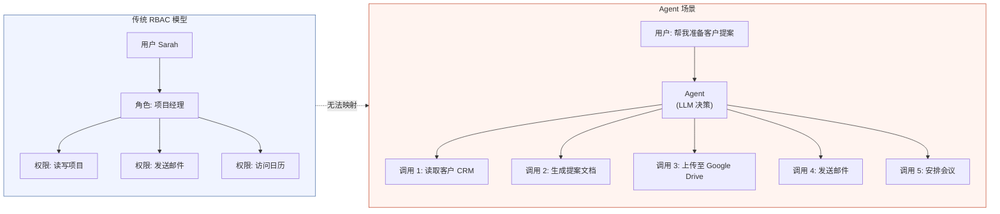
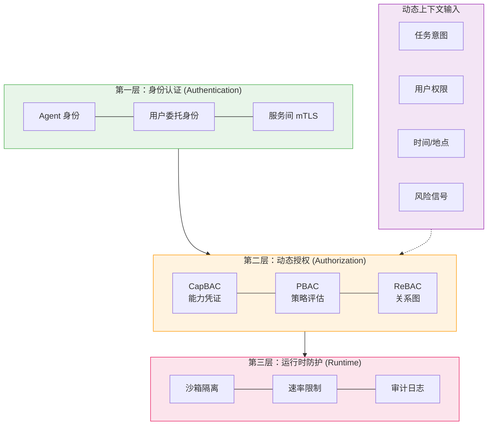

# Agent 工具权限模型：从 RBAC 到动态授权的范式迁移

> **作者**: Probe · **日期**: 2026-03-18 · **类型**: 深度分析

---

## Executive Summary

1. **传统 RBAC 在 Agent 场景系统性失灵**：RBAC 基于「人-角色-权限」三元组，假设主体可预测、会话边界清晰。Agent 的自主决策、多步工具链、跨系统编排使得这三个假设同时崩塌。

2. **Capability-Based（能力凭证）正在成为新基石**：不同于「谁可以做什么」的身份模型，能力模型关注「持有此令牌能做什么」。每次调用附带短期、范围受限、可撤销的能力凭证，天然适配 Agent 的非确定性行为。([Token.security](https://www.token.security/blog/the-shift-from-credentials-to-capabilities-in-ai-access-control-systems))

3. **MCP + OAuth 2.1 正在标准化 Agent 授权协议层**：Anthropic 将 OAuth 2.1 + PKCE 引入 MCP 规范，让 Agent 工具调用有了行业级的授权框架。这是 2025-2026 年最重要的基础设施进展。([NuGuard](https://nuguard.ai/blog/oauth-mcp))

4. **「人机共签」是中间态：Token Vault + 即时审批**：Okta/Auth0 提出的 Token Vault 模式让 Agent 持有短期代理令牌，用户通过 CIBA（Client-Initiated Backchannel Authentication）审批关键操作，兼顾自主性与可控性。([Okta 白皮书](https://www.okta.com/sites/default/files/2026-02/securing-ai-agents.pdf))

5. **范式迁移的本质：从静态策略到动态策略上下文**：Agent 权限不是「配一次就好」，而是需要在每次工具调用时根据任务上下文、用户意图、实时风险信号动态评估。([CSA](https://cloudsecurityalliance.org/blog/2025/03/11/agentic-ai-identity-management-approach))

---

## 1. 为什么传统 RBAC 在 Agent 场景失灵

### 1.1 RBAC 的三个隐含假设

传统 RBAC 模型自 1992 年 NIST 提出以来，成功服务于企业 IT 系统数十年。但它依赖三个隐含假设：

| RBAC 假设 | 在 Agent 场景是否成立 |
|-----------|---------------------|
| 主体行为可预测（人按流程操作） | ❌ Agent 行为由 LLM 决策，同一 prompt 可能产生不同工具调用序列 |
| 会话边界清晰（登录-操作-登出） | ❌ Agent 可能持续运行数小时，跨越多个系统和用户意图 |
| 角色绑定到固定职责 | ❌ 同一个 Agent 在不同任务中需要完全不同的权限集 |

### 1.2 Agent 场景的具体失灵点

**问题一：权限粒度灾难**

Agent 调用工具的粒度是单次函数调用（如 `send_email(to, subject, body)`），而 RBAC 的粒度是角色级别（如 `邮件管理员`）。给 Agent 分配「邮件管理员」角色意味着它能删除所有邮件、修改所有设置——这在任务只需发送一封邮件时是荒谬的过度授权。

**问题二：自主决策链的权限继承**

Agent 的典型行为是一个用户 prompt 触发 5-10 个工具调用链。如果第一步是「读取用户数据」，第二步「分析数据」，第三步「发送报告给经理」，RBAC 需要为 Agent 预先分配这三个系统的所有权限。但 Agent 的决策链条是 LLM 运行时生成的，不可能预知。

**问题三：委托身份的模糊性**

Agent 是「以用户身份操作」还是「以自己身份操作」？RBAC 没有「委托（delegation）」的概念。当 Agent 以 Sarah 的名义发送邮件时，邮件系统看到的是 Agent 的 API key 还是 Sarah 的 OAuth token？这直接影响审计、撤销和责任归属。



> **图 1：RBAC 的静态角色模型无法映射到 Agent 的动态工具调用链**

---

## 2. 新范式的全景图

### 2.1 四种新兴模型

| 模型 | 核心思想 | 代表实现 | 适用场景 |
|------|---------|---------|---------|
| **Capability-Based (CapBAC)** | 持有令牌即有权限，令牌可限定范围、可撤销 | DIF 的 ZTAuth*, Token Security | 跨系统 Agent、去中心化场景 |
| **Policy-Based + Context (PBAC)** | 每次调用评估策略：谁+做什么+什么条件下 | Cerbos, OPA (Open Policy Agent) | 企业级精细授权 |
| **Token Vault + Delegation** | Agent 持短期代理令牌，真实凭证在 Vault 中 | Okta/Auth0 Token Vault, WorkOS | 企业 SaaS 集成、合规场景 |
| **MCP Native Auth** | OAuth 2.1 + PKCE 内建于工具协议 | MCP 规范 2025+, Cloudflare Workers | MCP 工具生态、远程 MCP 服务器 |

### 2.2 从「身份为中心」到「能力为中心」

传统 RBAC 的核心问题是「以身份为中心」——先回答「你是谁」，再回答「你能做什么」。但 Agent 场景要求反过来：先回答「这个操作需要什么」，再检查「当前持有的凭证是否足够」。

这就是 Capability-Based Access Control (CapBAC) 的核心转变。正如 Token Security 的研究指出：

> "An AI agent shouldn't have 'Database Access.' It should have a capability to 'Read Row 45 in Table Users.' Once that task is done, the capability is consumed and becomes invalid."
>
> — [The Shift From Credentials to Capabilities in AI Access Control Systems](https://www.token.security/blog/the-shift-from-credentials-to-capabilities-in-ai-access-control-systems)

### 2.3 混合模型：三层授权架构

实际系统中，单一模型往往不够。当前业界趋向「三层混合」架构：



> **图 2：三层授权架构 + 动态上下文输入**

**授权决策的伪代码示例**（基于 Cerbos 的 PBAC 模型）：

```
IF agent.purpose = "meeting_scheduler"
AND user.has_attribute("calendar_delegation_approved")
AND relationship_exists(user, "member", "scheduling_team")
AND resource.classification <= user.clearance_level
AND environment.time IN business_hours
THEN grant_capability(calendar.read, calendar.write)
WITH obligation(audit_log.record(agent_id, action, timestamp))
```

---

## 3. 各框架的授权实践

### 3.1 MCP (Model Context Protocol) + OAuth 2.1

**背景**：MCP 是 Anthropic 在 2024 年底推出的开放协议，定义了 Agent（Client）与工具提供方（Server）之间的通信标准。2025 年 3 月，OAuth 2.1 + PKCE 被正式纳入 MCP 规范。

**关键进展**：
- Claude Code 和 Messages API 原生支持 OAuth bearer token 访问远程 MCP 服务器
- Cloudflare Workers 提供 MCP OAuth Provider 和 Dynamic Client Registration (DCR)
- SaaS 服务商开始以 OAuth 保护的 MCP Server 替代传统 API Key 模式

**授权模式**：
1. Agent 向 MCP Server 发起连接
2. MCP Server 返回 OAuth 授权端点
3. Agent 引导用户完成 OAuth 流程（PKCE）
4. 获得短期 access token，附带 scopes
5. 每次工具调用携带 token，Server 验证 scope

**局限**：当前 MCP OAuth 主要解决「连接时授权」，对「每次调用级别的细粒度控制」仍依赖 Server 端实现。

**参考来源**：
- [MCP Authorization (OAuth 2.1)](https://modelcontextprotocol.io/specification/2025-03-26/basic/authorization) (2025-03)
- [NuGuard: Anthropic Adds OAuth to MCP](https://nuguard.ai/blog/oauth-mcp) (2025)
- [Cloudflare: Build & Deploy Remote MCP Servers](https://blog.cloudflare.com/) (2025-03)

### 3.2 Google ADK + A2A Protocol

**背景**：Google 的 Agent Development Kit (ADK) 支持 Agent2Agent (A2A) 协议，用于多 Agent 系统间的协作。

**授权特点**：
- Agent Card 描述 Agent 的能力集（类似 Service Mesh 中的 Service Registry）
- A2A Server 暴露 Agent 的工具给远程 Agent
- 工具列表是显式声明的：`tools` 字段声明「此 Agent 有权使用哪些工具」
- 跨框架互操作：ADK 构建的 Agent 可与非 ADK Agent 通过 A2A 通信

**局限**：A2A 更关注通信协议标准化，授权层相对轻量，依赖实现者自行集成 OAuth/安全层。

**参考来源**：
- [Google ADK: A2A Protocol](https://google.github.io/adk-docs/a2a/) (2025)

### 3.3 Microsoft Agent Framework (Semantic Kernel + AutoGen)

**背景**：2025 年微软将 Semantic Kernel 和 AutoGen 合并为统一的 Microsoft Agent Framework，支持 Python 和 .NET。

**授权特点**：
- Semantic Kernel 原生集成 Azure RBAC 和 Entra ID
- AutoGen 支持多 Agent 间的「人机共签」模式——Agent 提出操作，人类审核后执行
- Process Framework 支持确定性业务流程编排，每个节点可配置权限边界
- 集成 Microsoft.Extensions.AI，统一的安全基座

**参考来源**：
- [Semantic Kernel Roadmap H1 2025](https://devblogs.microsoft.com/agent-framework/semantic-kernel-roadmap-h1-2025-accelerating-agents-processes-and-integration/) (2025-02)
- [Visual Studio Magazine: Semantic Kernel + AutoGen](https://visualstudiomagazine.com/articles/2025/10/01/semantic-kernel-autogen--open-source-microsoft-agent-framework.aspx) (2025-10)

### 3.4 Okta/Auth0: Token Vault + CIBA 审批

**背景**：Okta 2026 年白皮书提出了企业级 Agent 授权的完整方案。

**核心设计**：
1. **Token Vault**：Agent 不直接持有 OAuth token，而是从 Vault 请求短期代理令牌
2. **CIBA (Client-Initiated Backchannel Authentication)**：关键操作触发用户审批推送，用户在手机上确认
3. **Token 范围隔离**：Google Drive token ≠ Gmail token ≠ Calendar token，每个系统独立令牌
4. **完整审计链**：Agent 身份 → Token 交换 → 资源访问 → 审批决策，全链路日志

**场景示例**（来自白皮书）：

```
Agent 需要: 上传提案 → 发送邮件 → 安排会议
            ↓              ↓           ↓
Token Vault: GDrive token  Gmail token  Calendar token
            ↓              ↓           ↓
   令牌范围: 仅上传到指定路径  仅从 Sarah 账户发  仅读写 Sarah 日历
```

**参考来源**：
- [Okta: Securing AI Agents From Development to Enterprise Scale](https://www.okta.com/sites/default/files/2026-02/securing-ai-agents.pdf) (2026-02)
- [WorkOS: AI Agent Access Control](https://workos.com/blog/ai-agent-access-control) (2025)

### 3.5 OpenClaw: Tool Policy + Agent 隔离

**背景**：OpenClaw 是开源的 AI Agent 平台，通过配置文件定义 Agent 的工具访问策略。

**授权特点**：
- 每个 Agent 独立 workspace + 独立工具配置
- `SOUL.md` 定义 Agent 行为约束（如「永远不执行 shell 命令」）
- 工具列表通过 `config.yaml` 显式声明，未声明的工具不可用
- 社区提出的功能需求：分层 Agent 权限 + 沙箱工具策略

**参考来源**：
- [OpenClaw Issue #5641: Tiered Agent Permissions](https://github.com/openclaw/openclaw/issues/5641) (2025)

---

## 4. 动态授权的核心设计模式

### 4.1 即时 (Just-In-Time) 授权

不是预先分配所有权限，而是在 Agent 需要时动态获取：

```
传统模式: Agent 启动时获取全部权限 → 执行任务 → 会话结束时释放
JIT 模式: Agent 提出权限请求 → 策略引擎评估 → 签发短期能力凭证 → 执行 → 凭证自动过期
```

### 4.2 能力衰减 (Capability Decay)

能力凭证的有效期与任务绑定，而非时间：

- **任务级衰减**：凭证在任务完成时自动撤销
- **步骤级衰减**：多步工作流中，上一步的凭证不自动传递到下一步
- **风险级衰减**：检测到异常行为时，主动缩短凭证有效期或触发审批

### 4.3 人机共签 (Human-in-the-Loop Sign)

不完全信任 Agent 的自主决策，关键操作要求人工确认：

| 风险级别 | 操作示例 | 授权策略 |
|---------|---------|---------|
| 低 | 读取数据、搜索信息 | 自动授权 |
| 中 | 发送内部邮件、创建日程 | 自动授权 + 审计 |
| 高 | 发送外部邮件、修改权限 | CIBA 人工审批 |
| 极高 | 删除数据、财务操作 | 多人审批 + 二次确认 |

---

## 5. OpenID Foundation 的行业倡议

2025 年 10 月，OpenID Foundation 发布了《Identity Management for Agentic AI》白皮书，提出了 Agent 身份管理的标准化框架：

**核心建议**：
- 使用 OAuth 2.1 作为 Agent 认证和授权的基础框架
- 结合 MCP 协议的工具描述标准
- 跨信任域场景需要新的协议扩展
- 异步和高度自主的 Agent 需要额外的安全机制

**关键发现**：
> "Existing OAuth 2.1 frameworks, when used with AI agents, work well within single trust domains with synchronous agent operations, but may fall short in scenarios that are cross-domain, highly autonomous, or asynchronous."
>
> — [OpenID Foundation: Identity Management for Agentic AI](https://openid.net/wp-content/uploads/2025/10/Identity-Management-for-Agentic-AI.pdf) (2025-10)

---

## 6. 实施路线图：从 RBAC 到动态授权

对于正在构建 Agent 系统的团队，以下是推荐的迁移路径：

### 第一阶段：最小可行安全（1-2 周）

- 显式声明 Agent 可用的工具列表（白名单）
- 所有工具调用记录审计日志
- 为 Agent 创建独立的服务账户（不共享人类用户凭据）

### 第二阶段：引入委托模型（2-4 周）

- 实现 OAuth 2.0 Token Exchange（RFC 8693）
- Agent 持短期 token，范围受限于当前任务
- 区分 Agent 身份和用户委托身份

### 第三阶段：动态策略引擎（4-8 周）

- 引入 PBAC 策略引擎（如 Cerbos/OPA）
- 基于上下文（时间、地点、风险）动态调整权限
- 实现 CIBA 人机共签流程

### 第四阶段：完整能力模型（8-12 周）

- 能力凭证系统（CapBAC）
- 任务级自动过期和撤销
- 跨系统统一授权平面

---

## 7. 团队观点

### 观点一：RBAC 没有「死亡」，而是下沉为基础设施

RBAC 仍然是组织层面管理「哪个 Agent 角色可以访问哪些系统」的有效工具。但它应该作为授权栈的最底层，之上必须叠加动态层。不应该让 RBAC 直接面对 Agent 的运行时决策。

### 观点二：MCP 是 2026 年的「HTTP 时刻」

就像 HTTP 协议标准化了 Web 通信但把安全留给 TLS 一样，MCP 标准化了 Agent-工具通信并把授权留给 OAuth 2.1。这是一个正确的架构分层。团队应该优先采用支持 MCP OAuth 的工具链。

### 观点三：「零信任」对 Agent 比对人更重要

人类操作者有直觉、有合规培训、有物理存在。Agent 没有这些安全网。Agent 系统应该默认采用零信任原则：每次工具调用都验证、每次数据访问都审计、每个凭证都短期有效。

### 观点四：审计日志是你的安全保险单

当事故发生时（Agent 发了不该发的邮件），唯一能帮助你复盘和追责的是完整的审计日志。这比任何预防性控制都重要。日志应该包含：Agent ID、调用者身份、操作类型、时间戳、审批状态。

---

## 8. 可操作建议

| 优先级 | 行动项 | 适用阶段 |
|-------|-------|---------|
| 🔴 P0 | 立即隔离 Agent 服务账户，绝不共享人类 OAuth token | 立即 |
| 🔴 P0 | 所有工具调用记录不可篡改的审计日志 | 立即 |
| 🟠 P1 | 评估现有 Agent 框架是否支持 MCP OAuth | 1 周内 |
| 🟠 P1 | 定义高风险操作清单，引入 CIBA 审批 | 2 周内 |
| 🟡 P2 | 引入 PBAC 策略引擎替代硬编码权限检查 | 1 个月内 |
| 🟡 P2 | 实现 Token Vault 模式，Agent 不直接持有用户凭证 | 2 个月内 |
| 🟢 P3 | 探索 CapBAC 能力凭证系统 | 3-6 个月内 |
| 🟢 P3 | 参与 DIF Trusted AI Agents WG 或 OpenID 标准化讨论 | 持续 |

---

## 参考来源

| 来源 | 链接 | 日期 |
|------|------|------|
| Cerbos: MCP Permissions | [cerbos.dev/blog/mcp-permissions](https://www.cerbos.dev/blog/mcp-permissions-securing-ai-agent-access-to-tools) | 2025 |
| Token Security: Credentials to Capabilities | [token.security/blog](https://www.token.security/blog/the-shift-from-credentials-to-capabilities-in-ai-access-control-systems) | 2025 |
| NuGuard: OAuth to MCP | [nuguard.ai/blog/oauth-mcp](https://nuguard.ai/blog/oauth-mcp) | 2025 |
| Okta: Securing AI Agents (白皮书) | [okta.com (PDF)](https://www.okta.com/sites/default/files/2026-02/securing-ai-agents.pdf) | 2026-02 |
| OpenID: Identity Management for Agentic AI | [openid.net (PDF)](https://openid.net/wp-content/uploads/2025/10/Identity-Management-for-Agentic-AI.pdf) | 2025-10 |
| CSA: Agentic AI Identity Management | [cloudsecurityalliance.org](https://cloudsecurityalliance.org/blog/2025/03/11/agentic-ai-identity-management-approach) | 2025-03 |
| WorkOS: AI Agent Access Control | [workos.com/blog](https://workos.com/blog/ai-agent-access-control) | 2025 |
| DIF: Authorising Autonomous Agents | [blog.identity.foundation](https://blog.identity.foundation/building-ai-trust-at-scale-4/) | 2025 |
| Medium: Authorization in the Age of AI Agents | [nwosunneoma.medium.com](https://nwosunneoma.medium.com/authorization-in-the-age-of-ai-agents-beyond-all-or-nothing-access-control-747d58adb8c1) | 2025 |
| OpenClaw Issue #5641 | [github.com/openclaw](https://github.com/openclaw/openclaw/issues/5641) | 2025 |
| Google ADK: A2A Protocol | [google.github.io/adk-docs](https://google.github.io/adk-docs/a2a/) | 2025 |
| Semantic Kernel Roadmap H1 2025 | [devblogs.microsoft.com](https://devblogs.microsoft.com/agent-framework/semantic-kernel-roadmap-h1-2025-accelerating-agents-processes-and-integration/) | 2025-02 |
| Sendbird: RBAC for AI Agents | [sendbird.com/blog](https://sendbird.com/blog/ai-agent-role-based-access-control) | 2025 |

---

*本报告由 Probe 研究生成，截至 2026 年 3 月 18 日。Agent 权限模型领域正在快速演进，建议每季度回顾更新。*
