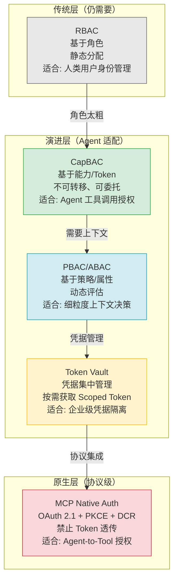

# AI Agent 工具权限模型：为什么 RBAC 失灵，接下来怎么走

> **作者**: 探针团队  
> **发布日期**: 2026-03-18  
> **状态**: 已完成

---

## 1. Executive Summary

**核心结论：**

1. **RBAC 在 Agent 场景中已结构性失灵。** 传统基于角色的访问控制假设"一个实体 = 一个角色"，但 AI Agent 以机器速度执行动态、多步骤任务，静态角色无法覆盖工具调用的细粒度上下文需求，必然导致角色膨胀与权限过度授予。

2. **Token Vault 正成为企业级 Agent 安全的基座模式。** Agent 不再直接持有凭据，而是按需从受控 Vault 获取 Scoped Token，实现凭据与 Agent 身份的完全隔离。Okta/Auth0 和 HashiCorp 已在此方向落地产品。

3. **MCP 与 A2A 两大协议代表两种互补的授权范式。** MCP 侧重 Agent-to-Tool 的细粒度工具授权（OAuth 2.1 + PKCE + 禁止 token 透传），A2A 侧重 Agent-to-Agent 的身份链传递（OBO 模式 + Agent Cards），两者共同构成多 Agent 系统的安全骨架。

4. **动态授权是唯一可行方向。** JIT（Just-In-Time）授权、能力衰减（Capability Decay）、人机共签（Co-sign）等模式正在从实验室走向生产，它们的共同点是：权限不再是一个静态分配，而是随任务上下文实时变化的动态决策。

5. **沙箱化 + 策略即代码 = 现代 Agent 权限的最小可行架构。** OpenClaw 的 per-agent sandbox + tool allow/deny + Docker 隔离，以及 Cerbos 的 Policy-as-Code 方案，代表了当前工程实践的前沿——但所有框架仍缺乏统一的动态授权层。

---

## 2. RBAC 的三个隐含假设及其在 Agent 场景的失灵

RBAC（Role-Based Access Control）是过去 20 年企业安全的基石。它之所以有效，依赖于三个在人类用户场景下成立的核心假设。然而在 AI Agent 场景中，这三个假设全部破裂。

### 假设一：实体拥有稳定的身份和可预测的行为

| | 人类用户 | AI Agent |
|--|---------|----------|
| **身份稳定性** | 一个人登录 → 一个 session → 一个角色 | 同一 Agent 在不同任务链中需要不同能力组合 |
| **行为可预测性** | 用户按 UI 流程操作，路径有限 | Agent 以自然语言驱动，执行路径动态生成 |
| **速度** | 人类操作间隔：秒级到分钟级 | Agent 工具调用：毫秒级，一秒钟可执行数十次 |

**失灵表现：** 人类的一个角色（如 "PM"）对应一组相对稳定的操作集合。但同一个 Agent 在"分析用户数据"任务中需要读权限，在"生成报告"任务中需要写权限，在"部署模型"任务中需要执行权限。为每个组合创建角色，即"角色膨胀"（Role Explosion），在实践中不可维护。

> *"RBAC 适用于人类用户（一个角色一组权限），但不适用于自主 Agent 的动态工作流。"*  
> — Nizam Udheenti, [Role-Based Access Control Isn't Enough for Autonomous AI Agents](https://nizamudheenti.medium.com/role-based-access-control-isnt-enough-for-autonomous-ai-agents-here-s-the-simple-reason-why-dfe49c86b536)

### 假设二：权限决策可以离线完成（分配时决定）

RBAC 的授权逻辑是：用户登录时确定角色 → 角色绑定权限 → 所有操作共享同一权限集。这是一个**"分配时决策"（Assignment-time Decision）**模型。

**失灵表现：** Agent 的每一步 tool call 都可能因为前一步的输出而需要不同的权限。例如：
- Agent 查询数据库 → 获得结果 A → 需要写入缓存（需要写权限）
- Agent 查询数据库 → 获得结果 B → 需要调用外部 API（需要网络权限）

同一个 Agent、同一个 session，不同执行路径需要不同权限。静态角色无法在"分配时"预见所有路径。

> *"静态决策无法适应 Agent 的多步骤动态执行路径。"*  
> — Nizam Udheenti, [RBAC Isn't Enough for Autonomous AI Agents](https://nizamudheenti.medium.com/role-based-access-control-isnt-enough-for-autonomous-ai-agents-here-s-the-simple-reason-why-dfe49c86b536)

### 假设三：权限粒度可以粗放（按功能模块划分）

RBAC 传统上按功能模块分配权限：`read:users`、`write:orders`、`admin:system`。这种粒度对人类用户足够——因为人类通过 UI 交互，UI 本身就是一层天然的权限过滤器。

**失灵表现：** Agent 直接调用 API/Tool，跳过了 UI 过滤层。一个 "write:orders" 权限可以让 Agent 创建任意订单、修改任意金额、删除任意记录。Agent 的 prompt injection 攻击可以利用这种粗粒度权限造成灾难性后果。

> *"AI Agents 以机器速度运行、行为不可预测、易被文本注入影响，粗粒度的角色模型无法应对。"*  
> — Oso, [Why RBAC is Not Enough for AI Agents](https://www.osohq.com/learn/why-rbac-is-not-enough-for-ai-agents)

### 失灵后果量化

```
传统 RBAC：10 个角色 × 50 个权限 = 500 个配置项
Agent RBAC：10 个 Agent × 20 种任务路径 × 5 步 = 1000+ 个角色组合
                    ↑ 角色膨胀的根源
```

这不是"RBAC 不够好"的问题，而是**RBAC 的数学基础与 Agent 的执行模型根本不兼容**。

---

## 3. 新兴权限模型全景图

面对 RBAC 的结构性失灵，业界正沿着四条路径演化。它们不是替代关系，而是**互补分层**，共同构成现代 Agent 权限体系。



### 3.1 CapBAC（Capability-Based Access Control）

**核心思想：** 权限 = 一个不可伪造的 Token（能力对象），持有 Token 即持有权限。与 RBAC 的"你是什么角色"不同，CapBAC 回答的是"你持有什么能力"。

**关键特性：**
- **不可转移（Non-transferable）：** 能力 Token 绑定到特定 Agent 身份，不能转借
- **可委托（Delegatable）：** 主能力可以派生子能力，实现权限的向下分配
- **细粒度：** 一个 Token 可以精确限定操作、资源、时间窗口

**Agent 场景适用性：** ⭐⭐⭐⭐⭐  
CapBAC 天然适配 Agent 的按需权限获取模式：Agent 为每个任务链请求一组能力 Token，任务完成后 Token 自动过期。

### 3.2 PBAC/ABAC（Policy-Based / Attribute-Based Access Control）

**核心思想：** 权限不是预先分配的，而是由策略引擎在运行时动态计算的。决策输入 = 主体属性 + 客体属性 + 动作 + 上下文。

**关键特性：**
- **策略即代码：** 授权规则可版本控制、测试、审计
- **上下文感知：** IP 地址、时间、威胁情报、请求频率等动态属性可参与决策
- **声明式：** "仅允许 Agent 为自己的租户、仅对非管理员项目执行 tickets.create"

**Agent 场景适用性：** ⭐⭐⭐⭐⭐  
ABAC 是 RBAC 的进化：从"这个角色能做什么"到"在这些条件下这个 Agent 能对这个资源做什么"。

> *"ABAC 是 RBAC 的进化：从'这个角色能做什么'到'在这些条件下这个 Agent 能对这个资源做什么'。"*  
> — Prefactor, [Ultimate Guide to ABAC for MCP Authentication](https://prefactor.tech/blog/ultimate-guide-to-abac-for-mcp-authentication)

### 3.3 Token Vault

**核心思想：** Agent 不直接持有任何凭据。所有 OAuth Token、API Key、证书都存储在集中化的 Vault 中，Agent 按需请求 Scoped Token，使用后立即释放。

**关键特性：**
- **凭据隔离：** Agent 代码/日志/内存中不存储任何秘密
- **自动刷新：** Token 生命周期由 Vault 管理，无需 Agent 介入
- **审计链：** Agent 认证 → Token 请求 → 资源访问，全链路可追溯

**Agent 场景适用性：** ⭐⭐⭐⭐  
Token Vault 是企业级 Agent 部署的安全基座，但增加了架构复杂度和延迟。

> *"Agent 从 Auth0 Token Vault 按需获取 scoped token，不直接接触 OAuth token。所有 token 自动刷新，凭据不存储在 agent 代码或日志中。"*  
> — Okta, [Securing AI Agents From Development to Enterprise Scale](https://www.okta.com/sites/default/files/2025-12/Securing%20AI%20Agents.pdf)

### 3.4 MCP Native Auth

**核心思想：** 在 MCP 协议层内置标准化的 OAuth 2.1 授权机制，让 Agent-to-Tool 的认证授权成为协议强制行为，而非可选附加。

**关键特性：**
- **OAuth 2.1 + PKCE：** 公共客户端安全授权
- **Dynamic Client Registration (DCR)：** Agent 自动注册，无需人工配置
- **禁止 Token 透传：** MCP Server 必须直接向 Authorization Server 验证 Token
- **每请求验证：** 每次 tool call 都是独立的授权决策点

**Agent 场景适用性：** ⭐⭐⭐⭐  
MCP Native Auth 是协议级安全的基础层，但它只覆盖 Agent-to-Tool 场景，Agent-to-Agent 需要 A2A 协议补充。

> *"MCP 授权规范引入 OAuth 2.1 + PKCE 模型作为 AI 访问控制的标准化第一步。"*  
> — Aembit, [MCP, OAuth 2.1, PKCE, and the Future of AI Authorization](https://aembit.io/blog/mcp-oauth-2-1-pkce-and-the-future-of-ai-authorization/)

---

## 4. 各框架授权实践对比

不同框架和协议选择了不同的授权策略组合。下图对比四大主流方案的授权架构：

```mermaid
graph LR
    subgraph "MCP + OAuth 2.1"
        MCP_User["User/Client"] -->|OAuth 2.1 + PKCE| MCP_AS["Authorization Server"]
        MCP_AS -->|Access Token| MCP_Agent["AI Agent"]
        MCP_Agent -->|"Tool Call + Token"| MCP_Server["MCP Server"]
        MCP_Server -->|"直接验证 Token<br/>禁止透传"| MCP_AS
        MCP_AS -.->|"DCR<br/>自动注册"| MCP_Agent
    end

    subgraph "Google A2A"
        A2A_User["User"] -->|OAuth 2.0| A2A_IdP["Identity Provider"]
        A2A_IdP -->|"OBO Token"| A2A_Agent1["Agent A"]
        A2A_Agent1 -->|"OBO Token<br/>+ Agent Card"| A2A_Agent2["Agent B"]
        A2A_Agent2 -->|mTLS / API Key| A2A_Service["Target Service"]
        A2A_Agent1 -.->|"Agent Cards<br/>能力发现"| A2A_Agent2
    end

    subgraph "Microsoft (Okta/Entra)"
        MS_User["User"] -->|CIBA Flow| MS_Entra["Entra ID"]
        MS_Entra -->|"Agent Token"| MS_Agent["AI Agent"]
        MS_Agent -->|"Token Exchange<br/>(OBO)"| MS_Vault["Token Vault"]
        MS_Vault -->|"Scoped Token"| MS_Api["Protected API"]
        MS_Vault -.->|"自动刷新<br/>审计链"| MS_Entra
    end

    subgraph "OpenClaw"
        OC_User["User"] -->|Session Auth| OC_GW["Gateway"]
        OC_GW -->|"per-agent<br/>sandbox config"| OC_Agent1["Agent A"]
        OC_GW -->|"per-agent<br/>sandbox config"| OC_Agent2["Agent B"]
        OC_Agent1 -->|"allow/deny list<br/>+ Docker 隔离"| OC_Tool["Tool/Exec"]
        OC_Agent2 -->|"profile-based<br/>tool groups"| OC_Tool
    end

    style MCP_User fill:#e3f2fd,stroke:#1565c0
    style A2A_User fill:#e8f5e9,stroke:#2e7d32
    style MS_User fill:#fff3e0,stroke:#e65100
    style OC_User fill:#fce4ec,stroke:#c62828
```



### 对比矩阵

| 维度 | MCP + OAuth 2.1 | Google A2A | Microsoft/Okta | OpenClaw |
|------|-----------------|------------|----------------|----------|
| **核心场景** | Agent ↔ Tool | Agent ↔ Agent | 企业级 Agent 全栈 | Agent 运行时隔离 |
| **认证协议** | OAuth 2.1 + PKCE | OAuth 2.0 + mTLS + API Keys | OAuth 2.0 + CIBA | Session-based |
| **授权粒度** | 每 Tool Call | 每 Agent 交互 | 每 Token 请求 | 每 Agent 工具集 |
| **动态性** | DCR 自动注册 | Agent Cards 发现 | Token Vault 按需获取 | 静态配置 |
| **用户身份传递** | 通过 Token | OBO 模式 | OBO Exchange | Session 绑定 |
| **Token 管理** | 禁止透传 | OBO 传递 | Vault 集中管理 | 不涉及 |
| **沙箱化** | 无 | 无 | 无 | Docker + allow/deny |
| **策略即代码** | 无原生支持 | 无原生支持 | 无原生支持 | 无原生支持 |
| **成熟度** | 协议标准（2025） | 协议标准（2025） | 产品级（2025） | 产品级（2025） |

### 关键发现

1. **没有一个方案覆盖了所有维度。** MCP 擅长 Agent-Tool，A2A 擅长 Agent-Agent，OpenClaw 擅长运行时隔离，Okta 擅长企业凭据管理。真正的安全架构需要组合使用。

2. **所有方案都缺乏策略即代码的原生支持。** 动态授权（ABAC/PBAC）在研究中被反复强调，但各框架的实际实现仍以静态配置或简单 allow/deny 为主。

3. **"禁止 Token 透传"是 MCP 的关键安全创新。** 传统 API 网关中，Token 透传是常见模式，但在 Agent 场景中这意味着一个被攻破的 Agent 可以利用透传的 Token 访问未授权资源。

---

## 5. 动态授权核心设计模式

静态权限模型（RBAC/ACL）是"预分配"逻辑——在操作发生前决定你能不能做。Agent 场景需要的是"运行时决策"——在操作发生的那一刻，根据实时上下文决定是否放行。

### 5.1 JIT 授权（Just-In-Time Authorization）

**定义：** 权限不在启动时分配，而是在每次 tool call 时动态计算和授予，任务完成后立即撤销。

```
传统模式: Agent 启动 → 分配角色 → 执行 100 次 tool call（同一权限集）
JIT 模式:  Agent 启动 → 无权限 → 第 1 次 call → 策略引擎评估 → 授予临时权限 → 执行 → 撤销
                                                       ↑ 每次独立决策
```

**实现要点：**
- 策略引擎作为独立服务部署，每次 tool call 前调用
- 临时权限绑定到单次操作，带 TTL（Time-To-Live）
- 审计日志记录每次权限授予的决策依据

**生产案例：**
- Oso 提供 Agent 权限持续自适应：自动收紧访问、推荐降权或临时授权
- Cerbos 的 MCP Server 集成：每次 tool call 查询 "Can user X do action Y on resource Z?"
- AgentGuardian 框架：为每次 tool invocation 创建输入验证链

> *"需要根据任务上下文、数据访问范围、代表用户身份实时调整权限的动态授权。"*  
> — Oso, [Why RBAC is Not Enough for AI Agents](https://www.osohq.com/learn/why-rbac-is-not-enough-for-ai-agents)

### 5.2 能力衰减（Capability Decay）

**定义：** 权限不是一次性授予然后保持不变，而是随着时间或使用次数逐步衰减。初始权限较高，随着 Agent 执行更多操作，权限自动收紧。

```
时间线:  ──────────────────────────────────────►
权限:    ████████████ ████████ ███ ██ █
         [任务启动]   [10次call] [20次] [30次] [完成]
         
          高权限期    正常期    警戒期   受限期   无权限
```

**设计动机：**
- 防止 Agent 被 prompt injection 后持续高权限运行
- 模拟人类"越用越谨慎"的安全直觉
- 降低长运行 Agent 的累积风险

**实现方式：**
- 初始权限 Token 包含较大的 scope 和较长的 TTL
- 每次 tool call 后，策略引擎评估是否缩减 scope 或缩短剩余 TTL
- 异常行为（高频调用、异常参数）触发加速衰减

### 5.3 人机共签（Human-in-the-Loop Co-sign）

**定义：** 高风险操作需要 Agent 和人类用户的双重授权才能执行。Agent 提出操作请求，人类在独立通道中确认或拒绝。

```
Agent: "我准备执行 delete_production_database()" 
         │
         ▼
  [策略引擎判断: 高风险操作 → 需要 Co-sign]
         │
         ▼
  [向用户发送确认请求] → 用户: "✅ 确认" 或 "❌ 拒绝"
         │
         ▼
  [双签齐全 → 执行] 或 [任一方拒绝 → 中止]
```

**风险分级参考（来自 OWASP AI 安全指南）：**

| 风险等级 | 操作类型 | 授权要求 |
|---------|---------|---------|
| 低 | 只读查询、公开数据获取 | Agent 自主执行 |
| 中 | 数据写入、配置修改 | 策略引擎自动审批 |
| 高 | 生产环境变更、敏感数据访问 | 人机共签 |
| 极高 | 删除操作、权限变更 | 人工审批 + 多人会签 |

**与 Okta CIBA Flow 的关系：**  
Okta 的 CIBA（Client-Initiated Backchannel Authentication）是人机共签的协议化实现——Agent 发起操作请求后，系统通过独立通道（推送通知、短信等）向用户请求确认，不影响 Agent 的执行流。

> *"CIBA Flow：非阻塞、用户友好、安全、可审计。"*  
> — Okta, [Securing AI Agents From Development to Enterprise Scale](https://www.okta.com/sites/default/files/2025-12/Securing%20AI%20Agents.pdf)

---

## 6. 团队观点

以下 4 条观点来自我们主编、探针和调色板团队在实际项目中的经验总结：

### 观点一：不要给 Agent "最大权限然后相信它"

**来自主编：** 我们在早期搭建 Tech-Researcher 团队时，给所有 Agent 子进程分配了完整的文件系统访问权限，因为"这样最简单"。后果是：一个 Agent 的搜索任务出错后，写入了错误的目录，覆盖了另一篇报告的草稿。教训：**最小权限是 Agent 场景的安全底线，不是最佳实践——是前提条件。**

### 观点二：Agent 的权限应该跟任务走，不跟身份走

**来自探针：** 在我们的搜索-写作分离流水线中（见 AGENTS.md E.55），同一个"探针"角色在"搜集员"模式下只需要 web_search 和 write 工具，在"写手"模式下需要 read 和 write 工具。如果按 RBAC 逻辑，我们需要创建"探针-搜集员"和"探针-写手"两个角色。但实际上，这是**同一个 Agent 的两种任务状态**。权限应该绑定到任务上下文，而不是绑定到 Agent 身份。

### 观点三：沙箱是最后一道防线，不是第一道

**来自调色板：** 我们使用 OpenClaw 的 per-agent sandbox 配置来隔离不同的 Agent 任务。但沙箱解决的是"如果 Agent 被攻破了怎么办"的问题，不是"如何让 Agent 安全运行"的问题。真正的安全需要三层防护：① 协议层认证（OAuth/Token）→ ② 策略层授权（ABAC/动态决策）→ ③ 运行层隔离（沙箱/Docker）。**沙箱是安全的最后 20%，不是前 80%。**

### 观点四：审计日志比权限模型更重要

**来自主编+探针联合讨论：** 在调试 Agent 行为时，我们发现最有价值的不是"Agent 有没有权限做这件事"，而是"Agent 为什么决定做这件事"。一个完美的权限模型如果缺乏审计能力，等于在黑箱里运行。**每一条 tool call 都应该记录：谁（Agent ID + 用户 ID）在什么上下文（任务链）做了什么（tool call 参数）结果如何（成功/失败/被拒绝）**。这是事后分析和合规审计的唯一依据。

---

## 7. 可操作建议

以下 8 项建议按优先级排序，从"立即可做"到"长期规划"排列：

### 🔴 P0 — 立即执行

**1. 禁止 Agent 直接持有生产凭据**
- 所有 OAuth Token、API Key 必须通过 Token Vault 管理
- Agent 代码中不得出现硬编码凭据
- 参考方案：Auth0 Token Vault / HashiCorp Vault
- 预计工作量：2-3 天

**2. 为每个 Agent 配置最小权限 sandbox**
- 使用 per-agent tool allow/deny 列表
- 生产环境 Agent 禁止 exec 工具
- 参考：OpenClaw `agents.list[].tools` 配置
- 预计工作量：1 天

### 🟠 P1 — 本周完成

**3. 实施"禁止 Token 透传"策略**
- MCP Server 必须直接向 Authorization Server 验证每个请求的 Token
- 不得将上游 Token 直接转发给下游服务
- 参考：Aembit 的 [MCP Authentication and Authorization Patterns](https://aembit.io/blog/mcp-authentication-and-authorization-patterns/)

**4. 建立 tool call 审计日志标准**
- 每条日志包含：Agent ID、User ID、Tool Name、Input Parameters（脱敏）、Timestamp、Decision（允许/拒绝）、Decision Reason
- 日志集中存储，支持查询和告警
- 作为合规审计的基础数据

**5. 对高风险操作实施人机共签**
- 定义风险分级标准（参考 5.3 节）
- 高风险操作（生产变更/删除/权限修改）触发用户确认
- 确认通道独立于 Agent 执行流（推送通知/邮件）

### 🟡 P2 — 本月完成

**6. 引入策略即代码（Policy-as-Code）层**
- 将授权规则从代码中抽离为独立策略文件
- 支持版本控制、测试、审计
- 参考：Cerbos / Oso / AWS Cedar
- 目标：从"改权限要改代码"进化到"改权限改策略文件"

**7. 实现 JIT 授权基础框架**
- 从"启动时分配权限"进化到"每次 tool call 时动态评估"
- 第一阶段：为每次 tool call 调用策略引擎
- 第二阶段：实现临时 Token 的自动颁发和回收

### 🔵 P3 — 季度目标

**8. 参与 MCP/A2A 协议安全标准演进**
- 关注 MCP Authorization 规范的动态（DCR、PRM）
- 评估 A2A 协议的 OBO 模式在多 Agent 系统中的适用性
- 为开源社区贡献安全最佳实践

---

## 8. 参考来源

1. **Oso** — Why RBAC is Not Enough for AI Agents (2025)  
   https://www.osohq.com/learn/why-rbac-is-not-enough-for-ai-agents

2. **Nizam Udheenti** — Role-Based Access Control Isn't Enough for Autonomous AI Agents (Medium, 2025)  
   https://nizamudheenti.medium.com/role-based-access-control-isnt-enough-for-autonomous-ai-agents-here-s-the-simple-reason-why-dfe49c86b536

3. **Auth0** — Access Control in the Era of AI Agents (2025)  
   https://auth0.com/blog/access-control-in-the-era-of-ai-agents/

4. **Okta** — Securing AI Agents From Development to Enterprise Scale (Whitepaper, 2025-12)  
   https://www.okta.com/sites/default/files/2025-12/Securing%20AI%20Agents.pdf

5. **Aembit** — MCP, OAuth 2.1, PKCE, and the Future of AI Authorization (2025)  
   https://aembit.io/blog/mcp-oauth-2-1-pkce-and-the-future-of-ai-authorization/

6. **Oso** — Authorization for MCP: OAuth 2.1, PRMs, and Best Practices (2025)  
   https://www.osohq.com/learn/authorization-for-ai-agents-mcp-oauth-21

7. **Shane Deconinck** — Understanding A2A: Google's Agent-to-Agent Protocol Explained (2025)  
   https://shanedeconinck.be/explainers/a2a/

8. **Semgrep** — A Security Engineer's Guide to the A2A Protocol (2025)  
   https://semgrep.dev/blog/2025/a-security-engineers-guide-to-the-a2a-protocol

9. **Galileo** — Google's Agent2Agent Protocol Explained for Enterprise AI Teams (2025)  
   https://galileo.ai/blog/google-agent2agent-a2a-protocol-guide

10. **Scalekit** — Token Vault: Why It's Critical for AI Agent Workflows (2025)  
    https://www.scalekit.com/blog/token-vault-ai-agent-workflows

11. **HashiCorp** — Secure AI Agent Authentication Using Vault Dynamic Secrets (2025)  
    https://developer.hashicorp.com/validated-patterns/vault/ai-agent-identity-with-hashicorp-vault

12. **Cerbos** — MCP Permissions: Securing AI Agent Access to Tools (2025)  
    https://www.cerbos.dev/blog/mcp-permissions-securing-ai-agent-access-to-tools

13. **Cerbos** — Dynamic Authorization for AI Agents: Fine-Grained Permissions in MCP Servers (2025)  
    https://www.cerbos.dev/blog/dynamic-authorization-for-ai-agents-guide-to-fine-grained-permissions-mcp-servers

14. **Prefactor** — Ultimate Guide to ABAC for MCP Authentication (2025)  
    https://prefactor.tech/blog/ultimate-guide-to-abac-for-mcp-authentication

15. **arXiv** — AgentGuardian: Learning Access Control Policies to Govern AI Agent Behavior (2026-01)  
    https://arxiv.org/html/2601.10440

16. **OpenClaw GitHub** — Feature: Tiered Agent Permissions with Sandboxed Tool Policies (#5641)  
    https://github.com/openclaw/openclaw/issues/5641

17. **OpenClaw Docs** — Multi-Agent Sandbox & Tools  
    https://docs.openclaw.ai/tools/multi-agent-sandbox-tools

18. **Snyk Labs** — On Ways to Bypass OpenClaw's Security Sandbox  
    https://labs.snyk.io/resources/bypass-openclaw-security-sandbox/

19. **Aembit** — MCP Authentication and Authorization Patterns (2025)  
    https://aembit.io/blog/mcp-authentication-and-authorization-patterns/

---

*本报告基于 2024-2026 年公开资料编写，引用均附真实 URL。AI Agent 安全领域演进极快，建议每季度更新一次关键发现。*
