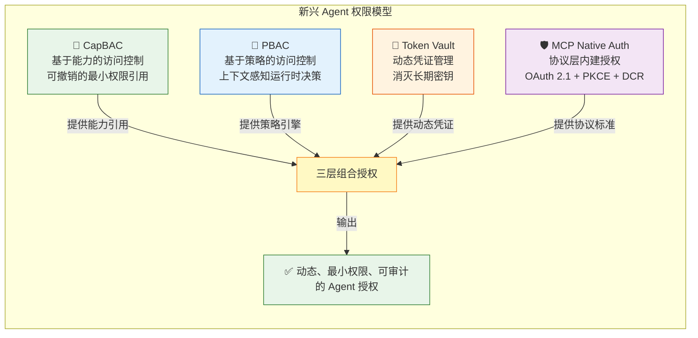
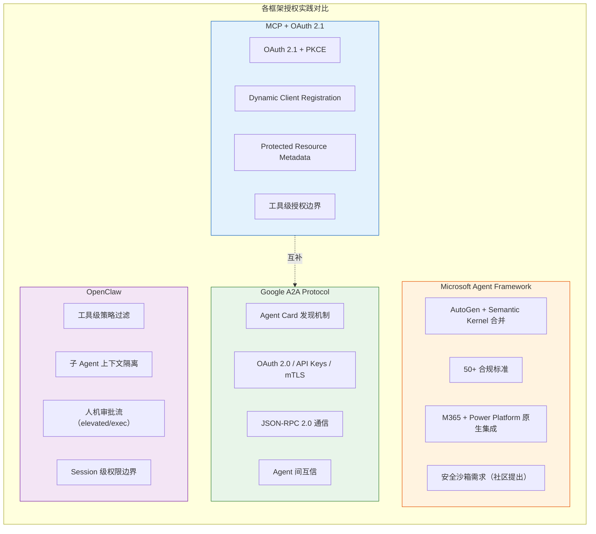

# Agent 工具权限模型：为什么 RBAC 不够用，以及替代方案全景

> 探究方向：AI Agent 以机器速度自主调用工具时，传统角色权限模型为何失效？业界正在探索哪些新范式？
>
> 发布日期：2026-03-18

---

## Executive Summary

1. **RBAC 在 Agent 场景系统性失灵**：静态角色编码无法匹配 Agent 的动态、不可预测、高速执行行为——Agent 不是"另一个用户"，而是一个行为模式完全不同的执行主体。

2. **三大新范式正在成型**：Capability-Based Access Control（CapBAC）提供可撤销的最小权限引用，Policy-Based Access Control（PBAC）实现上下文感知的运行时决策，Token Vault + 动态凭证消灭长期密钥泄露风险。

3. **协议层已开始内建授权**：MCP 规范采用 OAuth 2.1 + PKCE + DCR，Google A2A 协议通过 Agent Card + OAuth 2.0/mTLS 实现 Agent 间互信，两者互补构成"纵向工具调用 + 横向 Agent 通信"的完整授权骨架。

4. **动态授权是核心设计模式**：JIT（Just-In-Time）授权、能力衰减（Capability Decay）、人机共签（Human Co-Sign）三大模式，将权限从"静态分配"转变为"运行时协商"。

5. **落地路径清晰但分阶段**：先做审计日志和最小权限 → 引入 Copilot 模式（Agent 建议 + 人类批准） → 逐步过渡到动态策略引擎，不要一步到位追求全自动。

---

## 一、RBAC 的三个隐含假设及其在 Agent 场景的失灵

Role-Based Access Control（RBAC）是过去 20 年企业权限管理的基石。但它的设计隐含了三个假设——每一个在 Agent 场景下都被打破。

### 假设 1：行为是可预测的

RBAC 的前提是你能预先定义"这个角色需要做什么"，然后分配对应权限。人类用户的行为模式相对稳定：销售看 CRM、工程师部署代码、财务查账单。

**Agent 的失灵**：一个被授予"读取数据库"角色的 Agent，在面对 prompt injection 时可能被诱导执行 `DROP TABLE`。Agent 的行为由 LLM 推理决定，具有不可预测性——你无法用静态角色编码每一步任务行为。

> 用 RBAC 给 Agent 授权，本质上是"用静态角色编码每一步任务行为"，天然不匹配。—— Oso, 2025
>
> 来源：[Why RBAC is Not Enough for AI Agents](https://www.osohq.com/learn/why-rbac-is-not-enough-for-ai-agents)

### 假设 2：主体是单一身份

RBAC 中，一个用户对应一组角色，角色决定权限。即使有服务账号，也是人工创建和管理的。

**Agent 的失灵**：Agent 需要同时代表用户身份访问多个服务（邮箱、日历、CRM、代码仓库），且在不同上下文中需要不同的权限级别。一个静态角色无法覆盖这种"动态范围"需求。更关键的是，Agent 本身也需要一个独立于用户的可验证身份——它既不是用户，也不是传统服务账号。

> 敏感数据可跨多个 Agent 传播而不被发现。RBAC 不追踪跨 Agent 数据传播。—— Nizam Udheen, 2025
>
> 来源：[Role-Based Access Control Isn't Enough for Autonomous AI Agents](https://nizamudheenti.medium.com/role-based-access-control-isnt-enough-for-autonomous-ai-agents-here-s-the-simple-reason-why-dfe49c86b536)

### 假设 3：权限是静态的

RBAC 的权限在分配后通常长期不变，变更需要人工审批流程。

**Agent 的失灵**：Agent 的任务是动态的。一个"会议安排 Agent"在工作时间内需要日历读写权限，但下班后应该自动撤销。这种"基于声明意图，为特定会话动态缩小权限范围"的需求，RBAC 完全无法表达。

> 近 40% 的高管认为实施 Agent 的风险超过收益。真实事故：Agent 删除了整个生产数据库，因为拥有多余的写权限。—— Towards AI, 2025
>
> 来源：[Beyond LangGraph and CrewAI: Governing AI Agents](https://pub.towardsai.net/beyond-langgraph-and-crewai-the-lost-art-of-governing-ai-agents-d1321636e0c2)

---

## 二、新兴权限模型全景图

面对 RBAC 的不足，业界正在探索四种互补的权限模型：



### 2.1 CapBAC — 基于能力的访问控制

**核心思想**：不分配"角色"，而是发放"能力（Capability）"——一个可撤销的、指向特定资源的引用。Agent 只持有它当前需要的能力，任务完成后能力自动失效。

**Agent 场景价值**：
- 天然支持最小权限原则：能力 = 精确的资源 + 操作，不多给
- 可撤销：随时吊销某个能力而不影响 Agent 的其他权限
- 可传递：Agent 可以将能力委托给子 Agent，但可以限定传递深度

### 2.2 PBAC — 基于策略的访问控制

**核心思想**：授权决策不是查角色表，而是实时评估策略规则。策略可以考虑 Agent 的身份、用户属性、当前上下文（时间、地点、任务阶段）、环境状态等多维因素。

**典型策略示例**：
```
IF agent.purpose = "meeting_scheduler"
  AND user.has_attribute("calendar_delegation_approved")
  AND environment.time IN business_hours
THEN grant_capability("calendar:read_write")
```

**Agent 场景价值**：
- 动态范围：同一 Agent 在不同上下文中获得不同权限
- 可审计：每条授权决策都有完整的策略命中记录
- 可组合：与 CapBAC、ABAC、ReBAC 组合使用

> PBAC 是"评估决策"而非"构建授权模型"，需要与 capability-based + ABAC + ReBAC 组合使用。—— Medium, 2025
>
> 来源：[Authorization in the Age of AI Agents (PBAC)](https://nwosunneoma.medium.com/authorization-in-the-age-of-ai-agents-beyond-all-or-nothing-access-control-747d58adb8c1)

### 2.3 Token Vault — 动态凭证管理

**核心思想**：Agent 不持有任何长期密钥。所有对外部服务的访问，都通过 Token Vault（如 HashiCorp Vault）获取短期动态凭证，用完即弃。

**典型架构**：
```
用户 → IdP 登录 → Agent 验证 Token → OAuth Token Exchange → Vault 认证 → 动态凭证发放 → 访问受保护 API
```

**Agent 场景价值**：
- 消灭密钥泄露风险：Agent 内存中没有可被提取的长期凭证
- 用户归属清晰：每次访问都可追溯到具体用户
- 自动轮转：凭证生命周期极短，无需人工轮转

> 推荐架构：用户 → Microsoft Entra ID → Web UI → AI Agent → MCP Server → Vault → 受保护 API。使用 OAuth 2.0 Token Exchange 实现用户归属。—— HashiCorp, 2025
>
> 来源：[Secure AI Agent Authentication with HashiCorp Vault](https://developer.hashicorp.com/validated-patterns/vault/ai-agent-identity-with-hashicorp-vault)

### 2.4 MCP Native Auth — 协议层内建授权

**核心思想**：将授权机制直接内建到 Agent-Tool 通信协议中，让每个 MCP Server 都能自主执行授权决策。

**关键机制**：
- **OAuth 2.1 + PKCE (S256)**：防止授权码拦截攻击
- **Dynamic Client Registration (DCR)**：Agent 自动向授权服务器注册，无需人工配置
- **Protected Resource Metadata (PRM)**：MCP Server 告知客户端授权服务器位置
- **`resource` 参数**：每个授权和 token 请求中包含，标识目标资源

> MCP client 必须能解析 `WWW-Authenticate` 头，响应 HTTP 401。支持 Dynamic Client Registration：无需人工介入，MCP client 自动向授权服务器注册。—— MCP Specification, 2025
>
> 来源：[MCP Authorization Specification](https://modelcontextprotocol.io/specification/2025-11-25/basic/authorization)

---

## 三、各框架授权实践对比

主流 Agent 框架和协议在授权方面的设计差异显著：



### 3.1 MCP + OAuth 2.1（工具调用层）

**定位**：Agent 到工具（Tool）的纵向授权

MCP 是当前 Agent-Tool 通信的事实标准，其授权规范基于 OAuth 2.1，是目前最完整的协议级授权方案：

- **优势**：标准化程度高、DCR 支持 Agent 自动注册、PRM 机制让授权发现自动化
- **不足**：仅覆盖 Agent→Tool 的单层授权，不处理 Agent→Agent 场景
- **安全风险**：Prompt injection 可通过工具元数据传播（"Model Control Protocol" 风险），confused deputy 攻击

> 列出 MCP 集成的安全风险：prompt injection via tool metadata、confused deputy attacks。—— CrewAI Documentation, 2025
>
> 来源：[CrewAI MCP Security Considerations](https://docs.crewai.com/en/mcp/security)

### 3.2 Google A2A（Agent 通信层）

**定位**：Agent 到 Agent 的横向通信协议

A2A 与 MCP 互补——MCP 管 Agent 调工具，A2A 管 Agent 之间对话：

- **Agent Card**：每个 Agent 发布标准化的能力描述卡片，包含认证方式、支持的技能
- **安全默认**：支持 OAuth 2.0、API Keys、mTLS，基于已有 Web 标准
- **长期运行任务**：原生支持异步、长时间运行的任务，适合 Agent 协作场景
- **治理**：IBM Agent Communication Protocol 于 2025 年 8 月合并入 A2A，由 Linux Foundation 治理

> A2A 通过 Agent Card 实现标准化发现机制、结构化任务管理、企业级安全。五大设计原则：拥抱 Agent 能力、基于现有标准、默认安全、支持长期运行任务、模态无关。—— Galileo, 2025
>
> 来源：[Google's Agent2Agent Protocol Explained](https://galileo.ai/blog/google-agent2agent-a2a-protocol-guide)

### 3.3 Microsoft Agent Framework

**定位**：企业级 Agent 开发框架

Microsoft 于 2025 年 10 月公开预览 Agent Framework，合并 AutoGen + Semantic Kernel：

- **企业合规**：支持 50+ 合规标准（含欧洲特定要求）
- **平台集成**：原生集成 Microsoft 365 和 Power Platform
- **安全沙箱**：社区提出标准化安全沙箱需求，防止不受限代码运行
- **生产就绪**：Azure AI Foundry Agent Service 提供生产 SLA，2026 Q1 GA 目标

> 社区提出需求：标准化的安全沙箱用于 Agent 工具执行，防止不受限代码运行。—— Microsoft AutoGen Issue #7230, 2025
>
> 来源：[AutoGen 安全沙箱 Issue](https://github.com/microsoft/autogen/issues/7230) | [Microsoft Agent Framework 收敛](https://cloudsummit.eu/blog/microsoft-agent-framework-production-ready-convergence-autogen-semantic-kernel)

### 3.4 OpenClaw（运行时权限控制）

**定位**：Agent 运行时的细粒度权限执行

OpenClaw 采用了一种务实的分层授权模型：

- **工具级策略过滤**：通过 policy 过滤 Agent 可用的工具集（如 `security=deny`）
- **子 Agent 上下文隔离**：子 Agent 无法访问父 Agent 的完整上下文，限制权限传播
- **人机审批流**：敏感操作（如 `elevated` exec）需要显式 `/approve` 命令
- **Session 级权限边界**：每个 Session 有独立的工具可用性配置

**核心设计哲学**：不追求协议级标准化，而是在运行时执行最小权限原则，结合人机共签机制。

---

## 四、动态授权核心设计模式

无论选择哪种权限模型，以下三种设计模式是 Agent 动态授权的基石：

### 4.1 JIT（Just-In-Time）授权

**模式**：Agent 不预先获得权限，而是在执行具体操作时实时请求授权。

**实现方式**：
1. Agent 发出操作意图声明（"我需要写入 /data/reports 目录"）
2. 策略引擎评估当前上下文（Agent 身份、用户授权、时间、任务阶段）
3. 授权通过 → 发放临时能力 → Agent 执行 → 能力自动撤销

**关键优势**：
- 零 standing permissions：Agent 内存中从不持有超出当前操作所需的权限
- 完整审计链：每次授权都有策略评估记录
- 与 Token Vault 天然配合：动态凭证的生命周期与 JIT 授权窗口一致

### 4.2 能力衰减（Capability Decay）

**模式**：授予 Agent 的能力随时间或使用次数自动减弱直至失效。

**衰减策略**：
| 策略 | 描述 | 适用场景 |
|------|------|---------|
| 时间衰减 | 能力在 N 分钟后自动失效 | 日常工具调用 |
| 次数衰减 | 能力使用 N 次后失效 | 批量操作控制 |
| 范围衰减 | 能力适用范围随时间缩小 | 长运行任务 |
| 置信度衰减 | Agent 行为偏离预期时自动收紧 | 高风险操作 |

**关键优势**：
- 防止权限膨胀：Agent 任务完成后不会"忘记"释放权限
- 限制 blast radius：即使 Agent 被劫持，可用权限已被衰减限制
- 无需依赖 Agent 的"自觉"释放

### 4.3 人机共签（Human Co-Sign）

**模式**：高风险操作需要人类明确批准后才能执行，Agent 只能提议不能执行。

**分级模型**：
- **Level 0 — 全自动**：低风险读操作（读取公开数据、查询状态）
- **Level 1 — 通知**：中等风险操作，执行后通知人类（发送邮件草稿、创建文件）
- **Level 2 — 建议**：高风险操作，Agent 建议 + 人类确认后执行（修改配置、访问敏感数据）
- **Level 3 — 禁止**：极高风险操作，Agent 不可执行（删除生产数据、修改权限策略）

**实施路径**：先实现 Level 2-3 的审批机制，积累操作数据后逐步将低风险操作降级到 Level 0-1。

> 治理分阶段：Phase 1 = 先实现日志/安全/控制 → Phase 2 = Copilot 模式（Agent 建议，人类批准）。核心教训：不是 Agent 危险，而是无治理部署危险。—— Towards AI, 2025
>
> 来源：[Beyond LangGraph and CrewAI: Governing AI Agents](https://pub.towardsai.net/beyond-langgraph-and-crewai-the-lost-art-of-governing-ai-agents-d1321636e0c2)

---

## 五、团队观点

### 观点 1：Agent 不是"另一个用户"，不要用管理人的方式管理它

Agent 的行为模式（机器速度、不可预测、prompt injection 脆弱性）与人类用户完全不同。把 Agent 当作"特殊用户"塞进现有的 IAM 系统，是成本最低但效果最差的做法。正确的方向是为 Agent 建立独立的身份和权限模型。

> Agent 可以作为自主"超级管理员"运行，访问敏感数据、执行任务，无需持续人工监督。需要将 Agent 视为一等公民身份。—— Okta, 2025
>
> 来源：[Secure AI Agent Identity](https://www.okta.com/solutions/secure-ai/)

### 观点 2：MCP + A2A 的互补架构是正确的方向

MCP 解决 Agent→Tool 的纵向授权，A2A 解决 Agent→Agent 的横向互信，两者不竞争而是互补。企业级 Agent 系统需要同时内建这两种协议支持。

> A2A 是 agent 间通信协议（横向），MCP 是 agent 到工具（纵向），两者互补。—— Semgrep, 2025
>
> 来源：[A Security Engineer's Guide to A2A Protocol](https://semgrep.dev/blog/2025/a-security-engineers-guide-to-the-a2a-protocol)

### 观点 3：零信任适用于 Agent，但需要重新定义"验证"

传统零信任的"每次访问都验证"假设验证主体是人（有 MFA、有生物识别）。Agent 的验证需要不同机制——基于行为基线的持续验证（Agent 是否在做它声称要做的事？），而非基于身份的周期性挑战。

> 零信任原则适用于 Agent：永远不信任、持续验证。核心矛盾：零信任要求"永远验证"，但 Agent 的自主性使其难以适用传统验证模型。—— CyberArk, 2025
>
> 来源：[Zero Trust for AI Agents](https://developer.cyberark.com/blog/zero-trust-for-ai-agents-delegation-identity-and-access-control/)

### 观点 4：安全网关模式是当前最务实的落地路径

SGNL 提出的 MCP Security Gateway 模式——代理所有 MCP Server，根据企业策略动态返回工具列表——是目前最容易落地的方案。它不需要改造现有应用，只需在 Agent 和工具之间插入一层策略执行点。

> Gateway 根据企业策略，为请求用户返回适当的工具列表。将授权决策从"静态配置"升级为"上下文感知的动态评估"。—— SGNL, 2025
>
> 来源：[Securing MCP Servers](https://sgnl.ai/2025/05/securing-mcp-servers/)

---

## 六、可操作建议

### 建议 1：立即审计 Agent 当前权限

盘点你系统中所有 Agent 实际持有的权限，识别是否存在"Agent 拥有超出任务所需的 write/delete 权限"的情况。这是最低成本的安全改进。

### 建议 2：为每个 Agent 注册独立身份

不要让 Agent 共享用户账号或服务账号。为每个 Agent 创建独立身份（Identity），确保每次操作可追溯到具体 Agent。

> 没有访问控制的 Agent 会创建严重风险：无审计追踪，无法回答"这个 Agent 代表哪个用户访问了什么"。—— WorkOS, 2025
>
> 来源：[AI Agent Access Control Best Practices](https://workos.com/blog/ai-agent-access-control)

### 建议 3：实施 JIT 授权替代 Standing Permissions

将 Agent 的权限从"预先分配"改为"按需请求"。结合 Token Vault，确保 Agent 内存中从不持有长期密钥。

### 建议 4：建立人机共签分级模型

按照"全自动 → 通知 → 建议 → 禁止"四级模型，对 Agent 操作进行分级。初期保守（高风险操作必须人工批准），积累数据后逐步放开。

### 建议 5：部署安全网关作为策略执行点

在 Agent 和工具/服务之间部署策略执行层（如 SGNL 的 MCP Security Gateway），统一管理授权决策，避免将策略散落在每个 MCP Server 中。

### 建议 6：实现能力衰减机制

为 Agent 授予的所有能力设置自动过期。时间窗口根据操作风险等级调整：低风险读操作 30 分钟，高风险写操作 5 分钟。

### 建议 7：关注 MCP 和 A2A 协议演进

MCP 规范和 A2A 协议都在快速迭代。确保你的 Agent 基础设施能跟踪协议更新，特别是 DCR（Dynamic Client Registration）和 Agent Card 标准。

### 建议 8：从日志和审计开始

如果以上建议看起来太多，只做一件事：确保每个 Agent 的每次工具调用都有完整的审计日志（谁、什么时间、调用了什么、参数是什么、结果是什么）。没有日志，一切安全策略都是空谈。

---

## 参考来源

1. Oso — *Why RBAC is Not Enough for AI Agents*, 2025
   https://www.osohq.com/learn/why-rbac-is-not-enough-for-ai-agents

2. Nizam Udheen — *Role-Based Access Control Isn't Enough for Autonomous AI Agents*, 2025
   https://nizamudheenti.medium.com/role-based-access-control-isnt-enough-for-autonomous-ai-agents-here-s-the-simple-reason-why-dfe49c86b536

3. Model Context Protocol — *Authorization Specification (OAuth 2.1)*, 2025
   https://modelcontextprotocol.io/specification/2025-11-25/basic/authorization

4. SGNL — *Securing MCP Servers*, 2025
   https://sgnl.ai/2025/05/securing-mcp-servers/

5. Semgrep — *A Security Engineer's Guide to A2A Protocol*, 2025
   https://semgrep.dev/blog/2025/a-security-engineers-guide-to-the-a2a-protocol

6. Galileo — *Google's Agent2Agent Protocol Explained*, 2025
   https://galileo.ai/blog/google-agent2agent-a2a-protocol-guide

7. Nwosu Nneoma — *Authorization in the Age of AI Agents (PBAC)*, 2025
   https://nwosunneoma.medium.com/authorization-in-the-age-of-ai-agents-beyond-all-or-nothing-access-control-747d58adb8c1

8. CyberArk — *Zero Trust for AI Agents*, 2025
   https://developer.cyberark.com/blog/zero-trust-for-ai-agents-delegation-identity-and-access-control/

9. HashiCorp — *Secure AI Agent Authentication with HashiCorp Vault*, 2025
   https://developer.hashicorp.com/validated-patterns/vault/ai-agent-identity-with-hashicorp-vault

10. WorkOS — *AI Agent Access Control Best Practices*, 2025
    https://workos.com/blog/ai-agent-access-control

11. Microsoft — *AutoGen 安全沙箱 Issue #7230*, 2025
    https://github.com/microsoft/autogen/issues/7230

12. Towards AI — *Beyond LangGraph and CrewAI: Governing AI Agents*, 2025
    https://pub.towardsai.net/beyond-langgraph-and-crewai-the-lost-art-of-governing-ai-agents-d1321636e0c2

13. CrewAI — *MCP Security Considerations*, 2025
    https://docs.crewai.com/en/mcp/security

14. LangChain — *Agent Authorization Explainer*, 2025
    https://blog.langchain.com/agent-authorization-explainer/

15. Okta — *Secure AI Agent Identity*, 2025
    https://www.okta.com/solutions/secure-ai/

---

*本报告由 Tech-Researcher 团队出品。内容基于公开资料整理分析，不构成安全建议。具体实施方案请结合自身业务场景评估。*
