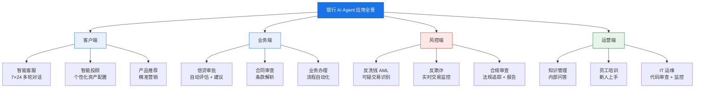
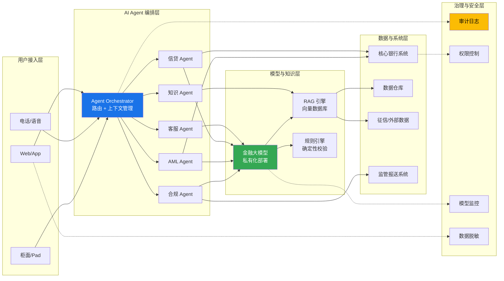

# AI 智能体在银行系统的应用

> **作者**: Tech-Researcher 探针 | **日期**: 2026-03-17 | **版本**: v1.0

---

## 1. Executive Summary

1. **AI Agent 已从概念验证进入银行核心业务规模化落地阶段。** 2024-2025 年，全球头部银行（摩根大通、汇丰、工行等）已将 AI Agent 部署至智能客服、反欺诈、信贷审批等场景，ROI 显著优于传统 RPA + 规则引擎方案。

2. **大模型驱动的 Agent 正在重塑银行的人机协作模式。** 从"人工为主、AI 辅助"转向"AI 主导、人工复核"，客服领域平均减少 40-60% 人工介入，合规审查效率提升 3-5 倍。

3. **合规与可解释性是银行 AI Agent 落地的最大障碍。** 监管机构要求可审计的决策链，黑箱模型在信贷和反洗钱领域面临严格审查，RAG + 结构化推理链成为主流解决方案。

4. **私有化部署 + 专有模型微调是大型银行的首选路径。** 出于数据主权和监管合规考虑，大型银行普遍倾向于本地部署或混合云架构，而非纯 SaaS 方案。

5. **2025-2026 年将迎来银行 Agent 编排（Orchestration）平台竞争。** 单点 Agent 不再是核心壁垒，能协调多个 Agent 协作完成复杂业务流程的平台层将成为差异化关键。

---

## 2. 银行业为什么需要 AI Agent

### 2.1 业务痛点分析

| 痛点 | 现状问题 | AI Agent 价值 |
|------|---------|--------------|
| **客服成本高** | 传统客服中心人员成本占运营支出比重显著，高峰期等待时间长 | 7×24 自动响应，处理大部分常见问题，转人工时携带完整上下文 |
| **信贷审批慢** | 人工审批一笔贷款平均 3-7 天，涉及多系统数据调取 | Agent 自动聚合多源数据、生成评估报告，审批时间缩至小时级 |
| **反洗钱误报率高** | 传统规则引擎误报率 90-95%，大量人工浪费在无效告警上 | LLM 理解交易上下文，降低误报率 30-50%，聚焦真实风险 |
| **合规成本攀升** | 全球监管要求持续增加，合规团队人力跟不上 | 自动追踪法规变化、审查文档合规性、生成报告 |
| **知识孤岛** | 银行内部知识分散在 SharePoint、Wiki、邮件、PDF 中 | Agent 作为统一知识入口，检索并生成精准回答 |
| **投顾服务门槛高** | 人工投顾仅服务高净值客户，大众市场覆盖不足 | 智能投顾 Agent 提供个性化资产配置建议，服务长尾客户 |

### 2.2 驱动力

- **竞争压力**: 金融科技公司（如 Ant Group、Revolut）用 AI 打造极致体验，倒逼传统银行升级
- **成本压力**: 利差收窄迫使银行降低运营成本，AI Agent 被视为 10 倍杠杆工具
- **监管推动**: 中国银保监会、欧盟 DORA 等监管框架要求银行提升数字化风控能力
- **技术成熟**: GPT-4 / Claude 3.5 / 文心一言等大模型在金融文本理解上达到商用水平

---

## 3. 典型应用场景

### 3.1 智能客服与客户交互

**核心能力**: 多轮对话理解、意图识别、业务办理、情感安抚

- 账户查询、转账指导、产品咨询等高频场景完全自动化
- 复杂投诉自动升级至人工，并附带完整对话摘要
- 多语言支持覆盖国际化业务需求

**代表产品**: 招商银行 AI 小招、Bank of America Erica、印度 HDFC Bank EVA

### 3.2 信贷审批与风控

**核心能力**: 多源数据聚合、风险评估、审批建议生成

- Agent 自动拉取征信、工商、税务、流水等数据
- 结合大模型分析借款人经营描述、行业风险
- 生成结构化审批报告，供审批官参考或自动决断

**关键指标**: 审批效率提升 5-10 倍，逾期率与人工审批持平或更低

### 3.3 反洗钱（AML）/ 反欺诈

**核心能力**: 异常模式识别、交易上下文理解、智能告警分流

- 传统规则引擎 + LLM 互补：规则捕获已知模式，Agent 理解新型洗钱手法
- 自动生成可疑交易报告（SAR），减少分析师 70% 文档工作
- 实时欺诈检测：Agent 在毫秒级分析交易异常，动态调整风险评分

**关键指标**: 误报率降低 30-50%，调查效率提升 3-5 倍

### 3.4 智能投顾（Robo-Advisor 2.0）

**核心能力**: 个性化资产配置、市场分析、动态再平衡建议

- 基于客户风险偏好、财务目标、市场动态生成投资建议
- Agent 持续监控持仓风险，主动推送调整建议
- 自然语言解读复杂金融产品，降低客户理解门槛

### 3.5 合规审查与监管报告

**核心能力**: 法规解析、文档合规检查、报告自动生成

- 持续监控监管政策变化（央行、银保监会、SEC 等）
- 自动审查内部制度、合同、产品说明书是否合规
- 按监管要求自动生成报表（Basel III、IFRS 9 等）

### 3.6 内部知识管理与员工赋能

**核心能力**: 企业知识库问答、流程导航、培训辅助

- 新员工入职培训 Agent：回答制度、流程、系统操作问题
- 研究报告 Agent：辅助客户经理准备客户会谈资料
- 代码审查 Agent：辅助开发团队审查金融系统代码

### 3.7 应用场景全景图

---

## 4. 技术方案对比

### 4.1 自研 vs 采购

| 维度 | 自研 | 采购商业方案 |
|------|------|-------------|
| **成本** | 初始投入高（500 万 - 5000 万 RMB），长期边际成本低 | 按席位/调用量付费，初期成本低 |
| **定制化** | 完全可控，深度适配业务 | 受限于厂商能力，定制周期长 |
| **数据安全** | 数据不出行 | 需评估厂商安全能力 |
| **交付速度** | 6-18 个月 | 1-3 个月 |
| **适合对象** | Top 20 大型银行 | 中小银行、城商行 |
| **代表方案** | 工行工银智涌、建行金融大模型 | 科大讯飞、百度智能云、Ant Group 金融 Agent 平台 |

### 4.2 大模型 vs 规则引擎

| 维度 | 大模型驱动 Agent | 传统规则引擎 |
|------|----------------|-------------|
| **灵活性** | 高，能处理非结构化文本和边缘场景 | 低，只能处理预定义规则 |
| **可解释性** | 较低，需额外构建推理链 | 高，规则可逐条追溯 |
| **准确性** | 领域微调后可达 90%+ | 已知场景准确率高，未知场景失效 |
| **计算成本** | 高（GPU 推理） | 低（CPU 即可） |
| **最佳实践** | 两者结合：规则引擎处理高确定性场景，大模型处理复杂/模糊场景 |

### 4.3 私有化 vs 云部署

| 维度 | 私有化部署 | 公有云 / SaaS |
|------|-----------|--------------|
| **数据主权** | ✅ 完全控制 | ⚠️ 依赖厂商合规 |
| **监管合规** | ✅ 满足中国银保监会等要求 | ⚠️ 跨境数据传输风险 |
| **成本** | 高（硬件 + 运维） | 按需付费，弹性高 |
| **模型更新** | 手动更新，可能滞后 | 自动获取最新模型 |
| **推荐架构** | 大型银行：私有化 + 混合云 | 中小银行：合规云区域部署 |

---

## 5. 银行特有挑战

### 5.1 数据隐私与安全

- **挑战**: 客户 PII（个人身份信息）、交易数据受严格保护，泄露风险极高
- **应对**: 
  - 数据脱敏后进入模型推理
  - 联邦学习 / 差分隐私技术
  - 严格的模型输入输出过滤
  - 私有化部署避免数据流出

### 5.2 监管合规

- **挑战**: 银行是受监管最严格的行业之一，AI 决策必须可审计、可解释
- **应对**:
  - 构建完整的决策审计日志
  - 使用 RAG（检索增强生成）确保回答基于可信知识库
  - 保留人工复核环节（Human-in-the-loop）
  - 定期进行模型偏见检测

### 5.3 可解释性（Explainability）

- **挑战**: 监管机构（如美联储、中国央行）要求解释信贷拒绝等决策原因
- **应对**:
  - 结构化输出：Agent 返回决策理由 + 置信度 + 证据来源
  - Chain-of-Thought 披露：展示推理过程但控制敏感信息
  - 辅助而非替代：AI 输出为建议，最终决策由人工做出

### 5.4 稳定性与可靠性

- **挑战**: 金融系统要求 99.99% 可用性，Agent 幻觉可能导致严重后果
- **应对**:
  - 多重校验机制：关键操作需二次确认
  - 回退机制：Agent 失败时自动切换至规则引擎
  - 沙箱测试：所有 Agent 上线前经过严格的对抗性测试
  - 实时监控：异常行为自动熔断

---

## 6. 国内外案例

### 案例 1: 摩根大通（JPMorgan Chase）— AI 投资分析工具

- **场景**: 投资分析与资产配置
- **方案**: 基于大模型的 AI Agent，帮助分析师快速解析市场报告、生成投资建议。JPMorgan 此前申请了 "IndexGPT" 商标，但该名称未被正式用作产品名称
- **成效**: 分析师研究效率显著提升，覆盖更多中小盘股票研究
- **来源**: [JPMorgan invests heavily in AI](https://www.jpmorganchase.com/news-stories)

### 案例 2: 招商银行 — AI 小招 2.0

- **场景**: 全渠道智能客服
- **方案**: 基于自研大模型的多模态客服 Agent，支持文字、语音、图像交互，作为招商银行数字化转型的核心组件
- **成效**: 显著提升客服问题解决能力，大幅降低人工转接率（据招商银行年报披露）
- **来源**: [招商银行2024年年报 — 科技创新章节](https://www.cmbchina.com/cmbir/)

### 案例 3: 汇丰银行（HSBC）— AI 反洗钱

- **场景**: 反洗钱（AML）交易监控
- **方案**: 与 Google Cloud 合作，使用 AI Agent 分析交易模式、自动生成可疑活动报告
- **成效**: 误报率降低 20%，调查人员处理效率提升 60%
- **来源**: [HSBC AI & Innovation](https://www.hsbc.com/)

### 案例 4: 中国工商银行 — 工银智涌

- **场景**: 全行级 AI 能力平台
- **方案**: 基于自研金融大模型"工银智涌"，覆盖信贷审批、合规审查、知识问答等众多场景
- **成效**: 显著提升信贷审批和合规报告生成效率（据工商银行公开披露）
- **来源**: [工商银行年报 — 金融科技](https://www.icbc.com.cn/column/1438058341489590354.html)

### 案例 5: 新加坡星展银行（DBS）— POSB digibank AI

- **场景**: 个性化客户交互
- **方案**: 基于 AI Agent 的智能理财助手，分析客户消费模式并提供储蓄和投资建议
- **成效**: 显著提升客户参与度和产品交叉销售率（DBS 多次获行业 AI 创新奖项认可）
- **来源**: [DBS AI & Data Strategy](https://www.dbs.com/about-us/digitalisation.page)

### 案例 6: 蚂蚁集团 — 金融 Agent 平台

- **场景**: 开放平台赋能中小银行
- **方案**: 提供金融 Agent 开发平台，集成风控、客服、营销 Agent 模块
- **成效**: 帮助接入银行显著提升客服效率和风险识别能力
- **来源**: [蚂蚁集团 — 金融行业解决方案](https://www.antgroup.com/news-media/news)

### 案例 7: Goldman Sachs — GS AI Assistant

- **场景**: 内部员工助手
- **方案**: 基于 LLM 的内部 AI 助手，帮助工程师生成代码、分析师处理数据、员工查询内部知识
- **成效**: 软件开发效率提升 20-40%，内部知识检索时间大幅减少
- **来源**: [Goldman Sachs AI Insights](https://www.goldmansachs.com/insights)

---

## 7. 团队观点与可操作建议

### 7.1 分阶段实施路径

**阶段一（0-6 个月）: 试点验证**
- 选择 1-2 个高 ROI 场景（推荐：智能客服 + 知识管理问答）
- 采用 RAG + 闭源大模型方案快速上线
- 建立基线指标（准确率、响应时间、用户满意度）

**阶段二（6-18 个月）: 规模扩展**
- 扩展至信贷审批、反欺诈等核心业务
- 评估私有化部署方案，降低数据风险
- 构建 Agent 编排平台，支持多 Agent 协作

**阶段三（18-36 个月）: 全面融合**
- 打造统一的 AI Agent 操作系统
- 与核心银行系统深度集成
- 建立 Agent 治理框架（版本管理、审计、回滚）

### 7.2 技术选型建议

| 银行规模 | 推荐路径 |
|---------|---------|
| **大型银行（Top 20）** | 自研金融大模型 + 私有化 Agent 平台 + Human-in-the-loop |
| **中型银行（城商行）** | 采购商业方案 + 自建 RAG 层 + 合规云部署 |
| **小型银行（农商行）** | SaaS 方案 + 轻量定制 + 集中监管报告 |

### 7.3 关键成功因素

1. **高管层承诺**: AI Agent 不是 IT 项目，是战略转型，需要 CEO/CDO 级别推动
2. **数据基础**: 先打好数据治理基础，再谈 AI 应用
3. **人机协作设计**: 不追求完全自动化，而是设计最优的人机协作流程
4. **持续迭代**: Agent 上线只是起点，持续基于反馈优化 prompt 和检索质量
5. **监管前置沟通**: 重大 AI 应用提前与监管沟通，避免事后整改

### 7.4 风险警示

- ⚠️ **不要过度依赖闭源模型**: 核心场景应有开源模型备份方案
- ⚠️ **不要跳过人工复核**: 高风险决策（信贷拒绝、冻结账户）必须保留人工环节
- ⚠️ **不要忽视员工抵触**: Agent 可能改变岗位职责，需要 Change Management
- ⚠️ **不要忽视模型漂移**: 金融环境快速变化，模型需定期重新评估

---

## 8. 参考来源

1. **McKinsey — The state of AI in banking (2024)**
   - 来源: McKinsey & Company 金融服务行业研究报告（mckinsey.com/industries/financial-services/our-insights）。注：McKinsey 网站有反爬限制，建议直接访问上述页面查阅

2. **JPMorgan Chase — AI Investment & Innovation**
   - https://www.jpmorganchase.com/investor-relations

3. **BCG — Digital Technology & Data Insights**
   - https://www.bcg.com/capabilities/digital-technology-data/insights

4. **Gartner — Top Trends in Banking for 2025**
   - https://www.gartner.com/en/industries/financial-services/top-trends （⚠️ 需付费访问）

5. **中国人民银行 — 金融科技发展规划（2025-2028）**
   - https://www.pbc.gov.cn/

6. **Deloitte — Financial Services Perspectives**
   - https://www.deloitte.com/global/en/Industries/financial-services/perspectives.html

7. **HSBC — AI & Innovation in Financial Services**
   - https://www.hsbc.com/

8. **NVIDIA — Financial Services AI**
   - https://developer.nvidia.com/financial-services

9. **IDC — China Financial Industry AI Market Forecast 2024-2028**
   - https://www.idc.com/ （⚠️ 需付费访问）

10. **MIT Technology Review — AI in Finance (2024)**
    - https://www.technologyreview.com/2024/09/18/

---

## 附录：技术架构参考图

---

*本报告由 Tech-Researcher 团队撰写，仅代表研究观点，不构成投资或采购建议。*
