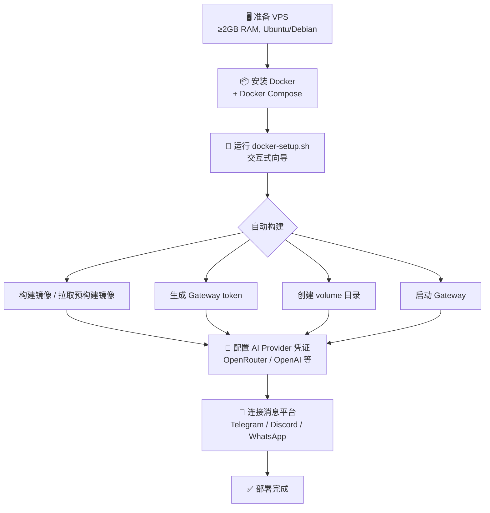
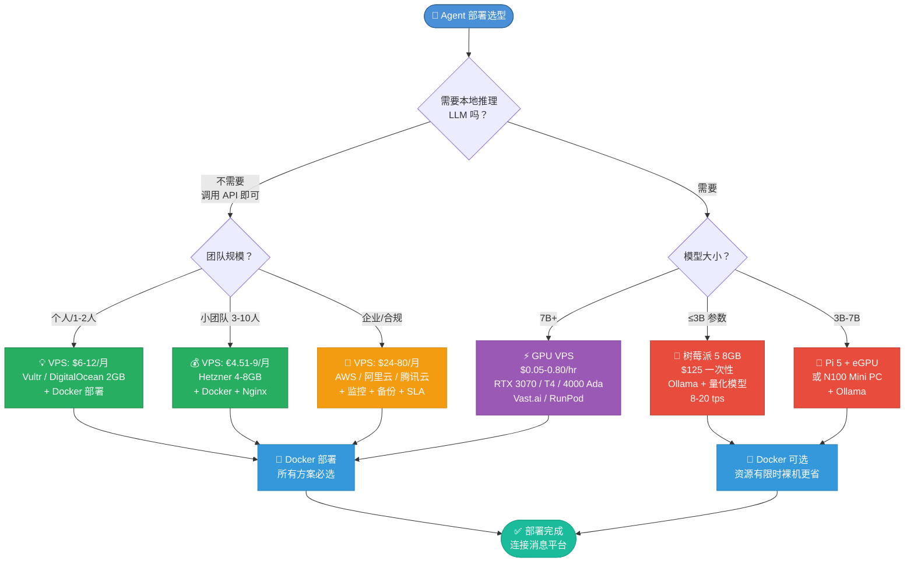

# Agent 私有化部署选型：VPS、树莓派与 Docker 的成本性能三角

> 📅 报告日期: 2026-03-19 | 🔬 深度: 标准分析 | 📊 量化对比 + 选型决策

---

## Executive Summary

**一句话结论：绝大多数个人开发者选择 $6-24/月的 CPU VPS 即可，无需折腾树莓派；需要本地推理小模型时再考虑树莓派或 GPU VPS。Docker 是所有方案的必选项，不是可选项。**

### 选型速查表

| 场景 | 推荐方案 | 月成本 | 理由 |
|------|---------|--------|------|
| 个人 Agent（调用 API） | DigitalOcean/Vultr 2GB | $6-12 | 即开即用，全球节点 |
| 小团队 (3-10人) | Hetzner 4-8GB | €4.51-9.02 | 极致性价比，欧洲节点 |
| 企业/合规需求 | AWS Lightsail 或区域云 | $24-80 | 合规认证，全球覆盖 |
| 离线/边缘 Agent | 树莓派 5 (8GB) | $125 一次性 | 低功耗，无月费 |
| 本地推理 (≤3B) | 树莓派 5 (8GB) + Ollama | $125 一次性 | 8-20 tokens/sec |
| 本地推理 (7B+) | GPU VPS (RTX 3070/T4) | $50-120/月 | 费用按需，无需购置硬件 |

---

## 1. VPS 方案：云服务器全面对比

### 1.1 主流 CPU VPS 价格矩阵（2026年3月数据）

| 厂商 | 配置 | 月费 | 年费 | 流量 | 适用场景 |
|------|------|------|------|------|---------|
| **Hetzner** | 2vCPU/4GB/40GB SSD | €4.51 (~$4.90) | €54 | 20TB | 🏆 性价比之王 |
| **Contabo** | 4vCPU/8GB/75GB SSD | €4.50 (~$4.90) | €54 | 无限 | 极致省钱（I/O 稍弱） |
| **Vultr** | 1vCPU/2GB/55GB NVMe | $12 | $144 | 2TB | 全球 32 个节点 |
| **DigitalOcean** | 1vCPU/2GB/50GB SSD | $12 | $144 | 500GB | 文档友好，开发者社区 |
| **Linode (Akamai)** | 2vCPU/4GB/80GB SSD | $20 | $240 | 4TB | 企业级支持 |
| **AWS Lightsail** | 2vCPU/4GB/80GB SSD | $24 | $288 | 3TB | AWS 生态集成 |

> 💡 **数据来源**: [deploy.me VPS 对比 2025](https://deploy.me/blog/best-vps-for-developers-2025), [vpsbenchmarks.com](https://www.vpsbenchmarks.com/compare/contabo_vs_hetzner), [DigitalOcean vs Lightsail](https://www.digitalocean.com/resources/articles/digitalocean-vs-awslightsail)

### 1.2 性能实测数据

| 厂商/配置 | 编译速度 | 磁盘 I/O | 综合评分 |
|-----------|---------|----------|---------|
| Vultr (2GB) | 1m58s | 680 MB/s | C (稳定性) |
| DigitalOcean (2GB) | 2m08s | 450 MB/s | C |
| Hetzner (4GB) | ~1m30s (估) | ~800 MB/s | B |
| Contabo (8GB) | 较慢 | 较低 | D (I/O 评分) |

> 💡 **数据来源**: [deploy.me VPS 对比 2025](https://deploy.me/blog/best-vps-for-developers-2025), [vpsbenchmarks.com Contabo vs Hetzner](https://www.vpsbenchmarks.com/compare/contabo_vs_hetzner)

### 1.3 GPU VPS — 需要本地推理时

如果 Agent 需要本地运行 LLM（而非调用 API），则需要 GPU 实例：

| GPU | 显存 | 时租价 | 月费 (24×7) | 推荐平台 |
|-----|------|--------|------------|---------|
| NVIDIA T4 | 16GB | $0.11-0.50 | $80-360 | Vast.ai, RunPod |
| RTX 3070 | 8GB | $0.05-0.30 | $36-216 | Vast.ai, Salad |
| RTX 4000 Ada | 20GB | $0.10-0.80 | $72-576 | RunPod, Hetzner |
| H100 | 80GB | $0.72-1.50 | $518-1,080 | CoreWeave, RunPod |

> 💡 **数据来源**: [getdeploying.com GPU 价格 2026](https://getdeploying.com/gpus), [CoreWeave vs RunPod](https://computeprices.com/compare/coreweave-vs-runpod)

> 💡 **数据来源**：getdeploying.com — GPU Price Comparison 2026

### 1.4 选型建议

- **个人开发/测试**: Vultr/DigitalOcean $6-12/月，全球节点多，按需升降配
- **追求性价比**: Hetzner €4.51/月起，同样的钱买到双倍资源，但节点主要在欧洲
- **极致省钱**: Contabo 同价位但无限流量，不过 I/O 性能较弱
- **企业合规**: AWS Lightsail 或国内云（阿里云/腾讯云轻量），有合规认证

---

## 2. 树莓派/本地硬件方案

### 2.1 树莓派 5 硬件规格与成本

| 型号 | RAM | 板卡价格 | 全套成本 (含SSD/电源/机箱) | 功耗 |
|------|-----|---------|--------------------------|------|
| Pi 5 2GB | 2GB | $65 | ~$100 | 待机 2.4W |
| Pi 5 4GB | 4GB | $85 | ~$125 | 待机 ~3W |
| Pi 5 8GB | 8GB | $125 | ~$165 | 待机 ~3W |
| Pi 5 16GB | 16GB | $205 | ~$247 | 待机 ~3.5W |

> 💡 **数据来源**: [Raspberry Pi 5 产品手册](https://pip.raspberrypi.com/documents/RP-008348-DS-raspberry-pi-5-product-brief.pdf), [Tom's Hardware Pi 价格分析](https://www.tomshardware.com/raspberry-pi/raspberry-pi-and-mini-pc-home-lab-prices-hit-parity-as-dram-costs-skyrocket)

**⚠️ 重要发现**: 截至 2026 年初，Pi 5 16GB 全套与 Intel N100 Mini PC 价格持平（均约 $247），但 Mini PC 性能更强。如果纯粹追求性价比，N100 Mini PC 可能更优。

### 2.2 树莓派 5 LLM 推理实测数据

| 模型 | 参数量 | 量化格式 | Pi 5 (8GB) 速度 | 可用性 |
|------|--------|---------|----------------|--------|
| BitNet B1.58 2B | 2B | 1.58-bit | ~8 tps | ✅ 优秀 |
| Llama 3.2 1B | 1B | Q4_K_M | >20 tps | ✅ 流畅 |
| Qwen 2.5 1.5B | 1.5B | Q4 | >15 tps | ✅ 流畅 |
| Llama 3.2 3B | 3B | Q4_K_M | 3-5 tps | ⚠️ 可用 |
| Nemotron-Mini 4B | 4B | Q4 | 2-4 tps | ⚠️ 可用 |
| Gemma 2 2B | 2B | Q4 | ~10 tps | ✅ 流畅 |
| Llama 3 8B | 8B | Q4_K_M | 0.7-3 tps | ❌ 不推荐 |
| Mistral 7B | 7B | Q4_K_M | 0.7-3 tps | ❌ 不推荐 |

> 💡 **数据来源**: [Stratosphere Labs Pi 5 LLM 测试](https://www.stratosphereips.org/blog/2025/6/5/how-well-do-llms-perform-on-a-raspberry-pi-5), [arxiv SBC 基准测试](https://arxiv.org/html/2511.07425v1), [aicompetence.org](https://aicompetence.org/running-llama-on-raspberry-pi-5/), [ItsFOSS 9 LLMs 测试](https://itsfoss.com/llms-for-raspberry-pi/)

### 2.3 树莓派适用场景分析

**✅ 适合的场景:**
- 边缘计算 Agent（智能家居控制、本地触发器）
- 低功耗 24/7 运行（电费极低，3W × 24h × 30天 ≈ 2.16 kWh）
- 运行 ≤3B 参数的小模型做本地推理
- 离线场景（无需互联网调用 API）
- 教育/DIY 项目

**❌ 不适合的场景:**
- 运行 7B+ 大模型（速度太慢，0.7-3 tokens/sec 不可接受）
- 需要高并发的生产服务
- 需要 GPU 加速的推理任务
- 需要大量存储或高速 I/O 的场景

**💡 进阶方案: Pi 5 + eGPU**
Jeff Geerling 的测试表明，Pi 5 可通过 PCIe 连接 AMD RX 6700 XT 等 GPU，使用 Vulkan 后端运行 llama.cpp。整机功耗仅 10-12W，但需要自定义内核补丁，适合 DIY 爱好者，不适合生产环境。

> 💡 **数据来源**: [Jeff Geerling — Pi 5 eGPU LLM](https://www.jeffgeerling.com/blog/2024/llms-accelerated-egpu-on-raspberry-pi-5/)

---

## 3. Docker 容器化方案

### 3.1 OpenClaw Docker 部署流程

OpenClaw 官方推荐 Docker 作为标准部署方式：



> 💡 **数据来源**: [OpenClaw Docker 部署指南](https://openclawn.com/deploying-openclaw-self-host-docker-guide), [Hostinger OpenClaw 教程](https://www.hostinger.com/tutorials/how-to-set-up-openclaw), [LumaDock Docker & K8s](https://lumadock.com/tutorials/openclaw-docker-kubernetes)

### 3.2 Docker 方案的优势

| 优势 | 说明 |
|------|------|
| **隔离性** | Agent 进程与系统其他服务隔离，互不影响 |
| **可移植性** | 同一个 Docker Compose 文件可在任意支持 Docker 的机器上运行 |
| **多实例** | 可同时运行多个 Agent 实例（不同配置/不同平台） |
| **沙箱化** | Agent 工具执行可在独立容器中运行（需 `OPENCLAW_INSTALL_DOCKER_CLI=1`） |
| **版本管理** | 通过镜像标签管理版本，回滚方便 |
| **一致性** | 开发/测试/生产环境完全一致 |

### 3.3 Docker 方案的限制与坑

| 问题 | 说明 | 解决方案 |
|------|------|---------|
| **Docker socket 安全** | 沙箱化需要挂载 Docker socket，有安全隐患 | 仅在可信环境启用，或使用 rootless Docker |
| **资源消耗** | Docker daemon 本身占 ~100-200MB RAM | 对 2GB+ VPS 影响不大 |
| **GPU 支持** | Docker 中使用 GPU 需要 nvidia-container-toolkit | 安装 NVIDIA 驱动 + container toolkit |
| **网络复杂性** | 多容器通信需理解 Docker 网络 | 使用 Docker Compose 默认网络即可 |
| **持久化存储** | 容器重启后数据丢失 | 正确配置 volume mount |

> ⚠️ **ARM 兼容性**：树莓派等 ARM 设备需使用 `arm64` 标签的多阶段构建镜像；VPS 通常为 x86_64。pull 时选择对应架构标签，例如：`docker pull --platform linux/arm64 myimage:latest`

### 3.4 Docker vs 裸机部署

| 维度 | Docker | 裸机 |
|------|--------|------|
| 部署速度 | 5-10 分钟 | 15-30 分钟 |
| 环境一致性 | ✅ 高 | ⚠️ 依赖系统配置 |
| 资源开销 | +100-200MB | 零额外开销 |
| 多实例 | ✅ 简单 | ❌ 需手动隔离 |
| 调试难度 | 中等（需理解容器） | 低 |
| 回滚能力 | ✅ 镜像标签 | ❌ 需手动备份 |
| 生产推荐 | ✅ 是 | ⚠️ 仅简单场景 |

---

## 4. 成本性能三角分析

### 4.1 三种规模的最优选型

#### 个人开发者 / 独立开发者

```
月预算: $6-12
推荐: Vultr/DigitalOcean 2GB VPS [1][2]
配置: 1vCPU / 2GB RAM / 50-55GB SSD
附加: Docker 部署 OpenClaw
推理: 调用云端 API (OpenRouter/OpenAI)
月总成本: $6-12 (VPS) + $5-20 (API) = $11-32
```

**为什么不选树莓派？** Pi 5 8GB 一次性投入 $125+$40 配件 = $165，等于 8-27 个月 VPS 费用[6]。除非你需要离线能力或边缘部署[2]，否则 VPS 更划算且省心。

#### 小团队 (3-10人)

```
月预算: $10-50
推荐: Hetzner 4-8GB VPS [1][3] — 性价比之王
配置: 2-4vCPU / 4-8GB RAM / 40-80GB SSD
附加: Docker Compose 编排 + Nginx 反代
推理: 调用云端 API，按量付费
月总成本: €4.51-9.02 (VPS) + $20-80 (API) = $25-90

或进阶: Hetzner + GPU VPS (需要本地推理时)[5]
GPU VPS: RTX 4000 Ada ~$72/月按需
```

**为什么 Hetzner？** 同样 $12/月，在 Hetzner 可以拿到 2vCPU/4GB，而在 DigitalOcean 只有 1vCPU/2GB[3]。流量需求不大时（欧洲用户为主），Hetzner 是最优解[1]。

#### 企业 / 生产环境

```
月预算: $50-500+
推荐: AWS Lightsail / 阿里云轻量 / 腾讯云 Lighthouse [3] — 适合需要合规认证的场景
配置: 4-8vCPU / 8-16GB RAM / 160-320GB SSD
附加: Docker + 负载均衡 + 自动备份 + 监控
推理: 云端 API + 可选 GPU 实例做本地推理[5]
月总成本: $24-80 (VPS) + $50-300 (API) + $20-50 (备份/监控) = $94-430
```

**为什么选大厂？** 合规认证（SOC2/ISO27001）[3]、SLA 保障、全球多区域部署、企业级支持。

### 4.2 总拥有成本 (TCO) 对比 — 3年周期

| 方案 | 初始成本 | 月费 | 3年总成本 | 备注 |
|------|---------|------|----------|------|
| VPS (Hetzner 4GB) | $0 | €4.51 | **$176** | 最低 TCO |
| VPS (DO 2GB) | $0 | $12 | **$432** | |
| 树莓派 5 8GB | $165 | $0 (电费 $2/月) | **$237** | 无网络成本，但性能有限 |
| N100 Mini PC | $247 | $3 (电费) | **$355** | x86 生态，性能 > Pi 5 |
| GPU VPS (T4) | $0 | $80 | **$2,880** | 仅需要本地推理时 |

> 💡 **数据来源**: [Jeff Geerling Pi vs Mini PC](https://www.jeffgeerling.com/blog/2026/raspberry-pi-cheaper-than-mini-pc/), [getdeploying.com](https://getdeploying.com/gpus)

---

## 5. 选型决策树



---

## 6. 实战避坑指南

### 6.1 VPS 选择的坑

| 坑 | 现象 | 规避方法 |
|----|------|---------|
| **带宽超额费** | AWS Lightsail 超出 100GiB 后费用暴涨 | 选含充足流量的方案（DigitalOcean 500GiB / Hetzner 20TB） |
| **Contabo I/O 慢** | 磁盘写入慢，编译/构建耗时 | 仅用于轻量服务，不跑数据库 |
| **Hetzner 地区限制** | 亚洲用户延迟高 | 需要亚太节点时选 Vultr/DO/阿里云 |
| **IP 被封** | 同 IP 多人滥用导致被 Telegram/Google 封 | 选有 IP 更换服务的厂商，或独立 IP |

### 6.2 树莓派的坑

| 坑 | 现象 | 规避方法 |
|----|------|---------|
| **电源不足** | Pi 5 需要 5V/5A，用错电源会降频 | 用官方 27W USB-C 电源 |
| **SD 卡寿命** | 频繁读写导致 SD 卡损坏 | 用 USB SSD 启动（Pi 5 支持 PCIe SSD） |
| **散热问题** | 长时间推理过热降频 | 加主动散热风扇 + 散热片 |
| **7B+ 模型太慢** | 0.7-3 tokens/sec 体验极差 | 只跑 ≤3B 模型，否则用 GPU |

### 6.3 Docker 的坑

| 坑 | 现象 | 规避方法 |
|----|------|---------|
| **磁盘空间耗尽** | Docker 镜像/容器日志占满磁盘 | 定期 `docker system prune`，配置日志轮转 |
| **数据丢失** | 容器重建后数据消失 | 确保 volume mount 正确 |
| **GPU 不可用** | 容器内无法访问 GPU | 安装 nvidia-container-toolkit |
| **DNS 解析失败** | 容器内无法解析域名 | 检查 Docker daemon DNS 配置 |
| **端口冲突** | 多个服务争夺同一端口 | Docker Compose 自动分配端口，或手动指定 |

---

## 7. 总结与建议

### 核心观点

1. **不要过度工程化**: 95% 的 Agent 不需要本地推理，调用 API 即可。一台 $6-12/月的 VPS 足矣。
2. **树莓派是小众选择**: 除非你有明确的离线/边缘需求，否则 VPS 更省心。Pi 5 与 Mini PC 已价格持平，Mini PC 性价比更高。
3. **Docker 是必选项**: 不论选择哪种基础设施，Docker 都能显著降低运维复杂度。
4. **成本大头是 API 调用**: 基础设施月费通常只占总成本的 20-30%，API 调用费用才是大头（来源: [Towards AI — Optimizing Costs](https://towardsai.net/p/l/2025-guide-to-optimizing-costs-in-agentic-ai-deployments), [TechAhead — AI Agent Cost Control](https://www.techaheadcorp.com/blog/how-to-cap-ai-agent-costs/)）。优化 Agent 的 prompt 和调用频率比省 VPS 费用更有效。

### 投资回报率排序

对于 AI Agent 私有化部署，投入精力的优先级：

1. 🔴 **高回报**: 优化 API 调用（减少不必要的 LLM 调用）— 可节省 40-60% 总成本（来源: [Towards AI — Optimizing Costs in Agentic AI](https://towardsai.net/p/l/2025-guide-to-optimizing-costs-in-agentic-ai-deployments)）
2. 🟠 **中回报**: 选择合适的 VPS 配置（避免过度配置）— 可节省 30-50% 基础设施成本（来源: [deploy.me VPS 对比](https://deploy.me/blog/best-vps-for-developers-2025)）
3. 🟡 **低回报**: 从 VPS 迁移到树莓派 — 仅在特定场景有意义
4. 🔵 **视情况**: 本地推理（GPU VPS 或自建硬件）— 仅在数据隐私或延迟要求极高时考虑（来源: [getdeploying.com GPU 价格](https://getdeploying.com/gpus)）

---

## 参考来源

1. [deploy.me — Best VPS for Developers 2025](https://deploy.me/blog/best-vps-for-developers-2025)
2. [vpsbenchmarks.com — Contabo vs Hetzner](https://www.vpsbenchmarks.com/compare/contabo_vs_hetzner)
3. [DigitalOcean — DigitalOcean vs AWS Lightsail](https://www.digitalocean.com/resources/articles/digitalocean-vs-awslightsail)
4. [brainhost.ai — Best VPS for AI Agents 2026](https://brainhost.ai/blog/best-vps-for-ai-agents)
5. [getdeploying.com — GPU Price Comparison 2026](https://getdeploying.com/gpus)
6. [computeprices.com — CoreWeave vs RunPod](https://computeprices.com/compare/coreweave-vs-runpod)
7. [Stratosphere Labs — LLMs on Raspberry Pi 5](https://www.stratosphereips.org/blog/2025/6/5/how-well-do-llms-perform-on-a-raspberry-pi-5)
8. [arxiv — LLM Inference on SBCs](https://arxiv.org/html/2511.07425v1)
9. [Jeff Geerling — LLMs with eGPU on Pi 5](https://www.jeffgeerling.com/blog/2024/llms-accelerated-egpu-on-raspberry-pi-5/)
10. [aicompetence.org — Running Llama on Pi 5](https://aicompetence.org/running-llama-on-raspberry-pi-5/)
11. [ItsFOSS — 9 LLMs on Pi 5](https://itsfoss.com/llms-for-raspberry-pi/)
12. [Raspberry Pi 5 Product Brief](https://pip.raspberrypi.com/documents/RP-008348-DS-raspberry-pi-5-product-brief.pdf)
13. [Tom's Hardware — Pi vs Mini PC Pricing](https://www.tomshardware.com/raspberry-pi/raspberry-pi-and-mini-pc-home-lab-prices-hit-parity-as-dram-costs-skyrocket)
14. [Jeff Geerling — Pi vs Mini PC 2026](https://www.jeffgeerling.com/blog/2026/raspberry-pi-cheaper-than-mini-pc/)
15. [OpenClaw Docker Deployment Guide](https://openclawn.com/deploying-openclaw-self-host-docker-guide)
16. [Hostinger — Set up OpenClaw](https://www.hostinger.com/tutorials/how-to-set-up-openclaw)
17. [LumaDock — OpenClaw Docker & K8s](https://lumadock.com/tutorials/openclaw-docker-kubernetes)
18. [xTom — Self-Host OpenClaw](https://xtom.com/blog/how-to-self-host-openclaw/)
19. [Towards AI — Optimizing Costs in Agentic AI 2025](https://towardsai.net/p/l/2025-guide-to-optimizing-costs-in-agentic-ai-deployments)
20. [TechAhead — AI Agent Cost Control](https://www.techaheadcorp.com/blog/how-to-cap-ai-agent-costs/)
