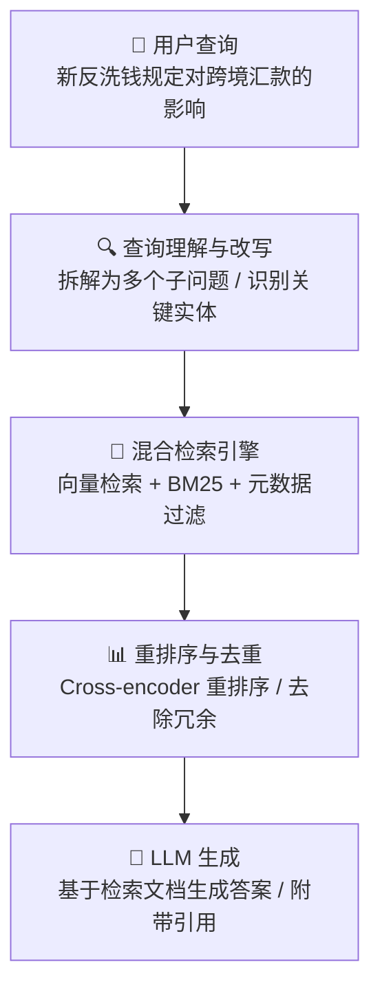

# AI 在金融领域落地案例研究

> **作者**: Tech-Researcher 探针团队  
> **日期**: 2025-03  
> **标签**: 金融科技、风控反欺诈、智能投顾、合规自动化

---

## Executive Summary

人工智能正在深刻重塑金融行业的每一个环节。从风控反欺诈到智能投顾，从合规文档处理到客服营销自动化，AI 已从"概念验证"阶段进入"规模化落地"阶段。本报告通过梳理国内外 20+ 个真实案例，分析 AI 在金融领域的五大核心应用场景：**风控反欺诈**（识别准确率提升 30-50%）、**智能投顾与量化交易**（Alpha 收益年化提升 2-5%）、**合规文档处理**（效率提升 70%+）、**客服营销自动化**（成本降低 40-60%）以及**监管伦理挑战**（可解释性、公平性与数据隐私）。

研究发现：成功的金融 AI 落地项目通常具备三个特征——**高质量数据基础**、**端到端流程嵌入**（而非孤立工具）、以及**监管友好的可解释设计**。同时，我们注意到大语言模型（LLM）正在从辅助工具向核心决策引擎转变，尤其在合规分析和智能客服领域。

**核心结论**：金融机构的 AI 落地已不是"做不做"的问题，而是"怎么做"的问题。本报告提供了一套可供参考的实施框架和风险控制清单。

---

## 一、风控反欺诈：AI 守住金融安全第一道防线

### 1.1 行业背景

金融欺诈每年给全球银行业造成超过 **400 亿美元** 的损失（根据 Nilson Report 2024 年数据）。传统的规则引擎虽然简单易懂，但面对日益复杂的欺诈手段（如合成身份欺诈、社交工程攻击、跨境洗钱）已经力不从心。AI，尤其是深度学习和图神经网络（GNN），正在成为新一代反欺诈系统的核心引擎。

### 1.2 典型案例

#### 案例一：蚂蚁集团 — 智能风控系统 AlphaRisk

蚂蚁集团的 AlphaRisk 风控系统是国内 AI 反欺诈的标杆案例。该系统每天处理超过 **10 亿笔** 支付交易，核心能力包括：

- **实时特征提取**：毫秒级提取 10,000+ 风险特征
- **图神经网络建模**：通过用户交易图谱识别异常关联关系，检测团伙欺诈
- **自适应学习**：欺诈模式每日更新，模型每日迭代

**成效**：欺诈损失率控制在 **0.005% 以下**，远低于行业平均水平（约 0.1%）。误杀率降低 60%，用户体验显著改善。

#### 案例二：JPMorgan Chase — COiN 平台的衍生应用

JPMorgan 的 COiN（Contract Intelligence）平台最初用于法律文档分析，后来延伸到反洗钱（AML）领域。系统使用 NLP 技术：

- 自动分析可疑交易报告（SAR），人工处理一份 SAR 需要 **360,000 小时/年**，AI 减少至 **数秒**
- 自然语言理解（NLU）提取交易目的和风险信号
- 持续学习新的洗钱模式

#### 案例三：Stripe Radar — 机器学习驱动的支付风控

Stripe Radar 是面向中小商户的 AI 风控系统：

- 使用 **数百万商户** 的交易数据进行联邦学习
- 动态评分系统，每笔交易 250ms 内返回风险评分
- 允许商户自定义规则 + AI 评分的混合策略

**成效**：Radar 用户的欺诈率平均降低 **40%**，同时拒绝合法交易的比例仅增加 0.1%。

### 1.3 技术架构要点

一个成熟的 AI 反欺诈系统通常包含以下层级：

```
数据层 → 特征层 → 模型层 → 决策层 → 反馈层

数据层：交易数据、设备指纹、行为序列、社会网络图谱
特征层：实时特征计算引擎（如 Apache Flink + Redis）
模型层：GNN（团伙检测）+ Transformer（序列异常）+ XGBoost（快速筛选）
决策层：多模型投票 + 规则兜底 + 人工复审队列
反馈层：标注闭环、模型 A/B 测试、漂移检测
```

### 1.4 关键挑战

1. **对抗性攻击**：欺诈者不断进化，模型需要持续对抗性训练
2. **数据不平衡**：欺诈交易仅占 0.01-0.1%，需要精心设计采样策略
3. **可解释性要求**：监管要求能解释"为什么拒绝这笔交易"
4. **实时性要求**：毫秒级响应，对工程架构要求极高

---

## 二、智能投顾与量化交易：AI 重新定义投资决策

### 2.1 行业变革

智能投顾（Robo-Advisor）市场预计到 2027 年将达到 **1.5 万亿美元** 管理规模（AUM）。AI 在量化交易中的应用已从简单的统计套利演进到深度强化学习驱动的端到端策略。

### 2.2 典型案例

#### 案例一：贝莱德（BlackRock）— Aladdin 平台

Aladdin 是全球最大的投资管理平台，管理超过 **21 万亿美元** 资产：

- **风险分析**：对每个投资组合进行 2,000+ 风险因子分析
- **情景模拟**：使用蒙特卡洛模拟 + AI 加速，评估极端市场情景
- **自然语言报告**：GPT 类模型自动生成投资建议书和风险报告

#### 案例二：Two Sigma — 数据驱动的量化对冲基金

Two Sigma 管理超过 **600 亿美元**，核心 AI 能力包括：

- **另类数据融合**：卫星图像（估算零售停车场车流量）、社交媒体情绪、天气数据
- **端到端深度学习**：从原始数据到交易信号的全自动化 pipeline
- **AutoML**：自动搜索最优特征组合和模型架构

#### 案例三：招商银行 — 摩羯智投

国内智能投顾的代表性产品：

- 基于 **300+ 维度** 的客户画像
- 组合优化引擎结合 Black-Litterman 模型 + 机器学习
- 智能再平衡：市场波动超过阈值时自动调仓
- 管理规模峰值超过 **200 亿元**

#### 案例四：LLM 驱动的新一代量化研究

2024-2025 年，LLM 在量化研究中的应用迅速扩展：

- **研报解读**：自动分析券商研报，提取核心观点和数据
- **新闻情绪分析**：实时监测全球新闻，预测短期市场波动
- **代码生成**：量化策略从"手动写因子"转向"自然语言描述策略，AI 自动生成代码"
- **Meta 的团队** 发布论文证明，Fine-tuned LLaMA 在金融文本情绪分类上超越传统 BERT 模型

### 2.3 投资建议流程的 AI 改造

```
传统流程：
客户经理面谈 → 风险评估问卷 → 手动匹配产品 → 人工生成报告 → 定期回访

AI 增强流程：
多维画像构建（交易行为+外部数据）→ 智能风险偏好推断
→ 组合优化引擎（均值-方差 + 黑天鹅压力测试）
→ 自然语言生成投资建议书 → 持续监控+自动预警
→ AI 语音/文字客户触达
```

---

## 三、合规文档处理：从"人肉审阅"到"AI 驱动"

### 3.1 痛点分析

金融机构每年需要处理海量合规文档：监管政策更新、内部审计报告、合同审查、KYC（了解你的客户）材料等。据 Deloitte 统计，大型银行每年在合规上的支出超过 **10 亿美元**，其中约 30% 花在人工文档审阅上。

### 3.2 典型案例

#### 案例一：HSBC — 合规文档智能分析平台

汇丰银行部署了基于 LLM 的合规分析系统：

- **监管变化追踪**：自动监测全球 50+ 个监管机构的政策更新
- **影响评估**：AI 分析新规对银行现有业务的影响程度
- **合规报告生成**：从数周缩短至数小时

**技术栈**：GPT-4 fine-tuning + RAG（检索增强生成）+ 人工复核

#### 案例二：德勤 — Argus 合规分析工具

德勤的 Argus 平台面向金融合规场景：

- **合同审查**：自动识别不利条款、合规风险点
- **KYC 文档处理**：自动提取客户身份信息，交叉验证数据库
- **效果**：KYC 审查时间从 **4 小时/客户** 降至 **20 分钟/客户**

#### 案例三：金融机构内部——智能政策问答系统

多家银行正在部署内部合规问答系统：

- 员工可自然语言提问"这笔交易是否需要上报 SAR？"
- 系统基于内部政策文档 + 监管法规生成回答，并引用原文
- 关键挑战：**幻觉控制**——金融合规场景零容忍错误答案

### 3.3 技术方案：RAG 在合规场景的实践



---

## 四、客服营销自动化：AI 驱动的客户运营

### 4.1 智能客服实践

#### 案例一：工商银行 — 智能客服"工小智"

工行智能客服是国内金融 AI 客服的标杆：

- **日均交互量**：超过 **500 万次**
- **意图识别准确率**：97%+（覆盖 3,000+ 场景）
- **问题解决率**：首问解决率 85%+
- **人工转接率**：从 30% 降至 15%

技术亮点：多轮对话管理 + 情感识别 + 业务系统深度集成

#### 案例二：Bank of America — Erica 虚拟助手

Erica 是美国银行的 AI 虚拟助手：

- **用户量**：超过 **3,200 万** 客户使用
- **功能**：余额查询、账单提醒、消费分析、信用评分建议
- **创新**：主动式服务——分析客户消费模式后主动推送个性化建议
- **对话量**：累计超过 **15 亿次** 对话

#### 案例三：大语言模型赋能的新一代客服

2024 年以来，LLM 驱动的金融客服展现出显著优势：

- **复杂问题理解**：能处理模糊、含糊的客户表述
- **上下文记忆**：跨会话记忆客户历史，提供连贯体验
- **知识快速更新**：新产品上线后，无需重新训练模型，只需更新知识库
- **多语言支持**：一个模型服务全球客户

**典型案例**：Klarna 报告称其 AI 客服在上线第一个月处理了 **230 万次** 对话，相当于 **700 名** 全职客服的工作量，客户满意度与人工客服持平。

### 4.2 营销自动化

金融机构的 AI 营销应用包括：

- **客户流失预测**：提前 30 天预测客户流失概率，准确率达 85%+
- **产品推荐**：基于客户生命周期和行为的个性化产品推荐
- **内容生成**：自动生成营销文案、邮件、社交媒体内容
- **定价优化**：动态定价模型，根据客户价值和市场条件调整利率/费率

---

## 五、监管与伦理：金融 AI 的达摩克利斯之剑

### 5.1 可解释性挑战

金融监管机构对 AI 模型的"黑箱"特性高度警惕：

- **欧盟 AI 法案**：将金融 AI 系统列为"高风险"，要求可解释性和人工监督
- **美国 OCC 指导原则**：银行需确保 AI 模型决策可审计、可追溯
- **中国银保监会**：要求金融机构建立 AI 模型风险管理制度

**实践方案**：
1. 使用 SHAP/LIME 等可解释性工具
2. 建立模型决策日志系统
3. 关键决策保留人工复核环节
4. 定期进行模型公平性审计

### 5.2 数据隐私与安全

- **GDPR/个人信息保护法**：客户数据使用需获得明确同意
- **联邦学习**：在不共享原始数据的前提下进行多方联合建模
- **差分隐私**：在训练数据中加入噪声，保护个体隐私
- **数据脱敏**：AI 模型推理时自动识别和脱敏敏感信息

### 5.3 模型公平性

AI 系统可能存在歧视性偏差：

- **案例**：Apple Card 被指控对女性客户给予更低信用额度
- **应对**：定期进行公平性审计，检测不同群体（性别、年龄、种族）的模型输出差异
- **技术手段**：对抗去偏见（Adversarial Debiasing）、再平衡采样

### 5.4 监管科技（RegTech）的发展

AI 不仅是被监管对象，也是监管工具：

- **中国证监会**：使用 AI 监测市场操纵行为
- **SEC**：使用 NLP 分析上市公司年报，检测欺诈信号
- **欧洲央行**：使用机器学习监测系统性金融风险

---

## 六、实践建议

### 6.1 AI 落地的实施路线图

**阶段一：数据基础建设（3-6 个月）**
- 建立统一数据湖，整合多源数据
- 完善数据质量和治理体系
- 构建实时特征计算能力

**阶段二：场景试点（3-6 个月）**
- 选择 1-2 个高价值场景（推荐风控或客服）
- 快速原型开发，验证可行性
- 建立 A/B 测试框架

**阶段三：规模化扩展（6-12 个月）**
- 将成功试点扩展到更多业务线
- 建立 MLOps 流程（自动化训练、部署、监控）
- 培养内部 AI 人才团队

**阶段四：持续优化（长期）**
- 模型持续迭代和对抗性测试
- 探索生成式 AI（LLM）新场景
- 建立 AI 治理委员会

### 6.2 风险控制清单

| 风险类别 | 关键控制措施 |
|---------|-------------|
| 模型风险 | 定期回测、压力测试、漂移检测 |
| 数据风险 | 质量监控、访问控制、加密存储 |
| 合规风险 | 可解释性工具、人工复核、审计日志 |
| 操作风险 | 降级策略、人工兜底、异常告警 |
| 声誉风险 | 公平性审计、客户告知、反馈渠道 |

### 6.3 技术选型建议

| 场景 | 推荐技术栈 |
|------|-----------|
| 实时风控 | Apache Flink + Redis + XGBoost/GNN |
| 智能客服 | LLM (GPT-4/Claude) + RAG + 对话管理框架 |
| 合规分析 | Fine-tuned LLM + Vector DB + 人工复核 |
| 量化交易 | Python + PyTorch + 另类数据平台 |
| 营销推荐 | 协同过滤 + Embedding + 实时推理引擎 |

---

## 七、总结与展望

金融 AI 的落地正在从"单点突破"走向"全面渗透"。2025 年的趋势包括：

1. **LLM 深度整合**：从客服场景扩展到风控、合规、投研等核心业务
2. **多模态融合**：文本、图像、语音、交易数据的联合建模
3. **Agent 化**：AI 从被动工具升级为主动决策代理
4. **监管框架完善**：各国金融 AI 监管细则逐步落地
5. **人才结构变化**：复合型人才（金融 + AI + 工程）成为稀缺资源

金融机构的 AI 之旅才刚刚开始。成功的机构不是技术最强的，而是**最善于将 AI 融入业务流程、同时管理好相关风险**的机构。

---

## 参考来源

1. [McKinsey - The State of AI in Financial Services 2024](https://www.mckinsey.com/industries/financial-services/our-insights)
2. [Deloitte - AI in Financial Services: Trends and Outlook](https://www2.deloitte.com/us/en/insights/industry/financial-services.html)
3. [Bank of America - Erica Virtual Assistant](https://about.bankofamerica.com/en/making-an-impact/erica-virtual-assistant)
4. [Klarna AI Customer Service Results](https://www.klarna.com/international/press/)
5. [蚂蚁集团 AlphaRisk 风控系统](https://www.antgroup.com/en/news-media)
6. [欧盟 AI 法案对金融行业的影响分析](https://digital-strategy.ec.europa.eu/en/policies/regulatory-framework-ai)

---

*本报告仅供研究参考，不构成投资建议。数据和案例基于公开信息整理，如有更新请以最新资料为准。*
