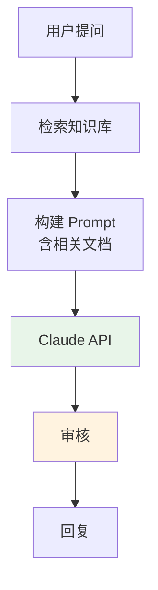
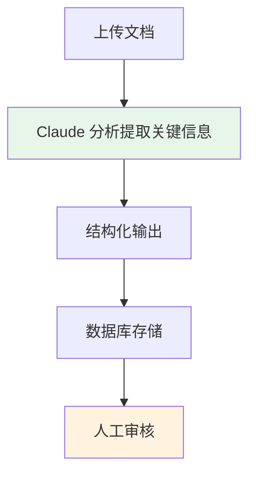
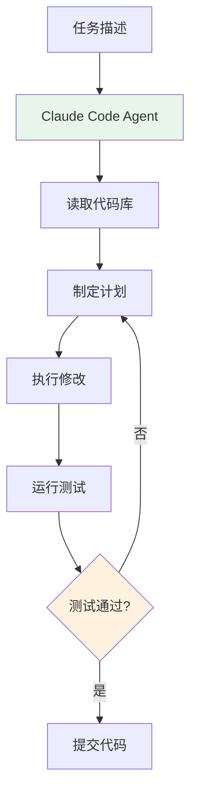

# Anthropic Claude 企业级实践

> **发布日期**: 2026年3月 | 更新版（原版 2025-03）  
> **分类**: 案例实践  
> **字数**: ~5000字

---

## Executive Summary

Anthropic 由前 OpenAI 研究副总裁 Dario Amodei 和 Daniela Amodei 于 2021 年创立，以"AI 安全优先"理念在竞争激烈的 AI 市场中开辟了独特定位。截至 2026 年 3 月，Claude 模型家族已扩展至 Claude 4 系列（Opus 4、Sonnet 4）和 Claude 3.5 全系列，在编程、长文档处理和指令遵循方面持续领先。

核心发现：
- **Claude 4 系列确立编程 Agent 新标杆**：Opus 4 和 Sonnet 4 在 SWE-bench Verified 等编程基准上大幅领先竞品
- **Claude Code 成为企业开发标配**：终端 Agent 编程模式已被广泛采用
- **Artifacts / Projects 持续进化**：支持代码执行、团队协作等企业级功能
- **Constitutional AI + ASL 框架**：安全方法论持续吸引企业客户
- **200K tokens 长上下文**仍是文档处理场景的核心竞争力

---

## 1. Claude 模型家族概览（截至 2026-03）

### 1.1 完整模型列表

Anthropic 的 Claude 模型命名体系包含三个层级（截至 2026 年 3 月最新）：

| 模型 | 发布时间 | 定位 | 主要特点 |
|------|---------|------|---------|
| Claude Opus 4 | 2025.05 | 旗舰 | 最强推理能力，复杂任务首选 |
| Claude Sonnet 4 | 2025.05 | 升级旗舰 | 超越 Opus 3 能力，性价比标杆 |
| Claude 3.5 Sonnet | 2024.06 | 成熟主力 | 高性价比，广泛部署 |
| Claude 3.5 Haiku | 2024.10 | 升级轻量 | Sonnet 级能力，Haiku 级价格 |
| Claude 3 Opus | 2024.03 | 经典旗舰 | 稳定可靠，仍在服务 |
| Claude 3 Haiku | 2024.03 | 轻量 | 最快响应，最低成本 |

> **注意**：Claude 4 系列于 2025 年 5 月发布，是 Anthropic 首次使用独立版本号（而非 3.x 子版本）。Claude 3.5 Sonnet 仍为高性价比选择，被广泛用于生产环境。

### 1.2 Claude 4 Opus 与 Sonnet 4

2025 年 5 月发布的 Claude 4 系列是 Anthropic 最重大的模型升级¹：

**编程能力**：Claude Opus 4 在 SWE-bench Verified 上取得 **72.7%** 的得分（截至 2025 年 5 月发布时），显著超越 Claude 3.5 Sonnet 的 49%，也领先于 GPT-4o（约 38%）和 Gemini 2.5 Pro 等竞品。Claude Sonnet 4 也达到约 69% 的水平。²

**推理能力**：Claude 4 系列在 GPQA Diamond（研究生级问答）等推理基准上表现突出，Opus 4 达到约 75% 的得分。

**多模态**：原生支持视觉输入，图表理解和文档分析能力进一步提升。

**Extended Thinking**：Claude 4 引入了"深度思考"模式，允许模型在复杂任务上进行更长时间的内部推理，显著提升复杂编程和数学任务表现。

**价格**（截至 2025 年 5 月发布时）：

| 模型 | Input（每百万 tokens） | Output（每百万 tokens） |
|------|----------------------|------------------------|
| Claude Opus 4 | $15 | $75 |
| Claude Sonnet 4 | $3 | $15 |
| Claude 3.5 Sonnet | $3 | $15 |
| Claude 3.5 Haiku | $0.80 | $4 |

### 1.3 Claude 3.5 全系列回顾

**Claude 3.5 Sonnet（2024.06）**：开创性的性价比升级，以 Sonnet 价格提供超越 Opus 3 的能力，至今仍是许多企业的首选。

**Claude 3.5 Haiku（2024.10）**：以 Haiku 价格提供接近 Sonnet 3.5 的能力，适合大规模低延迟场景。

**Computer Use（2024.10）**：Claude 3.5 Sonnet 引入的实验性"计算机操控"功能。在 OSWorld 基准上从之前的低分提升到 14.9%（最佳无定制方法），展示了 AI 操作桌面的可行性。²

### 1.4 Claude 3.5 Sonnet 的编程遗产

Claude 3.5 Sonnet 在发布时取得 SWE-bench Verified 49% 的得分，超过当时所有竞品（GPT-4o 约 38%），在 HumanEval 编程基准上达到 92%。³

**视觉理解**：在需要理解图表、文档图像、UI 界面的任务上表现突出。

**长文档处理**：200K tokens 上下文窗口可以一次性处理整本书、长篇法律文件或完整代码仓库。

**指令遵循**：Claude 在需要严格遵循复杂指令的场景中表现突出，在企业级应用中至关重要。

---

## 2. Claude Code 与编程实践

### 2.1 Claude Code 是什么

Claude Code 是 Anthropic 在 2025 年 2 月推出的 CLI 工具，代表了"Agent 编程"的范式。与 GitHub Copilot（代码补全）和 Cursor（编辑器内对话）不同，Claude Code 直接在终端中运行，可以：

- **自主读取和编辑代码文件**
- **运行终端命令**（npm install、git commit、测试运行等）
- **创建和修改多个文件**（重构、新增功能）
- **搜索代码库**（理解项目结构和依赖关系）

### 2.2 与传统编程助手的区别

| 维度 | GitHub Copilot | Cursor | Claude Code |
|------|---------------|--------|-------------|
| 交互方式 | IDE 内自动补全 | 编辑器内对话 | 终端 CLI |
| 自主程度 | 低（需人工触发） | 中（对话驱动） | 高（Agent 自主） |
| 文件操作 | 单文件 | 多文件（有限） | 多文件（自由） |
| 命令执行 | 不支持 | 有限支持 | 完全支持 |
| 适用场景 | 日常编码加速 | 功能开发、调试 | 重构、大型任务 |

### 2.3 实践模式

Claude Code 在实际使用中适合以下场景：

**代码库探索**：新加入项目时，让 Claude Code 分析项目结构、依赖关系、关键模块，快速建立理解。

**自动化重构**：如"将所有 class-based 组件改为 functional components，更新相应的 import 路径"，Claude Code 可以自主完成所有文件修改。

**测试与修复循环**：让 Claude Code 运行测试、分析失败原因、修复代码、重新运行测试，直到所有测试通过。

**文档生成**：扫描代码库，自动生成 API 文档、README 更新、注释补充。

### 2.4 企业采用注意事项

- **需要信任 AI 的自主操作**：Claude Code 会直接修改文件和执行命令，需要良好的版本控制（Git）
- **成本控制**：复杂的 Agent 任务可能消耗大量 tokens，需要设置预算上限
- **安全边界**：限制 Claude Code 可执行的命令范围，避免敏感操作

---

## 3. Artifacts / Projects 功能（2025-2026 更新）

### 3.1 Artifacts：从对话到创作

Artifacts 是 Claude.ai 网页版中的创新功能（2024 年 6 月推出，2025-2026 年持续增强）。当 Claude 生成较长内容（如代码、文档、HTML 页面、SVG 图形）时，会自动将其放在独立的"工件"窗口中。

**2025-2026 新增功能**：
- **代码执行增强**：Python 代码可在沙盒中运行并显示结果，支持更多库
- **实时预览**：HTML/CSS/JS 代码实时渲染，支持交互式原型开发
- **导出格式扩展**：支持导出为 PDF、PNG、SVG 等格式
- **版本历史**：Artifacts 支持版本追踪，可以回滚到之前的状态

**应用场景**：
- 快速原型开发：描述网页布局，Claude 生成 HTML/CSS 并实时预览
- 数据分析：上传 CSV，Claude 生成分析代码并展示可视化结果
- 文档协作：生成报告、演示文稿，直接在 Artifacts 中编辑

### 3.2 Projects：企业级上下文管理

Projects 功能（2024 年 6 月推出，2025-2026 年增强）允许用户创建持久化的项目空间：

**核心功能**：
- **项目级别指令**（System Prompt）：定义 Claude 在项目中的角色和行为
- **知识文件**：上传参考资料，Claude 在对话中引用
- **对话历史**：同一项目下多轮对话共享上下文
- **团队协作**（2025 新增）：支持多人共享项目空间

**企业价值**：Projects 本质上是在 Claude.ai 中实现了类似 RAG 的功能——上传企业文档，Claude 基于这些文档回答问题。对于非技术团队来说，比搭建 RAG 系统简单得多。

### 3.3 Claude.ai 桌面应用（2025 新增）

Anthropic 于 2025 年推出了 Claude 桌面应用，原生支持：
- 快捷键全局唤起
- 本地文件拖拽上传
- Computer Use 功能集成
- 离线草稿保存

---

## 4. 企业 API 集成模式

### 4.1 API 产品线

Anthropic 的 API 产品线（截至 2026-03）：

**Messages API**：核心接口，支持文本和图像输入，文本输出。支持 Tool Use（函数调用）和多轮对话。

**Batch API**：异步批量处理，24 小时内完成，50% 折扣。

**Vertex AI 集成**：通过 Google Cloud 的 Vertex AI 平台调用 Claude。

**Amazon Bedrock 集成**：通过 AWS Bedrock 平台调用 Claude。

**Extended Thinking API**（2025 新增）：允许开发者控制模型的"思考预算"，在复杂推理任务中提升表现。

### 4.2 企业级 API 特性

**Tool Use（函数调用）**：Claude 可以选择调用预定义的工具，返回结构化参数。在 Claude 4 系列中，Tool Use 的准确率和复杂场景处理能力显著提升。

**Long Context**：200K tokens 上下文窗口，在文档分析、代码库理解等场景中优势明显。

**Streaming**：支持流式输出，改善用户体验。

**Vision**：图像输入能力，支持文档分析、图表理解等场景。

**Citations（2025 新增）**：Claude 4 系列支持引用溯源，返回答案时标注来源文档的具体位置。

### 4.3 典型企业集成模式

**模式一：客服增强**

> 利用 Claude 的指令遵循能力确保回复风格一致；长上下文支持大量参考文档。

**模式二：文档处理管道**

> Claude 的视觉理解能力可以直接"阅读"PDF、扫描件；结构化输出保证数据质量。

**模式三：Agent 编程工作流**

> Claude Code 的 Agent 循环：计划 → 执行 → 测试 → 迭代，直到任务完成。

---

## 5. Constitutional AI 与安全实践

### 5.1 Constitutional AI (CAI) 方法论

Constitutional AI 是 Anthropic 最核心的技术差异化。传统 RLHF（基于人类反馈的强化学习）需要大量人工标注来确保模型行为符合预期。CAI 的创新在于：

1. **定义宪法**：用一组原则（"宪法"）来指导模型行为
2. **自我改进**：模型根据这些原则自我评估和修正输出
3. **透明可审计**：宪法原则是明确的、可检查的

### 5.2 AI Safety Level (ASL) 框架

Anthropic 提出了 ASL（AI Safety Level）框架，类似于生物安全等级（BSL）⁴：

- **ASL-1**：无明显风险（如简单分类器）
- **ASL-2**：当前 LLM 水平，有已知风险但可控
- **ASL-3**：显著增强的风险管控（如防止生物武器设计辅助）
- **ASL-4+**：需要更严格的安全措施

截至 2026 年 3 月，Claude 4 系列模型仍处于 ASL-2，Anthropic 表示如果未来模型表现出 ASL-3 级别的能力，将暂停部署并加强安全措施。

### 5.3 企业安全实践

对于企业客户，Anthropic 的安全承诺包括：

- **数据不用于训练**：API 客户的数据不会用于模型训练（需符合使用条款）
- **SOC 2 Type II 认证**：满足企业安全审计要求
- **HIPAA 合规**：部分合作伙伴支持 HIPAA 合规的部署
- **内容过滤**：内置有害内容检测，可配置严格程度

### 5.4 安全与实用的平衡

Anthropic 的安全立场有时被批评为"过于保守"。但对企业用户来说，这种保守倾向往往是优点而非缺点。当 AI 系统面向大量终端用户时，过度拒绝的风险远小于过度开放。

---

## 实践建议

### 选择 Claude 的场景

1. **长文档处理**：法律合同分析、研究论文总结、代码库理解
2. **编程辅助**：特别是代码审查、重构、测试生成（Claude 4 尤其突出）
3. **需要严格指令遵循的场景**：结构化数据提取、格式化输出
4. **对安全有高要求的应用**：面向公众的客服、教育、医疗辅助

### 模型选择建议（截至 2026-03）

| 场景 | 推荐模型 | 理由 |
|------|---------|------|
| 复杂推理/旗舰任务 | Claude Opus 4 | 最强能力 |
| 日常编程/对话 | Claude Sonnet 4 | 性价比最优 |
| 大规模低延迟 | Claude 3.5 Haiku | 价格最低 |
| 已有稳定部署 | Claude 3.5 Sonnet | 成熟可靠 |

### 不建议选择 Claude 的场景

1. **需要最新实时信息的场景**：Claude 的知识截止日期通常落后于 ChatGPT
2. **需要大量插件/集成的场景**：Claude 的插件生态不如 ChatGPT 丰富
3. **需要极低延迟的场景**：Claude 的响应速度通常略慢于 GPT-4o mini

### 集成最佳实践

1. **利用长上下文**：上传完整文档而非摘要，让 Claude 自己提取信息
2. **Tool Use 替代复杂 Prompt**：需要结构化输出时，用 Tool Use 比 JSON Mode 更可靠
3. **Projects 管理上下文**：长期项目用 Projects 保持一致性
4. **监控成本**：200K context 虽强大但成本不低，根据需求选择合适的上下文窗口
5. **Extended Thinking**：复杂编程和推理任务使用 Extended Thinking 模式

---

## 参考来源

1. Anthropic. "Introducing Claude 4." May 2025. https://www.anthropic.com/news/claude-4
2. Anthropic. "Claude 3.5 Sonnet Model Card." June 2024. https://www.anthropic.com/news/claude-3-5-sonnet
3. Anthropic. "Computer Use - Claude 3.5 Sonnet." October 2024. https://www.anthropic.com/news/claude-3-5-sonnet
4. Anthropic. "Responsible Scaling Policy." September 2023. https://www.anthropic.com/news/anthropics-responsible-scaling-policy
5. Anthropic API Documentation. https://docs.anthropic.com/
6. Anthropic. "Claude 4 Model Card." May 2025. https://docs.anthropic.com/en/docs/about-claude/models
7. SWE-bench Verified Leaderboard. 2025. https://www.swebench.com/

---

*本报告基于截至 2026 年 3 月的公开信息编写。Anthropic 产品更新频繁，部分细节可能已有变化。*
