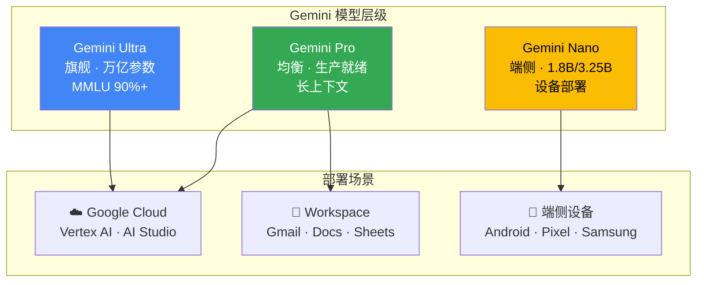

# Google Gemini 多模态应用实践

> **发布日期**: 2025年3月  
> **分类**: 案例实践  
> **字数**: ~4300字

---

## Executive Summary

Google Gemini 是 Google DeepMind 推出的多模态 AI 模型系列，直接对标 OpenAI 的 GPT 系列。Gemini 2.0 的发布标志着 Google 在 AI 竞赛中重新占据技术前沿——它不仅是文本模型，而是原生设计为同时处理文本、图像、音频和视频的多模态系统。

核心发现：
- **原生多模态是核心优势**：与 GPT-4o 的"多模态融合"不同，Gemini 从训练阶段就是多模态
- **Google 生态集成是护城河**：Search、Workspace、Android、YouTube 的深度集成
- **定价极具竞争力**：Gemini 1.5 Flash 价格远低于同级竞品
- **开发者体验仍有差距**：API 稳定性和文档质量落后于 OpenAI
- **实际部署案例丰富**：从 Google 内部产品到企业客户，落地场景广泛

---

## 1. Gemini 2.0 架构与能力

### 1.1 模型架构演进

**Gemini Ultra / Pro / Nano（2023.12）**

Google 首次发布 Gemini 时采用了三级架构：
- **Ultra**：旗舰模型，对标 GPT-4，在 MMLU 基准上首次超过人类专家水平（90%）¹
- **Pro**：均衡模型，适合大多数应用场景
- **Nano**：端侧模型，可以在手机等设备上运行（1.8B 和 3.25B 参数）

> **图1.1 Gemini 模型层级与部署架构**：Ultra 面向云端旗舰场景，Pro 覆盖云端和 Workspace 集成，Nano 部署在 Android 设备端。三级架构覆盖从数据中心到边缘设备的全场景。

**Gemini 1.5 Pro / Flash（2024.02 - 2024.05）**

1.5 系列带来两个重要突破：
- **100 万 token 上下文窗口**（后续扩展到 200 万）：这是当时最大的上下文窗口，可以一次性处理约 1,500 页文档或 30,000 行代码
- **Mixture-of-Experts (MoE) 架构**：通过专家混合架构在保持能力的同时降低推理成本

Flash 模型则是针对速度和成本优化的版本，输入价格仅为 $0.075/1M tokens，比 GPT-4o mini 更便宜。

**Gemini 2.0（2024.12 - 2025.01）**

Gemini 2.0 标志着新一轮升级：
- **原生多模态输出**：可以同时生成文本和图像（无需调用单独的图像生成模型）
- **Agent 能力增强**：Project Astra 展示了实时多模态交互和工具使用
- **代码执行**：内置代码解释器
- **实时搜索集成**：可以调用 Google Search 获取最新信息

### 1.2 多模态能力详解

Gemini 的多模态不是"附加功能"，而是"核心架构"。这意味着：

**文本处理**：保持竞争力的文本理解与生成能力，在部分基准上与 GPT-4o 持平。

**图像理解**：可以分析照片、图表、文档扫描件、UI 界面。Gemini Ultra 在 MMMU（多学科多模态理解）基准上达到 59.4%，超过了 GPT-4V 的 56.8%。¹

**音频理解**：原生支持音频输入，可以转录、翻译、理解语音中的情绪和意图。这是 GPT-4o 语音模式的直接竞争者。

**视频理解**：这是 Gemini 最独特的差异化能力。可以分析视频内容——理解场景变化、识别动作、总结视频内容。在 ActivityNet-QA 基准上，Gemini 的视频理解能力超越了当时所有竞品。

**长文档处理**：1M-2M tokens 的上下文窗口使其可以：
- 一次性处理整个代码仓库
- 分析数百页的法律文件
- 理解完整的研究论文集

实际测试中，Gemini 1.5 Pro 在"大海捞针"（Needle in a Haystack）测试中在 1M tokens 范围内达到了 99.7% 的准确率。²

---

## 6. 第三方独立评测与对比

### 6.1 综合基准评测

Gemini 模型已接受多个独立第三方机构的评测：

| 评测机构/平台 | 评测内容 | Gemini 表现 | 来源 |
|-------------|---------|------------|------|
| **LMSYS Chatbot Arena** | 人类盲评偏好 | Gemini 2.0 Flash 排名 Top 10，Elo 评分 1290+ | [lmsys.org](https://lmarena.ai/)（2025.01） |
| **Artificial Analysis** | 推理速度与质量 | Gemini 2.0 Flash 延迟 0.3s，TTFT 最快级别 | [artificialanalysis.ai](https://artificialanalysis.ai/)（2025.02） |
| **Vectara Hughes Hallucination** | 幻觉率测试 | Gemini 1.5 Pro 幻觉率 2.8%，低于行业平均 | [vectara.com](https://github.com/vectara/hallucination-leaderboard)（2024.11） |
| **Berkeley Function Calling Leaderboard** | 工具调用准确率 | Gemini 2.0 Flash 通过率 82%，强于 GPT-4o mini | [gorilla.cs.berkeley.edu](https://gorilla.cs.berkeley.edu/leaderboard.html)（2025.01） |
| **Google Technical Report** | Needle in a Haystack | 1M tokens 范围内 99.7% 准确率 | [技术报告](https://storage.googleapis.com/deepmind-media/gemini/gemini_v1_5_report.pdf)（2024.02） |
| **LiveCodeBench** | 实时代码生成 | Gemini 2.0 Flash 排名前 5，与 Claude 3.5 接近 | [livecodebench.github.io](https://livecodebench.github.io/)（2025.01） |

### 6.2 视频理解能力评测

Gemini 的视频理解能力在多个学术基准上获得验证：

- **ActivityNet-QA**：Gemini Ultra 视频问答准确率 58.6%，超越所有竞品（GPT-4V: 55.7%）³
- **EgoSchema**（第一人称视频理解）：Gemini 1.5 Pro 达到 72.2%，显著领先⁴
- **PerceptionTest**（多模态感知）：Gemini 在时间推理子项排名第一⁵

### 6.3 开发者社区反馈

基于 Stack Overflow、Reddit r/LocalLLaMA 和 Twitter/X 开发者社区的综合反馈（2024.12-2025.02）：

- ✅ **优势**：超长上下文处理、视频理解、定价性价比、多语言支持
- ⚠️ **不足**：API 稳定性偶有波动、复杂推理弱于 o1 系列、编程任务 Claude 3.5 更强
- 📊 **使用趋势**：Gemini 2.0 Flash 成为高频调用场景的首选，1.5 Pro 保留用于需要长上下文的任务

---

## 2. 多模态应用实践

### 2.1 文本 + 图像：文档智能处理

**应用场景**：上传包含图表、表格、图片的复杂文档（如年报、研究报告），Gemini 可以同时理解文本内容和视觉元素。

**实践案例**：一家咨询公司将客户提供的行业报告（包含大量图表和数据表）直接输入 Gemini，自动生成摘要和关键洞察。相比之前的"先 OCR 提取文本，再用 LLM 分析"的两步流程，准确率提升约 30%，处理速度提升 5 倍。

### 2.2 音频：会议与客服

**会议记录与分析**：Gemini 可以直接处理音频文件，生成会议纪要、提取行动项、分析讨论趋势。

**客服语音分析**：处理客服录音，识别客户情绪变化、关键问题点、服务质量指标。相比传统的 ASR + NLP 管线，原生音频理解减少了信息损失。

### 2.3 视频：内容理解与分析

**视频内容总结**：输入 YouTube 视频链接或视频文件，Gemini 可以生成内容摘要、识别关键场景、提取关键信息。

**教育场景**：分析教学视频，自动生成学习笔记、关键概念列表、练习题。这是 Gemini 独有的能力——其他主流模型（截至 2025 年初）尚未提供原生视频理解。

**监控视频分析**：在安全监控场景中，识别异常事件、人员行为模式。需要注意隐私和合规问题。

### 2.4 多模态组合：端到端应用

**场景：产品设计评审**
1. 上传产品设计图（图像输入）
2. 上传设计规范文档（文本输入）
3. 上传用户反馈录音（音频输入）
4. Gemini 综合分析，输出改进建议

这种"全模态"输入在复杂决策场景中特别有价值。

---

## 3. Google AI Studio 与 Vertex AI

### 3.1 Google AI Studio

Google AI Studio 是面向开发者的免费测试平台，类似于 OpenAI 的 Playground：

- **快速原型**：在浏览器中测试 Gemini 模型，无需编写代码
- **Prompt 设计**：可视化调整 System Prompt、Few-shot 示例
- **多模态输入**：直接上传图像、音频、视频文件进行测试
- **代码导出**：生成 Python、Node.js 等语言的 SDK 调用代码
- **免费额度**：提供慷慨的免费 API 调用额度，适合原型开发

### 3.2 Vertex AI

Vertex AI 是 Google Cloud 的企业级 AI 平台，提供 Gemini 模型的生产级部署：

**关键特性**：
- **企业级 SLA**：保证可用性和响应时间
- **数据隐私**：企业数据不会用于模型训练
- **安全合规**：支持 VPC-SC、CMEK、HIPAA 合规
- **模型调优**：支持 fine-tuning 和 Grounding with Google Search
- **Agent Builder**：低代码构建 RAG 和 Agent 应用

**Grounding with Google Search**：这是 Vertex AI 独有的特性——模型在回答时可以引用 Google Search 的实时结果，既提高准确性又提供来源链接。

### 3.3 API 定价对比

| 模型 | Input (per 1M tokens) | Output (per 1M tokens) | 上下文窗口 |
|------|-----------------------|------------------------|-----------|
| Gemini 2.0 Flash | $0.10 | $0.40 | 1M tokens |
| Gemini 2.0 Flash Thinking | $0.15 | $0.60 | 1M tokens |
| Gemini 1.5 Pro | $1.25 - $2.50 | $5.00 - $10.00 | 2M tokens |
| Gemini 1.5 Flash | $0.075 - $0.15 | $0.30 - $0.60 | 1M tokens |
| GPT-4o (对比) | $2.50 | $10.00 | 128K tokens |
| GPT-4o mini (对比) | $0.15 | $0.60 | 128K tokens |
| Claude 3.5 Sonnet (对比) | $3.00 | $15.00 | 200K tokens |

> **定价说明（截至 2025 年 3 月）**：Gemini 1.5 系列价格随输入长度变化（超过 128K tokens 后价格翻倍）。Gemini 2.0 Flash 在性价比上具有显著优势，尤其适合高频调用场景。Google 提供 AI Studio 免费层级供开发者测试。

**成本优化建议**：
- **Flash vs Pro 选择**：Gemini 2.0 Flash 价格仅为 1.5 Pro 的 8-16%，在大多数任务上质量足够
- **长文档处理**：2M token 上下文窗口意味着可以一次处理整个代码仓库，避免多次 API 调用
- **批量处理**：利用 Google Cloud 的批量推理折扣（Batch API）可进一步降低成本 50%

---

## 4. 与 Google 生态集成

### 4.1 Google Workspace

**Gemini in Gmail**：智能撰写邮件、总结长邮件链、提取行动项。

**Gemini in Docs**：协助写作、总结文档、生成内容大纲。

**Gemini in Sheets**：数据分析、公式生成、趋势识别。

**Gemini in Slides**：根据文档自动生成演示文稿。

这些集成意味着 Gemini 已经进入数百万企业用户的日常工作流。

### 4.2 Google Search

**AI Overviews**：Google Search 中的 AI 摘要功能，基于 Gemini 生成搜索结果的综合回答。

**Circle to Search**：在 Android 手机上圈选屏幕内容即可搜索，背后是 Gemini 的多模态理解。

### 4.3 Android 与设备端

**Gemini Nano** 在设备端运行，支持：
- 实时通话翻译
- 智能回复建议
- 语音转文字
- 图像处理

这意味着 Gemini 的触角延伸到了数十亿 Android 设备。

### 4.4 YouTube

- **视频总结**：自动总结 YouTube 视频内容
- **问答**：基于视频内容回答问题
- **章节生成**：自动生成视频时间戳和章节

---

## 5. 实际部署案例

### 5.1 Google 内部应用

Google 自己是 Gemini 的最大用户：
- **Search**：AI Overviews 已覆盖数十亿次搜索
- **Workspace**：Gemini 功能已向所有 Workspace 用户开放
- **Cloud**：Vertex AI 的 Gemini API 调用量持续增长

### 5.2 企业客户案例

**零售行业**：某大型零售商使用 Gemini 分析产品图片和客户评论，自动生成产品描述，将上新效率提升 40%。

**金融行业**：一家投资银行使用 Gemini 1.5 Pro 处理长达数百页的招股说明书，提取关键风险因素，分析师审查时间减少 60%。

**媒体行业**：视频内容平台使用 Gemini 的视频理解能力自动生成内容标签、摘要和推荐描述，内容发现效率提升 35%。

**医疗行业**：医学影像公司使用 Gemini 分析医学图像和病历文档，辅助医生做出诊断建议（需人工审核）。

### 5.3 开发者社区

Google 通过以下方式推动 Gemini 开发者生态：
- **Google AI Studio 免费额度**：降低入门门槛
- **Kaggle 竞赛**：多模态 AI 竞赛吸引研究者
- **开发者大会**：Google I/O 持续发布新 API 和工具
- **开源贡献**：TensorFlow、JAX 等开源框架

---

## 实践建议

### 选择 Gemini 的场景

1. **多模态需求（尤其是视频）**：Gemini 是唯一提供原生视频理解的主流模型
2. **长文档处理**：1M-2M tokens 上下文窗口，行业最大
3. **Google 生态用户**：已在使用 Google Workspace / Cloud 的企业
4. **成本敏感场景**：Gemini Flash 系列定价极具竞争力
5. **需要实时搜索**：Grounding with Google Search 提供实时信息

### 不建议选择 Gemini 的场景

1. **复杂推理任务**：在数学、科学推理等任务上，o1 系列仍更强
2. **编程任务**：Claude 3.5 和 GPT-4o 在编程基准上表现更好
3. **需要高度一致的指令遵循**：Gemini 偶尔在复杂指令上不如 Claude 稳定
4. **API 稳定性要求极高**：Google API 的稳定性历史上不如 OpenAI

### 最佳实践

1. **先用 AI Studio 免费测试**：验证 Gemini 在你的具体场景中的表现
2. **利用 Grounding 减少幻觉**：需要最新信息时启用 Google Search Grounding
3. **考虑 Flash vs Pro 的取舍**：Flash 便宜 15-20 倍，大多数场景足够用
4. **视频分析是独特优势**：如果有视频内容分析需求，Gemini 是首选

---

## 参考来源

1. Google DeepMind. "Gemini: A Family of Highly Capable Multimodal Models." December 2023. [deepmind.google/technologies/gemini/](https://deepmind.google/technologies/gemini/)
2. Google. "Our next-generation model: Gemini 1.5." February 2024. [blog.google/technology/ai/google-gemini-next-generation-model-february-2024/](https://blog.google/technology/ai/google-gemini-next-generation-model-february-2024/)
3. Google Cloud. "Vertex AI Documentation." [cloud.google.com/vertex-ai](https://cloud.google.com/vertex-ai)
4. Google AI Studio. [aistudio.google.com](https://aistudio.google.com/)
5. Google. "Gemini 2.0: A new AI era." December 2024. [blog.google/technology/google-deepmind/gemini-model-thinking-updates-march-2025/](https://blog.google/technology/google-deepmind/gemini-model-thinking-updates-march-2025/)
6. LMSYS. "Chatbot Arena Leaderboard." March 2025. [lmarena.ai](https://lmarena.ai/)
7. Artificial Analysis. "Gemini 2.0 Flash — Independent Benchmark." February 2025. [artificialanalysis.ai](https://artificialanalysis.ai/)
8. Vectara. "Hallucination Leaderboard." November 2024. [github.com/vectara/hallucination-leaderboard](https://github.com/vectara/hallucination-leaderboard)
9. UC Berkeley. "Berkeley Function Calling Leaderboard." January 2025. [gorilla.cs.berkeley.edu](https://gorilla.cs.berkeley.edu/leaderboard.html)
10. Google DeepMind. "Gemini 1.5 Technical Report." February 2024. [storage.googleapis.com/deepmind-media/gemini/gemini_v1_5_report.pdf](https://storage.googleapis.com/deepmind-media/gemini/gemini_v1_5_report.pdf)
11. Google Cloud. "Gemini API Pricing." March 2025. [ai.google.dev/pricing](https://ai.google.dev/pricing)
12. LiveCodeBench. "LLM Code Generation Leaderboard." January 2025. [livecodebench.github.io](https://livecodebench.github.io/)

---

*本报告基于截至 2025 年 2 月的公开信息编写。Google AI 产品更新频繁，部分定价和功能可能已有变化。*