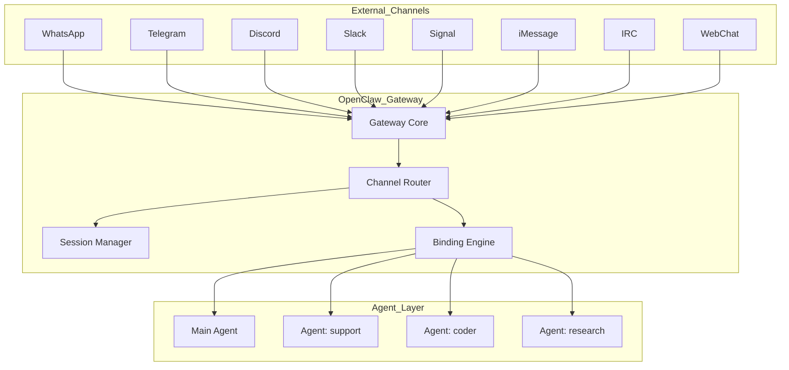
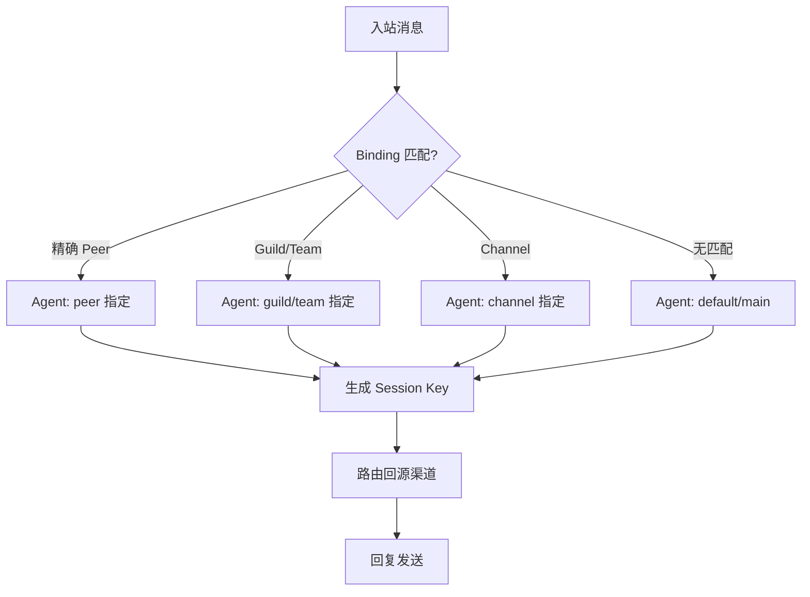

# OpenClaw 全渠道接入实战指南

> 发布日期：2026-03-16 | 分类：案例实践 | 作者：探针

## Executive Summary

OpenClaw 是目前开源 AI Agent 领域中渠道覆盖最广的框架之一，原生支持 21 个通讯平台（截至 2026 年 3 月），从大众化的 WhatsApp/Telegram 到企业级的 Microsoft Teams/Slack，再到隐私导向的 Signal，几乎覆盖了全球主流 IM 生态。本文基于 OpenClaw 官方文档和实际部署经验，深入分析各渠道的技术实现差异（Baileys / grammY / Discord Gateway / signal-cli）、统一的路由与会话隔离机制、多账号管理策略，以及企业级多渠道路由（Binding）的最佳实践。核心结论：**Telegram 是最快的入门渠道**（纯 Bot Token 即可），**WhatsApp 是用户基数最大的渠道**（但需要 QR 配对），**Signal 是隐私最强的渠道**（但依赖 signal-cli 外部进程），**Discord 是团队协作最灵活的渠道**（Guild + Forum + 线程绑定）。

## 1. 渠道全景

### 1.1 支持渠道列表（21 个）

OpenClaw 的渠道生态分为**内置渠道**和**插件渠道**两类：

**内置渠道**（开箱即用）：
| 渠道 | 技术栈 | 连接模式 | 状态 |
|------|--------|---------|------|
| WhatsApp | Baileys | WebSocket + QR 配对 | 生产就绪 |
| Telegram | grammY | Long Polling / Webhook | 生产就绪 |
| Discord | Discord.js Gateway | WebSocket | 生产就绪 |
| Slack | Bolt SDK | Socket Mode / HTTP Events | 生产就绪 |
| Signal | signal-cli | JSON-RPC + SSE | 生产就绪 |
| BlueBubbles (iMessage) | REST API | HTTP | 生产就绪 |
| iMessage (legacy) | imsg CLI | 本地 | 已弃用 |
| IRC | IRC 协议 | TCP Socket | 生产就绪 |
| WebChat | WebSocket | 内置 UI | 生产就绪 |

**插件渠道**（需单独安装）：
| 渠道 | 说明 |
|------|------|
| Feishu / Lark | 飞书/钉钉国际化版，WebSocket |
| Google Chat | Google Workspace 通讯 |
| LINE | 日本/东南亚主流 IM |
| Matrix | 去中心化通讯协议 |
| Mattermost | 开源企业 Slack 替代 |
| Microsoft Teams | 企业协作，Bot Framework |
| Nextcloud Talk | 自托管通讯 |
| Nostr | 去中心化 DM (NIP-04) |
| Synology Chat | 群晖 NAS 通讯 |
| Tlon | Urbit 通讯 |
| Twitch | 直播平台聊天 (IRC) |
| Zalo | 越南主流 IM |
| Zalo Personal | Zalo 个人账号 QR 登录 |

### 1.2 技术分类

按连接模式分类：

- **WebSocket（全双工）**：WhatsApp (Baileys)、Discord Gateway、Feishu
- **Long Polling**：Telegram (grammY runner，默认模式)
- **Webhook (HTTP)**：Telegram（可选）、Slack HTTP Mode、Google Chat、Synology Chat
- **Socket Mode**：Slack（默认，WebSocket 封装）
- **JSON-RPC + SSE**：signal-cli 进程通信
- **REST API**：BlueBubbles (iMessage)、Twitch (IRC 桥接)
- **原生 TCP**：IRC

### 1.3 架构图：渠道 → Gateway → Agent



## 2. 主流渠道深度配置

### 2.1 WhatsApp（Baileys）

**技术原理**：基于 whatsapp-web.js 生态的 Baileys 库，通过 WebSocket 模拟 WhatsApp Web 客户端。Gateway 持有 WhatsApp socket 并管理重连循环。

**配置步骤**：

```json5
{
  channels: {
    whatsapp: {
      dmPolicy: "allowlist",
      allowFrom: ["+15551234567"],
      groupPolicy: "allowlist",
      groupAllowFrom: ["+15551234567"],
    },
  },
}
```

```bash
# QR 配对
openclaw channels login --channel whatsapp

# 启动 Gateway
openclaw gateway
```

**常见坑**：
- **必须使用 Node 运行时**：Bun 对 WhatsApp 不兼容
- **QR 配对会过期**：需要定期重连
- **个人号码自聊保护**：自聊模式需显式配置 `selfChatMode: true`
- **群组历史注入**：默认缓冲 50 条未处理消息作为上下文，可通过 `historyLimit` 调整
- **媒体大小限制**：默认 50MB，超出会自动优化图片
- **凭据存储路径**：`~/.openclaw/credentials/whatsapp/<accountId>/creds.json`

### 2.2 Telegram（grammY）

**技术原理**：使用 grammY 框架（Telegram Bot API 的现代 Node.js 封装），默认 Long Polling 模式，可选 Webhook。

**配置步骤**：

1. 通过 @BotFather 创建 Bot 并获取 Token
2. 配置 OpenClaw：

```json5
{
  channels: {
    telegram: {
      enabled: true,
      botToken: "123:abc",
      dmPolicy: "pairing",
      groups: { "*": { requireMention: true } },
    },
  },
}
```

3. 启动 Gateway，发送第一条 DM 消息并审批配对码

**常见坑**：
- **Telegram 隐私模式**：默认看不到群组非命令消息，需在 @BotFather 中 `/setprivacy` 禁用，或设为群管理员
- **IPv6 连接问题**：部分 VPS 上 `api.telegram.org` 的 IPv6 解析不稳定，可通过 `dnsResultOrder: "ipv4first"` 或设置 proxy 解决
- **Bot 命令溢出**：`setMyCommands` 失败时需要减少插件/技能命令数量
- **Webhook 模式**：需要 `webhookSecret` 和公网可访问的 URL
- **Forum Topic 支持**：每个 Topic 可路由到不同 Agent（通过 `agentId`）

### 2.3 Discord（Discord.js Gateway）

**技术原理**：基于官方 Discord Gateway 协议，WebSocket 全双工通信。

**配置步骤**：

1. 在 [Discord Developer Portal](https://discord.com/developers/applications) 创建应用
2. 启用 **Message Content Intent** 和 **Server Members Intent**
3. 配置 OAuth2 权限并邀请 Bot 到服务器

```json5
{
  channels: {
    discord: {
      enabled: true,
      token: "YOUR_BOT_TOKEN",
    },
  },
}
```

**常见坑**：
- **Intent 未启用**：Message Content Intent 是必须的，否则 Bot 看不到消息内容
- **Guild 白名单**：需显式添加 Server ID 到 `guilds` 配置
- **DM 隐私设置**：需在服务器隐私设置中允许 DM
- **Group DM 默认忽略**：`dm.groupEnabled=false`，需显式开启
- **线程绑定**：支持 `/focus` 命令将线程绑定到子 Agent 会话
- **语音频道**：支持实时语音对话，需额外配置 `voice` 段

### 2.4 Signal（signal-cli）

**技术原理**：通过 signal-cli 进程提供 JSON-RPC + SSE 接口，Gateway 与其通信。

**配置步骤**：

```bash
# 安装 signal-cli
VERSION=$(curl -Ls -o /dev/null -w %{url_effective} https://github.com/AsamK/signal-cli/releases/latest | sed -e 's/^.*\/v//')
curl -L -O "https://github.com/AsamK/signal-cli/releases/download/v${VERSION}/signal-cli-${VERSION}-Linux-native.tar.gz"
sudo tar xf "signal-cli-${VERSION}-Linux-native.tar.gz" -C /opt
sudo ln -sf /opt/signal-cli /usr/local/bin/

# 注册号码（需要 SMS 验证码 + Captcha）
signal-cli -a +<BOT_PHONE_NUMBER> register --captcha '<SIGNALCAPTCHA_URL>'
signal-cli -a +<BOT_PHONE_NUMBER> verify <VERIFICATION_CODE>
```

```json5
{
  channels: {
    signal: {
      enabled: true,
      account: "+15551234567",
      cliPath: "signal-cli",
      dmPolicy: "pairing",
      allowFrom: ["+15557654321"],
    },
  },
}
```

**常见坑**：
- **需独立号码**：注册新号码会注销该号码的 Signal 主客户端
- **Captcha 流程**：需从 `signalcaptchas.org` 获取，且需在同一 IP 注册
- **Java 依赖**：若用 JVM 版本需要 JDK 24
- **旧版 signal-cli 会失效**：Signal 服务端 API 变更可能导致旧版无法使用
- **媒体大小限制**：默认仅 8MB（比其他渠道小）
- **外部守护进程模式**：可通过 `httpUrl` 指向自行管理的 signal-cli 实例

### 2.5 iMessage / BlueBubbles

**技术原理**：推荐使用 BlueBubbles（macOS 服务端 REST API），完整支持编辑、撤回、特效、表情回应。

**配置**：通过 BlueBubbles 插件安装，配置 macOS 服务端地址。

**常见坑**：
- **需要 macOS 设备**：BlueBubbles 服务端必须运行在 macOS 上
- **macOS 26 Tahoe**：编辑功能在最新 macOS 上暂时不可用
- **旧版 iMessage（imsg CLI）已弃用**：新部署应使用 BlueBubbles

### 2.6 Slack

**技术原理**：基于 Slack Bolt SDK，默认 Socket Mode（WebSocket 封装），可选 HTTP Events API 模式。

**配置步骤**：

1. 创建 Slack App 并启用 Socket Mode
2. 创建 App Token（`xapp-...`）和 Bot Token（`xoxb-...`）
3. 订阅事件：`app_mention`, `message.channels/groups/im/mpim` 等

```json5
{
  channels: {
    slack: {
      enabled: true,
      mode: "socket",
      appToken: "xapp-...",
      botToken: "xoxb-...",
    },
  },
}
```

**常见坑**：
- **Socket Mode vs HTTP Mode**：Socket Mode 无需公网暴露，但 HTTP Mode 更适合企业部署
- **Native Commands 默认关闭**：Slack 的 `commands.native: "auto"` 不会自动启用，需显式 `true`
- **Streaming 支持**：通过 Agents and AI Apps API 实现原生流式输出
- **Thread 历史继承**：默认不继承父频道上下文（`thread.inheritParent: false`）

## 3. 多渠道统一管理

### 3.1 Binding 路由：不同渠道 → 不同 Agent

OpenClaw 的 Binding 引擎支持精细的路由规则，匹配优先级如下：

1. **精确 Peer 匹配**（`peer.kind` + `peer.id`）
2. **父 Peer 匹配**（线程继承）
3. **Guild + Roles 匹配**（Discord）
4. **Guild 匹配**（Discord）
5. **Team 匹配**（Slack）
6. **Account 匹配**
7. **Channel 匹配**
8. **默认 Agent**

配置示例：

```json5
{
  agents: {
    list: [
      { id: "support", name: "客服", workspace: "~/.openclaw/workspace-support" },
      { id: "coder", name: "代码", workspace: "~/.openclaw/workspace-coder" },
      { id: "main", name: "主编", workspace: "~/.openclaw/workspace-chief-editor", default: true },
    ],
  },
  bindings: [
    // Slack 某个 Team → support Agent
    { match: { channel: "slack", teamId: "T123" }, agentId: "support" },
    // Telegram 某个群 → support Agent
    { match: { channel: "telegram", peer: { kind: "group", id: "-100123" } }, agentId: "support" },
    // Discord 某角色 → coder Agent
    { match: { channel: "discord", guildId: "456", roles: ["789"] }, agentId: "coder" },
  ],
}
```

### 3.2 多账号管理

每个渠道支持多账号实例，通过 `accounts` 配置管理：

```json5
{
  channels: {
    whatsapp: {
      accounts: {
        personal: { dmPolicy: "allowlist", allowFrom: ["+15551111111"] },
        work: { dmPolicy: "allowlist", allowFrom: ["+15552222222"] },
      },
      defaultAccount: "personal",
    },
    telegram: {
      accounts: {
        bot1: { botToken: "TOKEN_1" },
        bot2: { botToken: "TOKEN_2" },
      },
    },
  },
}
```

**关键规则**：当配置了两个或以上账号时，必须设置 `defaultAccount` 或 `accounts.default`，否则回退路由可能选择第一个归一化的账号 ID。

### 3.3 会话隔离与上下文管理

OpenClaw 的会话键（Session Key）决定了上下文如何隔离：

| 场景 | Session Key 格式 | 说明 |
|------|-----------------|------|
| 私聊 (DM) | `agent:<agentId>:main` | 默认合并到主会话 |
| 群组 | `agent:<agentId>:<channel>:group:<id>` | 每个群独立 |
| Discord 频道 | `agent:<agentId>:discord:channel:<id>` | 每个频道独立 |
| Slack 线程 | `agent:<agentId>:slack:channel:<id>:thread:<ts>` | 线程独立 |
| Telegram Topic | `agent:<agentId>:telegram:group:<id>:topic:<topicId>` | Topic 独立 |

**Broadcast Groups**：允许同一 Peer 运行多个 Agent（并行处理）：

```json5
{
  broadcast: {
    strategy: "parallel",
    "120363403215116621@g.us": ["alfred", "baerbel"],
    "+15555550123": ["support", "logger"],
  },
}
```

### 3.4 多渠道路由流程



## 4. 企业级场景

### 4.1 客服机器人多渠道部署

**场景**：一个客服 Agent 同时接入 WhatsApp Business、Telegram、Discord 和 Slack。

**配置要点**：

- 每个渠道配置独立的 `allowFrom` 和 `groupPolicy`
- 使用统一的 Agent workspace 保持客服知识库一致
- 通过 `ackReaction` 给用户即时反馈（如 👀 表示正在处理）
- 利用 `streaming: "partial"` 在 Telegram/Discord/Slack 上实现实时打字效果

**安全考量**：
- `dmPolicy` 在生产环境使用 `allowlist` 或 `pairing`，避免 `open`
- WhatsApp 建议使用专用号码，避免个人号码混用
- Bot Token 和 API Key 通过环境变量或 SecretRef 管理

### 4.2 团队协作多平台同步

**场景**：开发团队在 Discord 和 Slack 上同时使用 AI 编码助手。

**配置要点**：
- Discord Forum Channel 的每个帖子自动路由到 Agent 线程会话
- 通过 `/focus` 命令将线程绑定到子 Agent（如 coder）
- Slack Thread 支持线程会话隔离
- 使用 `execApprovals` 在 Telegram/Discord 审批敏感命令

### 4.3 安全与合规考虑

- **DM 配对**：所有渠道默认启用 `pairing` 模式，新发件人需审批
- **群组白名单**：通过 `groups` 配置明确允许的群组 ID
- **命令审计**：通过 `execApprovals` 实现聊天内命令审批
- **数据隔离**：每个 Agent 有独立的 workspace 和 session 存储
- **权限最小化**：Discord OAuth2 只授予必要权限，避免 `Administrator`

## 5. 故障排查

### 5.1 各渠道常见问题

| 渠道 | 问题 | 解决方案 |
|------|------|---------|
| WhatsApp | 未链接 (QR required) | `openclaw channels login --channel whatsapp` |
| WhatsApp | 频繁断连重连 | `openclaw doctor` + 检查网络稳定性 |
| Telegram | 群消息无响应 | 检查 `requireMention` 和 `/setprivacy` 设置 |
| Telegram | API 请求失败 | 检查 IPv6/Proxy 配置，`dnsResultOrder: "ipv4first"` |
| Discord | 未启用 Intent | Developer Portal → Bot → Privileged Gateway Intents |
| Discord | Guild 消息被拦截 | 检查 `groupPolicy` + `guilds` 白名单配置 |
| Signal | daemon 不可达 | 检查 `signal-cli` 进程状态，`httpUrl` 配置 |
| Signal | 注册失败 | 获取新 Captcha + 同 IP 重新注册 |
| Slack | Socket Mode 未连接 | 验证 `appToken` 和 Socket Mode 启用状态 |
| Slack | 频道消息被屏蔽 | 检查 `channels` 白名单和 `requireMention` |

### 5.2 连接稳定性优化

- **WhatsApp**：使用 Node 运行时（非 Bun），确保网络稳定
- **Telegram**：配置 Proxy（`channels.telegram.proxy: "socks5://..."`）应对网络不稳定
- **Discord**：调整 `eventQueue.listenerTimeout`（默认 30s 可能太短）和 `inboundWorker.runTimeoutMs`
- **Signal**：使用外部守护进程模式（`httpUrl`）避免冷启动延迟
- **通用**：设置合理的 `retry` 策略和 `textChunkLimit`

### 5.3 监控与告警

```bash
# 查看渠道状态
openclaw channels status

# 探针模式（详细检查权限和连接）
openclaw channels status --probe

# 实时日志
openclaw logs --follow

# 健康检查
openclaw doctor
```

**建议的监控实践**：
- 定期运行 `openclaw doctor` 检查配置健康度
- 监控 `openclaw logs` 中的 reconnect/timeout 关键词
- 为关键渠道配置多个独立 Agent 作为冗余

## 参考来源

1. OpenClaw 官方文档 — Chat Channels 索引. https://docs.openclaw.ai/channels
2. OpenClaw 官方文档 — Channel Routing（路由与会话管理）. https://docs.openclaw.ai/channels/channel-routing
3. OpenClaw 官方文档 — WhatsApp 频道配置（Baileys）. https://docs.openclaw.ai/channels/whatsapp
4. OpenClaw 官方文档 — Telegram 频道配置（grammY）. https://docs.openclaw.ai/channels/telegram
5. OpenClaw 官方文档 — Discord 频道配置. https://docs.openclaw.ai/channels/discord
6. OpenClaw 官方文档 — Signal 频道配置（signal-cli）. https://docs.openclaw.ai/channels/signal
7. OpenClaw 官方文档 — Slack 频道配置. https://docs.openclaw.ai/channels/slack
8. OpenClaw 官方文档 — Pairing（配对与审批机制）. https://docs.openclaw.ai/channels/pairing
9. Baileys — WhatsApp Web API Library. https://github.com/WhiskeySockets/Baileys
10. grammY — Telegram Bot Framework. https://grammy.dev/
11. signal-cli — Signal CLI 客户端. https://github.com/AsamK/signal-cli
12. BlueBubbles — iMessage macOS 服务端. https://bluebubbles.app/

