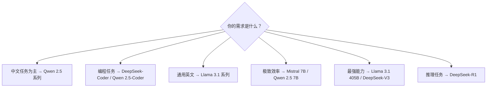
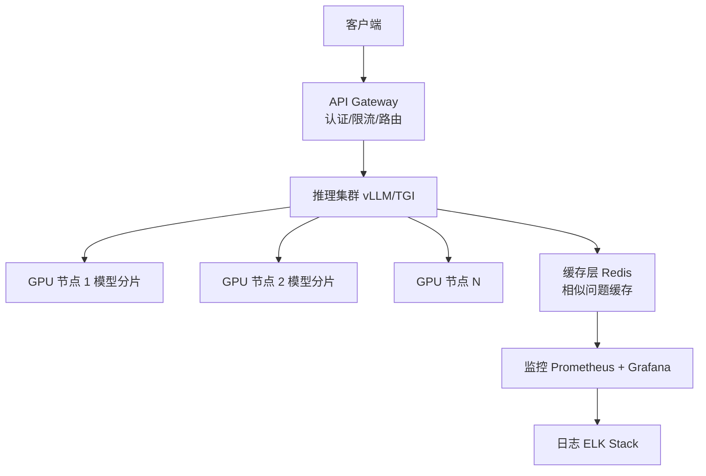

# 开源大模型部署实战指南

> **发布日期**: 2025年3月  
> **分类**: 案例实践  
> **字数**: ~4500字

---

## Executive Summary

开源大模型已从"学术研究"走向"生产可用"。以 Llama 3、Qwen 2.5、DeepSeek、Mistral 为代表的开源模型在多项基准上接近甚至超越部分闭源模型。本文提供一份实战导向的部署指南，涵盖模型选择、部署方式对比、推理优化技术和成本分析。

核心发现：
- **Llama 3.1 405B 是开源旗舰**：在多个基准上接近 GPT-4 水平，但部署门槛高
- **DeepSeek-V3 性价比极高**：以极低成本训练，性能出色，中国团队技术实力强劲
- **量化技术是关键**：GPTQ/AWQ/GGUF 量化让大模型可以在消费级硬件运行
- **vLLM 是当前推理框架首选**：PagedAttention 技术显著提升吞吐量
- **私有化部署的 TCO 远高于 API**：但数据隐私和定制化需求使其不可或缺

---

## 1. 主流开源模型概览

### 1.1 Meta Llama 3 系列

**Llama 3 / 3.1（2024）**

Meta 的 Llama 系列是当前最流行的开源模型家族：

| 模型 | 参数量 | Context | 发布时间 | 主要特点 |
|------|-------|---------|---------|---------|
| Llama 3 8B | 8B | 8K | 2024.04 | 轻量级，消费级硬件可运行 |
| Llama 3 70B | 70B | 8K | 2024.04 | 性能均衡 |
| Llama 3.1 8B | 8B | 128K | 2024.07 | 扩展上下文 |
| Llama 3.1 70B | 70B | 128K | 2024.07 | 扩展上下文 |
| Llama 3.1 405B | 405B | 128K | 2024.07 | 开源最大，接近 GPT-4 |

**Llama 3.1 405B 的意义**：这是首个在主流基准上接近 GPT-4 水平的开源模型。在 MMLU（87.3%）、HumanEval（61.0%）等基准上展现了强大能力。¹

**许可**：Llama 3.1 采用 Meta 的自定义许可，允许商业使用（月活超 7 亿用户需申请特殊许可）。

### 1.2 Qwen 2.5（通义千问）

**阿里巴巴 Qwen 团队** 推出的 Qwen 2.5 系列在中文场景表现突出：

- **Qwen 2.5 7B/14B/32B/72B**：覆盖从轻量到旗舰的全系列
- **Qwen 2.5-Coder**：专门优化的编程模型
- **Qwen 2.5-Math**：数学推理增强

**特色优势**：
- 中文能力行业领先
- 支持 128K context
- 提供 GGUF 量化版本（llama.cpp 兼容）
- Apache 2.0 许可，商业友好

### 1.3 DeepSeek（深度求索）

**DeepSeek-V3 / DeepSeek-R1**

中国团队 DeepSeek 以惊人的效率训练出了高质量模型：

- **DeepSeek-V3**：671B MoE 架构（37B 激活参数），在多个基准上与 GPT-4o 和 Claude 3.5 Sonnet 竞争
- **DeepSeek-R1**：专注推理，与 OpenAI o1 竞争
- **训练成本**：DeepSeek-V3 据报告训练成本仅约 558 万美元（使用 H800 GPU），远低于同级模型²

**开源许可**：MIT 许可，商业使用最友好。

### 1.4 Mistral

**法国 AI 公司 Mistral** 推出的模型以效率著称：

- **Mistral 7B**：首个证明 7B 模型可以超越 Llama 2 13B 的模型
- **Mixtral 8x7B / 8x22B**：MoE 架构，在效率和性能之间取得平衡
- **Mistral Large / Medium**：闭源但通过 API 提供

**特色**：模型小但高效，非常适合资源受限的部署场景。

### 1.5 模型选择决策树



---

## 2. 部署方式对比

### 2.1 本地部署

**适用场景**：数据高度敏感、网络延迟要求极低、离线环境

**硬件要求**（以 FP16 推理为基准）：

| 模型大小 | 最低 GPU | 推荐 GPU | 内存需求 |
|---------|---------|---------|---------|
| 7B | 1x RTX 3090 (24GB) | 1x RTX 4090 | 16GB+ |
| 13B | 1x A100 (40GB) | 1x A100 (80GB) | 32GB+ |
| 70B | 2x A100 (80GB) | 4x A100 (80GB) | 128GB+ |
| 405B | 8x A100 (80GB) | 8x H100 | 512GB+ |

**量化后**：INT4 量化可将显存需求降低约 75%，7B 模型可在单张 RTX 3060 12GB 上运行。

**优势**：数据完全私有、无 API 费用、可深度定制
**劣势**：硬件投入大、运维复杂、性能可能不如云端优化版本

### 2.2 云端部署

**主要云平台选项**：

| 平台 | 特点 | 适合 |
|------|------|------|
| AWS SageMaker | 托管推理端点，自动扩缩 | 企业级部署 |
| Google Vertex AI | 与 GCP 生态集成 | GCP 用户 |
| Azure ML | 与微软生态集成 | 企业用户 |
| 阿里云 PAI | 中文模型优化 | 中文场景 |
| Modal / Replicate | 按需付费，开发者友好 | 中小团队 |

**优势**：弹性扩展、免运维、快速启动
**劣势**：持续成本、数据传输、供应商锁定

### 2.3 边缘部署

**适用场景**：移动端、IoT 设备、离线场景

**技术方案**：
- **ONNX Runtime**：跨平台推理引擎
- **llama.cpp**：CPU 优化，支持多种量化格式
- **MLC LLM**：移动端优化框架
- **Ollama**：一键本地运行，支持多平台

**模型选择**：1B-7B 量化模型
**性能参考**：7B INT4 模型在 Apple M2 上可达到约 15-20 tokens/sec

---

## 3. 量化技术与推理优化

### 3.1 量化技术对比

量化是降低模型显存需求和推理成本的核心技术：

| 量化方法 | 精度 | 显存节省 | 质量损失 | 工具支持 |
|---------|------|---------|---------|---------|
| FP16 | 16-bit | 基准 | 无 | 所有 |
| GPTQ | 4-bit | ~75% | 轻微 | AutoGPTQ, vLLM |
| AWQ | 4-bit | ~75% | 轻微 | AutoAWQ, vLLM |
| GGUF | 4-bit (Q4_K_M) | ~75% | 轻微 | llama.cpp, Ollama |
| EXL2 | 2-6 bit | 50-87% | 可变 | ExLlamaV2 |
| AQLM | 2-bit | ~87% | 中等 | 实验性 |

**推荐**：AWQ 和 GPTQ 是生产环境的主流选择；GGUF/llama.cpp 适合个人和边缘部署。

### 3.2 推理框架对比

| 框架 | 核心技术 | 优势 | 劣势 |
|------|---------|------|------|
| **vLLM** | PagedAttention, Continuous Batching | 吞吐量最高, OpenAI 兼容 API | 仅 GPU, 配置复杂 |
| **TGI** (Text Generation Inference) | Flash Attention, Continuous Batching | HuggingFace 生态, 生产稳定 | 功能不如 vLLM 丰富 |
| **TensorRT-LLM** | NVIDIA 优化 | 极致性能 | 仅 NVIDIA GPU, 部署复杂 |
| **llama.cpp** | CPU/GPU 混合推理 | 跨平台, 低门槛 | 吞吐量低于 GPU 专用框架 |
| **Ollama** | 基于 llama.cpp | 一键部署, 开发者友好 | 不适合高并发生产 |
| **SGLang** | RadixAttention | 复杂 Prompt 高效处理 | 较新, 生态小 |

**推荐**：
- **生产环境高并发**：vLLM
- **HuggingFace 生态集成**：TGI
- **极致性能**：TensorRT-LLM
- **个人开发/原型**：Ollama

### 3.3 vLLM 部署示例

```bash
# 安装 vLLM
pip install vllm

# 启动服务（OpenAI 兼容 API）
python -m vllm.entrypoints.openai.api_server \
    --model meta-llama/Llama-3.1-8B-Instruct \
    --tensor-parallel-size 1 \
    --max-model-len 8192 \
    --gpu-memory-utilization 0.9
```

vLLM 的 PagedAttention 技术通过将 KV Cache 分页管理，减少显存碎片，可将吞吐量提升 2-4 倍。³

---

## 4. 企业私有化部署方案

### 4.1 架构设计

典型的私有化部署架构：



### 4.2 关键设计决策

**模型选择**：根据场景选择合适大小的模型，不要盲目追求大模型
- 简单问答/分类：7B 足够
- 文档分析/总结：13B-32B
- 复杂推理/编程：70B+

**高可用**：
- 多节点部署，负载均衡
- 模型预热（避免首次请求延迟）
- 降级策略（主模型不可用时切换到备用模型）

**安全**：
- API 认证（JWT/OAuth）
- 输入输出过滤（敏感信息脱敏）
- 审计日志

### 4.3 RAG + 私有模型的组合

最常见的私有化部署模式是"私有模型 + RAG"：

1. 用户提问
2. 从向量数据库检索相关文档
3. 构建 Prompt（问题 + 检索到的文档）
4. 私有模型生成回答
5. 返回答案及来源

这种组合在保证数据隐私的同时，提升了回答的准确性和时效性。

---

## 5. 成本对比分析

### 5.1 成本构成

**API 调用（如 OpenAI GPT-4o）**
- 无前期投入
- 按量付费：input $2.50/1M tokens, output $10.00/1M tokens
- 适合：流量波动大、初期验证

**自建 GPU 服务器**
- 前期投入：服务器硬件 + 部署配置
- 持续成本：电费、运维、折旧
- 适合：稳定高流量、数据隐私要求高

**云 GPU 实例**
- 按需付费，弹性扩展
- A100 实例约 $2-4/小时
- 适合：中等流量、弹性需求

### 5.2 成本对比模型

假设场景：每月处理 10 亿 tokens（约 7.5 亿英文单词）

| 方案 | 月成本估算 | 前期投入 | 备注 |
|------|-----------|---------|------|
| OpenAI GPT-4o API | ~$12,500 | $0 | 简单但数据外传 |
| OpenAI GPT-4o mini API | ~$750 | $0 | 能力有限制 |
| 云 GPU (A100 x2) | ~$4,000-6,000 | $0 | vLLM 70B |
| 自建 (A100 x2) | ~$1,500-2,000 | $30,000-50,000 | 含电费和运维 |
| 本地消费级 (4090 x4) | ~$500-800 | $8,000-12,000 | 量化后 70B 或 13B FP16 |

> 注：以上为粗略估算，实际成本取决于并发量、延迟要求、模型选择等因素。

### 5.3 TCO 考虑因素

除了直接的计算成本，还需要考虑：

- **人力成本**：MLOps 工程师薪资（$100K-200K+/年）
- **机会成本**：自建需要时间，API 可以立即使用
- **隐性成本**：硬件故障、版本升级、安全补丁
- **可扩展性**：流量突增时的应对能力

**经验法则**：如果月 API 费用持续超过 $10,000-20,000，值得考虑自建方案。

---

## 实践建议

### 快速起步

1. **从 Ollama 开始**：一行命令运行开源模型，验证效果
2. **用 vLLM 部署生产服务**：支持 OpenAI 兼容 API，迁移成本低
3. **从 7B/13B 开始**：先验证业务可行性，再考虑大模型

### 模型选择

1. **中文场景选 Qwen 2.5**：中文理解和生成质量最高
2. **英文通用选 Llama 3.1**：生态最成熟，工具支持最好
3. **编程场景选 DeepSeek-Coder / CodeLlama**：专门优化的编程能力
4. **极致性价比选 DeepSeek-V3**：MoE 架构，37B 激活参数达到旗舰水平

### 性能优化

1. **量化是必须的**：除非你有充足的 GPU 资源
2. **连续批处理**：vLLM 的 Continuous Batching 显著提升吞吐量
3. **KV Cache 优化**：PagedAttention 减少显存碎片
4. **投机解码**：用小模型加速大模型推理

### 运维要点

1. **监控一切**：GPU 利用率、推理延迟、吞吐量、错误率
2. **版本管理**：模型版本、配置版本、prompt 版本都要管理
3. **A/B 测试**：新模型部署前进行灰度测试
4. **容量规划**：根据业务增长预测 GPU 需求

---

## 参考来源

1. Meta. "The Llama 3 Herd of Models." July 2024. https://ai.meta.com/research/publications/the-llama-3-herd-of-models/
2. DeepSeek-AI. "DeepSeek-V3 Technical Report." December 2024. https://github.com/deepseek-ai/DeepSeek-V3
3. Kwon W et al. "Efficient Memory Management for Large Language Model Serving with PagedAttention." SOSP 2023.
4. vLLM Documentation. https://docs.vllm.ai/
5. Ollama. https://ollama.com/
6. Mistral AI. https://mistral.ai/

---

*本报告基于截至 2025 年 2 月的公开信息编写。开源模型和部署工具更新迅速，部分信息可能已有变化。*