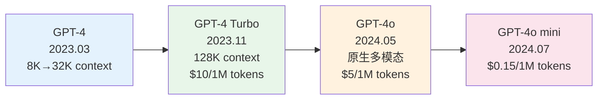

# OpenAI 产品生态深度拆解

> **发布日期**: 2025年3月  
> **分类**: 案例实践  
> **字数**: ~4500字

---

## Executive Summary

OpenAI 从 2022 年底推出 ChatGPT 以来，已经构建了业界最完整的 AI 产品生态。本文深度拆解其模型演进路线（GPT-4o → o1 → o3）、API 产品线定价策略、GPTs/Assistants API/Store 生态系统、开发者生态与插件体系，以及在 Anthropic、Google、Meta 等竞争者环伺下的竞争格局。

核心发现：
- **模型路线图清晰**：GPT-4o 主攻多模态通用场景，o1/o3 系列专注深度推理，两条线并行发展
- **定价策略激进**：通过持续降价（GPT-4o mini 降至 $0.15/1M input tokens）抢占市场，同时高价值推理模型维持溢价
- **生态锁定效应强**：GPTs Store + Assistants API 形成"平台效应"，开发者迁移成本高
- **竞争压力加剧**：Claude 3.5 在编程领域超越 GPT-4，Gemini 在多模态场景具备原生优势

---

## 1. 模型演进路线

### 1.1 GPT-4 系列：从旗舰到普惠

GPT-4 于 2023 年 3 月发布，标志着大语言模型从"能用"到"好用"的跨越。其后续演进可以分为三个阶段：

**GPT-4 系列演进路线：**

> **图1.1 GPT-4 系列演进**：从 2023 年 3 月的 GPT-4 到 2024 年 7 月的 GPT-4o mini，经历四次迭代——context 从 8K 扩展到 128K，支持原生多模态（文本+图像+音频），价格从 $30/1M 降至 $0.15/1M，性能和可及性实现了质的飞跃。

**第一阶段：GPT-4 → GPT-4 Turbo（2023.03 - 2023.11）**

GPT-4 初始版本支持 8K context，后续扩展到 32K。2023 年 11 月 DevDay 发布 GPT-4 Turbo，将 context 扩展到 128K tokens，知识截止日期更新到 2023 年 4 月，同时价格大幅下降——input tokens 从 $30/1M 降至 $10/1M。

**第二阶段：GPT-4o（2024.05）**

"GPT-4o"中的"o"代表"omni"（全能），是 OpenAI 首个原生多模态模型。与之前"先识别图像再用文本处理"的管线式方案不同，GPT-4o 可以同时处理文本、图像和音频输入，输出文本和音频。关键特性：

- **语音对话延迟降至 232-320 毫秒**，接近人类对话节奏
- **视觉理解能力显著提升**，可以直接"看懂"图表、文档、UI 界面
- **音频理解**：可以识别情绪、语调、背景噪音
- **定价更亲民**：input $5/1M tokens，output $15/1M tokens

根据 OpenAI 官方数据，GPT-4o 在多项基准测试中与 GPT-4 Turbo 持平或超越，同时速度快 2 倍、价格便宜 50%。¹

**第三阶段：GPT-4o mini（2024.07）**

取代 GPT-3.5 Turbo 的定位，GPT-4o mini 将高质量 AI 的价格门槛拉到新低：input $0.15/1M tokens。这使得之前因成本无法使用 GPT-4 级别能力的场景（如大规模文档处理、实时聊天）变得经济可行。

### 1.2 o 系列：推理模型的独立路线

2024 年 9 月，OpenAI 发布了 o1 模型，开创了"推理模型"（Reasoning Model）这一新品类。这标志着一个重要转变：从"快速回答"到"深度思考"。

**o1（2024.09）**

o1 模型在回答前会生成内部"思维链"（Chain of Thought），在数学、编程、科学推理等任务上实现了质的飞跃：

- **AIME 2024 数学竞赛**：o1 得分 83.3%，GPT-4o 仅 13.4%
- **GPQA Diamond（研究生级科学问题）**：o1 达到 78%，接近人类博士水平（81%）
- **Codeforces 编程竞赛**：o1 达到 89 百分位

但代价是：推理时间长（复杂问题可能需要数十秒到数分钟）、成本高（reasoning tokens 计费但不展示）、不适合需要快速响应的场景。²

**o1-mini（2024.09）**

针对 STEM 推理优化的轻量版本，价格仅为 o1 的 1/20，适合编程和数学场景。

**o3 / o3-mini（2025.01）**

o3 在 o1 基础上进一步提升推理能力，在 ARC-AGI 基准上取得了突破性成绩（高计算模式下达到 88%），展示了通向 AGI 的潜在路径。o3-mini 则提供了推理能力和成本之间的新平衡点。

### 1.3 模型定位矩阵

| 模型 | 定位 | 最佳场景 | Input Price (per 1M tokens) |
|------|------|---------|---------------------------|
| GPT-4o | 旗舰多模态 | 通用对话、视觉理解、实时交互 | $2.50 |
| GPT-4o mini | 经济通用 | 大规模处理、简单任务 | $0.15 |
| o1 | 深度推理 | 数学、科学、复杂编程 | $15.00 |
| o1-mini | STEM 推理 | 编程、数学 | $3.00 |
| o3 | 超强推理 | 前沿研究、最复杂问题 | 待公布 |
| o3-mini | 平衡推理 | 高质量推理但需控制成本 | $1.10 |

> 注：价格截至 2025 年 1 月，可能已调整。请参考 [OpenAI Pricing](https://openai.com/api/pricing/) 获取最新信息。

---

## 2. API 产品线与定价策略

### 2.1 核心 API 产品

OpenAI 的 API 产品线已从单一的 Chat Completion 扩展为完整的 AI 基础设施：

**Chat Completions API**
最核心的产品，支持文本和图像输入、文本输出。支持 function calling、JSON mode、结构化输出等功能。

**Assistants API**
更高层的抽象，提供持久化线程（Threads）、文件搜索（File Search）、代码解释器（Code Interpreter）和自定义函数。开发者无需自己管理对话状态和检索逻辑。

**Embeddings API**
提供 text-embedding-3-small 和 text-embedding-3-large 模型，支持自定义维度，用于 RAG、聚类、分类等场景。

**Image API**
DALL·E 3 图像生成，支持不同尺寸和质量等级。

**Audio API**
Whisper 语音转文字（$0.006/分钟）和 TTS 文字转语音。

**Moderation API**
免费的内容审核 API，用于检测有害内容。

### 2.2 定价策略分析

OpenAI 的定价策略呈现出明显的"双轨制"特征：

**普惠路线**：通过 GPT-4o mini 等低价模型覆盖长尾市场。自 2023 年以来，同等能力的模型价格下降了超过 90%。这一策略直接回应了来自 Meta（Llama 系列开源）、Google（Gemini Flash）和 Mistral 的价格竞争。

**高端溢价**：o1/o3 系列推理模型维持高定价，针对愿意为极致能力付费的用户（科研、金融分析、复杂工程）。OpenAI 的逻辑是：如果一个问题需要 10 分钟的深度推理来替代 2 小时的人工分析，那么 $1-5 的 API 成本是值得的。

**平台锁定**：Assistants API、GPTs Store 等高层服务构建开发者生态，增加迁移成本。一旦企业基于 Assistants API 构建了内部工具链，切换到其他提供商的成本就不仅仅是模型调用的重写。

---

## 3. GPTs / Assistants API / Store 生态

### 3.1 GPTs：低代码 AI 应用

2023 年 11 月 DevDay 发布的 GPTs 允许用户通过自然语言指令创建定制化的 ChatGPT 版本。无需编程，只需描述角色、上传知识文件、配置动作（Actions，即 API 调用）。

**GPT Store（2024 年 1 月上线）**

类似于 App Store 的分发模式，用户可以公开分享自己创建的 GPTs。OpenAI 按使用量向 GPTs 创建者分成（基于广告收入的激励计划）。

但实际效果不如预期：
- 大量低质量 GPTs 导致发现困难
- 缺乏深度功能定制（不能修改模型参数）
- 企业用户更倾向于直接调用 API 而非通过 GPTs

### 3.2 Assistants API：开发者的首选

对于专业开发者，Assistants API 提供了更强大的能力：

- **持久化状态**：Threads 自动管理对话历史，开发者无需自行存储
- **文件搜索**：内置向量检索，自动处理文档分块和嵌入
- **代码解释器**：沙盒环境中执行 Python 代码，支持文件生成
- **函数调用**：与外部 API 和数据库集成

Assistants API v2（2024 年 4 月）引入了改进的文件搜索（支持向量存储管理）、并行工具调用等特性。

### 3.3 生态系统评价

OpenAI 的生态策略可以用"纵向整合"来概括：从底层模型（GPT-4o/o1）到中间件（Assistants API）到应用层（GPTs Store），形成完整的价值链。

**优势**：
- 开发者入门门槛低（尤其是 GPTs）
- 文档和社区支持完善
- 模型更新无缝集成

**风险**：
- 过度依赖单一供应商
- 定价调整完全由 OpenAI 控制
- 企业数据隐私和合规问题

---

## 4. 开发者生态与插件体系

### 4.1 插件体系的演变

OpenAI 的插件体系经历了几个阶段：

**Plugin Era（2023.03 - 2024）**：最初以 ChatGPT 插件的形式推出，允许第三方服务接入 ChatGPT。但由于发现和使用体验不佳，OpenAI 逐步将重心转向 GPTs 的 Actions 和 Assistants API。

**Function Calling（2023.06 至今）**：这是开发者最广泛使用的集成方式。模型可以在对话中选择调用预定义的函数，返回结构化参数。从最初的单次调用发展到并行调用、强制调用等模式。

**Structured Outputs（2024.08）**：确保模型输出严格符合 JSON Schema，解决了之前"输出偶尔不符合格式"的问题。

### 4.2 开发者工具链

- **官方 SDK**：Python 和 Node.js SDK，保持更新
- **Playground**：网页端的交互式测试环境
- **Evals 框架**：开源的模型评估工具
- **Batch API**：异步批量处理，50% 折扣
- **Fine-tuning API**：支持 GPT-4o、GPT-4o mini 的微调

### 4.3 社区与学习资源

OpenAI 的开发者社区是业界最活跃的之一：
- OpenAI Developer Forum
- 官方 Cookbook（GitHub 开源示例）
- OpenAI Academy（学习资源）
- 各类第三方教程和课程

---

## 5. 竞争格局与未来方向

### 5.1 主要竞争对手

**Anthropic Claude**
- Claude 3.5 Sonnet 在编程任务上超越 GPT-4o³
- Constitutional AI 安全理念受到重视
- 100K-200K 长上下文是差异化优势
- 企业市场增长迅速

**Google Gemini**
- Gemini 2.0 原生多模态（文本/图像/音频/视频）
- Google 生态集成（Search、Workspace、Android）
- 价格极具竞争力
- 但 API 稳定性和开发者体验落后于 OpenAI

**Meta Llama**
- 开源策略吸引大量开发者
- Llama 3.1 405B 接近 GPT-4 级别
- 企业可以私有部署，不受供应商锁定
- 但缺乏原生的多模态和推理能力

**Mistral / DeepSeek / Qwen**
- 欧洲（Mistral）、中国（DeepSeek、Qwen）的区域性竞争者
- 在特定任务上接近前沿水平
- 更灵活的许可和定价

### 5.2 OpenAI 的未来方向

根据公开信息和行业分析，OpenAI 的战略方向可能包括：

1. **Agent 化**：从"问答"走向"自主执行"，o1/o3 的推理能力是 Agent 的基础
2. **多模态深度融合**：视频理解、3D 理解、实时视频交互
3. **垂直行业深耕**：医疗、法律、金融等领域的专用模型和解决方案
4. **搜索与信息产品**：ChatGPT Search 直接挑战 Google
5. **硬件探索**：与 Jony Ive 合作的 AI 硬件设备

### 5.3 风险与不确定性

- **监管风险**：欧盟 AI 法案、美国行政命令等法规可能增加合规成本
- **人才竞争**：核心研究员频繁流失到竞争对手或自立门户
- **盈利压力**：据报道，OpenAI 2024 年亏损约 50 亿美元，盈利模式仍在探索⁴
- **技术路线风险**：Scaling Law 是否持续有效仍有争议

---

## 实践建议

### 对于开发者

1. **模型选择策略**：简单任务用 GPT-4o mini，复杂推理用 o1/o3，避免"大炮打蚊子"
2. **利用 Structured Outputs**：确保输出格式稳定，减少后处理逻辑
3. **监控成本**：使用 Batch API 处理非实时任务，可节省 50%
4. **不要过度绑定**：设计抽象层，保持模型提供商的可切换性

### 对于企业决策者

1. **评估总拥有成本（TCO）**：API 费用只是冰山一角，还需考虑集成、维护、合规成本
2. **数据策略**：明确哪些数据可以发送给外部 API，哪些必须私有处理
3. **多供应商策略**：关键业务系统不应依赖单一 AI 提供商
4. **关注 Assistants API vs 自建 RAG**：简单场景用 Assistants API 快速起步，复杂场景考虑自建

### 对于产品经理

1. **理解能力边界**：GPT-4o 不擅长实时信息、o1 不适合低延迟场景
2. **设计降级策略**：API 不可用时的用户处理方案
3. **关注用户体验**：o1 的推理延迟需要在 UI 层面做适当处理

---

## 参考来源

1. OpenAI. "GPT-4o System Card." OpenAI Research, May 2024. https://openai.com/index/gpt-4o-system-card/
2. OpenAI. "Learning to Reason with LLMs." OpenAI Research, September 2024. https://openai.com/index/learning-to-reason-with-llms/
3. Anthropic. "Claude 3.5 Sonnet Model Card." Anthropic Research, June 2024. https://www.anthropic.com/news/claude-3-5-sonnet
4. The Information. "OpenAI Expects $5 Billion Loss This Year." September 2024.
5. OpenAI API Documentation. https://platform.openai.com/docs/
6. OpenAI Pricing. https://openai.com/api/pricing/

---

## 术语表

| 术语 | 说明 |
|------|------|
| Tokens | 模型处理文本的基本单位，约 1000 tokens ≈ 750 英文单词 |
| Context Window | 模型单次能处理的最大 token 数量 |
| Reasoning Tokens | o1/o3 模型内部思考过程消耗的 tokens |
| Function Calling | 模型调用预定义函数的能力 |
| Structured Outputs | 确保模型输出符合指定 JSON Schema |

---

*本报告基于截至 2025 年 1 月的公开信息编写。AI 领域发展迅速，部分数据可能已有更新。*
