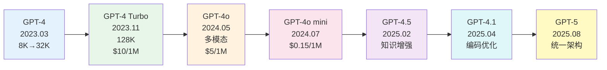
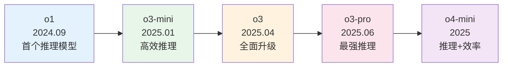

# OpenAI 产品生态深度拆解

> **发布日期**: 2025年3月 · **重大更新**: 2026年3月
> **分类**: 案例实践
> **字数**: ~5500字

---

## Executive Summary

OpenAI 从 2022 年底推出 ChatGPT 以来，已经构建了业界最完整的 AI 产品生态。本文深度拆解其模型演进路线（GPT-4o → GPT-4.5 → GPT-4.1 → o3 → GPT-5）、API 产品线定价策略、GPTs/Assistants API/Store 生态系统、开发者生态与插件体系，以及在 Anthropic、Google、Meta、DeepSeek 等竞争者环伺下的竞争格局。

核心发现：
- **模型路线图全面扩展**：GPT-4o → GPT-4.5 → GPT-4.1 → GPT-5 构成通用模型主干，o1 → o3 → o3-pro 构成推理专用线，两条线并行发展
- **定价持续下探**：GPT-4.1 mini 取代 GPT-4o mini 成为新经济模型，同时推出 nano 版本进一步降低门槛
- **竞争格局剧变**：DeepSeek-R1 在 2025 年初爆火，以极低成本（训练仅 $558 万）达到前沿水平，引发"AI 空间竞赛"
- **GPT-5 统一架构**：2025 年 8 月发布 GPT-5，整合通用能力和推理能力，标志 GPT 系列进入新阶段
- **生态锁定效应仍强**：GPTs Store（300 万+ GPTs）+ Assistants API 持续构建平台壁垒

---

## 1. 模型演进路线

### 1.1 GPT-4 系列：从旗舰到普惠

GPT-4 于 2023 年 3 月发布，标志着大语言模型从"能用"到"好用"的跨越。其后续演进经历了多次重大迭代：

**GPT-4 系列完整演进路线：**

> **图1.1 GPT-4/GPT-5 系列完整演进**：从 2023 年 3 月的 GPT-4 到 2025 年 8 月的 GPT-5，经历七次主要迭代——context 从 8K 扩展到 128K+，支持原生多模态（文本+图像+音频），价格从 $30/1M 降至 $0.15/1M（经济模型），性能和可及性实现了质的飞跃。

**第一阶段：GPT-4 → GPT-4 Turbo（2023.03 - 2023.11）**

GPT-4 初始版本支持 8K context，后续扩展到 32K。2023 年 11 月 DevDay 发布 GPT-4 Turbo，将 context 扩展到 128K tokens，知识截止日期更新到 2023 年 4 月，同时价格大幅下降——input tokens 从 $30/1M 降至 $10/1M。

**第二阶段：GPT-4o（2024.05）**

"GPT-4o"中的"o"代表"omni"（全能），是 OpenAI 首个原生多模态模型。关键特性：
- **语音对话延迟降至 232-320 毫秒**，接近人类对话节奏
- **视觉理解能力显著提升**，可以直接"看懂"图表、文档、UI 界面
- **定价更亲民**：input $5/1M tokens，output $15/1M tokens
- 在多项基准测试中与 GPT-4 Turbo 持平或超越，同时速度快 2 倍、价格便宜 50%¹

**第三阶段：GPT-4o mini（2024.07）**

取代 GPT-3.5 Turbo 的定位，GPT-4o mini 将高质量 AI 的价格门槛拉到新低：input $0.15/1M tokens。

**第四阶段：GPT-4.5（2025.02）**

2025 年 2 月 27 日发布，Sam Altman 称其为"巨大且昂贵的模型"。GPT-4.5 的重点在于增强知识深度和直觉能力，而非依赖推理链。它通过大规模无监督学习获取更丰富的世界知识，配合监督微调和 RLHF 进行对齐。²

**第五阶段：GPT-4.1（2025.04）**

2025 年 4 月 14 日发布，标志着 OpenAI 发布策略的转变——聚焦编码能力。三个版本同步推出：GPT-4.1、GPT-4.1 mini 和 GPT-4.1 nano。GPT-4.1 在编码基准测试中表现突出，挑战了 Gemini 2.5 Pro 和 Claude 3.7 Sonnet 的优势。GPT-4.1 mini 取代 GPT-4o mini 成为新的默认经济模型。³

**第六阶段：GPT-5（2025.08）**

2025 年 8 月 7 日发布，是 GPT 系列的第五代旗舰模型。GPT-5 整合了通用多模态能力和推理能力，不再分为独立的 GPT 和 o 系列。预览版发布后，OpenAI 持续推出改进版本（GPT-5.1、GPT-5.2、GPT-5.4）。⁴

### 1.2 o 系列：推理模型路线

**o1（2024.09）**

o1 模型在回答前会生成内部"思维链"（Chain of Thought），在数学、编程、科学推理等任务上实现了质的飞跃：
- **AIME 2024 数学竞赛**：o1 得分 83.3%，GPT-4o 仅 13.4%
- **GPQA Diamond**：o1 达到 78%，接近人类博士水平（81%）
- **Codeforces 编程竞赛**：o1 达到 89 百分位⁵

**o3-mini / o3 / o3-pro 演进**

- **o3-mini**（2025 年 1 月 31 日）：高效推理模型，通过调整"推理力度"可在性能和成本间灵活权衡⁶
- **o3**（2025 年 4 月 16 日）：在 ARC-AGI 基准上达到 o1 的三倍准确率⁷
- **o3-pro**（2025 年 6 月 10 日）：当前最强推理模型，针对最复杂问题⁸
- **o4-mini**：o3 系列的后续迭代，在推理能力和效率之间寻求新平衡

### 1.3 模型定位矩阵（2026 年 3 月更新）

| 模型 | 发布日期 | 定位 | 最佳场景 | Input Price (per 1M tokens) |
|------|---------|------|---------|---------------------------|
| GPT-5 | 2025.08 | 旗舰统一 | 通用对话、多模态、推理 | 参见 OpenAI 定价页 |
| GPT-5 mini | 2025 | 经济旗舰 | 大规模部署 | 参见 OpenAI 定价页 |
| GPT-4.1 | 2025.04 | 编码优化 | 代码生成、SWE 任务 | 参见 OpenAI 定价页 |
| GPT-4.1 mini | 2025.04 | 经济通用 | 替代 GPT-4o mini | 参见 OpenAI 定价页 |
| GPT-4.1 nano | 2025.04 | 极低成本 | 简单任务、大规模处理 | 参见 OpenAI 定价页 |
| o3-pro | 2025.06 | 最强推理 | 前沿研究、极复杂问题 | 参见 OpenAI 定价页 |
| o3 | 2025.04 | 高级推理 | 科学、数学、复杂编程 | 参见 OpenAI 定价页 |
| o3-mini | 2025.01 | 平衡推理 | 高质量推理但需控制成本 | $1.10 |

> 注：OpenAI 定价更新频繁，请参考 [OpenAI Pricing](https://openai.com/api/pricing/) 获取最新信息。GPT-5 系列发布后部分旧模型可能已下线或调整定位。

---

## 2. API 产品线与定价策略

### 2.1 核心 API 产品

OpenAI 的 API 产品线已从单一的 Chat Completion 扩展为完整的 AI 基础设施：

**Chat Completions API**
最核心的产品，支持文本和图像输入、文本输出。支持 function calling、JSON mode、结构化输出等功能。

**Assistants API**
更高层的抽象，提供持久化线程（Threads）、文件搜索（File Search）、代码解释器（Code Interpreter）和自定义函数。Assistants API v2（2024 年 4 月）引入了改进的文件搜索和并行工具调用。

**Embeddings API**
提供 text-embedding-3-small 和 text-embedding-3-large 模型，支持自定义维度，用于 RAG、聚类、分类等场景。

**Image API**
DALL·E 3 / DALL·E 4 图像生成，支持不同尺寸和质量等级。

**Audio API**
Whisper 语音转文字（$0.006/分钟）和 TTS 文字转语音。

**Moderation API**
免费的内容审核 API，用于检测有害内容。

**Batch API**
异步批量处理，享受 50% 折扣。

### 2.2 定价策略分析

OpenAI 的定价策略呈现出明显的"三轨制"特征：

**普惠路线**：通过 GPT-4.1 mini/nano 等低价模型覆盖长尾市场。自 2023 年以来，同等能力的模型价格下降了超过 90%。GPT-4.1 nano 的推出将高质量 AI 的成本门槛进一步拉低。

**高端溢价**：o3-pro 等推理模型维持高定价，针对愿意为极致能力付费的用户（科研、金融分析、复杂工程）。推理成本逻辑不变：$1-5 的 API 成本替代数小时人工分析。

**平台锁定**：Assistants API、GPTs Store 等高层服务构建开发者生态，增加迁移成本。

### 2.3 DeepSeek 的定价冲击

2025 年初 DeepSeek-R1 的爆火对行业定价产生了深远影响。DeepSeek 证明了前沿模型可以以极低成本训练（$558 万，约 Meta 同类项目的十分之一），这迫使所有主流厂商重新审视定价策略。⁹

---

## 3. GPTs / Assistants API / Store 生态

### 3.1 GPTs：低代码 AI 应用

2023 年 11 月 DevDay 发布的 GPTs 允许用户通过自然语言指令创建定制化的 ChatGPT 版本。无需编程，只需描述角色、上传知识文件、配置动作（Actions，即 API 调用）。

**GPT Store（2024 年 1 月上线）**

类似于 App Store 的分发模式，截至 2025 年已有超过 300 万个 GPTs 创建。¹⁰

**最新进展（2025-2026）：**
- **收入分成计划**：OpenAI 已推出 GPTs 创建者收入分成计划，基于使用量激励
- **成功案例涌现**：部分 GPTs（如数据处理、写作辅助类）已获得显著用户量和收入
- **企业采用**：企业用户开始将 GPTs 用于内部工具，但复杂场景仍倾向直接调用 API

**挑战仍然存在：**
- 大量低质量 GPTs 导致发现困难
- 功能定制受限（不能修改模型参数）
- 随着 GPT-5 等更强模型发布，GPTs 的差异化价值需要重新定义

### 3.2 Assistants API：开发者的首选

对于专业开发者，Assistants API 提供了更强大的能力：

- **持久化状态**：Threads 自动管理对话历史，开发者无需自行存储
- **文件搜索**：内置向量检索，自动处理文档分块和嵌入
- **代码解释器**：沙盒环境中执行 Python 代码，支持文件生成
- **函数调用**：与外部 API 和数据库集成，支持并行调用

### 3.3 生态系统评价

OpenAI 的生态策略可以用"纵向整合"来概括：从底层模型（GPT-5/o3）到中间件（Assistants API）到应用层（GPTs Store），形成完整的价值链。

**优势**：
- 开发者入门门槛低（尤其是 GPTs）
- 文档和社区支持完善
- 模型更新无缝集成
- GPT-5 统一架构简化了模型选择

**风险**：
- 过度依赖单一供应商
- 定价调整完全由 OpenAI 控制
- 企业数据隐私和合规问题

---

## 4. 开发者生态与插件体系

### 4.1 插件体系的演变

OpenAI 的插件体系经历了几个阶段：

**Plugin Era（2023.03 - 2024）**：最初以 ChatGPT 插件的形式推出，但发现和使用体验不佳，逐步被 GPTs 的 Actions 取代。

**Function Calling（2023.06 至今）**：开发者最广泛使用的集成方式。从单次调用发展到并行调用、强制调用等模式。

**Structured Outputs（2024.08）**：确保模型输出严格符合 JSON Schema。

### 4.2 开发者工具链

- **官方 SDK**：Python 和 Node.js SDK，持续更新
- **Playground**：网页端的交互式测试环境
- **Evals 框架**：开源的模型评估工具
- **Batch API**：异步批量处理，50% 折扣
- **Fine-tuning API**：支持 GPT-4.1 系列等模型的微调
- **Codex**：OpenAI 的编码专用工具（非 API 产品）

### 4.3 社区与学习资源

- OpenAI Developer Forum
- 官方 Cookbook（GitHub 开源示例）
- OpenAI Academy（学习资源）
- 各类第三方教程和课程

---

## 5. 竞争格局与未来方向

### 5.1 主要竞争对手（2026 年 3 月更新）

**Anthropic Claude**
- Claude Opus 4.6（2026.02）、Claude Sonnet 4.6（2026.02）、Claude Haiku 4.5（2025.10）
- Claude Code 在 2025 年成为最流行的 AI 编程工具¹¹
- Constitutional AI 安全理念持续受到重视
- 2025 年 8 月因 OpenAI 违反服务条款而撤销其访问权限

**Google Gemini**
- Gemini 2.0/2.5 原生多模态（文本/图像/音频/视频）
- Google 生态集成（Search、Workspace、Android）
- 价格极具竞争力

**DeepSeek（中国）**
- **DeepSeek-V3**：2024 年底发布，以 2000 块 H800 GPU 和 $558 万成本训练，性能接近 GPT-4 级别⁹
- **DeepSeek-R1**：2025 年 1 月 20 日发布，10 天内超越 ChatGPT 成为美国 iOS App Store 最下载免费应用，引发 Nvidia 股价下跌 18%¹²
- **DeepSeek V3.2**：2025 年 12 月发布，持续迭代
- **核心影响**：证明低成本可训练前沿模型，"颠覆了 AI 行业"，引发全球 AI 竞赛

**Meta Llama**
- 开源策略吸引大量开发者
- Llama 3.1/3.2/4 系列持续进步
- 企业可以私有部署，不受供应商锁定

**Mistral / Qwen**
- 欧洲（Mistral）、中国（Qwen）的区域性竞争者
- 在特定任务上接近前沿水平

### 5.2 OpenAI 的未来方向

根据公开信息和行业分析，OpenAI 的战略方向包括：

1. **GPT-5 后的模型统一**：从 GPT 和 o 系列两条路线走向统一架构
2. **Agent 化**：从"问答"走向"自主执行"，Codex 等专用 Agent 产品
3. **多模态深度融合**：视频理解、3D 理解、实时视频交互
4. **垂直行业深耕**：医疗、法律、金融等领域的专用模型
5. **搜索与信息产品**：ChatGPT Search、Deep Research
6. **硬件探索**：与 Jony Ive 合作的 AI 硬件设备

### 5.3 风险与不确定性

- **监管风险**：欧盟 AI 法案、美国行政命令等法规增加合规成本
- **人才竞争**：核心研究员频繁流失
- **盈利压力**：据报道，OpenAI 2024 年亏损约 50 亿美元¹³
- **DeepSeek 冲击**：证明前沿 AI 可以低成本实现，挑战 OpenAI 的定价护城河

---

## 实践建议

### 对于开发者

1. **模型选择策略**：GPT-5 统一了通用和推理能力，简单任务可用 GPT-4.1 mini/nano 控制成本
2. **利用 Structured Outputs**：确保输出格式稳定，减少后处理逻辑
3. **监控成本**：使用 Batch API 处理非实时任务，可节省 50%
4. **不要过度绑定**：设计抽象层，保持模型提供商的可切换性

### 对于企业决策者

1. **评估总拥有成本（TCO）**：API 费用只是冰山一角，还需考虑集成、维护、合规成本
2. **数据策略**：明确哪些数据可以发送给外部 API，哪些必须私有处理
3. **多供应商策略**：关键业务系统不应依赖单一 AI 提供商
4. **关注 DeepSeek 等低成本替代**：对成本敏感的场景可以评估替代方案

### 对于产品经理

1. **理解能力边界**：不同模型擅长不同场景（GPT-5 通用、o3-pro 推理、GPT-4.1 编码）
2. **设计降级策略**：API 不可用时的用户处理方案
3. **关注用户体验**：推理模型的延迟需要在 UI 层面做适当处理

---

## 参考来源

1. OpenAI. "GPT-4o System Card." OpenAI Research, May 2024. https://openai.com/index/gpt-4o-system-card/
2. OpenAI. "GPT-4.5 System Card." OpenAI Research, February 2025. https://openai.com/index/gpt-4-5-system-card/
3. TechCrunch. "OpenAI's new GPT-4.1 AI models focus on coding." April 14, 2025. https://techcrunch.com/2025/04/14/openais-new-gpt-4-1-ai-models-focus-on-coding/
4. Wikipedia. "GPT-5." https://en.wikipedia.org/wiki/GPT-5
5. OpenAI. "Learning to Reason with LLMs." OpenAI Research, September 2024. https://openai.com/index/learning-to-reason-with-llms/
6. OpenAI. "OpenAI o3-mini." January 2025. https://openai.com/index/openai-o3-mini/
7. Wikipedia. "OpenAI o3." https://en.wikipedia.org/wiki/OpenAI_o3
8. Wikipedia. "OpenAI o3" — o3-pro release: June 10, 2025. https://en.wikipedia.org/wiki/OpenAI_o3
9. Wikipedia. "DeepSeek (chatbot)." https://en.wikipedia.org/wiki/DeepSeek_(chatbot)
10. Wikipedia. "ChatGPT — GPT Store." https://en.wikipedia.org/wiki/ChatGPT
11. Wikipedia. "Claude (language model) — Claude Code." https://en.wikipedia.org/wiki/Claude_(language_model)
12. CNBC. "DeepSeek surpasses ChatGPT as most downloaded app." January 2025. https://www.cnbc.com/2025/01/27/deepseek-ai-app.html
13. The Information. "OpenAI Expects $5 Billion Loss This Year." September 2024. https://www.theinformation.com/articles/openai-expects-5-billion-loss
14. OpenAI API Documentation. https://platform.openai.com/docs/
15. OpenAI Pricing. https://openai.com/api/pricing/

---

## 术语表

| 术语 | 说明 |
|------|------|
| Tokens | 模型处理文本的基本单位，约 1000 tokens ≈ 750 英文单词 |
| Context Window | 模型单次能处理的最大 token 数量 |
| Reasoning Tokens | o1/o3 模型内部思考过程消耗的 tokens |
| Function Calling | 模型调用预定义函数的能力 |
| Structured Outputs | 确保模型输出符合指定 JSON Schema |
| ARC-AGI | 评估 AI 处理新逻辑和技能习得问题的基准测试 |

---

*本报告基于截至 2026 年 3 月的公开信息编写。AI 领域发展迅速，部分数据可能已有更新。*
