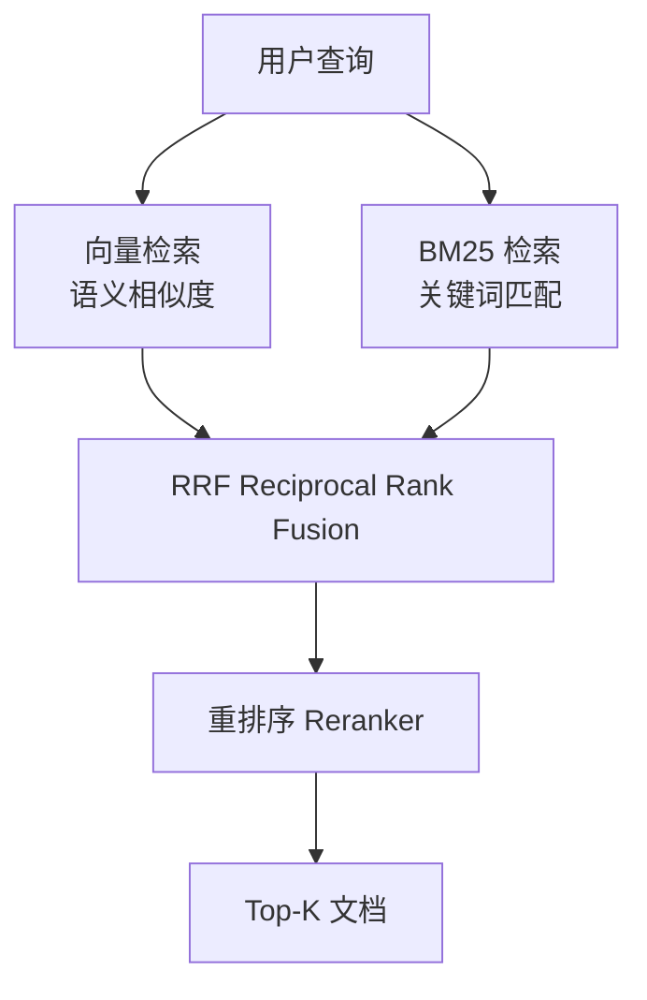

# RAG 生产环境踩坑实录

> **发布日期**: 2025年3月  
> **分类**: 案例实践  
> **字数**: ~4500字

---

## Executive Summary

RAG（Retrieval-Augmented Generation）已成为企业部署 LLM 最主流的架构模式。它通过检索外部知识库来增强模型回答，避免了纯 LLM 的知识截止和幻觉问题。但在从 PoC 到生产的过程中，RAG 系统面临着大量意料之外的挑战。本文基于真实生产经验，总结 RAG 落地的关键问题和解决方案。

核心发现：
- **数据质量决定上限**：再好的检索策略也无法弥补脏数据的问题
- **Chunking 策略影响巨大**：固定长度分块是最常见的反模式
- **检索失败是最被低估的问题**："找不到"比"找错"更常见
- **幻觉无法完全消除**：但可以通过工程手段控制在可接受范围
- **监控是生存必需**：没有监控的 RAG 系统是定时炸弹

---

## 1. 真实生产环境中的 RAG 挑战

### 1.1 从 PoC 到生产的鸿沟

RAG 的 PoC（概念验证）往往令人印象深刻：上传几篇文档，问几个问题，模型给出看似合理的回答。但生产环境完全是另一回事：

**PoC 阶段**：
- 文档：干净的 PDF，格式统一
- 用户：内部测试人员，问题可预期
- 流量：几个请求/分钟
- 期望："演示能跑就行"

**生产阶段**：
- 文档：各种格式（PDF/Word/HTML/邮件/扫描件），质量参差不齐
- 用户：真实用户，问题千奇百怪
- 流量：几百到几千请求/分钟
- 期望：准确、快速、可追溯、不胡说

这个鸿沟比大多数人预期的大得多。

### 1.2 典型问题场景

**场景一：检索到了但没用**
用户问"我们公司的产假政策是什么？"，检索系统返回了 HR 制度文档的第 1 页（目录页），LLM 基于目录回答了一堆废话。

**场景二：检索到了但过时了**
政策已经更新了，但旧版本文档还在向量数据库里。用户收到了过时的信息。

**场景三：问题需要综合多个文档**
"根据我们去年的财务数据和今年的预算，哪个部门增长最快？"——需要综合多个文档的信息，但检索只返回了其中一个。

**场景四：用户问了文档里没有的东西**
用户问了一个文档库中不存在的问题，但 LLM 基于"一般知识"给出了看似合理的回答（幻觉）。

---

## 2. 数据质量与清洗

### 2.1 文档摄入的挑战

生产环境的文档远比 PoC 中的"干净 PDF"复杂：

**格式多样性**：
- PDF：扫描件（需要 OCR）、含表格、含图表、多栏布局
- Word：嵌套表格、修订模式、批注
- 邮件：转发链、附件、签名
- 网页：导航栏、广告、JavaScript 渲染内容
- 代码：多语言、缩进敏感

**清洗管线示例**：
```
原始文档 → 格式检测 → 文本提取 → 清洗 → 分块 → 嵌入 → 存储
                        ↓
                    OCR（如果是扫描件）
                        ↓
                    表格/图表提取
```

### 2.2 关键清洗步骤

**文本提取质量**
- PyPDF2/pdfplumber 对简单 PDF 有效，复杂 PDF 推荐使用 Adobe PDF Services API 或 DocTR
- 扫描件必须 OCR：Tesseract（开源）、Google Document AI（商用）
- 表格提取：Camelot/PDFPlumber（简单表格）、Table Transformer（复杂表格）

**去重**
- 相同文档的多个版本
- 文档间的内容重叠（如政策文件引用法规原文）
- 向量嵌入相似度去重（阈值通常设为 0.95-0.99）

**元数据提取和增强**
- 文档标题、作者、日期、版本号
- 文档类型（政策/报告/手册）
- 适用部门/人群
- 有效日期和过期日期

**元数据是 RAG 系统中最被低估的部分**。它使检索可以进行过滤（"只搜索 2024 年以后的政策"），也是回答溯源的基础。

### 2.3 文档更新管理

**增量更新 vs 全量重建**
- 增量更新：只处理新增/修改的文档，但需要追踪文档变更
- 全量重建：简单但耗时，不适合大规模文档库

**版本控制**
- 文档更新时，旧版本应保留（至少一段时间）或标记为过期
- 检索时优先返回最新版本
- 用户可以请求查看历史版本

---

## 3. 检索失败模式与应对

### 3.1 检索失败的类型

**类型一：语义不匹配**
用户问"入职需要准备什么材料？"，但文档标题是"新员工报到须知"。语义相似但用词不同，导致检索失败。

**类型二：精确信息检索**
用户问"2024 年 Q3 的营收是多少？"——这是精确数据，不适合语义检索。

**类型三：多跳推理**
"我们和 X 公司上次合作的项目预算是多少？"——需要先找到与 X 公司的合作记录，再找到具体项目，再找到预算信息。

**类型四：否定性问题**
"我们是否支持退款？"——文档可能说"不支持退款"，但如果检索不准确，LLM 可能给出错误的肯定回答。

### 3.2 混合检索策略

单一的向量检索往往不够，生产环境通常需要混合策略：

**向量检索（语义搜索）**
- 优点：理解语义，处理同义词和意译
- 缺点：对精确关键词和数字不敏感

**关键词检索（BM25）**
- 优点：精确匹配，处理专有名词、编号、日期
- 缺点：无法理解语义

**混合检索**


**重排序（Reranking）**
使用专门的 Reranker 模型（如 Cohere Rerank、BGE-Reranker）对初始检索结果进行精排，通常能将检索准确率提升 10-20%。

### 3.3 查询改写

用户原始查询往往不适合直接用于检索：

**问题分解**
原始问题："我们公司的年假和病假政策分别是什么？"
分解为：["年假政策", "病假政策"]

**查询扩展**
原始查询："报销流程"
扩展为：["报销流程", "费用报销", "报销申请", "报销审批"]

**HyDE（Hypothetical Document Embeddings）**
让 LLM 先生成一个"假设性的理想答案"，然后用这个答案的嵌入来检索。¹

---

## 4. 幻觉控制策略

### 4.1 RAG 中幻觉的来源

即使有 RAG，LLM 仍然会产生幻觉：

- **检索文档不相关**：LLM 没有足够信息，但还是"编"了一个回答
- **检索文档部分相关**：LLM 基于部分信息推断完整答案
- **检索文档冲突**：多个文档信息矛盾，LLM 选择性采纳或自行判断
- **模型先验知识干扰**：LLM 的训练数据与检索文档不一致

### 4.2 控制策略

**Prompt 工程**
最简单但有效的策略：
```
基于以下参考资料回答用户问题。
如果参考资料中没有足够信息，请明确说明"根据现有资料无法回答此问题"。
不要添加参考资料中没有的信息。

参考资料：
{retrieved_documents}

用户问题：{question}
```

**引用和溯源**
要求 LLM 在回答中标注信息来源：
```
根据《员工手册 2024 版》第 15 页，年假政策是... [1]
根据《HR 政策更新 2024-06》，病假政策调整为... [2]
```

**置信度评分**
让 LLM 对自己的回答给出置信度：
- 高置信度（有明确文档支持）
- 中置信度（有部分文档支持，需要补充）
- 低置信度（文档不支持，建议人工咨询）

**事实一致性检查**
在 LLM 生成回答后，用另一个模型（或同一个模型的不同 prompt）检查回答是否与检索文档一致。

**安全边界**
对于高风险问题（法律、医疗、财务），设置硬性规则：
- 必须有检索文档支持
- 置信度必须高于阈值
- 否则返回"请咨询相关部门"

### 4.3 评估框架

RAG 系统的评估应该包括：

| 维度 | 指标 | 目标 |
|------|------|------|
| 检索质量 | Recall@K, MRR, NDCG | > 80% Recall@5 |
| 回答质量 | Faithfulness, Relevance | > 90% Faithfulness |
| 幻觉率 | 幻觉比例 | < 5% |
| 延迟 | P50, P95, P99 | P95 < 5s |
| 覆盖率 | 有答案 vs 无答案 | > 85% 有答案 |

工具推荐：
- **RAGAS**：开源 RAG 评估框架²
- **DeepEval**：RAG 和 LLM 评估工具
- **LangSmith**：LangChain 的追踪和评估平台

---

## 5. 监控与持续优化

### 5.1 监控维度

**系统监控**：
- API 延迟（P50/P95/P99）
- 错误率
- 吞吐量
- GPU/CPU 利用率

**检索监控**：
- 检索延迟
- 检索结果数量分布
- 检索失败率（0 结果查询比例）
- 检索相关性（抽样人工评估）

**生成监控**：
- LLM 调用延迟
- Token 消耗
- 幻觉检测结果
- 用户反馈（👍/👎）

**业务监控**：
- 用户满意度（CSAT）
- 问题解决率
- 人工转接率
- 最常被问的问题

### 5.2 反馈循环

**显式反馈**
- 回答下方的 👍/👎 按钮
- "这个回答有帮助吗？"调查
- 错误报告入口

**隐式反馈**
- 用户是否追问（追问可能意味着上一个回答不满意）
- 用户是否复制了回答（可能意味着有用）
- 用户是否很快离开（可能意味着不满意）

**反馈驱动优化**
```
收集反馈 → 分析模式 → 定位问题 → 优化 → 部署 → 验证
```

常见优化方向：
- 用户频繁问但检索不到 → 补充相关文档或优化分块策略
- 特定类型问题幻觉率高 → 针对性 prompt 优化
- 检索延迟高 → 索引优化或换用更快的嵌入模型

### 5.3 生产环境踩坑清单

基于真实经验的常见坑：

1. **嵌入模型更新后未重建索引**：新旧向量空间不一致，检索质量暴跌
2. **文档删除后未清理向量**：检索到已删除文档的信息
3. **并发量突增导致向量数据库 OOM**：需要设置请求队列和限流
4. **长文档截断**：文档超长但分块策略不当，关键信息丢失
5. **多语言问题**：中文查询检索英文文档（或反之），嵌入模型不支持
6. **时间敏感信息**："最新的政策"——但检索无法理解"最新"
7. **PDF 表格提取失败**：表格内容乱序，检索和生成都受影响
8. **Prompt 注入**：用户在查询中注入恶意指令
9. **成本失控**：每天数百万次检索 + LLM 调用，费用远超预期
10. **合规问题**：用户查询中包含敏感信息，但系统未做脱敏

---

## 实践建议

### 技术选型

**向量数据库**：
- Pinecone / Weaviate：托管服务，快速起步
- Qdrant / Milvus：自托管，性能和控制力更好
- pgvector：已有 PostgreSQL 的团队的简单选择
- ChromaDB / FAISS：开发和原型阶段

**嵌入模型**：
- OpenAI text-embedding-3-small：通用首选
- BGE-M3：多语言支持好
- E5-mistral-7b-instruct：需要高精度时

**框架**：
- LangChain / LlamaIndex：快速原型
- 自建管线：生产环境建议自建核心逻辑

### 架构建议

1. **从简单开始**：不要第一天就上 Hybrid Search + Reranking + Query Rewriting
2. **先保证召回，再优化精度**：Recall@10 > 85% 是基本要求
3. **元数据过滤是低垂果实**：利用文档日期、类型等过滤可以显著提升准确率
4. **为高风险问题设置安全网**：没有文档支持 = 不回答
5. **版本化一切**：嵌入模型版本、chunking 策略版本、prompt 版本

### 运营建议

1. **建立评估基准**：准备 100-200 个测试问题及标准答案
2. **每周抽样审查**：随机抽取 50 个真实问答，人工评估质量
3. **建立文档更新流程**：文档变更 → 自动触发索引更新
4. **用户反馈闭环**：负面反馈必须在 48 小时内处理
5. **持续关注新模型/技术**：嵌入模型和 Reranker 模型更新很快

---

## 参考来源

1. Gao L et al. "Precise Zero-Shot Dense Retrieval without Relevance Labels." ACL 2023. (HyDE)
2. RAGAS: Retrieval Augmented Generation Assessment. https://github.com/explodinggradients/ragas
3. LangChain Documentation. https://docs.langchain.com/
4. LlamaIndex Documentation. https://docs.llamaindex.ai/
5. Pinecone. "Learning Center: RAG." https://www.pinecone.io/learn/retrieval-augmented-generation/

---

*本报告基于截至 2025 年 2 月的公开信息和生产环境实践经验编写。RAG 技术栈发展迅速，部分工具和最佳实践可能已有更新。*