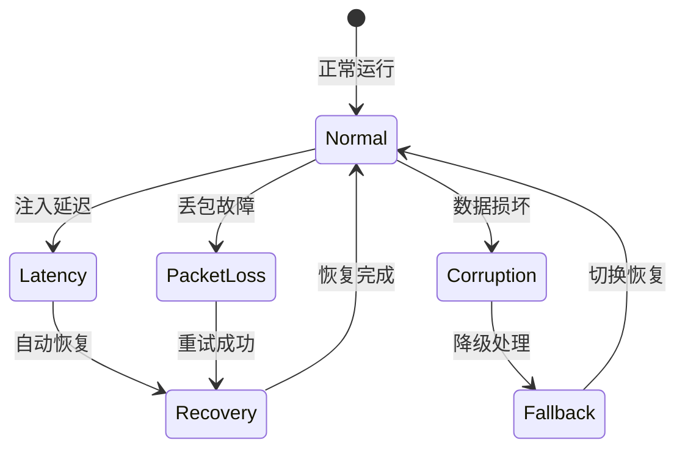

# 混沌工程在 Agent 运维中的应用

## Executive Summary

混沌工程通过主动注入故障来验证系统的韧性，正在成为 Agent 运维的重要组成部分[1]。本文探讨了将混沌工程原则应用于 AI Agent 系统的实践方法、核心场景和工具框架。

## 1. 混沌工程基础概念

混沌工程是一种通过实验方法主动注入故障，以验证系统在不确定条件下是否能保持稳定性的实践[4]。在 Agent 运维领域，混沌工程主要关注：

1. **Agent 通信故障**：模拟消息队列中断、网络延迟
2. **依赖服务故障**：工具调用失败、外部 API 超时
3. **状态不一致**：Memory 存储损坏、上下文丢失
4. **资源约束**：内存不足、Token 限制、速率限制

## 2. Agent 系统的混沌测试场景

### 2.1 通信层测试

Agent 系统依赖多个组件间的消息传递。混沌测试可以验证：

- **消息队列故障**：延迟或丢弃消息，测试重试机制
- **协议异常**：注入格式错误的数据包
- **序列化失败**：模拟 JSON 序列化错误

### 2.2 依赖服务故障注入

Agent 经常调用外部工具和 API，混沌工程可以测试[6]：

1. **API 超时**：模拟外部服务响应慢
2. **认证失败**：Token 过期、权限不足
3. **限流触发**：触达速率限制边界
4. **部分响应**：返回不完整数据

### 2.3 状态管理测试

Agent 的 Memory 和上下文是关键状态：

- **存储故障**：模拟 Redis/DB 连接断开
- **数据丢失**：上下文突然清空
- **序列化异常**：状态对象损坏
- **并发冲突**：多 Agent 竞争写入

## 3. 混沌工程实施框架

实施 Agent 混沌工程需要三层架构：

### 3.1 实验设计层

定义实验假设，例如："当外部 API 超时率达到 30% 时，Agent 降级策略应保持 95% 的可用性"。

### 3.2 故障注入层

使用专门的故障注入工具[2]：

- **Netflix Chaos Monkey**：基础架构故障
- **Gremlin**：容器级故障
- **自定义 Agent 插件**：针对 Agent 特定组件

### 3.3 监控验证层

验证实验结果需要：

- **指标监控**：成功率、延迟、错误率
- **告警机制**：超过阈值时自动终止实验
- **自动回滚**：异常时恢复到安全状态

## 4. 最佳实践与风险控制

混沌工程在 Agent 运维中应用时需注意[7]：

1. **Start Small**：从非关键路径开始
2. **安全边界**：设置实验范围限制，避免影响线上用户
3. **渐进式**：先注入低强度故障，逐步增加
4. **实时监控**：实验期间全员关注，随时终止
5. **文档记录**：每次实验记录假设、结果、改进措施

## 5. 案例与工具推荐

### 5.1 行业案例

- **Netflix**[1]：使用 Chaos Monkey 测试微服务容错
- **LinkedIn**：对 Kafka 消息队列进行混沌测试
- **阿里云**：在 Serverless 平台应用混沌工程

### 5.2 推荐工具链

| 工具 | 用途 | 适用场景 |
|------|------|----------|
| Chaos Mesh | Kubernetes 混沌测试 | 云原生部署[3] |
| Litmus | 容器故障注入 | 大规模集群 |
| Fortio | 负载测试 | 性能边界验证 |
| Toxy | 代理级故障 | API 网关场景 |

## 6. 未来趋势

随着 Agent 系统复杂度增加，混沌工程将：

- **自动化程度更高**：AI 辅助故障预测
- **覆盖范围更广**：从基础设施到应用层全栈
- **集成度更深**：与 CI/CD 流水线深度融合
- **智能化分析**：利用 AI 分析混沌实验结果，自动生成改进建议

<!-- REFERENCE START -->
## 参考文献

1. Netflix Technology Blog. "Chaos Engineering: Building Confidence in System Resilience" (2024). https://netflixtechblog.com/tagged/chaos-engineering
2. Gremlin. "The Three Pillars of Chaos Engineering" (2025). https://www.gremlin.com/chaos-engineering/
3. CNCF. "Chaos Engineering in Kubernetes" (2024). https://www.cncf.io/blog/chaos-engineering-kubernetes/
4. Principles of Chaos Engineering. "The Technical Practices of Chaos Engineering" (2025). https://principlesofchaos.org/
5. AWS. "Implementing Chaos Engineering on AWS" (2024). https://aws.amazon.com/chaos-engineering/
6. Thoughtworks. "Chaos Engineering for AI/ML Systems" (2025). https://www.thoughtworks.com/insights/blog/chaos-engineering-ai
7. Google Cloud. "Chaos Engineering: A Practical Guide" (2024). https://cloud.google.com/chaos-engineering
8. IBM. "Chaos Engineering in Hybrid Cloud Environments" (2025). https://www.ibm.com/cloud/learn/chaos-engineering