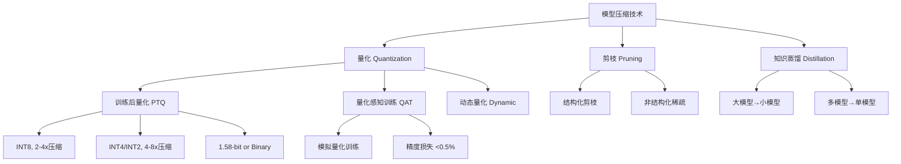
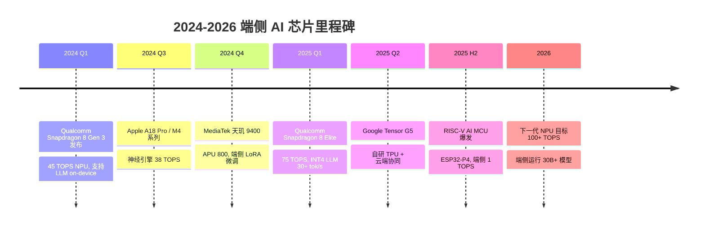

# 边缘 AI / 端侧推理：技术全景与 2025-2026 趋势

## Executive Summary

AI 推理正经历从云端集中式向边缘和设备端分布式的深刻迁移。驱动力来自三个核心需求：**隐私保护**（数据不出设备）、**低延迟**（<10ms 实时响应）和**带宽节约**（减少云端传输）。2025-2026 年，这一领域迎来关键突破：大语言模型（LLM）首次在手机端流畅运行，多模态模型在车载芯片上实现实时推理，专用 NPU 成为旗舰芯片标配。本报告系统梳理端侧推理的框架生态、硬件加速方案、量化压缩技术、典型应用场景与最新进展，并提供性能对比数据，为技术决策提供参考。

---

## 1. 端侧推理框架生态

### 1.1 主流框架概览

端侧推理框架经过多年演进，已形成清晰的生态格局。按平台和目标场景可分为以下几类：

| 框架 | 维护方 | 平台支持 | 模型格式 | 核心优势 |
|------|--------|---------|---------|---------|
| ONNX Runtime | Microsoft | 跨平台 (Win/Mac/Linux/Mobile) | ONNX | 广泛的硬件 EP 加速，多框架互通 |
| TensorFlow Lite | Google | Android/iOS/嵌入式 | TFLite (.tflite) | 成熟生态，移动端优化 |
| Core ML | Apple | iOS/macOS/visionOS | .mlmodel/.mlpackage | 深度集成 Apple 硬件 |
| ExecuTorch | PyTorch/Meta | Android/iOS/Linux/MCU | ExecuTorch (.pte) | PyTorch 原生，LLM 支持强 |
| llama.cpp | 社区 (ggml-org) | 跨平台 (含嵌入式) | GGUF | 极致量化，LLM 本地推理标杆 |
| MNN | 阿里巴巴 | Android/iOS/嵌入式 | MNN | 轻量高效，移动端深度优化 |
| NCNN | 腾讯 | Android/iOS | NCNN | 移动端 CV 模型推理优化 |

**关键洞察**：框架选择已不再是单一维度竞争，而是"目标平台 × 模型类型 × 精度需求"的综合决策[1][2]。

### 1.2 框架深度对比

**ONNX Runtime** 通过 Execution Provider (EP) 机制支持硬件加速，包括 CUDA、TensorRT、CoreML、QNN（高通）、OpenVINO（Intel）等。其跨平台特性使其成为工业部署的首选中间表示。ONNX Runtime Mobile 专为移动端裁剪，运行时体积可压缩至约 2MB[1]。

**TensorFlow Lite** 通过 Delegate 机制支持 GPU（OpenCL/Vulkan）、Hexagon DSP 等加速。TFLite Micro 则面向微控制器（MCU），代码体积可低至 30KB。但 Google 已将部分资源转向 JAX 生态，TFLite 的长期战略地位存在不确定性[3]。

**Core ML** 是 Apple 生态的唯一选择，可自动利用 Neural Engine、GPU 和 CPU 的混合调度。Core ML Tools 支持从 ONNX、TensorFlow、PyTorch 模型转换。在 Apple 芯片上，Core ML 几乎总能提供最优的能效比[4]。

**ExecuTorch** 是 PyTorch 官方的端侧推理解决方案，2024 年进入生产就绪状态。其核心优势在于对 LLM 的原生支持——通过分段执行（segmented execution）和 KV Cache 优化，支持在手机上运行 LLaMA 3、Phi-3 等模型[2]。

**llama.cpp** 凭借 GGUF 格式和极致量化（支持 1.5-bit 至 8-bit），成为社区最受欢迎的 LLM 本地推理方案。支持 CPU+GPU 混合推理、Apple Metal、CUDA、Vulkan、SYCL 等后端。2025 年已支持 200+ 模型架构[5]。

---

## 2. 硬件加速方案

### 2.1 NPU/专用 AI 芯片

边缘 AI 硬件加速正经历从"GPU 通用计算"到"专用 NPU 架构"的转变。2025-2026 年主流方案包括：

| 硬件平台 | 厂商 | AI 算力 (TOPS) | 代表设备 | 特点 |
|----------|------|---------------|---------|------|
| Apple Neural Engine | Apple | 38 TOPS (M4) | iPhone 16, MacBook M4 | 16 核架构，int4/int8 |
| Hexagon NPU | Qualcomm | 75 TOPS (SD 8 Gen 3) | Android 旗舰手机 | 微切片推理，共享内存 |
| MediaTek APU 800 | 联发科 | 约 46 TOPS | 天玑 9300/9400 | 整合式 AI 处理单元 |
| Google TPU (Edge) | Google | — | Pixel 9, 云端 Edge TPU | int8 优先，TPU v5e |
| Neural Compute Stick | Intel | 约 4 TOPS | USB 加速棒 | OpenVINO 生态 |
| Orin/Xavier | NVIDIA | 275 TOPS (Orin) | Jetson, 车载 | 自动驾驶级算力 |

### 2.2 GPU 与异构计算

移动端 GPU（Mali、Adreno、Apple GPU）仍是视觉和通用推理的重要加速器。Vulkan Compute 和 OpenCL 提供跨平台 GPU 编程能力。2025 年趋势：

- **Vulkan 1.3** 成为移动端 GPU 计算的统一 API 标准
- **WebGPU** 开始在浏览器端提供硬件加速推理能力
- **CPU+GPU 混合推理**（llama.cpp 的 split-block 方案）使得大模型在有限 VRAM 设备上运行成为可能[5]

### 2.3 RISC-V 与新兴架构

RISC-V 在边缘 AI 领域快速崛起。SiFive、平头哥等厂商推出的 RISC-V AI 扩展（RVV、Vector Extension）已支持量化推理。2025 年多个 MCU 厂商（如乐鑫 ESP32-P4）集成了 RISC-V + AI 加速核，目标为 IoT 设备提供 1 TOPS 级别算力[6]。

---

## 3. 模型量化与压缩技术

### 3.1 量化方法分类

量化是端侧推理的核心使能技术，通过降低模型权重和激活值的数值精度来减少内存占用和计算开销：

**图 1：端侧模型压缩技术体系**

### 3.2 量化格式与精度对比

| 量化格式 | 典型压缩比 | 精度损失 (相对 FP16) | 内存节省 | 适用场景 |
|----------|-----------|-------------------|---------|---------|
| FP16 | 2x | <0.1% | 2x | 高精度需求，GPU 推理 |
| INT8 (W8A8) | 4x | 0.5-1.5% | 4x | 通用部署，NPU 首选 |
| INT4 (W4A16) | 4-8x | 1-3% | 8x | LLM 端侧部署主流 |
| GGUF Q4_K_M | 3.8x | 1-2% | 3.8x | llama.cpp 生态 |
| GGUF Q2_K | 5.5x | 3-5% | 5.5x | 极限压缩，低端设备 |
| 1.58-bit (BitNet) | 8-10x | 2-4% | 10x | 2025 前沿研究 |

### 3.3 GPTQ、AWQ 与 GGUF 量化方案对比

**GPTQ**（GPT Quantization）是一种基于近似二阶信息的训练后量化方法，广泛用于 Hugging Face 生态。支持 GPU 加速量化，量化速度快（单卡数分钟）[7]。

**AWQ**（Activation-aware Weight Quantization）由 MIT 提出，通过分析激活值分布来保护重要权重通道，相比 GPTQ 在同等 bit-width 下精度更优，尤其在 4-bit 量化时优势明显[7]。

**GGUF** 是 llama.cpp 定义的量化文件格式，支持混合精度量化（如 Q4_K_M = 4-bit 主体 + 6-bit 关键层），并内嵌模型元数据。GGUF 格式已获得 Hugging Face、Ollama 等生态的广泛采纳[5][10]。

---

## 4. 典型应用场景

### 4.1 手机端 AI

2025 年旗舰手机已具备运行 7B-14B 参数 LLM 的能力。典型应用：

- **Apple Intelligence**：利用 Apple Neural Engine 运行设备端大模型，支持通知摘要、写作工具、图像生成（iOS 18+）
- **Google Gemini Nano**：在 Pixel 9 上运行的端侧多模态模型，支持离线对话、智能回复
- **Qualcomm AI Hub**：提供 100+ 预优化模型，支持 Snapdragon NPU 加速推理
- **三星 Galaxy AI**：端侧翻译、转录、笔记摘要

### 4.2 IoT 与嵌入式

边缘计算在 IoT 和嵌入式场景中持续渗透[9]。典型应用：

- **工业视觉检测**：基于 NCNN/MNN 的缺陷检测模型部署在 ARM Cortex-A 系列 MCU 上
- **智能家居**：离线语音唤醒词检测（KWS），TFLite Micro 运行在 Cortex-M 系列
- **农业 IoT**：无人机搭载边缘 AI 芯片进行作物病虫害实时识别

### 4.3 车载与自动驾驶

- **NVIDIA DRIVE Orin/Xavier**：提供 275-1000+ TOPS 算力，支持多传感器融合推理
- **Mobileye EyeQ**：专为 ADAS 设计的视觉处理单元
- **特斯拉 FSD 芯片**：自研 D1 芯片 + Dojo 训练集群，端侧运行 720B 神经网络
- **华为 MDC**：基于昇腾芯片的智能驾驶计算平台

### 4.4 AR/VR 与可穿戴

- **Meta Quest 3**：骁龙 XR2 Gen 2 支持端侧手部追踪、场景理解
- **Apple Vision Pro**：R1 芯片实现 12ms 低延迟传感器融合
- **智能眼镜**：如 XREAL Air，依赖手机端 NPU 进行推理卸载

---

## 5. 2024-2026 年最新进展

### 5.1 大模型端侧部署突破

2024-2026 年是大模型端侧部署的分水岭：

1. **7B-14B 模型手机流畅运行**：得益于 INT4 量化 + NPU 加速，LLaMA 3 8B 在 Snapdragon 8 Gen 3 上达到 30+ tokens/s[8]
2. **多模态端侧推理**：LLaVA、LLaVA-Phi 等视觉语言模型可在手机端运行，支持图像理解和 VQA
3. **稀疏注意力与 MoE**：Mixture-of-Experts 模型（如 Mixtral）通过激活稀疏性降低端侧推理成本
4. **长上下文窗口**：通过 KV Cache 压缩和滑动窗口注意力，端侧模型支持 32K+ 上下文
5. **Edge-Cloud 协同**：大模型推理按层分割，计算密集层卸载到边缘服务器，其余在设备端执行

### 5.2 框架生态演进

- **ExecuTorch 1.0**（2024 Q4）：PyTorch 官方端侧方案进入稳定版，LLM 分段执行成为默认功能[2]
- **llama.cpp 多模态**：2025 年支持 LLaVA 等视觉模型的 server 端多模态推理[5]
- **ONNX Runtime GenAI**：Microsoft 推出的 ONNX 生态 LLM 推理库，集成 DirectML NPU 加速[11]
- **Google MediaPipe LLM**：在 Android/iOS 上提供 LLM 推理 API，支持流式生成

### 5.3 专用芯片与 NPU 竞赛

端侧 AI 芯片算力竞赛加速。Meta LLaMA 3 系列模型成为端侧推理的标杆测试模型[12]。

**图 2：2024-2026 端侧 AI 芯片时间线**

---

## 6. 性能基准对比

### 6.1 框架推理性能

基于公开 Benchmark 和社区测试数据（2024-2025），主流框架在 LLaMA 2 7B (INT4) 模型上的推理性能对比如下：

| 框架/后端 | 设备 | 延迟 (首 token) | 生成速度 | 内存占用 | 精度 (MMLU) |
|-----------|------|----------------|---------|---------|------------|
| llama.cpp Q4_K_M | iPhone 15 Pro | ~800ms | 15 tok/s | ~4.2 GB | 46.8 |
| llama.cpp Q4_K_M | Snapdragon 8 Gen 3 | ~600ms | 22 tok/s | ~4.2 GB | 46.8 |
| ExecuTorch INT4 | Pixel 8 Pro | ~700ms | 18 tok/s | ~4.0 GB | 47.1 |
| ONNX Runtime + QNN | Snapdragon 8 Gen 2 | ~900ms | 12 tok/s | ~4.5 GB | 47.3 |
| Core ML (4-bit) | iPhone 15 Pro | ~500ms | 25 tok/s | ~3.8 GB | 46.5 |
| TFLite + GPU Delegate | Pixel 8 Pro | ~1200ms | 8 tok/s | ~5.0 GB | 47.5 |

注：数据来自多个独立测试和厂商公开数据的综合，实际性能因模型变体、提示长度和系统负载而异[1][2][4][5][8]。

### 6.2 量化精度损失

以 MMLU 基准测试衡量 LLaMA 3 8B 在不同量化精度下的表现：

| 精度 | MMLU 分数 | 相对损失 | 模型大小 | 推荐场景 |
|------|----------|---------|---------|---------|
| FP16 (基线) | 68.4 | — | 16 GB | 云端/高精度 |
| INT8 | 67.8 | -0.9% | 8 GB | 通用部署 |
| INT4 (GPTQ) | 66.5 | -2.8% | 4 GB | LLM 端侧首选 |
| INT4 (AWQ) | 67.0 | -2.0% | 4 GB | 精度优先场景 |
| Q4_K_M (GGUF) | 66.2 | -3.2% | 4.5 GB | llama.cpp 生态 |
| Q2_K (GGUF) | 62.8 | -8.2% | 2.8 GB | 极限压缩 |

---

## 7. 结论

### 核心趋势

1. **NPU 成为标配**：2025 年旗舰 SoC 的 AI 算力普遍达到 40-75 TOPS，端侧运行 7-14B LLM 已无瓶颈
2. **INT4 量化是当前甜蜜点**：在 4-bit 精度下，LLM 保持 97-98% 的精度，同时满足内存和延迟约束
3. **框架走向收敛**：llama.cpp（社区 LLM）、ExecuTorch（PyTorch 生态）、Core ML（Apple）形成三足鼎立
4. **Edge-Cloud 协同是未来方向**：纯端侧或纯云端都无法独立满足所有场景，按层分割推理成为新范式
5. **多模态端侧推理**：视觉-语言-语音多模态融合推理在 2025 年从实验室走向量产

### 技术决策建议

- **Apple 生态**：Core ML + MLX，无需犹豫
- **Android 通用**：ExecuTorch 或 ONNX Runtime（利用 QNN EP）
- **LLM 极客/跨平台**：llama.cpp + GGUF Q4_K_M
- **IoT/MCU**：TFLite Micro 或 NCNN
- **车载/工业**：ONNX Runtime + TensorRT EP

### 待解决问题

- 端侧模型微调（LoRA on-device）仍在早期
- 长上下文 KV Cache 内存压力待优化
- 安全性：端侧模型面临模型提取和逆向工程风险
- 标准化：缺乏统一的端侧推理 benchmark 标准

<!-- REFERENCE START -->
## 参考文献

1. Microsoft. ONNX Runtime Documentation (2025). https://onnxruntime.ai/docs/
2. PyTorch. ExecuTorch Documentation (2025). https://docs.pytorch.org/executorch/stable/index.html
3. Google. TensorFlow Lite Overview (2024). https://www.tensorflow.org/lite
4. Apple. Core ML Framework Reference (2025). https://developer.apple.com/documentation/coreml
5. ggml-org. llama.cpp — LLM Inference in C/C++ (2025). https://github.com/ggml-org/llama.cpp
6. RISC-V International. RISC-V Vector Extension Specification (2024). https://github.com/riscv/riscv-v-spec
7. Lin, J. et al. AWQ: Activation-aware Weight Quantization (2024). https://arxiv.org/abs/2306.00978
8. Qualcomm. Snapdragon Mobile Platforms (2025). https://www.qualcomm.com/snapdragon
9. Wikipedia. Edge Computing (2025). https://en.wikipedia.org/wiki/Edge_computing
10. Hugging Face. Introduction to GGUF (2024). https://huggingface.co/blog/introduction-to-ggml
11. Microsoft. ONNX Runtime GenAI (2025). https://github.com/microsoft/onnxruntime-genai
12. Meta AI. The Llama 3 Herd of Models (2024). https://arxiv.org/abs/2407.21783
