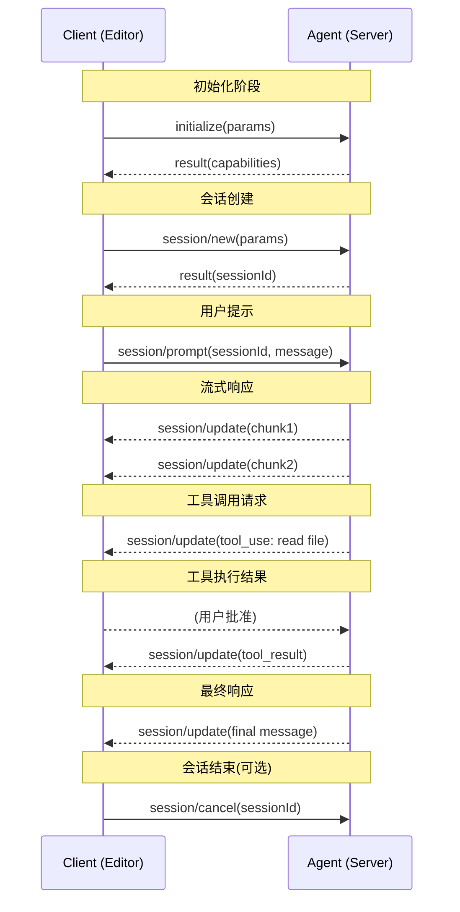

# ACP 协议详解

## Executive Summary

Agent Communication Protocol (ACP) 是一个新兴的开放标准，旨在标准化 AI 代理之间的通信方式。与 Model Context Protocol (MCP) 专注于为单个模型提供上下文不同，ACP 解决了多代理系统中互操作性、编排和协作的核心问题。本报告深入分析 ACP 的协议设计目标、消息格式、流控机制，并详细探讨其与 MCP 的互补关系。ACL 采用 REST-based 架构和 JSON-RPC 2.0 消息信封，提供了轻量级、SDK-optional 的设计，使其易于集成到现有系统中。通过双总线架构（ACP 负责代理间通信，MCP 负责上下文接入），组织可以构建灵活、可扩展的多代理生态系统[1][2]。

---

## 1. 协议设计目标

### 1.1 核心设计原则

ACP 诞生于对 AI 代理互操作性的迫切需求。在 ACP 出现之前，每个编辑器（如 VS Code、JetBrains、Neovim）都需要为每个 AI 代理（如 Claude Code、Gemini CLI）单独开发集成，造成"组合爆炸"问题[5]。ACP 的目标是像 Language Server Protocol (LSP) 标准化语言服务器一样，标准化 AI 代理与客户端（编辑器、CLI 等）之间的通信[3][4][16]。

ACP 的核心设计目标包括：

**1. 开放性与去中心化** - ACP 由 Linux Foundation 管理开放治理，确保协议发展不受单一供应商控制。IBM Research 主导开发，BeeAI 框架提供主要实现[1][17]。这种治理模式鼓励社区贡献和广泛采纳。

**2. 轻量级与低门槛** - 协议设计强调"SDK-optional"：代理可以直接通过 HTTP 客户端（如 curl、Postman）进行通信，无需专用库[1][2]。REST-based 架构使用大多数开发者熟悉的 HTTP 约定，降低了学习曲线和集成成本[8]。

**3. 传输中立性** - 虽然默认支持 stdio 传输（本地子进程通信），但 ACP 是传输无关的，支持 HTTP/SSE（远程场景）、WebSocket 等任何双向流[4][15]。这使协议适用于本地开发和生产部署。

**4. 多模态支持** - 消息可以包含结构化数据、纯文本、图像、embeddings 等多种内容类型。协议使用 MimeTypes 进行内容识别，使任何数据格式都能无缝处理而无需修改协议[2]。

**5. 异步优先** - ACP 默认异步通信，适合长运行或多步骤任务。同时支持同步请求用于低延迟交互场景。长运行操作使用 Server-Sent Events (SSE) 进行流式传输[1][13]。

**6. 离线发现能力** - 代理可以嵌入元数据到分发包中，实现离线发现。这对 scale-to-zero 环境（如云原生部署）至关重要，因为代理可能处于非活动状态时仍能被发现[1]。

**7. 向后兼容性** - 协议通过版本协商（initialize 方法）确保向后兼容。扩展机制允许添加自定义功能同时保持协议兼容性[4]。

### 1.2 应用场景

ACP 的设计支持多种使用场景：

- **编辑器-Agent 集成**: 标准化的方式让 Zed、JetBrains、Neovim、Obsidian 等编辑器与 Claude Code、Gemini CLI、OpenCode、Goose、Codex CLI 等代理通信[5][6][16]
- **多代理编排**: 通过代理网络协调复杂工作流，如一个代理处理用户意图，另一个执行代码修改，第三个进行测试验证[10][11]
- **企业集成**: 在组织内跨团队、框架和运行时环境实现代理互操作[1][2]
- **混合架构**: 结合 ACP（代理协作）和 MCP（上下文访问）构建完整 AI 系统[11][12]

---

## 2. 消息格式

### 2.1 传输层

ACP 支持多种传输机制，主要分为两类：

**1. Stdio 传输** - 代理作为子进程运行，客户端通过 stdin/stdout 通信。这是本地开发最常见的模式，特别适合编辑器集成（如 Zed 配置 agents.opencode.command）[5][16]。

```json
{
  "jsonrpc": "2.0",
  "id": 1,
  "method": "initialize",
  "params": {
    "agentName": "my-agent",
    "version": "1.0"
  }
}
```

**2. HTTP/SSE 传输** - 用于远程代理或云部署。HTTP 提供 RESTful 端点，SSE 支持流式响应[2][13]。典型端点：
- `POST /rpc` - JSON-RPC 请求端点
- `GET /events` - Server-Sent Events 流

### 2.2 JSON-RPC 2.0 消息结构

ACP 严格遵循 JSON-RPC 2.0 规范，定义三种消息类型：

**Request（请求）** - 客户端或代理发起的请求-响应对：
```json
{
  "jsonrpc": "2.0",
  "method": "session/prompt",
  "params": {
    "sessionId": "sess_123",
    "message": {
      "role": "user",
      "content": "Add error handling to auth.ts"
    }
  },
  "id": 42
}
```

**Response（响应）** - 对请求的成功或错误响应：
```json
{
  "jsonrpc": "2.0",
  "result": {
    "messages": [...]
  },
  "id": 42
}
```

或错误响应：
```json
{
  "jsonrpc": "2.0",
  "error": {
    "code": -32602,
    "message": "Invalid params: missing sessionId"
  },
  "id": 42
}
```

**Notification（通知）** - 单向消息，不期望响应：
```json
{
  "jsonrpc": "2.0",
  "method": "session/update",
  "params": {
    "chunks": [
      {"role": "assistant", "content": "I'll add try-catch blocks..."}
    ]
  }
}
```

### 2.3 方法定义

ACP 定义了核心方法集合，分为客户端方法、代理方法和通知：

**客户端方法（Client → Agent）**:
- `initialize`: 建立连接，协商协议版本和代理能力[4]
- `session/request_permission`: 请求用户授权工具调用
- `session/new`: 创建新会话
- `session/load`: 加载现有会话（需要 `loadSession` capability）
- `session/prompt`: 发送用户提示
- `session/set_mode`: 切换代理操作模式
- `session/cancel`: 取消正在进行的操作

**代理方法（Agent → Client）**:
- `fs/read_text_file`: 读取文件（包括未保存的编辑）
- `fs/write_text_file`: 写入/创建文件
- `terminal/create`: 启动 shell 命令
- `terminal/output`: 获取命令输出
- `terminal/wait_for_exit`: 等待命令完成
- `terminal/kill`: 终止运行中的命令

**通知（双向）**:
- `session/update`: 代理发送会话更新（消息块、工具调用、计划、命令更新、模式变更）[4]

#### 典型消息序列图

下面展示一个完整的 ACP 会话交互序列，包括初始化、提示发送、流式响应、工具调用和会话结束：



### 2.4 消息内容结构

ACP 使用结构化消息内容，支持多部分消息（MessagePart）：

```json
{
  "role": "user",
  "parts": [
    {
      "contentType": "text/plain",
      "content": "Analyze this code"
    },
    {
      "contentType": "text/x-python",
      "content": "def foo(): pass"
    }
  ]
}
```

关键要求：
- 所有文件路径必须是绝对路径[4]
- 行号从 1 开始编号[4]

### 2.5 扩展机制

ACP 内置扩展性支持，允许在不破坏兼容性的情况下添加自定义功能[15]:

- `ExtRequest`: 发送协议规范外的任意请求
- `ExtResponse`: 响应 ExtRequest
- `ExtNotification`: 发送单向通知
- 自定义能力和模式扩展

---

## 3. 流控机制

### 3.1 会话生命周期管理

ACP 采用显式的会话模型管理长期交互：

```
Client → Agent: initialize (协商版本/能力)
Client → Agent: session/new (创建会话 ID)
Client → Agent: session/prompt (发送提示)
Agent → Client: session/update (流式响应块)
Agent → Client: session/update (工具调用)
Agent → Client: session/update (最终响应)
Client → Agent: session/cancel (可选取消)
```

会话 ID 在 `session/new` 响应中返回，后续操作通过 `sessionId` 引用会话：

```json
{
  "jsonrpc": "2.0",
  "result": {
    "sessionId": "sess_abc123"
  },
  "id": 1
}
```

### 3.2 流式响应 (Streaming)

对于长运行任务或交互式应用，ACP 支持两种流式模式：

**1. Server-Sent Events (SSE)** - HTTP 传输下使用 SSE 流式传输响应块[1][13]:
```
Content-Type: text/event-stream

data: {"jsonrpc":"2.0","method":"session/update","params":{"chunks":[{"role":"assistant","content":"I'll "}]}}
data: {"jsonrpc":"2.0","method":"session/update","params":{"chunks":[{"role":"assistant","content":"add error "}]}}
data: {"jsonrpc":"2.0","method":"session/update","params":{"chunks":[{"role":"assistant","content":"handling..."}]}}
```

**2. 通知序列** - 代理通过多次 `session/update` 通知发送增量更新：
```json
// Chunk 1
{
  "jsonrpc": "2.0",
  "method": "session/update",
  "params": {
    "chunks": [{"role": "assistant", "content": "I'll analyze"}]
  }
}

// Chunk 2 (tool call)
{
  "jsonrpc": "2.0",
  "method": "session/update",
  "params": {
    "chunks": [{
      "type": "tool_use",
      "name": "read",
      "input": {"filePath": "/abs/path/auth.ts"}
    }]
  }
}

// Chunk 3 (tool result)
{
  "jsonrpc": "2.0",
  "method": "session/update",
  "params": {
    "chunks": [{
      "type": "tool_result",
      "content": "// file contents..."
    }]
  }
}
```

### 3.3 权限和流控

ACP 实现细粒度权限控制：

**权限请求流程**:
1. 代理需要执行敏感操作（写入文件、执行终端命令）
2. 代理发送 `session/update` 通知包含工具调用
3. 客户端（编辑器）拦截并向用户显示权限对话框
4. 用户批准或拒绝，客户端通过 `session/request_permission` 通知代理结果

**取消机制**:
- 客户端可随时发送 `session/cancel` 通知（无响应期望）[4]
- 代理应停止当前操作并清理资源

**背压处理**:
协议本身不强制背压，由传输层处理。HTTP/2 或 Unix 套接字提供自然流控，stdout 缓冲区满时代理应阻塞写入[2]。

### 3.4 错误恢复

所有方法遵循标准 JSON-RPC 错误处理[4]:
- 预定义错误码（如 -32602 无效参数、-32603 内部错误）
- 自定义错误码可扩展
- Notifications 永不返回错误（最佳-effort）

超时场景：
- 同步请求：客户端应设置合理超时
- 异步流：客户端必须处理代理静默失败（心跳缺失）

---

## 4. 与 MCP 的关系

### 4.1 MCP 与 ACP 的定位差异

Model Context Protocol (MCP) 和 ACP 解决 AI 生态系统中的不同层次问题[6][8]:

**MCP（模型上下文协议）**:
- **聚焦点**: 给单个 LLM/Agent 提供结构化上下文
- **类比**: "USB-C 端口"连接模型与数据源/工具[4][9]
- **架构**: Host（LLM 应用）→ MCP Servers（数据/工具提供者）[11]
- **传输**: JSON-RPC 2.0 over stdio/SSE
- **能力**: 资源访问、工具调用、提示模板、内存扩展
- **治理**: Anthropic 发起，社区驱动

**ACP（代理通信协议）**:
- **聚焦点**: 代理与代理、代理与客户端（编辑器/UI）之间的标准化通信
- **类比**: "互联网协议"层，让多代理系统互操作[1]
- **架构**: 代理作为对等节点或客户端-服务器，通过标准化消息交换[10]
- **传输**: REST-based + JSON-RPC 2.0 信封[2]
- **能力**: 会话管理、多模态消息、异步编排、跨组织协作
- **治理**: Linux Foundation/BeeAI（IBM Research）

**核心区别**:
- MCP: `Model ← Context` (单向增强)[6]
- ACP: `Agent ↔ Agent/Client` (双向对话)[6][9]

### 4.2 双总线互补架构

在实际系统中，MCP 和 ACP 可以协同工作，形成"双总线"架构[11][12]:

```mermaid
graph TB
    subgraph "ACP 层（Agent 间通信）"
        A[Agent A<br/>ACP Client]
        B[Agent B<br/>ACP Server]
        C[Agent C<br/>Orchestrator]
    end
    
    subgraph "MCP 层（上下文接入）"
        D[MCP Server - Database]
        E[MCP Server - File System]
        F[MCP Server - APIs]
    end
    
    subgraph "客户端层"
        G[Client<br/>(Editor/UI)]
    end
    
    G -- ACP --> A
    G -- ACP --> B
    A -- ACP 请求 --> B
    B -- ACP 响应 --> A
    C -- ACP 协调 --> A
    C -- ACP 协调 --> B
    
    B -- MCP 查询 --> D
    B -- MCP 读取 --> E
    B -- MCP 调用 --> F
    
    style A fill:#e1f5fe
    style B fill:#e1f5fe
    style C fill:#e1f5fe
    style D fill:#f3e5f5
    style E fill:#f3e5f5
    style F fill:#f3e5f5
    style G fill:#e8f5e8
```

```
                  ┌─────────────────┐
                  │  External Tools │
                  │   & Data (DB,   │
                  │    APIs, Files) │
                  └────────┬────────┘
                           │ MCP
                           ▼
┌─────────────┐      ┌─────────────┐
│   Agent A    │◄────►│   Agent B    │
│ (ACP Client) │      │ (ACP Server) │
└─────────────┘      └─────────────┘
         │                   │
         └─────────┬─────────┘
                   │ ACP
                   ▼
           ┌──────────────┐
           │   Client     │
           │ (Editor/UI)  │
           └──────────────┘
```

**工作流程示例**:
1. 用户通过编辑器（ACP Client）发送提示 "查询用户订单"
2. 编辑器通过 ACP 发送 `session/prompt` 到订单代理（Agent A）
3. 订单代理需要用户数据，通过 ACP 向数据库代理（Agent B）发送请求
4. 数据库代理内部使用 MCP 连接到 Postgres MCP 服务器获取数据
5. 数据库代理返回结果给订单代理（通过 ACP）
6. 订单代理处理并返回最终响应给编辑器（通过 ACP）[11]

在此架构中：
- **ACP 层**: 代理间职责分工、协调、消息路由
- **MCP 层**: 每个代理独立接入外部上下文和工具

### 4.3 技术特性对比

多家机构对协议特性进行了详细比较[7]。下表总结了关键差异：

| 维度 | MCP | ACP |
|------|-----|-----|
| **主要用途** | 模型上下文增强 | 代理通信与编排 |
| **通信方向** | Host ←→ Servers (星型) | Agent ↔ Agent/Client (网状) |
| **传输协议** | JSON-RPC 2.0 | REST + JSON-RPC 2.0 |
| **会话模型** | 有状态连接 | 可无状态（HTTP），也可有状态会话 |
| **资源消耗** | 较高（会话管理开销） | 较低（无状态设计）[9] |
| **生态系统** | Anthropic + OpenAI + MS + Google | Linux Foundation + IBM + 多家企业 |
| **实现难度** | 需要 SDK 知识 | 熟悉 REST 即可入门[8] |
| **扩展性** | 通过新 MCP servers | ExtRequest/ExtNotification |
| **适用场景** | 单代理+多工具集成 | 多代理系统、编辑器-代理 UI |

### 4.4 集成决策指南

**何时使用 MCP**:
- 需要为 LLM/Agent 提供丰富上下文（文件、数据库、API）[6][9]
- 构建独立代理，框架已提供 MCP 支持
- 目标用户在 Anthropic/OpenAI 生态
- 需要大量现成工具服务器

**何时使用 ACP**:
- 多代理协作场景（代理间直接对话）[6][9]
- 标准化的编辑器-代理集成（避"组合爆炸"）[5]
- 跨组织/框架边界通信[2]
- 需要云原生、scale-to-zero 部署[1]

**何时两者都用**:
- 构建企业级 AI 平台，需要多代理编排 + 丰富的上下文接入[11][12]
- 代理需要调用外部工具（MCP），同时与其他代理协调（ACP）

---

## 5. 协议演进与标准化

### 5.1 治理与社区

ACP 现已成为 Agent2Agent (A2A) 协议的一部分，在 Linux Foundation 下管理[1][17]。这一变化确保：
- 开放治理和透明度[17]
- 避免供应商锁定
- 长期稳定性

主要实现框架：
- **BeeAI Framework**: IBM Research 的生产级框架，提供 Python 和 TypeScript SDK[1][17]
- **i-am-bee/acp**: 开源实现，包含 OpenAPI 规范、SDK、示例[13]
- **agentclientprotocol/python-sdk**: 官方 Python 库[14]
- **@agentclientprotocol/sdk**: 官方 TypeScript 库[15]

### 5.2 生产就绪功能

最新版本（2025-2026）支持的功能包括[13]:

- **Trajectory Metadata**: 跟踪多步骤推理和工具调用链
- **Distributed Sessions**: 基于 URI 的会话跨多服务器实例连续性
- **RAG LlamaIndex Agent**: 内置 RAG 代理示例
- **Citation Metadata**: 改进的来源追踪和归因
- **High Availability**: 集中存储（Redis/PostgreSQL）支持
- **Message Role Parameter**: 更好的代理标识

### 5.3 与竞争协议的对比

除了 MCP，ACP 还与其他代理协议竞争[10]:

- **A2A (Agent-to-Agent Protocol)**: Google 发起，对标 ACP，但更面向 Google 生态。使用 JSON-RPC，强调 Peer-to-Peer 实时协作[10]。
- **ANP (Agent Network Protocol)**: Cisco 推出，完全去中心化设计[10]。
- **ACP** 定位为 brokered model，适合企业友好型编排[10]。

选择建议:
- Context-heavy → MCP
- Real-time collaboration → A2A
- Standard interoperability → ACP

---

## 6. 结论

ACP 协议代表 AI 代理互操作性的重要里程碑。通过 REST-based 架构、JSON-RPC 2.0 消息信封、SDK-optional 设计，它显著降低了代理与编辑器、代理与代理之间集成的门槛。核心设计目标——开放性、轻量级、传输中立、多模态、异步优先——使其适应从本地开发到云原生生产部署的多种场景。

ACP 与 MCP 的关系是互补而非竞争。双总线架构清晰划分职责：ACP 负责代理间通信和编排，MCP 负责单个代理的上下文接入。这种分工使开发者可以灵活组合两种协议，构建分层、可扩展的 AI 系统。

随着 Linux Foundation 治理和 BeeAI 生态系统的成熟，ACP 有望成为多代理编排的事实标准。对于规划 AI 系统的组织，建议：
1. 评估是否需要多代理协作（需要 → ACP）
2. 评估是否需要丰富工具/数据接入（需要 → MCP）
3. 根据供应商锁定偏好选择协议组合
4. 优先考虑生产就绪的 SDK（Python/TypeScript）
5. 关注协议成熟度和社区活跃度

ACP 的演进仍在进行中，分布式会话、高可用支持、轨迹元数据等新特性表明协议正快速成熟。开发者应关注 2026-2027 年的标准化进程和更多商业采纳案例。

---

<!-- REFERENCE START -->
## 参考文献
1. IBM Research. Agent Communication Protocol (2025). https://research.ibm.com/projects/agent-communication-protocol [accessed 2026-03-21]
2. Agent Communication Protocol Architecture. https://agentcommunicationprotocol.dev/core-concepts/architecture [accessed 2026-03-21]
3. Agent Client Protocol. Get Started - Introduction. https://agentclientprotocol.com/get-started/introduction [accessed 2026-03-21]
4. Agent Client Protocol. Protocol Overview. https://agentclientprotocol.com/protocol/overview [accessed 2026-03-21]
5. Phil Schmid. The Agent Client Protocol Overview (2026-02-01). https://www.philschmid.de/acp-overview [accessed 2026-03-21]
6. Outshift (Cisco). MCP and ACP: Decoding the language of models and agents. https://outshift.cisco.com/blog/ai-ml/mcp-acp-decoding-language-of-models-and-agents [accessed 2026-03-21]
7. Lucidworks. MCP vs. ACP: Key Differences in AI Protocols. https://lucidworks.com/blog/mcp-vs-acp-whats-the-difference-and-when-should-each-be-used [accessed 2026-03-21]
8. Niklas Heidloff. Evolving Standards for agentic Systems: MCP and ACP (2025). https://heidloff.net/article/mcp-acp/ [accessed 2026-03-21]
9. Boomi. What Is MCP, ACP, and A2A? AI Agent Protocols Explained. https://boomi.com/blog/what-is-mcp-acp-a2a/ [accessed 2026-03-21]
10. Hernani Costa. AI Agent Protocols: MCP vs A2A vs ANP vs ACP. DEV Community (2025). https://dev.to/dr_hernani_costa/ai-agent-protocols-mcp-vs-a2a-vs-anp-vs-acp-4k98 [accessed 2026-03-21]
11. Petro's Tech Chronicles. ACP vs MCP: Dual Bus Architecture. https://www.petrostechchronicles.com/blog/ACP_vs_MCP [accessed 2026-03-21]
12. Camunda. MCP, ACP, and A2A, Oh My! The Growing World of Inter-agent Communication (2025-05). https://camunda.com/blog/2025/05/mcp-acp-a2a-growing-world-inter-agent-communication/ [accessed 2026-03-21]
13. i-am-bee/acp GitHub Repository. https://github.com/i-am-bee/acp [accessed 2026-03-21]
14. Agent Client Protocol - Python SDK Documentation. https://agentclientprotocol.github.io/python-sdk/ [accessed 2026-03-21]
15. Agent Client Protocol - TypeScript SDK Documentation. https://agentclientprotocol.com/libraries/typescript [accessed 2026-03-21]
16. Zed Industries. Intro to Agent Client Protocol (ACP) (2025-10-24). https://block.github.io/goose/blog/2025/10/24/intro-to-agent-client-protocol-acp/ [accessed 2026-03-21]
17. Agent Communication Protocol Quickstart. https://agentcommunicationprotocol.dev/introduction/quickstart [accessed 2026-03-21]