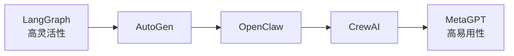
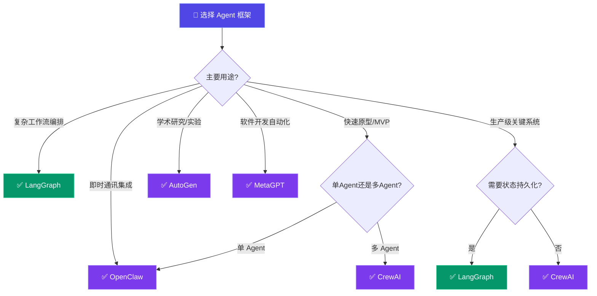

# AI Agent 框架横向对比

> 发布日期：2026-03-14 | 分类：框架 | 作者：探针

---

## Executive Summary

AI Agent 框架是 2024-2025 年 AI 领域最活跃的方向之一。本报告对比分析五个主流 Agent 框架——LangGraph、CrewAI、AutoGen、MetaGPT 和 OpenClaw——从编程模型、状态管理、多 Agent 协作、生产就绪度等维度进行系统性评估。

**核心结论：**
- **LangGraph** 适合需要精细控制状态转换的复杂工作流，学习曲线较陡
- **CrewAI** 以角色扮演范式著称，快速构建多 Agent 团队的最佳选择
- **AutoGen** 微软力推，对话驱动的多 Agent 协作框架
- **MetaGPT** 模拟软件公司组织架构，适合代码生成和软件开发
- **OpenClaw** 以通信为中心的 Agent 框架，集成 Telegram 等实时通讯平台

---

## 1. 框架概览

### 1.1 LangGraph

**项目地址**：[github.com/langchain-ai/langgraph](https://github.com/langchain-ai/langgraph)
**维护方**：LangChain Inc.
**许可证**：MIT

LangGraph 是 LangChain 团队推出的图结构 Agent 框架，将 Agent 工作流建模为有向图。

**核心特性：**
- 图结构工作流：Node（节点）+ Edge（边）
- 状态管理：TypedDict 定义全局状态
- 条件路由：基于状态动态选择下一步
- 持久化：内置 checkpoint 机制
- 人在环路（Human-in-the-loop）支持
- 时间旅行调试：回溯到任意历史状态

**编程模型：**
```python
from langgraph.graph import StateGraph, END
from typing import TypedDict

class AgentState(TypedDict):
    messages: list
    current_step: str

def research_node(state: AgentState) -> AgentState:
    # 研究节点逻辑
    return {"messages": state["messages"] + [research_result]}

def write_node(state: AgentState) -> AgentState:
    # 写作节点逻辑
    return {"messages": state["messages"] + [write_result]}

def route(state: AgentState) -> str:
    return "write" if state["current_step"] == "research_done" else "research"

graph = StateGraph(AgentState)
graph.add_node("research", research_node)
graph.add_node("write", write_node)
graph.add_conditional_edges("research", route)
graph.add_edge("write", END)
app = graph.compile()
```

### 1.2 CrewAI

**项目地址**：[github.com/crewAIInc/crewAI](https://github.com/crewAIInc/crewAI)
**维护方**：CrewAI Inc.
**许可证**：MIT

CrewAI 采用「团队协作」的隐喻，通过定义角色（Agent）、任务（Task）和流程（Process）来构建多 Agent 系统。

**核心特性：**
- 角色扮演：每个 Agent 有明确的角色、目标和背景故事
- 任务委派：Agent 之间自动分配和协作
- 流程编排：Sequential（顺序）和 Hierarchical（层级）
- 工具集成：内置工具 + 自定义工具
- 记忆系统：短期、长期、实体记忆

**编程模型：**
```python
from crewai import Agent, Task, Crew, Process

researcher = Agent(
    role="资深技术研究员",
    goal="深入分析指定技术领域的最新进展",
    backstory="你拥有10年技术研究经验，擅长文献综述和趋势分析",
    tools=[search_tool, scraper_tool]
)

writer = Agent(
    role="技术写作者",
    goal="将研究发现转化为清晰易懂的技术文档",
    backstory="你是知名科技媒体的专栏作者，以深入浅出著称"
)

research_task = Task(
    description="调研 2025 年 AI Agent 框架的最新发展",
    expected_output="详细的调研报告，包含5个主要框架的对比",
    agent=researcher
)

write_task = Task(
    description="基于调研结果撰写一篇 3000 字的技术报告",
    expected_output="结构清晰的技术报告",
    agent=writer,
    context=[research_task]
)

crew = Crew(
    agents=[researcher, writer],
    tasks=[research_task, write_task],
    process=Process.sequential
)

result = crew.kickoff()
```

### 1.3 AutoGen

**项目地址**：[github.com/microsoft/autogen](https://github.com/microsoft/autogen)
**维护方**：Microsoft
**许可证**：MIT（0.4 版本）

AutoGen 是微软推出的多 Agent 对话框架，核心理念是通过 Agent 之间的对话来解决问题。

**核心特性：**
- 对话驱动：Agent 通过消息传递协作
- 灵活的对话模式：两两对话、群聊、嵌套对话
- 代码执行：内置安全的代码执行沙箱
- 人类参与：灵活的人类输入模式
- 0.4 版本重构：更模块化的架构

**编程模型：**
```python
from autogen import AssistantAgent, UserProxyAgent, GroupChat, GroupChatManager

llm_config = {"model": "gpt-4o", "api_key": "..."}

researcher = AssistantAgent(
    name="Researcher",
    system_message="你是一个技术研究员，负责收集和分析信息。",
    llm_config=llm_config
)

writer = AssistantAgent(
    name="Writer",
    system_message="你是一个技术写作者，负责将研究发现转化为文档。",
    llm_config=llm_config
)

reviewer = AssistantAgent(
    name="Reviewer",
    system_message="你是一个审稿人，负责审查文档质量并提供反馈。",
    llm_config=llm_config
)

user_proxy = UserProxyAgent(
    name="User",
    human_input_mode="TERMINATE",
    code_execution_config=False
)

group_chat = GroupChat(
    agents=[user_proxy, researcher, writer, reviewer],
    messages=[],
    max_round=20
)

manager = GroupChatManager(groupchat=group_chat, llm_config=llm_config)
user_proxy.initiate_chat(manager, message="请写一篇关于 AI Agent 的技术报告")
```

### 1.4 MetaGPT

**项目地址**：[github.com/geekan/MetaGPT](https://github.com/geekan/MetaGPT)
**维护方**：DeepWisdom
**许可证**：MIT

MetaGPT 独创「软件公司」范式，模拟产品经理、架构师、工程师等角色协作完成软件开发。

**核心特性：**
- SOP 驱动：标准化操作流程
- 角色专业化：产品经理、架构师、工程师、QA
- 结构化输出：每个角色产生标准化文档
- 代码生成：端到端的软件开发流程
- 环境共享：Agent 共享黑板（消息池）

**编程模型：**
```python
from metagpt.software_company import SoftwareCompany
from metagpt.roles import ProjectManager, Architect, Engineer

async def main():
    company = SoftwareCompany()
    company.hire([
        ProjectManager(),
        Architect(),
        Engineer()
    ])
    company.invest(investment=3.0)
    company.start_project("开发一个简单的 Todo App")
    await company.run(n_round=5)
```

### 1.5 OpenClaw

**项目地址**：[github.com/openclaw/openclaw](https://github.com/openclaw/openclaw)
**维护方**：OpenClaw 社区
**许可证**：Apache 2.0

OpenClaw 是一个以通信为中心的 Agent 框架，强调 Agent 与人类通过即时通讯平台（Telegram、Discord 等）的实时交互。

**核心特性：**
- 通信原生：内置 Telegram/Discord/WhatsApp 适配
- 技能系统：可组合的 Agent 技能（Skills）
- 工具集成：MCP（Model Context Protocol）工具接入
- 会话管理：多会话并行，上下文隔离
- 自主编排：Agent 可创建和管理子 Agent

**编程模型：**
OpenClaw 更多通过配置驱动：

```yaml
# AGENTS.md 配置示例
agent:
  name: tech-researcher
  model: gpt-4o
  channel: telegram
  
skills:
  - github
  - web-search
  - report-generator
  
tools:
  - exec
  - read
  - write
```

---

## 2. 编程模型对比

### 2.1 设计范式

| 框架 | 核心范式 | 抽象层级 |
|------|----------|----------|
| LangGraph | 图（Graph）工作流 | 中等 — 需要定义节点和边 |
| CrewAI | 团队协作（Crew） | 高 — 角色和任务抽象 |
| AutoGen | 对话（Conversation） | 中等 — Agent 和消息 |
| MetaGPT | 软件公司（SOP） | 高 — 预定义角色流程 |
| OpenClaw | 通信驱动（Messaging） | 中等 — 配置 + 技能 |

### 2.2 灵活性 vs 易用性



### 2.3 学习曲线

| 框架 | 上手时间 | 精通时间 | 说明 |
|------|----------|----------|------|
| LangGraph | 2-3 天 | 2-3 周 | 需要理解图结构概念 |
| CrewAI | 数小时 | 1-2 周 | 最直观的 API |
| AutoGen | 1-2 天 | 2-3 周 | 对话模式灵活但需理解 |
| MetaGPT | 数小时 | 1 周 | 预定义角色开箱即用 |
| OpenClaw | 1 天 | 1-2 周 | 配置驱动，需理解架构 |

---

## 3. 状态管理与持久化

### 3.1 状态管理对比

| 框架 | 状态模型 | 持久化 | 时间旅行 |
|------|----------|--------|----------|
| LangGraph | TypedDict 全局状态 | ✅ Checkpointer | ✅ |
| CrewAI | 任务输出链 | 有限 | ❌ |
| AutoGen | 消息历史 | 手动 | ❌ |
| MetaGPT | 共享环境（黑板） | 有限 | ❌ |
| OpenClaw | 会话上下文 | ✅ 内置 | ❌ |

### 3.2 LangGraph 的 Checkpoint 机制

LangGraph 的持久化能力最为成熟：

```python
from langgraph.checkpoint.sqlite import SqliteSaver

checkpointer = SqliteSaver.from_conn_string(":memory:")
app = graph.compile(checkpointer=checkpointer)

# 运行并自动保存 checkpoint
config = {"configurable": {"thread_id": "1"}}
result = app.invoke({"messages": [...]}, config)

# 恢复到特定 checkpoint
result = app.invoke(None, config)  # 继续之前的执行
```

---

## 4. 多 Agent 协作能力

### 4.1 协作模式对比

| 框架 | 顺序执行 | 层级管理 | 群聊对话 | 动态路由 |
|------|----------|----------|----------|----------|
| LangGraph | ✅ | ✅ | ❌ | ✅ |
| CrewAI | ✅ | ✅ | ❌ | 有限 |
| AutoGen | ✅ | ❌ | ✅ | ✅ |
| MetaGPT | ✅ | ✅ | ❌ | ❌ |
| OpenClaw | ✅ | ✅ | 有限 | ✅ |

### 4.2 通信机制

| 框架 | 通信方式 | 消息格式 | 并行执行 |
|------|----------|----------|----------|
| LangGraph | 状态传递 | TypedDict | ✅ |
| CrewAI | 任务委派 | 字符串/Pydantic | 有限 |
| AutoGen | 对话消息 | 文本 + 结构化 | ✅ |
| MetaGPT | 环境消息池 | 结构化文档 | 有限 |
| OpenClaw | 消息路由 | 多格式 | ✅ |

---

## 5. 生产就绪度评估

### 5.1 综合评分

| 维度 | LangGraph | CrewAI | AutoGen | MetaGPT | OpenClaw |
|------|-----------|--------|---------|---------|----------|
| 文档质量 | ⭐⭐⭐⭐⭐ | ⭐⭐⭐⭐ | ⭐⭐⭐⭐ | ⭐⭐⭐ | ⭐⭐⭐⭐ |
| 社区活跃度 | ⭐⭐⭐⭐⭐ | ⭐⭐⭐⭐ | ⭐⭐⭐⭐⭐ | ⭐⭐⭐⭐ | ⭐⭐⭐ |
| 错误处理 | ⭐⭐⭐⭐ | ⭐⭐⭐ | ⭐⭐⭐ | ⭐⭐⭐ | ⭐⭐⭐⭐ |
| 可观测性 | ⭐⭐⭐⭐ | ⭐⭐⭐ | ⭐⭐⭐ | ⭐⭐ | ⭐⭐⭐ |
| 可扩展性 | ⭐⭐⭐⭐⭐ | ⭐⭐⭐ | ⭐⭐⭐⭐ | ⭐⭐⭐ | ⭐⭐⭐⭐ |
| 部署便利性 | ⭐⭐⭐ | ⭐⭐⭐⭐ | ⭐⭐⭐ | ⭐⭐⭐ | ⭐⭐⭐⭐⭐ |
| 生产案例 | 多 | 多 | 多 | 少 | 增长中 |

### 5.2 框架选型决策树



**快速参考**：

| 场景 | 推荐框架 | 理由 |
|------|----------|------|
| 复杂工作流编排 | **LangGraph** | 图结构最灵活，状态管理最强 |
| 快速构建多 Agent 原型 | **CrewAI** | 最简洁的 API，角色抽象直观 |
| 研究/实验性多 Agent | **AutoGen** | 对话模式灵活，学术研究友好 |
| 软件开发自动化 | **MetaGPT** | 预定义软件开发 SOP |
| 即时通讯集成 | **OpenClaw** | 通信原生设计 |
| 生产级关键系统 | **LangGraph** | 持久化、时间旅行、可观测性最好 |

### 5.3 风险提示

1. **Agent 框架变化快**：各框架 API 迭代频繁，锁定效应需考虑
2. **成本不可预测**：多 Agent 协作的 token 消耗可能指数级增长
3. **调试困难**：多 Agent 交互的非确定性增加调试难度
4. **安全边界**：Agent 自主行为的安全控制需要额外设计

---

## 参考来源

1. LangGraph 文档 — [langchain-ai.github.io/langgraph](https://langchain-ai.github.io/langgraph)
2. CrewAI 文档 — [docs.crewai.com](https://docs.crewai.com)
3. AutoGen 文档 — [microsoft.github.io/autogen](https://microsoft.github.io/autogen)
4. MetaGPT 论文 — Hong et al., "MetaGPT: Meta Programming for A Multi-Agent Collaborative Framework", ICLR 2024
5. OpenClaw 文档 — [docs.openclaw.ai](https://docs.openclaw.ai)

---

*本报告基于 2025 年初各框架版本撰写，Agent 框架领域发展极为迅速，建议关注各项目 GitHub 获取最新状态。*
