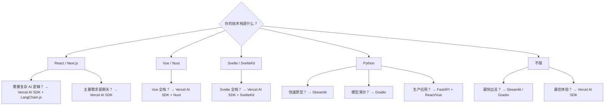

# AI 应用前端框架选型指南

> 发布日期：2026-03-15 | 分类：框架 | 作者：探针（2026-03 更新）

---

## Executive Summary

AI 应用的用户体验很大程度上取决于前端框架的选择。本指南对比分析主流 AI 前端方案——Vercel AI SDK（v4+）、LangChain.js、Streamlit、Gradio——从流式响应、聊天界面、部署方案等维度提供选型建议。2026 年更新新增 Vue/Svelte 生态支持和最新 API 变更。

**核心结论：**
- **Vercel AI SDK v4+** 是 React/Next.js 生态中最成熟的 AI 前端方案，现已支持 Vue/Svelte
- **Streamlit** 是数据科学团队快速原型的最佳选择
- **Gradio** 适合需要分享模型演示的场景
- **LangChain.js** 适合需要复杂后端逻辑的全栈应用
- 流式响应是 AI 应用用户体验的核心差异点

---

## 1. 框架概览

### 1.1 Vercel AI SDK（v4+，截至 2026-03）

**定位**：TypeScript 生态的 AI 应用工具包
**许可证**：Apache 2.0
**GitHub**：[github.com/vercel/ai](https://github.com/vercel/ai)
**当前版本**：v6.x stable（v4 于 2024 年发布，v5/v6 为后续迭代）

Vercel AI SDK v4 是重大版本升级，统一了提供商接口，引入了 `@ai-sdk/*` 生态包。v5/v6 在此基础上增加了 AI Gateway、ToolLoopAgent 等企业级功能。

**核心功能（v4+ API）：**
- `useChat` Hook：流式聊天状态管理
- `useCompletion` Hook：单次补全
- `useObject` Hook：结构化流式输出
- `generateText` / `streamText`：服务端核心函数
- 多提供商支持：OpenAI、Anthropic、Google、Mistral 等（通过 `@ai-sdk/*` 包）
- 流式传输协议：SSE、Text Stream、Data Stream
- RSC（React Server Components）支持
- **Vue 和 Svelte 官方支持**（`@ai-sdk/vue`、`@ai-sdk/svelte`）

**React 客户端代码示例（v4+ API）：**

```tsx
"use client";

import { useChat } from "@ai-sdk/react";

export default function Chat() {
  const { messages, input, handleInputChange, handleSubmit, isLoading, error } = useChat({
    api: "/api/chat",
    onError: (error) => console.error(error),
  });

  return (
    <div className="chat-container">
      {messages.map((m) => (
        <div key={m.id} className={`message ${m.role}`}>
          <strong>{m.role === "user" ? "用户" : "AI"}:</strong>
          <p>{m.content}</p>
        </div>
      ))}
      {error && <div className="error">{error.message}</div>}
      <form onSubmit={handleSubmit}>
        <input
          value={input}
          onChange={handleInputChange}
          placeholder="输入消息..."
          disabled={isLoading}
        />
        <button type="submit" disabled={isLoading}>
          {isLoading ? "思考中..." : "发送"}
        </button>
      </form>
    </div>
  );
}
```

**服务端 API 路由（v4+ API）：**

```typescript
// app/api/chat/route.ts
import { openai } from "@ai-sdk/openai";
import { streamText } from "ai";

export async function POST(req: Request) {
  const { messages } = await req.json();

  const result = streamText({
    model: openai("gpt-4o"),
    messages,
    system: "你是一个有帮助的助手。",
  });

  return result.toDataStreamResponse();
}
```

**v4 主要 API 变更（从 v3 迁移）：**

| v3 API | v4+ API | 说明 |
|--------|---------|------|
| `import { useChat } from "ai/react"` | `import { useChat } from "@ai-sdk/react"` | 包路径变更 |
| `import { OpenAIStream } from "ai"` | `import { streamText } from "ai"` | 统一流式 API |
| `StreamingTextResponse` | `result.toDataStreamResponse()` | 响应方式变更 |
| `openai("gpt-4")` | `openai("gpt-4o")` | 模型参数更新 |
| `Configuration` 类 | `@ai-sdk/openai` 包 | 提供商包独立 |

**优势：**
- 类型安全的 TypeScript API
- 自动处理流式响应
- 内置 loading/error 状态管理
- 与 Vercel 部署无缝集成
- 支持工具调用的 UI 渲染
- 跨框架支持（React/Vue/Svelte）

### 1.2 LangChain.js

**定位**：JavaScript/TypeScript 的 AI 应用框架
**许可证**：MIT
**GitHub**：[github.com/langchain-ai/langchainjs](https://github.com/langchain-ai/langchainjs)

LangChain.js 是 Python LangChain 的 JavaScript 移植，提供完整的 AI 应用构建工具链。

**核心功能：**
- 模型抽象：统一接口调用不同 LLM
- Chain：可组合的工作流
- RAG：检索增强生成
- Memory：对话历史管理
- Agent：工具调用和推理

```typescript
import { ChatOpenAI } from "@langchain/openai";
import { HumanMessage, SystemMessage } from "@langchain/core/messages";

const model = new ChatOpenAI({
  modelName: "gpt-4o",
  streaming: true,
  callbacks: [{
    handleLLMNewToken(token: string) {
      process.stdout.write(token);
    },
  }],
});

const response = await model.invoke([
  new SystemMessage("你是一个技术助手。"),
  new HumanMessage("解释什么是 TypeScript。"),
]);
```

**优势：**
- 功能最完整的 AI 框架
- 丰富的工具和集成
- 社区生态庞大

**劣势：**
- 学习曲线较陡
- 前端体验需要自行构建
- 包体积较大

### 1.3 Streamlit

**定位**：Python 数据应用快速原型框架
**许可证**：Apache 2.0
**GitHub**：[github.com/streamlit/streamlit](https://github.com/streamlit/streamlit)

Streamlit 是数据科学领域最流行的 Web 应用框架，对 AI 应用有原生支持。

**核心功能：**
- `st.chat_message` / `st.chat_input`：聊天组件
- `st.write_stream`：流式渲染
- Session State：状态管理
- 自动热重载
- 一行部署到 Streamlit Cloud

```python
import streamlit as st
from openai import OpenAI

st.title("AI 聊天助手")

# 初始化 OpenAI 客户端
client = OpenAI(api_key=st.secrets["OPENAI_API_KEY"])

# 初始化聊天历史
if "messages" not in st.session_state:
    st.session_state.messages = []

# 显示聊天历史
for message in st.session_state.messages:
    with st.chat_message(message["role"]):
        st.markdown(message["content"])

# 用户输入
if prompt := st.chat_input("输入消息..."):
    st.session_state.messages.append({"role": "user", "content": prompt})
    with st.chat_message("user"):
        st.markdown(prompt)

    # 流式响应
    with st.chat_message("assistant"):
        stream = client.chat.completions.create(
            model="gpt-4o",
            messages=[{"role": m["role"], "content": m["content"]}
                     for m in st.session_state.messages],
            stream=True,
        )
        response = st.write_stream(
            chunk.choices[0].delta.content or ""
            for chunk in stream
        )
    st.session_state.messages.append({"role": "assistant", "content": response})
```

**优势：**
- Python 原生，数据科学友好
- 最快的原型速度
- 内置组件丰富
- Streamlit Cloud 免费部署

**劣势：**
- 自定义样式能力有限
- 不适合复杂 UI 需求
- 每次交互全页面刷新（虽然体验流畅）

### 1.4 Gradio

**定位**：机器学习模型演示和分享框架
**许可证**：Apache 2.0
**GitHub**：[github.com/gradio-app/gradio](https://github.com/gradio-app/gradio)

Gradio 专为机器学习演示设计，Hugging Face Spaces 默认使用 Gradio。

**核心功能：**
- `gr.ChatInterface`：一行代码创建聊天界面
- `gr.Blocks`：自定义布局
- 多模态输入输出（文本、图片、音频、视频）
- HuggingFace Spaces 一键部署
- 内置分享链接

```python
import gradio as gr
from openai import OpenAI

client = OpenAI()

def chat(message, history):
    messages = [{"role": "system", "content": "你是一个有帮助的助手。"}]
    for human, assistant in history:
        messages.append({"role": "user", "content": human})
        messages.append({"role": "assistant", "content": assistant})
    messages.append({"role": "user", "content": message})

    stream = client.chat.completions.create(
        model="gpt-4o",
        messages=messages,
        stream=True,
    )

    response = ""
    for chunk in stream:
        response += chunk.choices[0].delta.content or ""
        yield response

demo = gr.ChatInterface(
    chat,
    title="AI 聊天助手",
    description="基于 GPT-4o 的智能对话系统",
    examples=["解释量子计算", "写一首关于编程的诗", "什么是 Transformer 架构？"],
)

demo.launch()
```

**优势：**
- 最简 API，一行创建界面
- 多模态输入输出原生支持
- HuggingFace Spaces 集成
- 自动生成分享链接

**劣势：**
- 复杂自定义布局较困难
- 企业级特性较少
- 状态管理较弱

---

## 2. Vue / Svelte 生态支持（2026-03 更新）

### 2.1 Vercel AI SDK — Vue 集成

Vercel AI SDK v4+ 通过 `@ai-sdk/vue` 包提供 Vue 3 支持：

```vue
<script setup lang="ts">
import { useChat } from "@ai-sdk/vue";

const { messages, input, handleSubmit, isLoading, error } = useChat({
  api: "/api/chat",
});
</script>

<template>
  <div class="chat-container">
    <div v-for="m in messages" :key="m.id" :class="['message', m.role]">
      <strong>{{ m.role === "user" ? "用户" : "AI" }}:</strong>
      <p>{{ m.content }}</p>
    </div>
    <div v-if="error" class="error">{{ error.message }}</div>
    <form @submit="handleSubmit">
      <input
        v-model="input"
        placeholder="输入消息..."
        :disabled="isLoading"
      />
      <button type="submit" :disabled="isLoading">
        {{ isLoading ? "思考中..." : "发送" }}
      </button>
    </form>
  </div>
</template>
```

**Nuxt 3 集成：**

```typescript
// server/api/chat.post.ts
import { openai } from "@ai-sdk/openai";
import { streamText } from "ai";

export default defineEventHandler(async (event) => {
  const { messages } = await readBody(event);

  const result = streamText({
    model: openai("gpt-4o"),
    messages,
  });

  return result.toDataStreamResponse();
});
```

### 2.2 Vercel AI SDK — Svelte 集成

Vercel AI SDK v4+ 通过 `@ai-sdk/svelte` 包提供 Svelte 支持：

```svelte
<script lang="ts">
  import { useChat } from "@ai-sdk/svelte";

  const { messages, input, handleSubmit, isLoading } = useChat({
    api: "/api/chat",
  });
</script>

<div class="chat-container">
  {#each $messages as m (m.id)}
    <div class="message {m.role}">
      <strong>{m.role === "user" ? "用户" : "AI"}:</strong>
      <p>{m.content}</p>
    </div>
  {/each}
  <form on:submit={handleSubmit}>
    <input
      bind:value={$input}
      placeholder="输入消息..."
      disabled={$isLoading}
    />
    <button type="submit" disabled={$isLoading}>
      {$isLoading ? "思考中..." : "发送"}
    </button>
  </form>
</div>
```

**SvelteKit 集成：**

```typescript
// src/routes/api/chat/+server.ts
import { openai } from "@ai-sdk/openai";
import { streamText } from "ai";
import type { RequestHandler } from "./$types";

export const POST: RequestHandler = async ({ request }) => {
  const { messages } = await request.json();

  const result = streamText({
    model: openai("gpt-4o"),
    messages,
  });

  return result.toDataStreamResponse();
};
```

### 2.3 框架支持对比

| 功能 | React | Vue | Svelte |
|------|-------|-----|--------|
| `useChat` | ✅ | ✅ | ✅ |
| `useCompletion` | ✅ | ✅ | ✅ |
| `useObject` | ✅ | ✅ | ✅ |
| RSC 支持 | ✅ | ❌ | ❌ |
| Server Actions | ✅ | ❌ | ❌ |
| 框架集成 | Next.js | Nuxt 3 | SvelteKit |

---

## 3. 流式响应与用户体验

### 3.1 流式响应方案对比

| 方案 | 机制 | 延迟 | 实现复杂度 |
|------|------|------|-----------|
| SSE (Server-Sent Events) | 服务端推送 | 低 | 中 |
| WebSocket | 双向通信 | 最低 | 高 |
| Streaming Fetch | ReadableStream | 低 | 中 |
| chunked Transfer-Encoding | HTTP 分块 | 中 | 低 |

### 3.2 Vercel AI SDK v4+ 的流式实现

```typescript
// 服务端 - 使用 AI SDK v4+ 的流式协议
import { streamText } from "ai";
import { openai } from "@ai-sdk/openai";

export async function POST(req: Request) {
  const { messages } = await req.json();

  const result = streamText({
    model: openai("gpt-4o"),
    messages,
    system: "你是一个有帮助的助手。",
  });

  return result.toDataStreamResponse(); // AI SDK 专有协议，支持元数据
}
```

Vercel AI SDK v4+ 支持三种流式传输协议：
- **Text Stream**：纯文本流
- **Data Stream**：包含元数据的结构化流（推荐）
- **SSE**：标准 Server-Sent Events

### 3.3 首 Token 延迟优化

| 优化策略 | 效果 | 实现 |
|----------|------|------|
| 边缘函数 | 减少网络跳数 | Vercel Edge Functions |
| 流式传输 | 感知延迟降低 60%+ | SSE / Streaming |
| 预加载 | 页面加载优化 | Next.js prefetch |
| Skeleton UI | 减少白屏时间 | 加载占位符 |
| 缓存 | 热点查询加速 | Redis / CDN |

### 3.4 流式 Markdown 渲染

AI 输出通常是 Markdown 格式，流式渲染需要特殊处理：

```tsx
import { useChat } from "@ai-sdk/react";
import { MemoizedReactMarkdown } from "./markdown";

function StreamingChat() {
  const { messages } = useChat();

  return messages.map((m) => (
    <MemoizedReactMarkdown key={m.id}>
      {m.content}
    </MemoizedReactMarkdown>
  ));
}
```

**挑战：**
- 不完整的 Markdown 语法（代码块未闭合）
- 表格/列表在流式中可能错乱
- 需要缓冲和智能拆分

---

## 4. 聊天界面组件库

### 4.1 现成组件库

| 库 | 框架 | 特点 |
|----|------|------|
| `@ai-sdk/react` | React | Vercel AI SDK 内置 |
| `@ai-sdk/vue` | Vue | Vercel AI SDK 内置（v4+） |
| `@ai-sdk/svelte` | Svelte | Vercel AI SDK 内置（v4+） |
| `assistant-ui` | React | 专为 AI 聊天设计的组件库 |
| `shadcn/ui` + AI | React | 基于 shadcn 的 AI 聊天模板 |
| `chainlit` | Python | 专为 LLM 应用设计的 UI |
| `botui` | JS | 轻量级聊天组件 |

### 4.2 assistant-ui 示例

```tsx
import { AssistantRuntimeProvider } from "@assistant-ui/react";
import { useChatRuntime } from "@assistant-ui/react-ai-sdk";
import {
  Thread,
  ThreadList,
  Composer,
  AssistantMessage,
  UserMessage,
} from "@assistant-ui/react";

function ChatApp() {
  const runtime = useChatRuntime({ api: "/api/chat" });

  return (
    <AssistantRuntimeProvider runtime={runtime}>
      <div className="flex h-screen">
        <ThreadList />
        <div className="flex-1 flex flex-col">
          <Thread />
          <Composer />
        </div>
      </div>
    </AssistantRuntimeProvider>
  );
}
```

### 4.3 聊天界面最佳实践

1. **消息区分**：用户/AI/系统消息使用不同样式
2. **代码高亮**：集成 `react-syntax-highlighter` 或 `shiki`
3. **复制按钮**：代码块和消息都应有复制功能
4. **重新生成**：允许用户重新生成 AI 回复
5. **停止生成**：提供停止按钮
6. **打字指示器**：AI 思考时显示加载动画
7. **Markdown 渲染**：支持完整的 Markdown 语法
8. **图片渲染**：支持 AI 生成/返回的图片

---

## 5. 部署方案

### 5.1 部署选项对比

| 方案 | 适用框架 | 成本 | 性能 | 配置复杂度 |
|------|----------|------|------|-----------|
| Vercel | AI SDK / Next.js | 低-中 | 高 | 低 |
| Streamlit Cloud | Streamlit | 免费-低 | 中 | 极低 |
| HuggingFace Spaces | Gradio | 免费-低 | 中 | 极低 |
| AWS (ECS/Lambda) | 全部 | 中-高 | 高 | 高 |
| Railway / Render | 全部 | 低-中 | 中 | 低 |
| Docker 自建 | 全部 | 按需 | 按需 | 中 |

### 5.2 Vercel 部署

```json
// vercel.json
{
  "functions": {
    "app/api/chat/route.ts": {
      "maxDuration": 60
    }
  }
}
```

```bash
# 部署
npx vercel

# 环境变量
vercel env add OPENAI_API_KEY
```

**注意事项：**
- Hobby 计划有函数执行限制（需升级到 Pro）
- Edge Functions 支持流式响应
- 自动 HTTPS 和全球 CDN

### 5.3 Docker 自建部署

```dockerfile
FROM node:20-slim

WORKDIR /app
COPY package*.json ./
RUN npm ci --production
COPY . .
RUN npm run build

EXPOSE 3000
CMD ["npm", "start"]
```

```yaml
# docker-compose.yml
services:
  ai-chat:
    build: .
    ports:
      - "3000:3000"
    environment:
      - OPENAI_API_KEY=${OPENAI_API_KEY}
    restart: unless-stopped
```

---

## 6. 选型决策框架

### 6.1 决策树



### 6.2 综合评分

| 维度 | Vercel AI SDK | LangChain.js | Streamlit | Gradio |
|------|--------------|-------------|-----------|--------|
| 上手速度 | ⭐⭐⭐⭐ | ⭐⭐⭐ | ⭐⭐⭐⭐⭐ | ⭐⭐⭐⭐⭐ |
| 流式体验 | ⭐⭐⭐⭐⭐ | ⭐⭐⭐⭐ | ⭐⭐⭐⭐ | ⭐⭐⭐⭐ |
| 自定义程度 | ⭐⭐⭐⭐⭐ | ⭐⭐⭐⭐⭐ | ⭐⭐ | ⭐⭐⭐ |
| 生产就绪 | ⭐⭐⭐⭐⭐ | ⭐⭐⭐⭐ | ⭐⭐⭐ | ⭐⭐⭐ |
| 社区生态 | ⭐⭐⭐⭐ | ⭐⭐⭐⭐⭐ | ⭐⭐⭐⭐⭐ | ⭐⭐⭐⭐ |
| 多模态支持 | ⭐⭐⭐⭐ | ⭐⭐⭐⭐ | ⭐⭐⭐ | ⭐⭐⭐⭐⭐ |
| 多框架支持 | ⭐⭐⭐⭐⭐ | ⭐⭐⭐ | ⭐⭐ | ⭐⭐⭐ |
| 文档质量 | ⭐⭐⭐⭐⭐ | ⭐⭐⭐ | ⭐⭐⭐⭐⭐ | ⭐⭐⭐⭐⭐ |

### 6.3 选型建议

| 场景 | 推荐 | 理由 |
|------|------|------|
| 企业级 AI 产品 | **Vercel AI SDK** | 最完整的 TypeScript AI 工具链，多框架支持 |
| Vue 全栈应用 | **Vercel AI SDK + Nuxt** | Vue 3 官方支持 |
| Svelte 应用 | **Vercel AI SDK + SvelteKit** | Svelte 官方支持 |
| 数据科学团队 | **Streamlit** | Python 原生，极速开发 |
| ML 模型演示 | **Gradio** | 最简部署，HF Spaces 集成 |
| 复杂 RAG 应用 | **LangChain.js** | 最丰富的 AI 集成 |
| 快速 MVP | **Streamlit / Gradio** | 数小时出活 |
| 自定义 UI | **Vercel AI SDK** | 完全控制前端 |

---

## 参考来源

1. Vercel AI SDK 文档 — [sdk.vercel.ai](https://sdk.vercel.ai)
2. Vercel AI SDK 迁移指南 v3→v4 — [sdk.vercel.ai/docs/migration-guide](https://sdk.vercel.ai/docs/migration-guide/4.0)
3. Vercel AI SDK GitHub — [github.com/vercel/ai](https://github.com/vercel/ai)
4. LangChain.js 文档 — [js.langchain.com](https://js.langchain.com)
5. Streamlit 文档 — [docs.streamlit.io](https://docs.streamlit.io)
6. Gradio 文档 — [gradio.app/docs](https://www.gradio.app/docs)
7. assistant-ui — [assistant-ui.com](https://www.assistant-ui.com)

---

*本报告基于 2026 年 3 月各框架版本撰写，前端框架迭代快速，API 可能有变化，请以官方文档为准。Vercel AI SDK 目前稳定版为 v6.x，v4 为重要里程碑版本。*
