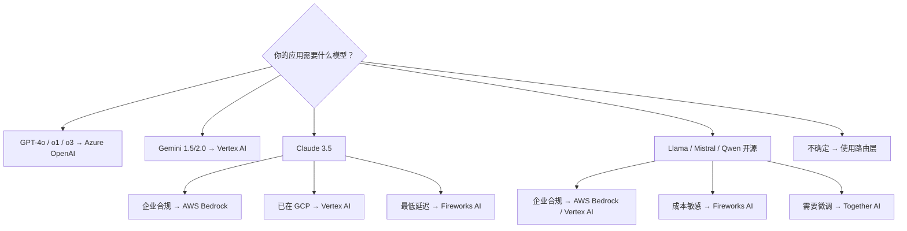

# AI 基础设施与云平台对比

> **分类**: 框架类 | **更新**: 2026-03-14 | **字数**: ~3500字

---

## Executive Summary

企业部署 AI 应用时，选择合适的云平台和推理服务商是关键决策。当前市场格局呈现「三大云 + 独立推理商」的竞争态势：**AWS Bedrock**、**Azure OpenAI Service**、**Google Vertex AI** 构成第一梯队，提供全栈企业级能力；**Together AI** 和 **Fireworks AI** 作为独立推理平台，以更低延迟和灵活定价切入市场。

本报告从五个核心维度进行系统对比：**模型可用性与延迟**、**定价模型**、**企业特性（安全/合规/SLA）**、**多云策略**，并给出分场景的实践建议。

**核心结论**：
- **Azure OpenAI** 在 GPT 系列深度集成和 Microsoft 生态企业客户中占据优势，适合重度依赖 OpenAI 模型的团队
- **AWS Bedrock** 模型选择最丰富（Anthropic、Meta、Cohere 等），适合多模型策略和已有 AWS 基础设施的企业
- **Google Vertex AI** 在 Gemini 系列和开源模型部署上有独特优势，TPU 原生支持适合大规模推理
- **Together AI / Fireworks AI** 在推理延迟和性价比上优于三大云，但企业级合规和全球基础设施相对薄弱
- **多云策略** 正成为主流，通过模型路由层实现供应商解耦是最佳实践

---

## 1. 平台概览与定位

### 1.1 AWS Bedrock

AWS Bedrock 于 2023 年 GA，定位为「完全托管的多模型 API 服务」。核心理念是通过单一 API 接入多个基础模型，无需管理底层基础设施。

**关键特性**：
- 支持模型：Anthropic Claude（3.5 Sonnet, 3 Haiku, Opus）、Meta Llama 3/3.1/3.3、Mistral、Cohere、Amazon Titan、Stability AI
- 自定义模型微调（Fine-tuning）和持续预训练（Continued Pre-training）
- Knowledge Bases（RAG 原生支持）和 Agents（函数调用编排）
- Guardrails（内容过滤、PII 检测、话题限制）
- 跨区域推理（Cross-region Inference）优化延迟和可用性

**市场定位**：AWS 生态内的 AI 入口，强调模型多样性而非绑定单一供应商。

### 1.2 Azure OpenAI Service

微软与 OpenAI 的深度战略合作使 Azure 成为 GPT 系列模型的「官方企业入口」。Azure OpenAI 于 2023 年初全面开放。

**关键特性**：
- 独家提供 GPT-4o、GPT-4 Turbo、GPT-4、GPT-3.5 Turbo、o1/o3 推理系列
- DALL-E 3、Whisper、TTS、Embeddings 全系列
- Assistants API（多步函数调用、文件检索、代码解释器）
- On Your Data（原生 RAG，连接 Azure AI Search、Cosmos DB 等）
- 内置内容安全（Content Safety）和负责任 AI 过滤器
- PTU（Provisioned Throughput Units）提供可预测性能

**市场定位**：OpenAI 模型企业版的唯一云平台入口，深度集成 Microsoft 365 和 Power Platform。

### 1.3 Google Vertex AI

Google Vertex AI 是 Google Cloud 的统一 ML 平台，覆盖从训练到部署的完整生命周期。

**关键特性**：
- Gemini 系列独家：Gemini 1.5 Pro（100万/200万 token 上下文）、Gemini 1.5 Flash、Gemini 2.0
- Model Garden：访问 150+ 基础模型（包括 Anthropic Claude、Meta Llama、Mistral）
- 自有模型微调和部署（支持自定义容器）
- Gemini 原生多模态能力（文本、图像、视频、音频、代码）
- Grounding with Google Search（搜索增强生成）
- TPU 原生优化，大规模推理成本优势

**市场定位**：以 Gemini 系列为核心，兼顾第三方模型，强调整合 Google 搜索和 Workspace 生态。

### 1.4 Together AI

Together AI 成立于 2022 年，由斯坦福 AI 实验室前成员创立，定位为「最快的开源模型推理平台」。

**关键特性**：
- 200+ 开源模型（Llama、Mistral、Qwen、DeepSeek、Phi、DBRX 等）
- 低延迟推理引擎（Turbo 和 Lite 推理端点）
- Serverless 和 Dedicated 端点灵活切换
- 原生微调支持（LoRA、全参数微调）
- 集群和 GPU 租赁（用于训练）
- 延迟中位数通常 <100ms（取决于模型大小）

**市场定位**：专注开源模型的最优推理体验，面向开发者和 AI-Native 公司。

### 1.5 Fireworks AI

Fireworks AI 由前 Meta PyTorch 团队成员创立，专注「高性能推理基础设施」。

**关键特性**：
- 优化的推理引擎（基于自研的 FireAttention 引擎）
- 支持模型：Llama 3/3.1/3.3、Mixtral、DeepSeek、Qwen、Stable Diffusion、SDXL
- Compound AI System：多模型编排（将多个小模型组合执行复杂任务）
- Function Calling 原生支持
- 低延迟优化（FlashAttention、推测解码、量化）
- 按需和预留模式

**市场定位**：极致推理性能，适合对延迟敏感的实时 AI 应用。

---

## 2. 模型可用性与延迟对比

### 2.1 主流模型可用性矩阵

| 模型系列 | AWS Bedrock | Azure OpenAI | Vertex AI | Together AI | Fireworks AI |
|----------|:-----------:|:------------:|:---------:|:-----------:|:------------:|
| GPT-4o / GPT-4 | ❌ | ✅ | ❌ | ❌ | ❌ |
| o1 / o3 | ❌ | ✅ | ❌ | ❌ | ❌ |
| Claude 3.5 Sonnet | ✅ | ❌ | ✅ | ✅ | ✅ |
| Claude 3 Haiku | ✅ | ❌ | ✅ | ✅ | ✅ |
| Gemini 1.5 Pro | ❌ | ❌ | ✅ | ❌ | ❌ |
| Gemini 2.0 | ❌ | ❌ | ✅ | ❌ | ❌ |
| Llama 3.1 405B | ✅ | ❌ | ✅ | ✅ | ✅ |
| Llama 3.3 70B | ✅ | ❌ | ✅ | ✅ | ✅ |
| Mistral Large | ✅ | ✅ | ✅ | ✅ | ✅ |
| DeepSeek V3/R1 | ❌ | ❌ | ❌ | ✅ | ✅ |
| Qwen 2.5 | ❌ | ❌ | ✅ | ✅ | ✅ |
| Cohere Command R+ | ✅ | ❌ | ❌ | ✅ | ❌ |

**分析**：
- **Azure 是 GPT 系列唯一入口**——这是最关键的排他性优势
- **Bedrock 模型选择最多**（15+ 主流模型），但不支持 Google 和 GPT 系列
- **Vertex AI** 独占 Gemini，同时通过 Model Garden 接入第三方模型
- **Together/Fireworks** 覆盖几乎所有主流开源模型，且通常比三大云更快上线新版本

### 2.2 延迟表现

推理延迟取决于模型大小、输入长度、并发量和地理位置。以下为基于公开基准测试的典型值（2025 Q4 数据）：

**首 token 延迟（Time to First Token, TTFT）**：

| 平台 | 小模型 (<10B) | 中模型 (10-70B) | 大模型 (70B+) |
|------|:-----------:|:------------:|:-----------:|
| AWS Bedrock | 200-400ms | 500-1200ms | 1-3s |
| Azure OpenAI | 150-350ms | 400-1000ms | 800-2500ms |
| Vertex AI | 180-380ms | 450-1100ms | 900-2800ms |
| Together AI | 80-200ms | 150-500ms | 300-1200ms |
| Fireworks AI | 60-180ms | 120-450ms | 250-1000ms |

**关键洞察**：
- **独立推理商延迟优势明显**：Together 和 Fireworks 的 TTFT 通常比三大云快 50-70%
- **原因**：三大云有更多中间层（身份验证、区域路由、日志审计），而独立商优化了推理管线的每一层
- **TPU 优势**：Vertex AI 在 Gemini 系列上延迟表现优异，因为 TPU 是原生优化目标
- **Azure PTU**：Provisioned Throughput Units 可提供稳定的低延迟，但需提前预留容量

### 2.3 可用性区域

| 平台 | 区域数量 | 中国区 | 备注 |
|------|:------:|:----:|------|
| AWS Bedrock | 20+ | ❌ | us-east-1, eu-west-1, ap-northeast-1 等 |
| Azure OpenAI | 30+ | ✅（世纪互联） | 全球最广泛，包括 Azure Government |
| Vertex AI | 20+ | ❌ | 全球分布，部分模型区域受限 |
| Together AI | 3 | ❌ | 美国为主，延迟对亚洲用户较高 |
| Fireworks AI | 2 | ❌ | 美国为主 |

**关键洞察**：
- **Azure 在合规区域覆盖上遥遥领先**，包括政府云（Azure Government）和中国区（世纪互联运营）
- **三大云具备全球多区域部署能力**，可满足数据驻留（Data Residency）要求
- **独立推理商区域覆盖有限**，跨国企业需要评估数据主权合规风险

---

## 3. 定价模型对比

### 3.1 定价结构总览

| 平台 | 定价模型 | 计费粒度 | 预留折扣 | 免费额度 |
|------|---------|:------:|:------:|:------:|
| AWS Bedrock | 按 token | 输入/输出分离 | ✅（Commitment） | ❌ |
| Azure OpenAI | 按 token | 输入/输出分离 | ✅（PTU 预留） | ❌ |
| Vertex AI | 按 token | 输入/输出分离 | ✅（CUD） | $300 免费额度 |
| Together AI | 按 token | 输入/输出分离 | ✅（Dedicated） | $5 初始额度 |
| Fireworks AI | 按 token | 输入/输出分离 | ✅（Reserved） | 少量免费额度 |

### 3.2 典型模型定价对比（美元/百万 token）

#### GPT-4o 级别模型（中等规模，最佳质量）

| 平台 | 模型 | 输入价格 | 输出价格 |
|------|------|:------:|:------:|
| Azure OpenAI | GPT-4o | $2.50 | $10.00 |
| Azure OpenAI | GPT-4o mini | $0.15 | $0.60 |

#### Claude 3.5 Sonnet 级别模型

| 平台 | 模型 | 输入价格 | 输出价格 |
|------|------|:------:|:------:|
| AWS Bedrock | Claude 3.5 Sonnet | $3.00 | $15.00 |
| Vertex AI | Claude 3.5 Sonnet | $3.00 | $15.00 |
| Together AI | Claude 3.5 Sonnet | $3.00 | $15.00 |
| Fireworks AI | Claude 3.5 Sonnet | $3.00 | $15.00 |

#### 开源大模型（70B 级别）

| 平台 | 模型 | 输入价格 | 输出价格 |
|------|------|:------:|:------:|
| AWS Bedrock | Llama 3.1 70B | $0.72 | $0.72 |
| Vertex AI | Llama 3.1 70B | $0.56 | $1.68 |
| Together AI | Llama 3.1 70B Turbo | $0.88 | $0.88 |
| Fireworks AI | Llama 3.1 70B | $0.54 | $0.54 |

#### Gemma / 小模型（<10B 级别）

| 平台 | 模型 | 输入价格 | 输出价格 |
|------|------|:------:|:------:|
| Vertex AI | Gemma 2 9B | $0.075 | $0.075 |
| Together AI | Gemma 2 9B | $0.03 | $0.03 |
| Fireworks AI | Gemma 2 9B | $0.02 | $0.02 |

### 3.3 定价分析

**三大云的特点**：
- **价格趋同但结构不同**：第三方模型（如 Claude、Llama）在三大云上价格差异不大，因为模型供应商有定价话语权
- **自有模型有定价优势**：Azure 对 GPT 系列、Vertex 对 Gemini 系列、Bedrock 对 Titan 系列有成本优势
- **企业折扣空间大**：通过 Commitment Discount、Reserved Capacity 等方式可获得 20-50% 折扣

**独立推理商的特点**：
- **开源模型性价比极高**：Fireworks 在小模型上价格比三大云低 40-70%
- **透明定价**：没有复杂的分层定价和隐藏费用
- **规模效应明显**：随着使用量增加，Dedicated 端点的单位成本显著下降

**隐藏成本警示**：
- 三大云的 API 调用、数据传输、VPC 端点等附加费用可能增加 10-30% 总成本
- Azure PTU 预留有最低承诺期限（通常 1-3 个月）
- Vertex AI 的 Grounding with Google Search 有额外计费

---

## 4. 企业特性：安全、合规与 SLA

### 4.1 安全特性对比

| 安全特性 | AWS Bedrock | Azure OpenAI | Vertex AI | Together AI | Fireworks AI |
|----------|:-----------:|:------------:|:---------:|:-----------:|:------------:|
| 传输加密 (TLS) | ✅ | ✅ | ✅ | ✅ | ✅ |
| 静态加密 | ✅ | ✅ | ✅ | ✅ | ✅ |
| 客户管理密钥 (CMK) | ✅ | ✅ | ✅ | ❌ | ❌ |
| VPC 私有端点 | ✅ | ✅ | ✅ | ❌ | ❌ |
| 数据不用于训练 | ✅ | ✅ | ✅ | ✅ | ✅ |
| PII 检测/脱敏 | ✅ (Guardrails) | ✅ (Content Safety) | ✅ (DLP API) | ❌ | ❌ |
| 内容过滤 | ✅ | ✅ | ✅ | 基础 | 基础 |
| SOC 2 Type II | ✅ | ✅ | ✅ | ✅ | ✅ |
| HIPAA BAA | ✅ | ✅ | ✅ | ❌ | ❌ |
| FedRAMP | ✅ | ✅ | ✅ | ❌ | ❌ |
| GDPR | ✅ | ✅ | ✅ | ✅ | ✅ |
| 中国数据驻留 | ❌ | ✅ (世纪互联) | ❌ | ❌ | ❌ |

### 4.2 企业级特性深度分析

**三大云核心优势**：

1. **网络隔离**：三大云均支持通过 VPC/Private Endpoint 访问 AI API，数据不经过公共互联网。这是金融、医疗等受监管行业的硬性要求。

2. **身份与访问管理**：
   - AWS IAM + Resource Policies 细粒度控制模型访问
   - Azure Entra ID (原 AAD) + RBAC + 条件访问策略
   - Google Cloud IAM + VPC Service Controls

3. **审计与合规**：
   - 三大云均提供完整的 API 调用审计日志（CloudTrail / Azure Monitor / Cloud Audit Logs）
   - 支持将日志输出到 SIEM 系统（Splunk、Sentinel 等）

4. **数据治理**：
   - Bedrock Guardrails：可配置内容过滤规则、话题限制、PII 检测（自动脱敏或拦截）
   - Azure Content Safety：多类别内容检测（暴力、仇恨、性内容、自残）
   - Vertex AI Safety Filters：Google 的负责任 AI 体系

**独立推理商的差距**：
- **合规认证不全**：Together AI 和 Fireworks AI 在 HIPAA、FedRAMP 等行业特定合规上缺失
- **无 VPC 集成**：无法通过私有网络访问，所有流量经过公共互联网
- **数据驻留不可控**：仅美国数据中心，无法满足欧盟或亚太的数据主权要求
- **审计能力有限**：日志记录和访问控制粒度不如三大云

### 4.3 SLA 对比

| 平台 | 标准 SLA | 承诺类型 | 赔偿方式 |
|------|:------:|:------:|---------|
| AWS Bedrock | 99.9% | 月度可用性 | 服务信用（10-30%） |
| Azure OpenAI | 99.9% | 月度可用性 | 服务信用（10-25%） |
| Vertex AI | 99.9% | 月度可用性 | 服务信用（10-50%） |
| Together AI | 99.9% | 月度可用性 | 服务信用（5-25%） |
| Fireworks AI | 99.9%（Dedicated） | 月度可用性 | 服务信用 |

**注意**：
- 三大云的 SLA 包含详细的排除条款（计划维护、客户自身问题、DDoS 攻击等）
- PTU/预留模式的 SLA 通常高于按需模式
- 独立推理商的 SLA 执行力度和赔偿计算相对不够成熟

---

## 5. 多云策略与模型路由

### 5.1 为什么需要多云 AI 策略

单平台绑定的风险包括：
1. **供应商锁定**：API 不兼容导致迁移成本高昂
2. **价格风险**：单一定价权在供应商手中
3. **可用性风险**：单一云的区域性故障影响全局
4. **模型锁定**：最佳模型可能不在你的主平台上

### 5.2 多云 AI 架构模式

**模式一：模型路由层（Model Router）**

```
应用层 → 路由层（LiteLLM / Portkey / 自建）→ [AWS Bedrock | Azure OpenAI | Together AI | ...]
```

路由层的功能：
- 统一 API 格式（OpenAI 兼容接口）
- 按成本/延迟/可用性智能路由
- 失败自动降级（Fallback）
- Token 用量聚合计费

**推荐开源工具**：
- **LiteLLM**：支持 100+ LLM 提供商的统一接口，带负载均衡、重试、预算控制
- **Portkey**：AI Gateway，带缓存、重试、多模型路由、可观测性
- **OpenRouter**：LLM 聚合 API，按量计费，简化多供应商管理

**模式二：按场景分配**

| 场景 | 推荐平台 | 理由 |
|------|---------|------|
| GPT 系列应用 | Azure OpenAI | 唯一入口，无替代 |
| Gemini 多模态 | Vertex AI | 独占 + 最佳优化 |
| 开源模型高并发 | Fireworks / Together | 延迟和成本最优 |
| 企业合规场景 | 三大云 | 合规认证齐全 |
| 内部工具/实验 | Together AI | 灵活、快速上线 |
| RAG 企业搜索 | AWS Bedrock | Knowledge Bases 成熟 |

**模式三：成本优化路由**

```
if (延迟要求 < 200ms) → Fireworks AI
elif (需要 GPT-4o) → Azure OpenAI  
elif (需要 Gemini) → Vertex AI
elif (预算敏感 + 开源) → Together AI / Fireworks
else → 主要云平台 (统一管理)
```

### 5.3 多云实施注意事项

1. **提示词兼容性**：不同模型的系统提示词、Few-shot 示例格式可能不同，路由层需要做适配
2. **Tokenizer 差异**：不同模型的 token 计算方式不同，影响计费和上下文窗口管理
3. **响应格式差异**：函数调用（Function Calling）的 JSON Schema 格式在各平台间有差异
4. **延迟叠加**：路由层增加 5-20ms 延迟，对超低延迟场景需评估
5. **密钥管理**：多平台 API Key 的轮换和安全管理是运维负担

---

## 6. 实践建议

### 6.1 按企业规模的选型建议

**初创公司 / 小团队**：
- **首选**：Together AI 或 Fireworks AI（开源模型 + 低成本 + 快速启动）
- **备选**：Vertex AI（$300 免费额度，Gemini Flash 性价比极高）
- **策略**：单一供应商起步，预留迁移到路由层的架构空间

**中型企业**：
- **首选**：AWS Bedrock 或 Azure OpenAI（取决于已有云生态）
- **搭配**：Together AI 作为高并发开源模型的补充
- **策略**：主云 + 辅助推理商，逐步引入路由层

**大型企业 / 受监管行业**：
- **首选**：Azure OpenAI（最完整的合规覆盖 + GPT 系列）
- **或**：AWS Bedrock（已有 AWS 基础设施 + 多模型需求）
- **策略**：多云架构，核心场景用主平台，非敏感场景用独立推理商降本

### 6.2 成本优化清单

1. **监控 Token 用量**：所有平台都提供用量仪表盘，设置预算告警
2. **模型分层**：简单任务用小模型（Haiku/Flash），复杂任务用大模型
3. **缓存策略**：相似查询使用 Semantic Cache 减少 API 调用
4. **批量推理**：非实时场景使用 Batch API（Azure 和 Bedrock 支持）
5. **预留容量评估**：稳定高用量场景评估 PTU/Reserved 的成本优势
6. **Prompt 压缩**：减少系统提示词和 Few-shot 示例的 Token 消耗

### 6.3 安全最佳实践

1. **零信任网络**：通过 VPC Private Endpoint 访问 API，禁用公共访问
2. **密钥轮换**：API Key 每 90 天轮换，使用 Secrets Manager 托管
3. **输入/输出过滤**：在应用层增加 PII 检测和内容安全层（不完全依赖平台能力）
4. **审计日志**：启用所有平台的审计日志，输出到集中式日志系统
5. **数据分类**：根据数据敏感度选择平台——高敏感数据仅使用三大云，非敏感数据可路由到独立推理商
6. **Prompt 注入防护**：实现 Prompt 模板隔离和输入验证

### 6.4 决策流程图



---

## 7. 趋势展望

1. **模型商品化加速**：随着开源模型质量逼近闭源，推理性能和价格将成为主要差异化因素
2. **推理优化成为核心竞争力**：FlashAttention 3、推测解码、MoE 优化等技术持续降低推理成本
3. **边缘推理兴起**：小模型（<10B）在设备端运行，减少对云推理的依赖
4. **Agentic AI 推动平台整合**：Agent 框架需要跨模型编排能力，多云路由层将成为标准基础设施
5. **合规趋严**：欧盟 AI Act、美国行政令等法规将增加对合规认证的要求，三大云受益

---

## 参考来源

1. **AWS Bedrock 官方文档** — https://docs.aws.amazon.com/bedrock/
   - 包含模型列表、定价、Guardrails、API 参考

2. **Azure OpenAI Service 文档** — https://learn.microsoft.com/azure/ai-services/openai/
   - 包含模型可用性、区域列表、Content Safety、PTU 说明

3. **Google Vertex AI 文档** — https://cloud.google.com/vertex-ai/docs
   - 包含 Model Garden、Gemini API、Grounding、定价计算器

4. **Together AI 定价页** — https://www.together.ai/pricing
   - 实时定价、模型延迟基准、Dedicated 端点说明

5. **Fireworks AI 文档** — https://docs.fireworks.ai/
   - 推理引擎优化说明、Compound AI System、定价

6. **LiteLLM 文档** — https://docs.litellm.ai/
   - 多供应商 LLM 路由开源方案

---

> **免责声明**：定价和模型可用性信息基于 2025 年 Q4 至 2026 年 Q1 公开数据，可能随时变更。建议在做出采购决策前查阅各平台最新官方文档。本报告不构成商业建议。
