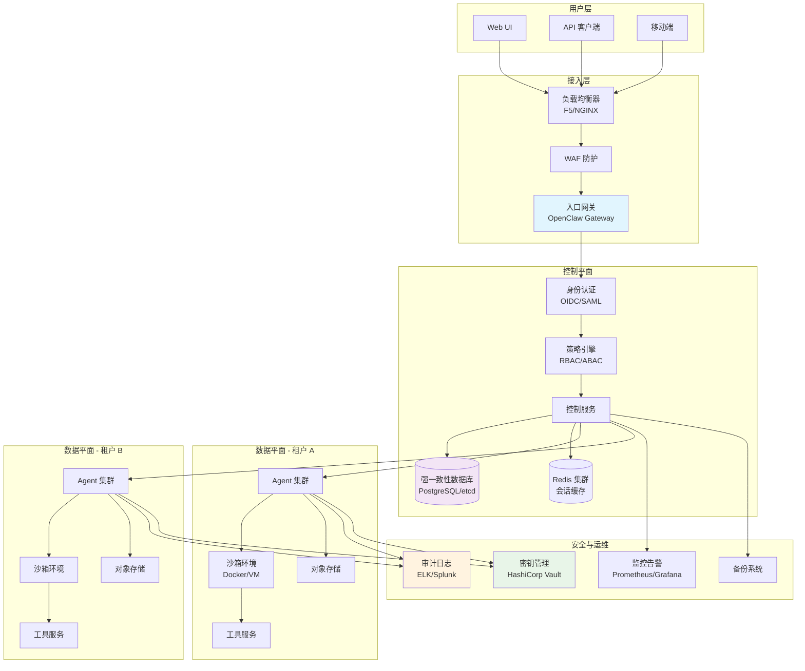
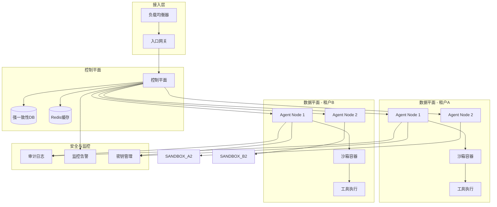
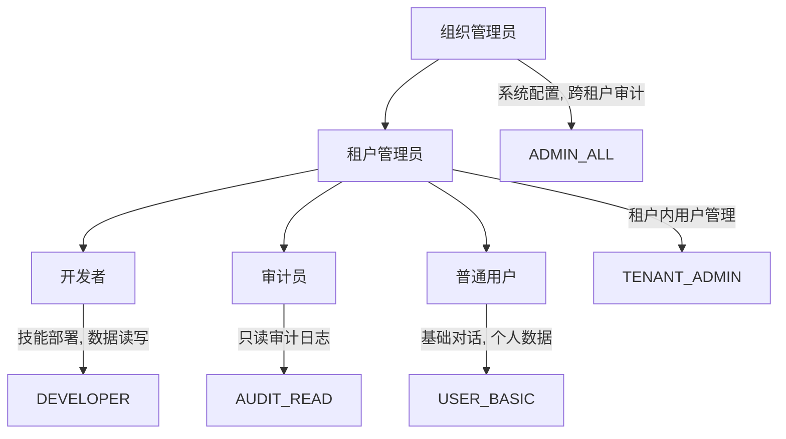
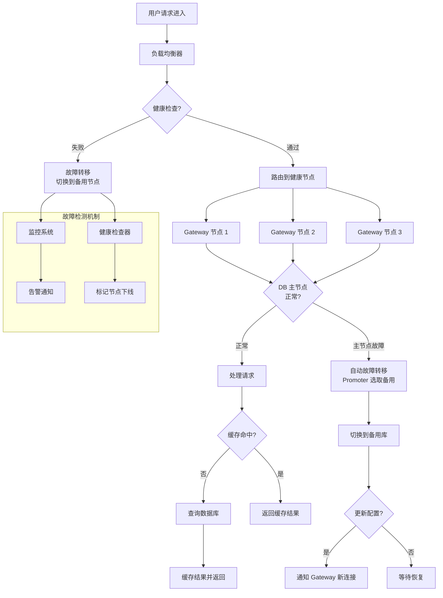
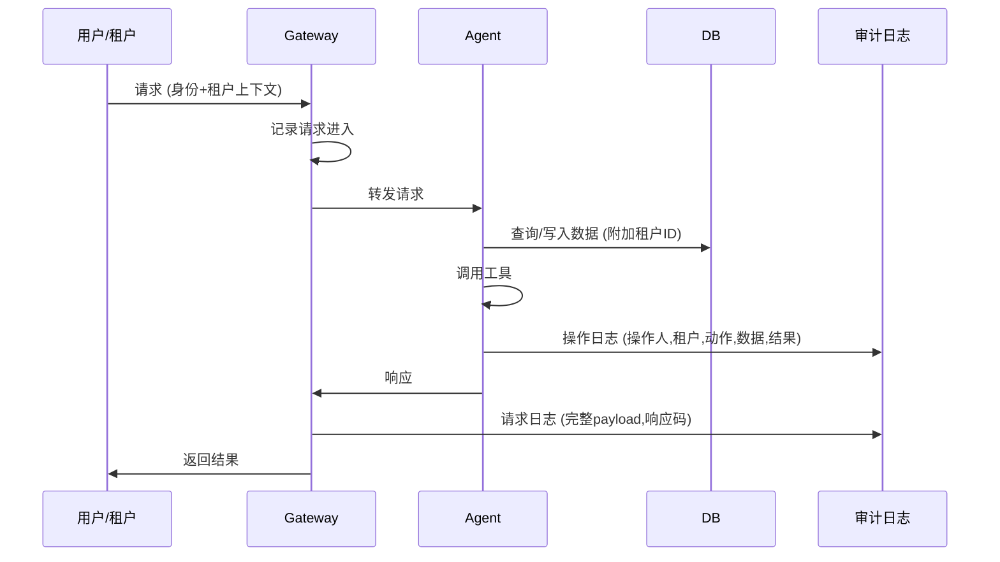

# OpenClaw 企业级部署模式

## Executive Summary

OpenClaw 作为开源 AI Agent 框架，在企业级部署中面临多租户隔离、高可用性、安全合规三大核心挑战。本报告系统分析 OpenClaw 在企业环境的部署模式，涵盖架构设计、租户隔离机制、容灾策略与合规要求，为企业技术决策提供参考。

企业级部署的核心发现：(1) OpenClaw 原生安全模型设计为"单可信操作员"边界，而非多租户隔离，多租户场景需额外构建 Agent Plane 和严格的 RBAC 体系[6]；(2) 高可用需要至少 3 节点集群配合强一致性数据存储，RTO 目标在 15 分钟内的容灾需要完善的备份与演练机制[1][4]；(3) SOC 2 和 GDPR 合规要求在不修改 OpenClaw 核心代码的前提下，必须在基础设施层、管理层、审计层三层补足控制点[2][7]。

---

## 1. 架构设计

### 1.1 企业级架构概览

OpenClaw 企业部署采用分层架构，将 Gateway（网关）、Agent（代理）、Tool（工具）、Sandbox（沙箱）分离职责，形成清晰的信任边界[5][12][13].

架构设计关键原则：

1. **控制平面与数据平面分离**：控制平面负责路由、认证、策略决策；数据平面承载实际 Agent 执行，可按租户水平扩展[1][5]。

2. **强一致性数据存储**：OpenClaw 依赖强一致性保证会话状态、权限配置、审计日志的跨节点一致。推荐使用 PostgreSQL（支持同步复制）或 etcd[1]。

3. **无状态 Agent 节点**：Agent 节点本身无状态，会话状态存储在 DB，便于弹性扩缩容[1]。

### 1.2 部署模式选择

企业部署模式主要有三种：

| 模式 | 适用场景 | 隔离级别 | 成本 |
|------|---------|---------|------|
| **单实例单租户** | 小团队, 内部使用 | 应用层隔离 | 低 |
| **多租户共享实例** | SaaS 服务, 业务部门 | 逻辑隔离 (RBAC) | 中 |
| **每租户独立实例** | 大型企业, 强合规 | 基础设施隔离 | 高 |

对于需要严格数据隔离的场景（如金融、医疗），推荐每租户独立 VPC/集群部署；对于内部工具型应用，多租户共享实例配合 RBAC 可满足需求[3][6]。

---

## 2. 租户隔离

### 2.1 多租户安全边界

OpenClaw 原生设计并不支持多租户作为对抗性边界。官方文档明确说明："Authenticated Gateway callers are treated as trusted operators for that gateway"，意味着一旦通过认证，用户在网关上拥有同等信任等级[4]。这导致多租户场景必须自行构建隔离机制。

核心隔离策略包括：

1. **身份隔离**：每个租户拥有独立的身份提供商（IdP），通过 OIDC/SAML 与 OpenClaw Gateway 集成。租户身份在请求链路中传递（`tenant_id` 请求头），所有数据访问层必须强制租户过滤[3]。

2. **Agent Plane 隔离**：GitHub 社区提案的 Agent Plane 实现每租户独立的 VM、服务账号、密钥和网络策略，本质上将 OpenClaw 转型为"OpenClaw for Teams"模式[6]。

3. **沙箱隔离**：启用 `agents.defaults.sandbox.mode = "enabled"`，工具执行在独立容器中运行[11]。沙箱配置 `scope` 控制容器创建粒度：
   - `"session"`：每个会话独立容器（强隔离）
   - `"agent"`：每个 Agent 共享容器（中隔离）
   - `"none"`：无隔离（仅开发）[2][11]

### 2.2 RBAC 与权限模型

企业级权限模型需扩展 OpenClaw 内置权限（`chat`、`read`、`write`、`query`、`admin`、`audit`），构建租户级角色：

权限继承与约束：
- **最小权限原则**：默认拒绝，显式授权。高风险操作（文件删除、网络调用、sudo）需额外审批流程[2]
- **租户边界强制**：数据库查询自动附加 `WHERE tenant_id = ?`，文件访问限制在租户专属目录[3]
- **权限审计**：所有权限变更记录审计日志，支持定期权限复核（Certification）[7]

### 2.3 会话隔离风险与防御

多用户并发场景下，会话隔离失败可导致权限提升攻击。研究显示，若 Router 使用"当前活动上下文"或共享可变状态作为身份代理，异步消息交错可能使用户请求在管理员会话上下文中评估[8]。

防御措施：
1. **稳定身份标识**：使用 `ingress_user_id`（来自网关层）作为身份标识，拒绝负载中的"声明用户ID"[8]
2. **会话绑定**：Agent 处理链路上保持会话身份不可变
3. **随机会话 ID**：每个会话生成唯一标识，避免可预测
4. **并发控制**：关键操作串行化或乐观锁

---

## 3. 容灾策略

### 3.1 高可用架构

OpenClaw 高可用需要三层冗余：

高可用配置要点[1]：

1. **节点数量**：至少 3 个 Gateway 节点，分布在不同可用区（AZ）
2. **会话粘性**：Gateway 层面不保持会话状态，Agent 会话状态在 DB，可任意路由
3. **数据库高可用**：PostgreSQL 同步复制 + 自动故障转移（Patroni/Stolon）
4. **Redis 高可用**：Redis Cluster 或哨兵模式
5. **就绪检查**：Gateway 健康检查端点 `/healthz`，负载均衡器配置就绪检查而非存活检查

### 3.2 备份与恢复

备份数据层包括：
- **配置数据**：`config.json`、Agent 定义、SOUL.md
- **会话数据**：数据库（消息历史、记忆）
- **审计日志**：结构化日志（JSON）写入集中存储（ELK/Splunk）
- **文件存储**：Agent 工作区、技能文件、上传附件

备份策略：
- **频繁备份**：配置和会话数据库每日增量 + 每周全量
- **异地存储**：备份加密后传输至不同区域对象存储（如 S3 跨区域复制）
- **保留策略**：每日备份保留 30 天，每周保留 12 周，每月保留 36 个月[4]

### 3.3 RPO/RTO 定义与演练

- **RPO（恢复点目标）**：数据丢失容忍度。多租户企业建议 RPO ≤ 15 分钟（增量备份频率）[4]
- **RTO（恢复时间目标）**：服务中断容忍度。建议 RTO ≤ 60 分钟（含故障检测、切换、验证）[4]

恢复演练必须每月执行：
1. 从备份恢复配置 + 数据库到隔离环境
2. 验证数据完整性（会话连续性、文件可访问）
3. 执行端到端测试（用户对话、工具调用）
4. 文档化故障切换步骤（Runbook），包括 DNS 切换、证书更新、监控告警恢复

---

## 4. 合规要求

### 4.1 审计日志完整性

合规部署必须确保每项操作可追溯：

审计日志要素（必须）：
- **身份标识**： ingress_user_id、租户 ID
- **时间戳**：精确到毫秒，UTC 时区
- **操作类型**：chat、tool_invoke、file_read、file_write、config_change
- **资源标识**：会话 ID、Agent 名称、文件路径、数据库表
- **结果状态**：success、failure、denied、timeout
- **请求/响应摘要**：脱敏后的数据（PII 必须过滤）[2][7]

日志存储与保护：
- 写入即只读（WORM 存储）
- 完整性校验（SHA-256 hash chain）
- 保留至少 7 年（金融/医疗要求）

### 4.2 GDPR 与数据隐私

GDPR 对 OpenClaw 部署的影响：

1. **数据 residency**：EU 居民数据处理必须在 EU 区域完成。措施：租户 EU 数据部署在 Frankfurt/Dublin 区域，禁用跨区域复制[2]。

2. **用户权利**：支持数据访问、删除、可携带权。实现：
   - `GET /api/v1/users/{id}/data` 导出个人数据
   - `DELETE /api/v1/sessions/{id}` 删除会话（含关联记忆）
   - 数据擦除需级联到所有副本（DB、缓存、备份）[2]

3. **数据最小化**：Agent 记忆配置 `memory.maxSize` 限制上下文窗口，避免无限制累积个人数据。

4. **DPO 访问**：审计日志和数据导出 API 需授权给数据保护官（DPO）角色独立访问，不受租户管理员控制[2]。

### 4.3 SOC 2 Type II 与 HIPAA

SOC 2 五大信任准则在 OpenClaw 部署中的落实：

| 准则 | 控制措施 |
|------|---------|
| **安全** | 网络隔离、WAF、DDoS 防护、漏洞扫描、强制 MFA |
| **可用性** | 多 AZ 部署、RTO ≤ 60 分钟、性能监控、容量规划 |
| **处理完整性** | 输入验证、输出过滤、原子操作、事务日志 |
| **保密性** | 静态加密（AES-256）、传输加密（TLS 1.3）、密钥生命周期管理 |
| **隐私** | GDPR 措施 + 隐私政策展示、数据处理协议（DPA）记录 |

HIPAA（医疗健康数据）额外要求：
- **BAAs（业务伙伴协议）**：AI 提供商（OpenAI/Anthropic）需签署 BAA，使用其 HIPAA eligible 端点（如 Azure OpenAI with BAA）[2]
- **PHI 隔离**：部署在独立 VNet，禁止流出医疗数据
- **自动检测**：前置脱敏层扫描 PII/PHI，发现意外流出立即阻断[5]

### 4.4 合规评估框架

使用 CLAW-10 十维评估矩阵量化 OpenClaw 企业就绪度[7]：

| 维度 | 权重 | 评分(1-5) | 说明 |
|------|------|-----------|------|
| 身份认证 (Identity) | 15% | 3 | OIDC 支持但无 MFA 强制 |
| 授权 (Authorization) | 15% | 2 | 原生 RBAC 弱，需自建 |
| 沙箱执行 (Sandboxing) | 15% | 4 | Docker 沙箱成熟 |
| 审计日志 (Audit) | 12% | 3 | 日志完整但需集中管理 |
| 数据加密 (Encryption) | 10% | 3 | TLS 完整，静态加密需配置 |
| 密钥管理 (Secrets) | 10% | 2 | Vault 集成需自建 |
| 网络隔离 (Networking) | 8% | 3 | 防火墙/VPC 可配置 |
| 漏洞管理 (Vuln Mgmt) | 7% | 2 | 无内置扫描 |
| 合规报告 (Reporting) | 6% | 1 | 无标准报告模板 |
| 供应商管理 (Vendor) | 2% | 3 | AI 提供商需自行评估 |

企业部署前必须补齐薄弱项（评分<4），否则无法通过审计。

---

## 7. 结论

OpenClaw 企业级部署需要系统化工程，而非简单"docker-compose up"。核心结论如下：

1. **架构设计**：控制平面与数据平面分离是扩展性的基础，3+ 节点集群配合强一致性存储实现高可用[1]。

2. **租户隔离**：OpenClaw 原生不适合多租户，必须构建 Agent Plane 或每租户独立实例，结合 RBAC 和沙箱实现逻辑隔离[3][6]。

3. **容灾策略**：RPO≤15 分钟 + RTO≤60 分钟需要完整的备份策略和月度演练，备份涵盖配置、数据库、审计日志三个层次[4]。

4. **合规要求**：SOC 2 和 GDPR 需要在基础设施层、管理层、审计层三层补足控制，特别是审计日志完整性、数据 residency、用户权利实现[2][7]。

5. **风险提示**：OpenClaw 社区版在企业安全维度存在差距（CLAW-10 平均评分 <3），生产部署前必须进行威胁建模和安全加固[7][8]。

建议企业采用渐进式路线：
- **阶段 1**：单租户试点，验证核心业务价值
- **阶段 2**：引入 RBAC 和审计日志，满足基础合规
- **阶段 3**：多租户架构改造，实施 Agent Plane
- **阶段 4**：高可用容灾建设，通过 SOC 2/GDPR 认证

---

<!-- REFERENCE START -->
## 参考文献

1. OpenClawn.com. Achieving High Availability with OpenClaw Self-Host Clusters (2026). https://openclawn.com/achieving-high-availability-openclaw-clusters/
2. KiwiClaw. SOC 2 and GDPR Compliance for OpenClaw Deployments. https://kiwiclaw.app/blog/openclaw-soc2-gdpr-compliance/
3. EastonDev. OpenClaw Enterprise Deployment in Practice: Complete Guide to Multi-User Management, Permission Isolation, and Security Hardening (2026). https://eastondev.com/blog/en/posts/ai/20260205-openclaw-enterprise-deploy/
4. Tencent Cloud Techpedia. OpenClaw Server Disaster Recovery and Recovery Strategies. https://www.tencentcloud.com/techpedia/140854
5. Microsoft Security. Running OpenClaw safely: identity, isolation, and runtime risk (2026). https://www.microsoft.com/en-us/security/blog/2026/02/19/running-openclaw-safely-identity-isolation-runtime-risk/
6. GitHub OpenClaw. feat: Agents Plane — multi-tenant agent provisioning and isolation (#17299). https://github.com/openclaw/openclaw/issues/17299
7. Onyx AI. OpenClaw Enterprise Evaluation Framework | CLAW-10. https://onyx.app/insights/openclaw-enterprise-evaluation-framework
8. Snyk Labs. On Ways to Bypass OpenClaw's Security Sandbox. https://labs.snyk.io/resources/bypass-openclaw-security-sandbox/
9. Penligent.ai. OpenClaw Multi-User Session Isolation Failure Authorization Bypass and Privilege Escalation. https://www.penligent.ai/hackinglabs/hi/openclaw-multi-user-session-isolation-failure-authorization-bypass-and-privilege-escalation/
10. OpenClaw Docs. Sandboxing. https://docs.openclaw.ai/gateway/sandboxing
11. Alibaba Cloud. OpenClaw Managed Solution by Alibaba Cloud. https://www.alibabacloud.com/blog/openclaw-managed-solution-by-alibaba-cloud_602961
12. Valletta Software. OpenClaw Architecture & Setup Guide (2026). https://vallettasoftware.com/blog/post/openclaw-2026-guide
13. Tencent Cloud Techpedia. OpenClaw Server Environment Isolation and Multi-Tenant Deployment. https://www.tencentcloud.com/techpedia/139885
14. Ken Huang. OpenClaw Design Patterns (Part 5 of 7): Reliability & Security Patterns. https://kenhuangus.substack.com/p/openclaw-design-patterns-part-5-of