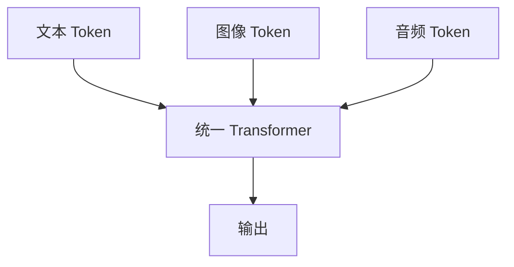
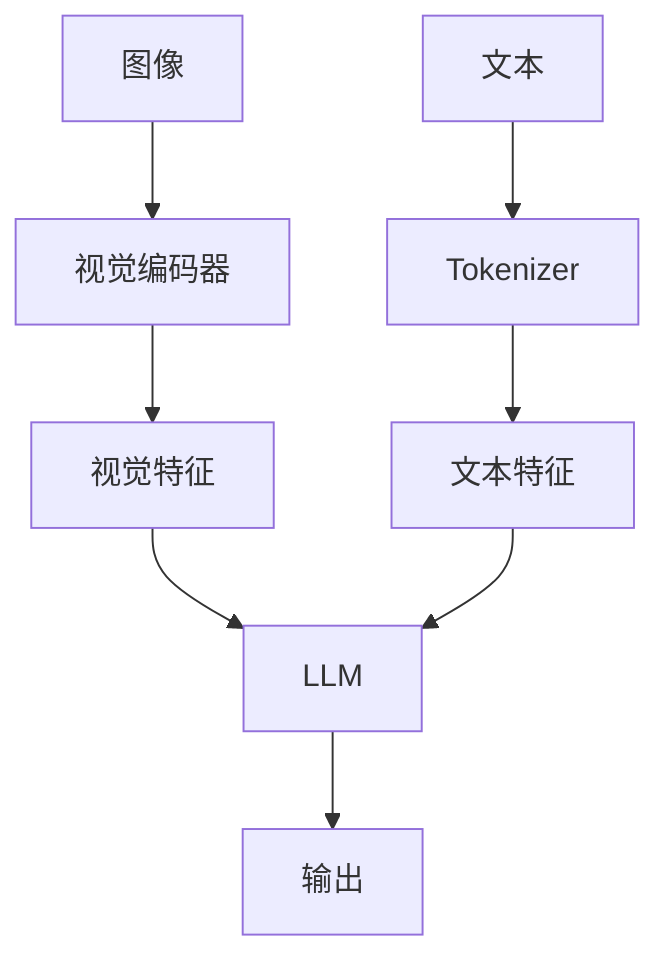
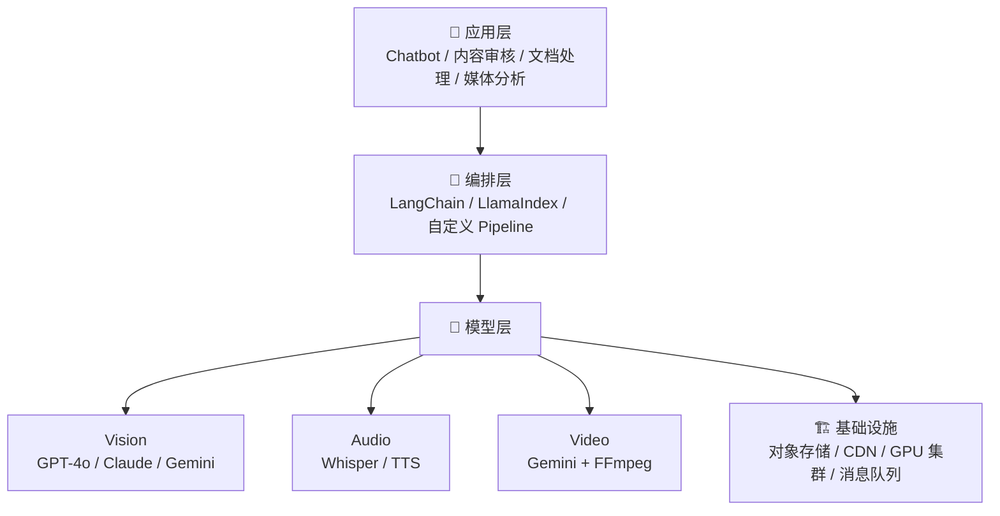

# 多模态 AI 框架分析

> 发布日期：2026-03-14 | 分类：框架 | 作者：探针

---

## Executive Summary

多模态 AI 正在从实验室走向生产，视觉、音频、视频等模态的理解和生成能力成为 AI 系统的核心竞争力。本报告系统分析主流多模态模型和应用框架，涵盖视觉理解、音频处理、视频理解、多模态融合策略和框架选型建议。

**核心结论：**
- 视觉理解已形成 GPT-4V、Claude Vision、Gemini 三强格局，各有侧重
- Whisper 系列统治语音转文字，Gemini Audio 提供端到端音频理解
- 视频理解仍在快速发展中，Gemini 和 GPT-4V 领先但仍有明显局限
- 多模态融合策略的选择决定了应用的灵活性和性能天花板

---

## 1. 视觉理解

### 1.1 主流视觉模型对比

| 模型 | 上下文窗口 | 最大图像 | OCR | 图表理解 | 多图对比 | 价格 |
|------|-----------|---------|-----|----------|----------|------|
| GPT-4o | 128K | 2048×2048 | 优秀 | 优秀 | 支持 | $2.50/1M input |
| Claude Sonnet 4 | 200K | 1568×1568 | 优秀 | 良好 | 支持 | $3.00/1M input |
| Gemini 2.0 Flash | 1M | 3072×3072 | 优秀 | 优秀 | 支持 | $0.10/1M input |
| LLaVA-NeXT (开源) | 4K-32K | 可变 | 一般 | 一般 | 支持 | 自部署成本 |

### 1.2 GPT-4V / GPT-4o

OpenAI 的视觉能力通过图片输入实现：

```python
import openai

response = openai.chat.completions.create(
    model="gpt-4o",
    messages=[{
        "role": "user",
        "content": [
            {
                "type": "text",
                "text": "描述这张图片中的场景，并识别所有文字"
            },
            {
                "type": "image_url",
                "image_url": {
                    "url": "https://example.com/image.jpg",
                    "detail": "high"  # "low" | "high" | "auto"
                }
            }
        ]
    }]
)
```

**能力特点：**
- **OCR 能力强**：印刷体和手写体识别效果好
- **图表理解**：能准确解读数据图表、流程图、架构图
- **空间推理**：理解物体位置和关系
- **多图分析**：支持同时上传多张图片进行对比

**局限性：**
- 细粒度视觉任务（像素级）能力有限
- 对遮挡、模糊图像的处理不够鲁棒
- 无法生成或编辑图像（需 DALL-E）

### 1.3 Claude Vision

Anthropic 的视觉能力集成在 Messages API 中：

```python
import anthropic

client = anthropic.Anthropic()

with open("image.png", "rb") as f:
    image_data = base64.b64encode(f.read()).decode()

message = client.messages.create(
    model="claude-sonnet-4-20250514",
    max_tokens=1024,
    messages=[{
        "role": "user",
        "content": [
            {
                "type": "image",
                "source": {
                    "type": "base64",
                    "media_type": "image/png",
                    "data": image_data
                }
            },
            {
                "type": "text",
                "text": "分析这张架构图的设计模式"
            }
        ]
    }]
)
```

**能力特点：**
- **文档理解**：长文档和复杂表格的解析能力突出
- **代码图表**：对 UML、ER 图、架构图的理解精准
- **安全识别**：内容审核和敏感信息检测
- **200K 上下文**：可在超长上下文中嵌入多张图片

**局限性：**
- 不支持图片生成
- 对艺术风格和审美的理解相对较弱
- 手写体 OCR 不如 GPT-4o

### 1.4 Gemini Vision

Google 的 Gemini 系列在多模态方面投入最大：

```python
import google.generativeai as genai

genai.configure(api_key="...")
model = genai.GenerativeModel('gemini-2.0-flash')

response = model.generate_content([
    "识别图中所有表格并提取数据为 JSON 格式",
    genai.upload_file("document.png")
])
```

**能力特点：**
- **原生多模态**：从预训练阶段就融合文本和视觉
- **超大上下文**：1M tokens，可处理大量图片
- **视频原生支持**：可直接分析视频帧序列
- **成本优势**：Gemini Flash 系列价格远低于竞品

**局限性：**
- API 稳定性不如 OpenAI
- 部分地区可用性受限
- 社区生态相对较小

### 1.5 开源视觉模型

| 模型 | 参数量 | 特点 |
|------|--------|------|
| LLaVA-NeXT | 7B-110B | 最流行的开源 VLM |
| Qwen2-VL | 2B-72B | 中文视觉理解强 |
| InternVL2 | 1B-76B | 多语言，文档理解 |
| CogVLM2 | 8B-18B | 高分辨率，开源友好 |

```python
# vLLM 部署开源 VLM
from vllm import LLM, SamplingParams

llm = LLM(
    model="llava-hf/llava-v1.6-mistral-7b-hf",
    max_model_len=8192
)
```

---

## 2. 音频处理

### 2.1 语音转文字（ASR）

**Whisper 系列**是当前最主流的 ASR 方案：

| 模型 | 参数量 | 语言 | 速度 | WER (英文) |
|------|--------|------|------|-----------|
| Whisper Large-v3 | 1.5B | 99 | 1x | ~2.5% |
| Whisper Turbo | 800M | 99 | 3x | ~3.0% |
| Distil-Whisper | 756M | 英文 | 6x | ~3.8% |
| Gemini Audio | N/A | 100+ | 实时 | N/A |

```python
# OpenAI Whisper API
with open("audio.mp3", "rb") as audio_file:
    transcript = openai.audio.transcriptions.create(
        model="whisper-1",
        file=audio_file,
        language="zh",
        response_format="verbose_json",
        timestamp_granularities=["segment"]
    )
```

```python
# 本地部署 Whisper
from transformers import pipeline

pipe = pipeline("automatic-speech-recognition", 
    model="openai/whisper-large-v3",
    device="cuda")
result = pipe("audio.mp3", return_timestamps=True)
```

### 2.2 语音生成（TTS）

| 模型 | 特点 | 价格 |
|------|------|------|
| OpenAI TTS / TTS-HD | 多声音，高质量 | $15-30/1M chars |
| ElevenLabs | 最自然的声音克隆 | $0.30/1K chars |
| Azure TTS (SSML) | 企业级，SSML 控制 | $16/1M chars |
| Coqui XTTS | 开源，声音克隆 | 自部署 |

### 2.3 Gemini Audio（端到端）

Gemini 是少数支持端到端音频理解的模型：

```python
model = genai.GenerativeModel('gemini-2.0-flash')

# 直接分析音频文件
response = model.generate_content([
    "转录这段会议录音并提取行动项",
    genai.upload_file("meeting.mp3")
])
```

**能力：**
- 音频转录 + 语义理解一步完成
- 支持多语言音频
- 可分析语气、情绪等副语言信息
- 可同时处理音频和视觉输入

---

## 3. 视频理解与生成

### 3.1 视频理解

| 模型 | 视频长度 | 帧率 | 特点 | 状态 |
|------|----------|------|------|------|
| Gemini 2.0 | 1+ 小时 | 可变 | 原生视频理解，音频同步 | GA (2025) |
| GPT-4o | ~20 分钟 | 提取帧 | 图片序列处理，时间戳支持 | GA (2025) |
| Claude 3.5 Sonnet | 提取帧 | 手动 | 需要预处理，长上下文优势 | GA (2025) |
| Video-LLaVA (开源) | 分钟级 | 固定 | 开源方案，社区活跃 | 开源 |

```python
# Gemini 视频分析
response = model.generate_content([
    "总结这段视频的主要内容，标注关键时间点",
    genai.upload_file("video.mp4")
])
```

**当前局限：**
- 长视频（>1小时）理解仍然困难
- 细粒度时间定位精度有限
- 音频-视觉融合理解不够深入
- 实时视频流处理尚不成熟

### 3.2 视频生成

| 模型 | 分辨率 | 时长 | 特点 | 更新时间 |
|------|--------|------|------|---------|
| Sora (OpenAI) | 1080p | 20s | 高质量，物理合理，支持文字生成 | 2025-02 |
| Veo 2 (Google) | 4K | 60s+ | 高质量，长时长，音视频同步 | 2025-03 |
| Runway Gen-3 Alpha | 1080p | 10s | 专业视频工具，风格控制强 | 2025-01 |
| Kling 1.6 (快手) | 1080p | 10s | 中文提示词友好，物理模拟好 | 2025-02 |
| Pika 2.0 | 1080p | 10s | 简单易用，特效丰富 | 2025-03 |
| Dream Machine (Luma) | 1080p | 5s | 速度快，适合原型设计 | 2025-01 |

> ⚠️ 视频生成领域变化极快，以上信息基于 2025 年 3 月数据，建议查阅各平台最新状态。

### 3.3 视频处理框架

```python
# FFmpeg 预处理 → LLM 分析流程
import subprocess

def extract_frames(video_path, fps=1):
    """从视频中提取帧"""
    subprocess.run([
        "ffmpeg", "-i", video_path,
        "-vf", f"fps={fps}",
        "-q:v", "2",
        "frames/frame_%04d.jpg"
    ])

def transcribe_audio(video_path):
    """提取并转录音频"""
    subprocess.run([
        "ffmpeg", "-i", video_path, 
        "-vn", "-acodec", "mp3", "audio.mp3"
    ])
    # 使用 Whisper 转录
    return whisper.transcribe("audio.mp3")
```

---

## 4. 多模态融合策略

### 4.1 融合策略分类

| 策略 | 说明 | 优势 | 劣势 |
|------|------|------|------|
| **早期融合** | 在模型输入端融合 | 原生多模态理解 | 需要特定模型 |
| **晚期融合** | 各模态独立处理后融合 | 灵活，可组合 | 模态间交互弱 |
| **交叉注意力** | 通过注意力机制交互 | 平衡性能和灵活性 | 实现复杂 |
| **特征拼接** | 简单拼接特征向量 | 简单直接 | 表达能力有限 |

### 4.2 早期融合（以 Gemini 为例）



- 模型从预训练阶段就处理多种模态
- 模态间交互最充分
- 代表：Gemini、GPT-4o

### 4.3 晚期融合（Pipeline 方案）



- 各模态可独立更换模型
- 适合开源模型组合
- 代表：LLaVA、MiniGPT-4

### 4.4 RAG + 多模态

多模态 RAG 是当前最实用的融合策略：

```python
# 多模态 RAG 流程
def multimodal_rag(query, image=None):
    # 1. 文本检索
    text_results = vector_store.search(query)
    
    # 2. 图像理解（如有）
    if image:
        image_desc = vision_model.describe(image)
        text_results += vector_store.search(image_desc)
    
    # 3. 多模态上下文构建
    context = format_context(text_results, image)
    
    # 4. 生成回答
    return llm.generate(query, context=context, image=image)
```

---

## 5. 应用框架选型

### 5.1 选型决策矩阵

| 场景 | 推荐方案 | 理由 |
|------|----------|------|
| 通用图文理解 | GPT-4o | 最成熟的多模态 API |
| 成本敏感的视觉任务 | Gemini Flash | 价格优势巨大 |
| 长文档+图片混合 | Claude Sonnet | 200K 上下文 |
| 语音转录 | Whisper Large-v3 | 最高精度 |
| 实时音视频 | Gemini 2.0 | 原生多模态 |
| 隐私敏感/本地部署 | LLaVA + Whisper | 数据不出域 |
| 视频内容分析 | Gemini + FFmpeg | 先抽帧再分析 |

### 5.2 技术架构建议



### 5.3 实践建议

1. **从单模态开始**：先验证单模态效果，再逐步增加模态
2. **预处理是关键**：图片压缩、视频抽帧、音频降噪等预处理直接影响效果
3. **Prompt 工程**：多模态场景的 Prompt 设计需要反复迭代
4. **成本控制**：视觉和视频处理的 token 消耗可能很大，需要设置上限
5. **降级策略**：主力模型失败时自动降级到备选方案
6. **缓存策略**：对相同图片/音频的分析结果进行缓存

---

## 参考来源

1. OpenAI 视觉 API 文档 — [platform.openai.com/docs/guides/vision](https://platform.openai.com/docs/guides/vision)
2. Anthropic 视觉文档 — [docs.anthropic.com/docs/vision](https://docs.anthropic.com/docs/vision)
3. Google Gemini 文档 — [ai.google.dev/gemini-api](https://ai.google.dev/gemini-api)
4. Whisper 论文 — Radford et al., "Robust Speech Recognition via Large-Scale Weak Supervision", ICML 2023
5. LLaVA 论文 — Liu et al., "Visual Instruction Tuning", NeurIPS 2023

---

*本报告基于 2025 年初至 2026 年 3 月的多模态 AI 生态撰写，该领域发展极快，视频生成和理解能力尤为如此，请持续关注最新进展。*
