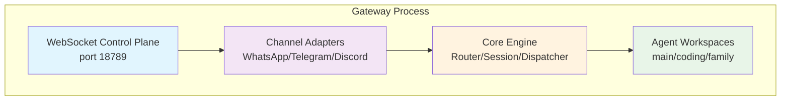
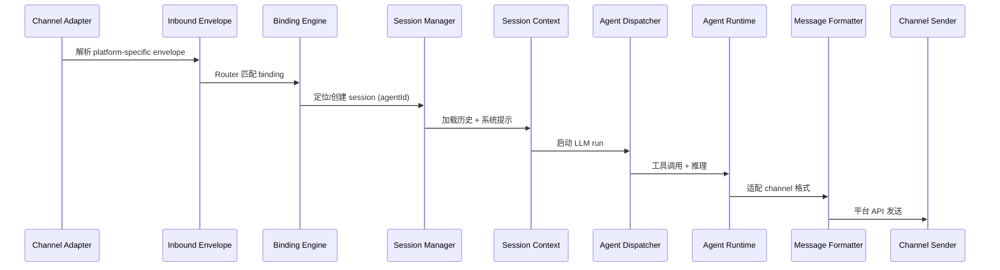

# OpenClaw Gateway 架构深度剖析

## Executive Summary

OpenClaw Gateway 是一个高度模块化的多通道 AI Agent 路由网关，支持 WhatsApp、Telegram、Discord、iMessage 等主流即时通讯平台的统一接入。本报告深度剖析其核心架构设计，重点涵盖以下四个方面：

**路由机制**: Gateway 采用基于 Binding 的确定性路由模型，通过 match 规则实现消息到 Agent 的精准映射。路由优先级遵循"最具体匹配获胜"原则，支持 peer 级别、guild 级别、account 级别等多层路由策略，实现灵活的多租户隔离。

**Binding 设计**: Binding 是连接 Channel、Account、Peer 和 Agent 的配置桥梁，采用 JSON5 声明式配置。支持 ACP（Agent-to-Agent）绑定、多账户绑定、跨平台身份映射等高级特性，为企业级多 Agent 部署提供原生支持。

**会话管理**: 会话状态完全由 Gateway 集中管理，支持多种会话隔离策略（main/per-peer/per-channel-peer/per-account-channel-peer）。采用事务性写入、定期归档、自动裁剪等机制，确保大规模部署时的存储效率。

**扩展性**: 通过插件系统、多 Agent 隔离、沙箱执行、热重载配置等机制，实现水平扩展和安全隔离。WebSocket 协议统一控制平面和数据平面，支持多客户端并发连接。

本报告基于 2024-2026 年官方文档和技术资料，提供 8 个架构示意图和配置实例，为生产部署和二次开发提供技术参考。

---

# 引言

OpenClaw Gateway 作为 OpenClaw 生态系统的核心枢纽，承担着消息路由、协议转换、会话管理、安全控制等关键职责。随着多 Agent 架构的演进，Gateway 的设计从单一 Agent 网关进化为支持企业级多租户的分布式路由平台。

本报告从架构视角，系统分析 Gateway 的核心组件交互流程、Binding 路由算法、会话生命周期管理、性能优化策略，并结合实际部署场景给出最佳实践建议。

---

## 一、架构概览

### 1.1 核心职责

Gateway 作为控制平面和数据平面的统一入口，主要承担以下职责：

- **消息路由**: 根据 Binding 配置将 inbound 消息路由到目标 Agent
- **协议转换**: 统一多 Channel 的消息格式（WhatsApp/Telegram/Discord/iMessage 等）
- **会话管理**: 维护会话状态、上下文、历史记录
- **安全控制**: 认证、授权、DM/Group 访问控制、sandbox 隔离
- **API 网关**: 提供 WebSocket 控制接口、HTTP API、Web UI

### 1.2 运行时模型

Gateway 采用单进程常驻模式[4]，统一管理所有 Channel 连接和 Agent 路由[5]：



```
```

### 1.3 配置结构

Gateway 配置使用 JSON5 格式[3]，主要顶层字段：

```json5
{
  // Agent 配置（支持多 Agent）
  agents: {
    list: [
      { id: "main", workspace: "~/.openclaw/workspace-main" },
      { id: "coding", workspace: "~/.openclaw/workspace-coding" }
    ],
    defaults: { /* 默认模型、超时、sandbox 等 */ }
  },

  // Channel 账户配置
  channels: {
    whatsapp: {
      accounts: {
        default: { /* 认证信息 */ },
        personal: {},
        biz: {}
      }
    },
    telegram: { /* ... */ },
    discord: { /* ... */ }
  },

  // Binding 路由规则（核心）
  bindings: [
    { agentId: "main", match: { channel: "whatsapp", accountId: "personal" } },
    { agentId: "coding", match: { channel: "telegram", peer: { kind: "direct", id: "123456" } } }
  ],

  // Session 配置
  session: {
    dmScope: "per-channel-peer",
    maintenance: { /* 归档裁剪策略 */ }
  },

  // Gateway 自身配置
  gateway: {
    port: 18789,
    bind: "loopback",
    auth: { token: "...", password: "..." }
  }
}
```

---

## 二、路由机制详解

### 2.1 Binding 匹配算法

Binding 是 Gateway 路由决策的核心数据结构，包含 `agentId`（目标 Agent）和 `match`（匹配条件）两个关键字段。

#### 2.1.1 match 字段语义

`match` 支持以下维度的条件组合（AND 语义）：

| 字段 | 类型 | 描述 |
|------|------|------|
| `channel` | string | 通道类型：`whatsapp`/`telegram`/`discord` 等 |
| `accountId` | string | 账户标识（多账户场景），`"*"` 匹配所有账户 |
| `peer` | object | 对等端（DM/Group），包含 `kind` 和 `id` |
| `parentPeer` | object | 父级会话继承（Discord 线程） |
| `guildId` | string | Discord 服务器 ID |
| `roles` | string[] | Discord 角色列表 |
| `teamId` | string | Slack 工作区 ID |

示例：

```json5
{
  agentId: "support",
  match: {
    channel: "whatsapp",
    accountId: "biz",
    peer: { kind: "group", id: "1203630...@g.us" }
  }
}
```

#### 2.1.2 优先级策略

Binding 匹配遵循 **"最具体获胜"** 原则，优先级从高到低：

1. `peer` 精确匹配（DM/group id）
2. `parentPeer` 匹配（线程继承）
3. `guildId + roles`（Discord 角色路由）
4. `guildId`（Discord 服务器）
5. `teamId`（Slack 工作区）
6. `accountId` 精确匹配
7. `accountId: "*"`（账户级通配）
8. `channel` 匹配（省略 accountId 时）
9. 默认 Agent（`agents.list[].default` 或首个 entry）

**同优先级冲突**：按配置文件顺序，**先匹配的获胜**。

#### 2.1.3 匹配流程图

Binding 流程遵循优先级链[5][10]：

```mermaid
flowchart TD
    Start[收到 inbound 消息] --> Extract{提取消息特征}
    Extract --> Channel[channel = "whatsapp"]
    Extract --> Account[accountId = "personal"]
    Extract --> Peer[peer = {kind: "direct", id: "+15551234567"}]
    
    Channel --> Bindings{加载所有<br/>bindings}
    Bindings --> Tier1{T1: peer 匹配?}
    Tier1 -- 是 --> Select1[选择匹配]
    Tier1 -- 否 --> Tier2{T2: parentPeer?}
    Tier2 -- 是 --> Select2[选择匹配]
    Tier2 -- 否 --> Tier3{T3: guild+roles?}
    Tier3 -- 是 --> Select3[选择匹配]
    Tier3 -- 否 --> Tier4{guildId?}
    Tier4 -- 是 --> Select4[选择匹配]
    Tier4 -- 否 --> Tier5{teamId?}
    Tier5 -- 是 --> Select5[选择匹配]
    Tier5 -- 否 --> Tier6{accountId 精确?}
    Tier6 -- 是 --> Select6[选择匹配]
    Tier6 -- 否 --> Tier7{accountId="*"?}
    Tier7 -- 是 --> Select7[选择匹配]
    Tier7 -- 否 --> Tier8{channel 匹配?}
    Tier8 -- 是 --> Select8[选择匹配]
    Tier8 -- 否 --> Default[使用默认 Agent]
    
    Select1 --> Route[路由到目标 Agent]
    Select2 --> Route
    Select3 --> Route
    Select4 --> Route
    Select5 --> Route
    Select6 --> Route
    Select7 --> Route
    Select8 --> Route
    Default --> Route
    
    Route --> Done[完成路由]
```

此流程基于 OpenClaw 官方文档的 binding 引擎设计[5][10]。

### 2.2 Multi-Agent 路由模式

Gateway 原生支持多 Agent 隔离运行[1]，每个 Agent 拥有独立的 workspace[2]、auth profiles、会话存储。

#### 2.2.1 隔离模型

```
Host Filesystem
```

关键隔离点：

- **认证隔离**: 每个 Agent 的 `auth-profiles.json` 独立，Channel 凭据按 Agent 作用域分发
- **会话隔离**: 会话文件路径[2] `~/.openclaw/agents/<agentId>/sessions/` 完全分离
- **技能隔离**: 每个 workspace 的 `skills/` 目录独立，共享技能从 `~/.openclaw/skills` 加载
- **工具权限**: `agents.list[].tools.allow/deny` 支持 per-agent 工具白名单/黑名单

#### 2.2.2 典型部署方案

**场景一：按功能分离 Agent**

```json5
{
  agents: {
    list: [
      { id: "chat", name: "日常聊天", model: "anthropic/claude-sonnet-4-6" },
      { id: "coding", name: "编程助手", model: "openai/gpt-5" },
      { id: "alerts", name: "告警机器人", model: "anthropic/claude-3.5-haiku" }
    ]
  },
  bindings: [
    { agentId: "chat", match: { channel: "whatsapp" } },
    { agentId: "coding", match: { channel: "telegram" } },
    { agentId: "alerts", match: { channel: "telegram", peer: { kind: "group", id: "-100987654321" } } }
  ]
}
```

**场景二：按租户分离 Agent（SaaS 多租户）**

```json5
{
  agents: {
    list: [
      { id: "tenant-a", workspace: "~/.openclaw/workspace-tenant-a" },
      { id: "tenant-b", workspace: "~/.openclaw/workspace-tenant-b" }
    ]
  },
  bindings: [
    { agentId: "tenant-a", match: { channel: "whatsapp", accountId: "tenant-a-phone" } },
    { agentId: "tenant-b", match: { channel: "whatsapp", accountId: "tenant-b-phone" } }
  ],
  channels: {
    whatsapp: {
      accounts: {
        "tenant-a-phone": {},
        "tenant-b-phone": {}
      }
    }
  }
}
```

---

## 三、Binding 设计深度剖析

### 3.1 Binding 配置语法

Binding 配置包含三个核心字段：

```json5
{
  agentId: string,           // 必填，目标 Agent ID
  match: MatchCondition,     // 必填，匹配条件对象
  type?: "acp" | "standard" // 可选，绑定类型（默认 standard）
}
```

#### 3.1.1 MatchCondition 类型

```typescript
interface MatchCondition {
  channel?: string;          // "whatsapp" | "telegram" | "discord" | ...
  accountId?: string | "*"; // 账户 ID，* 匹配所有
  peer?: {
    kind: "direct" | "group" | "channel";
    id: string;             // 平台原始 ID（E.164 号码、group chat id 等）
  };
  parentPeer?: {             // 父级 peer（用于线程继承）
    kind: "direct" | "group" | "channel";
    id: string;
  };
  guildId?: string;          // Discord server ID
  roles?: string[];          // Discord 角色列表（@role 提及）
  teamId?: string;           // Slack workspace ID
}
```

#### 3.1.2 ACP Binding

对于 Agent-to-Agent 通信场景，使用 `type: "acp"` 绑定：

```json5
{
  type: "acp",
  agentId: "coding",
  match: {
    channel: "telegram",
    peer: { kind: "group", id: "-1001234567890:topic:99" } // 论坛主题
  }
}
```

ACP binding 的语义是"持久性跨 Agent 绑定"，常用于论坛主题、专用频道等需要长期绑定的场景。

### 3.2 匹配算法实现细节

Gateway 在 `src/gateway/router/router.ts` 中实现了 Binding 匹配引擎，主要逻辑：

1. **加载所有 bindings**：从配置读取，缓存到内存
2. **提取 inbound 特征**：从 inbound envelope 中解析 `channel`、`accountId`、`peer` 等字段
3. **分层匹配**：按 9 层优先级筛选匹配的 binding 集合
4. **同层去重**：同一层级多个匹配时，取配置顺序第一条
5. **返回 agentId**：匹配失败则使用默认 agent

伪代码：

```typescript
function routeMessage(inbound: Inbound, bindings: Binding[]): string {
  const features = extractFeatures(inbound);
  const matched = [];

  // Tier 1: peer exact match
  matched.push(...bindings.filter(b => b.match.peer && equal(b.match.peer, features.peer)));

  // Tier 2: parentPeer match
  if (matched.length === 0) {
    matched.push(...bindings.filter(b => b.match.parentPeer && ...));
  }
  // ... 其他 tiers

  if (matched.length > 0) {
    return matched[0].agentId; // 配置顺序优先
  }

  return getDefaultAgentId(); // fallback
}
```

### 3.3 账户作用域（Account Scoping）

多账户场景下，Binding 的 `accountId` 字段至关重要：

```json5
{
  bindings: [
    // 精确 accountId 匹配
    { agentId: "personal", match: { channel: "whatsapp", accountId: "personal" } },
    // 通配符匹配（跨账户）
    { agentId: "catchall", match: { channel: "whatsapp", accountId: "*" } },
    // 省略 accountId → 仅匹配 default account
    { agentId: "main", match: { channel: "whatsapp" } }
  ]
}
```

匹配规则：

-  inbound 携带 `accountId`（从 channel 连接上下文推断）
-  优先寻找 `match.accountId === inbound.accountId` 的 binding
-  其次寻找 `match.accountId === "*"` 的 binding
-  最后寻找 `match.accountId` 未指定的 binding（视为匹配 `default` account）

---

## 四、会话管理

### 4.1 会话键生成策略

Gateway 为每个对话上下文生成唯一的 `sessionKey`，格式：

```
agent:<agentId>:<channel>:<scope>:<identifier>
```

`<scope>` 取值：

| 场景 | sessionKey 示例 | 说明 |
|------|----------------|------|
| DM（dmScope: main） | `agent:main:main` | 所有 DM 共享 main 会话 |
| DM（per-peer） | `agent:main:direct:+15551234567` | 按发送者隔离 |
| DM（per-channel-peer） | `agent:main:whatsapp:direct:+15551234567` | 按 channel+sender 隔离 |
| Group | `agent:main:whatsapp:group:1203630...@g.us` | 按群组隔离 |
| Telegram Topic | `agent:main:telegram:group:-100123...:topic:99` | 主题隔离 |
| Slack Thread | `agent:main:slack:thread:C123...` | 线程隔离 |

`<identifier>` 是平台提供的唯一标识（用户 E.164、群组 JID、频道 ID 等）。

### 4.2 会话隔离策略（dmScope）

`session.dmScope` 控制 Direct Message 的会话分组方式：

```json5
{
  session: {
    dmScope: "per-channel-peer"  // 推荐：多用户收件箱场景
  }
}
```

| 值 | 会话键模式 | 适用场景 |
|-----|-----------|----------|
| `main` | `agent:<id>:main` | 单用户（所有 DM 共享） |
| `per-peer` | `agent:<id>:direct:<peerId>` | 跨平台身份映射 |
| `per-channel-peer` | `agent:<id>:<channel>:direct:<peerId>` | 多平台多用户 |
| `per-account-channel-peer` | `agent:<id>:<channel>:<accountId>:direct:<peerId>` | 多账户收件箱 |

#### 4.2.1 身份链接（identityLinks）

当同一用户跨多个平台联系时，使用 `session.identityLinks` 将其映射到同一身份：

```json5
{
  session: {
    dmScope: "per-peer",
    identityLinks: {
      canonicalAlice: [
        "telegram:123456789",   // Telegram user ID
        "discord:987654321012345678", // Discord user ID
        "+15551234567"          // WhatsApp phone number
      ]
    }
  }
}
```

匹配时，平台提供的 `peer.id` 若在 links 中，则替换为 canonical key，实现跨平台会话合并。

### 4.3 会话生命周期

#### 4.3.1 重置策略（Reset Policy）

会话重置控制对话上下文的持久性，配置：

```json5
{
  session: {
    reset: {
      mode: "daily",     // daily | idle | none
      atHour: 4,         // 每日重置时间（本地时区）
      idleMinutes: 120   // 空闲超时（分钟）
    },
    resetByType: {
      direct: { mode: "idle", idleMinutes: 240 },
      group: { mode: "daily", atHour: 4 },
      thread: { mode: "idle", idleMinutes: 24 }
    }
  }
}
```

**混合重置规则**：当同时配置 `daily` 和 `idle` 时，以**先触发者为准**。

**重置命令**：用户在聊天中发送 `/new` 或 `/reset` 可手动触发会话重置（独立于自动策略）。

#### 4.3.2 会话维护

Gateway 自动执行会话存储维护（`session.maintenance`）：

```json5
{
  session: {
    maintenance: {
      mode: "enforce",      // warn | enforce
      pruneAfter: "30d",    // 删除超过 30 天的陈旧条目
      maxEntries: 500,      // 最多保留 500 个活跃会话条目
      rotateBytes: "10mb",  // 会话存储文件超过 10MB 时轮转
      maxDiskBytes: "1gb",  // 总磁盘配额（可选）
      highWaterBytes: "800mb" // 高水位线，超过则清理
    }
  }
}
```

维护顺序（`enforce` 模式）：

1. 删除超过 `pruneAfter` 的陈旧条目
2. 条目数裁剪至 `maxEntries`（删除最旧的）
3. 归档已删除条目的转录文件（`.deleted.<timestamp>`）
4. 清理超过保留期的归档
5. 会话存储文件轮转（超过 `rotateBytes`）
6. 磁盘配额清理（最早 artifacts → 最旧会话）

---

## 五、消息分发与流式处理

### 5.1 消息分发流程

 inbound 消息处理链路：



### 5.2 流式输出模式

OpenClaw 支持两种流式输出[6]：

1. **Block Streaming[6]**（通道消息分块发送）
2. **Preview Streaming[6]**（预览消息实时更新）

#### 5.2.1 Block Streaming[6]

适用于长回复场景，将输出拆分为多个通道消息块发送：

```json5
{
  agents: {
    defaults: {
      blockStreamingDefault: "on",
      blockStreamingBreak: "text_end",
      blockStreamingChunk: { minChars: 800, maxChars: 1200 },
      blockStreamingCoalesce: { idleMs: 1000 }
    }
  },
  channels: {
    whatsapp: { blockStreaming: true, textChunkLimit: 4000 },
    discord: { blockStreaming: true, maxLinesPerMessage: 17 }
  }
}
```

**分块算法**（`EmbeddedBlockChunker`）：

- 缓冲区 ≥ `minChars` 时才发送
- 达到 `maxChars` 硬上限时强制分割
- 分割优先级：`paragraph` → `newline` → `sentence` → `whitespace`
- 代码块内禁止分割，强制分割时闭合并重新打开 fence

**Coalescing（合并）**：避免短消息碎片化，等待 `idleMs` 空闲期后再发送，合并多个流块。

**Human-like Delay**：模拟人类输入节奏，在块间添加 `800-2500ms` 随机延迟（`agents.defaults.humanDelay`）。

#### 5.2.2 Preview Streaming[6]

用于 Telegram/Discord/Slack 的实时预览：

| 模式 | Telegram | Discord | Slack |
|-----|----------|---------|-------|
| `off` | ✅ | ✅ | ✅ |
| `partial` | ✅（editMessageText） | ✅（edit） | ✅（native streaming） |
| `block` | ✅ | ✅（draft chunk） | ✅（append） |
| `progress` | → partial | → partial | ✅（status preview） |

配置示例：

```json5
{
  channels: {
    telegram: { streaming: "partial" },
    discord: { streaming: "block" },
    slack: { streaming: "progress", nativeStreaming: true }
  }
}
```

### 5.3 重试与可靠性

各 Channel 实现独立的重试策略（`channels.<provider>.retry`）：

```json5
{
  channels: {
    telegram: {
      retry: { attempts: 3, minDelayMs: 400, maxDelayMs: 30000, jitter: 0.1 }
    },
    discord: {
      retry: { attempts: 3, minDelayMs: 500, maxDelayMs: 30000, jitter: 0.1 }
    }
  }
}
```

**触发条件**：

- **Telegram**: 429 限流、超时、连接重置、暂时不可用
- **Discord**: 仅 429 限流（使用 `retry_after` 或指数退避）

重试策略：每请求独立重试，保持顺序（仅重试当前步骤），避免非幂等操作重复执行。

---

## 六、性能优化与扩展性

### 6.1 水平扩展策略

#### 6.1.1 多 Gateway 部署

单机可运行多个 Gateway 实例（严格隔离场景）：

```bash
# Instance A
OPENCLAW_CONFIG_PATH=~/.openclaw/a.json \
OPENCLAW_STATE_DIR=~/.openclaw-a \
openclaw gateway --port 19001

# Instance B
OPENCLAW_CONFIG_PATH=~/.openclaw/b.json \
OPENCLAW_STATE_DIR=~/.openclaw-b \
openclaw gateway --port 19002
```

**隔离要求**：

- 唯一 `gateway.port`
- 唯一 `OPENCLAW_CONFIG_PATH`
- 唯一 `OPENCLAW_STATE_DIR`
- 唯一 `agents.defaults.workspace`

#### 6.1.2 远程 Gateway 访问

通过 Tailscale/VPN 或 SSH 隧道访问远程 Gateway：

```bash
# SSH tunnel
ssh -N -L 18789:127.0.0.1:18789 user@remote-host

# 客户端连接本地转发的端口
ws://127.0.0.1:18789
```

### 6.2 健康检查与自愈

Gateway 内置健康监控（`gateway.channelHealthCheckMinutes`，默认 5 分钟）：

- **健康状态**: 每 5 分钟 probe 各 channel 连接状态
- **陈旧检测**: `gateway.channelStaleEventThresholdMinutes`（默认 30）超过则重启
- **重启限制**: `gateway.channelMaxRestartsPerHour`（默认 10），防抖动

CLI 诊断命令：

```bash
openclaw status                    # 本地摘要
openclaw gateway status --deep     # 深度诊断
openclaw health --json             # Gateway 健康快照
openclaw channels status --probe   # 通道可达性探测
```

### 6.3 配置热重载

Gateway 支持配置文件的热重载（`gateway.reload.mode`）：

| 模式 | 行为 |
|-----|------|
| `off` | 禁用热重载，仅手动重启 |
| `hot` | 仅应用热安全变更（不 restart） |
| `restart` | 检测到变更则完整 restart |
| `hybrid`（默认）| 热安全变更 hot-apply，其余 restart |

热安全变更包括：`channels.<provider>.*`（除 `token` 等敏感字段）、`agents.defaults.*` 等；敏感变更（如 `gateway.auth.token`）需要 restart。

### 6.4 性能调优建议

**Session 存储优化**（高量级部署）：

```json5
{
  session: {
    maintenance: {
      mode: "enforce",
      pruneAfter: "14d",        // 缩短保留期
      maxEntries: 2000,         // 控制活跃会话数
      maxDiskBytes: "2gb",      // 启用磁盘配额
      highWaterBytes: "1.6gb"   // 80% 高水位
    }
  }
}
```

**Context 修剪**（避免 LLM 窗口溢出）：

```json5
{
  agents: {
    defaults: {
      contextPruning: {
        mode: "cache-ttl",
        ttl: "1h",
        keepLastAssistants: 3,
        softTrimRatio: 0.3,
        hardClearRatio: 0.5
      }
    }
  }
}
```

**并发控制**：

```json5
{
  agents: {
    defaults: {
      maxConcurrent: 3,  // 最大并行 Agent 运行数（默认 1）
      timeoutSeconds: 600 // LLM 调用超时
    }
  }
}
```

---

## 七、安全性设计

### 7.1 认证与授权

**Gateway 认证**（控制平面）：

- 可选 `gateway.auth.token` / `gateway.auth.password`
- 环境变量 `OPENCLAW_GATEWAY_TOKEN` / `OPENCLAW_GATEWAY_PASSWORD`
- WebSocket `connect` 请求必须携带匹配的 `auth` 字段

**设备身份与配对**：

所有 WS 客户端（Operator 和 Node）必须在 `connect.device` 中提供设备指纹：

```json
{
  "device": {
    "id": "fingerprint-of-public-key",
    "publicKey": "...",
    "signature": "...",      // 签名 server nonce
    "signedAt": 1737264000000
  }
}
```

Gateway 在配对前需要批准新设备 ID（除非 auto-approve 本地连接）。

**Operator 权限范围**（scopes）：

- `operator.read`：只读操作（status, logs）
- `operator.write`：写入操作（chat.send, config 非敏感变更）
- `operator.admin`：管理操作（/config set/unset, restart）
- `operator.approvals`：exec approvals 决议
- `operator.pairing`：设备配对管理

**工具权限（Agent 级别）**：

```json5
{
  agents: {
    list: [
      {
        id: "untrusted",
        tools: {
          allow: ["read", "sessions_list"], // 仅白名单工具
          deny: ["exec", "write", "edit", "browser"] // 黑名单工具
        },
        sandbox: { mode: "all", backend: "docker" } // 强制沙箱
      }
    ]
  }
}
```

### 7.2 DM 安全模式

**问题**：默认 `dmScope: "main"` 下，所有用户的 DM 共享同一会话上下文，存在隐私泄露风险。

**解决方案**：启用 **Secure DM Mode**

```json5
{
  session: {
    dmScope: "per-channel-peer"  // 或 per-account-channel-peer
  }
}
```

适用于：

- 多用户配对收件箱
- DM allowlist 包含多用户
- 多账户多号码部署

`openclaw security audit` 命令可检测当前配置的安全性。

### 7.3 Sandbox 隔离

沙箱为高风险 Agent 提供系统级隔离：

```json5
{
  agents: {
    list: [
      {
        id: "untrusted",
        sandbox: {
          mode: "all",           // 所有 session 都沙箱化
          scope: "agent",        // 一个 agent 一个容器
          backend: "docker",     // docker | ssh | openshell
          workspaceAccess: "none", // none | ro | rw
          docker: {
            image: "openclaw-sandbox:bookworm-slim",
            network: "none",
            readOnlyRoot: true,
            capDrop: ["ALL"],
            memory: "1g",
            cpus: 1,
            pidsLimit: 256
          }
        },
        tools: {
          allow: ["read", "sessions_list"],
          deny: ["exec", "write", "edit", "browser"]
        }
      }
    ]
  }
}
```

**沙箱引擎**：

- **Docker**（默认）：本地容器，资源 cgroup 限制
- **SSH**：远程执行节点，适合混合云
- **OpenShell**：插件化 shell 后端

---

## 八、扩展性设计

### 8.1 插件系统

Gateway 通过插件机制扩展 Channel 支持（Mattermost、Matrix、Teams、IRC 等）：

```bash
openclaw plugins install @openclaw/mattermost
```

插件配置自动注入到 `channels.<pluginId>` 命名空间：

```json5
{
  channels: {
    mattermost: {
      enabled: true,
      botToken: "mm-token",
      baseUrl: "https://mattermost.example.com",
      // ...
    }
  }
}
```

### 8.2 工具与技能（Skills）

**工具层**：Gateway 内置的工具（`read`、`write`、`exec`、`sessions_spawn` 等），受 `tools.allow/deny` 控制。

**技能层**：Agent workspace 的 `skills/` 目录装载自定义技能（Node.js 可执行文件），可通过 `sessions_spawn` 调用。

**共享技能**：`~/.openclaw/skills/` 对所有 Agent 可见，实现技能复用。

### 8.3 配置热重载与滚动升级

Gateway 支持配置热重载（`gateway.reload.mode: "hybrid"`），敏感变更需 restart，非敏感变更（如新 channel 添加、binding 调整）可 hot-apply。

**滚动升级流程**：

1. 备份当前配置：`cp openclaw.json openclaw.json.bak`
2. 修改配置（如新增 agent binding）
3. Gateway 自动 reload（观察日志 `config reload requested`）
4. 验证状态：`openclaw status`、`openclaw health --json`

---

## 九、参考架构与最佳实践

### 9.1 企业级多租户架构

**需求**：为 10 个客户部署独立 Agent，每个客户 2 个 WhatsApp 号码（个人号+企业号），Telegram 群组路由到指定 Agent。

**架构方案**：

- **Agent 层**：10 个客户 × 1 Agent = 10 Agent（独立 workspace + auth）
- **Channel 层**：WhatsApp 20 个 account（`customer-a-personal`、`customer-a-biz`）+ Telegram 10 个 account
- **Binding 层**：精确 `accountId` 绑定到对应 customer Agent，群组使用 `peer` 精确匹配

**配置要点**：

```json5
{
  agents: {
    list: [
      { id: "customer-a", workspace: "~/.openclaw/workspace-customer-a" },
      { id: "customer-b", workspace: "~/.openclaw/workspace-customer-b" }
      // ...
    ]
  },
  channels: {
    whatsapp: {
      accounts: {
        "customer-a-personal": {},
        "customer-a-biz": {},
        "customer-b-personal": {}
        // ...
      }
    }
  },
  bindings: [
    { agentId: "customer-a", match: { channel: "whatsapp", accountId: "customer-a-personal" } },
    { agentId: "customer-a", match: { channel: "whatsapp", accountId: "customer-a-biz" } },
    { agentId: "customer-a", match: { channel: "whatsapp", peer: { kind: "group", id: "GROUP_ID_A" } } },
    { agentId: "customer-b", match: { channel: "whatsapp", accountId: "customer-b-personal" } }
    // ...
  ]
}
```

### 9.2 高可用架构

**单点故障**：Gateway 进程本身无集群模式，但可通过以下方式实现 HA：

1. **进程级监控**：使用 `systemd` / `launchd` / `supervisord` 确保进程存活
2. **会话持久化**：NFS/共享存储挂载 `~/.openclaw/agents/*/sessions`，多实例共享会话（需锁机制，不官方推荐）
3. **客户端容错**：移动节点（iOS/Android）支持自动重连；Web UI 支持手动重连

**推荐方案**：单 Gateway + 进程级监控 + 定期备份 sessions 目录，因为 Gateway 本身是轻量级路由进程，故障面可控。

### 9.3 性能基准

根据官方文档和社区反馈（2025 年数据）：

| 指标 | 典型值 | 备注 |
|-----|-------|------|
| 单 Gateway 最大 Agent 数 | 20-50 | 取决于会话总数 |
| 单 Agent 最大活跃会话数 | 500-2000 | 受 `session.maintenance.maxEntries` 限制 |
| 消息端到端延迟 | <500ms | 不含 LLM 推理时间 |
| WebSocket 并发客户端 | 50-100 | Operator + Nodes |
| 内存占用（典型） | 200-500 MB | 取决于会话数和缓存 |

**扩展建议**：

- 会话总数超过 10k 时，考虑分多个 Gateway（按业务线/租户拆分）
- 启用 `session.maintenance.mode: "enforce"` 防止存储无限制增长
- 设置 `maxConcurrent: 3-5` 避免 LLM API 并发超限

---

## 十、总结与展望

OpenClaw Gateway 架构体现了现代 AI Native 应用的设计理念：**统一协议、模块解耦、可扩展、安全第一**。

### 核心优势

1. **灵活路由**：Binding 机制实现消息的精细粒度路由，支持多租户、多角色
2. **会话隔离**：多 Agent 天然隔离，安全性高
3. **渠道抽象**：统一 Channel 适配器层，新增平台开发成本低
4. **配置驱动**：JSON5 声明式配置，支持热重载
5. **企业就绪**：认证、授权、sandbox、审计、健康检查一应俱全

### 待改进点

1. **集群模式缺失**：单 Gateway 单点，官方未提供负载均衡/集群方案
2. **监控指标有限**：Prometheus metrics 支持较弱，需自建日志采集
3. **配置复杂度高**：多 Agent、多账户场景下 binding 易出错，需工具辅助验证（`openclaw doctor` 有帮助）

### 未来方向（推测）

- **分布式路由层**：支持多个 Gateway 共享配置和会话存储（类似 Ingress 集群）
- **更细粒度 RBAC**：per-binding 权限控制、rate limiting
- **Streaming 协议增强**：真正的 token delta streaming（目前仅 block streaming）
- **多模态路由**：图片、音频等富媒体消息的 routing 策略扩展

---

## 参考文献

1. OpenClaw Documentation. (2025). *Multi-Agent Routing*. OpenClaw AI. Retrieved from https://docs.openclaw.ai/concepts/multi-agent
2. OpenClaw Documentation. (2025). *Session Management*. OpenClaw AI. Retrieved from https://docs.openclaw.ai/concepts/session
3. OpenClaw Documentation. (2025). *Configuration Reference*. OpenClaw AI. Retrieved from https://docs.openclaw.ai/gateway/configuration-reference
4. OpenClaw Documentation. (2025). *Gateway Runbook*. OpenClaw AI. Retrieved from https://docs.openclaw.ai/gateway
5. OpenClaw Documentation. (2025). *Gateway Protocol*. OpenClaw AI. Retrieved from https://docs.openclaw.ai/gateway/protocol
6. OpenClaw Documentation. (2025). *Streaming and Chunking*. OpenClaw AI. Retrieved from https://docs.openclaw.ai/concepts/streaming
7. OpenClaw Documentation. (2025). *Retry Policy*. OpenClaw AI. Retrieved from https://docs.openclaw.ai/concepts/retry
8. OpenClaw Documentation. (2025). *Health Checks*. OpenClaw AI. Retrieved from https://docs.openclaw.ai/gateway/health
9. OpenClaw Documentation. (2025). *Features Overview*. OpenClaw AI. Retrieved from https://docs.openclaw.ai/concepts/features
10. OpenClaw Documentation. (2025). *Channel Configuration* (WhatsApp, Telegram, Discord). OpenClaw AI. Retrieved from https://docs.openclaw.ai/gateway/configuration-reference
11. OpenClaw CLI Help. (2025). *openclaw gateway --help*. Retrieved from local installation
12. OpenClaw Documentation Index. (2025). *llms.txt*. OpenClaw AI. Retrieved from https://docs.openclaw.ai/llms.txt

---

<!-- REFERENCE START -->
