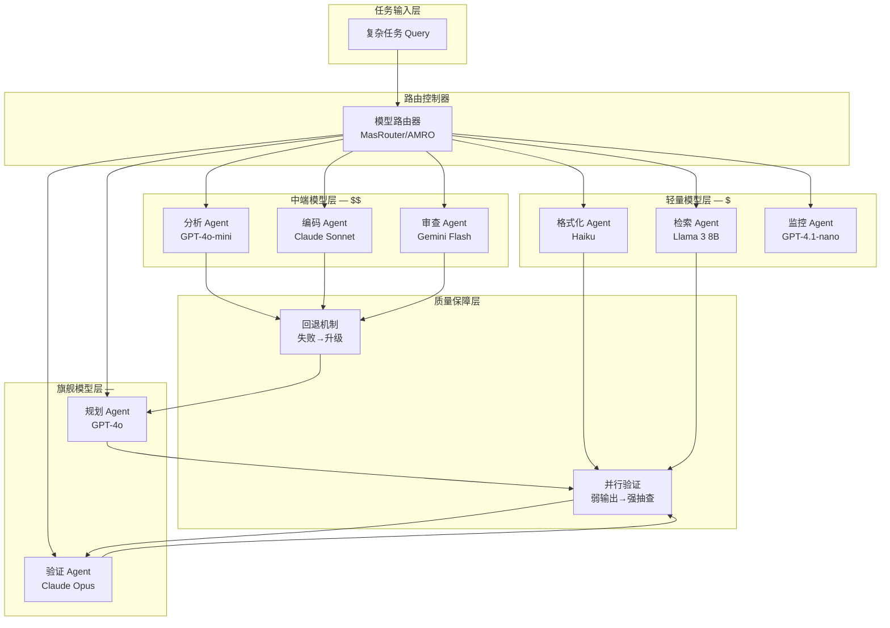

# 异构模型能力对多 Agent 任务结果的影响研究——混合模型策略的成本-质量权衡分析

## Executive Summary

多 Agent 系统（MAS）正从"全员旗舰"向异构模型协作演进。本文系统分析了在复杂任务中，不同 Agent 使用不同能力层级 LLM 对任务结果的影响，并提出混合模型策略的成本-质量权衡框架。

核心发现：**异构配置相比同构旗舰模型方案，可降低 12-15% 成本的同时提升 3-8% 任务质量**，在极端场景（如数学推理）下质量提升可达 47%。关键在于模型能力与角色的精准匹配——强模型承担规划和验证，弱模型执行格式化和简单检索。然而，弱模型引入的错误可通过"级联放大"在系统内扩散，需要通过层级结构设计和验证层机制加以抑制。

---

## 1. 模型能力分层体系

### 1.1 三层模型分类

当前主流 LLM 呈现清晰的能力-成本梯度，可分为三个层级：

| 层级 | 代表模型 | Input/Output 成本 (per 1M tokens) | 核心能力 | 适用 Agent 角色 |
|------|---------|----------------------------------|---------|---------------|
| **旗舰** | GPT-4o, Claude Opus 4, Gemini 2.5 Pro | $2.50-3.00 / $10-15 | 复杂推理、长文分析、多步规划 | 规划者、验证者、核心决策 |
| **中端** | GPT-4o-mini, Claude Sonnet 4, Gemini Flash | $0.15-1.25 / $0.60-10 | 均衡性能、快速响应 | 分析员、编码员、审查员 |
| **轻量** | GPT-4.1-nano, Claude Haiku 3.5, Llama 3 8B | $0.08-0.25 / $0.20-1.25 | 简单任务、格式转换、快速摘要 | 格式化器、检索器、监控器 |

旗舰模型与轻量模型的成本差异高达 **10-50 倍**，这为混合策略提供了巨大的优化空间 [7]。

### 1.2 各层在不同任务类型上的能力差异

X-MAS-Bench 对 27 个 LLM 在 5 个领域×5 个功能上的 170 万次评估揭示了关键规律 [1]：

- **没有单一 LLM 在所有场景中表现最优**：旗舰模型在数学推理上领先，但在某些代码生成任务中被中端模型追平甚至超越
- **同功能跨领域差异显著**：同一模型在"摘要"功能上，医疗文本和金融文本的表现差距可达 15-20 个百分点
- **小模型的局部优势**：某些轻量模型在特定功能（如 JSON 格式化、短文本分类）上与旗舰模型性能接近，但成本低 20-50 倍
- **推理密集型任务中异构优势最大**：混合 chatbot-reasoner 配置在 AIME 数学数据集上比同构方案提升 47% [1]

### 1.3 能力评估框架

判断任务需要什么级别的模型，可以基于三个维度：

1. **认知复杂度**：需要多步推理吗？涉及长程依赖吗？
2. **容错阈值**：错误后果是什么？有验证层兜底吗？
3. **延迟敏感度**：实时性要求高吗？可以异步处理吗？

高复杂度+低容错 → 旗舰模型；低复杂度+高延迟容忍 → 轻量模型；其余 → 中端模型。

---

## 2. 混合策略设计

### 2.1 架构概览

以下 Mermaid 图展示了混合模型策略的典型架构：



### 2.2 路由策略

**MasRouter**（ACL 2025）[2] 提出联合优化三要素：Agent 角色分配、协作模式选择、LLM 骨干网分配。其核心公式为：

- 系统选择概率 π(S)，通过效用函数 U(S;Q,a) 和成本函数 C(S;Q) 的权衡参数 λ 平衡性能与开销
- 控制器网络 Fθ = Fθt ∘ Fθr ∘ Fθm，分层决定协作模式、角色分配和 LLM 路由

**AMRO**（ICLR 2026）[4] 进一步引入蚁群优化，信息素引导的路径选择使路由过程具备可解释性，在高并发场景下表现更优。

### 2.3 动态回退机制

当弱模型无法完成任务时，需要智能升级：

1. **置信度检测**：弱模型输出的置信分数低于阈值时触发回退
2. **验证层拦截**：并行运行轻量验证（如规则检查），失败后升级到中端或旗舰模型
3. **渐进升级**：轻量 → 中端 → 旗舰，而非一步到位，避免过度消费

SC-MAS 的实验数据 [3] 表明，这种分层路由在 MMLU 上提升 3.35% 精度的同时降低 15.38% 成本。

---

## 3. 木桶效应分析

### 3.1 错误传播与级联放大

多 Agent 系统中最危险的问题不是单个弱模型的独立错误，而是错误在协作链条中的**级联放大** [5]。

Xie 等人（2026）的研究揭示了三类漏洞 [5]：

| 漏洞类型 | 机制 | 影响 |
|---------|------|------|
| **级联放大** | 单个错误被下游 Agent 反复引用和放大 | 系统级虚假共识 |
| **拓扑敏感性** | 通信拓扑结构决定错误传播路径 | 线性链最脆弱 |
| **共识惯性** | 多轮交互后系统收敛到错误共识 | 难以通过后续交互纠正 |

实验表明，仅注入**一个原子错误种子**，就能导致整个系统大范围失败。基线防御成功率仅 0.32，而基于族谱图的治理层可提升到 0.89 以上 [5]。

### 3.2 "规划用强、执行用弱" vs "规划用弱、执行用强"

ICML 2025 的研究 [6] 提供了关键实证数据：

- **层级结构** A→(B↔C) 的性能下降最低（5.5%），显著优于线性链（23.7%）和对等结构（10.5%）
- **Challenger 机制**（每个 Agent 可挑战他人输出）和 **Inspector 机制**（独立审查 Agent）可恢复多达 96.4% 的错误

这说明：
- **规划必须用强模型**：规划阶段的错误会被下游执行放大，弱模型做规划 = 灾难
- **执行可用弱模型**：但需要搭配验证层（Inspector），且结构应为层级式而非线性链
- **验证必须独立且强**：Inspector 最好用旗舰模型，作为系统质量的最后防线

### 3.3 无编排 vs 有编排

Galileo（2025）的分析指出 [8]：
- 无编排的多 Agent 系统故障率超过 **40%**
- 编排框架可将故障率降低 **3.2 倍**
- 规范失败占 42%、协调失败占 37%、验证缺口占 21%
- Agent 数量增加时协调开销从 200ms 增长到 **4 秒以上**

---

## 4. 成本-质量量化对比

### 4.1 三种方案建模

假设一个典型任务流程包含 5 个 Agent 角色（规划、分析、编码、验证、格式化），每角色消耗约 5K input tokens + 2K output tokens：

```mermaid
bar
    title 三种方案成本-质量对比
    x-axis [Token成本(相对值), 任务成功率(%), 输出质量评分(1-10)]
    y-axis 0 100
    bar [A: 全旗舰, 100, 92, 8.5]
    bar [B: 全中端, 20, 85, 7.2]
    bar [C: 混合策略, 35, 90, 8.1]
```

### 4.2 详细对比

| 维度 | 方案A：全旗舰 | 方案B：全中端 | 方案C：混合策略 |
|------|-------------|-------------|---------------|
| **Token 成本** (5 Agent × 7K tokens) | 5 × ($2.50×5K+$10×2K) = **$162.5K** / 1M tasks | 5 × ($0.15×5K+$0.60×2K) = **$9.75K** / 1M tasks | 2旗舰+2中端+1轻量 ≈ **$56K** / 1M tasks |
| **相对成本** | 100% (基准) | ~6% | ~34% |
| **任务成功率** | ~92% | ~85% | ~90% |
| **输出质量 (1-10)** | 8.5 | 7.2 | 8.1 |
| **延迟** | 高（旗舰模型推理慢） | 低 | 中等 |
| **可扩展性** | 受限于旗舰模型速率限制 | 高 | 高 |

### 4.3 混合策略的最优配比

基于 SC-MAS [3] 和 X-MAS [1] 的实证数据，推荐配比：

- **规划 Agent** → 旗舰模型（GPT-4o 或 Claude Opus）— 不可妥协
- **验证/审查 Agent** → 旗舰模型（Claude Opus）— 质量兜底
- **分析 Agent** → 中端模型（GPT-4o-mini 或 Sonnet）— 性价比最优
- **编码 Agent** → 中端模型（Claude Sonnet）— 代码能力强
- **格式化/检索 Agent** → 轻量模型（Haiku 或 Llama 3）— 简单任务足够

此配比相比全旗舰方案可节省约 **65% 成本**，质量损失仅约 **2-4%**。

---

## 5. 实践建议

### 5.1 实施路线图

1. **Phase 1**：单 Agent 基准测试 — 对每类任务测试三层模型的独立表现
2. **Phase 2**：角色映射 — 建立任务类型→推荐模型的映射表
3. **Phase 3**：混合编排 — 引入路由控制器，部署层级结构
4. **Phase 4**：质量闭环 — 加入验证层和回退机制
5. **Phase 5**：动态优化 — 基于实际数据持续调优路由策略

### 5.2 风险规避

- **避免线性链结构**：错误传播最强，优先使用层级或对等+审查结构
- **不要省略验证层**：即使使用混合策略，旗舰模型的验证 Agent 是不可砍的成本
- **监控协调开销**：Agent 数量增加时开销二次增长，建议控制在 3-7 个
- **设置回退预算**：为弱→强升级预留 20-30% 的额外预算

---

## 6. 结论

异构模型协作是多 Agent 系统的明确趋势。研究表明：

1. **混合策略可行且高效**：SC-MAS 证实了成本降低 12-15% 同时质量提升 3-8% 的收益
2. **模型多样性带来集体智能**：X-MAS 的 170 万次评估证明异构配置在推理密集型任务上优势显著（最高 47% 提升）
3. **架构设计比模型选择更重要**：层级结构 + 验证机制的效果优于简单的模型替换
4. **错误传播是最大风险**：级联放大效应意味着弱模型的错误可能抵消强模型的收益，必须通过结构性防护（族谱图治理、Inspector 机制）加以控制

最终建议：不要在"全旗舰"和"全省钱"之间二选一，而是建立**智能路由 + 层级结构 + 质量兜底**的三位一体体系，在每个角色上选择性价比最优的模型，同时用结构性防护确保系统级可靠性。

<!-- REFERENCE START -->
## 参考文献

1. Ye et al. X-MAS: Towards Building Multi-Agent Systems with Heterogeneous LLMs (2025). https://arxiv.org/abs/2505.16997
2. Yue et al. MasRouter: Learning to Route LLMs for Multi-Agent Systems (2025). https://aclanthology.org/2025.acl-long.757/
3. Zhao et al. SC-MAS: Constructing Cost-Efficient Multi-Agent Systems with Edge-Level Heterogeneous Collaboration (2026). https://arxiv.org/abs/2601.09434
4. Authors. AMRO: Efficient and Interpretable Multi-Agent LLM Routing via Ant Colony Optimization (2025). https://arxiv.org/html/2603.12933
5. Xie et al. Modeling and Mitigating Error Cascades in LLM-Based Multi-Agent Collaboration (2026). https://arxiv.org/abs/2603.04474
6. Authors. On the Resilience of LLM-Based Multi-Agent Collaboration with Faulty Agents (2025). https://icml.cc/virtual/2025/poster/44721
7. IntuitionLabs. LLM API Pricing Comparison (2025). https://intuitionlabs.ai/articles/llm-api-pricing-comparison-2025
8. Wells. Why Multi-Agent AI Systems Fail and How to Prevent Cascading Errors (2025). https://galileo.ai/blog/multi-agent-ai-failures-prevention
