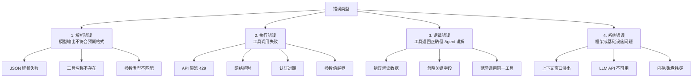
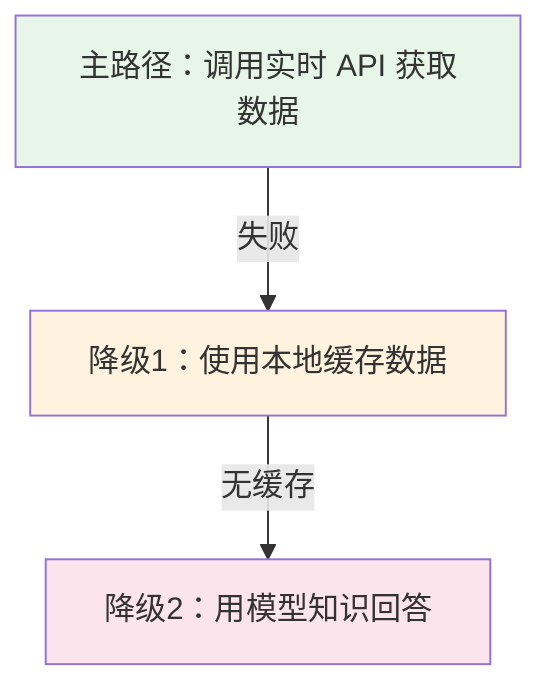
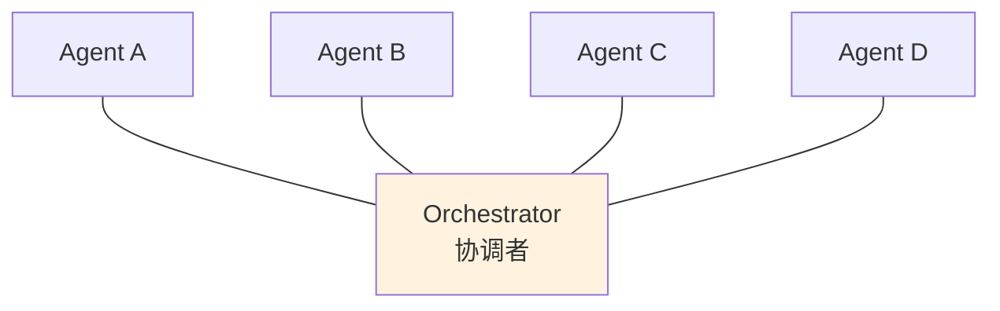
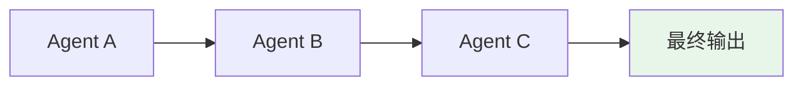
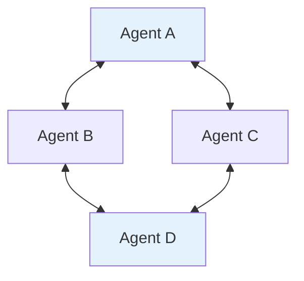
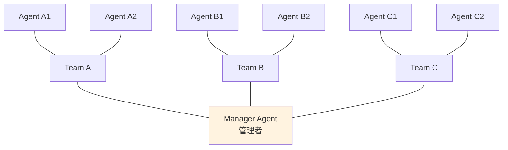
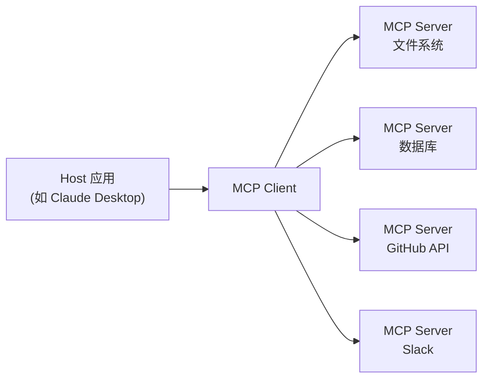
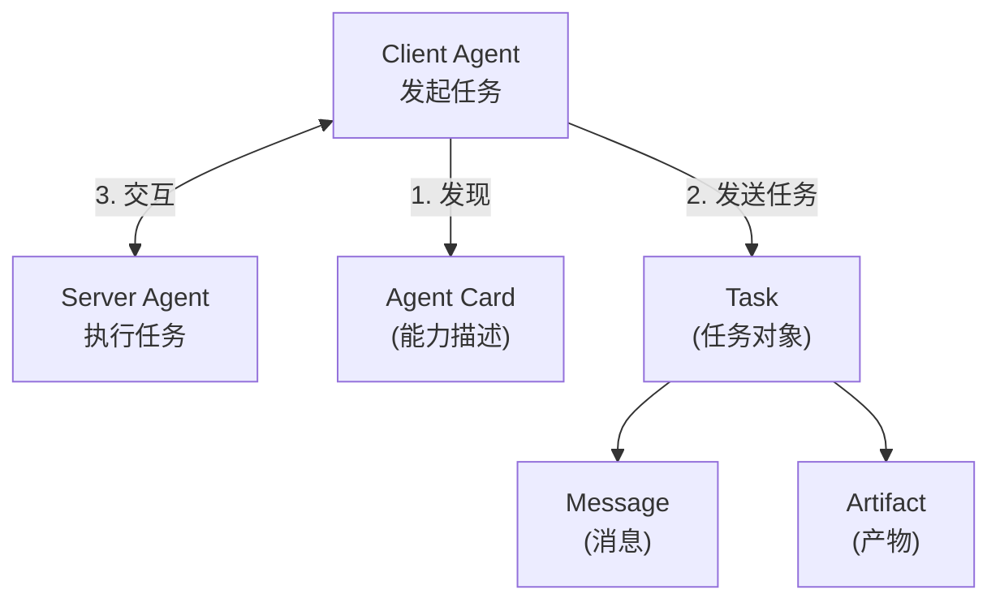
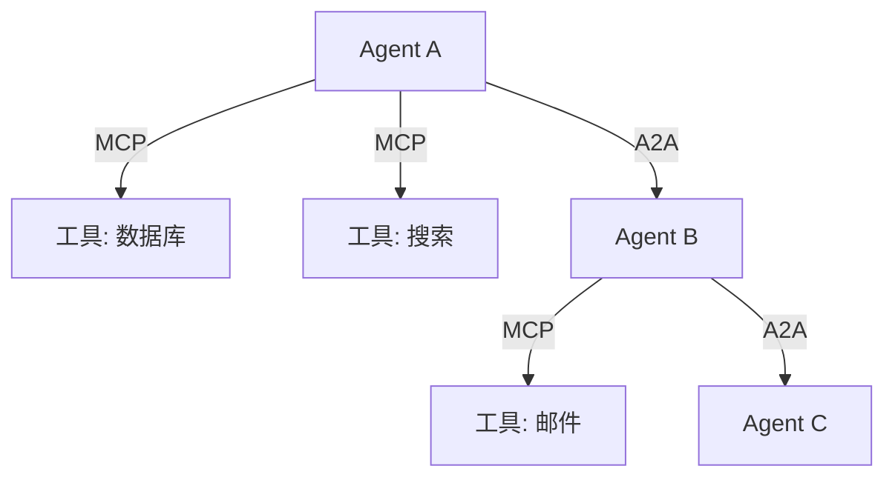
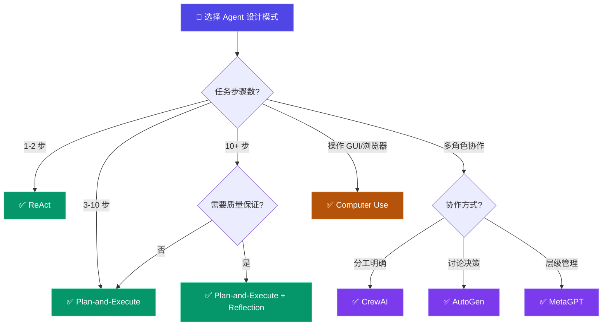

# AI Agent 设计模式

> **发布日期**: 2026-03-14 | **更新**: 2026-03-15（v1.1 补充 MCP/A2A 协议、Swarm/ADK 框架对比）  
> **分类**: 方法论  
> **关键词**: Agent, ReAct, Plan-and-Execute, Reflection, 工具使用, 错误处理, 多Agent通信

---

## Executive Summary

AI Agent（智能体）正在成为大语言模型应用的主流范式。从 2023 年 ReAct 模式引爆行业关注，到 2024-2025 年 Plan-and-Execute、Reflection 等高级模式的成熟，Agent 架构已经从"能跑通"进化到"可工程化"阶段。本报告系统梳理当前主流的 AI Agent 设计模式，涵盖核心推理范式、工具使用机制、错误处理策略、多 Agent 通信架构，并结合业界典型案例进行分析。

**核心发现**:
- **ReAct 仍是入门首选**，但面对复杂任务时效率和稳定性不足
- **Plan-and-Execute 在多步骤任务中表现优异**，已成为 LangChain、CrewAI 等框架的默认模式
- **Reflection 机制能显著提升输出质量**，但计算成本翻倍，需权衡使用
- **工具使用设计是 Agent 稳定性的关键**，工具调用失败是最常见的 Agent 失败场景（参考 [LangSmith 可观测性报告](https://docs.smith.langchain.com/observability/concepts) 和 [Anthropic 构建有效 Agent 指南](https://www.anthropic.com/engineering/building-effective-agents)）
- **多 Agent 协作正从"概念验证"走向"生产部署"**，通信协议标准化是下一步重点

---

## 一、核心推理范式

### 1.1 ReAct（Reasoning + Acting）

ReAct 是最早被广泛采用的 Agent 设计模式，由 Yao et al. (2022) 提出。其核心思想是将推理（Thought）与行动（Action）交替进行，形成一个循环链路。

**工作流程**:

```
Thought: 我需要查询今天的天气
Action: search_weather("北京")
Observation: 北京，晴，15°C
Thought: 用户想了解北京天气，我已获得结果
Final Answer: 北京今天天气晴朗，气温15°C
```

**优势**:
- 结构简单，容易理解和实现
- 推理过程透明可追溯
- 与 LLM 的自然语言能力天然契合
- 适合单轮简单任务

**局限**:
- **长程规划能力弱**: 无法预判后续步骤的依赖关系
- **容易"走偏"**: 当某一步推理出错时，后续步骤会连锁失败
- **效率低下**: 每一步都需要一次 LLM 调用，复杂任务下延迟显著
- **缺乏纠错机制**: 没有内置的自我评估和修正回路

**适用场景**: 简单问答、单步工具调用、快速原型验证。

**实际案例**: OpenAI 的 ChatGPT 插件系统本质上采用了 ReAct 模式——模型决定何时调用插件、如何解析返回结果。LangChain 的 `AgentExecutor` 默认也是 ReAct 链路。

### 1.2 Plan-and-Execute（规划-执行）

Plan-and-Execute 模式将任务分解为两个阶段：先制定完整计划，再逐步执行。这种模式在 2024 年成为主流，被 LangGraph、CrewAI、AutoGen 等框架广泛采用。

**工作流程**:

```
阶段1 - 规划:
Plan:
  1. 搜索目标公司的财务数据
  2. 分析近3年营收趋势
  3. 对比同行业竞品
  4. 生成分析报告

阶段2 - 执行:
Step 1: search_financials("公司A") → 获得数据
Step 2: analyze_trends(data, years=3) → 趋势分析
Step 3: compare_competitors("公司A", industry="科技") → 竞品对比
Step 4: generate_report(all_findings) → 最终报告
```

**关键变体**:

**a) 固定计划 (Fixed Plan)**
规划阶段生成完整计划后一次性执行，不再修改。优点是确定性强，缺点是无法应对执行中的意外。

**b) 动态重规划 (Dynamic Replanning)**
每个步骤执行后评估结果，必要时调整后续计划。这是更鲁棒的实现方式：

```
执行 Step 1 → 结果不完整 → 重新规划
Revised Plan:
  1. 搜索目标公司财务数据（换用数据源）
  2. 补充搜索行业报告
  3. ...
```

**c) 分层规划 (Hierarchical Planning)**
大目标分解为子目标，每个子目标再分解为具体步骤。适合长期复杂任务。

**优势**:
- 全局视角，避免"走一步看一步"的短视问题
- 步骤依赖关系明确，可并行执行独立步骤
- 容易评估进度和剩余工作量
- 适合多步骤、多工具的复杂工作流

**局限**:
- 规划质量高度依赖 LLM 的能力
- 如果计划本身就错了，执行再精确也没用
- 重规划开销大，每次调整都需要额外 LLM 调用

**业界采用**: LangGraph 的 `PlanAndExecute` 链、Microsoft Autogen 的 GroupChat 模式、CrewAI 的任务分解机制都采用了这一范式。

### 1.3 Reflection（反思）

Reflection 模式引入了"生成-评估-改进"的迭代回路。Agent 不仅执行任务，还会对自己的输出进行批判性评估，然后迭代改进。

**典型流程**:

```
第1轮:
  生成: 撰写产品需求文档 v1
  评估: 检查文档的完整性、准确性、逻辑性
  反馈: "第3节缺少用户场景描述，第5节技术方案过于笼统"

第2轮:
  改进: 基于反馈修改文档 v2
  评估: 再次检查
  反馈: "整体质量达标，建议微调措辞"

第3轮:
  最终修改 → 输出 v3
```

**三种 Reflection 变体**:

| 变体 | 描述 | 适用场景 |
|------|------|----------|
| **Self-Reflection** | 单个 Agent 自己评估自己的输出 | 简单任务、快速迭代 |
| **Peer Review** | 一个 Agent 生成，另一个 Agent 评估 | 需要客观视角、避免自恋偏差 |
| **Tree of Thoughts** | 多条推理路径，反射后选择最优 | 开放性问题、创意任务 |

**优势**:
- 输出质量显著提升（尤其在写作、代码生成、分析任务中）
- 能发现逻辑漏洞和事实错误
- 适合对质量要求高的场景

**局限**:
- **成本翻倍甚至三倍**: 每轮迭代都是额外的 LLM 调用
- **可能陷入无限改进循环**: 需要设置最大迭代次数
- **自我评估可能有偏差**: Agent 可能高估或低估自己的输出

**推荐策略**: 设置 2-3 轮迭代上限，并用明确的评估标准（如 checklist）引导 Reflection，避免开放式评估。

### 1.4 其他新兴模式

**a) LATS（Language Agent Tree Search）**
结合蒙特卡洛树搜索，Agent 在行动前探索多条可能路径，评估每条路径的预期收益，选择最优路径执行。适合需要前瞻推理的任务（如棋类、策略规划）。

**b) STORM（Synthesis of Topic Outlines through Retrieval and Multi-perspective）**
专为长文写作设计。先通过多角度提问收集信息，再生成大纲，最后逐步填充内容。斯坦福大学提出的这一模式在生成 Wikipedia 风格长文时表现突出。

**c) Evaluator-Optimizer（评估器-优化器）**
一个 LLM 生成内容，另一个 LLM 担任评估器，提供结构化反馈。本质上是 Reflection 的双 Agent 版本，但评估标准更明确。

---

## 二、工具使用机制设计

工具使用是 Agent 与外部世界交互的核心能力。设计良好的工具使用机制能显著提升 Agent 的可靠性和实用性。

### 2.1 工具定义与注册

**最佳实践**:

```python
tools = [
    {
        "name": "search_web",
        "description": "搜索互联网获取最新信息。当需要实时数据、新闻或验证事实时使用。",
        "parameters": {
            "query": {"type": "string", "description": "搜索查询语句"},
            "num_results": {"type": "integer", "default": 5}
        }
    },
    {
        "name": "execute_code",
        "description": "执行 Python 代码并返回输出。用于数据计算、文件处理等。",
        "parameters": {
            "code": {"type": "string", "description": "要执行的 Python 代码"},
            "timeout": {"type": "integer", "default": 30}
        }
    }
]
```

**关键原则**:
1. **描述要具体且包含使用场景**: "当需要 X 时使用"比"执行搜索"更有指导性
2. **参数命名要语义化**: `query` 比 `q` 好，`target_file` 比 `arg1` 好
3. **提供合理的默认值**: 减少 Agent 需要猜测的参数
4. **数量控制在 15 个以内**: 工具过多会导致 Agent 选择困难，超过 20 个时建议分组

### 2.2 工具调用策略

**a) Function Calling（函数调用）**
由 LLM 直接输出结构化的函数调用请求，框架解析并执行。这是 OpenAI、Anthropic、Google 等主流 API 的标准方式。

```
模型输出: {"name": "search_web", "arguments": {"query": "2025 AI trends"}}
框架执行: search_web("2025 AI trends")
结果返回给模型继续推理
```

**b) Code Generation（代码生成）**
Agent 生成完整代码块执行。适合需要多个步骤组合操作的场景。

**示例** — Agent 输出如下 Python 代码并执行：

```python
import requests
data = requests.get("https://api.example.com/data").json()
filtered = [d for d in data if d["score"] > 0.8]
print(f"高分记录: {len(filtered)} 条")
```

**c) Tool Chaining（工具链）**
预定义工具调用序列，Agent 只需填充参数。适合标准化流程。

**推荐**: Function Calling 是目前最成熟的方式，建议优先采用。Code Generation 灵活性高但安全风险大，必须在沙箱中执行。

### 2.3 工具结果处理

工具返回的结果需要妥善处理：

| 结果类型 | 处理方式 |
|----------|----------|
| 成功 + 完整数据 | 直接传递给 LLM 继续推理 |
| 成功 + 数据量大 | 摘要压缩后再传递，避免超出上下文窗口 |
| 部分成功 | 标记警告，让 Agent 决定是否重试或换策略 |
| 失败 + 可重试 | 自动重试（最多 3 次），每次增加等待时间 |
| 失败 + 不可重试 | 返回错误描述，让 Agent 选择替代方案 |

**Token 管理**: 工具返回的长文本需要截断或摘要。建议对超过 2000 字符的结果自动进行摘要，保留关键信息。

---

## 三、错误处理策略

Agent 系统的错误处理是生产化的关键瓶颈。据 LangSmith 统计，约 90% 的 Agent 失败源于工具调用和外部依赖环节。

### 3.1 错误分类



### 3.2 分层错误处理

**层1 - 自动恢复 (Automatic Recovery)**

```python
# 重试机制: 指数退避
for attempt in range(max_retries):
    try:
        result = execute_tool(tool_name, params)
        break
    except RateLimitError:
        wait = 2 ** attempt + random.uniform(0, 1)
        time.sleep(wait)
    except TimeoutError:
        if attempt == max_retries - 1:
            return {"error": "工具超时，建议稍后重试"}
```

**层2 - Agent 自我修正 (Self-Correction)**

将错误信息反馈给 LLM，让它自己修正：

```
错误: Tool "web_search" not found. Available tools: search_web, search_docs
Agent 修正: 改用 search_web 并重试
```

**层3 - 降级策略 (Graceful Degradation)**



> **图3.2 三级降级策略**：正常情况下调用实时 API；API 失败时自动切换到本地缓存（标注缓存时间）；无可用缓存时，使用模型训练知识回答（标注"基于训练数据"），确保服务不中断。

**层4 - 人工介入 (Human-in-the-loop)**

设置明确的人工介入触发条件：
- 连续 3 次工具调用失败
- Agent 陷入循环（同一操作重复 > 5 次）
- 涉及敏感操作（删除数据、发送邮件、转账）
- 置信度低于阈值

### 3.3 循环检测与中断

Agent 陷入循环是最常见的生产事故之一。检测方法：

```python
class LoopDetector:
    def __init__(self, window_size=5, similarity_threshold=0.85):
        self.history = []
    
    def check(self, current_action):
        self.history.append(current_action)
        if len(self.history) > window_size:
            self.history.pop(0)
        
        # 检查是否在重复相同操作
        for prev in self.history[:-1]:
            if similarity(prev, current_action) > similarity_threshold:
                return True  # 检测到循环
        return False
```

**中断策略**:
- 设置最大步数限制（如 25 步）
- 设置最大 LLM 调用次数
- 设置总运行时间上限
- 检测到循环时自动暂停并报告

---

## 四、Agent 通信架构

当单个 Agent 无法胜任复杂任务时，多 Agent 协作成为必然选择。

### 4.1 通信拓扑

**a) 星型拓扑 (Star)**
一个协调者（Orchestrator）负责分配任务和汇总结果。



> **优点**：控制集中，容易管理优先级和冲突
> **缺点**：协调者成为瓶颈和单点故障

**b) 管道拓扑 (Pipeline)**
Agent 按顺序排列，前一个的输出是后一个的输入。



> **优点**：结构简单，适合流水线任务
> **缺点**：无法并行，前一步失败则全部阻塞

**c) 网状拓扑 (Mesh)**
Agent 之间可以自由通信，形成动态协作网络。



> **优点**：灵活性最高，容错性强
> **缺点**：通信复杂度 O(n²)，可能出现"聊天噪音"

**d) 层次拓扑 (Hierarchical)**
Agent 组织成树状结构，上层 Agent 协调下层 Agent。



> **优点**：可扩展性强，职责清晰
> **缺点**：通信延迟，上层决策影响全局

### 4.2 消息协议

**结构化消息格式**:

```json
{
  "message_id": "uuid-v4",
  "from": "agent-researcher",
  "to": "agent-writer",
  "type": "task_assignment",
  "content": {
    "task": "撰写关于X的技术分析",
    "context": {...},
    "deadline": "2025-01-20T18:00:00Z",
    "priority": "high"
  },
  "requires_response": true,
  "conversation_id": "conv-123"
}
```

**消息类型**:
- `task_assignment`: 分配任务
- `task_result`: 返回结果
- `question`: 请求澄清
- `review_request`: 请求审阅
- `approval_request`: 请求审批
- `broadcast`: 广播通知

### 4.3 冲突解决机制

当多个 Agent 的输出出现矛盾时：

1. **投票机制 (Voting)**: 多数决
2. **优先级机制**: 高优先级 Agent 的结论优先
3. **仲裁机制**: 专门的仲裁 Agent 做最终决定
4. **上下文融合**: 将不同观点综合为更全面的结论

### 4.4 共享状态管理

多 Agent 系统需要共享状态来协调工作：

- **共享内存 (Shared Memory)**: 所有 Agent 可读写的全局状态
- **消息队列 (Message Queue)**: 异步通信，解耦生产者和消费者
- **状态数据库**: 持久化存储，支持断点恢复
- **向量存储 (Vector Store)**: 共享知识库，支持语义检索

### 4.5 MCP 协议：标准化工具接入

**MCP（Model Context Protocol）** 是由 Anthropic 于 2024 年 11 月开源的协议标准，旨在解决 AI Agent 与外部工具/数据源之间的碎片化连接问题。MCP 采用客户端-服务器架构，类似于 "AI 版的 USB-C 接口"——一个协议连接所有工具。

**核心架构**:



**三大核心原语**:

| 原语 | 方向 | 说明 |
|------|------|------|
| **Resources** | Server → Client | 数据读取（文件、数据库记录、API 响应），由应用控制 |
| **Tools** | Client → Server | 可执行操作（搜索、写入、调用 API），由模型控制 |
| **Prompts** | Server → Client | 预定义的提示模板，由用户控制 |

**传输层**: MCP 支持两种传输方式：
- **stdio** — 本地进程间通信，延迟最低
- **Streamable HTTP** — 远程服务调用，支持无状态和有状态模式

**生态现状（截至 2025 年 3 月）**:
- 官方参考服务器：文件系统、GitHub、Slack、Google Maps、PostgreSQL、Puppeteer 等（[github.com/modelcontextprotocol](https://github.com/modelcontextprotocol)）
- 社区服务器：超过 1000+ 个 MCP Server（参考 [mcp.so](https://mcp.so) 服务器目录）
- 框架支持：OpenClaw、Claude Desktop、Cursor、Zed、Continue 等已原生集成

**MCP 的优势**:
- **标准化**: 统一的工具描述和调用协议，告别为每个 Agent 单独写集成
- **生态复用**: 一个 MCP Server 可被所有支持 MCP 的 Agent 使用
- **安全隔离**: 工具执行在独立进程中，Agent 通过协议间接访问
- **可发现性**: Agent 可以动态发现服务器提供的工具列表

**MCP 的局限**:
- **延迟开销**: 多一层协议栈，本地 stdio 延迟约 5-20ms，HTTP 模式更高
- **状态管理**: 有状态模式下需要管理 session，增加了复杂度
- **认证仍在演进**: OAuth 2.0 集成尚不成熟，企业级认证方案有限

### 4.6 A2A 协议：Agent 间的标准通信

**A2A（Agent-to-Agent Protocol）** 是 Google 于 2025 年 4 月联合 50+ 家技术公司发布的开放协议，旨在解决 Agent 之间互操作性的问题。如果说 MCP 是 Agent 连接工具的标准，A2A 就是 Agent 连接其他 Agent 的标准。

**核心设计理念**:
- **不暴露内部实现**: Agent 之间通过标准化的 "Agent Card" 发现能力，无需了解对方内部状态或工具
- **任务为中心**: 所有交互围绕 Task 对象进行，包含状态、消息和产物
- **模态无关**: 支持文本、文件、表单、iframe 等多种交互方式
- **异步优先**: 原生支持长时间运行任务和推送通知

**核心概念**:



**Agent Card**: JSON 格式的能力描述文件，通常托管在 `/.well-known/agent.json`，包含：
- Agent 名称、描述、版本
- 支持的技能列表（含输入/输出模式）
- 认证要求
- 支持的传输方式

**A2A vs MCP 对比**:

| 维度 | MCP | A2A |
|------|-----|-----|
| **定位** | Agent ↔ 工具/数据 | Agent ↔ Agent |
| **连接对象** | 数据库、API、文件系统 | 其他 AI Agent |
| **架构** | Client-Server（Host 连接多个 Server） | Peer-to-Peer（Agent 间直接通信） |
| **核心原语** | Resources、Tools、Prompts | Agent Card、Task、Message、Artifact |
| **状态管理** | Session（可选） | Task 状态机（submitted → working → completed） |
| **发布方** | Anthropic（2024.11） | Google + 联盟（2025.04） |
| **厂商支持** | Anthropic 生态为主 | Google、Microsoft、Salesforce、SAP 等 50+ 家 |

**互补关系**: MCP 和 A2A 并非竞争关系，而是互补的。一个 Agent 可以通过 MCP 连接工具，同时通过 A2A 与其他 Agent 协作：



**实际应用（截至 2025 年 3 月）**:
- Google 已在 Vertex AI Agent Builder 中集成 A2A
- Salesforce Agentforce 支持 A2A 跨平台协作
- LangGraph 和 CrewAI 正在开发 A2A 适配器

---

## 五、架构案例分析

### 案例 1: LangGraph — 图结构 Agent 框架

**设计哲学**: 将 Agent 表示为有向图，节点是计算步骤，边是控制流。

**核心特性**:
- 支持条件分支和循环
- 内置状态管理（StateGraph）
- 支持 Human-in-the-loop 中断
- 时间旅行调试（可回溯任意状态）

**典型用法**:
```python
from langgraph.graph import StateGraph

graph = StateGraph(AgentState)
graph.add_node("planner", plan_step)
graph.add_node("executor", execute_step)
graph.add_node("reviewer", review_step)
graph.add_edge("planner", "executor")
graph.add_conditional_edges(
    "reviewer",
    should_continue,  # 条件函数
    {"continue": "executor", "end": END}
)
```

**适用场景**: 需要复杂控制流的 Agent 工作流，如审批流程、多轮交互。

### 案例 2: CrewAI — 多 Agent 协作框架

**设计哲学**: 将 Agent 编排为"船员"（Crew），每个 Agent 有特定角色和目标。

**核心特性**:
- 基于角色的 Agent 定义（Role, Goal, Backstory）
- 任务依赖关系管理
- 支持顺序执行和层级管理
- 内置 Delegation（Agent 可以委托任务给其他 Agent）

**典型用法**:
```python
researcher = Agent(
    role="技术研究员",
    goal="深入研究AI Agent最新进展",
    backstory="你是一位资深AI研究员..."
)

writer = Agent(
    role="技术写作者",
    goal="将研究内容转化为易读的报告",
    backstory="你擅长将复杂技术概念简化..."
)

crew = Crew(
    agents=[researcher, writer],
    tasks=[research_task, write_task],
    process=Process.sequential
)
```

**适用场景**: 内容创作流水线、研究分析团队、客户支持分流。

### 案例 3: Microsoft AutoGen — 对话式多 Agent

**设计哲学**: Agent 之间通过对话协作，模拟人类团队讨论。

**核心特性**:
- 多 Agent 对话编排
- 代码执行与验证（ConversableAgent）
- 灵活的对话终止条件
- 支持 Human 参与对话

**典型用法**:
```python
assistant = AssistantAgent("assistant", llm_config=llm_config)
user_proxy = UserProxyAgent("user_proxy", code_execution_config={...})

user_proxy.initiate_chat(
    assistant,
    message="帮我分析这段代码的性能瓶颈"
)
```

**适用场景**: 代码审查、技术讨论、交互式问题解决。

### 案例 4: OpenAI Swarm — 轻量级多 Agent 编排（2024.10）

**设计哲学**: 极简主义的多 Agent 编排框架。Swarm 不是生产级框架，而是 OpenAI 于 2024 年 10 月发布的教育性示例代码，展示了多 Agent 协作的最简实现。

**核心特性**:
- **Agents**: 拥有指令和工具的独立实体
- **Handoffs**: Agent 之间通过交接（handoff）转移控制权，无需中央调度
- **零状态**: 框架本身不维护状态，每次调用都是无状态的
- **极简 API**: 核心代码约 500 行，易于理解和修改

**典型用法**:
```python
from swarm import Swarm, Agent

def transfer_to_triage():
    return triage_agent

triage_agent = Agent(
    name="Triage Agent",
    instructions="分类用户问题并路由到正确的专家",
    functions=[transfer_to_triage],
)

tech_agent = Agent(
    name="Tech Support",
    instructions="解决技术问题",
)

client = Swarm()
response = client.run(agent=triage_agent, messages=[...])
```

**优势**: 学习曲线极低；Handoff 模式直观自然；与 OpenAI API 深度集成。

**局限**: 非生产级框架（OpenAI 明确声明）；缺乏持久化状态管理、错误恢复等生产特性；2024 年发布时仅支持 OpenAI 模型。

**GitHub**: [github.com/openai/swarm](https://github.com/openai/swarm)（截至 2025 年 3 月已有 20k+ Stars）

### 案例 5: Google ADK（Agent Development Kit）— 企业级 Agent 框架（2025.03）

**设计哲学**: Google 于 2025 年 3 月发布的 Agent 开发框架，与 Vertex AI 深度集成，主打企业级部署和 A2A 协议支持。

**核心特性**:
- **多 Agent 层级**: 支持 Agent 的嵌套和层级编排
- **原生 A2A 支持**: 内建 A2A 协议实现，Agent 可直接对外暴露 A2A 接口
- **工具生态**: 支持 MCP 工具、预构建工具（搜索、代码执行等）、自定义函数
- **Vertex AI 集成**: 无缝对接 Google Cloud 的模型、评估、部署管线
- **流式交互**: 支持流式响应和实时双向通信

**与 A2A 的关系**: ADK 是 Google A2A 协议的首个官方框架实现。ADK 构建的 Agent 可自动获得 A2A Server 能力，其他 A2A 兼容的 Agent/客户端可以直接发现和调用。

**典型场景**: 企业内部多个 Agent 协作（如客服 Agent + 工单 Agent + 知识库 Agent），通过 A2A 跨部门、跨平台通信。

**文档**: [google.github.io/adk-docs](https://google.github.io/adk-docs)

### 案例 6: Anthropic Claude Computer Use

**设计哲学**: Agent 直接操作计算机（屏幕截图 + 鼠标键盘），实现 GUI 自动化。

**核心特性**:
- 视觉理解（截屏分析）
- 精确的坐标定位和操作
- 多步骤 GUI 工作流
- 安全沙箱隔离

**适用场景**: 无法通过 API 访问的遗留系统操作、测试自动化、RPA 替代。

### 案例对比

| 维度 | LangGraph | CrewAI | AutoGen | OpenAI Swarm | Google ADK | Claude Computer Use |
|------|-----------|--------|---------|-------------|------------|---------------------|
| 推理模式 | 图结构自定义 | ReAct + Plan | 对话式 | ReAct + Handoff | 多模态 | ReAct + 视觉 |
| 多Agent | ✅ 支持 | ✅ 核心能力 | ✅ 核心能力 | ✅ Handoff | ✅ 层级+A2A | ❌ 单Agent |
| 工具使用 | ✅ 灵活 | ✅ 内置 | ✅ 代码执行 | ✅ 函数调用 | ✅ MCP+A2A | ✅ GUI操作 |
| A2A 支持 | 🔧 适配中 | 🔧 适配中 | ❌ | ❌ | ✅ 原生 | ❌ |
| MCP 支持 | ✅ | ✅ | 🔧 适配中 | ❌ | ✅ | ✅ |
| 错误处理 | ✅ 条件分支 | ⚠️ 基础 | ✅ 对话重试 | ⚠️ 无内置 | ✅ 企业级 | ⚠️ 基础 |
| 学习曲线 | 中等 | 低 | 中等 | 极低 | 中等 | 低 |
| 生产就绪 | ✅ 高 | ✅ 中高 | ✅ 中 | ⚠️ 教育性 | ✅ 企业级 | ⚠️ 实验性 |
| 发布日期 | 2024 持续迭代 | 2024 持续迭代 | 2023 持续迭代 | 2024.10 | 2025.03 | 2024.10 |

---

## 六、实践建议

### 6.1 Agent 设计模式选型决策树



**快速参考**：

| 场景 | 推荐模式 | 理由 |
|------|----------|------|
| 简单问答、单步工具调用 | ReAct | 最快上手，开销最低 |
| 多步骤任务（如数据分析） | Plan-and-Execute | 先规划后执行，避免中途迷失 |
| 高质量输出（如代码生成） | Plan + Execute + Reflection | 迭代改进提升质量 |
| 团队协作（如研发流程） | 多 Agent（CrewAI/AutoGen） | 角色分工，专业化输出 |
| 操作 GUI / 浏览器自动化 | Computer Use | 视觉理解 + 操作 |

### 6.2 设计检查清单

在构建 Agent 系统前，确认以下问题：

- [ ] **任务定义**: Agent 的职责边界是否清晰？
- [ ] **工具集**: 是否只暴露必要的工具？描述是否充分？
- [ ] **错误处理**: 每个外部依赖的失败路径是否都有处理？
- [ ] **循环检测**: 是否有最大步数限制？
- [ ] **人机协同**: 敏感操作是否需要人工确认？
- [ ] **可观测性**: 是否有完整的日志和追踪？
- [ ] **成本控制**: 是否有 Token 用量监控和告警？

### 6.3 性能优化

1. **并行化独立步骤**: Plan-and-Execute 模式下，无依赖关系的步骤可以并行执行
2. **缓存工具结果**: 相同参数的工具调用可以缓存，避免重复执行
3. **模型分级**: 简单任务用小模型（如 GPT-4o-mini），复杂推理用大模型
4. **上下文压缩**: 长对话中定期摘要历史记录，减少 Token 消耗
5. **预编译 Prompt**: 将固定指令编译为 system prompt，减少每次调用的 Token

### 6.4 安全注意事项

- **工具权限最小化**: Agent 只应获得完成任务所需的最小权限
- **沙箱执行**: 代码执行必须在隔离环境中进行
- **输入验证**: 所有用户输入都需要验证和清洗
- **输出过滤**: Agent 的输出在返回给用户前应经过安全检查
- **审计日志**: 记录所有工具调用，便于事后审计

---

## 七、未来展望

### 7.1 趋势预测

1. **标准化通信协议**: 类似 HTTP 之于 Web，Agent 间的通信协议将标准化（如 Google 的 A2A 协议、MCP 协议）
2. **Agent 市场**: 预构建的领域专家 Agent 将像应用商店一样被分发和组合
3. **长期记忆**: 从短期上下文窗口进化到持久化记忆系统
4. **自主学习**: Agent 能从执行经验中学习，不断优化自己的策略
5. **多模态原生**: 视觉、语音、代码等模态将被原生整合，而非后加

### 7.2 待解决挑战

- **可靠性**: Agent 在生产环境中的成功率仍需大幅提升
- **成本**: 复杂 Agent 工作流的 LLM 调用成本仍然很高
- **评估**: 缺乏标准化的 Agent 评估基准和指标
- **安全**: Agent 自主性的提升带来更大的安全风险

---

## 参考来源

1. **ReAct: Synergizing Reasoning and Acting in Language Models** — Yao et al., 2022  
   https://arxiv.org/abs/2210.03629  
   *ReAct 模式的原始论文，定义了推理与行动交替的 Agent 范式*

2. **LLM Powered Autonomous Agents** — Lilian Weng, 2023  
   https://lilianweng.github.io/posts/2023-06-23-agent/  
   *OpenAI 研究员的经典综述，系统梳理 Agent 架构组件（引用 2023 年版本作为奠基性工作）*

3. **Building Effective Agents** — Anthropic, 2024  
   https://www.anthropic.com/engineering/building-effective-agents  
   *Anthropic 官方 Agent 构建指南，涵盖模式选型、工具设计、错误处理的最佳实践*

4. **LangChain LangGraph Documentation** — LangChain, 2024-2025  
   https://langchain-ai.github.io/langgraph/  
   *LangGraph 框架文档（v0.2.x），图结构 Agent 的参考实现*

5. **CrewAI Documentation** — CrewAI, 2024-2025  
   https://docs.crewai.com/  
   *多 Agent 协作框架文档，角色驱动的 Agent 编排*

6. **Microsoft AutoGen** — Microsoft Research, 2023-2025  
   https://microsoft.github.io/autogen/  
   *AutoGen 框架文档，对话式多 Agent 协作的参考实现*

7. **OpenAI Swarm** — OpenAI, 2024  
   https://github.com/openai/swarm  
   *轻量级多 Agent 编排教育框架，展示了 Handoff 模式的最简实现*

8. **Google Agent Development Kit (ADK)** — Google, 2025  
   https://google.github.io/adk-docs  
   *Google 企业级 Agent 框架，原生支持 A2A 协议和 Vertex AI 集成*

9. **Model Context Protocol (MCP)** — Anthropic, 2024  
   https://modelcontextprotocol.io  
   *MCP 协议规范，定义了 Agent 与工具/数据源的标准化连接方式*

10. **Agent-to-Agent Protocol (A2A)** — Google + 联盟, 2025  
    https://github.com/a2aproject/A2A
    *A2A 开放协议规范，定义了 Agent 间的互操作标准*

11. **Claude Computer Use** — Anthropic, 2024  
    https://docs.anthropic.com/en/docs/build-with-claude/computer-use  
    *Claude 的计算机使用功能文档，GUI Agent 的前沿实践*

12. **The Batch Newsletter — AI Agent Trends** — Andrew Ng / DeepLearning.AI, 2024-2025  
    https://www.deeplearning.ai/the-batch/  
    *Andrew Ng 的 AI 周刊，持续跟踪 Agent 技术趋势和行业动态*

---

*本报告由 Tech-Researcher 团队编写，旨在为 AI Agent 系统设计提供实践指导。如有反馈，欢迎在 GitHub Issues 中提出。*
