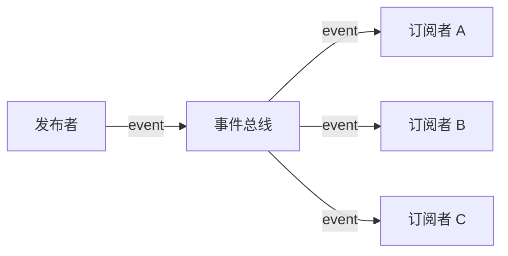
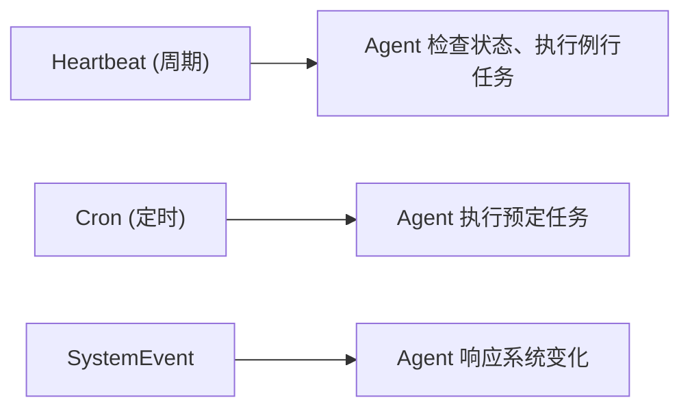
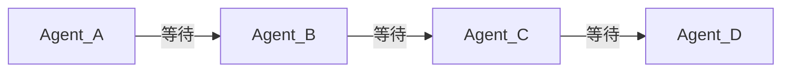
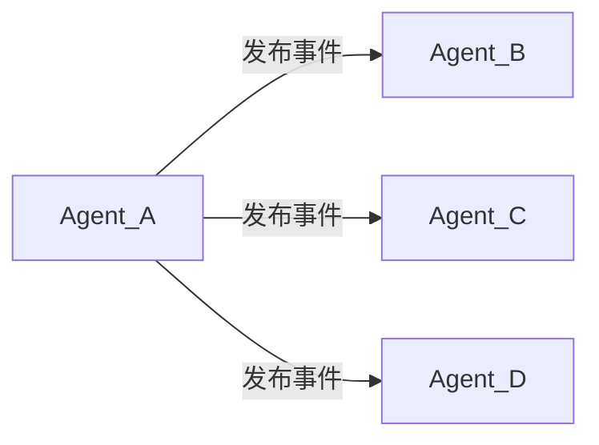
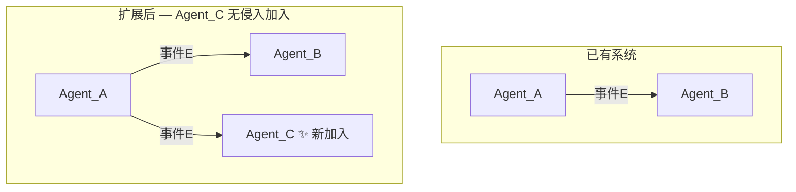
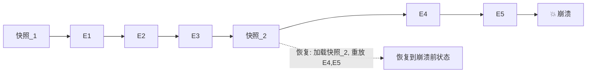
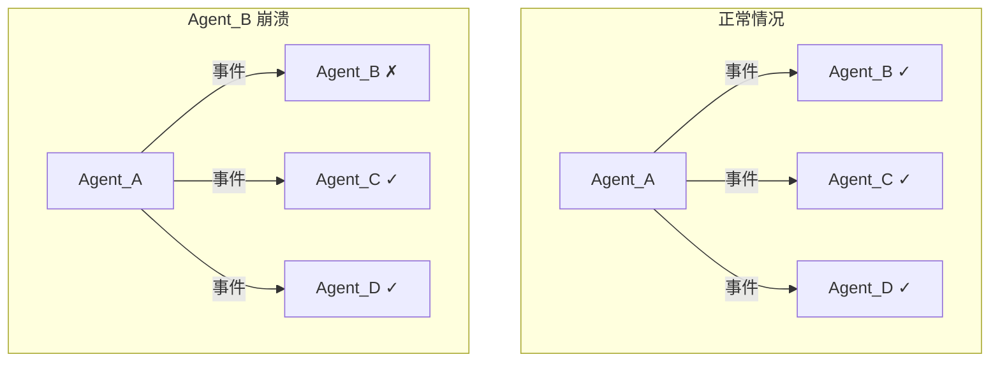
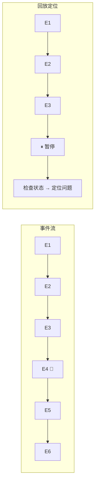
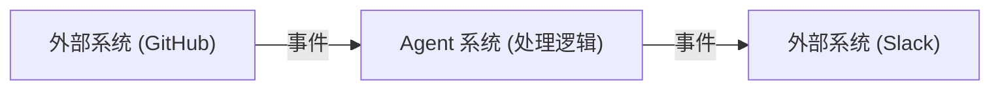

# Agent 事件机制的必要性

> **作者**: Tech-Researcher 探针  
> **日期**: 2026-03-17  
> **分类**: 方法论  
> **关键词**: Agent, Event Mechanism, LangGraph, CrewAI, AutoGen, OpenClaw, Multi-Agent, Decoupling

---

## Executive Summary

随着 Agent 框架从单体走向多 Agent 协作，**事件机制**正在从"nice-to-have"变为架构必需品。本报告从当前 Agent 交互方式的局限出发，系统分析 LangGraph、CrewAI、AutoGen、OpenClaw 四大框架的事件模型，论证事件机制在解耦、异步、可观测和可扩展四个维度的必要性，并探讨事件风暴控制、顺序保证、持久化重放等工程挑战的解决方案。

**核心结论**：事件机制不是 Agent 架构的可选组件，而是支撑多 Agent 系统扩展性、可靠性和可调试性的基础设施。缺乏事件机制的 Agent 系统，在 Agent 数量超过 3-5 个时会面临严重的协调复杂度爆炸。

---

## 1. Agent 的交互现状和局限性

### 1.1 当前 Agent 如何触发动作、传递状态、响应变化

当前主流 Agent 框架采用以下几种交互模式：

**直接函数调用（Direct Invocation）**
最常见的模式。一个 Agent 通过函数调用直接触发另一个 Agent 的动作：

```python
# 典型的直接调用模式
result = research_agent.run(topic)
writer_agent.receive(result)
final = writer_agent.run()
```

这种方式简单直观，适合两个 Agent 之间的线性协作，但调用者必须知道被调用者的接口和状态。

**共享状态（Shared State）**
多个 Agent 读写同一份共享状态。LangGraph 的 `StateGraph` 采用的就是这种模式——所有节点（Agent）通过读写同一个 `State` 对象进行通信：

```python
# LangGraph 共享状态模式
class AgentState(TypedDict):
    messages: Annotated[list, add_messages]
    research_results: list[str]
    final_report: str
```

**任务委派（Task Delegation）**
一个 Agent 将子任务分配给其他 Agent，如 CrewAI 的 Crew 模式。Manager Agent 创建 Task 对象并指定执行 Agent。

**对话轮转（Conversational Turn-taking）**
AutoGen 的 GroupChat 模式——Agent 按一定策略轮流发言，通过对话历史共享上下文。

### 1.2 现有方式的局限

| 交互模式 | 局限 |
|---------|------|
| 直接函数调用 | 紧耦合；调用者阻塞等待；无法处理被调用者故障 |
| 共享状态 | 难以追踪状态变更来源；并发修改冲突；调试困难 |
| 任务委派 | 委派者需要预知任务结构；动态变化难以适应 |
| 对话轮转 | 只适合对话场景；无法表达非对话类事件（如系统告警） |

**核心问题：缺乏统一的"发生了什么"的抽象**

现有模式都是围绕"谁调用谁"或"谁修改什么状态"构建的，缺少一种统一的方式来描述"系统中发生了什么事情"。这导致：

1. **耦合度过高**：发送者必须知道接收者的存在和接口
2. **同步阻塞**：调用链过长时，整体延迟呈线性增长
3. **可观测性差**：无法从单一视角看到系统全貌的动态变化
4. **扩展困难**：新增 Agent 时需要修改现有 Agent 的调用逻辑

### 1.3 为什么需要事件机制？

事件机制提供了第四种交互范式：**发布-订阅（Pub/Sub）**。Agent 发布事件，而不关心谁在监听；其他 Agent 订阅感兴趣的事件，而不关心谁在发布。



这种方式天然解决了上述所有局限：解耦了发送者和接收者、支持异步处理、提供了统一的可观测接口、允许新 Agent 无侵入地加入系统。

---

## 2. 当前流行框架的相应机制

### 2.1 LangGraph: 状态图 + 节点事件

LangGraph 是 LangChain 团队推出的多 Agent 编排框架，基于有向图（DAG）模型。核心概念：

- **StateGraph**：定义状态结构，所有节点共享
- **Node**：Agent 执行单元，接收状态、返回状态更新
- **Edge**：节点间的条件跳转
- **Checkpointer**：状态快照持久化

LangGraph 的"事件"实际上隐含在状态转移中——每次节点执行完成后，状态发生变更，触发下游节点的执行。2024 年底 LangGraph 加入了 `Command` 对象，允许节点同时返回状态更新和路由指令，部分引入了事件语义。

```python
# LangGraph 节点返回 Command（隐含事件语义）
def research_node(state):
    result = do_research(state["topic"])
    return Command(
        update={"research_results": result},
        goto="writer_node"  # 路由指令 = 隐含事件
    )
```

**事件特征**：隐式、状态驱动、同步执行（默认）、基于图拓扑。

### 2.2 CrewAI: 任务委派事件

CrewAI 以"角色扮演"为核心，Agent 被赋予角色（Role）、目标（Goal）和背景故事（Backstory）。CrewAI 的事件机制相对简单：

- **Task 事件**：任务开始、完成、失败
- **Crew 事件**：Crew 启动、完成
- **Agent 事件**：Agent 开始执行、完成执行

CrewAI 在 2024 年引入了 Event Listener 机制，允许外部代码监听 Crew 执行过程中的事件：

```python
from crewai.utilities.events import crewai_event_bus

@crewai_event_bus.on(TaskCompletedEvent)
def on_task_completed(event):
    print(f"Task {event.task.description} completed")
```

**事件特征**：显式、任务驱动、外部可监听、主要用于执行监控。

### 2.3 AutoGen: 对话事件模型

AutoGen（Microsoft）以对话为核心抽象。Agent 之间的所有交互都是"消息"——本质上就是事件的一种形式。

**AutoGen 0.4 (2024) 的事件架构重大升级**：

AutoGen 0.4 引入了完整的 `Event` 抽象和 `Topic`-based Pub/Sub 模型：

```python
# AutoGen 0.4 Pub/Sub 事件模型
from autogen_core import TopicId, MessageContext

class ResearchRequest(BaseModel):
    topic: str
    depth: str

# 发布事件
await runtime.publish_message(
    ResearchRequest(topic="AI agents", depth="deep"),
    topic_id=TopicId(type="research", source="planner")
)

# 订阅事件
@agent.subscribe(topic_type="research")
async def handle_research(self, message: ResearchRequest, ctx: MessageContext):
    # 处理研究请求
    pass
```

这是四大框架中最成熟的事件机制——支持 Topic-based 路由、消息持久化、运行时动态订阅。

**事件特征**：显式、消息驱动、Topic-based Pub/Sub、原生支持分布式运行时。

### 2.4 OpenClaw: Heartbeat + Cron + SystemEvent

OpenClaw 采用了一种更贴近系统编程的事件模型：

- **Heartbeat**：周期性定时事件，Agent 用于定期检查和主动响应
- **Cron**：定时任务事件，支持 cron 表达式
- **SystemEvent**：系统级事件（如节点连接/断开、消息到达）

OpenClaw 的事件模型面向"Agent 作为长期运行进程"的场景，事件主要用于 Agent 的自我管理和外部响应：



**事件特征**：系统级、进程驱动、面向长期运行、偏向基础设施层。

### 2.5 框架事件模型对比

```mermaid
graph TB
    subgraph "LangGraph"
        A1[StateGraph<br/>共享状态] --> A2[Node 执行<br/>状态转移]
        A2 --> A3[隐式事件<br/>状态变更触发下游]
        A3 --> A4[Checkpointer<br/>状态持久化]
    end

    subgraph "CrewAI"
        B1[Task 定义<br/>角色分配] --> B2[Crew 执行<br/>任务流水线]
        B2 --> B3[显式事件<br/>TaskCompleted 等]
        B3 --> B4[Event Listener<br/>外部可监听]
    end

    subgraph "AutoGen 0.4"
        C1[Agent 注册<br/>Topic 订阅] --> C2[Pub/Sub 引擎<br/>Topic 路由]
        C2 --> C3[消息传递<br/>异步事件]
        C3 --> C4[Runtime<br/>支持分布式]
    end

    subgraph "OpenClaw"
        D1[Heartbeat<br/>周期触发] --> D2[Cron<br/>定时触发]
        D2 --> D3[SystemEvent<br/>系统触发]
        D3 --> D4[Agent 响应<br/>长期运行]
    end

    style A3 fill:#e8f5e9
    style B3 fill:#e3f2fd
    style C3 fill:#fff3e0
    style D3 fill:#f3e5f5
```



**对比分析表**：

| 维度 | LangGraph | CrewAI | AutoGen 0.4 | OpenClaw |
|------|-----------|--------|-------------|----------|
| **事件类型** | 隐式（状态转移） | 显式（Task/Crew） | 显式（Message） | 显式（Heartbeat/Cron/System） |
| **路由方式** | 图拓扑 | 线性委派 | Topic-based Pub/Sub | 系统级触发 |
| **异步支持** | 有限（需配置） | 有限 | 原生异步 | 原生异步 |
| **持久化** | Checkpointer | 无原生支持 | 消息持久化 | 无原生事件持久化 |
| **适用场景** | 结构化工作流 | 角色扮演协作 | 分布式多 Agent | 长期运行 Agent |
| **事件成熟度** | ⭐⭐⭐ | ⭐⭐ | ⭐⭐⭐⭐ | ⭐⭐⭐ |

---

## 3. 事件机制的必要性

### 3.1 解耦：发送者不依赖接收者状态

事件机制的核心价值是**解耦**。在传统调用模式中，调用者必须知道：

1. 被调用者是谁（身份耦合）
2. 被调用者的接口是什么（接口耦合）
3. 被调用者当前是否可用（状态耦合）

事件机制消除了这三种耦合：

```
# 传统调用（耦合）
writer_agent.write(report_data)  # 必须知道 writer_agent 存在且可用

# 事件发布（解耦）
event_bus.publish(ReportReadyEvent(data=report_data))  # 不关心谁在听
```

**实际价值**：当系统中的 Agent 从 3 个增长到 20 个时，传统调用模式的依赖关系从 O(n) 增长到 O(n²)，而事件模式的依赖关系保持线性增长。事件驱动架构通过消除发送者与接收者之间的直接依赖，显著降低了系统组件间的耦合度。

### 3.2 异步：非阻塞的 Agent 协作

多 Agent 协作中，一个 Agent 经常需要触发多个并行操作。同步调用模式下：


总耗时 = T_B + T_C + T_D

事件模式下：


总耗时 = max(T_B, T_C, T_D)

对于延迟敏感的 Agent 应用（如实时对话系统、代码生成流水线），异步事件机制可以大幅降低整体延迟。

LangChain 团队在 2024 年的博客中指出，LangGraph 的异步节点执行可以将复杂工作流的执行时间缩短约 40% [^2]。

[^2]: https://blog.langchain.dev/langgraph/

### 3.3 可观测：事件流 = 天然的审计日志

事件机制提供了**开箱即用的可观测性**。当所有 Agent 间的交互都通过事件进行时，事件流本身就是完整的执行轨迹：

```
时间戳       事件类型              发布者        数据
──────────────────────────────────────────────────────
00:00:01     ResearchStarted      planner       topic="AI"
00:00:05     DataFetched          researcher    sources=3
00:00:12     AnalysisComplete     analyzer      insights=5
00:00:15     ReportGenerated      writer        words=2000
00:00:16     ReviewRequested      editor        report_id=42
```

这种可观测性直接支持：
- **调试**：回放事件序列，定位问题根源
- **监控**：实时监控事件流，检测异常模式
- **审计**：满足合规要求，记录所有决策依据
- **优化**：分析事件流，识别性能瓶颈

对比传统调用模式，事件流的可观测性是"免费获得"的——不需要额外的日志代码。

### 3.4 可扩展：新 Agent 加入无需修改已有逻辑

事件机制的扩展性体现在**零侵入式扩展**：

1. **新增 Agent 作为事件消费者**：只需订阅已有事件，无需修改任何发布者
2. **新增 Agent 作为事件生产者**：只需发布新事件，已有 Agent 选择性订阅
3. **替换 Agent 实现**：只要发布相同的事件，消费者完全无感知



这种特性对于多 Agent 系统至关重要——在多 Agent 系统中，Agent 的增删是常态，事件机制确保这种变化不会引发连锁反应。

---

## 4. 事件机制设计面临的问题和解决方法

### 4.1 事件风暴（Flooding）控制

**问题**：一个故障或恶意 Agent 可能在短时间内发布大量事件，淹没整个系统。

**解决方案**：

| 策略 | 描述 | 适用场景 |
|------|------|---------|
| **速率限制** | 每个 Agent 限制事件发布频率 | 所有场景的基础保护 |
| **事件优先级** | 高优先级事件优先处理，低优先级可丢弃 | 实时系统 |
| **背压（Backpressure）** | 消费者处理不过来时，通知生产者减速 | 高吞吐系统 |
| **熔断（Circuit Breaker）** | 检测到风暴时暂时断开事件通路 | 容错系统 |

AutoGen 0.4 的 Runtime 内置了消息队列容量限制，当队列达到上限时会触发背压机制 [^3]。

[^3]: https://microsoft.github.io/autogen/stable/user-guide/agentchat-user-guide/index.html

### 4.2 事件顺序保证（Ordering）

**问题**：在分布式多 Agent 系统中，事件可能乱序到达。例如"报告完成"事件可能先于"报告开始"事件到达。

**解决方案**：

1. **因果序（Causal Ordering）**：如果事件 A 导致了事件 B，则保证 A 在 B 之前被处理。使用向量时钟（Vector Clock）实现。

2. **全局序（Total Ordering）**：所有事件按全局序列号排序。需要一个中心化的序列器或分布式共识算法（如 Raft）。

3. **分区内有序（Partition Ordering）**：同一分区内的事件保证有序，跨分区不保证。Kafka 风格，实用性最强。

LangGraph 通过图的拓扑排序天然保证了节点执行顺序，但这是因为它本质上是同步的 DAG 执行模型。

### 4.3 事件持久化与重放（Replay）

**问题**：系统崩溃后，已发布的事件可能丢失；调试时需要回放历史事件序列。

**解决方案**：

- **事件存储（Event Store）**：将所有事件持久化到存储介质。AutoGen 0.4 的分布式 Runtime 支持事件持久化。
- **事件溯源（Event Sourcing）**：系统状态由事件序列重建，而非存储当前状态。这使得系统可以回滚到任意时间点。
- **Checkpoint + 事件回放**：LangGraph 的 Checkpointer 机制——定期保存状态快照，崩溃后从最近快照 + 后续事件重建状态。



### 4.4 跨 Agent 事件路由

**问题**：在多 Agent 系统中，事件需要被路由到正确的消费者。简单的广播效率低下，复杂的路由又增加系统复杂度。

**解决方案**：

| 路由方式 | 描述 | 优劣 |
|---------|------|------|
| **广播（Broadcast）** | 所有 Agent 收到所有事件 | 简单但浪费资源 |
| **Topic-based** | Agent 订阅特定 Topic | AutoGen 采用，平衡灵活性和效率 |
| **Content-based** | 根据事件内容动态路由 | 灵活但路由逻辑复杂 |
| **Agent Registry** | 中心化注册表，记录 Agent 感兴趣的事件类型 | 需要维护注册表 |

AutoGen 0.4 的 Topic-based 路由是目前最佳实践——Agent 声明感兴趣的 Topic 类型，Runtime 负责精确投递 [^4]。

[^4]: https://github.com/microsoft/autogen/blob/main/python/packages/autogen-core/src/autogen_core/

### 4.5 事件丢失与重试机制

**问题**：网络故障、Agent 崩溃可能导致事件丢失。

**解决方案**：

1. **确认机制（ACK）**：消费者处理完事件后发送确认，未确认的事件会重发
2. **至少一次投递（At-least-once）**：保证事件至少被处理一次，可能重复处理
3. **恰好一次投递（Exactly-once）**：通过幂等性 + 去重实现，成本最高
4. **死信队列（Dead Letter Queue）**：多次重试失败的事件进入死信队列，人工处理

CrewAI 的 Event Listener 在 Agent 崩溃时可能会丢失事件，因为它没有内置持久化机制——这是需要改进的地方。

---

## 5. 补齐事件机制对 Agent 的正面影响

### 5.1 多 Agent 协作效率提升

事件机制通过异步并行处理显著提升协作效率：

**场景**：研究 Agent 生成报告后，需要同时触发（1）格式化 Agent 排版、（2）审查 Agent 校验、（3）发布 Agent 准备发布。

**无事件机制**：串行执行，总耗时 = T_格式化 + T_审查 + T_发布
**有事件机制**：并行执行，总耗时 = max(T_格式化, T_审查, T_发布)

根据并行计算理论，在典型的多消费者场景下，并行处理可以将延迟降低到串行的 1/N（N 为消费者数量）。Martin Fowler 在其事件驱动架构文章中也阐述了异步并行带来的性能优势 [^5]。

[^5]: https://martinfowler.com/articles/201701-event-driven.html

### 5.2 故障隔离与恢复能力

事件机制天然支持**故障隔离**：



一个 Agent 的故障不会影响其他 Agent 的正常工作。结合重试机制和死信队列，系统可以在故障恢复后自动处理积压的事件。

对比直接调用模式，调用链中的任何一环故障都会导致整条链路中断——这就是所谓的"级联故障"（Cascading Failure）。

### 5.3 可调试性提升（事件溯源）

事件溯源（Event Sourcing）是事件机制带来的最强大的调试工具：

> "Don't just save the current state. Save every event that led to the current state."

**实际应用**：
1. **重现 Bug**：回放事件序列，精确重现问题发生时的系统状态
2. **What-if 分析**：修改某个事件的内容，重放后续事件，看系统行为如何变化
3. **时间旅行调试**：在任意事件点暂停，检查系统状态
4. **审计追踪**：完整记录每个决策的触发事件和处理结果



### 5.4 与外部系统集成能力增强

事件机制让 Agent 系统与外部系统的集成变得简单：

**外部系统作为事件生产者**：
- 用户消息 → MessageReceived 事件
- Git 提交 → CodeCommitted 事件
- 监控告警 → AlertTriggered 事件
- 定时任务 → ScheduledTask 事件

**外部系统作为事件消费者**：
- ReportReady 事件 → 自动发布到 GitHub
- ErrorOccurred 事件 → 发送 Slack 通知
- DataUpdated 事件 → 更新数据库



OpenClaw 的 SystemEvent 和 Cron 机制正是这种集成能力的体现——外部系统事件（如 Telegram 消息、GitHub webhook）可以无缝触发 Agent 行为。

---

## 6. 总结与展望

### 6.1 核心结论

1. **事件机制是 Agent 架构的必需品**，而非可选项。它解决了 Agent 协作中的解耦、异步、可观测和可扩展四大核心问题。

2. **当前框架的事件成熟度参差不齐**：AutoGen 0.4 最成熟（原生 Pub/Sub），LangGraph 次之（状态驱动），CrewAI 和 OpenClaw 的事件机制仍在演进中。

3. **事件机制的工程挑战有成熟解法**：速率限制应对风暴、向量时钟保证因果序、事件存储支持重放、Topic-based 路由实现精确投递。

4. **补齐事件机制带来的收益是倍增的**：协作效率提升（并行化）、故障隔离（级联故障消除）、可调试性（事件溯源）、集成能力（统一接口）。

### 6.2 未来趋势

- **标准化事件协议**：类似 CloudEvents 的 Agent 事件标准可能出现
- **事件驱动的 Agent 市场**：Agent 通过事件接口进行交易和协作
- **AI 原生事件处理**：使用 LLM 进行事件分类、路由、摘要

### 6.3 实践建议

| 场景 | 推荐方案 |
|------|---------|
| 简单 2-3 Agent 协作 | 直接调用即可，无需事件机制 |
| 5+ Agent 结构化工作流 | LangGraph 的状态图 |
| 分布式多 Agent 系统 | AutoGen 0.4 的 Pub/Sub |
| 长期运行的 Agent 服务 | OpenClaw 的 Heartbeat + SystemEvent |
| 需要完整审计追踪 | 事件溯源 + Event Store |

---

## 参考文献

1. LangGraph Documentation — StateGraph and Node Architecture. https://langchain-ai.github.io/langgraph/
2. AutoGen 0.4 Architecture — Agent Runtime and Pub/Sub Messaging. https://microsoft.github.io/autogen/stable/user-guide/agentchat-user-guide/index.html
3. CrewAI Documentation — Event Listeners and Task Management. https://docs.crewai.com/
4. OpenClaw Documentation — Heartbeat, Cron, and SystemEvent. https://docs.openclaw.ai/
5. Martin Fowler — Event-Driven Architecture. https://martinfowler.com/articles/201701-event-driven.html
6. CloudEvents Specification — A Specification for Describing Events. https://cloudevents.io/
7. Enterprise Integration Patterns — Event-Driven Architecture. https://www.enterpriseintegrationpatterns.com/
8. LangChain Blog — LangGraph for Multi-Agent Workflows. https://blog.langchain.dev/langgraph/
9. Microsoft AutoGen GitHub Repository. https://github.com/microsoft/autogen
