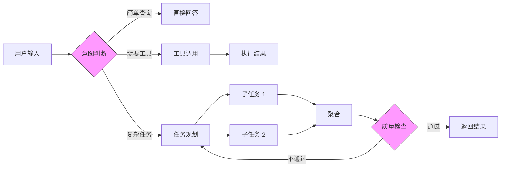
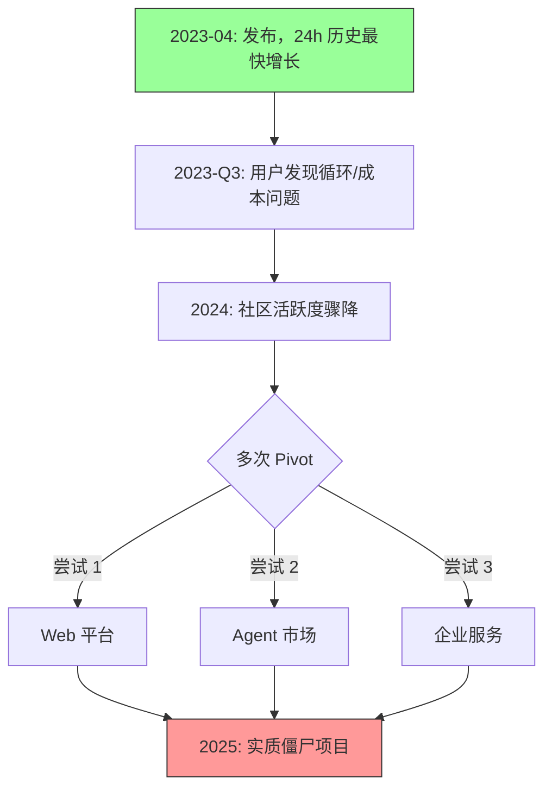
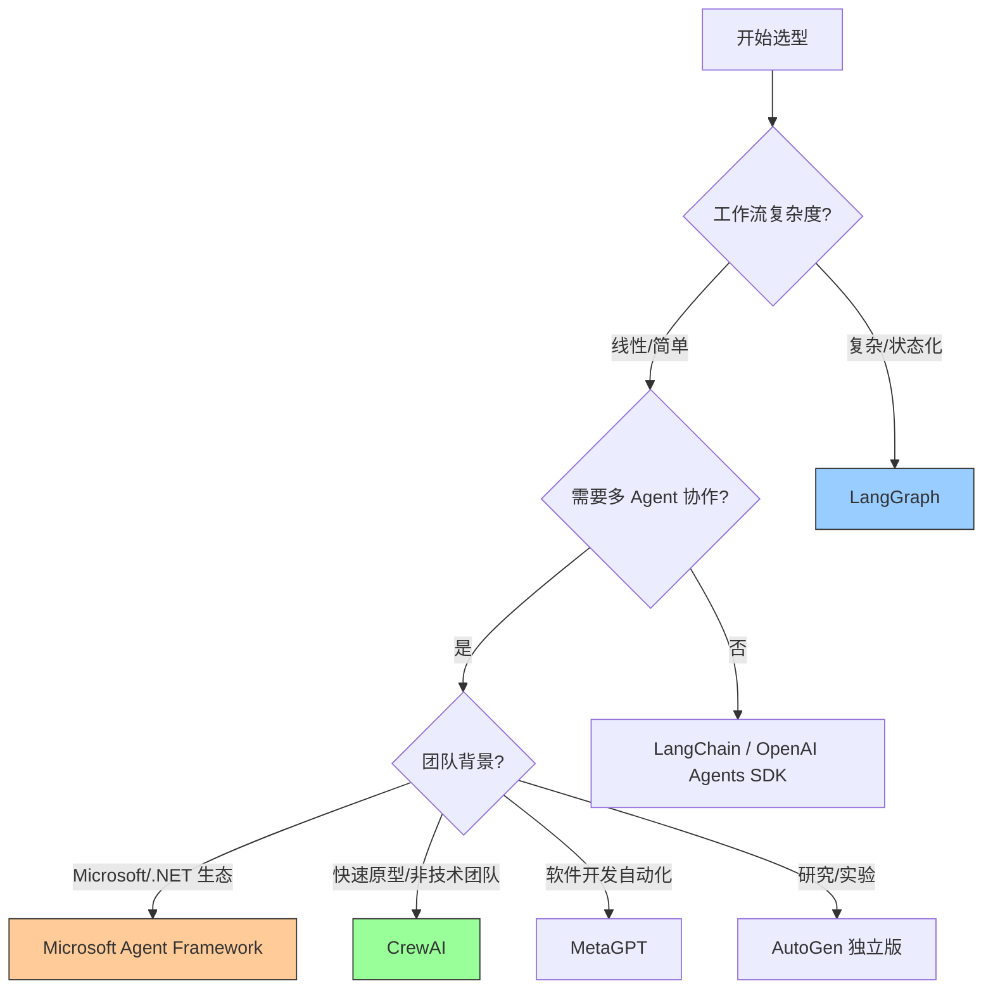

# Agent 框架生存法则：LangGraph 崛起与 AutoGPT 沉寂的背后

> **作者**: 探针团队
> **发布日期**: 2026-03-18
> **状态**: 已完成

---

## 1. Executive Summary

**LangGraph 在 2025 年爆发的根本原因是它解决了 Agent 开发中最核心的工程难题——状态管理与可控性**，而 AutoGPT 因 Prompt 驱动的架构天然缺乏工程化能力，导致 182k GitHub stars 背后是"僵尸项目"的残酷现实。

**Agent 框架市场在 2025 年完成了从"概念验证"到"生产就绪"的关键转变**，CB Insights 数据显示 170+ 初创公司涌入，开发者平台成为最拥挤的细分赛道。

**CrewAI、AutoGen、MetaGPT 三者形成了清晰的差异化定位**——角色分工、对话协作、软件流水线——但 AutoGen 已于 2025 年 10 月与 Semantic Kernel 合并为 Microsoft Agent Framework，独立品牌终结。

**框架选型的核心逻辑已从"谁最火"转向"谁最适合你的场景"**，2026 年的成熟市场要求开发者根据工作流复杂度、企业生态、团队能力三维度做决策。

**MCP（Model Context Protocol）和 A2A（Agent-to-Agent）标准化协议正在重塑整个生态**，框架之间的竞争将从"各自封闭"转向"互操作能力"。

---

## 2. LangGraph 崛起：从链到图的范式跃迁

### 2.1 LangChain 的困境与 LangGraph 的诞生

LangChain 在 2023 年一度是最热门的 LLM 应用开发框架，但随着开发者将原型推向生产，三个结构性问题暴露出来：

- **抽象过重**：层层封装导致调试困难，开发者"降级"到 raw LLM 调用
- **状态管理缺失**：Chain 是线性的、无状态的，无法处理循环、分支、回溯
- **包面积膨胀**：功能不断堆叠，维护负担指数增长

LangGraph 的诞生直接回应了这些问题。与 LangChain 的"链式"架构不同，LangGraph 采用**有向图（Directed Graph）**作为核心抽象——将 Agent 的每一步操作建模为图中的节点（Node），通过边（Edge）定义执行路径，支持条件分支、循环、并行执行。

LangGraph 的核心创新在于**显式状态管理**。与 LangChain 隐式传递数据不同，LangGraph 要求开发者定义明确的 State Schema，每个节点读取和修改全局状态，配合 Checkpoint 机制实现持久化——这使得 Agent 可以暂停、恢复、回溯，天然支持 Human-in-the-Loop 场景。

### 2.2 2025 年的密集迭代

LangGraph 在 2025 年的 Changelog 揭示了一条清晰的进化路径：

| 时间 | 更新 | 意义 |
|------|------|------|
| 2025-03 | LangGraph 0.3 + Pre-built Agents | 降低入门门槛：Supervisor、Swarm、LangMem 等预构建模式 |
| 2025-03 | MCP Adapters | 接入 Anthropic 的 Model Context Protocol 生态 |
| 2025-03 | LangGraph BigTool | 支持 Agent 访问大量工具而不丢失精度 |
| 2025-05 | Deferred Nodes | 延迟节点执行，优化资源利用 |
| 2025-08 | Dynamic Tool Calling | 运行时动态添加/移除工具 |
| 2025 | Streamable HTTP Transport | 通过 HTTP 连接远程 MCP 服务器 |

LangChain/LangGraph 1.0 里程碑标志着框架成熟——LangChain 聚焦核心 Agent 循环和中间件，LangGraph 成为底层持久化运行时。Klarna、Replit、Uber、LinkedIn 等企业客户验证了其生产可用性（详见参考文献 #4 和 #5）。

### 2.3 为什么是 LangGraph 而不是其他？

LangGraph 胜出的关键在于三个"刚好"：

1. **刚好底层**：不像 CrewAI 那样过度封装，保留开发者对工作流的完全控制
2. **刚好配套**：LangSmith（可观测性）+ LangGraph Studio（可视化）+ LangChain Academy（免费课程）形成完整生态
3. **刚好时机**：2024 年底 Agent 概念爆发，2025 年企业需要从 Demo 走向 Production，LangGraph 刚好填补了这个鸿沟

---

## 3. AutoGPT 沉寂：明星项目的系统性失败

### 3.1 数据画像：182k Stars 的僵尸项目

AutoGPT 在 2023 年 4 月发布后 24 小时内成为 GitHub 历史上增长最快的项目，但到 2025 年底，它已实质上成为一个"僵尸项目"——182k stars、无稳定云产品、pivot 3 次以上。

### 3.2 三大根因分析

**根因一：架构设计缺陷**

AutoGPT 本质上是一个**Prompt 驱动的自主 Agent 循环**——用户给出目标，Agent 自主规划步骤并执行。问题在于：

- Prompt 生成的计划过于复杂，步骤冗余（Taivo Pungas 分析指出"像 GPT-2 级别的 McKinsey 顾问"）
- 缺乏显式状态管理，Agent 在长任务中"忘记"上下文
- 每步都调用 GPT-4 API，成本极高（单个任务可能消耗 $10-50）

**根因二：工程化能力为零**

与 LangGraph 的 Checkpoint、HITL、流式输出等生产级特性对比：

| 能力 | LangGraph | AutoGPT |
|------|-----------|---------|
| 状态持久化 | ✅ Checkpoint 机制 | ❌ 纯内存 |
| 中断/恢复 | ✅ Interrupt + Resume | ❌ 重新开始 |
| 人工干预 | ✅ Human-in-the-Loop | ❌ 完全自主（或完全停止） |
| 可观测性 | ✅ LangSmith 集成 | ❌ 日志输出 |
| 可复用工作流 | ✅ 图可序列化/版本化 | ❌ 每次从零开始 |

**根因三：产品定位模糊**

AutoGPT 试图成为一个"通用自主 AI"——什么都能做，但什么都做不好。用户在 r/AutoGPT 中的典型反馈是："它要么陷入循环，要么在失败中崩溃。"

相比之下，LangGraph 明确定位为**开发者工具**（不是终端用户产品），CrewAI 定位为**角色协作框架**——都有清晰的价值主张和目标用户。

---

## 4. 竞争格局：CrewAI、AutoGen、MetaGPT 的差异化定位

### 4.1 框架定位矩阵

| 框架 | 核心抽象 | 最佳场景 | 独特价值 |
|------|---------|---------|---------|
| **LangGraph** | 有向图 + 显式状态 | 复杂工作流、需要完全控制 | Checkpoint/HITL/企业级 |
| **CrewAI** | 角色 + 任务 + 团队 | 多角色协作、快速搭建 | 低门槛、可视化编辑器 |
| **AutoGen** | 对话式多 Agent | 对话驱动的应用 | 微软生态整合 |
| **MetaGPT** | SOP 流水线 | 软件开发自动化 | 模拟软件公司流程 |
| **OpenAI Agents SDK** | GPT 原生 Agent | OpenAI 生态内开发 | 原生 MCP、增长最快 |

### 4.2 CrewAI：最"人话"的框架

CrewAI 的心智模型是**组建团队**——给每个 Agent 分配角色（如研究员、写手、审稿人），定义任务，然后让"Crew"协作完成。四大核心组件：

- **Agents**：有角色、目标、背景故事的 AI 角色
- **Tasks**：具体任务定义，附带期望输出
- **Tools**：Agent 可调用的工具（内置大量预置工具）
- **Crew**：编排层，决定任务执行顺序（顺序/层级/共识）

CrewAI 的企业级产品线（AMP Cloud）支持私有部署，10 万认证开发者。CrewAI 的 "2026 State of Agentic AI Survey" 调查（500 名大型企业高管）显示 65% 组织已使用 Agent，但仅自动化 31% 工作流——CrewAI 瞄准的正是这个"从 31% 到 100%"的增量市场。

### 4.3 AutoGen：从实验到整合

AutoGen 经历了两个阶段：

- **v0.2（2023-2024）**：实验性多 Agent 框架，对话驱动，研究导向
- **v0.4（2025）**：完全重写——异步消息驱动、事件驱动架构、OpenTelemetry 可观测性

但 AutoGen 最大的变化是**身份转变**。2025 年 10 月，微软宣布 AutoGen 与 Semantic Kernel 合并为 **Microsoft Agent Framework**，终结了 AutoGen 作为独立框架的品牌。

这意味着 AutoGen 从"学术开源项目"变成了"微软企业 AI 战略的一部分"——优势是微软生态支持（Azure、.NET），劣势是失去了独立开源社区的灵活性。

### 4.4 MetaGPT：软件公司的 AI 模拟

MetaGPT 的独特之处在于**将人类软件开发流程（SOP）编码为 Prompt 序列**。输入一行需求，系统自动模拟产品经理、架构师、项目经理、工程师、QA 工程师的协作流程。

MetaGPT 于 ICLR 2024 获得 Oral 展示，后演化为 Atoms（产品化平台），MGX 在 Product Hunt 获得日榜/周榜第一。但 MetaGPT 的开源框架生态相对较弱——它的价值更多体现在概念验证和学术研究，而非生产级工程。

---

## 5. 框架选型决策树

### 5.1 决策框架

选择 Agent 框架应基于三个维度：

### 5.2 场景速查表

| 你的需求 | 推荐框架 | 理由 |
|---------|---------|------|
| 企业级复杂工作流 | **LangGraph** | 显式状态、HITL、可观测性、Checkpoint |
| 快速搭建 AI 团队 | **CrewAI** | 角色定义直观、低门槛、可视化 |
| 微软/Azure 生态 | **Microsoft Agent Framework** | 原生集成、企业合规 |
| 软件开发自动化 | **MetaGPT** | SOP 驱动、全流程模拟 |
| 对话式多 Agent | **AutoGen** (独立版) | 对话协作、研究级灵活 |
| GPT 生态内快速开发 | **OpenAI Agents SDK** | 原生 MCP、增长最快 |
| RAG/数据检索为主 | **LlamaIndex** | 索引和检索专精 |

### 5.3 关键决策因子

1. **状态管理需求**：需要暂停/恢复/回溯？→ LangGraph
2. **团队技术栈**：.NET/C# 为主的微软团队？→ Microsoft Agent Framework
3. **上线速度**：需要 2 小时出 Demo？→ CrewAI
4. **可控性要求**：需要对每一步执行路径完全控制？→ LangGraph
5. **成本敏感**：每个 Token 都要精打细算？→ 避免 AutoGPT 式完全自主循环

---

## 6. 未来趋势：2026 及以后

### 6.1 标准化协议之战

2025-2026 年 Agent 框架生态最重要的变化是**标准化协议的崛起**：

- **MCP（Model Context Protocol）**：Anthropic 发起，定义 Agent-工具通信标准。截至 2026 年初，[GitHub 官方仓库](https://github.com/modelcontextprotocol/servers) 记录已有 500+ MCP 服务器
- **A2A（Agent-to-Agent Protocol）**：Google 发起，定义 Agent 间通信标准。CrewAI、LangGraph、Microsoft Agent Framework 已支持

这意味着未来的竞争不再是谁的 API 更好用，而是**谁的互操作性更强**。率先支持 MCP + A2A 双协议的框架将获得生态优势。

### 6.2 从"Agent 框架"到"Agent 基础设施"

CB Insights 的 2025 年市场地图显示，Agent 市场正在进入**基建期**。竞争焦点从"如何构建 Agent"转向：

- **部署和运维**：Agent 的 CI/CD、监控、版本管理
- **安全和合规**：Agent 行为审计、权限控制、数据隔离
- **经济模型**：按执行次数计费（LangSmith $0.05/run）正在成为标准

### 6.3 三大预测

1. **框架整合加速**：微软已合并 AutoGen + Semantic Kernel，预计更多框架会被整合进大平台，独立框架空间缩小
2. **"Deep Agents"兴起**：能规划、使用子 Agent、操作文件系统的复杂 Agent（LangGraph 已推出 Deep Agents 功能）将取代简单的单步 Agent
3. **MCP 成为事实标准**：不支持 MCP 的框架将被边缘化，OpenAI Agents SDK 和 Google ADK 的先行优势明显

---

## 参考来源

1. **Reddit r/SideProject** — "AutoGPT has 182k GitHub stars and is basically a zombie" (2026-01)
   https://www.reddit.com/r/SideProject/comments/1rgkg35/free_analysis_autogpt_has_182k_github_stars_and/

2. **AutoGPT.net** — "Understanding its Constraints and Limitations" (2024)
   https://autogpt.net/auto-gpt-understanding-its-constraints-and-limitations/

3. **Taivo Pungas** — "Why AutoGPT fails and how to fix it" (2024)
   https://www.taivo.ai/__why-autogpt-fails-and-how-to-fix-it/

4. **LangChain Blog** — "LangGraph 0.3 Release: Prebuilt Agents" (2025-03)
   https://blog.langchain.com/langgraph-0-3-release-prebuilt-agents/

5. **LangChain Blog** — "LangChain and LangGraph Agent Frameworks Reach v1.0 Milestones" (2025)
   https://blog.langchain.com/langchain-langgraph-1dot0/

6. **TrueFoundry** — "LangChain vs LangGraph: Which is Best For You?" (2025)
   https://www.truefoundry.com/blog/langchain-vs-langgraph

7. **Towards AI** — "Human-in-the-Loop (HITL) with LangGraph" (2025)
   https://pub.towardsai.net/human-in-the-loop-hitl-with-langgraph-a-practical-guide-to-interactive-agentic-workflows-1c8e9b5cc827

8. **LangChain Changelog** — "August 2025" (2025-08)
   https://changelog.langchain.com/?categories=cat_5UBL6DD8PcXXL&date=2025-08-01

9. **CrewAI** — "2026 State of Agentic AI Survey Report"（2026 年发布，调研 500 名大型企业高管）
   https://crewai.com/ai-agent-survey

10. **DigitalOcean** — "CrewAI: A Practical Guide to Role-Based Agent Orchestration" (2025)
    https://www.digitalocean.com/community/tutorials/crewai-crash-course-role-based-agent-orchestration

11. **Microsoft AutoGen GitHub** — "AutoGen Update #7066" (2025-10)
    https://github.com/microsoft/autogen/discussions/7066

12. **Microsoft Research** — "AutoGen" (2025)
    https://www.microsoft.com/en-us/research/project/autogen/

13. **IBM** — "What is MetaGPT?" (2024)
    https://www.ibm.com/think/topics/metagpt

14. **Atoms.dev** — "From MetaGPT to MGX and now — Atoms" (2025)
    https://atoms.dev/metagpt

15. **CB Insights** — "The AI agent market map: March 2025 edition" (2025-03)
    https://www.cbinsights.com/research/ai-agent-market-map/

16. **Latenode** — "LangGraph vs AutoGen vs CrewAI: Complete AI Agent Framework Comparison" (2025)
    https://latenode.com/blog/platform-comparisons-alternatives/automation-platform-comparisons/langgraph-vs-autogen-vs-crewai-complete-ai-agent-framework-comparison-architecture-analysis-2025

17. **Airbyte** — "Best AI Agent Frameworks for 2026" (2026)
    https://airbyte.com/agentic-data/best-ai-agent-frameworks-2026

18. **LangChain AI** — "langchain-ai/langgraph" (2025)
    https://github.com/langchain-ai/langgraph

19. **Hieu Tran Trung** — "The AI Agent Framework Landscape in 2025" (2025)
    https://medium.com/@hieutrantrung.it/the-ai-agent-framework-landscape-in-2025-what-changed-and-what-matters-3cd9b07ef2c3

20. **Milvus** — "LangChain vs LangGraph" (2025)
    https://milvus.io/blog/langchain-vs-langgraph.md

---
*本报告基于 2024-2026 年公开资料编写，引用均附真实 URL。*
