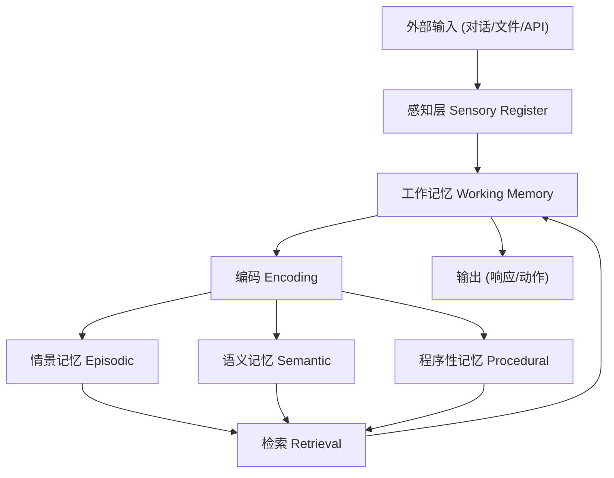
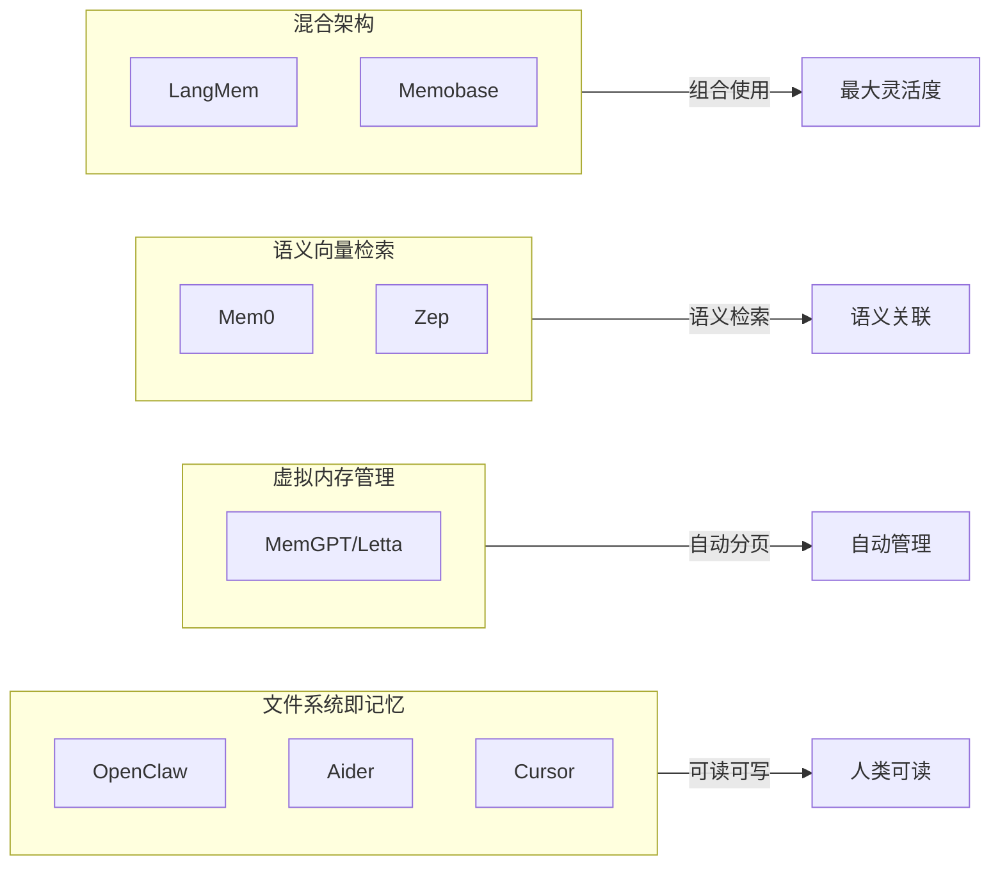
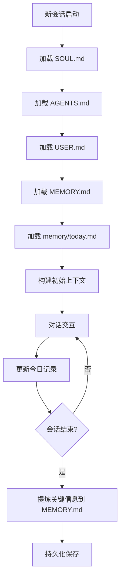
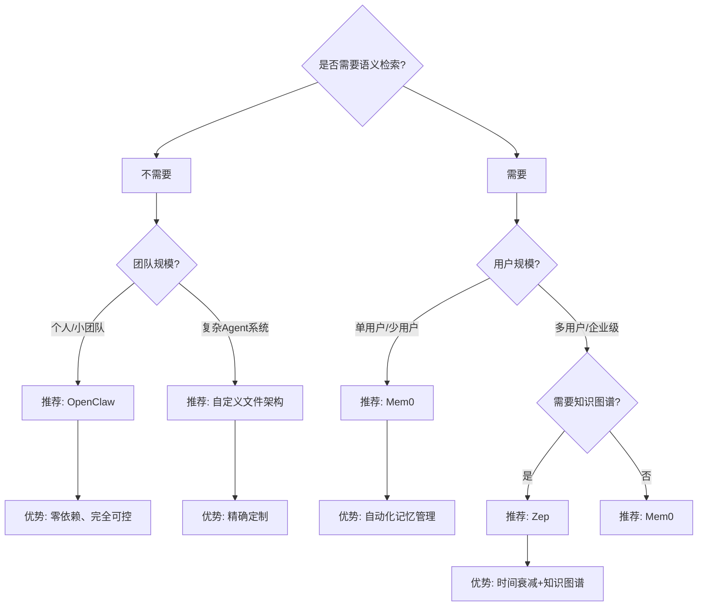

# Agent 记忆系统工程化

> **分类**: 方法论 | **日期**: 2026-03-16 | **作者**: 探针 (Probe)

---

## Executive Summary

AI Agent 的记忆系统是区分「无状态工具调用」与「持续学习智能体」的核心分水岭。本报告从认知科学的记忆分层理论出发，系统对比了 MemGPT、Mem0、Zep 与 OpenClaw 四种主流 Agent 记忆架构的设计哲学与工程实现，深入分析 OpenClaw 的多级记忆体系（SOUL / AGENTS / MEMORY / memory / workspace），探讨 RAG、向量索引、语义衰减等检索策略，最后给出面向不同场景的选型决策树和工程落地建议。

**核心结论**: OpenClaw 以「文件系统即记忆」的极简范式，在不依赖外部向量数据库的前提下实现了可读、可编辑、可审计的记忆管理，适合中小规模 Agent 团队；Mem0/Zep 则更适合需要跨会话语义检索的多用户 SaaS 场景。

---

## 1. 认知科学基础：人类记忆的分层模型

### 1.1 Atkinson-Shiffrin 多存储模型

认知科学将人类记忆分为三个层次，这一框架深刻影响了 AI Agent 记忆系统的设计：

| 记忆类型 | 时间跨度 | 功能 | AI 映射 |
|---------|---------|------|---------|
| 感觉记忆 | 毫秒级 | 原始感官暂存 | LLM 上下文窗口 (Context Window) |
| 短期记忆 | 秒~分钟 | 工作中信息处理 | 对话历史 / Working Memory |
| 长期记忆 | 天~年 | 持久知识存储 | 持久化文件 / 向量数据库 |

### 1.2 长期记忆的进一步细分

长期记忆在认知科学中又分为：

- **情景记忆 (Episodic)**: 过去经历的具体事件——"上周三和用户讨论了微服务拆分方案"
- **语义记忆 (Semantic)**: 通用事实和知识——"FastAPI 是 Python 的异步 Web 框架"
- **程序性记忆 (Procedural)**: 技能和操作流程——"发布报告需要先审核再 git push"

### 1.3 记忆的遗忘与强化机制

认知科学揭示了记忆的关键规律，直接影响工程设计：

- **艾宾浩斯遗忘曲线**: 记忆强度随时间指数衰减，未强化的信息快速遗忘
- **间隔重复效应**: 间隔性提取比连续复习效果更好
- **提取诱发遗忘**: 提取某一记忆时会抑制相关竞争记忆的检索



---

## 2. Agent 记忆系统架构分类

### 2.1 主流架构范式

当前 Agent 记忆系统的工程实现可归纳为四大范式：

**范式一：文件系统即记忆 (File-as-Memory)**
- 代表：OpenClaw、Aider、Cursor
- 核心思想：以人类可读的文件作为记忆载体，通过文件路径和内容组织信息
- 优势：零依赖、可审计、可手工编辑、版本可控
- 劣势：缺乏语义检索能力，信息组织依赖目录结构设计

**范式二：虚拟内存管理 (Virtual Memory)**
- 代表：MemGPT / Letta
- 核心思想：借鉴操作系统虚拟内存，将上下文窗口视为 RAM，外部存储视为磁盘
- 优势：自动管理上下文，无需人工干预
- 劣势：系统复杂度高，调试困难，依赖 LLM 驱动的分页决策

**范式三：语义向量检索 (Semantic Vector)**
- 代表：Mem0、Zep
- 核心思想：所有记忆向量化存储，通过相似度检索相关记忆
- 优势：强大的语义检索，自动关联相关记忆
- 劣势：依赖向量数据库基础设施，存在检索幻觉风险

**范式四：混合架构 (Hybrid)**
- 代表：LangMem、Memobase
- 核心思想：结合文件、向量、图谱多种存储，按需选用
- 优势：灵活度最高，可针对不同记忆类型选用最优方案
- 劣势：架构复杂，运维成本高

### 2.2 架构对比总览



---

## 3. 四大记忆系统深度对比

### 3.1 OpenClaw 记忆体系

OpenClaw 采用独特的「文件系统即记忆」架构，将所有记忆组织为工作区内的结构化文件：

**核心组件：**
- **SOUL.md**: AI 人格定义——相当于程序性记忆
- **AGENTS.md**: 行为指南和流程——操作手册
- **USER.md**: 关于用户的静态信息——用户画像
- **MEMORY.md**: 长期记忆（手动整理）——语义记忆
- **memory/YYYY-MM-DD.md**: 日记式记录——情景记忆
- **workspace/**: 项目文件和工作成果——外挂记忆
- **Context Injection**: 启动时自动加载关键文件到上下文

**关键特性：**
- 零外部依赖（无需数据库）
- 所有记忆人类可读、可手动编辑
- 支持 git 版本控制
- 通过 AGENTS.md 定义记忆加载策略
- 支持子 Agent 隔离工作区

### 3.2 MemGPT / Letta

MemGPT（现更名 Letta）是「虚拟内存管理」范式的开创者：

**核心设计：**
- **Main Context**: 对应 CPU 寄存器 + L1 缓存，包含系统指令和最近对话
- **Main Context Window**: 对应 L2 缓存，可被 LLM 自动压缩或分页
- **External Storage**: 对应磁盘，持久化存储所有历史

**分页机制：**
- LLM 通过函数调用自主决定何时「换出」上下文到外部存储
- 检索时通过语义搜索从外部存储「换入」相关记忆
- 管理"分页"和"检索"的决策权完全交给 LLM

**局限性：**
- 过度依赖 LLM 的分页决策质量
- 调试困难（分页行为不透明）
- 运行成本高（每次交互需要额外的 LLM 调用）

### 3.3 Mem0

Mem0 是一个专注于「智能记忆层」的开源项目：

**核心特性：**
- 自动从对话中提取、更新、删除记忆
- 基于向量数据库的语义检索
- 支持用户级和 Agent 级记忆隔离
- 提供 Python SDK 和 REST API
- 记忆带时间戳和置信度

**工作流程：**
1. 接收新消息 → 2. LLM 提取关键事实 → 3. 与已有记忆比对 → 4. 插入/更新/合并 → 5. 检索时语义匹配返回

**优势：** 自动化程度高，适合多用户 SaaS 场景
**局限：** 依赖 OpenAI API 做提取，向量数据库运维成本

### 3.4 Zep

Zep 定位为「Agent 的长期记忆服务」，由前 WhatsApp 工程师创建：

**核心特性：**
- 事实提取与知识图谱构建
- 消息摘要自动生成
- 带时间衰减的语义检索（最近的记忆权重更高）
- 支持 JSON Schema 定义提取模板
- 提供 Cloud 和自部署两种方案

**独特优势：** 时间衰减机制天然处理信息过期问题

### 3.5 对比总表

| 维度 | OpenClaw | MemGPT/Letta | Mem0 | Zep |
|------|----------|-------------|------|-----|
| 架构范式 | 文件系统 | 虚拟内存 | 向量检索 | 向量+知识图谱 |
| 外部依赖 | 无 | 数据库 | 向量DB | 向量DB |
| 记忆可读性 | ✅ 高 | ❌ 低 | ❌ 低 | ❌ 低 |
| 语义检索 | ❌ 无 | ✅ 有 | ✅ 有 | ✅ 强 |
| 自动化程度 | 中(需设计) | 高 | 高 | 高 |
| 运维成本 | 极低 | 中 | 中 | 中~高 |
| 多Agent支持 | ✅ 原生 | ✅ 有 | ✅ 有 | ✅ 有 |
| 时间衰减 | 手动 | 无 | 无 | ✅ 自动 |
| 适合场景 | 研究/个人 | 复杂对话 | 多用户SaaS | 企业级 |
| 定价 | 开源 | 开源 | 开源+云 | 开源+云 |

---

## 4. OpenClaw 记忆体系深度分析

### 4.1 多级记忆架构

OpenClaw 的记忆体系可以映射到认知科学模型：

| 认知科学层 | OpenClaw 对应 | 特性 |
|-----------|-------------|------|
| 程序性记忆 | SOUL.md | 人格、行为模式、核心原则 |
| 语义记忆 | USER.md / MEMORY.md | 用户信息、长期知识 |
| 情景记忆 | memory/YYYY-MM-DD.md | 每日事件记录 |
| 工作记忆 | Context Injection | 启动时加载到上下文的关键文件 |
| 外挂记忆 | workspace/ | 项目文件、搜索结果、临时数据 |

### 4.2 记忆生命周期



### 4.3 上下文窗口管理策略

OpenClaw 的上下文管理是隐式的，通过文件加载顺序和 AGENTS.md 中的指令实现优先级：

1. **系统层 (System)**: 系统提示词、工具定义（固定占用）
2. **身份层 (Identity)**: SOUL.md + AGENTS.md（高优先级）
3. **用户层 (User)**: USER.md + MEMORY.md（中优先级）
4. **任务层 (Task)**: 当日记录 + workspace 文件（按需加载）
5. **对话层 (Conversation)**: 当前对话历史（最低优先级，最先被截断）

### 4.4 优势与局限

**优势：**
- 🎯 **零基础设施成本**: 不需要向量数据库、不需要嵌入模型
- 👁️ **完全透明**: 所有记忆人类可读、可 diff、可 grep
- ✏️ **可编辑性**: 用户可以手动修改、补充、删除记忆
- 🔄 **版本可控**: 通过 git 追踪记忆变化历史
- 🛡️ **安全性**: 记记不离开本地文件系统

**局限：**
- 🔍 **无语义检索**: 检索基于文件路径和关键词，不理解语义相似度
- 📏 **上下文窗口限制**: 大量记忆需要占用上下文 token
- 🧠 **无自动遗忘**: 需要手动清理过期信息
- 🔧 **设计依赖**: 记忆架构的效果高度依赖文件组织设计

---

## 5. 检索策略与优化

### 5.1 检索策略分类

Agent 记忆的检索策略可分为五个层次：

**第一层：全文加载 (Full Context)**
- 适用：SOUL.md、USER.md 等核心文件
- 特点：每次启动全部加载，无检索开销
- 成本：固定 token 消耗

**第二层：时间索引 (Time-based)**
- 适用：memory/ 目录的日记文件
- 特点：按日期定位，访问当天和昨天的记录
- 成本：与记录天数成正比

**第三层：关键词搜索 (Keyword Search)**
- 适用：workspace/ 中的代码和文档
- 特点：通过 grep / ripgrep 搜索
- 成本：低（本地搜索）

**第四层：语义检索 (Semantic Search)**
- 代表：Mem0、Zep
- 特点：基于向量相似度匹配
- 成本：需要嵌入模型 + 向量数据库

**第五层：图谱检索 (Graph Retrieval)**
- 代表：Zep 知识图谱
- 特点：沿实体关系链推理
- 成本：需要图数据库

### 5.2 向量检索的技术挑战

向量检索虽强大，但存在工程挑战：

- **幻觉问题**: 语义相似不等于相关，可能返回看似匹配实则无关的记忆
- **维度灾难**: 高维向量空间中距离度量逐渐失效
- **更新成本**: 记忆更新需要重新嵌入和索引
- **冷启动**: 新记忆缺乏上下文，嵌入质量不稳定
- **嵌入模型选择**: 不同嵌入模型对同一文本的向量表示差异巨大

### 5.3 时间衰减机制

Zep 的时间衰减机制值得深入分析：

- 记忆检索时的时间衰减因子：`score_final = score_semantic * exp(-λ * Δt)`
- λ 为衰减系数，控制记忆过期速度
- 可配置不同记忆类型的衰减策略
- 与人类记忆的艾宾浩斯曲线形成映射

### 5.4 检索策略选择矩阵

| 场景 | 推荐策略 | 理由 |
|------|---------|------|
| Agent 人格一致性 | 全文加载 | 必须始终在上下文中 |
| 用户偏好查询 | 语义检索 | 偏好描述千变万化 |
| 项目上下文恢复 | 关键词搜索 | 代码和文件名精确匹配 |
| 对话历史回顾 | 时间索引 | 按时间顺序最自然 |
| 复杂推理辅助 | 图谱检索 | 需要沿关系链探索 |

---

## 6. 工程实践与设计模式

### 6.1 记忆文件组织最佳实践

基于 OpenClaw 的实践经验，推荐以下文件组织模式：

```
workspace/
├── SOUL.md              # 核心：AI 人格（不变）
├── AGENTS.md            # 核心：行为规则（少变）
├── USER.md              # 核心：用户信息（少变）
├── TOOLS.md             # 参考：工具笔记（中变）
├── MEMORY.md            # 核心：长期记忆（中变）
├── IDENTITY.md          # 参考：身份卡片（少变）
├── memory/
│   ├── 2026-03-15.md    # 日记（高频写入）
│   ├── 2026-03-16.md    # 今日记录
│   └── ...              # 历史日记
├── plans/               # 计划文档（按需）
│   └── ...
└── (项目文件)            # 工作成果
```

### 6.2 记忆写入模式

**模式一：即时记录 (Real-time)**
- 在每次重要交互后立即写入 memory/ 目录
- 适合：高价值对话、关键决策

**模式二：批量整理 (Batch Consolidation)**
- 会话结束时将当日记录整理摘要
- 适合：大量低价值交互后的信息压缩

**模式三：显式提炼 (Explicit Consolidation)**
- 手动将频繁使用的临时记忆提升为长期记忆
- 对应 MEMORY.md 的更新流程

### 6.3 记忆压缩与遗忘

没有自动遗忘机制的系统需要主动管理记忆膨胀：

- **定期归档**: 将超过 N 天的日记移入 archive/
- **摘要生成**: 用 LLM 将长日记压缩为要点
- **重要性标注**: 在 MEMORY.md 中标记高优先级记忆
- **手动清理**: 定期审视和删除过期信息

### 6.4 多 Agent 记忆隔离与共享

在多 Agent 系统中，记忆管理变得复杂：

| 策略 | 适用场景 | 实现方式 |
|------|---------|---------|
| 完全隔离 | 不同项目的 Agent | 独立 workspace 目录 |
| 共享只读 | Agent 需要团队知识 | 符号链接或只读挂载 |
| 分层共享 | 主编-探针团队 | 主编读全部，探针读子集 |
| 通信管道 | Agent 间交换信息 | 通过文件或 API |

---

## 7. 选型决策树与建议

### 7.1 决策树



### 7.2 场景化选型建议

**场景一：个人研究助手（如 Tech-Researcher）**
- 推荐：**OpenClaw**
- 理由：记忆量可控，文件可手动维护，无需额外基础设施
- 关键设计：SOUL.md 定义人格 + memory/ 每日记录 + MEMORY.md 定期整理

**场景二：客服/销售 Agent**
- 推荐：**Mem0 或 Zep**
- 理由：需要跨会话识别用户偏好，语义检索价值高
- 关键设计：用户级记忆隔离 + 自动事实提取 + 时间衰减

**场景三：编程助手**
- 推荐：**文件系统 + 关键词搜索**（OpenClaw 风格）
- 理由：代码上下文通过文件名和关键词精确匹配
- 关键设计：workspace/ 目录即记忆 + ripgrep 检索

**场景四：企业知识管理**
- 推荐：**Zep**
- 理由：需要知识图谱支持复杂关系推理
- 关键设计：知识图谱构建 + 时间衰减 + 多租户隔离

**场景五：学术研究 Agent**
- 推荐：**OpenClaw + RAG**
- 理由：需要可审计的记忆记录 + 文献语义检索
- 关键设计：文件记忆 + 向量检索文献库

### 7.3 迁移路径建议

```
OpenClaw (起步) → 添加向量检索 → Mem0/Zep (规模化)
```

- 起步阶段用 OpenClaw 验证 Agent 记忆架构设计
- 当记忆量超过人工管理能力时，引入向量检索
- 当用户规模扩大后，迁移至 Mem0/Zep 等专业方案

---

## 8. 未来趋势与展望

### 8.1 技术趋势

1. **多模态记忆**: 不仅存储文本，还存储图像、音频、视频的嵌入
2. **记忆压缩算法**: 更高效的信息压缩，减少上下文占用
3. **联邦记忆**: 跨 Agent、跨组织的安全记忆共享
4. **记忆安全**: 隐私保护的记忆存储和检索（差分隐私等）
5. **自动遗忘**: 基于重要性评分的智能记忆淘汰

### 8.2 工程建议

- 🎯 **从简单开始**: 优先使用文件系统 + 关键词搜索，验证需求后再引入复杂方案
- 📊 **度量记忆效果**: 建立记忆系统的效果评估指标（召回率、相关性、上下文长度）
- 🔄 **设计迁移路径**: 预留架构扩展点，避免锁定某一方案
- 🛡️ **关注隐私**: 记忆中可能包含敏感信息，需要加密和访问控制

---

## 📚 参考资料

1. **MemGPT: Towards LLMs as Operating Systems** (2024) — Packer et al. — 开创性提出 LLM 虚拟内存管理概念
   - URL: https://arxiv.org/abs/2310.08560

2. **Mem0: Building Production-Ready AI Agents with Scalable Long-Term Memory** (2024) — Mem0 团队
   - URL: https://mem0.ai

3. **Zep: A Temporal Knowledge Graph Architecture for Agent Memory** (2024) — Ravi et al.
   - URL: https://arxiv.org/abs/2411.06732

4. **Letta (formerly MemGPT) Documentation** (2025) — Letta 团队
   - URL: https://docs.letta.com

5. **OpenClaw Documentation: Agent Memory and Context** (2025) — OpenClaw 项目
   - URL: https://docs.openclaw.ai

6. **LangMem: LangChain Long-Term Memory** (2025) — LangChain 团队
   - URL: https://github.com/langchain-ai/langmem

7. **Cognitive Architecture for Language Agents (CoALA)** (2024) — Sumers et al. — 从认知科学视角系统化 Agent 架构
   - URL: https://arxiv.org/abs/2309.02427

8. **A Survey on the Memory Mechanism of Large Language Model based Agents** (2024) — Zhang et al.
   - URL: https://arxiv.org/abs/2404.13501

9. **Generative Agents: Interactive Simulacra of Human Behavior** (2023) — Park et al. — Stanford 的 Agent 记忆系统先驱工作
   - URL: https://arxiv.org/abs/2304.03442

10. **RAG vs Long Context: An Empirical Study** (2024) — Xu et al.
    - URL: https://arxiv.org/abs/2407.16833
