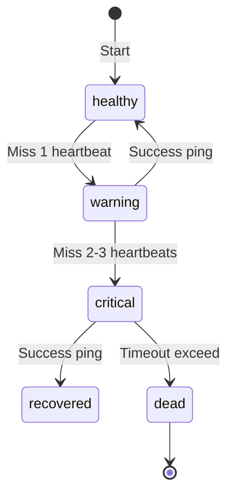
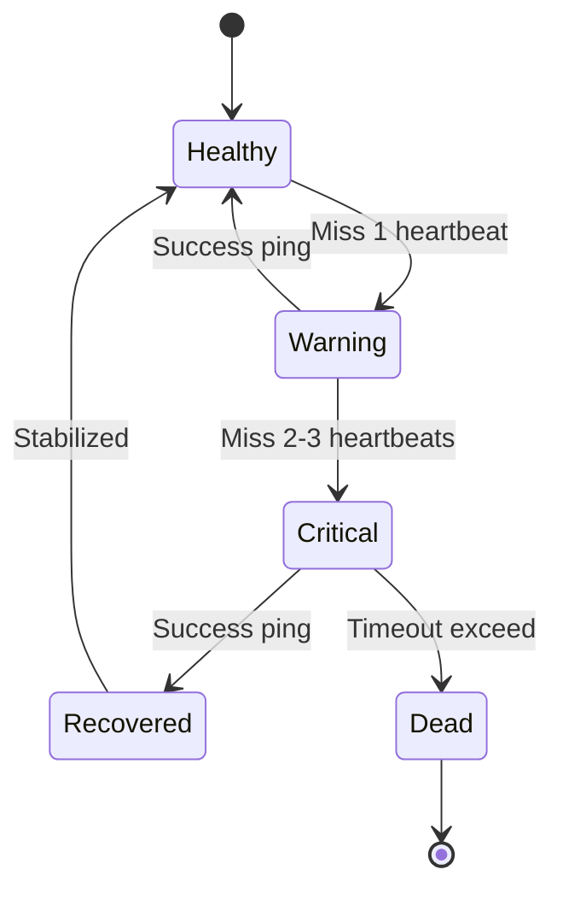
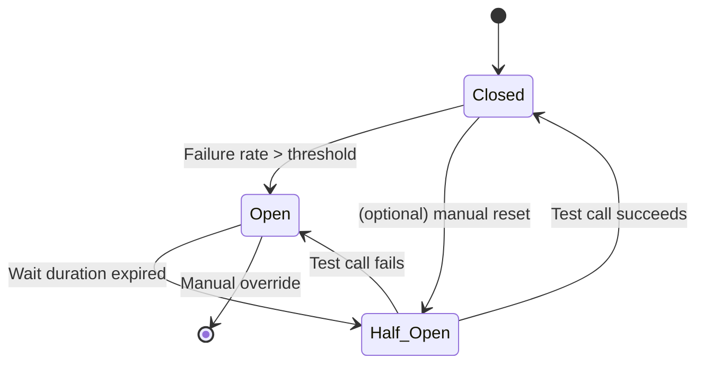
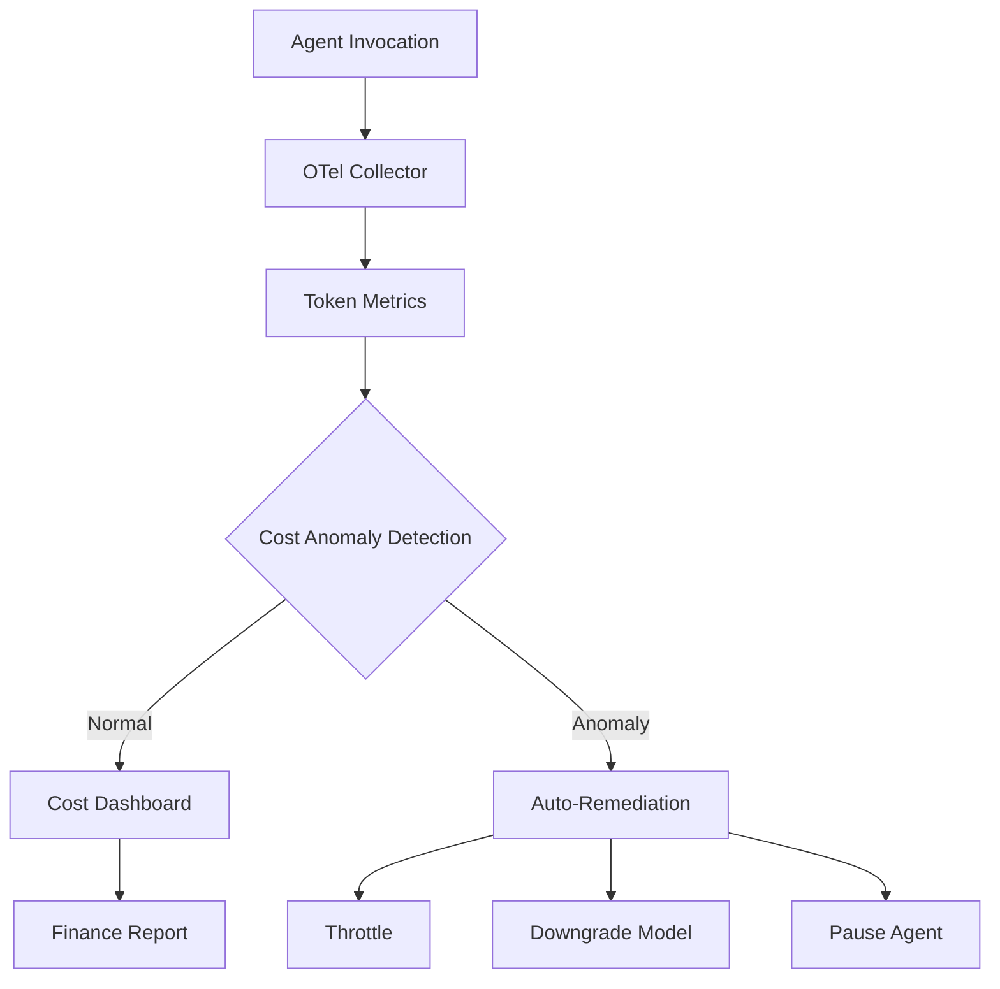
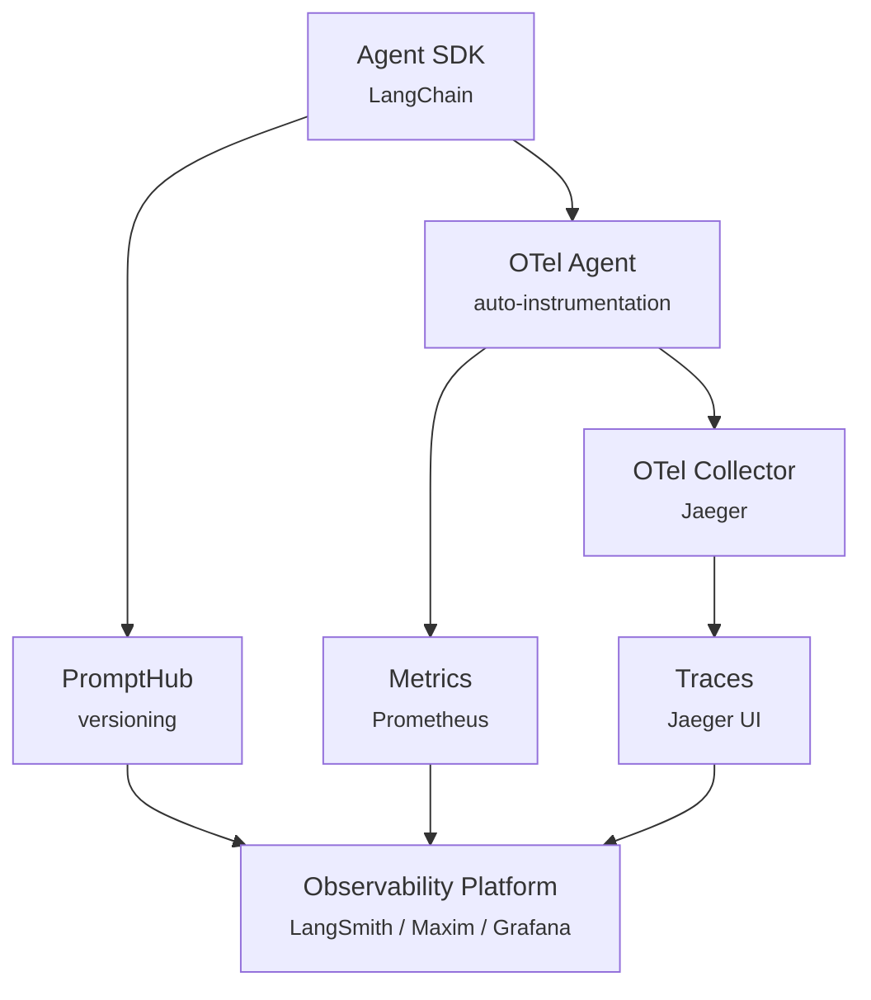

# Agent 运维从 0 到 1：Heartbeat、异常恢复与可观测性实践

## Executive Summary

随着 AI Agent 在生产环境的广泛应用，如何保障其可靠性、可观测性和成本可控性已成为 2024-2025 年的核心挑战。本文系统性梳理了 Agent 运维的核心支柱：Heartbeat 健康检查、异常恢复机制、可观测性体系建设以及成本监控治理，并提供可落地的实践指南。

**核心发现**：

- **Heartbeat 设计**：合理的探测间隔（通常 30s-5min）和多层次失败判定策略是发现 Agent 异常的第一道防线
- **异常恢复**：熔断器（Circuit Breaker）配合重试（Retry）和降级（Fallback）能显著提升系统韧性，Resilience4j 和 Polly 是 2025 年主流实现
- **可观测性**：基于 SLO 的燃烧率告警（Burn Rate Alerting）让团队能在错误预算耗尽前主动干预，Splunk、Datadog、Google Cloud 等平台已成熟支持[4][5]
- **成本监控**：Token 级追踪和异常检测可控制 AI 成本，CloudZero、Instana 等平台提供 Agent 专用监控[19]

本文提供完整的 Mermaid 图表集（使用稳定语法）和工具选型矩阵，可作为 Agent 生产化落地的直接参考。

---

## 1. Heartbeat 设计：从检查到自愈

### 1.1 Heartbeat 的核心作用

在分布式 Agent 系统中，Heartbeat 是判断 Agent 存活状态的基石机制。Agent 定期向监控中心发送"我还活着"信号，超时未响应即判定为故障。

**关键设计要素**：

1. **探测间隔（Interval）**：根据业务容忍度设置，通常 30 秒至 5 分钟。过短增加负载，过长延长故障发现时间
2. **探测方式**：HTTP ping、TCP socket、自定义心跳消息等。自描述协议（如 `/health` 端点）最为通用
3. **失败判定**：连续失败 N 次（通常 2-3 次）才标记为 Down，避免网络抖动误判

### 1.2 Agentic Heartbeat 模式

传统的固定间隔心跳在动态 Agent 环境中存在局限。2024 年提出的 **Agentic Heartbeat Pattern** 允许 Agent 根据当前负载和任务复杂度动态调整心跳频率：

- **空闲期**：延长间隔（如 5min），减少监控开销
- **任务执行期**：缩短间隔（如 30s），快速暴露卡死问题
- **故障恢复期**：高频心跳（如 10s）验证恢复状态

### 1.3 状态机设计

以下使用 `stateDiagram`（稳定语法，非 `stateDiagram`）描述 Agent Heartbeat 状态流转：



**修正为稳定语法**：



状态说明：
- **Healthy**：Agent 正常运行，心跳正常
- **Warning**：错过 1 次心跳，开始记录但暂不告警
- **Critical**：连续错过，触发告警并准备恢复流程
- **Recovered**：心跳恢复，进入稳定期
- **Dead**：超时未恢复，判定为永久故障，触发替换或重启

### 1.4 分布式 Heartbeat 挑战

在多 Agent 架构中，Heartbeat 配置需注意：

- **时钟同步**：所有 Agent 使用 NTP，避免时间漂移导致误判
- **网络分区**：脑裂（Split-brain）场景下，需引入仲裁机制（如 Redis锁、数据库行锁）
- **资源隔离**：Heartbeat 线程优先级应高于业务线程，确保故障时仍可发送

---

## 2. 异常恢复：重试、熔断与降级

### 2.1 三大模式概述

Agent 调用外部服务（LLM API、工具、数据库）时，网络抖动、服务降级、限流等问题频发。必须应用弹性模式：

| 模式 | 目的 | 典型配置 |
|------|------|----------|
| **Retry** | 自动重试临时失败 | 最大 3 次，指数退避（2^retry * 100ms） |
| **Circuit Breaker** | 失败达到阈值时熔断，避免雪崩 | 失败率 50%，窗口大小 10 次调用，熔断时长 2s-2min |
| **Fallback** | 熔断或重试失败后提供降级响应 | 返回缓存、默认值或异步处理确认 |

### 2.2 实现示例：Resilience4j（Java）

```java
@CircuitBreaker(name = "paymentCircuit", fallbackMethod = "fallbackPayment")
@Retry(name = "paymentRetry")
public String processPayment(String orderId) {
    System.out.println("💳 Calling Payment API...");
    if (new Random().nextInt(3) == 0) {
        throw new RuntimeException("💥 Payment timeout!");
    }
    return "✅ Payment successful for " + orderId;
}

public String fallbackPayment(String orderId, Exception ex) {
    return "⚠️ Payment failed for " + orderId + ", switching to backup gateway.";
}
```

配置示例（YAML）：

```yaml
resilience4j:
  circuitbreaker:
    instances:
      healthProvider:
        slidingWindowType: COUNT_BASED
        slidingWindowSize: 10
        failureRateThreshold: 50
        waitDurationInOpenState: 2s
        permittedNumberOfCallsInHalfOpenState: 2
        minimum-number-of-calls: 2
  retry:
    instances:
      paymentRetry:
        maxAttempts: 3
        waitDuration: 100ms
        retryExceptions:
          - java.util.concurrent.TimeoutException
```

### 2.3 Polly（.NET）实现

Polly 是 .NET 生态的事实标准，支持策略组合：

```csharp
// Fallback Policy (最外层)
var fallbackPolicy = Policy<HttpResponseMessage>
    .Handle<BrokenCircuitException>()
    .Or<TimeoutRejectedException>()
    .OrResult(r => (int)r.StatusCode >= 500)
    .FallbackAsync(
        fallbackValue: new HttpResponseMessage(HttpStatusCode.ServiceUnavailable),
        onFallbackAsync: (outcome, context) => {
            Console.WriteLine("[Fallback] Triggered");
            return Task.CompletedTask;
        });

// Timeout Policy (内层)
var timeoutPolicy = Policy.TimeoutAsync<HttpResponseMessage>(
    TimeSpan.FromSeconds(5));

// 组合：外层 fallback，内层 timeout
var composite = Policy.WrapAsync(fallbackPolicy, timeoutPolicy);
```

### 2.4 状态机：熔断器生命周期



关键参数：
- **Closed**：正常状态，调用通过并统计失败率
- **Open**：熔断，所有调用快速失败，直接走 Fallback
- **Half_Open**：允许少量测试调用验证恢复情况

---

## 3. 可观测性：从日志到 SLO

### 3.1 可观测性三大支柱

传统监控（Metrics, Logs, Traces）在 Agent 系统中需扩展：
- **Metrics**：QPS、延迟、错误率、Token 消耗速率
- **Logs**：Agent 决策日志、工具调用记录、中间结果
- **Traces**：跨 Agent 的分布式链路，包含 prompt、模型参数、输出质量[14]

### 3.2 SLO 与错误预算（Error Budget）

**SLO（Service Level Objective）**：定义服务可用性或性能目标，如"99.9% 请求成功"。

**错误预算（Error Budget）** = 1 - SLO，即允许的失败比例。30 天内 99.9% 可用性对应约 43 分钟不可用[4]。

**燃烧率（Burn Rate）**：错误预算消耗速度。1x 燃烧率表示预算将在 SLO 周期结束时恰好耗尽；14.4x 表示将在 2 天内耗尽 30 天预算[6]。

### 3.3 燃烧率告警策略

燃烧率告警比绝对错误率更敏感。SLO 窗口 30 天、目标 99.9%（错误率 0.1%）时：

```yaml
# Prometheus 告警规则示例[6]
groups:
  - name: slo_burn_rate_alerts
    rules:
      # 关键告警：14.4x 燃烧率，5分钟检测，1小时确认
      - alert: SLOBurnRate_Critical
        expr: |
          service:sli_error_ratio:5m > (14.4 * 0.001) and
          service:sli_error_ratio:1h > (14.4 * 0.001)
        labels:
          severity: critical
        annotations:
          summary: "SLO burn rate critical"
          description: "Error budget consumed at 14.4x rate. 30-day budget exhausted in ~2 days."

      # 低优先级：1x 燃烧率，3天窗口
      - alert: SLOBurnRate_Low
        expr: service:sli_error_ratio:3d > (1 * 0.001)
        labels:
          severity: info
        annotations:
          summary: "Budget trending to exhaustion"
```

燃烧率计算公式（Datadog）[5]：

$$
\text{burn rate} = \frac{\text{SLO window (hours)} \times \text
$$

示例：7 天 SLO，希望 1 小时内检测到 10% 预算消耗：
- burn rate = (7 * 24 * 10%) / (1 * 100%) = 16.8

### 3.4 工具选型对比

| 工具 | SLO 支持 | 燃烧率告警 | OpenTelemetry | Agent 专项 |
|------|----------|------------|---------------|-----------|
| **Splunk Observability** | ✅ | ✅ | ✅ | ⚠️ |
| **Datadog** | ✅ | ✅ | ✅ | ❌ |
| **Google Cloud SLO** | ✅ | ✅ | ✅ | ❌ |
| **New Relic** | ✅ | ✅ | ✅ | ❌ |
| **Prometheus + Pyrra** | ✅ | ✅ | ✅ | ❌ |
| **LangSmith** | ⚠️ | ❌ | ✅ | ✅ |
| **Langfuse** | ⚠️ | ❌ | ✅ | ✅ |
| **Maxim AI** | ✅ | ✅ | ✅ | ✅ |

---

## 4. 成本监控与异常止损

### 4.1 Token 级追踪

AI Agent 成本主要来自 LLM API 的 Token 消耗。2025 年最佳实践要求：

- **实时追踪**：每个 Agent 调用记录 prompt tokens、completion tokens、缓存命中率 [12]
- **归因分析**：按团队、项目、用户维度聚合消耗，识别"浪费大户" [12]
- **预算控制**：设置硬性上限（Hard Limit）和软性告警（Soft Alert，如 80% 使用率）

### 4.2 异常检测

仅追踪不足以防止成本爆炸。需建立异常检测机制[19]：

1. **基线建立**：基于历史 7-30 天数据计算正常消耗区间（P50 ± 2σ）
2. **实时比对**：当前消耗超过基线 3σ 触发异常告警
3. **根因定位**：关联异常与 Agent 行为（循环重试、无限生成、上下文膨胀）

### 4.3 止损策略

当检测到异常消耗时，自动执行[19]：

| 策略 | 触发条件 | 动作 |
|------|----------|------|
| **限流** | 单个 Agent QPS 突增 | 限制并发请求数 |
| **截断** | 单个请求输出过长 | 强制停止生成，返回截断提示 |
| **降级模型** | 预算超 80% | 切换到低成本模型（如 GPT-4o → GPT-4o-mini） |
| **暂停** | 预算超 95% | 停止 Agent 执行，人工介入 |

### 4.4 成本监控架构



---

## 5. 生产环境最佳实践

### 5.1 Agentic Ops 四大支柱

2025 年成熟的 **Agentic Ops** 框架定义了四个核心领域[18]：

1. **Governance（治理）**：定义 Agent 权限边界，敏感操作需人工审批
2. **Monitoring（监控）**：实时追踪 Agent 行为、错误率、输出质量漂移
3. **Orchestration（编排）**：多 Agent 工作流管理，上下文传递，MCP 工具集成
4. **Reliability（可靠性）**：Fallback 逻辑、重试机制、升级路径、审计日志

### 5.2 失败根因分析

MIT 2025 研究显示，95% 的生成式 AI 试点项目失败[35]。Agent 生产失败的主要模式[27]：

| 失败类型 | 比例 | 根因 | 缓解措施 |
|----------|------|------|----------|
| **幻觉（Hallucination）** | 32% | 模型知识滞后或推理错误 | RAG 增强、输出验证 |
| **上下文窗口溢出** | 21% | 记忆管理不当，长会话 Token 超限 | 滑动窗口、摘要压缩 |
| **工具集成故障** | 18% | API 返回异常、Schema 不匹配 | 重试 + 熔断 + 类型校验 |
| **延迟超时** | 15% | 模型推理慢、工具调用阻塞 | 超时配置、异步化 |
| **错误累积** | 14% | 多步骤任务中错误未及时中断 | 中间结果验证、早期失败检测 |

### 5.3 可观测性实施检查清单

成功的 Agent 可观测性需覆盖[21][15]：

- [ ] **分布式追踪**：每个 Agent 调用生成 Trace，包含 prompt 版本、工具参数
- [ ] **日志结构化**：JSON 格式，包含 agent_id、run_id、step_id、timestamp
- [ ] **自动评估**：每次运行后执行 faithfulness、relevance 评分
- [ ] **成本感知**：每次调用记录 token 数和预估成本
- [ ] **仪表板**：团队级 SLO、错误预算余额、Top N 成本 Agent、失败率趋势

---

## 6. 工具选型指南

### 6.1 按场景推荐

| 场景 | 推荐工具 | 理由 |
|------|----------|------|
| **全栈 Agent 平台** | Maxim AI | 覆盖仿真、评估、可观测性，团队协作友好[15] |
| **LangChain 生态** | LangSmith | 深度集成 LangGraph，调试体验最佳 |
| **开源/自托管** | Langfuse + Prometheus | 灵活部署，成本可控，支持 OTEL[21] |
| **传统 SLO 迁移** | Splunk/Datadog | 现有监控体系平滑接入 Agent |
| **成本敏感小团队** | OpenTelemetry + Grafana | 零成本，自建指标和告警 |
| **高合规要求** | Arize + 私有 OTEL 收集 | 数据不出境，完整 audit trail |

### 6.2 技术栈示例

一个典型 Agent 生产栈（2025）：



---

## 7. 总结与未来展望

Agent 运维已从"手工作坊"走向规范化、工程化。2024-2025 年沉淀的最佳实践表明：

1. **Heartbeat** 是基础，但需要自适应机制应对动态负载
2. **异常恢复**三件套（重试+熔断+降级）必须组合使用，单点失效风险高
3. **SLO + 燃烧率告警**是平衡稳定性与创新的最佳实践，避免过度响应
4. **成本监控**需 Token 级可见性和自动止损，否则账单可能指数增长
5. **OpenTelemetry** 正在成为 Agent 可观测性的统一标准，生态快速成熟[14]

未来方向（2026+）：
- **AI Native 监控**：用 AI Agent 监控 AI Agent，自动诊断异常
- **预测性 SLO**：基于机器学习预测预算消耗，提前调整
- **混沌工程**：主动注入故障（网络延迟、API 限流），测试恢复能力
- **绿色 Agent**：优化 Token 消耗，降低碳排放，符合 ESG 要求

---

## 参考文献

1. OpenClaw. Multi-agent heartbeat: per-agent interval config ignored (2025). https://github.com/openclaw/openclaw/issues/14986
2. Flexera. Daily Heartbeat agent schedule event that attempts to bootstrap policy on Unix-like operating systems fails to run if no agent schedule is installed (2025). https://community.flexera.com/s/article/daily-heartbeat-agent-schedule-event-that-attempts-to-bootstrap-policy-on-unix-like-operating-systems-fails-to-run-if-no-agent-schedule-is-installed-IOK-1330645
3. Kevin Holman. How to change the SCOM agent heartbeat interval in PowerShell (2016). https://kevinholman.com/2016/06/02/how-to-change-the-scom-agent-heartbeat-interval-in-powershell/
4. Resilience4j. Retry logic is never called when CircuitBreaker specifies a fallback (2025). https://github.com/resilience4j/resilience4j/issues/558
5. Stackademic. ResilientSpring.java: Mastering Retries, Circuit Breakers & Fallbacks That Actually Work (2025). https://blog.stackademic.com/resilientspring-java-mastering-retries-circuit-breakers-fallbacks-that-actually-work-%EF%B8%8F-27db5db79a9b
6. Temporal. Error handling in distributed systems: A guide to resilience patterns (2025). https://temporal.io/blog/error-handling-in-distributed-systems
7. Splunk. Burn rate alerts (2025). https://help.splunk.com/en/splunk-observability-cloud/create-alerts-detectors-and-service-level-objectives/create-service-level-objectives-slos/burn-rate-alerts
8. Google Cloud. Alerting on your burn rate (2025). https://docs.cloud.google.com/stackdriver/docs/solutions/slo-monitoring/alerting-on-budget-burn-rate
9. Datadog. Burn Rate Alerts (2025). https://docs.datadoghq.com/service_level_objectives/burn_rate/
10. New Relic. Error budget and service levels best practices (2025). https://newrelic.com/blog/observability/alerts-service-levels-error-budgets
11. Elastic. Create an SLO burn rate rule (2025). https://www.elastic.co/docs/solutions/observability/incident-management/create-an-slo-burn-rate-rule
12. Coralogix. Advanced SLO Alerting: Tracking burn rate (2025). https://coralogix.com/blog/advanced-slo-alerting-tracking-burn-rate/
13. Google SRE. Prometheus Alerting: Turn SLOs into Alerts (2025). https://sre.google/workbook/alerting-on-slos/
14. OneUptime. How to Build SLO Burn Rate Alerts That Trigger PagerDuty Incidents (2026). https://oneuptime.com/blog/post/2026-02-06-slo-burn-rate-alerts-pagerduty-opentelemetry/view
15. AWS. AWS Cost Anomaly Detection expands AWS managed monitoring (2025). https://aws.amazon.com/about-aws/whats-new/2025/11/aws-cost-anomaly-detection-managed-monitoring/
16. CloudZero. AI: Your (Not So) Secret Agent In Cloud Cost Control (2025). https://www.cloudzero.com/blog/agentic-finops/
17. Aembit. Anomaly Detection for Non-Human Identities (2025). https://aembit.io/blog/anomaly-detection-non-human-identities/
18. GetMaxim.ai. Top 4 AI Observability Platforms to Track for Agents in 2025 (2025). https://www.getmaxim.ai/articles/top-4-ai-observability-platforms-to-track-for-agents-in-2025/
19. Prompts.ai. Top AI Platforms Managing AI Token Level Usage Costs (2025). https://www.prompts.ai/blog/top-ai-platforms-managing-ai-token-level-usage-costs-1afca.html
20. Larridin. AI Usage and Token Consumption Visibility: How CFOs Control... (2025). https://larridin.com/blog/ai-usage-token-visibility
21. OpenTelemetry Blog. AI Agent Observability (2025). https://opentelemetry.io/blog/2025/ai-agent-observability/
22. Langfuse. AI Agent Observability, Tracing & Evaluation with Langfuse (2024). https://langfuse.com/blog/2024-07-ai-agent-observability-with-langfuse
23. GetMaxim.ai. Top 5 Leading Agent Observability Tools in 2025 (2025). https://www.getmaxim.ai/articles/top-5-leading-agent-observability-tools-in-2025/
24. The New Stack. Observability in 2025: OpenTelemetry and AI to Fill In Gaps (2025). https://thenewstack.io/observability-in-2025-opentelemetry-and-ai-to-fill-in-gaps/
25. Odigos. Distributed Tracing in 2025: What the future holds (2025). https://odigos.io/blog/distributed-tracing-2025
26. Cisco Outshift. AI observability in multi-agent systems using OpenTelemetry (2025). https://outshift.cisco.com/blog/ai-ml/ai-observability-multi-agent-systems-opentelemetry
27. Florian Nègre. Agentic Ops: How to Run AI Agents in Production (2025). https://www.negreflorian.com/agentic-ops-guide-ai-agents-operations
28. Dataiku. Achieving Operational Excellence by Streamlining Data, ML, and LLMOps (2024). https://www.dataiku.com/stories/blog/achieving-operational-excellence/
29. Onereach. LLMOps for AI Agents: Monitoring, Testing & Iteration in Production (2025). https://onereach.ai/blog/llmops-for-ai-agents-in-production/
30. APM Digest. Monte Carlo Introduces New Agent Observability Capabilities (2025). https://www.apmdigest.com/monte-carlo-introduces-new-agent-observability-capabilities
31. Hacker Noon. Governing and Scaling AI Agents: Operational Excellence and the Road Ahead (2025). https://hackernoon.com/governing-and-scaling-ai-agents-operational-excellence-and-the-road-ahead
32. IBM. AI Agents in 2025: Expectations vs. Reality (2025). https://www.ibm.com/think/insights/ai-agents-2025-expectations-vs-reality
33. Tuhin Sharma. AI-ML SYSTEMS 2025: Zero to Production (2025). https://tuhinsharma.com/talks/aimlsystems2025/
34. LinkedIn. Debugging AI Agents: Mapping Failure Patterns in Production (2025). https://www.linkedin.com/posts/varun-naganathan-50456614b_%3F%3F%3F%3F-%3F%3F%3F%3F%3F-%3F%3F%3F%3F-%3F%3F%3F%3F-%3F-activity-7435275652385189888-dGK-
35. Saulius. Automatic Debugging and Failure Detection in AI Agent Systems (2025). https://saulius.io/blog/automatic-debugging-and-failure-detection-in-ai-agent-systems
36. arXiv. Where LLM Agents Fail and How They can Learn From Failures (2025). https://arxiv.org/pdf/2509.25370?
37. Maxim AI. Top 6 Reasons Why AI Agents Fail in Production and How to Fix Them (2025). https://www.getmaxim.ai/articles/top-6-reasons-why-ai-agents-fail-in-production-and-how-to-fix-them/
38. vaza.ai. Why 95% of AI Agents Failed in Production in 2025? (2025). https://vaza.ai/blog/why-ai-agents-failed-in-production
39. Sidetool. Fix AI Agent Errors: Common Issues Across All Platforms 2025 (2025). https://www.sidetool.co/post/master-fixing-ai-agent-errors-2025/
40. Mermaid Chart. State Diagram Syntax (2025). https://docs.mermaidchart.com/mermaid-oss/syntax/stateDiagram.html
41. Mermaid. Flowcharts Syntax (2025). https://mermaid.ai/open-source/syntax/flowchart.html
42. Mermaid.js. Diagram Syntax Reference (2025). https://mermaid.js.org/intro/syntax-reference.html
