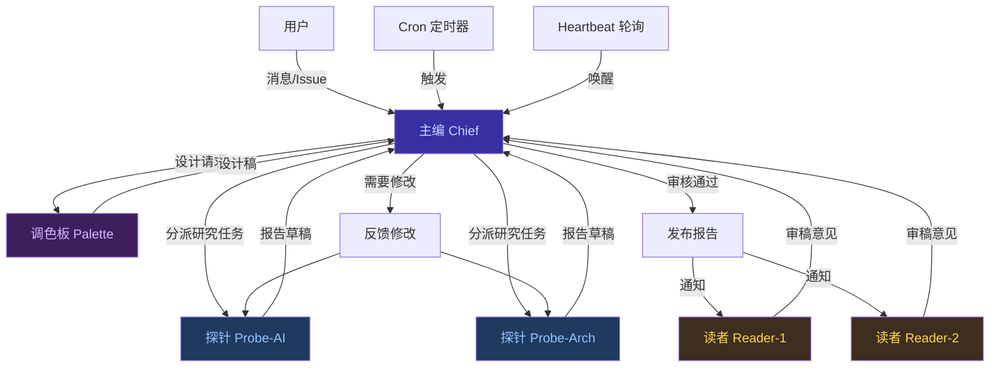
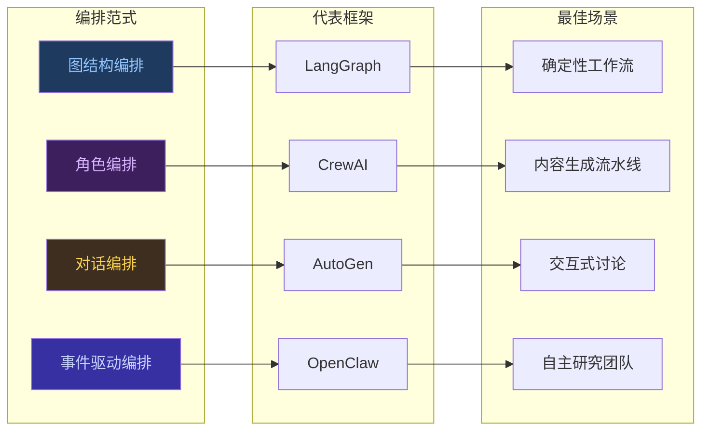
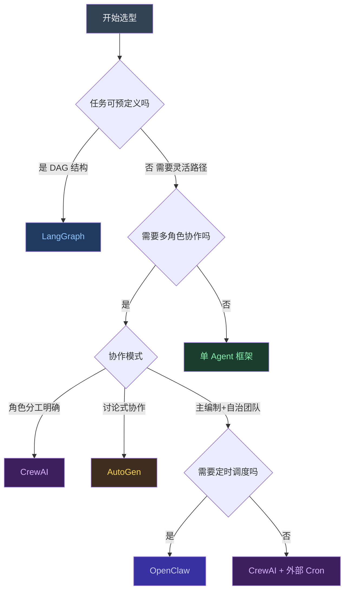
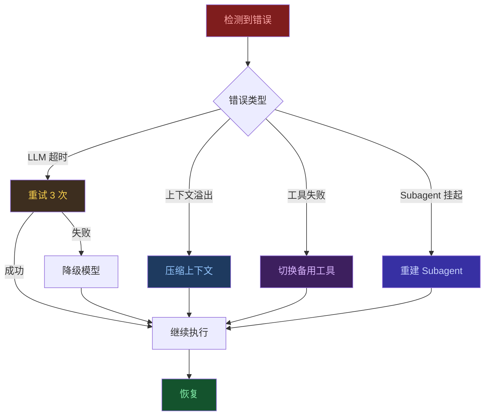

# AI Agent 工作流编排模式

> **发布日期**: 2026-03-16
> **分类**: 方法论
> **关键词**: Agent, 编排, Workflow, Heartbeat, Subagent, LangGraph, CrewAI

---

## Executive Summary

AI Agent 工作流编排正从传统 Workflow 引擎的"预定义 DAG + 中心调度"模式，演进为"事件驱动 + 角色自治"的 Agent 原生范式。OpenClaw 通过 heartbeat 轮询、cron 定时调度和 subagent 嵌套编排三大机制，实现了灵活的 1:N:1 工作流。与 LangGraph 的图结构编排、CrewAI 的角色编排、AutoGen 的对话编排相比，Agent 原生编排更适合需要自主决策、动态调整的场景，但在确定性要求高的批处理场景中，传统 Workflow 引擎仍有优势。选型核心在于判断任务的**确定性程度**和**自治需求**。

---

## 1. 工作流编排范式演进

### 1.1 传统 Workflow 引擎的局限

传统工作流引擎（[Apache Airflow](https://airflow.apache.org/)、[Prefect](https://www.prefect.io/)、[Dagster](https://dagster.io/)）基于 DAG（有向无环图）模型，核心特征是：

- **预定义流程**：所有任务节点和依赖关系在执行前确定
- **中心调度器**：由调度器统一管理任务分发和状态追踪
- **确定性执行**：相同输入产生相同执行路径

这种模式在 ETL 管道、数据处理等**高确定性、可预判**的场景中表现出色，但在 Agent 场景中面临本质困难：

| 传统 Workflow 引擎痛点 | Agent 场景的冲突 |
|----------------------|-----------------|
| DAG 结构固定 | Agent 任务路径由 LLM 推理决定，无法预定义 |
| 任务是无状态函数 | Agent 需要维护对话上下文和工作记忆 |
| 异常处理是预设分支 | Agent 需要自主诊断失败原因并选择恢复策略 |
| 编排层与执行层分离 | Agent 的"编排"和"执行"是同一个 LLM 调用 |

### 1.2 Agent 原生编排模式

Agent 原生编排放弃了预定义 DAG，转而采用事件驱动和角色自治机制：

- **Heartbeat 轮询**：主编以固定间隔检查消息队列，按需唤醒子任务（类似操作系统的进程调度）
- **Cron 定时调度**：精确定时触发的周期性任务（日报生成、定期扫描）
- **Subagent 嵌套**：主编动态创建子 Agent，子 Agent 独立执行后汇报结果

### 1.3 两种范式的本质区别

```
传统 Workflow 引擎:
  编排 = 预定义图结构 + 中心调度器 + 任务队列
  
Agent 原生编排:
  编排 = 事件触发 + 角色自治 + 结果汇总
```

核心区别在于**决策权的位置**：传统引擎的决策在编排层（DAG 定义者），Agent 编排的决策在执行层（每个 Agent 自己决定下一步）。

---

## 2. OpenClaw 编排模型深度分析

### 2.1 Heartbeat 轮询机制

Heartbeat 是 OpenClaw 的核心调度机制。主编 Agent 以固定时间间隔（如 60 秒）被唤醒，检查是否有新的用户消息、Issue 更新或子 Agent 结果需要处理。

**工作机制**：

- **轮询间隔**：可配置（默认 60 秒，可通过 `heartbeat_interval` 调整）
- **检查内容**：消息队列、子 Agent 状态、定时任务到期情况
- **按需唤醒**：有新消息时启动处理流程，无消息时进入休眠

**类比**：Heartbeat 本质上是一个**协程调度器**——主编是主协程，子 Agent 是子协程，heartbeat interval 是调度周期。

**优势**：
- 极低的资源开销（无消息时仅一个空轮询）
- 自然支持"主编等待探针返回"的模式
- 用户体验良好（定期响应，不会长期沉默）

**局限**：
- 轮询间隔决定了最小响应延迟
- 不适合毫秒级实时响应场景

### 2.2 Cron 定时任务

Cron 是 OpenClaw 的精确调度机制，基于标准 cron 表达式（如 `0 9 * * 1-5` 表示工作日早上 9 点）。

**与 heartbeat 的关系**：

- **Heartbeat**：事件驱动，有消息才处理
- **Cron**：时间驱动，到点就执行
- 两者可以组合：Cron 触发一个任务，任务中创建 subagent 处理复杂工作

**典型用例**：
- 每日 GitHub Issue 扫描
- 定期报告生成
- 周/月研究计划制定

### 2.3 Sub-agent 嵌套编排

Sub-agent 是 OpenClaw 实现并行处理和角色分工的核心机制。

**工作机制**：

1. 主编收到复杂任务，拆分为子任务
2. 为每个子任务创建独立的 subagent session
3. Subagent 独立执行（可并行）
4. Subagent 完成后自动汇报结果
5. 主编汇总结果，决定下一步动作

**关键特性**：
- **隔离性**：每个 subagent 有独立的 context window
- **并行性**：多个 subagent 可同时运行
- **自动汇总**：subagent 完成后 push 通知主编
- **深度限制**：subagent 不能再创建子 subagent（避免无限递归）

### 2.4 编排工作流全景



---

## 3. 对比其他 Agent 编排方案

### 3.1 LangGraph（图结构编排）

[LangGraph](https://github.com/langchain-ai/langgraph)（v0.2.x，截至 2025）是 LangChain 生态的图编排框架，核心思想是用有向图定义 Agent 之间的流转关系。

**核心特征**：
- **显式图定义**：用 Python 定义节点（Agent）和边（条件分支）
- **状态管理**：全局 State 对象在节点间传递
- **条件路由**：根据状态决定下一个节点
- **检查点（Checkpoint）**：支持断点恢复和时间旅行调试

**适用场景**：需要严格控制执行路径的工作流、需要调试和回放的生产系统。

**局限**：
- 图结构需要预先设计，灵活度低于事件驱动
- 状态管理增加复杂度
- 学习曲线陡峭

### 3.2 CrewAI（角色编排）

[CrewAI](https://github.com/crewAIInc/crewAI)（v0.108.x，截至 2025）采用"船员"隐喻，每个 Agent 是一个具有特定角色、目标和工具的"船员"。

**核心特征**：
- **角色定义**：每个 Agent 有 role、goal、backstory
- **任务分配**：Task 明确指定执行者和期望输出
- **执行模式**：sequential（串行）、parallel（并行）、hierarchical（层级）
- **委派机制**：Agent 可以将子任务委派给其他 Agent

**适用场景**：需要明确角色分工的协作任务、内容生成流水线。

**与 OpenClaw 的区别**：
- CrewAI 的角色在代码中预定义，OpenClaw 的角色在配置文件中定义
- CrewAI 的执行流在 `Crew.kickoff()` 时确定，OpenClaw 的执行流由 heartbeat 事件驱动
- CrewAI 无内置的定时调度能力

### 3.3 AutoGen（对话编排）

[AutoGen](https://github.com/microsoft/autogen)（v0.4.x，截至 2025）是微软推出的多 Agent 对话框架，核心是让多个 Agent 通过结构化对话完成任务。

**核心特征**：
- **对话驱动**：Agent 之间通过消息传递协作
- **GroupChat**：多个 Agent 轮流发言的协调机制
- **人类在环**：支持 Human Proxy Agent 介入决策
- **代码执行**：内置安全的代码执行沙箱

**适用场景**：需要多轮讨论、人类审批、代码生成和调试的场景。

**与 OpenClaw 的区别**：
- AutoGen 以"对话"为基本单位，OpenClaw 以"任务"为基本单位
- AutoGen 的 GroupChat 调度器决定谁发言，OpenClaw 的主编决定谁执行
- AutoGen 更适合交互式场景，OpenClaw 更适合自动化流水线

### 3.4 OpenClaw（事件驱动 + 角色编排）

OpenClaw 融合了事件驱动和角色编排的特点：

- **事件驱动**：Heartbeat 和 Cron 作为触发源
- **角色编排**：主编/探针/调色板/图书管理员/读者各司其职
- **Session 隔离**：每个角色独立 session，互不干扰
- **Push-based 完成**：子任务完成后主动通知主编

### 3.5 框架对比全景



**对比表**：

<div class="table-wrapper">
<table>
<thead>
<tr>
<th>维度</th>
<th>LangGraph</th>
<th>CrewAI</th>
<th>AutoGen</th>
<th>OpenClaw</th>
</tr>
</thead>
<tbody>
<tr>
<td><strong>编排范式</strong></td>
<td>图结构</td>
<td>角色编排</td>
<td>对话编排</td>
<td>事件驱动+角色</td>
</tr>
<tr>
<td><strong>执行模型</strong></td>
<td>DAG 遍历</td>
<td>串行/并行/层级</td>
<td>GroupChat 轮询</td>
<td>Heartbeat+Cron</td>
</tr>
<tr>
<td><strong>状态管理</strong></td>
<td>全局 State</td>
<td>Task 上下文</td>
<td>对话历史</td>
<td>Session 隔离</td>
</tr>
<tr>
<td><strong>调度能力</strong></td>
<td>无内置</td>
<td>无内置</td>
<td>无内置</td>
<td>Heartbeat+Cron</td>
</tr>
<tr>
<td><strong>调试能力</strong></td>
<td>检查点+时间旅行</td>
<td>日志</td>
<td>对话记录</td>
<td>Session 日志</td>
</tr>
<tr>
<td><strong>适用确定性</strong></td>
<td>高</td>
<td>中</td>
<td>低</td>
<td>低-中</td>
</tr>
<tr>
<td><strong>自治程度</strong></td>
<td>低</td>
<td>中</td>
<td>高</td>
<td>高</td>
</tr>
<tr>
<td><strong>学习曲线</strong></td>
<td>陡峭</td>
<td>平缓</td>
<td>中等</td>
<td>平缓</td>
</tr>
</tbody>
</table>
</div>

---

## 4. 选型决策树

### 4.1 决策流程图



### 4.2 场景到编排模式映射

<div class="table-wrapper">
<table>
<thead>
<tr>
<th>场景</th>
<th>推荐方案</th>
<th>理由</th>
</tr>
</thead>
<tbody>
<tr>
<td>ETL 数据管道</td>
<td>Airflow / Dagster</td>
<td>DAG 固定、重试机制成熟、生态完善</td>
</tr>
<tr>
<td>文档生成流水线</td>
<td>CrewAI</td>
<td>角色明确（写作/编辑/校对）、输出格式固定</td>
</tr>
<tr>
<td>代码审查系统</td>
<td>AutoGen</td>
<td>需要多轮讨论、人类审批介入</td>
</tr>
<tr>
<td>自主研究团队</td>
<td>OpenClaw</td>
<td>主编协调、探针自治、定时扫描、角色多样</td>
</tr>
<tr>
<td>客服工作流</td>
<td>LangGraph</td>
<td>路由规则明确、状态流转可预测</td>
</tr>
<tr>
<td>AI DevOps 流水线</td>
<td>OpenClaw + Cron</td>
<td>定时触发、多角色协作（监控/诊断/修复）</td>
</tr>
<tr>
<td>创意内容工作坊</td>
<td>AutoGen + CrewAI</td>
<td>Brainstorm 用 AutoGen、执行用 CrewAI</td>
</tr>
</tbody>
</table>
</div>

---

## 5. 实战案例

### 5.1 OpenClaw 研究团队的 1:N:1 编排模式

OpenClaw Tech-Researcher 项目是 Agent 原生编排的典型案例：

**团队结构**：1 主编 : N 探针 : 1 调色板 : N 读者

**工作流程**：

1. **选题阶段**：主编通过 cron 扫描 GitHub Issues，收集用户建议
2. **分派阶段**：主编创建 subagent（探针），传入明确的研究任务
3. **研究阶段**：探针独立执行研究，包括搜索、分析、撰写
4. **审核阶段**：主编审核报告，不合格则退回修改
5. **设计阶段**：调色板生成信息图和美化 HTML
6. **发布阶段**：主编执行 git commit + push + release
7. **评审阶段**：读者独立审稿，提交 GitHub Issue 意见
8. **迭代阶段**：主编汇总意见，决定是否跟进

### 5.2 Heartbeat + Cron 的组合使用

在实际运行中，两种调度方式形成互补：

- **Heartbeat（60秒间隔）**：主编的日常工作循环
  - 检查新消息
  - 监控 subagent 状态
  - 响应用户请求
  
- **Cron（每日 09:00 UTC）**：定期批量任务
  - 扫描 GitHub Issues
  - 检查报告链接有效性
  - 更新研究计划

**关键洞察**：Heartbeat 处理"突发"事件，Cron 处理"周期"事件。两者覆盖了 Agent 工作流中的两大时间维度。

### 5.3 异常处理与降级策略

Agent 编排中的异常处理比传统 Workflow 更复杂，因为异常原因更多样：

**常见异常类型**：

- **LLM 超时/限流**：降级到更小的模型或增加重试间隔
- **Subagent 失败**：主编重新分派或合并任务
- **上下文溢出**：压缩历史或拆分为更小的子任务
- **工具调用失败**：切换备用工具或手动降级

**降级策略示例**：



---

## 6. 最佳实践

### 6.1 编排设计原则

1. **单一职责**：每个 Agent 只负责一个明确的领域（探针不设计、调色板不写报告）
2. **结果驱动**：Subagent 的产出必须是可验证的（文件存在、链接有效）
3. **失败快速**：Agent 编排不适合"尽力而为"，超时和失败要快速上报
4. **状态外置**：重要状态写入文件，不要仅依赖 session 内存
5. **幂等设计**：Cron 任务可以安全重复执行

### 6.2 常见陷阱

| 陷阱 | 症状 | 解决方案 |
|------|------|---------|
| 探针承诺过多 | 一次分派 8 篇报告，产出不完整 | 固定 2 篇/队，逐步增加 |
| 盲信 subagent | "已完成"但文件不存在 | 主编必须验证产出文件 |
| 忽略 context 溢出 | 报告写到一半输出截断 | 监控 token 使用，适时压缩 |
| Cron 重叠执行 | 上次任务未完成，新的又触发 | 加锁机制或增加任务间隔 |
| 角色职责模糊 | 探针做了调色板的工作 | 严格遵循角色定义 |

### 6.3 性能优化建议

1. **并行 subagent**：独立任务同时分派，不串行等待
2. **模型分层**：简单任务用小模型（如 Gemini Flash），复杂任务用大模型（如 Claude）
3. **缓存搜索结果**：避免同一主题重复搜索
4. **Heartbeat 间隔调优**：根据负载调整（繁忙时缩短，空闲时延长）
5. **上下文预算管理**：每个 session 预设 token 上限，超出则自动压缩

---

## 参考资料

1. **Apache Airflow Documentation** — 传统 Workflow 引擎的代表，DAG 编排范式
   <https://airflow.apache.org/docs/>

2. **LangGraph GitHub Repository** — LangChain 图编排框架，v0.2.x（截至 2025）
   <https://github.com/langchain-ai/langgraph>

3. **CrewAI Documentation** — 角色编排多 Agent 框架，v0.108.x（截至 2025）
   <https://docs.crewai.com/>

4. **Microsoft AutoGen** — 对话编排多 Agent 框架，v0.4.x（截至 2025）
   <https://github.com/microsoft/autogen>

5. **Anthropic: Building Effective Agents** — 2024 年 12 月，Agent 构建最佳实践指南
   <https://www.anthropic.com/engineering/building-effective-agents>

6. **OpenClaw Documentation** — Agent 原生编排平台，heartbeat/cron/subagent 机制
   <https://docs.openclaw.ai/>

7. **Prefect Documentation** — 现代 Workflow 编排引擎
   <https://docs.prefect.io/>

8. **Dagster Documentation** — 数据编排平台
   <https://docs.dagster.io/>

9. **CrewAI vs LangGraph vs AutoGen: Multi-Agent Framework Comparison** — 2025 年 1 月
   <https://www.datacamp.com/tutorial/crewai-vs-autogen-vs-langgraph>

10. **The Shift from Workflows to Agents** — 2025 年，从工作流向 Agent 范式的演进分析
    <https://www.sequoiacap.com/article/ais-agent-era/>
