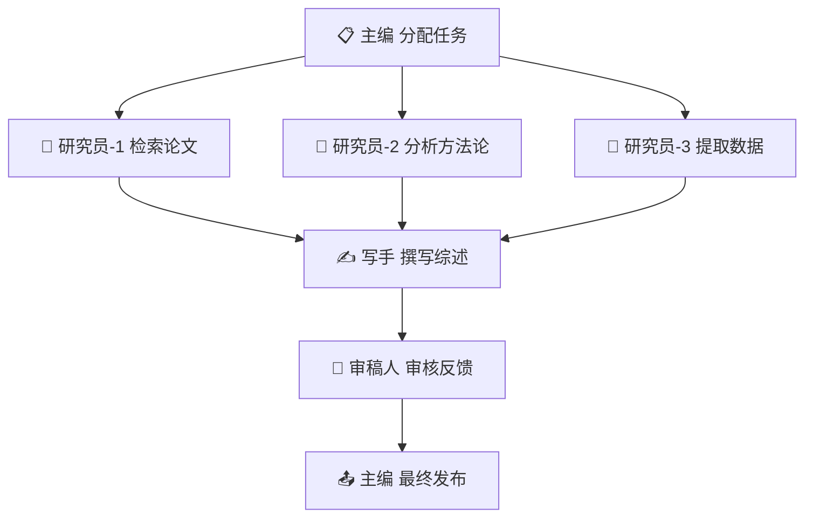

# 多智能体协作模式研究

## Executive Summary

多智能体系统（Multi-Agent System, MAS）是 AI Agent 从单兵作战走向团队协作的必然路径。本文分析层级式、扁平式、市场式三种组织模式，探讨通信协议与冲突解决机制，对比 CrewAI、AutoGen、MetaGPT 等主流框架，并通过实际案例展示多 Agent 协作的工程实践。

---

## 1. 组织模式

### 1.1 层级式（Hierarchical）

```
        [管理者 Agent]
       /      |       \
  [专家A]  [专家B]  [专家C]
```

- **特点**: 上级分配任务，下级执行并汇报
- **优点**: 职责清晰，易于协调
- **缺点**: 单点瓶颈，管理者负载高
- **适用**: 项目管理、复杂工作流

### 1.2 扁平式（Flat / Peer-to-Peer）

```
[Agent A] ←→ [Agent B]
    ↕           ↕
[Agent C] ←→ [Agent D]
```

- **特点**: 所有 Agent 平等，自主协商
- **优点**: 无单点故障，灵活
- **缺点**: 协调成本高，可能冲突
- **适用**: 头脑风暴、民主决策

### 1.3 市场式（Market-based）

```
[任务发布] → [拍卖机制] → [Agent 竞标] → [最优分配]
```

- **特点**: 通过竞标机制分配任务
- **优点**: 资源最优配置
- **缺点**: 设计复杂，需要评估函数
- **适用**: 资源调度、任务分配优化

---

## 2. 通信协议与消息传递

### 2.1 通信模式

| 模式 | 描述 | 适用场景 |
|------|------|---------|
| 直接消息 | Agent A → Agent B | 点对点协作 |
| 广播 | Agent → All | 公告、状态同步 |
| 发布/订阅 | Topic-based | 事件驱动系统 |
| 黑板系统 | 共享内存空间 | 异步协作 |

### 2.2 消息格式

```json
{
  "from": "researcher_agent",
  "to": "writer_agent",
  "type": "task_request",
  "content": {
    "task": "撰写报告第二章",
    "context": {...},
    "deadline": "2026-03-14T15:00:00Z"
  },
  "priority": "high",
  "correlation_id": "msg_123"
}
```

### 2.3 协议标准

- **A2A (Agent-to-Agent)**: Google 提出的 Agent 通信协议
- **MCP (Model Context Protocol)**: 工具调用协议
- **FIPA-ACL**: 传统 MAS 通信语言

---

## 3. 冲突解决与共识机制

### 3.1 常见冲突类型

- **资源冲突**: 多个 Agent 需要同一工具/数据
- **目标冲突**: Agent 目标相互矛盾
- **知识冲突**: Agent 对同一事实有不同认知

### 3.2 解决策略

| 策略 | 机制 | 适用场景 |
|------|------|---------|
| 投票 | 多数决 / 加权投票 | 知识冲突 |
| 仲裁 | 上级 Agent 裁决 | 目标冲突 |
| 协商 | 讨论达成一致 | 复杂决策 |
| 竞标 | 价高者得 | 资源冲突 |
| 回退 | 随机退避重试 | 简单资源冲突 |

### 3.3 共识算法

```
1. 提案阶段: Agent A 提出方案
2. 讨论阶段: 各 Agent 发表意见
3. 投票阶段: 各 Agent 投票
4. 执行阶段: 通过则执行，否则修订重来
```

---

## 4. 主流框架对比

### 4.1 CrewAI

**特点**: 角色扮演 + 任务编排

```python
from crewai import Agent, Task, Crew

researcher = Agent(
    role="研究员",
    goal="收集并分析数据",
    backstory="资深技术研究员..."
)

writer = Agent(
    role="写手",
    goal="撰写报告",
    backstory="专业技术写手..."
)

crew = Crew(
    agents=[researcher, writer],
    tasks=[research_task, write_task],
    process=Process.sequential
)
```

**优点**: 上手简单，角色设计直观
**缺点**: 复杂工作流灵活性不足

### 4.2 AutoGen

**特点**: 对话驱动的多 Agent 协作

```python
from autogen import AssistantAgent, UserProxyAgent

assistant = AssistantAgent("assistant", llm_config=llm_config)
user_proxy = UserProxyAgent("user", human_input_mode="NEVER")

user_proxy.initiate_chat(
    assistant,
    message="分析这个数据集..."
)
```

**优点**: 灵活的对话模式，支持人类参与
**缺点**: 需要较多手动配置

### 4.3 MetaGPT

**特点**: 软件公司模拟，标准化 SOP

- 产品经理 → 架构师 → 工程师 → QA
- 每个角色遵循标准输出文档
- 内置需求分析、系统设计、代码生成流程

**优点**: 软件开发场景效果好
**缺点**: 场景较窄

### 4.4 对比总结

| 维度 | CrewAI | AutoGen | MetaGPT |
|------|--------|---------|---------|
| 上手难度 | ⭐⭐ | ⭐⭐⭐ | ⭐⭐⭐ |
| 灵活性 | ⭐⭐ | ⭐⭐⭐ | ⭐⭐ |
| 生产就绪 | ⭐⭐ | ⭐⭐ | ⭐ |
| 社区活跃 | ⭐⭐⭐ | ⭐⭐⭐ | ⭐⭐ |
| 最佳场景 | 通用工作流 | 研究/分析 | 软件开发 |

---

## 5. 实际案例分析

### 5.1 研究团队模拟

**场景**: 一个 AI 研究团队完成文献综述



**效果**: 10 篇论文综述，单人 2 天 → 多 Agent 2 小时

### 5.2 代码开发协作

**场景**: AutoGen 驱动的代码审查系统

- Agent-1: 编写代码
- Agent-2: 代码审查，找 Bug
- Agent-3: 编写测试
- 循环直到测试通过

---

## 参考来源

1. Wu, Q. et al. "AutoGen: Enabling Next-Gen LLM Applications via Multi-Agent Conversation" (2023) — Microsoft Research
   - https://arxiv.org/abs/2308.08155
2. Hong, S. et al. "MetaGPT: Meta Programming for A Multi-Agent Collaborative Framework" (2023) — DeepWisdom
   - https://arxiv.org/abs/2308.00352
3. CrewAI Documentation
   - https://docs.crewai.com/
4. Wooldridge, M. "An Introduction to MultiAgent Systems" (2009) — John Wiley & Sons
5. Google A2A Protocol
   - https://github.com/google/A2A
6. Zhang, S. et al. "Agent-as-a-Judge: Evaluate Agents with Agents" (2024) — CMU
   - https://arxiv.org/abs/2410.10934
7. Wang, G. et al. "ChatDev: Communicative Agents for Software Development" (2024) — Tsinghua
   - https://arxiv.org/abs/2307.07924
8. Anthropic. "Multi-Agent Research System" (2025) — Claude 多智能体研究系统
   - https://www.anthropic.com/engineering/multi-agent-research-system
