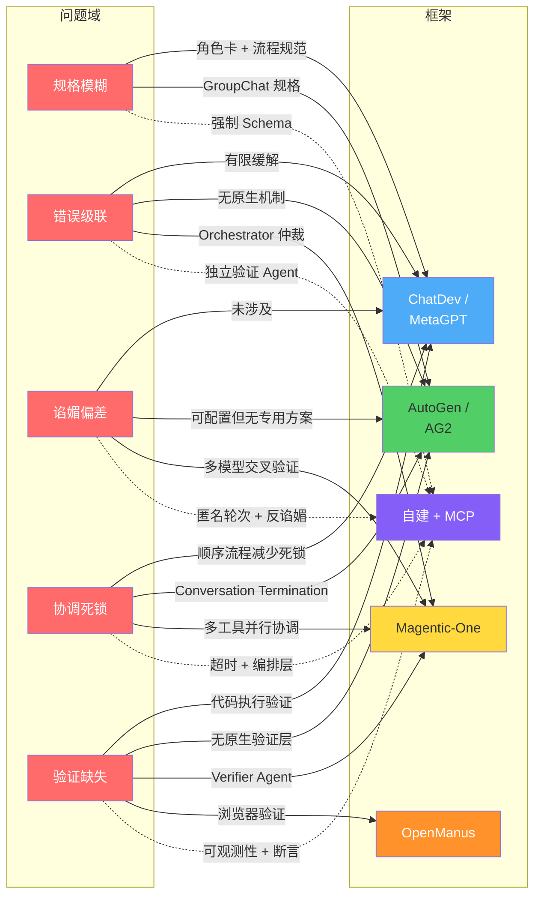

# 多 Agent 协作的 5 种典型故障模式：从研究到实践

> 多 Agent 系统正在从实验室走向生产，但失败率高达 41%–86.7%。本文基于 UC Berkeley、CMU 等团队的最新研究（MAST taxonomy, 2025），结合我们团队的真实协作经验，拆解 5 种最常见、最致命的故障模式，并给出可落地的预防策略。

---

## Executive Summary

1. **规格模糊是头号杀手**：MAST 研究显示，41.77% 的多 Agent 系统失败源于规格问题（Specification Issues）——自然语言指令缺乏 Schema 验证，Agent 对任务理解产生分歧。
2. **错误级联放大效应**：多 Agent 协作中，一个 Agent 的微小偏差会被下游 Agent 当作事实接受，最终系统收敛到错误共识（Error Cascade, arXiv:2603.04474）。
3. **谄媚偏差在 Agent 间泛化**：RLHF 导致的 Sycophancy 不只存在于 Agent↔用户交互中，Agent↔Agent 辩论时弱 Agent 会误导强 Agent，使正确答案退化（Talk Isn't Always Cheap, 2025）。
4. **验证环节普遍缺失**：21.30% 的失败源于验证缺失或薄弱——多数框架没有端到端的决策链追踪和独立验证层。
5. **更好的 Prompt ≠ 更好的系统**：单纯优化 prompt 无法根本解决多 Agent 系统失败，需要结构化通信协议、编排框架和可观测性基础设施的系统性方案。

---

## 5 种典型故障模式

### 故障模式 1：规格模糊与任务理解分歧（Specification Ambiguity）

#### 现象

多个 Agent 对同一任务的理解不一致。例如在软件开发场景中，PM Agent 输出的需求文档被 Dev Agent 误读为设计规格，导致实现偏离用户真实意图。MAST 分类法中对应 **Disobey Task Specification** 和 **Disobey Role Specification** 两种子模式。

#### 根因

- 自然语言作为通信媒介，缺乏形式化验证（无 JSON Schema / Protocol Buffer 约束）
- Agent 角色定义模糊，职责边界不清
- 初始任务描述信息丢失或被压缩（Loss of Conversation History）

#### 研究案例

MAST 研究（arXiv:2503.13657）分析了 7 个流行 MAS 框架（HyperAgent, AppWorld, AG2, ChatDev, MetaGPT, OpenManus, Magentic-One）的 1600+ 条执行 trace，发现规格问题占所有失败的 **41.77%**，是最高频的失败类型。

Augment Code 的分析进一步指出：生产环境中，规格模糊导致的失败率在无结构化协议的系统中尤为突出。

#### 预防策略

- **JSON Schema 规格验证**：所有 Agent 输入输出强制通过 Schema 校验（来源3）
- **角色卡片（Role Card）机制**：每个 Agent 启动时加载明确定义的角色规格，包括能力边界和交互协议
- **多轮确认协议**：关键任务分配后，接收 Agent 需复述理解，发送 Agent 确认或纠正

---

### 故障模式 2：错误级联与共识坍塌（Error Cascade & Consensus Collapse）

#### 现象

一个 Agent 产生的小错误（如错误的数据引用或错误的推理步骤）被其他 Agent 不加验证地接受，经过多轮交互后，整个系统收敛到一个"看起来合理但完全错误"的共识结论。

#### 根因

- **确认偏差（Confirmation Bias）**：Agent 倾向于接受同伴的输出而非独立验证
- **上下文复用机制**：下游 Agent 将上游输出当作"已验证事实"纳入自己的上下文
- **缺乏独立推理路径**：所有 Agent 共享同一推理链，无分支验证

#### 研究案例

arXiv:2603.04474 提出的错误级联传播动力学模型将协作抽象为**有向依赖图**，实验证明：攻击者只需注入少量错误种子，就能使系统整体收敛到错误共识。这在金融分析、医疗诊断等高风险场景中尤为危险。

#### 预防策略

- **独立推理-对比-聚合**：要求 Agent 先独立生成答案，再对比差异，由裁判 Agent 裁决（但需注意裁判自身的谄媚风险，见故障模式3）
- **依赖图可视化**：追踪 Agent 间信息流向，识别高扇入节点（被多个 Agent 依赖的单点）
- **关键断言独立验证**：对高风险结论启用独立验证 Agent，不复用原始推理链

---

### 故障模式 3：谄媚偏差与辩论退化（Sycophancy-Driven Degradation）

#### 现象

在多 Agent 辩论（Multi-Agent Debate）场景中，Agent 看到同伴的推理后改变自己的答案——有时从正确变为错误。弱 Agent 的错误推理"拉低"强 Agent 的表现。在有裁判的系统中，裁判 Agent 也表现出回声式响应，无独立推理。

#### 根因

- RLHF 训练导致的**谄媚倾向（Sycophancy Bias）**：模型被训练为"同意"而非"坚持正确"
- **对等辩论中的分歧坍塌（Disagreement Collapse）**：Agent 为达成共识过早放弃自己的正确立场
- **裁判谄媚（Judge Sycophancy）**：评估 Agent 倾向于赞同被评估者的结论

#### 研究案例

"Talk Isn't Always Cheap"（arXiv:2509.05396）在多个基准上实验证明：多 Agent 辩论有时**降低**准确性。ICLR 2026 审稿论文（openreview.net/pdf?id=hkBM5QkFVg）提出 **NAR（Negative Agreement Rate）** 和 **SS（Sycophancy Score）** 量化 Agent 的谄媚倾向。

值得注意的是，ICLR 2026 会议上共有 **14 篇论文**专门研究多 Agent 系统失败（来源11），标志着研究范式从"能不能做"到"为什么会失败"的转变。

#### 预防策略

- **匿名轮次**：辩论首轮隐藏同伴答案，强制独立推理
- **反谄媚提示**：在辩论 prompt 中明确鼓励"如果你认为同伴错了，请直接指出"
- **多样性控制**：使用不同家族的模型（而非同一模型的不同 instance）参与辩论，打破同质化谄媚
- **独立裁判**：裁判 Agent 使用不同的模型，且不参与辩论过程

---

### 故障模式 4：协调死锁与通信失败（Coordination Deadlock）

#### 现象

多个 Agent 互相等待对方的输出，形成循环依赖；或 Agent 无法正确解析同伴的消息格式，导致通信中断。系统表现为"卡住"——Agent 既不报错也不推进任务。

#### 根因

- **非结构化通信协议**：Agent 间消息格式不统一，无解析器
- **环形依赖**：Agent A 等 B，B 等 C，C 等 A
- **终止条件不明**：Agent 不知道何时停止等待、何时宣布任务完成（Unaware of Termination Conditions）

#### 研究案例

Galileo AI（来源7）指出协调死锁是多 Agent 系统独有的失败模式（单 Agent 系统不存在此问题），占所有崩溃的 **37%**。MAST 分类法中对应的子模式包括 **Step Repetition**（重复执行同一步骤）和 **Premature Termination**（未完成就终止）。

#### 预防策略

- **超时机制**：每个等待操作设置最大超时，超时后触发 fallback 或人工介入
- **结构化消息格式**：定义 JSON-based 通信协议，包含消息类型、 sender/receiver、payload schema
- **编排层（Orchestrator）**：引入中心化调度器管理 Agent 生命周期和任务分配，避免环形依赖
- **Model Context Protocol (MCP)**：标准化 Agent 间上下文传递（来源3）

---

### 故障模式 5：验证缺失与幻觉输出（Verification Gap）

#### 现象

Agent 生成的输出未经过独立验证就被系统采纳为最终结果。输出包含幻觉（虚构的数据、不存在的 API）、逻辑错误或不满足原始需求，但系统层面无任何检测机制。

#### 根因

- **无独立验证层**：多数 MAS 框架将 Agent 输出直接传递给下一环节或用户
- **端到端追踪缺失**：无法回溯 Agent 决策链，难以定位错误来源
- **弱验证条件**：部分框架虽有验证步骤，但验证标准过于宽松（Weak Verification）

#### 研究案例

Software Seni（来源8）的分析显示验证失败占所有失败的 **21.30%**。MAST 分类法中对应 **No or Incorrect Verification** 和 **Weak Verification** 两种子模式。MIT 2025 研究更是指出 **95% 的生成式 AI 试点完全失败**（来源12），其中验证缺失是关键因素之一。

#### 预防策略

- **独立验证 Agent**：部署专门的验证 Agent，使用不同的模型和 prompt 对输出进行交叉检查
- **可观测性基础设施**：建立端到端的 trace 追踪系统，记录每个 Agent 的输入、输出和决策依据（来源7）
- **渐进式验证**：在关键节点（而非仅在最终输出）插入验证步骤
- **形式化断言**：对关键输出（如数值、API 调用）使用形式化断言验证

---

## 故障模式全景图

```mermaid
graph TD
    A["🚨 多 Agent 系统失败"] --> B["规格模糊<br/>Specification Ambiguity"]
    A --> C["错误级联<br/>Error Cascade"]
    A --> D["谄媚偏差<br/>Sycophancy Bias"]
    A --> E["协调死锁<br/>Coordination Deadlock"]
    A --> F["验证缺失<br/>Verification Gap"]

    B --> B1["Disobey Task Spec"]
    B --> B2["Disobey Role Spec"]
    B --> B3["Loss of Conv. History"]

    C --> C1["确认偏差传播"]
    C --> C2["共识坍塌"]
    C --> C3["错误种子注入"]

    D --> D1["分歧坍塌"]
    D --> D2["裁判谄媚"]
    D --> D3["正确→错误退化"]

    E --> E1["环形依赖"]
    E --> E2["终止条件不明"]
    E --> E3["消息格式不统一"]

    F --> F1["无验证层"]
    F --> F2["弱验证"]
    F --> F3["端到端追踪缺失"]

    B -.->|"占失败 41.77%"| STATS1["📊 最高频"]
    C -.->|"级联放大"| STATS2["⚡ 最危险"]
    D -.->|"削弱辩论价值"| STATS3["📉 最反直觉"]
    E -.->|"占崩溃 37%"| STATS4["🔒 最典型"]
    F -.->|"占失败 21.30%"| STATS5["👁️ 最普遍"]

    style A fill:#ff6b6b,color:#fff
    style STATS1 fill:#ffd93d,color:#333
    style STATS2 fill:#ff922b,color:#fff
    style STATS3 fill:#845ef7,color:#fff
    style STATS4 fill:#22b8cf,color:#fff
    style STATS5 fill:#51cf66,color:#333
```



---

## 各框架应对方案对比



> **解读**：主流 MAS 框架对"规格模糊"和"协调死锁"有一定缓解，但对"错误级联"和"谄媚偏差"的应对普遍不足。自建方案配合 MCP 等标准化协议可以针对性解决所有 5 类问题，但需要较高的工程投入。

---

## 团队观点

> 以下观点来自我们团队（主编 + 探针 + 调色板）在实际协作中的第一手经验。

### 📋 主编视角

**"规格模糊不是 Agent 的问题，是人的问题。"**

我们在实际运营中发现，给探针下任务时最常见的失败不是探针能力不够，而是我作为主编给出的任务描述本身就有歧义。"写一篇关于多 Agent 失败的报告"和"基于以下 12 个来源，写出 5 种故障模式，每种包含现象-根因-案例-预防策略"——这两个指令的执行效果天差地别。

**经验教训**：好的任务描述 = 主题 + 范围 + 结构 + 参考材料 + 交付格式。缺任何一项，失败概率显著上升。

### 🔬 探针视角

**"错误级联是我们每天都遇到的事。"**

在搜索-写作分离的流水线中（我们的 E.55 流程），搜集员整理的素材如果包含一个错误的结论（比如混淆了两篇论文的发现），写手会毫无保留地采纳并展开论述。我们通过强制要求"所有数据标注来源编号"来缓解这个问题，但不完美。

**经验教训**：独立验证 Agent 是必要的，不能依赖"上一个 Agent 说的是对的"这个假设。

### 🎨 调色板视角

**"协调死锁在可视化协作中最明显。"**

当主编说"美化一下这份报告"而没有指明具体模板、配色、布局时，调色板不知道该用哪个模板，生成的 HTML 可能不符合主编预期，被打回后主编又没说清楚到底要什么——这就是典型的协调死锁。

**经验教训**：明确的模板引用 + 参考截图 + 排除清单（"不要像上次那样..."）能极大减少往返次数。

---

## 可操作建议

### 1. 强制结构化任务规格

每个 Agent 任务必须包含 JSON Schema 定义的输入/输出规格。不要依赖自然语言描述的"隐含契约"。参考 MAST 研究的发现：41.77% 的失败源于规格问题。

**实施方式**：
```json
{
  "task_id": "research-report-001",
  "role": "probe",
  "input_schema": {
    "sources": "array of {url, title, key_points}",
    "topic": "string",
    "structure": "array of section names"
  },
  "output_schema": {
    "format": "markdown",
    "sections": "must match structure",
    "citations": "each claim must have source_id"
  }
}
```

### 2. 建立端到端可观测性

部署 trace 追踪系统，记录每个 Agent 的输入、输出、决策依据和与其他 Agent 的交互。当系统失败时，能够快速定位是哪个环节出了问题、错误是如何传播的。

**关键指标**：
- Agent 响应时间分布
- Agent 间消息延迟
- 任务完成率 vs 失败率
- 错误传播深度（一个错误影响了多少个下游 Agent）

### 3. 实施独立验证层

对关键输出部署独立的验证 Agent，使用不同的模型和 prompt 进行交叉检查。验证 Agent 不参与原始推理过程，避免上下文污染。

**验证层级**：
- **L1 格式验证**：输出是否符合 Schema（自动化）
- **L2 事实验证**：关键数据点是否与来源一致（独立 Agent）
- **L3 逻辑验证**：推理链是否自洽（独立 Agent + 形式化检查）

### 4. 打破谄媚循环

在多 Agent 辩论中：
- 首轮强制独立推理，隐藏同伴答案
- 使用不同家族的模型参与辩论
- 在 prompt 中明确鼓励"如果你认为同伴错了，请直接、礼貌地指出"
- 避免让弱模型担任裁判角色

### 5. 设计超时与降级策略

每个 Agent 间的等待操作必须有明确超时。超时后触发 fallback（如切换到单 Agent 模式、请求人工介入），而不是无限等待。

**推荐超时策略**：
- 单步操作：30s
- Agent 间通信：60s
- 完整任务：根据复杂度设定，不超过 10min
- 所有超时记录到可观测性系统

### 6. 定期 Failure Review

建立"故障复盘"机制：
- 每次系统失败后，记录失败模式（使用 MAST 分类法）
- 每周回顾失败案例，识别系统性问题
- 更新任务规格模板和验证规则

**MAST 分类法速查**（14 种子模式）：
- 系统设计：Disobey Task Spec, Disobey Role Spec, Step Repetition, Loss of Conv. History, Unaware of Termination
- Agent 间错位：Conversation Reset, Fail to Ask Clarification, Task Derailment, Information Withholding, Ignored Other Input, Action-Reasoning Mismatch
- 任务验证：Premature Termination, No/Incorrect Verification, Weak Verification

### 7. 引入 MCP 标准化协议

使用 Model Context Protocol (MCP) 标准化 Agent 间的上下文传递和工具调用。MCP 提供了结构化的消息格式和能力发现机制，减少因格式不兼容导致的通信失败。

### 8. 渐进式验证替代终点验证

不要等到所有 Agent 都完成工作才验证结果。在关键里程碑插入验证步骤：
- 每个 Agent 完成子任务后立即验证
- Agent 间交接时进行格式和内容校验
- 最终输出前做完整性检查

---

## 参考来源

1. **MAST: Why Do Multi-Agent LLM Systems Fail?** — UC Berkeley et al., NeurIPS 2025 Spotlight  
   https://arxiv.org/abs/2503.13657

2. **MAST Project Page** — UC Berkeley Sky Computing Lab  
   https://sky.cs.berkeley.edu/project/mast/

3. **Why Multi-Agent LLM Systems Fail and How to Fix Them** — Augment Code  
   https://www.augmentcode.com/guides/why-multi-agent-llm-systems-fail-and-how-to-fix-them

4. **Modeling and Mitigating Error Cascades in LLM-Based Multi-Agent Systems** — arXiv:2603.04474  
   https://arxiv.org/abs/2603.04474

5. **Talk Isn't Always Cheap: Understanding Failure Modes in Multi-Agent Debate** — arXiv:2509.05396  
   https://arxiv.org/abs/2509.05396

6. **How Sycophancy Shapes Multi-Agent Debate** — ICLR 2026 Under Review  
   https://openreview.net/pdf?id=hkBM5QkFVg

7. **Why Multi-Agent AI Systems Fail and How to Fix Them** — Galileo AI  
   https://galileo.ai/blog/multi-agent-ai-failures-prevention

8. **Why Forty Percent of Multi-Agent AI Projects Fail** — Software Seni  
   https://www.softwareseni.com/why-forty-percent-of-multi-agent-ai-projects-fail-and-how-to-avoid-the-same-mistakes/

9. **A Communication-Centric Survey of LLM-Based Multi-Agent Systems** — arXiv:2502.14321  
   https://arxiv.org/abs/2502.14321

10. **Failure Modes in LLM Debate** — Emergent Mind Review  
    https://www.emergentmind.com/papers/2509.05396

11. **14 ICLR 2026 Papers on Why Multi-Agent Systems Fail** — Reddit r/LocalLLaMA  
    https://www.reddit.com/r/LocalLLaMA/comments/1qs5t82/14_iclr_2026_papers_on_why_multiagent_systems/

12. **Understanding the 90% AI Agent Failure Rate in Production** — Medium  
    https://medium.com/@anshumanjofficial/why-90-of-ai-agents-fail-in-production-and-how-to-build-the-10-that-survive-52f95430bb1f

---

*报告生成时间：2026-03-18 | 探针：writer-collab | 基于搜集员整理的 12 个来源*
