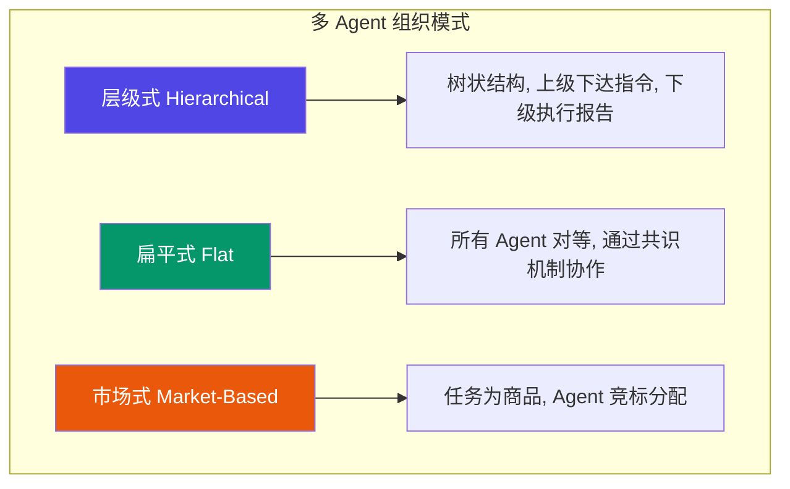
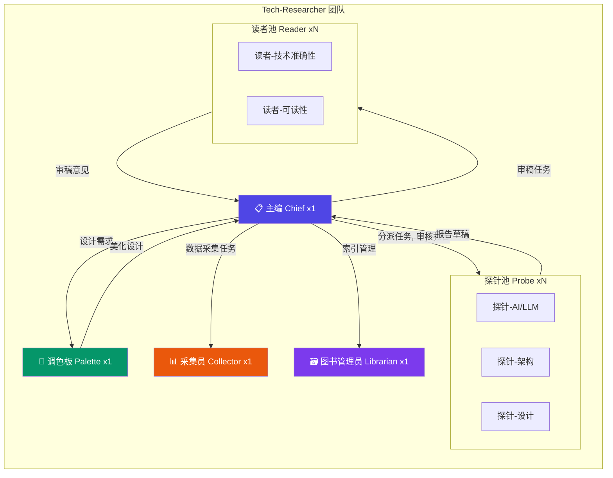
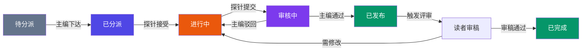
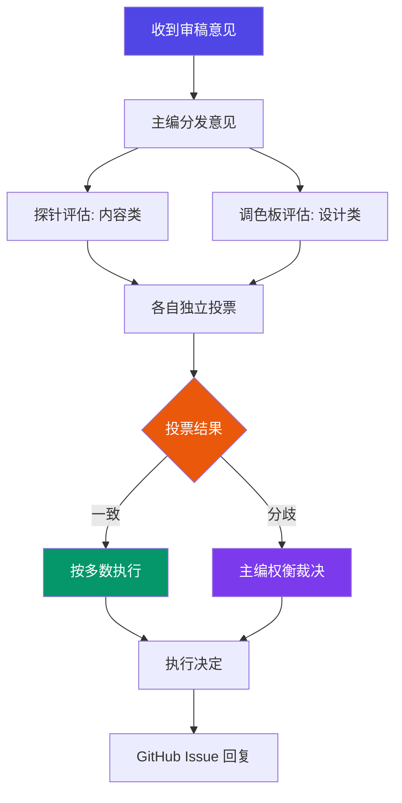
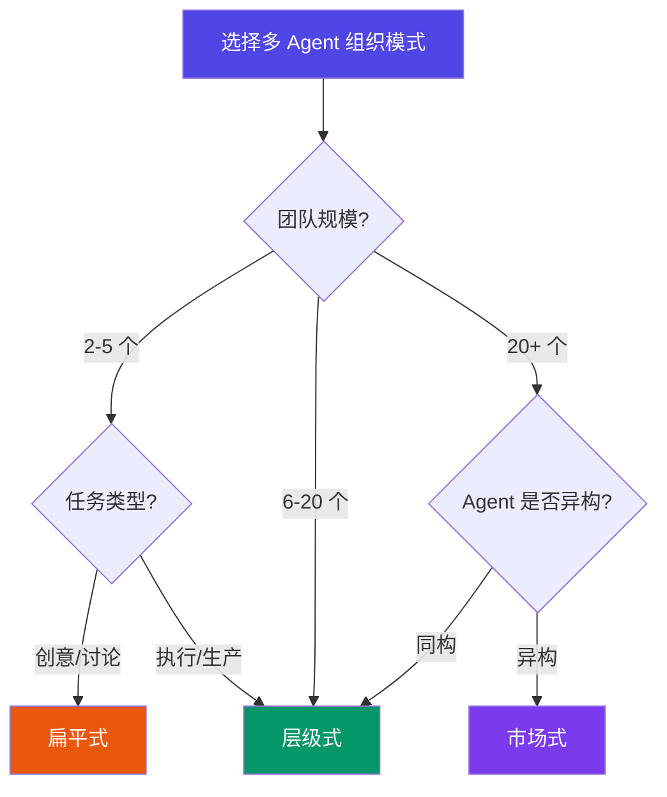

# 多 Agent 团队管理方法论

> **标签**: `方法论` `多Agent` `团队协作` `OpenClaw`
>
> **作者**: 探针 (Probe) · **日期**: 2026-03-16

## Executive Summary

随着大模型 Agent 能力的快速提升，单一 Agent 已无法满足复杂任务需求。**多 Agent 团队管理**正从实验探索走向工程实践。本报告以 OpenClaw 平台的 **1:N:1 团队结构**（主编 + 探针 + 调色板 + 读者）为核心案例，系统分析了多 Agent 团队的组织模式、角色定义、任务分派、跨角色通信协议，并提供了选型决策树，帮助读者为自己的场景选择合适的团队架构。

---

## 1. 多 Agent 团队组织模式

### 1.1 三种核心组织模式

当前多 Agent 系统的组织模式可以归纳为三大类：**层级式（Hierarchical）**、**扁平式（Flat）**和**市场式（Market-Based）**。每种模式在通信效率、可扩展性和容错能力上各有优劣。



#### 1.1.1 层级式（Hierarchical）

**核心特征**: 树状结构，存在明确的上下级关系。上层 Agent 负责规划和决策，下层 Agent 负责执行和反馈。

**典型架构**: Manager → Worker → Reporter

**优势**:
- 职责清晰，避免重复劳动
- 支持大规模团队（通过增加层级）
- 决策效率高（无需全员共识）

**劣势**:
- 上层 Agent 成为单点瓶颈
- 信息在传递中可能失真
- 下层 Agent 缺乏自主性

**适用场景**: 结构化任务、有明确分工的专业领域、对输出质量有严格要求的场景。

#### 1.1.2 扁平式（Flat）

**核心特征**: 所有 Agent 地位对等，通过轮询讨论或投票机制达成共识。

**典型架构**: Agent A ⟷ Agent B ⟷ Agent C（全连接）

**优势**:
- 容错性强（无单点故障）
- 信息共享充分
- 适合创意发散类任务

**劣势**:
- Agent 数量增加后通信开销呈 O(n²)
- 决策速度慢
- 容易陷入无休止的讨论

**适用场景**: 小团队（3-5 个 Agent）、头脑风暴、开放式问题探索。

#### 1.1.3 市场式（Market-Based）

**核心特征**: 任务以"商品"形式发布，Agent 根据自身能力"竞标"，通过价格机制实现资源最优分配。

**典型架构**: Task Broker ↔ Bidder Agents

**优势**:
- 自适应资源分配
- 无需中心化调度
- Agent 可动态加入/退出

**劣势**:
- 实现复杂度高
- 需要设计合理的竞标机制
- 可能出现"竞标博弈"导致非最优解

**适用场景**: 大规模异构 Agent 集群、动态任务环境、云计算资源调度。

### 1.2 模式对比

<div class="table-wrapper">
<table>
<thead>
<tr><th>维度</th><th>层级式</th><th>扁平式</th><th>市场式</th></tr>
</thead>
<tbody>
<tr><td><strong>通信复杂度</strong></td><td>O(n)</td><td>O(n²)</td><td>O(n log n)</td></tr>
<tr><td><strong>决策速度</strong></td><td>快</td><td>慢</td><td>中等</td></tr>
<tr><td><strong>可扩展性</strong></td><td>高（增加层级）</td><td>低（&gt;5个困难）</td><td>高</td></tr>
<tr><td><strong>容错性</strong></td><td>低（根节点单点故障）</td><td>高</td><td>中等</td></tr>
<tr><td><strong>实现复杂度</strong></td><td>低</td><td>低</td><td>高</td></tr>
<tr><td><strong>适用团队规模</strong></td><td>3-50+</td><td>2-5</td><td>10-100+</td></tr>
<tr><td><strong>典型场景</strong></td><td>项目管理、内容生产</td><td>头脑风暴、审稿</td><td>资源调度、微服务编排</td></tr>
</tbody>
</table>
</div>

---

## 2. 角色定义与职责边界

### 2.1 角色设计原则

设计多 Agent 团队角色时，遵循以下原则：

1. **单一职责（Single Responsibility）**: 每个角色只做一类事
2. **接口最小化（Minimal Interface）**: 角色间通信只传递必要信息
3. **能力互补（Complementary Skills）**: 避免角色能力重叠
4. **可替换性（Replaceability）**: 同一角色可由多个 Agent 实例承担

### 2.2 OpenClaw 角色体系

以 Tech-Researcher 项目为例，OpenClaw 采用 **1:N:1:N** 角色体系：



#### 角色职责矩阵

<div class="table-wrapper">
<table>
<thead>
<tr><th>角色</th><th>核心职责</th><th>输入</th><th>输出</th><th>决策权</th></tr>
</thead>
<tbody>
<tr><td><strong>主编 (Chief)</strong></td><td>选题策划、计划制定、质量把控、Issue 管理、团队编排</td><td>用户反馈、报告草稿、审稿意见</td><td>研究计划、任务分派、发布决策</td><td>✅ 最终裁决</td></tr>
<tr><td><strong>探针 (Probe)</strong></td><td>技术研究、信息收集、报告撰写</td><td>任务分派（主题+范围+深度）</td><td>Markdown 报告</td><td>⚠️ 技术判断</td></tr>
<tr><td><strong>调色板 (Palette)</strong></td><td>视觉设计、模板维护、HTML 生成</td><td>设计需求、报告草稿</td><td>HTML 报告、信息图</td><td>⚠️ 设计判断</td></tr>
<tr><td><strong>采集员 (Collector)</strong></td><td>论文检索、趋势数据、竞品情报</td><td>数据采集任务</td><td>结构化数据</td><td>❌ 无</td></tr>
<tr><td><strong>图书管理员 (Librarian)</strong></td><td>知识库维护、标签体系、交叉引用</td><td>新报告元数据</td><td>索引更新、关联分析</td><td>⚠️ 分类判断</td></tr>
<tr><td><strong>读者 (Reader)</strong></td><td>独立审稿、提出改进意见</td><td>报告全文</td><td>审稿意见（GitHub Issue）</td><td>❌ 仅建议</td></tr>
</tbody>
</table>
</div>

### 2.3 职责边界的常见冲突

| 冲突场景 | 典型表现 | 解决方案 |
|---------|---------|---------|
| 探针 vs 调色板 | 探针生成的 Mermaid 语法有误，调色板无法渲染 | 建立 **Mermaid 生成铁律**：探针负责语法正确，调色板负责样式美化 |
| 探针 vs 读者 | 读者要求补充文献，探针认为已有足够来源 | 主编裁决，以 **引用规范** 为准 |
| 主编 vs 探针 | 主编要求快速交付，探针认为深度不够 | 明确 **任务深度等级**（快速扫描 / 标准深度 / 深度分析） |

---

## 3. 任务分派与进度跟踪

### 3.1 任务分派模型

OpenClaw 采用 **结构化任务描述** 模式，确保探针收到的任务有清晰的边界：

```
📋 新研究任务

主题: [具体主题]
背景: [为什么选这个，用户需求是什么]
范围: [覆盖什么，不覆盖什么]
深度: [快速扫描 / 标准深度 / 深度分析]
参考: [相关 Issue 链接，相关报告]
截止: [交付时间]
产出: [报告 + 可视化需求]
```

**关键设计决策**:

- **限定范围比限定内容更重要** — 明确"不做什么"避免探针过度扩展
- **深度等级前置** — 避免交付后才发现期望不匹配
- **可视化需求显式标注** — 使用 `[VIZ:type]` 标记，调色板据此生成配图

### 3.2 进度跟踪机制



**状态流转规则**:

1. 主编在 `memory/YYYY-MM-DD.md` 记录每次分派
2. 探针完成时必须 **验证文件存在**，不盲目信任"已完成"声明
3. HTML 与 Markdown 必须同步——MD 修改后立即重新生成 HTML
4. 读者审稿设 24 小时时限，避免拖延

### 3.3 容量管理

基于实战经验的关键约束：

- **探针分派上限**: 固定 **2 篇/队**，8 篇/队经常失败或产出不完整
- **读者审稿配额**: 每篇报告 1-3 名读者，按报告重要性动态调整
- **主编裁决时效**: 收到审稿意见后 **当天裁决**，不拖延

---

## 4. 跨角色通信协议

### 4.1 通信模式

多 Agent 团队的通信模式可分为三种：

1. **直接指令（Direct Command）**: 主编 → 探针，一对一任务下达
2. **广播通知（Broadcast）**: 主编 → 全员，重大决策或规则变更
3. **评审回路（Review Loop）**: 探针 → 主编 → 读者 → 主编 → 探针

### 4.2 OpenClaw 消息协议

OpenClaw 平台通过 **subagent 机制** 实现跨角色通信：

```
主编 → sessions_spawn(label="probe-xxx", task="...")
       ↓
     探针执行（隔离上下文）
       ↓
     sessions_yield() 返回结果
       ↓
主编收到自动通知 → 审核 → 继续下一步
```

**协议特征**:

- **Push-based completion**: 探针完成后自动推送结果，主编无需轮询
- **上下文隔离**: 每个探针运行在独立的 session 中，避免交叉污染
- **标签标记**: `label` 参数标记探针身份，便于主编追踪多个并行任务

### 4.3 审稿意见处理协议

当收到审稿意见时，主编组织团队按以下协议处理：



**投票选项**:
- **A) 跟进改进** — 列入计划，分配任务
- **B) 记录意见，后续注意** — 不改当前报告，但影响未来选题和模板
- **C) 暂不处理** — 关闭或搁置

---

## 5. OpenClaw 团队管理实战案例

### 5.1 Tech-Researcher 项目架构

Tech-Researcher 是一个基于 OpenClaw 的技术研究报告项目，完整实践了多 Agent 团队管理方法论。

**技术栈**:
- **平台**: OpenClaw（多 Agent 编排框架）
- **通信**: subagent session（Push-based）
- **协作**: GitHub Issues + CLI
- **发布**: GitHub Pages + GitHub Releases
- **审稿**: GitHub Issue 标签系统

### 5.2 报告生命周期

一份报告从选题到发布的完整生命周期：

1. **选题** — 主编扫描 GitHub Issues，识别用户需求和技术趋势
2. **分派** — 主编给探针下达结构化任务
3. **研究** — 探针搜索、分析、撰写 Markdown 报告
4. **初审** — 主编审核报告质量（选题契合度、来源质量、分析深度）
5. **美化** — 调色板生成 HTML 报告，应用模板和可视化
6. **发布** — 主编执行 `git push` + GitHub Release
7. **评审** — 自动创建评审 Issue，指派读者审稿
8. **迭代** — 根据审稿意见修改报告

### 5.3 质量铁律体系

基于实战经验，OpenClaw 团队建立了四条质量铁律：

1. **信息必须最新** — 引用优先 2024-2025 年来源，旧文献需说明原因
2. **引用必须带链接** — 所有参考来源和正文数据必须附 URL
3. **禁止文本示意图** — 流程图/架构图用 Mermaid，汇总图用信息图
4. **内容必须紧跟潮流** — 案例/工具/框架紧跟热门产品和最新版本

### 5.4 经验教训

| 教训 | 背景 | 改进 |
|-----|-----|-----|
| 探针分派固定 2 篇/队 | 8 篇/队经常失败或产出不完整 | 设定硬性上限 |
| 探针说"已完成"后必须验证 | 曾出现探针声称完成但文件不存在的情况 | 检查文件系统确认 |
| HTML 与 MD 必须同步 | MD 修改后 HTML 未更新，导致发布内容过时 | 建立同步检查机制 |
| HTML 模板唯一维护者是调色板 | 探针自创模板导致视觉不一致 | 严格禁止探针修改模板 |
| 读者审稿 24 小时时限 | 审稿拖延导致报告发布时间滞后 | 设定硬性 deadline |
| Issues 必须第一时间发布审稿结果 | 只写内部报告，用户看不到进度 | 在 GitHub Issue 上公开回复 |

### 5.5 选题决策框架

主编面对选题冲突时的优先级排序：

1. **用户明确请求**（Issue 中多人提出的）
2. **时效性强的**（新发布/新论文，过期就贬值）
3. **有长期参考价值的**（架构模式、设计原则）
4. **探索性研究**（前沿但不确定是否有价值）

---

## 6. 选型决策树

### 6.1 组织模式选择



### 6.2 角色配置建议

根据项目类型推荐角色配置：

<div class="table-wrapper">
<table>
<thead>
<tr><th>项目类型</th><th>推荐配置</th><th>理由</th></tr>
</thead>
<tbody>
<tr><td><strong>内容生产</strong>（研究报告、博客）</td><td>1 主编 + N 探针 + 1 调色板 + N 读者</td><td>主编控制质量和节奏，探针并行研究，读者提供第三方视角</td></tr>
<tr><td><strong>软件开发</strong></td><td>1 架构师 + N 开发 + 1 测试 + 1 运维</td><td>架构师做技术决策，并行开发提高效率，独立测试保证质量</td></tr>
<tr><td><strong>数据分析</strong></td><td>1 分析主管 + N 分析师 + 1 可视化</td><td>主管分解问题，并行分析不同维度，统一可视化输出</td></tr>
<tr><td><strong>客服系统</strong></td><td>1 路由 Agent + N 专业 Agent</td><td>路由 Agent 分流，专业 Agent 处理特定领域问题</td></tr>
</tbody>
</table>
</div>

### 6.3 扩展性考量

当团队规模需要扩展时，考虑以下策略：

- **横向扩展**: 增加同一角色的 Agent 实例（如增加探针数量）
- **纵向扩展**: 增加中间层级（如在主编和探针之间加入"组长"角色）
- **专题化扩展**: 按技术领域划分探针（如 AI/LLM 探针、架构探针）
- **动态扩缩**: 根据任务量动态调整 Agent 数量

---

## 7. 未来趋势

### 7.1 Agent 间协议标准化

随着多 Agent 系统的普及，Agent 间通信协议的标准化将成为关键。目前已有多个框架在探索这一方向：

- **Google A2A (Agent-to-Agent Protocol)** — 定义 Agent 间的标准通信格式 [1]
- **Anthropic MCP (Model Context Protocol)** — 标准化 Agent 与工具的交互 [2]
- **LangGraph** — 提供多 Agent 工作流编排的图结构框架 [3]

### 7.2 自主团队组建

未来的多 Agent 系统可能具备 **自主组建团队** 的能力：

- Agent 根据任务需求自动招募其他 Agent
- 动态调整团队结构和角色分配
- 基于历史表现选择最优 Agent 组合

### 7.3 人类-AI 混合团队

人类专家与 AI Agent 的协作将成为主流：

- 人类负责最终决策和创意方向
- AI Agent 负责信息收集、分析和初稿生成
- 通过评审回路实现人机协作的质量闭环

---

## 参考资料

- [1] [Google A2A Protocol - Agent-to-Agent Communication](https://developers.google.com/agents/a2a-protocol) (2024-2025)
- [2] [Anthropic MCP - Model Context Protocol](https://modelcontextprotocol.io/) (2024-2025)
- [3] [LangGraph - Multi-Agent Workflows](https://langchain-ai.github.io/langgraph/) (2024-2025)
- [4] [AutoGen - Multi-Agent Conversation Framework (Microsoft)](https://microsoft.github.io/autogen/) (2024)
- [5] [CrewAI - Multi-Agent Framework](https://docs.crewai.com/) (2024-2025)
- [6] [OpenClaw Documentation - Multi-Agent Orchestration](https://docs.openclaw.ai/) (2025-2026)
- [7] [Swarm - OpenAI Multi-Agent Framework](https://github.com/openai/swarm) (2024)
- [8] [Multi-Agent Systems: A Survey - arXiv](https://arxiv.org/abs/2402.03578) (2024)
