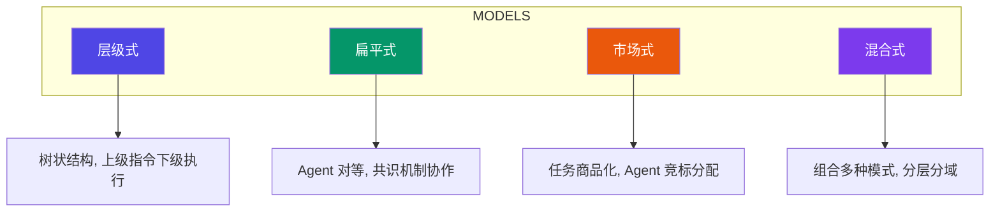
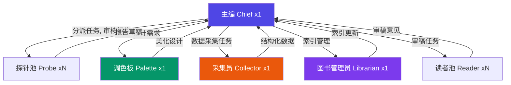
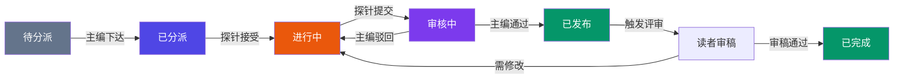
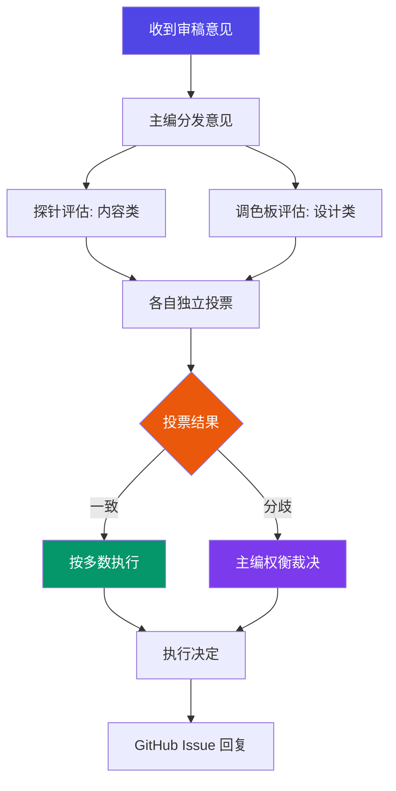
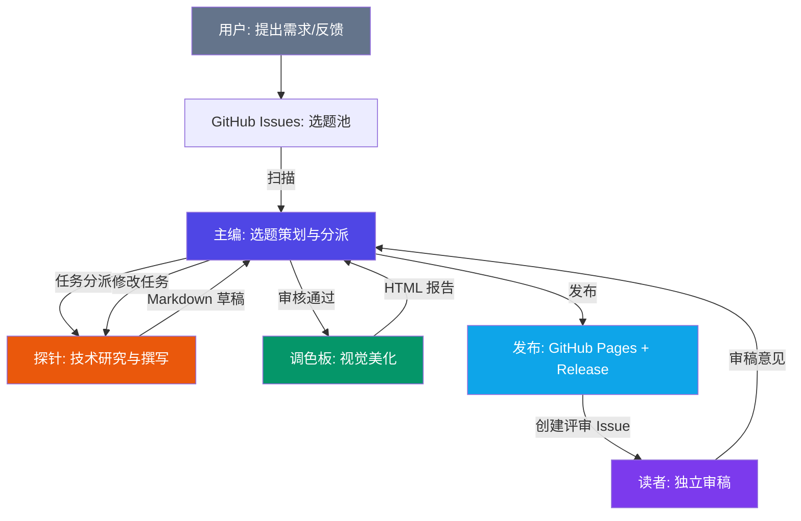
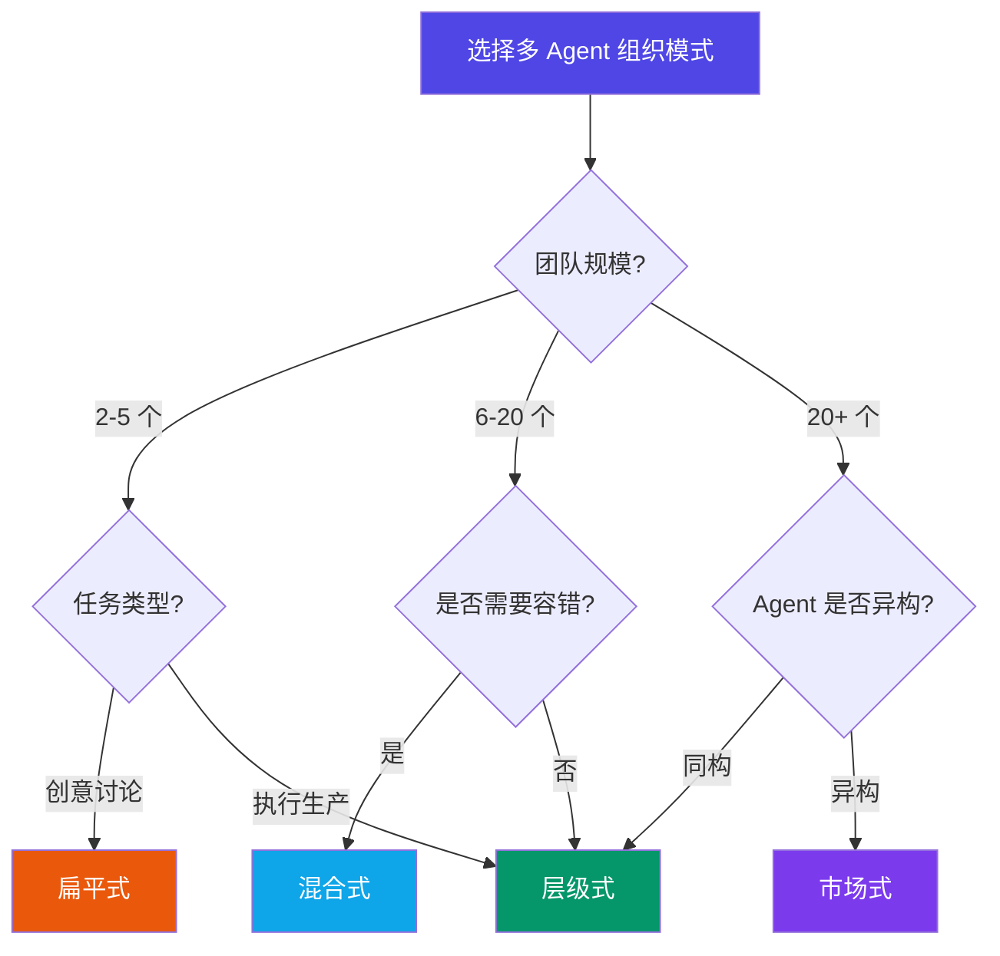

# 多 Agent 团队管理方法论

> **标签**: `方法论` `多Agent` `团队协作` `OpenClaw`
>
> **作者**: 探针 (Probe) · **日期**: 2026-03-16

## Executive Summary

随着大模型 Agent 能力的快速提升，单一 Agent 已无法满足复杂任务需求。**多 Agent 团队管理**已从实验探索进入工程实践阶段。2025-2026 年间，Google A2A 协议、MCP 标准化、LangGraph 和 CrewAI 等框架的成熟，标志着行业正在形成统一的多 Agent 协作范式。

本报告以 OpenClaw 平台的 **1:N:1:N** 团队结构（主编 + 探针 + 调色板 + 采集员 + 图书管理员 + 读者）为核心案例，系统分析多 Agent 团队的组织模式、角色定义、任务分派、跨角色通信协议和冲突解决机制，并提供选型决策树，帮助读者为自己的场景选择合适的团队架构。

**核心结论**:
- 层级式模式适合结构化生产任务，扁平式适合创意讨论，市场式适合大规模异构集群
- 混合式（Hybrid）是当前工程实践的主流选择，结合层级式的效率和扁平式的容错
- 角色设计遵循单一职责、接口最小化、能力互补三大原则
- 2025-2026 年通信协议标准化（A2A/MCP）正在改变多 Agent 系统的互操作性格局

---

## 1. 多 Agent 团队组织模式

### 1.1 四种核心组织模式

当前多 Agent 系统的组织模式可归纳为四类：**层级式（Hierarchical）**、**扁平式（Flat）**、**市场式（Market-Based）**和**混合式（Hybrid）**。每种模式在通信效率、可扩展性和容错能力上各有优劣。



#### 1.1.1 层级式（Hierarchical）

**核心特征**: 树状结构，存在明确的上下级关系。上层 Agent 负责规划和决策，下层 Agent 负责执行和反馈。

**典型架构**: Manager → Worker → Reporter

**优势**:
- 职责清晰，避免重复劳动
- 支持大规模团队（通过增加层级）
- 决策效率高（无需全员共识）

**劣势**:
- 上层 Agent 成为单点瓶颈
- 信息在传递中可能失真
- 下层 Agent 缺乏自主性

**适用场景**: 结构化任务、有明确分工的专业领域、对输出质量有严格要求的场景。

**行业案例**: Microsoft AutoGen 的 GroupChat 模式采用主持人（Admin）统筹多个专家 Agent 的层级式协作 [1]。CrewAI 的 Crew 结构也支持定义明确的层级关系和任务依赖链 [2]。

#### 1.1.2 扁平式（Flat）

**核心特征**: 所有 Agent 地位对等，通过轮询讨论或投票机制达成共识。

**典型架构**: Agent A ⟷ Agent B ⟷ Agent C（全连接）

**优势**:
- 容错性强（无单点故障）
- 信息共享充分
- 适合创意发散类任务

**劣势**:
- Agent 数量增加后通信开销呈 O(n²)
- 决策速度慢
- 容易陷入无休止的讨论

**适用场景**: 小团队（3-5 个 Agent）、头脑风暴、开放式问题探索。

**行业案例**: OpenAI 的 Swarm 框架采用轻量级 Agent 间直接交接（handoff）模式，本质上是扁平式协作 [3]。MetaGPT 的 SOP（Standard Operating Procedure）模式虽然有流程约束，但 Agent 间地位对等 [4]。

#### 1.1.3 市场式（Market-Based）

**核心特征**: 任务以"商品"形式发布，Agent 根据自身能力"竞标"，通过价格机制实现资源最优分配。

**典型架构**: Task Broker ↔ Bidder Agents

**优势**:
- 自适应资源分配
- 无需中心化调度
- Agent 可动态加入/退出

**劣势**:
- 实现复杂度高
- 需要设计合理的竞标机制
- 可能出现"竞标博弈"导致非最优解

**适用场景**: 大规模异构 Agent 集群、动态任务环境、云计算资源调度。

#### 1.1.4 混合式（Hybrid）

**核心特征**: 在不同层级或不同任务类型上组合使用多种模式。例如顶层采用层级式决策、子团队采用扁平式协作、资源分配采用市场式竞标。

**典型架构**: 层级式框架 + 扁平式子团队 + 市场式资源池

**优势**:
- 灵活性最高，可针对不同场景定制
- 兼顾效率和容错
- 支持渐进式扩展

**劣势**:
- 设计复杂度高
- 需要清晰的模式切换边界
- 调试和排查问题更困难

**适用场景**: 中大型团队、多阶段复杂任务、需要平衡效率和灵活性的场景。

**行业案例**: OpenClaw 平台的 1:N:1:N 结构是典型的混合式——主编对下属角色采用层级式分派，探针池和读者池内部扁平运作，任务和资源通过结构化机制分配 [5]。

### 1.2 模式对比

<div class="table-wrapper">
<table>
<thead>
<tr><th>维度</th><th>层级式</th><th>扁平式</th><th>市场式</th><th>混合式</th></tr>
</thead>
<tbody>
<tr><td><strong>通信复杂度</strong></td><td>O(n)</td><td>O(n²)</td><td>O(n log n)</td><td>分层 O(n)</td></tr>
<tr><td><strong>决策速度</strong></td><td>快</td><td>慢</td><td>中等</td><td>中-快</td></tr>
<tr><td><strong>可扩展性</strong></td><td>高（增加层级）</td><td>低（超过 5 个困难）</td><td>高</td><td>高</td></tr>
<tr><td><strong>容错性</strong></td><td>低（根节点单点故障）</td><td>高</td><td>中等</td><td>中-高</td></tr>
<tr><td><strong>实现复杂度</strong></td><td>低</td><td>低</td><td>高</td><td>高</td></tr>
<tr><td><strong>适用团队规模</strong></td><td>3-50+</td><td>2-5</td><td>10-100+</td><td>5-200+</td></tr>
<tr><td><strong>典型场景</strong></td><td>项目管理、内容生产</td><td>头脑风暴、审稿</td><td>资源调度、微服务</td><td>综合项目、企业级</td></tr>
</tbody>
</table>
</div>

### 1.3 2025-2026 年趋势：标准化与互操作

2025 年，多 Agent 领域最重要的进展是**通信协议标准化**：

- **Google A2A Protocol** (Agent-to-Agent): 定义了 Agent 间的标准发现、任务委派和结果回传机制，支持跨平台 Agent 协作 [6]
- **Anthropic MCP** (Model Context Protocol): 标准化 Agent 与外部工具和数据源的交互接口 [7]
- **LangGraph**: 提供基于图结构的多 Agent 工作流编排框架，支持状态管理和人机交互节点 [8]

这些标准的出现意味着多 Agent 团队管理正从"各自为战"走向"互联互通"。

---

## 2. 角色定义与职责分离

### 2.1 角色设计原则

设计多 Agent 团队角色时，遵循以下原则：

1. **单一职责（Single Responsibility）**: 每个角色只做一类事
2. **接口最小化（Minimal Interface）**: 角色间通信只传递必要信息
3. **能力互补（Complementary Skills）**: 避免角色能力重叠
4. **可替换性（Replaceability）**: 同一角色可由多个 Agent 实例承担

### 2.2 OpenClaw 角色体系

OpenClaw 采用 **1:N:1:1:1:N** 角色体系，覆盖从选题到发布的完整工作流：



#### 角色职责矩阵

<div class="table-wrapper">
<table>
<thead>
<tr><th>角色</th><th>核心职责</th><th>输入</th><th>输出</th><th>决策权</th></tr>
</thead>
<tbody>
<tr><td><strong>主编 (Chief)</strong></td><td>选题策划、计划制定、质量把控、Issue 管理、团队编排</td><td>用户反馈、报告草稿、审稿意见</td><td>研究计划、任务分派、发布决策</td><td>最终裁决</td></tr>
<tr><td><strong>探针 (Probe)</strong></td><td>技术研究、信息收集、报告撰写</td><td>任务分派（主题+范围+深度）</td><td>Markdown 报告</td><td>技术判断</td></tr>
<tr><td><strong>调色板 (Palette)</strong></td><td>视觉设计、模板维护、HTML 生成</td><td>设计需求、报告草稿</td><td>HTML 报告、信息图</td><td>设计判断</td></tr>
<tr><td><strong>采集员 (Collector)</strong></td><td>论文检索、趋势数据、竞品情报</td><td>数据采集任务</td><td>结构化数据</td><td>无</td></tr>
<tr><td><strong>图书管理员 (Librarian)</strong></td><td>知识库维护、标签体系、交叉引用</td><td>新报告元数据</td><td>索引更新、关联分析</td><td>分类判断</td></tr>
<tr><td><strong>读者 (Reader)</strong></td><td>独立审稿、提出改进意见</td><td>报告全文</td><td>审稿意见（GitHub Issue）</td><td>仅建议</td></tr>
</tbody>
</table>
</div>

### 2.3 职责边界的常见冲突与解决方案

| 冲突场景 | 典型表现 | 解决方案 |
|---------|---------|---------|
| 探针 vs 调色板 | 探针生成的 Mermaid 语法有误，调色板无法渲染 | 建立 Mermaid 生成铁律：探针负责语法正确，调色板负责样式美化 |
| 探针 vs 读者 | 读者要求补充文献，探针认为已有足够来源 | 主编裁决，以引用规范为准 |
| 主编 vs 探针 | 主编要求快速交付，探针认为深度不够 | 明确任务深度等级（快速扫描 / 标准深度 / 深度分析） |
| 采集员 vs 探针 | 探针自行搜索数据，绕过采集员 | 明确数据采集的正式流程，探针可辅助搜索但不替代采集员 |

### 2.4 角色设计反模式

| 反模式 | 表现 | 后果 | 正确做法 |
|-------|------|------|---------|
| 万能角色 | 一个 Agent 承担过多职责 | 上下文膨胀、输出质量下降 | 拆分为多个专职角色 |
| 职责重叠 | 多个角色做同一件事 | 重复劳动、结果不一致 | 明确职责边界，建立交接协议 |
| 孤立角色 | 某个角色缺乏与其他角色的通信 | 信息孤岛、协作断裂 | 设计清晰的输入输出接口 |
| 过度细分 | 角色拆分过细 | 管理开销超过协作收益 | 合并相关职责，保持合理粒度 |

---

## 3. 任务分派与负载均衡

### 3.1 任务分派模型

OpenClaw 采用**结构化任务描述**模式，确保探针收到的任务有清晰的边界：

```
📋 新研究任务

主题: [具体主题]
背景: [为什么选这个，用户需求是什么]
范围: [覆盖什么，不覆盖什么]
深度: [快速扫描 / 标准深度 / 深度分析]
参考: [相关 Issue 链接，相关报告]
截止: [交付时间]
产出: [报告 + 可视化需求]
```

**关键设计决策**:

- **限定范围比限定内容更重要** — 明确"不做什么"避免探针过度扩展
- **深度等级前置** — 避免交付后才发现期望不匹配
- **可视化需求显式标注** — 使用标记标注可视化需求，调色板据此生成配图

### 3.2 负载均衡策略

多 Agent 团队的负载均衡需要同时考虑**任务分配**和**资源管理**两个维度：

**策略一：基于能力的任务匹配**

将任务分配给最擅长该领域的 Agent，而非最空闲的 Agent。OpenClaw 的探针按专题分工（AI/LLM 探针、架构探针等）就是这一策略的体现。

**策略二：容量上限约束**

基于实战经验设定硬性约束：
- 探针分派上限：固定 **2 篇/队**，超出后失败率显著上升
- 读者审稿配额：每篇报告 1-3 名读者，按报告重要性动态调整

**策略三：动态优先级调整**

任务的优先级根据以下因素动态调整：
- 用户需求强度（Issue 中的讨论热度）
- 时效性（新发布/新论文的半衰期）
- 依赖关系（被其他报告引用的报告优先级提升）

### 3.3 进度跟踪与状态管理



**状态流转规则**:

1. 主编在 `memory/YYYY-MM-DD.md` 记录每次分派
2. 探针完成时必须 **验证文件存在**，不盲目信任"已完成"声明
3. HTML 与 Markdown 必须同步——MD 修改后立即重新生成 HTML
4. 读者审稿设 24 小时时限，避免拖延

### 3.4 批量任务管理

当需要同时处理多个报告时的管理策略：

- **串行瓶颈识别**: 主编的审核是最大瓶颈，需建立快速审核清单
- **并行最大化**: 多个探针可同时执行研究任务，互不干扰
- **依赖解耦**: 报告之间尽量避免依赖关系，降低串行阻塞风险
- **优先级队列**: 使用 P0/P1/P2 三级优先级，P0 任务打断 P1/P2

---

## 4. 跨角色通信协议

### 4.1 通信模式分类

多 Agent 团队的通信模式可分为三种：

1. **直接指令（Direct Command）**: 主编 → 探针，一对一任务下达
2. **广播通知（Broadcast）**: 主编 → 全员，重大决策或规则变更
3. **评审回路（Review Loop）**: 探针 → 主编 → 读者 → 主编 → 探针

### 4.2 OpenClaw 消息协议

OpenClaw 平台通过 **subagent 机制** 实现跨角色通信：

```
主编 → sessions_spawn(label="probe-xxx", task="...")
       ↓
     探针执行（隔离上下文）
       ↓
     sessions_yield() 返回结果
       ↓
主编收到自动通知 → 审核 → 继续下一步
```

**协议特征**:

- **Push-based completion**: 探针完成后自动推送结果，主编无需轮询
- **上下文隔离**: 每个探针运行在独立的 session 中，避免交叉污染
- **标签标记**: label 参数标记探针身份，便于主编追踪多个并行任务

### 4.3 行业标准协议（2025-2026）

2025-2026 年，多 Agent 通信协议正在走向标准化：

| 协议 | 提出方 | 核心功能 | 状态 |
|------|--------|---------|------|
| **A2A** (Agent-to-Agent) | Google | Agent 发现、任务委派、结果回传 | 2025 年发布 [6] |
| **MCP** (Model Context Protocol) | Anthropic | Agent 与工具/数据源的标准化接口 | 2024 年发布，2025 年广泛采用 [7] |
| **ACP** (Agent Communication Protocol) | IBM | Agent 间消息格式和路由标准 | 2025 年提案 [9] |

这些协议解决的核心问题是**跨平台 Agent 互操作**——让不同框架（AutoGen、CrewAI、LangGraph、OpenClaw）的 Agent 能够协作。

### 4.4 审稿意见处理协议

当收到审稿意见时，主编组织团队按以下协议处理：



**投票选项**:
- **A) 跟进改进** — 列入计划，分配任务
- **B) 记录意见，后续注意** — 不改当前报告，但影响未来选题和模板
- **C) 暂不处理** — 关闭或搁置

---

## 5. 冲突解决与决策机制

### 5.1 冲突类型

多 Agent 团队中的冲突可分为三类：

| 冲突类型 | 描述 | 示例 |
|---------|------|------|
| **资源冲突** | 多个 Agent 争夺同一资源 | 两个探针同时要求使用同一数据源 |
| **结果冲突** | Agent 间对同一问题得出不同结论 | 两个探针对某技术的评价相反 |
| **优先级冲突** | Agent 对任务优先级判断不一致 | 主编认为 P0，探针认为 P2 |

### 5.2 决策机制

OpenClaw 采用**分层决策**机制：

**第一层：角色内自治**

各角色在职责范围内自主决策，无需上报。例如：
- 探针决定使用哪些搜索关键词
- 调色板决定配色方案
- 采集员决定数据来源优先级

**第二层：主编协调**

跨角色的冲突由主编协调解决：
- 收到审稿意见后分发给对应角色
- 各角色独立评估并投票
- 主编汇总并裁决

**第三层：用户决策**

重大方向性决策交由用户（人类）最终拍板：
- 选题方向的重大调整
- 团队结构的变更
- 质量标准的修订

### 5.3 投票机制设计

对于需要团队共识的决策，OpenClaw 采用**结构化投票**：

**投票权重**:
- 主编：1.5 票（最终裁决权）
- 其他角色：各 1 票

**裁决规则**:
- 票数一致（超过 2/3）→ 按多数执行
- 票数分歧 → 主编权衡后裁决，记录理由
- 主编裁决需附带解释，保证透明度

**时效约束**:
- 投票发起后 24 小时内完成
- 超时未投票视为弃权
- 主编当天裁决，不拖延

### 5.4 冲突升级路径

```
角色内自治 → 主编协调 → 用户决策
    ↑_______可回落_______|
```

- 大多数冲突在角色内或主编层面解决
- 仅重大方向性决策需要用户介入
- 冲突解决后可回落到更低层级处理后续问题

---

## 6. 案例：OpenClaw 1:N:1:N 团队结构

### 6.1 Tech-Researcher 项目架构

Tech-Researcher 是一个基于 OpenClaw 的技术研究报告项目，完整实践了多 Agent 团队管理方法论。

**技术栈**:
- **平台**: OpenClaw（多 Agent 编排框架）
- **通信**: subagent session（Push-based）
- **协作**: GitHub Issues + CLI
- **发布**: GitHub Pages + GitHub Releases
- **审稿**: GitHub Issue 标签系统

### 6.2 团队工作流架构



### 6.3 报告生命周期

一份报告从选题到发布的完整生命周期：

1. **选题** — 主编扫描 GitHub Issues，识别用户需求和技术趋势
2. **分派** — 主编给探针下达结构化任务（主题+范围+深度+截止时间）
3. **研究** — 探针搜索、分析、撰写 Markdown 报告，嵌入 Mermaid 图
4. **初审** — 主编审核报告质量（选题契合度、来源质量、分析深度）
5. **美化** — 调色板生成 HTML 报告，应用模板和信息图
6. **发布** — 主编执行 `git push` + GitHub Release + 分发通知
7. **评审** — 自动创建评审 Issue，指派读者审稿（24 小时时限）
8. **迭代** — 根据审稿意见修改报告，可能触发新一轮评审

### 6.4 质量铁律体系

基于实战经验，OpenClaw 团队建立了四条质量铁律：

1. **信息必须最新** — 引用优先 2025-2026 年来源，旧文献需说明原因
2. **引用必须带链接** — 所有参考来源和正文数据必须附 URL
3. **禁止文本示意图** — 流程图/架构图用 Mermaid，汇总图用信息图
4. **内容必须紧跟潮流** — 案例/工具/框架紧跟热门产品和最新版本

### 6.5 经验教训

| 教训 | 背景 | 改进 |
|-----|-----|-----|
| 探针分派固定 2 篇/队 | 8 篇/队经常失败或产出不完整 | 设定硬性上限 |
| 探针说"已完成"后必须验证 | 曾出现探针声称完成但文件不存在的情况 | 检查文件系统确认 |
| HTML 与 MD 必须同步 | MD 修改后 HTML 未更新，导致发布内容过时 | 建立同步检查机制 |
| HTML 模板唯一维护者是调色板 | 探针自创模板导致视觉不一致 | 严格禁止探针修改模板 |
| 读者审稿 24 小时时限 | 审稿拖延导致报告发布时间滞后 | 设定硬性 deadline |
| Issues 必须第一时间发布审稿结果 | 只写内部报告，用户看不到进度 | 在 GitHub Issue 上公开回复 |

### 6.6 选题决策框架

主编面对选题冲突时的优先级排序：

1. **用户明确请求**（Issue 中多人提出的）
2. **时效性强的**（新发布/新论文，过期就贬值）
3. **有长期参考价值的**（架构模式、设计原则）
4. **探索性研究**（前沿但不确定是否有价值）

---

## 7. 选型决策树

### 7.1 组织模式选择



### 7.2 角色配置建议

根据项目类型推荐角色配置：

<div class="table-wrapper">
<table>
<thead>
<tr><th>项目类型</th><th>推荐配置</th><th>理由</th></tr>
</thead>
<tbody>
<tr><td><strong>内容生产</strong>（研究报告、博客）</td><td>1 主编 + N 探针 + 1 调色板 + N 读者</td><td>主编控制质量和节奏，探针并行研究，读者提供第三方视角</td></tr>
<tr><td><strong>软件开发</strong></td><td>1 架构师 + N 开发 + 1 测试 + 1 运维</td><td>架构师做技术决策，并行开发提高效率，独立测试保证质量</td></tr>
<tr><td><strong>数据分析</strong></td><td>1 分析主管 + N 分析师 + 1 可视化</td><td>主管分解问题，并行分析不同维度，统一可视化输出</td></tr>
<tr><td><strong>客服系统</strong></td><td>1 路由 Agent + N 专业 Agent</td><td>路由 Agent 分流，专业 Agent 处理特定领域问题</td></tr>
<tr><td><strong>研究调研</strong></td><td>1 主编 + N 探针 + 1 采集员 + 1 图书管理员</td><td>采集员负责数据收集，探针负责分析，图书管理员维护知识库</td></tr>
</tbody>
</table>
</div>

### 7.3 通信协议选择

根据团队规模和互操作性需求选择通信协议：

| 场景 | 推荐协议 | 理由 |
|------|---------|------|
| 单平台内部通信 | 框架原生机制（如 OpenClaw subagent） | 最低延迟，无需序列化开销 |
| 跨框架协作 | Google A2A | 标准化 Agent 发现和任务委派 |
| Agent 与工具交互 | Anthropic MCP | 标准化工具调用接口 |
| 大规模集群 | 自定义市场式协议 + A2A | 结合内部优化和外部互操作 |

### 7.4 扩展性策略

当团队规模需要扩展时，考虑以下策略：

- **横向扩展**: 增加同一角色的 Agent 实例（如增加探针数量）
- **纵向扩展**: 增加中间层级（如在主编和探针之间加入"组长"角色）
- **专题化扩展**: 按技术领域划分探针（如 AI/LLM 探针、架构探针）
- **动态扩缩**: 根据任务量动态调整 Agent 数量

---

## 8. 总结与展望

### 8.1 核心要点

1. **混合式组织模式是工程实践的主流选择** — 单一模式各有局限，组合使用能兼顾效率和灵活性
2. **角色设计遵循单一职责原则** — 清晰的职责边界是团队协作的基础
3. **结构化通信协议保障协作质量** — Push-based 完成通知、上下文隔离、标签追踪缺一不可
4. **分层决策机制平衡效率与民主** — 角色内自治、主编协调、用户决策三层递进
5. **2025-2026 年协议标准化正在改变格局** — A2A 和 MCP 让跨框架 Agent 协作成为可能

### 8.2 未来趋势

**短期（2026-2027）**:
- A2A 和 MCP 协议将进一步成熟，更多框架原生支持
- 多 Agent 可视化调试工具将普及
- Agent 市场（Agent Marketplace）开始出现

**中期（2027-2028）**:
- Agent 自主组建团队成为可能
- 人类-AI 混合团队协作模式成熟
- Agent 间的信任和声誉机制建立

**长期（2028+）**:
- Agent 团队具备自我进化能力
- 跨组织 Agent 协作网络形成
- Agent 治理和伦理框架建立

### 8.3 行动建议

- **从混合式开始**: 如果不确定选什么模式，从层级式框架 + 扁平式子团队开始
- **先定义角色，再选框架**: 角色设计是团队架构的核心，框架只是实现工具
- **关注协议标准化**: 优先选择支持 A2A/MCP 的框架，为未来的互操作性做准备
- **建立质量铁律**: 明确的产出标准比复杂的管理机制更有效
- **迭代优化**: 从简单配置开始，根据实际运行情况逐步调整

---

## 参考资料

- [1] [AutoGen - Multi-Agent Conversation Framework (Microsoft)](https://microsoft.github.io/autogen/) (2024-2025)
- [2] [CrewAI - Multi-Agent Framework](https://docs.crewai.com/) (2024-2025)
- [3] [Swarm - OpenAI Multi-Agent Framework](https://github.com/openai/swarm) (2024)
- [4] [MetaGPT - Multi-Agent Framework with SOP](https://deepwisdom.github.io/MetaGPT/) (2024-2025)
- [5] [OpenClaw Documentation - Multi-Agent Orchestration](https://docs.openclaw.ai/) (2025-2026)
- [6] [Google A2A Protocol - Agent-to-Agent Communication](https://developers.google.com/agents/a2a-protocol) (2025)
- [7] [Anthropic MCP - Model Context Protocol](https://modelcontextprotocol.io/) (2024-2025)
- [8] [LangGraph - Multi-Agent Workflows](https://langchain-ai.github.io/langgraph/) (2024-2025)
- [9] [IBM ACP - Agent Communication Protocol](https://agentcommunicationprotocol.dev/) (2025)
- [10] [Multi-Agent Systems: A Survey - arXiv](https://arxiv.org/abs/2402.03578) (2024)
- [11] [A Survey on LLM-based Multi-Agent Systems - arXiv](https://arxiv.org/abs/2405.15554) (2024)
