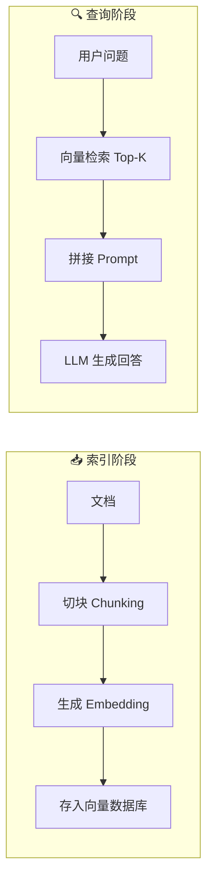
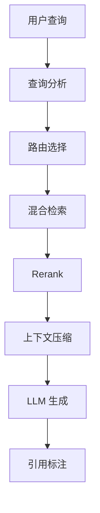

# RAG 架构设计模式全解析

## Executive Summary

检索增强生成（Retrieval-Augmented Generation, RAG）已成为大模型落地的核心架构模式。本文系统梳理 RAG 从 Naive 到 Modular 的三代演进，分析稠密/稀疏/混合检索策略的优劣，探讨分块与 Embedding 选型要点，并总结生产环境中的关键挑战与解决方案。

---

## 1. RAG 三代架构演进

### 1.1 Naive RAG（朴素 RAG）

最基础的"检索-阅读"范式：



1. **索引阶段**: 将文档切块 → 生成 Embedding → 存入向量数据库
2. **查询阶段**: 用户问题 → 向量检索 Top-K → 拼接 Prompt → LLM 生成回答

**优点**: 架构简单，易于实现
**缺点**: 检索质量直接决定回答质量，无法处理复杂查询

### 1.2 Advanced RAG（高级 RAG）

在 Naive RAG 基础上增加预处理和后处理优化：

**检索前优化**:
- 查询改写（Query Rewriting）
- 查询扩展（Query Expansion）
- HyDE（假设性文档生成）

**检索中优化**:
- 混合检索（稠密 + 稀疏）
- 元数据过滤
- Parent-Child 分块策略

**检索后优化**:
- Reranking（重排序）
- 上下文压缩
- 去重与合并

### 1.3 Self-RAG 与 CRAG（自我纠正型 RAG）

**Self-RAG**（Self-Reflective Retrieval-Augmented Generation）通过引入**反思标记（Reflection Tokens）** 让模型自主决定是否需要检索、评估检索结果的相关性，并自我纠正回答质量。与传统 RAG 不同，Self-RAG 不依赖固定的检索管道，而是让模型在生成过程中动态决策。

- 核心创新：检索决策 + 相关性评估 + 支持度评估 全部由模型自身完成
- 优势：减少不必要的检索开销，提高回答忠实度
- 论文：Asai, A. et al. "Self-RAG: Learning to Retrieve, Generate, and Critique through Self-Reflection" (2023) — [arXiv:2310.11511](https://arxiv.org/abs/2310.11511)

**CRAG**（Corrective Retrieval-Augmented Generation）在检索后增加了一个**纠正模块**，对检索结果进行质量评估，并根据评估结果采取不同策略（直接使用 / 纠正后使用 / 重新检索），显著提升了低质量检索场景下的回答准确性。

- 核心创新：轻量级检索评估器 + 纠正策略（正确/模糊/错误）
- 优势：对噪声检索结果鲁棒性强
- 论文：Yan, S. et al. "Corrective Retrieval Augmented Generation" (2024) — [arXiv:2401.15884](https://arxiv.org/abs/2401.15884)

### 1.4 Modular RAG（模块化 RAG）

最新趋势：将 RAG 系统拆解为可插拔模块：

| 模块 | 功能 | 代表实现 |
|------|------|---------|
| Routing | 查询路由到不同数据源 | LangChain RouteChain |
| Retrieval | 多策略检索器 | LlamaIndex Retrievers |
| Memory | 对话历史记忆 | Mem0, Zep |
| Post-processing | 检索后处理 | Cohere Rerank |
| Generation | 带引用生成 | LangChain RAG Chain |

---

## 2. 检索策略深度对比

### 2.1 稠密检索（Dense Retrieval）

基于 Embedding 向量相似度：

- **模型**: OpenAI text-embedding-3, BGE, E5, GTE
- **优点**: 语义匹配强，能处理同义词和意译
- **缺点**: 计算开销大，可能遗漏关键词精确匹配

### 2.2 稀疏检索（Sparse Retrieval）

基于词频统计（BM25 为代表）：

- **优点**: 关键词精确匹配，速度快，可解释性强
- **缺点**: 无法处理语义相似但用词不同的场景

### 2.3 混合检索（Hybrid Search）

结合两者优势，业界主流方案：

```
最终得分 = α × 稠密相似度 + (1-α) × BM25 得分
```

**典型 α 值**: 0.5-0.7（偏向语义匹配）— *经验值参考，建议根据具体场景通过评估调优*

**实现方案**:
- Milvus: 内置混合检索
- Elasticsearch 8+: dense_vector + BM25
- Weaviate: Hybrid search 原生支持

---

## 3. 分块策略与 Embedding 选型

### 3.1 分块策略

| 策略 | 适用场景 | 优缺点 |
|------|---------|--------|
| 固定大小 | 通用文档 | 简单但可能截断语义 |
| 递归分割 | 结构化文档 | 按层级切分，保留上下文 |
| 语义分块 | 长文档 | 按主题变化切分，质量高 |
| Parent-Child | 需要上下文 | 检索小块，返回大块 |
| Proposition | 精确检索 | 拆分为原子命题 |

### 3.2 Embedding 选型指南

**闭源方案**:
- OpenAI text-embedding-3-large: 通用最强，3072 维
- OpenAI text-embedding-3-small: 性价比高，1536 维
- Cohere embed-v3: 多语言优秀

**开源方案**:
- BGE-M3: 多语言 + 多粒度，支持稠密+稀疏
- E5-mistral-7b: 大模型蒸馏，质量高
- GTE-Qwen2: 中文表现优秀

**选型建议**:
- 英文为主 → OpenAI 或 Cohere
- 中文为主 → BGE-M3 或 GTE-Qwen2
- 需要私有部署 → BGE-M3 (onnx)
- 多语言混合 → BGE-M3

---

## 4. RAG 评估方法

### 4.1 RAGAS 框架

最流行的 RAG 评估框架，四大核心指标：

| 指标 | 评估维度 | 计算方式 |
|------|---------|---------|
| Faithfulness | 忠实度 | 回答是否基于检索内容 |
| Answer Relevancy | 相关性 | 回答是否切题 |
| Context Precision | 上下文精度 | 检索内容是否相关 |
| Context Recall | 上下文召回 | 是否检索到足够信息 |

### 4.2 评估实践

```python
from ragas import evaluate
from ragas.metrics import faithfulness, answer_relevancy

result = evaluate(
    dataset,
    metrics=[faithfulness, answer_relevancy],
    llm=eval_llm,
    embeddings=eval_embeddings
)
```

---

## 5. 生产环境挑战与解决方案

### 5.1 常见问题

**检索失败**: 查询与文档粒度不匹配
- 解决: 多粒度索引 + 查询路由

**幻觉**: LLM 编造检索中不存在的内容
- 解决: 强制引用 + 事实校验链

**延迟过高**: 检索 + 生成链路长
- 解决: 缓存 + 异步 + 流式输出

**数据新鲜度**: 知识库更新不及时
- 解决: 增量索引 + 定期重建

### 5.2 架构建议



---

## 参考来源

1. Gao, Y. et al. "Retrieval-Augmented Generation for Large Language Models: A Survey" (2023) — [arXiv:2312.10997](https://arxiv.org/abs/2312.10997)
2. Asai, A. et al. "Self-RAG: Learning to Retrieve, Generate, and Critique through Self-Reflection" (2023) — [arXiv:2310.11511](https://arxiv.org/abs/2310.11511)
3. Yan, S. et al. "Corrective Retrieval Augmented Generation" (2024) — [arXiv:2401.15884](https://arxiv.org/abs/2401.15884)
4. RAGAS Documentation — https://docs.ragas.io/
5. LlamaIndex RAG Guide — https://docs.llamaindex.ai/
6. LangChain RAG Tutorial — https://python.langchain.com/docs/tutorials/rag/
7. Wei, Z. et al. "Dense Passage Retrieval for Open-Domain Question Answering" (2020) — Facebook AI Research — [arXiv:2004.04906](https://arxiv.org/abs/2004.04906)
